# Від доказів до істини: чому сертифіковані блокчейни визначатимуть нову еру банківської довіри

**Незмінний не означає надійний.** Оскільки оптовий банкінг переходить до розрахунків у реальному часі та ймовірнісного ШІ, реєстр, який вирішує, що є істиною, став тим єдиним рівнем, який банки досі не можуть сертифікувати. Вони сертифікують установу за Basel III, хмару за ISO 27001 та свій ШІ за ISO 42001, але розподілений реєстр, його управління, консенсус, криптографію та смартконтракти залишають на розсуд припущень конкретного постачальника. У цьому звіті стверджується, що закриття цього фідуціарного розриву вимагає переходу від настанов ISO/IEC TC 307 до приписового гарантування: оцінювання реєстру за 5-рівневим Індексом сертифікованого блокчейну, що перетворює інженерні метрики на істину, придатну для аудиту радою та захисту за DORA.

<!-- lead-start -->
<aside class="post-lead" aria-label="Стислий зміст статті">

<strong>Коротко.</strong> Банки сертифікують установу, хмару та свій ШІ, але не реєстр, який дедалі більше визначає, що є істиною. ISO/IEC TC 307 дає настанови, а не гарантування. 5-рівневий Індекс сертифікованого блокчейну оцінює управління реєстром, цілісність консенсусу, ідентичність і криптографію, гарантування смартконтрактів та спостережуваність за моделлю зрілості можливостей, закриваючи фідуціарний розрив і надаючи ймовірнісному ШІ детермінований аудиторський хребет.

<strong>Ключові висновки</strong>

<ul class="post-lead-takeaways">
  <li><strong>Фідуціарний фрикційний розрив.</strong> Банк (Basel III), хмару (ISO 27001) та систему управління ШІ (ISO 42001) можна сертифікувати; розподілений реєстр, який вирішує, що є істиною, поки що ні. Ця асиметрія є реальною операційною вразливістю.</li>
  <li><strong>DORA робить це персональним.</strong> За DORA Article 5 ради директорів банків несуть пряму, неделеговану відповідальність за стійкість розгортань третіх сторін і реєстрів, з персональними санкціями SM&amp;CR за провал.</li>
  <li><strong>Аудиторський хребет ШІ.</strong> Машинне навчання не є відтворюваним; сертифікований блокчейн детерміновано фіксує версії моделей, вхідні дані та рішення щодо валідації в ланцюгу, відповідаючи ISO 42001 та стандартам управління модельним ризиком.</li>
  <li><strong>Індекс сертифікованого блокчейну.</strong> Управління, консенсус, криптографія, смартконтракти та спостережуваність стають оцінною карткою CMM від 0 до 5, що перекладає інженерні метрики на затверджені радою Заяви про апетит до ризику.</li>
</ul>

<strong>Додаткове читання:</strong> <a href="https://sebastienrousseau.com/2026-07-02-certified-blockchains-banking-trust-tc307-assurance-2026">Сертифіковані блокчейни та банківська довіра: гарантування TC 307</a>, <a href="https://sebastienrousseau.com/2026-07-24-global-payments-outlook-operating-model-risk-revenue">Глобальний огляд платежів 2026 року</a>.

</aside>
<!-- lead-end -->

> **Стислий огляд для керівництва**
>
> - **Оптовий банкінг перебуває в точці перелому.** Кліринг у реальному часі та ймовірнісний ШІ руйнують аналогову, ретроспективну модель гарантування: статичні аудити на рівні установи більше не відповідають сучасним вимогам управління ризиками чи фідуціарним вимогам.
> - **TC 307 є базовим рівнем, а не сертифікатом.** ISO/IEC TC 307 стандартизував словник, референсну архітектуру та настанови з безпеки для розподілених реєстрів, але він є описовим. Він визначає, який вигляд має належне; він не забезпечує приписової перевірки, потрібної ризик-менеджерам і наглядовим органам для авторизації промислового розгортання.
> - **Гарантування означає оцінювання реєстру.** Управління, цілісність консенсусу, безпека смартконтрактів і криптографічна гнучкість, оцінені за суворою 5-рівневою моделлю зрілості можливостей, переводять банки від клаптикових припущень конкретного постачальника до сертифікованої фінансової істини, придатної для аудиту радою.
> - **Реєстр є аудиторським хребтом для ШІ.** Прив'язування версій моделей, вхідних даних і рішень щодо валідації до детермінованого консенсусу надає невідтворюваному машинному навчанню захисний, відтворюваний доказовий запис за ISO 42001, SR 11-7 та PRA SS1/23.

## Фідуціарний фрикційний розрив у цифровому банкінгу

У класичному банкінгу довіра є реляційною, інституційною та ретроспективною. Вона залежить від незалежних, сторонніх аудиторів, які переглядають фінансовий стан у статичні моменти часу, узгоджуючи розбіжності між двосторонніми силосами реєстрів. На ринках 2026 року, керованих API та працюючих у реальному часі, ця модель спричиняє неприпустимі затримки та структурні ризики.

Коли транзакції розраховуються миттєво, внутрішньоденні пули ліквідності динамічно керуються шлюзами API, а власність на активи токенізується у спільних реєстрах, ретроспективні аудити стають криміналістичними вправами, а не превентивними контролями. Фідуціари більше не можуть покладатися виключно на сертифікацію корпоративної установи. Вони мусять сертифікувати сам цифровий субстрат.

Наразі банки працюють в умовах кричущої архітектурної асиметрії:

1. **Сертифікована хмарна інфраструктура**: Апаратні вузли, віртуалізовані контейнери та фізичні центри обробки даних перевіряються за контролями ISO/IEC 27001 та SOC 2 Type II.  
2. **Сертифіковані процеси управління**: Політики операційного ризику, плани безперервності бізнесу та алгоритмічні розгортання регулюються за суворими рамками ризику.  
3. **Несертифіковані рушії реєстрів**: Основні механізми розподіленого консенсусу, ланцюги постачання вузлів-валідаторів, межі смартконтрактів і моделі управління мережею залишаються на розсуд несертифікованих, кастомних або консорціум-специфічних припущень.

Ця асиметрія є головною точкою відмови. Банк може запускати перевірений застосунок усередині безпечного, сертифікованого за ISO 27001 хмарного контейнера, але якщо цей контейнер записує до розподіленого реєстру з централізованим контролем валідаторів, вразливими параметрами консенсусу чи неаудитованими смартконтрактами, цілісність транзакції скомпрометована. Щоб подолати цей розрив, сам рушій реєстру має стати сертифікованим об'єктом гарантування.

## Базовий рівень стандартизації ISO/IEC TC 307

Фундаментальну роботу, потрібну для стандартизації розподілених реєстрів, здійснює Технічний комітет ISO/IEC 307 (TC 307\) (Блокчейн і технології розподіленого реєстру). Замість того щоб розглядати блокчейн як ізольований технічний протокол, TC 307 трактує його як інституційну інфраструктуру довіри, організовуючи свою роботу навколо п'яти основних стовпів:

1. **Таксономія та словник (ISO 22739\)**: Встановлює спільну номенклатуру, забезпечуючи узгоджені юридичні та операційні визначення в різних юрисдикціях, фінансових схемах та установах.  
2. **Референсна архітектура (ISO/TR 23245\)**: Визначає межі, рівні, потоки даних і функціональні компоненти сумісної системи розподіленого реєстру.  
3. **Безпека, приватність і смартконтракти (ISO/TR 23244 / ISO 23613\)**: Встановлює базові настанови з безпеки для систем цифрових активів і докладно описує найкращі практики пом'якшення вразливостей смартконтрактів та управління їхнім життєвим циклом.  
4. **Рамки інтероперабельності**: Розглядають механізми обміну даними та активами між гетерогенними мережами реєстрів, запобігаючи формуванню ізольованих токенізованих силосів.  
5. **Децентралізована ідентичність і якорі довіри**: Інтегрує криптографічні ідентифікатори на базі реєстру з формальними інфраструктурами відкритих ключів (PKI) та державно санкціонованими реєстрами.

У сукупності TC 307 сигналізує про перехід DLT від кастомного інженерного вибору до стандартизованої архітектурної дисципліни. Однак TC 307 залишається переважно описовим. Він визначає, який вигляд має належне (настанови), але не забезпечує приписового протоколу перевірки (гарантування), потрібного ризик-менеджерам і наглядовим органам для авторизації промислових розгортань критичних чи важливих функцій (CIFs).

## Настанови проти гарантування: фідуціарна відмінність

Учасники фінансового ринку не впроваджують технологію тому, що вона інноваційна чи елегантна; вони впроваджують її, коли нею можна керувати, її можна аудитувати, захищати та узгоджувати з вимогами до резервного капіталу. Саме тому стандартизація в банкінгу природно розкладається на два рівні:

* **Настанови (рамка)**: Окреслюють найкращі практики, референсні цілі та архітектурні орієнтири (напр., ISO/IEC TC 307, рамки NIST).  
* **Гарантування (доказ)**: Надає незалежні, безперервні та перевірювані третьою стороною докази того, що рамку впроваджено та вона працює як задумано (напр., сертифікація ISO 27001, аудити SOC 2, наглядові перевірки).

Покладатися на несертифікований консенсус реєстру, сертифікуючи водночас хмарну інфраструктуру, є критичною регуляторною прогалиною. Блокчейн, який є «незмінним», не обов'язково є «інституційно надійним». Незмінність лише гарантує, що внесені дані не змінено; вона не перевіряє, чи є вузли-валідатори захищеними, чи стійкий протокол консенсусу до змови, чи математично надійна логіка смартконтрактів, чи відповідає управління криптографічними ключами постквантовим мандатам.

Щоб закрити цей розрив, Індекс сертифікованого блокчейну 2026 року формалізує ці вимоги у вимірювану модель зрілості можливостей (CMM), відображену на глобальні банківські регуляції.

## Індекс сертифікованого блокчейну 2026 року

Щоб дати змогу вищому керівництву оцінювати та сертифікувати свої платформи реєстрів, цей індекс структурує інфраструктуру розподіленого реєстру на п'ять аудитованих операційних рівнів, оцінюваних за шкалою CMM від 0 до 5.

### Таблиця 1: Архітектура Індексу сертифікованого блокчейну

| Рівень індексу | Рівень зрілості можливостей (CMM) | Технічна та операційна метрика | Регуляторний / фідуціарний контрольний орієнтир |
| ---- | ---- | ---- | ---- |
| **Управління реєстром** | **Рівень 0**: Спонтанний консорціум**Рівень 3**: Автоматизована перевірка та ротація валідаторів**Рівень 5**: Децентралізоване, багатостороннє криптографічне закріплення ідентичності | % вузлів-валідаторів, керованих перевіреними фінансовими установами; середній час вирішення спорів між валідаторами; географічний розподіл вузлів | **DORA Article 5** (управління та організація); **CPMI-IOSCO PFMI Principle 2** (управління) та **Principle 3** (рамка комплексного управління ризиками) |
| **Цілісність консенсусу** | **Рівень 0**: Одновузловий або непрозорий POW**Рівень 3**: Аудитований BFT з детермінованою остаточністю**Рівень 5**: Багатоюрисдикційний, формально верифікований консенсус із безперервним моніторингом затримок | Максимально прийнятна затримка консенсусу; поріг стійкості до змови; SLA доступності за симульованого розділення вузлів | **DORA Article 6** (рамка управління ІКТ-ризиками); **CPMI-IOSCO PFMI Principle 8** (остаточність розрахунків) |
| **Ідентичність і криптографія** | **Рівень 0**: Слабкі ключі RSA / ECDSA**Рівень 3**: Мультипідпис з управлінням ключами на базі HSM**Рівень 5**: Квантово-стійкі гібридні ключі (FIPS 203 ML-KEM) та шлюзи приватності з нульовим розголошенням | % транзакцій реєстру, підписаних ключами на базі HSM; оцінка готовності до міграції на PQC; затримка ZK-доказів | **NIST FIPS 203 / 204**; **ISO/IEC 27001** (управління інформаційною безпекою) |
| **Гарантування смартконтрактів** | **Рівень 0**: Неаудитовані скрипти Solidity**Рівень 3**: Автоматизована валідація компілятора та зовнішній аудит**Рівень 5**: Формально верифіковані, незмінні смартконтракти з оновленнями типу «запобіжник» | % смартконтрактів із математичною формальною верифікацією; кількість попереджень компілятора; охоплення сканування вразливостей | **EBA Guidelines on Outsourcing Arrangements** (пункти 81, 113-117); **DORA Article 30** (мінімальні договірні положення) |
| **Аудит і спостережуваність** | **Рівень 0**: Ручне вибирання логів**Рівень 3**: Структуровані трейси OTel та вузли-аудитори лише для читання**Рівень 5**: Автоматизоване, безперервне узгодження з реєстром за Article 8 | % транзакцій, охоплених трейсами OpenTelemetry; затримка від фіксації блока реєстру до синхронізації вузла-аудитора | **BCBS 239** (агрегація даних про ризики); **DORA Article 8** (реєстр інформації / схеми ITS) |

### Таблиця 2: Ключові сигнали довіри у відображенні на глобальні банківські стандарти

| Сигнал / бенчмарк | Метрика | Вплив на банківські платформи | Регуляторне джерело |
| ---- | ---- | ---- | ---- |
| **Прогрес ISO/IEC TC 307** | Перехід від технічних звітів ISO/TR до формальних схем сертифікації | Встановлює першу стандартизовану рамку для сертифікації рушіїв розподіленого реєстру | **ISO/IEC JTC 1 / SC 44** (технології розподіленого реєстру) |
| **Фаза прототипу Project Agorá** | 40+ комерційних банків-учасників; тестування єдиного реєстру токенізованих депозитів | Перехід транскордонного клірингу від обміну повідомленнями (SWIFT) до атомарних токенізованих розрахунків | **Інноваційний хаб Банку міжнародних розрахунків (BIS)** |
| **Аудит третіх сторін за DORA Article 30** | 100% провайдерів вузлів та хостів інфраструктури аудитовано за критеріями безпеки | Усуває «тіньові вузли-валідатори»; вимагає повної прозорості ланцюга постачання | **Європейські наглядові органи (ESA)** |
| **ISO/IEC 42001 (управління ШІ)** | Криптографічно унезмінені моделі ШІ та журнали навчання в ланцюгу | Використовує блокчейн як незмінний доказовий реєстр («аудиторський хребет») для машинного навчання | **ISO/IEC 42001:2023** (інформаційні технології, штучний інтелект) |
| **Достатність капіталу за Basel III** | Зниження буферів капіталу під операційний ризик на основі документованого зменшення складності | Стандартизовані рамки операційного ризику прямо зараховують перевірену стійкість реєстру | **Базельський комітет з банківського нагляду (BCBS)** |

## Аудиторський хребет ШІ: ймовірнісний інтелект на детермінованій інфраструктурі

Однією з найпотужніших стратегічних ролей сертифікованого блокчейну у 2026 році є виконання функції **«аудиторського хребта»** для розгортань штучного інтелекту. Сучасні фінансові системи дедалі більше є ймовірнісними. Кредитний скоринг, виявлення шахрайства в реальному часі, алгоритмічна торгівля та автономні взаємодії з клієнтами керуються моделями машинного навчання, які еволюціонують, дрейфують і адаптуються з часом. Ці моделі є недетермінованими: за однакового вхідного сигналу у два різні моменти часу вони можуть давати різні результати через динамічні ваги та безперервне навчання.

Ця недетермінованість створює глибокий виклик управлінню за стандартами **ISO/IEC 42001 (управління ШІ)** та **управління модельним ризиком (MRM)** (як-от **US Federal Reserve SR 11-7** і **UK PRA SS1/23**): *як аудитувати, пояснювати та захищати рішення, які не є строго відтворюваними?*

Сертифікований розподілений реєстр забезпечує детерміновану противагу. Хоча моделі ШІ працюють імовірнісно, сертифікований блокчейн детерміновано фіксує їхні параметри, встановлюючи незмінний доказовий хребет:

* **Версіонування моделей і закріплення ваг**: Кожну розгорнуту версію моделі, її пов'язані ваги та контрольні суми навчальних даних хешують і записують до реєстру під час збирання, задовольняючи вимоги ланцюга постачання **SLSA Level 3**.  
* **Контекстне журналювання вхідних даних**: Коли модель ШІ ухвалює критичне рішення (напр., схвалення кредиту чи позначення транзакції), точні контекстні вхідні дані та хеші моделі записуються до реєстру, створюючи історію із захистом від підробки.  
* **Аудитованість без доступу до коду**: Якщо регулятор запитує: «Чому ваша модель відхилила цю кредитну заявку 3 червня?», банку не потрібно розкривати пропрієтарний код чи намагатися відтворити точний стан моделі. Він надає криптографічно підписаний запис реєстру в ланцюгу про вхідні дані, ваги та стан валідації.

Прив'язуючи ймовірнісні рішення моделей машинного навчання до детермінованого консенсусу сертифікованого блокчейну, установа створює захисну, відтворювану та незалежно перевірювану хронологію автоматизованих дій.

## Візуалізація сертифікованого конвеєра «від консенсусу до аудиту»

Наведена нижче діаграма послідовності ілюструє життєвий цикл транзакції, що проходить через платформу сертифікованого блокчейну, демонструючи, як шлюзи валідації, цілісність консенсусу, виконання смартконтрактів та емісія телеметрії поєднуються, щоб створити готові для ради регуляторні докази:

```mermaid
sequenceDiagram
    autonumber
    actor Client as Bank Client / Gateway
    participant Node as Certified Validator Node
    participant Engine as Consensus Engine (BFT)
    participant Contract as Formally Verified Smart Contract
    participant Auditor as Regulator / Auditor Node
    participant Telemetry as OpenTelemetry Pipeline
    rect rgb(240, 240, 255)
        Note over Client,Node: Phase 1: Cryptographic Ingress and Identity
        Client->>Node: Submit Transaction (signed with HSM-backed key)
        Node->>Node: Validate signature against TC 307 Decentralised Identity
    end
    rect rgb(240, 255, 240)
        Note over Node,Contract: Phase 2: Formally Verified Execution
        Node->>Contract: Invoke Transaction Logic
        Contract->>Contract: Execute within formally verified parameters (CMM Level 5)
    end
    rect rgb(255, 240, 240)
        Note over Contract,Engine: Phase 3: Deterministic Consensus Finality
        Contract->>Engine: Commit State Change
        Engine->>Engine: Resolve Byzantine Fault Tolerance (BFT) Consensus
        Engine->>Engine: Commit Block to Ledger Spine
    end
    rect rgb(255, 255, 240)
        Note over Engine,Telemetry: Phase 4: Observability and Compliance Emission
        Engine-->>Auditor: Sync Block State (real-time read-only Auditor node)
        Engine-->>Telemetry: Emit OpenTelemetry traces (latency, state metrics, validation status)
        Telemetry->>Telemetry: Record evidence to DORA Article 8 Register of Information
    end
```

Критичний шлях цієї транзакційної послідовності вимагає, щоб кожен крок валідації, виконання та консенсусу був криптографічно підписаний, забезпечуючи наскрізне походження. Вузол-аудитор регулятора синхронізує стан блока в реальному часі, усуваючи потребу в ретроспективному ручному фінансовому узгодженні.

## Настільна книга для ради директорів та вищих керівників

Щоб успішно керувати переходом від організаційної довіри до інфраструктурної довіри, керівники банків і вищі менеджери мають негайно виконати чотири ключові директиви:

1. **Зробіть аудити реєстру обов'язковими в управлінні ризиками підприємства (ERM)**: Запровадьте політику, за якою жодна платформа розподіленого реєстру, приватна, публічна чи консорціумна, не може бути розгорнута для критичних чи важливих функцій (CIFs), доки її не аудитовано за 5-рівневою **Архітектурою Індексу сертифікованого блокчейну** (мінімум CMM Level 3).  
2. **Інтегруйте блокчейни як доказовий хребет ШІ за ISO 42001**: Доручіть директору з ризиків і провідному архітектору ШІ інтегрувати всі високовпливові моделі машинного навчання із сертифікованим блокчейном, створюючи аудиторський реєстр версій моделей, ваг, вхідних даних і рішень із захистом від підробки.  
3. **Аудитуйте ланцюг постачання вузлів-валідаторів (DORA Article 30\)**: Вимагайте від відділу закупівель аудиту всіх сторонніх суб'єктів, які хостять вузли-валідатори чи керують хмарним хостингом для мереж DLT, зобов'язавши їх дотримуватися тих самих стандартів кібербезпеки та операційної стійкості, що застосовуються до внутрішніх хмарних вузлів банку.  
4. **Узгодьте архітектури реєстрів із CPMI-IOSCO та BCBS 239**: Доручіть команді платформної інженерії узгодити вихідну телеметрію реєстру безпосередньо з вимогами до звітності даних **BCBS 239** і забезпечте, щоб параметри консенсусу та остаточності розрахунків суворо відповідали **CPMI-IOSCO Principles 8 and 9**.

## Поширені запитання

**Чи є ISO/IEC TC 307 стандартом сертифікації?**  
Ні. ISO/IEC TC 307 є технічним комітетом, який встановлює словник, референсні архітектури та настанови з безпеки. Хоча він визначає, «який вигляд має належне» (настанови), галузь має операціоналізувати ці документи у формальні, аудитовані схеми сертифікації (гарантування), щоб задовольнити банківських наглядачів.

**Як сертифікований блокчейн підтримує відповідність DORA?**  
За DORA Article 5 ради директорів банків несуть пряму, персональну відповідальність за стійкість технологій. Сертифікований блокчейн надає перевірювані криптографічні докази цілісності консенсусу, контролю ланцюга постачання валідаторів і безпеки смартконтрактів, даючи членам ради задокументовані «розумні кроки», потрібні для захисту від претензій про персональну відповідальність за SM\&CR.

**Яка різниця між традиційним аудитом реєстру та аудитом сертифікованого блокчейну?**  
Традиційний аудит є ретроспективним: він перевіряє ручні записи та статичні файли після того, як транзакції розраховано. Аудит сертифікованого блокчейну є безперервним і в реальному часі; вузли-валідатори, рушій консенсусу BFT та формально верифіковані смартконтракти сертифіковані на детерміноване виконання транзакцій, видаючи структуровану телеметрію (OpenTelemetry), яка безперервно перевіряє стан системи.

**Чи можна сертифікувати публічні блокчейни для банківського використання?**  
У більшості юрисдикцій суто бездозвільні публічні блокчейни не задовольняють банківські регуляції через відсутність перевірки ідентичності валідаторів, непередбачувані витрати на газ/транзакції та недетерміновану остаточність (напр., імовірнісні форки proof-of-work/stake). Сертифіковані блокчейни в банкінгу зазвичай використовують корпоративні дозвільні або суворо регульовані публічно-гібридні архітектури, де оператори вузлів-валідаторів є ідентифікованими та аудитованими фінансовими установами.

## Джерела

* Базельський комітет з банківського нагляду (BCBS), 2013\. *Принципи ефективної агрегації даних про ризики та звітності (BCBS 239\)*. Базель: Банк міжнародних розрахунків. Доступно за посиланням: [Базельський комітет з банківського нагляду (BCBS), 2013\.](https://www.bis.org/publ/bcbs239.pdf "Базельський комітет з банківського нагляду (BCBS), 2013\.").  
* Комітет з платежів і ринкових інфраструктур та Технічний комітет Міжнародної організації комісій з цінних паперів (CPMI-IOSCO), 2012\. *Принципи для інфраструктур фінансового ринку*. Базель: Банк міжнародних розрахунків. Доступно за посиланням: [Комітет з платежів і ринкових інфраструктур та Технічний комітет Міжнародної організації комісій з цінних паперів (CPMI-IOSCO), 2012\.](https://www.bis.org/cpmi/publ/d101.htm "Комітет з платежів і ринкових інфраструктур та Технічний комітет Міжнародної організації комісій з цінних паперів (CPMI-IOSCO), 2012\.").  
* Європейська банківська адміністрація (EBA), 2019\. *EBA/GL/2019/02, Настанови щодо угод про аутсорсинг*. Париж: EBA. Доступно за посиланням: [Європейська банківська адміністрація (EBA), 2019\.](https://www.eba.europa.eu/regulation-and-policy/internal-governance/guidelines-on-outsourcing-arrangements "Європейська банківська адміністрація (EBA), 2019\.").  
* Європейський Парламент і Рада Європейського Союзу, 2022\. *Регламент (ЄС) 2022/2554 про цифрову операційну стійкість фінансового сектору (DORA)*. Брюссель: Офіційний вісник Європейського Союзу. Доступно за посиланням: [Європейський Парламент і Рада Європейського Союзу, 2022\.](https://eur-lex.europa.eu/legal-content/EN/TXT/?uri=CELEX%3A32022R2554 "Європейський Парламент і Рада Європейського Союзу, 2022\.").  
* ISO/IEC JTC 1/SC 42, 2023\. *ISO/IEC 42001:2023, Інформаційні технології, Штучний інтелект, Система управління*. Женева: Міжнародна організація зі стандартизації. Доступно за посиланням: [ISO/IEC JTC 1/SC 42, 2023\.](https://www.iso.org/standard/81230.html "ISO/IEC JTC 1/SC 42, 2023\.").  
* Технічний комітет ISO/IEC 307, 2020\. *ISO/IEC 22739:2020, Блокчейн і технології розподіленого реєстру, Словник*. Женева: Міжнародна організація зі стандартизації. Доступно за посиланням: [Технічний комітет ISO/IEC 307, 2020\.](https://www.iso.org/standard/73771.html "Технічний комітет ISO/IEC 307, 2020\.").  
* Національний інститут стандартів і технологій (NIST), 2026\. *Перші три фіналізовані постквантові стандарти шифрування (FIPS 203, 204 та 205\)*. Ґейтерсберг: Міністерство торгівлі США. Доступно за посиланням: [Національний інститут стандартів і технологій (NIST), 2026\.](https://www.nist.gov/news-events/news/2024/08/nist-releases-first-3-finalized-post-quantum-encryption-standards "Національний інститут стандартів і технологій (NIST), 2026\.").

