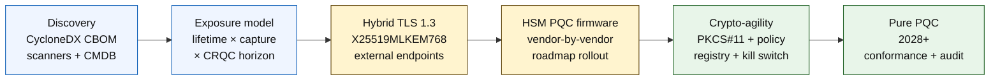

# Chỉ số Ngân hàng An toàn Lượng tử 2026: Mật mã Hậu Lượng tử, QKD, Linh hoạt Mật mã và Rủi ro Thu-Hoạch-Nay-Giải-Mã-Sau

<!-- lead-start: manual -->
<aside class="post-lead" aria-label="Tóm tắt bài viết">

<strong>Tóm lược.</strong> Ngân hàng an toàn lượng tử trong năm 2026 là một chương trình triển khai có hạn chót được ấn định bởi giao điểm của hai đường cong — vòng đời bảo mật của dữ liệu mà tổ chức đang nắm hôm nay, và mốc xuất hiện của Máy tính Lượng tử Liên quan về Mặt Mật mã (CRQC). NIST FIPS 203 / 204 / 205 đã chốt từ tháng 8/2024; CNSA 2.0 đặt điểm cuối liên bang Hoa Kỳ là 2033; thu-hoạch-nay-giải-mã-sau đã diễn ra trên dữ liệu lâu năm. Thẻ điểm Lượng tử Cấp Hội đồng theo dõi bốn tỷ lệ chính xác: độ đầy đủ kiểm kê, phơi nhiễm HNDL, tiến độ chuyển đổi NIST, sẵn sàng linh hoạt mật mã.

<strong>Điểm chính</strong>

<ul class="post-lead-takeaways">
  <li><strong>Cuộc tranh luận về thuật toán đã khép lại vào 13/8/2024.</strong> ML-KEM (FIPS 203), ML-DSA (FIPS 204), SLH-DSA (FIPS 205) là câu trả lời. Ngân hàng nào còn chạy đánh giá nội bộ để "chọn người thắng" đã chậm 18 tháng.</li>
  <li><strong>Thu-hoạch-nay-giải-mã-sau đã áp dụng.</strong> Mọi dữ liệu có vòng đời bảo mật vượt quá mốc CRQC khả tín — vay mua nhà 30 năm, thẩm định bảo hiểm nhân thọ, bản ghi giao dịch MiFID II / GDPR, kho lưu trữ M&amp;A — phải chuyển sang đóng gói khoá lai an toàn lượng tử ngay, không đợi CRQC được công bố.</li>
  <li><strong>Kiểm kê là ngưỡng trưởng thành chặn cửa.</strong> Hoá đơn Vật liệu Mật mã (CBOM) — giao thức, thư viện, chứng chỉ, phân vùng HSM, phụ thuộc nhà cung cấp, chủ sở hữu ứng dụng, vòng đời phân loại dữ liệu — là điều kiện tiên quyết cho mọi việc tiếp theo. Đo tươi mới, không đo độ phủ.</li>
  <li><strong>TLS 1.3 lai là triển khai của 2026.</strong> Khoá lai X25519MLKEM768 là cái Chrome / Firefox / Cloudflare / Akamai đang thực sự đàm phán hôm nay. TLS thuần ML-KEM còn chờ firmware HSM và CA sẵn sàng.</li>
  <li><strong>Linh hoạt mật mã là kết quả bền vững.</strong> Trừu tượng PKCS#11, khoá có nhãn, sổ đăng ký chính sách ánh xạ dịch vụ nghiệp vụ sang tập thuật toán được phép. Thiếu nó, lần chuyển đổi thuật toán kế tiếp lại là một chương trình nhiều năm nữa.</li>
</ul>
</aside>
<!-- lead-end -->

Ngân hàng an toàn lượng tử trong năm 2026 là chuyện chuyển đổi vận hành, không phải suy đoán. NIST đã chốt ba chuẩn mật mã hậu lượng tử đầu tiên, và các ngân hàng giờ phải hiểu hệ thống nào đang phụ thuộc vào RSA, ECC, TLS, chữ ký, HSM, chứng chỉ, kênh thanh toán, kho lưu trữ và dữ liệu mật lâu năm. Câu hỏi chỉ số rất đơn giản: tổ chức có thay được mật mã trước khi mối đe doạ trở nên thực thi không?

---

> **Tóm tắt Điều hành / Điểm chính**
>
> - **Chuẩn NIST đã cụ thể.** FIPS 203 định nghĩa ML-KEM cho đóng gói khoá, FIPS 204 định nghĩa ML-DSA cho chữ ký, và FIPS 205 định nghĩa SLH-DSA như chuẩn chữ ký dựa trên hàm băm không trạng thái.
> - **Kiểm kê là cổng trưởng thành đầu tiên.** Ngân hàng không thể chuyển đổi cái mà nó không tìm thấy: chứng chỉ, khoá, giao thức, ứng dụng, nhà cung cấp, HSM, API, kho lưu trữ và hệ thống nhúng đều phải được lập bản đồ.
> - **Linh hoạt mật mã là mục tiêu bền vững.** Đích đến không phải là một lần đổi thuật toán; đó là khả năng thay đổi nguyên thuỷ mật mã mà không phải thiết kế lại toàn bộ ứng dụng.
> - **Dữ liệu lâu năm thay đổi mức cấp bách.** Rủi ro thu-hoạch-nay-giải-mã-sau nghĩa là dữ liệu bị bắt hôm nay có thể trở nên đọc được sau này nếu nó còn giá trị đủ lâu.
> - **QKD là phần bổ trợ chuyên biệt.** Phân phối khoá lượng tử có thể phù hợp với các kênh giá trị cao nhất, nhưng không thay thế việc chuyển đổi PQC toàn tổ chức.
>
---

## Vì sao 2026 là năm Chỉ số này có giá trị

Ba dịch chuyển trong giai đoạn 2024-2025 đã đưa an toàn lượng tử từ vị trí quan sát nghiên cứu thành chương trình ngân hàng đo được. Thứ nhất, NIST chốt các chuẩn hậu lượng tử chính vào 13/8/2024: [FIPS 203 (ML-KEM) ⧉](https://nvlpubs.nist.gov/nistpubs/FIPS/NIST.FIPS.203.pdf "FIPS 203 — Cơ chế Đóng gói Khoá dựa trên Lưới Mô-đun"), [FIPS 204 (ML-DSA) ⧉](https://nvlpubs.nist.gov/nistpubs/FIPS/NIST.FIPS.204.pdf "FIPS 204 — Chuẩn Chữ ký Số dựa trên Lưới Mô-đun"), [FIPS 205 (SLH-DSA) ⧉](https://nvlpubs.nist.gov/nistpubs/FIPS/NIST.FIPS.205.pdf "FIPS 205 — Chuẩn Chữ ký Số dựa trên Hàm Băm Không Trạng thái"). Cuộc tranh luận chọn thuật toán đã khép lại vào ngày đó; ngân hàng nào còn chạy luồng công việc nội bộ kiểu "phương án nào thắng" trong năm 2026 đã chậm 18 tháng.

Thứ hai, [CNSA 2.0 của NSA ⧉](https://media.defense.gov/2022/Sep/07/2003071834/-1/-1/0/CSA_CNSA_2.0_ALGORITHMS_.PDF "Bộ Thuật toán An ninh Quốc gia Thương mại 2.0") đặt điểm cuối liên bang Hoa Kỳ là 2033 với các mốc cắt trung gian bắt đầu từ 2027 cho ký phần mềm và firmware, 2030 cho trình duyệt và hệ điều hành. Bất kỳ ngân hàng nào có phơi nhiễm đối tác liên bang Hoa Kỳ — FedNow, hoạt động Kho bạc, tài khoản khách hàng liên bang — đều nằm trong vòng đó đối với các hệ thống chạm vào dữ liệu liên bang. Đồng hồ đếm ngược không còn trừu tượng.

Thứ ba, [Thu-Hoạch-Nay-Giải-Mã-Sau (HNDL) ⧉](https://csrc.nist.gov/Projects/post-quantum-cryptography "Chương trình Mật mã Hậu Lượng tử của NIST") là luận điểm rủi ro chịu lực cho tính cấp bách. Đối thủ tinh vi đang thu giữ thông điệp thanh toán bảo vệ bằng TLS, phong bì SWIFT, hồ sơ KYC và mật văn kho lưu trữ lâu năm tại các trung tâm tài chính lớn. Dữ liệu bị bắt năm 2026 chỉ cần còn nhạy cảm bảo mật tại thời điểm giải mã — với vay mua nhà 30 năm, thẩm định bảo hiểm nhân thọ, bản ghi giao dịch MiFID II / GDPR và kho lưu trữ M&A, cửa sổ đó kéo dài vượt xa mọi ước tính khả tín về Máy tính Lượng tử Liên quan về Mặt Mật mã (CRQC). Đối thủ không cần máy tính lượng tử ngay hôm nay. Họ cần một cái trước khi dữ liệu hết quan trọng.

Chỉ số Ngân hàng An toàn Lượng tử đo lường xem tổ chức của bạn có giao được chuyển đổi trước khi giao điểm đó tới hay không. Vấn đề không còn là có nên chuyển đổi; vấn đề là chuyển đổi có hoàn tất theo lộ trình bảo vệ được hay không.

## Kiến trúc Chỉ số 2026

| Lớp Chỉ số | Hướng 2026 | Chỉ tiêu Sẵn sàng | Rủi ro nếu Xử lý sai |
|---|---|---|---|
| **Kiểm kê** | Lập bản đồ tài sản mật mã, giao thức, chứng chỉ, nhà cung cấp và lớp dữ liệu | Tỷ lệ tài sản đã kiểm kê | Phụ thuộc dễ bị lượng tử mà chưa biết |
| **Phơi nhiễm** | Phân loại hệ thống theo vòng đời bảo mật và tính trọng yếu giao dịch | Tài sản rủi ro cao theo giá trị và vòng đời | Ưu tiên chuyển đổi sai |
| **Chuyển đổi** | Áp dụng các mẫu lai và sẵn sàng PQC theo chuẩn NIST | Sẵn sàng ML-KEM và ML-DSA | Tái nền tảng khẩn cấp dưới sức ép hạn chót |
| **Linh hoạt mật mã** | Tách logic ứng dụng khỏi nguyên thuỷ mật mã | Độ phủ mật mã do chính sách kiểm soát | Thuật toán mã cứng khắp hệ thống |
| **Bảo đảm** | Kiểm thử tương tác, hiệu năng, hỗ trợ HSM, chứng chỉ và sẵn sàng nhà cung cấp | Tỷ lệ kiểm thử đạt và lượng ngoại lệ tồn đọng | Kênh đứt hoặc kiểm soát dự phòng yếu |

### Thẻ điểm Lượng tử Cấp Hội đồng

Một thẻ điểm sẵn sàng lượng tử khả tín đòi hỏi theo dõi các tỷ lệ chính xác, không chỉ trạng thái dự án:

1. **Độ đầy đủ Kiểm kê:** Tỷ lệ ứng dụng cấp 1 có Hoá đơn Vật liệu Mật mã (CBOM) được lập bản đồ đầy đủ.
2. **Phơi nhiễm HNDL:** Lượng dữ liệu mật lâu năm (ví dụ PII, bí mật thương mại) truyền qua mạng mà không có đóng gói khoá lai an toàn lượng tử.
3. **Tiến độ Chuyển đổi NIST:** Tỷ lệ khoá mã hoá bất đối xứng và chữ ký số đã chuyển sang chuẩn FIPS 203 (ML-KEM) và FIPS 204 (ML-DSA).
4. **Sẵn sàng Linh hoạt Mật mã:** Tỷ lệ hệ thống trọng yếu mà thuật toán mật mã có thể luân chuyển qua chính sách tập trung mà không cần biên dịch lại mã.

## Tín hiệu Hiện tại cần Theo dõi

| Tín hiệu | Ý nghĩa với Ngân hàng | Nguồn |
|---|---|---|
| **FIPS 203 ML-KEM** | Chuẩn NIST chính cho thiết lập khoá mã hoá tổng quát | [NIST ⧉](https://www.nist.gov/news-events/news/2024/08/nist-releases-first-3-finalized-post-quantum-encryption-standards "Ba chuẩn mật mã hậu lượng tử đầu tiên đã hoàn tất") |
| **FIPS 204 ML-DSA** | Chuẩn NIST chính cho chữ ký số | [NIST ⧉](https://www.nist.gov/news-events/news/2024/08/nist-releases-first-3-finalized-post-quantum-encryption-standards "Ba chuẩn mật mã hậu lượng tử đầu tiên đã hoàn tất") |
| **FIPS 205 SLH-DSA** | Phương án chữ ký dựa trên hàm băm và thiết kế dự phòng | [NIST ⧉](https://www.nist.gov/news-events/news/2024/08/nist-releases-first-3-finalized-post-quantum-encryption-standards "Ba chuẩn mật mã hậu lượng tử đầu tiên đã hoàn tất") |
| **Khuyến nghị tích hợp ngay** | NIST nói rõ với quản trị viên rằng cần bắt đầu tích hợp chuẩn vì tích hợp đầy đủ mất thời gian | [NIST ⧉](https://www.nist.gov/news-events/news/2024/08/nist-releases-first-3-finalized-post-quantum-encryption-standards "Ba chuẩn mật mã hậu lượng tử đầu tiên đã hoàn tất") |
| **Chương trình lượng tử của ngân hàng đang mở rộng** | Các ngân hàng lớn đang khai phá công nghệ lượng tử song song với chuẩn bị chuyển đổi PQC | [Quantum Insider ⧉](https://thequantuminsider.com/2026/03/27/15-plus-global-banks-probing-the-wonderful-world-of-quantum-technologies/ "Tổng quan các ngân hàng toàn cầu khai phá công nghệ lượng tử") |

## Chuyển đổi Bắt đầu Từ Sổ Cái Mật mã

Trình tự chuyển đổi đến giờ đã được hiểu rõ. Mỗi cổng tạo ra bằng chứng dẫn dắt cổng kế tiếp; bỏ qua hoặc nén một cổng là cái sinh ra rủi ro tái nền tảng khẩn cấp xuất hiện ở cột thất bại trong Kiến trúc Chỉ số.

Bàn giao đầu tiên không phải là một thuật toán mới; đó là hoá đơn vật liệu mật mã (CBOM). Ngân hàng cần một danh mục sống kết nối dịch vụ nghiệp vụ với thuật toán, thư viện, chứng chỉ, độ dài khoá, HSM, vòng đời dữ liệu, nhà cung cấp và chủ sở hữu vận hành. Thiếu sổ cái đó, chuyển đổi an toàn lượng tử thành đoán mò.

Bộ bản ghi CBOM nên ghi nhận, cho mỗi nguyên thuỷ mật mã: giao thức hoặc giao diện (TLS 1.3, IPsec, SSH, định dạng thông điệp thanh toán tuỳ biến), thuật toán và bộ tham số (RSA-2048, ECDH P-256, ML-KEM-768, ML-DSA-65), thư viện và phiên bản (OpenSSL 3.4, hash commit BoringSSL, bản build SDK nhà cung cấp), ranh giới phần cứng (phân vùng HSM, TPM, vùng an toàn hay không có), danh tính chứng chỉ nếu có, chủ sở hữu ứng dụng và vòng đời phân loại dữ liệu. Các công cụ tiếp đất sản xuất trong 2025-2026 — IBM Quantum Safe Inventory, [đặc tả CBOM mã nguồn mở CycloneDX ⧉](https://cyclonedx.org/capabilities/cbom/ "Hoá đơn Vật liệu Mật mã CycloneDX"), bộ quét doanh nghiệp từ CryptoNext / Sandbox / PQShield — tích hợp vào đường ống CMDB hiện hữu. Không bộ nào đủ một mình; hãy dự kiến chu kỳ xây CBOM 12-18 tháng kể cả khi có công cụ nhà cung cấp và nhân lực chuyên trách.

Chỉ tiêu cần theo dõi là độ tươi mới, không phải độ phủ. Một CBOM lệch hai tháng còn tệ hơn không có CBOM, vì nó cho đội an ninh tin sai về những gì đã được chuyển đổi.

## Lai trước, Linh hoạt mãi

Phần lớn ngân hàng sẽ không đổi mọi thứ cùng một lúc. Mẫu hình thực tế là triển khai lai, nơi cơ chế cổ điển và hậu lượng tử cùng chạy trong khi nhà cung cấp, giao thức, chứng chỉ và công cụ vận hành trưởng thành. Đích đến dài hạn là linh hoạt mật mã: lựa chọn mật mã do chính sách kiểm soát có thể thay đổi mà không phải dựng lại ứng dụng nghiệp vụ.

[Chèn Thành phần Tương tác: Bộ Tính Rủi ro Thu-Hoạch-Nay-Giải-Mã-Sau (HNDL) — Công cụ dạng thanh trượt nơi lãnh đạo nhập vòng đời dữ liệu so với mốc lượng tử ước lượng để thấy cửa sổ phơi nhiễm.]

> **Điểm mấu chốt:** Nếu dữ liệu của bạn cần giữ mật trong 10 năm, và Máy tính Lượng tử Liên quan về Mặt Mật mã (CRQC) còn cách 7 năm, hạn chót chuyển đổi của bạn không nằm sau 7 năm — nó đã ở 3 năm trước.

Trong thực tế điều này nghĩa là TLS 1.3 với khoá lai `X25519MLKEM768` cho các điểm cuối hướng ngoài (Chrome / Firefox / Cloudflare / Akamai đều đã hỗ trợ hôm nay), chuỗi chữ ký cổ điển cho tới khi hạ tầng HSM và CA bắt kịp, và một lớp trừu tượng PKCS#11 cho phép sổ đăng ký chính sách luân chuyển thuật toán mà không biên dịch lại ứng dụng nghiệp vụ. Linh hoạt mật mã quyết định lần chuyển đổi thuật toán kế tiếp (khi nào, chứ không phải có hay không) là vòng luân chuyển sáu tuần hay lại là một chương trình bảy năm.

## QKD ở Đâu

Phân phối khoá lượng tử thuộc về chỉ số như một tuỳ chọn kênh nhạy cảm cao, đặc biệt cho hạ tầng thị trường tài chính, kết nối ngân hàng trung ương và các dòng tổ chức cực kỳ nhạy cảm. Nên coi nó là phần bổ trợ cho PQC, không phải cái cớ trì hoãn chuyển đổi cấp doanh nghiệp.

## Điều này Có nghĩa gì theo Loại Ngân hàng

### Ngân hàng Quan trọng Mang tính Hệ thống Toàn cầu

Bài toán khó là quy mô: hàng chục nghìn điểm cuối TLS, hàng trăm phân vùng HSM, hàng chục cơ quan chứng thực nội bộ, hàng trăm ứng dụng nghiệp vụ có nguyên thuỷ mật mã nhúng và các SDK nhà cung cấp mà ngân hàng không sửa được. Khoản đầu tư không phải thêm một pilot nữa; đó là công cụ CBOM, lớp trừu tượng PKCS#11 nối vào mọi bản build mới, kế hoạch hợp nhất HSM chọn một nhà cung cấp dẫn dắt firmware PQC và chấp nhận đuôi nhiều năm ở các nhà cung cấp khác, và sổ đăng ký chính sách trở thành bề mặt linh hoạt mật mã bền vững còn lại lâu sau khi chuyển đổi FIPS 203 / 204 / 205 hoàn tất.

### Ngân hàng Giao dịch và Doanh nghiệp

Phạm vi chuyển đổi hẹp hơn so với cấp G-SIB nhưng phơi nhiễm HNDL gay gắt: nhắn tin xuyên biên giới SWIFT, dữ liệu thanh toán có cấu trúc mang PII đối tác doanh nghiệp, nền tảng trao đổi tài liệu giữ hồ sơ tài trợ thương mại, và kho lưu trữ báo cáo lưu giữ lâu. Ưu tiên TLS lai cho mọi điểm cuối hướng khách hàng và PQC khi nghỉ cho kho lưu trữ. Thúc trách nhiệm nhà cung cấp HSM — đội nền tảng ngân hàng doanh nghiệp có đòn bẩy mua sắm trực tiếp mà đội công nghệ bán buôn thường thiếu.

### Ngân hàng Khu vực

Mua chồng công nghệ nhà cung cấp đã có nền tảng linh hoạt mật mã. Chọn nền tảng ngân hàng lõi mà nhà cung cấp công bố CBOM và cam kết mốc thời gian hỗ trợ ML-KEM / ML-DSA. Xác nhận lộ trình HSM của nhà cung cấp khớp với hạn chót chuyển đổi của ngân hàng. Năng lực kỹ thuật cần để dựng linh hoạt mật mã từ con số không là nhiều năm; nhà cung cấp trả chi phí đó cho nhiều khách hàng và ngân hàng thừa hưởng lợi ích. Phần xác nhận — kiểm tra rằng tuyên bố của nhà cung cấp đứng vững trước quy trình MRM của tổ chức — là phạm vi nội bộ chính đáng.

### Fintech, PSP và Nhà cung cấp Hạ tầng

Câu hỏi cạnh tranh cho nhà cung cấp bán cho ngân hàng năm 2026 không phải là "anh có hỗ trợ PQC không." Mà là "anh có sản xuất được CBOM CycloneDX cho nền tảng, ma trận hỗ trợ HSM của nhà cung cấp, và SLA luân chuyển thuật toán bằng văn bản hay không." Nhà cung cấp trả lời có sẽ qua được cổng mua sắm cấp 1 trong 2026-2027. Nhà cung cấp không trả lời được sẽ mất chu kỳ gia hạn vào tay đối thủ làm được.

## Kết luận

Ngân hàng an toàn lượng tử trong năm 2026 không phải vị trí quan sát nghiên cứu; đó là chương trình triển khai có hạn chót do giao điểm hai đường cong ấn định — vòng đời bảo mật của dữ liệu tổ chức đang nắm hôm nay, và mốc xuất hiện của Máy tính Lượng tử Liên quan về Mặt Mật mã. Những tổ chức nhìn khả tín trước cơ quan quản lý và đối tác vào 2030 là những tổ chức đã khởi công CBOM từ 2024, triển khai TLS lai trên mọi điểm cuối ngoài trước cuối 2026, và kỹ thuật hoá linh hoạt mật mã vào mọi bản build mới từ ngày đầu. Những tổ chức chưa làm sẽ phát hiện ra cửa sổ chuyển đổi đã khép lại hay chưa cho dữ liệu mà đối thủ đang thu hoạch hôm nay.

Đo chuyển đổi như cách bạn đo bất kỳ chương trình vận hành nào: phạm vi đã biết, thứ tự đã ưu tiên, hạn chót đã cam kết, sổ ngoại lệ trung thực. Càng nhìn kỹ vào hệ thống của chính mình, cửa sổ chuyển đổi càng thấy nhỏ.

## Câu hỏi Thường gặp

**Ngân hàng nên kiểm kê cái gì trước?**

Bắt đầu với TLS hướng ngoài, kênh thanh toán, xác thực khách hàng, kết nối liên ngân hàng, dịch vụ có HSM hậu thuẫn, kho lưu trữ dài hạn và hệ thống xử lý dữ liệu mật có vòng đời hữu ích dài.

**PQC chỉ là vấn đề an ninh mạng?**

Không. Nó tác động tới thanh toán, danh tính, bằng chứng pháp lý, ký giao dịch, niềm tin khách hàng, lưu giữ dữ liệu, quản lý nhà cung cấp và khả năng chống chịu vận hành.

**Linh hoạt mật mã nghĩa là gì?**

Linh hoạt mật mã là khả năng thay đổi nguyên thuỷ mật mã thông qua chính sách và kiểm soát nền tảng thay vì sửa mã ứng dụng cứng.

**Ngân hàng có nên đợi thêm chuẩn?**

Không. NIST đã khuyến khích quản trị viên bắt đầu tích hợp các chuẩn cuối đầu tiên vì tích hợp đầy đủ mất thời gian.

## Tài liệu Tham khảo

- NIST, (2026). [Ba chuẩn mật mã hậu lượng tử đầu tiên đã hoàn tất ⧉](https://www.nist.gov/news-events/news/2024/08/nist-releases-first-3-finalized-post-quantum-encryption-standards "Ba chuẩn mật mã hậu lượng tử đầu tiên đã hoàn tất").

<!-- enrich-start -->
<aside class="author-card" aria-label="Về tác giả"><strong class="author-card-name"><a href="/about/index.html">Sebastien Rousseau</a></strong>Chuyên gia công nghệ ngân hàng cấp cao, viết về AI ứng dụng, hạ tầng thanh toán, tiền token hoá, ISO 20022, an ninh hậu lượng tử, dịch vụ tài chính cloud-native và thị trường số được quản lý.Hơn 20 năm kinh nghiệm tại HSBC Commercial &amp; Investment Bank, PayPal, Barclays, Shazam, AKQA, Virgin Group. <a href="/about/index.html">Hồ sơ đầy đủ</a> &middot; <a href="https://www.linkedin.com/in/sebastienrousseau/" rel="external noopener">LinkedIn</a> &middot; <a href="https://github.com/sebastienrousseau" rel="external noopener">GitHub</a></aside>

Rà soát lần cuối <time datetime="2026-06-04">2026-06-04</time>.

<!-- enrich-end -->
