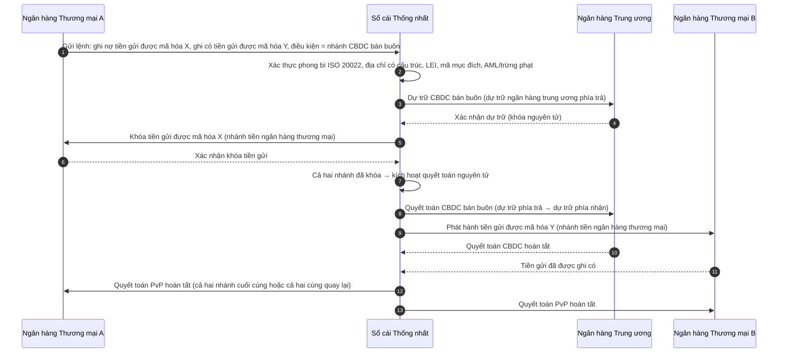

<!-- lead-start: manual -->
<aside class="post-lead" aria-label="Tóm tắt bài viết">

<strong>Tóm lược.</strong> Thanh toán bán buôn năm 2026 nằm ở giao điểm của hai dịch chuyển cấu trúc: ISO 20022 buộc dữ liệu thanh toán có cấu trúc đi vào mô hình vận hành, còn tiền gửi được mã hóa cộng với BIS Project Agorá đẩy quyết toán xuyên biên giới về phía đường ray nguyên tử, lập trình được, luôn-bật. Câu hỏi 2026 cho một ngân hàng không còn là "đã di trú bản tin chưa" mà là "vận hành thanh toán của chúng ta có đo được, có định tuyến được và có giám sát được không" — và chỉ số bóc tách điều đó thành bốn tỷ lệ phần trăm rõ ràng: độ đầy đủ dữ liệu có cấu trúc, mức tối ưu định tuyến đường ray, độ trễ tính cuối cùng quyết toán, và phạm vi hành lang Agorá.

<strong>Điểm chính</strong>

<ul class="post-lead-takeaways">
  <li><strong>Tháng 11/2026 là hạn chót cứng, không phải hướng dẫn.</strong> SWIFT loại bỏ hỗ trợ địa chỉ phi cấu trúc trong SR 2026; thanh toán thiếu thành phố và quốc gia ở các trường được chỉ định sẽ ngừng được thanh toán bù trừ. Chi phí sửa lỗi, tỷ lệ từ chối và năng lực vận hành đều chuyển từ "chỉ số" sang "thế đứng hiển hiện với cơ quan quản lý".</li>
  <li><strong>Tiền gửi được mã hóa vượt stablecoin cho bán buôn được quản lý.</strong> Chúng bảo toàn quan hệ ngân hàng-người gửi tiền và tài sản quyết toán của ngân hàng trung ương đồng thời bộc lộ tính lập trình được. Stablecoin giữ vai trò ở rìa; tiền gửi được mã hóa neo phần lõi.</li>
  <li><strong>BIS Project Agorá là tham chiếu hành lang.</strong> Nếu sản phẩm xuyên biên giới của một ngân hàng không chạy được trong hành lang Agorá vào năm 2027, ngân hàng đó đang cạnh tranh trên đường ray mà phần còn lại của thị trường đã rời bỏ.</li>
  <li><strong>Điều phối đường ray thời gian thực là mô hình vận hành.</strong> Quyết định đa-đường-ray năm 2026 (FedNow / RTP / TIPS / SEPA Inst / on-chain) không phải là "chọn đường ray nào" — mà là sổ đăng ký chính sách, hồ sơ thanh khoản và động cơ định tuyến chọn đường ray cho từng khoản thanh toán.</li>
  <li><strong>Đo lường hoặc bị đo lường.</strong> Bốn tỷ lệ phần trăm — độ đầy đủ dữ liệu có cấu trúc, mức tối ưu định tuyến đường ray, độ trễ tính cuối cùng quyết toán, phạm vi hành lang Agorá — biến thế đứng thanh toán thành bằng chứng sẵn sàng cho giám sát trước cửa sổ kiểm toán 2026/27.</li>
</ul>
</aside>
<!-- lead-end -->

# Chỉ số Thanh toán Bán buôn 2026: ISO 20022, Tiền gửi Được Mã hóa, Đường ray Thời gian Thực và Quyết toán Xuyên Biên giới

Thanh toán bán buôn năm 2026 đang được định hình lại bởi hai dịch chuyển đồng thời: dữ liệu thanh toán có cấu trúc và quyết toán lập trình được. Cột mốc địa chỉ có cấu trúc tháng 11/2026 của SWIFT buộc chất lượng dữ liệu phải đi vào mô hình vận hành, trong khi BIS Project Agorá và tiền gửi được mã hóa đang thử nghiệm xem quyết toán xuyên biên giới có thể trở nên nguyên tử hơn, minh bạch hơn và luôn-bật hay không.

---

> **Tóm tắt Điều hành / Điểm chính**
>
> - **Tháng 11/2026 là cột mốc dữ liệu cứng.** SWIFT khẳng định thanh toán chứa địa chỉ phi cấu trúc sẽ không còn được hỗ trợ sau thay đổi SR 2026.
> - **Dữ liệu có cấu trúc trở thành hạ tầng sản phẩm.** Thành phố và quốc gia tối thiểu phải nằm ở các trường được chỉ định, biến chất lượng dữ liệu thanh toán thành vấn đề của khách hàng, vận hành và tuân thủ.
> - **Tiền gửi được mã hóa là một lựa chọn thiết kế bán buôn.** Project Agorá khám phá tiền gửi ngân hàng thương mại được mã hóa và dự trữ ngân hàng trung ương được mã hóa trong một mô hình sổ cái thống nhất.
> - **Chỉ số phải đo chất lượng quyết toán, không chỉ tốc độ.** Tính cuối cùng, tính minh bạch, tỷ lệ sửa lỗi, mức dùng thanh khoản, dữ liệu tuân thủ và mức hiển thị với khách hàng quan trọng ngang với thực thi tức thời.
> - **Thanh toán xuyên biên giới vẫn là chương trình nghị sự công-tư.** FSB tiếp tục thúc đẩy lộ trình G20 thông qua giai đoạn triển khai, với sự phối hợp khu vực công và tư nhân.
>
---

## Vì sao 2026 là Năm Chỉ số Này Quan trọng

Stanford AI Index hữu ích vì nó coi một lĩnh vực công nghệ vận động nhanh là thứ có thể đo được: sản lượng nghiên cứu, hiệu năng kỹ thuật, triển khai có trách nhiệm, kinh tế, mức độ áp dụng theo ngành, chính sách và tâm lý công chúng đều được đưa vào một khung duy nhất ([Stanford HAI ⧉](https://hai.stanford.edu/ai-index/2026-ai-index-report "Báo cáo AI Index 2026")). Ngân hàng và tổ chức tài chính nay cần kỷ luật tương tự cho hạ tầng. AI tác nhân, an ninh an toàn-lượng tử, sức bền cloud native và thanh toán bán buôn không còn là những hướng đổi mới riêng lẻ; chúng đang hội tụ thành một mô hình vận hành duy nhất.

Câu hỏi thực tế cho một ngân hàng không phải là từng mảng có quan trọng hay không. Đó là liệu tổ chức có đo được mức sẵn sàng trên toàn bộ chúng cùng lúc hay không. Một ngân hàng có thể triển khai AI tác nhân mà vẫn dễ gãy nếu mật mã không sẵn sàng để di trú. Có thể hiện đại hóa nền tảng đám mây mà vẫn thất bại nếu dữ liệu thanh toán vẫn phi cấu trúc. Có thể chạy các thí điểm token hoá mà vẫn tạo rủi ro hệ thống nếu các lớp quyết toán, thanh khoản, danh tính và nhật ký kiểm toán không được thiết kế cùng nhau.

## Kiến trúc Chỉ số 2026

| Lớp Chỉ số | Hướng đi 2026 | Thước đo Sẵn sàng | Rủi ro nếu Xử lý Sai |
|---|---|---|---|
| **Dữ liệu ISO 20022** | Chuyển từ văn bản phi cấu trúc sang các trường có cấu trúc được quản trị | Mức sẵn sàng địa chỉ có cấu trúc và tỷ lệ từ chối | Thanh toán bị từ chối và sửa lỗi thủ công |
| **Điều phối đường ray** | Định tuyến qua RTGS, đường ray tức thời, đại lý, stablecoin và đường ray được mã hóa | Định tuyến theo chi phí, tốc độ, tính cuối cùng và pháp lý | Đường ray phân mảnh với kiểm soát trùng lặp |
| **Quyết toán được mã hóa** | Dùng tiền gửi được mã hóa và tiền ngân hàng trung ương ở nơi giảm được ma sát | Phạm vi DvP, PvP, quyết toán nguyên tử | Tài sản thí điểm không có giá trị quy trình kinh doanh |
| **Thanh khoản** | Tối ưu thanh khoản trong ngày, tiền mặt bị kẹt và cửa sổ quyết toán | Thanh khoản tiết kiệm được và giảm thất bại quyết toán | Rút thanh khoản nhanh hơn |
| **Tuân thủ** | Nhúng yêu cầu AML, trừng phạt, FATF và nhật ký kiểm toán vào dữ liệu thanh toán | Tuân thủ thẳng-qua và khả năng giải thích | Dữ liệu giàu hơn nhưng kiểm soát không mạnh hơn |

## Tín hiệu Thanh toán Bán buôn Chính Đối chiếu với Ưu tiên Toàn cầu

Tập tín hiệu năm 2026 không phải là chương trình nghiên cứu. Đó là danh sách kiểm tra phân phối mà Giám đốc Thanh toán của một ngân hàng đã đang bị đo trên đó. Công việc khắc phục xuất hiện ở ba nơi: phong bì bản tin, lớp điều phối đường ray, và sổ cái quyết toán.

| Tín hiệu | Tham chiếu G20 / SWIFT / BIS | Triển khai trên Nền tảng Kỹ thuật |
|---|---|---|
| **65% bản tin thanh toán vẫn chứa địa chỉ phi cấu trúc** | [SWIFT SR 2026 — cột mốc địa chỉ có cấu trúc, tháng 11/2026 ⧉](https://www.swift.com/news-events/news/iso-20022-milestone-november-2026-unstructured-addresses-be-removed "Cột mốc địa chỉ có cấu trúc ISO 20022 tháng 11/2026") | Xác thực schema trong middleware thanh toán trước khi bản tin chạm bộ chuyển đổi SWIFTNet; phân tích cú pháp địa chỉ tự động ở cổng vào kênh doanh nghiệp + ngân hàng đại lý. |
| **Mục tiêu G20 của FSB: 75% thanh toán xuyên biên giới hoàn tất trong vòng 1 giờ vào năm 2027** | [Lộ trình thanh toán xuyên biên giới của FSB, pha triển khai 2026 ⧉](https://www.fsb.org/2026/03/fsb-kicks-off-new-implementation-phase-to-enhance-cross-border-payments-through-public-private-partnership/ "Pha triển khai thanh toán xuyên biên giới của FSB") | Cổng chuyển đổi FX thời gian thực với cửa sổ thanh khoản đã thỏa thuận trước; hook xác nhận T+0 vào cổng khách hàng; động cơ định tuyến đường ray loại trừ mọi hành lang không đáp ứng phong bì 1 giờ. |
| **Mục tiêu G20 của FSB: chi phí giao dịch xuyên biên giới trung bình dưới 1%, bán lẻ dưới 3%** | [Mục tiêu định lượng G20 của FSB ⧉](https://www.fsb.org/2026/03/fsb-kicks-off-new-implementation-phase-to-enhance-cross-border-payments-through-public-private-partnership/ "Pha triển khai thanh toán xuyên biên giới của FSB") | Đo từ xa quy chiếu chi phí trên mọi hành lang (chênh lệch FX, phí đại lý, chi phí nâng); sổ đăng ký chính sách biên lợi nhuận làm nổi giá không tuân thủ trước khi báo giá. |
| **BIS Project Agorá bước vào pha nguyên mẫu trên bảy ngân hàng trung ương + 41 ngân hàng thương mại** | [BIS Project Agorá ⧉](https://www.bis.org/about/bisih/topics/fmis/agora.htm "Project Agorá") | Đặc tả tích hợp sổ cái thống nhất: nút sổ cái tiền gửi được mã hóa + mặt phẳng quyết toán CBDC bán buôn + hook KYC/AML; bể thanh khoản on-chain được điều chỉnh quy mô theo thị phần hành lang của ngân hàng. |
| **Khung "tiền số" của Deutsche Bank kết tinh trong kiến trúc khách hàng** | [Deutsche Bank — Tiền số: stablecoin, tiền gửi được mã hóa và CBDC ⧉](https://flow.db.com/publications/flow-white-papers-and-guides/digital-money-a-perspective-on-stablecoins-tokenised-deposits-and-cbdcs "Tiền số: stablecoin, tiền gửi được mã hóa và CBDC") | API quyết toán không phụ thuộc ví, trừu tượng hóa lựa chọn stablecoin / tiền gửi được mã hóa / CBDC cho mỗi khoản thanh toán; điều kiện lập trình được đánh giá theo sổ đăng ký chính sách của ngân hàng, không phải của khách hàng. |

## Điểm Uốn của Dữ liệu Thanh toán

ISO 20022 đã chuyển từ một dự án định dạng bản tin sang mô hình vận hành chất lượng dữ liệu. Nếu dữ liệu người thụ hưởng, người ghi nợ, người ghi có, tác nhân, thành phố, quốc gia, mục đích và bên đối tác yếu, ngân hàng sẽ gặp từ chối, sửa lỗi, ma sát trừng phạt, khách hàng bực bội và phân tích kém.

**SR 2026 biến điều này thành một hợp đồng cứng, không phải khuyến nghị.** SWIFT Standards Release 2026 (tháng 11/2026) thực thi quy tắc địa chỉ có cấu trúc ở lớp mạng — các bản tin có phần tử `<PstlAdr>` không mang `<TwnNm>` và `<Ctry>` sẽ bị bộ xác thực SWIFTNet từ chối ngay khi nhận, chứ không phải gắn cờ để sửa. Hàng đợi sửa lỗi thôi không còn là một dòng chi phí hậu phòng mà trở thành một sự kiện thất bại quyết toán với độ trễ hiển hiện với khách hàng. Các đội vận hành đang coi SR 2026 là "hướng dẫn chặt hơn" đang làm việc theo sai sách vận hành.

### Tuân thủ Dữ liệu Thanh toán Có Cấu trúc theo ISO 20022

Bề mặt khắc phục hẹp và được định nghĩa rõ. Các phần tử XML dưới đây là nơi bộ xác thực SWIFTNet tháng 11/2026 thực sự từ chối bản tin; mọi thứ khác là hệ quả dây chuyền.

| Phần tử Dữ liệu | Thẻ XML ISO 20022 | Yêu cầu SWIFT tháng 11/2026 | Chiến lược Khắc phục Kỹ thuật |
|---|---|---|---|
| **Địa chỉ Có Cấu trúc** | `<PstlAdr>` chứa `<TwnNm>` + `<Ctry>` | Bắt buộc. Văn bản `<AdrLine>` phi cấu trúc kích hoạt từ chối mạng ở bộ chuyển đổi SWIFTNet nhận. | Phân tích cú pháp địa chỉ tự động khi khởi tạo thanh toán; viết lại biểu mẫu kênh doanh nghiệp; làm sạch sổ cũ cho mọi đối tác trước lần ghi nợ tiếp theo. |
| **Định danh Pháp nhân (LEI)** | `<Id>` dưới `<OrgId>` | Khuyến nghị mạnh để xác minh đối tác tài chính không phải cá nhân; bắt buộc trong một số hành lang CBPR+. | Tra cứu LEI + đối chiếu chéo GLEIF khi onboarding doanh nghiệp; làm giàu tự động cho đối tác sổ cũ qua dịch vụ dữ liệu tham chiếu. |
| **Mã Mục đích Thanh toán** | `<Purp>` chứa `<Cd>` | Bắt buộc trong nhiều hành lang thời gian thực khu vực (CBPR+, SEPA Inst, TIPS) để rà quét AML / trừng phạt tự động. | Ánh xạ mã giao dịch nội bộ ngân hàng kế thừa sang danh sách ExternalPurposeCode chuẩn ISO 20022; bộc lộ lựa chọn mục đích trong giao diện kênh doanh nghiệp; mặc định từ chối với mã không xác định. |
| **Bên Thụ hưởng Cuối cùng** | `<UltmtDbtr>` / `<UltmtCdtr>` | Bộc lộ bối cảnh người thụ hưởng cuối cùng để đáp ứng tham số quy tắc đi lại FATF G20 + trừng phạt; bắt buộc cho một số mã loại thanh toán. | Trích xuất tên bên đầu-cuối từ tài khoản con của sổ cái; đối chiếu với đồ thị KYC; làm nổi bên thụ hưởng cuối cùng trên mọi xác nhận. |
| **Thông tin Chuyển nhượng (Có Cấu trúc)** | `<RmtInf><Strd>` với `<RfrdDocInf>` | Bắt buộc cho thanh toán doanh nghiệp liên kết hóa đơn có thể đối chiếu theo CBPR+ Pha 2. | Thu thập thông tin chuyển nhượng có cấu trúc tại thời điểm báo giá trong cổng doanh nghiệp; từ chối dự phòng văn bản tự do cho các dòng giá trị cao. |

## Tiền gửi Được Mã hóa và CBDC Bán buôn

Tiền gửi được mã hóa bảo toàn mô hình tiền ngân hàng thương mại đồng thời bổ sung tính lập trình được. Tiền ngân hàng trung ương bán buôn bảo toàn tính cuối cùng quyết toán. Mẫu thiết kế đáng chú ý là sự kết hợp: tiền ngân hàng thương mại cho quan hệ khách hàng và trung gian tín dụng, tiền ngân hàng trung ương cho quyết toán cuối cùng và niềm tin hệ thống.

Project Agorá biến sự kết hợp này thành cụ thể. Kiến trúc dưới đây là mẫu tham chiếu BIS cho một quyết toán xuyên biên giới nguyên tử, thanh toán-đối-thanh toán (PvP) sử dụng đồng thời sổ cái tiền gửi ngân hàng thương mại và mặt phẳng quyết toán CBDC bán buôn, được phối hợp qua một sổ cái thống nhất.

Quyết toán mang tính nguyên tử theo thiết kế: cả hai nhánh cùng cam kết hoặc cùng quay lại. Tính cuối cùng quyết toán ở nhánh CBDC bán buôn khiến chuyển giao tiền gửi được mã hóa của ngân hàng thương mại có hiệu lực mà không có rủi ro đại lý. Sổ cái thống nhất là mặt phẳng phối hợp, không phải một hệ thống thanh toán riêng — ngân hàng trung ương vẫn phát hành tài sản quyết toán và ngân hàng thương mại vẫn ghi sổ trách nhiệm tiền gửi.

## Sản phẩm Thanh toán Bán buôn Mới

Sản phẩm không còn đơn thuần là một khoản thanh toán. Đó là một gói gồm thực thi, dữ liệu, thanh khoản, tuân thủ, khả năng truy vết và quản lý ngoại lệ. Ngân hàng nào bộc lộ được những năng lực đó qua API và bảng điều khiển khách hàng sẽ biến tuân thủ hạ tầng thành giá trị cho khách hàng.

## Điều này Có nghĩa gì theo Loại Ngân hàng

### Ngân hàng Quan trọng Có Hệ thống Toàn cầu

Ngân hàng toàn cầu nên coi chỉ số này là thẻ điểm kiến trúc doanh nghiệp. Ưu tiên không phải thêm một bằng chứng khái niệm nữa; mà là bằng chứng rằng các luồng công việc tự chủ, di trú mật mã, phụ thuộc đám mây và hiện đại hóa thanh toán có thể được quản trị như một hệ thống rủi ro và giá trị thống nhất.

### Ngân hàng Giao dịch và Ngân hàng Doanh nghiệp

Ngân hàng giao dịch nên tập trung vào thanh toán bán buôn, dữ liệu có cấu trúc, thanh khoản, tiền gửi được mã hóa và dịch vụ quản lý ngân quỹ tác nhân. Đề xuất giá trị nhất với khách hàng không chỉ là chuyển tiền nhanh hơn; mà là chuyển tiền có thể giải thích, kiểm toán được, lập trình được với ít cuộc điều tra hơn và mức hiển thị vốn lưu động tốt hơn.

### Ngân hàng Khu vực

Ngân hàng khu vực nên dùng chỉ số này để tránh chương trình tản mạn. Họ không cần dẫn đầu mọi đường biên, nhưng cần có lập trường đáng tin về quản trị AI, kiểm kê hậu lượng tử, bằng chứng thoát đám mây và mức sẵn sàng dữ liệu thanh toán.

### Fintech, PSP và Nhà cung cấp Hạ tầng

Fintech và nhà cung cấp hạ tầng nên căn chỉnh lộ trình sản phẩm theo mức sẵn sàng đo được của ngân hàng. Đề xuất tốt nhất sẽ giảm rủi ro tích hợp, củng cố bằng chứng và giúp ngân hàng quản trị hạ tầng phức tạp dễ hơn.

## Kết luận

Giá trị của một báo cáo theo phong cách chỉ số là chuyển một chương trình nghị sự công nghệ phân mảnh thành mô hình vận hành đo được. Năm 2026, người chiến thắng trong hạ tầng tài chính sẽ không phải là tổ chức có nhiều thí điểm nhất. Đó sẽ là tổ chức chứng minh được mức sẵn sàng đồng thời trên các trục tự chủ, an ninh, sức bền, quyết toán, kinh tế và quản trị.

## Câu hỏi Thường gặp

**Vì sao ISO 20022 vẫn là vấn đề năm 2026?**

Vì cuộc di trú chưa hoàn tất cho đến khi dữ liệu thanh toán được cấu trúc, được quản trị, được thu thập tại nguồn và dùng được qua mọi kênh, mọi khách hàng và mọi hạ tầng thị trường.

**Tiền gửi được mã hóa là gì?**

Tiền gửi được mã hóa là biểu diễn số của tiền ngân hàng thương mại, được thiết kế để bảo toàn quan hệ ngân hàng-người gửi tiền đồng thời cho phép quyết toán lập trình được.

**Tiền gửi được mã hóa có thay thế stablecoin không?**

Không ở mọi nơi. Stablecoin có thể vẫn hữu ích trong một số bối cảnh tài sản số và xuyên biên giới, còn tiền gửi được mã hóa có cấu trúc hấp dẫn cho ngân hàng bán buôn được quản lý.

**Ngân hàng nên đo gì?**

Đo mức sẵn sàng dữ liệu có cấu trúc, tỷ lệ từ chối thanh toán, chi phí sửa lỗi, thời gian quyết toán, mức dùng thanh khoản, kết quả định tuyến đường ray và mức hiển thị với khách hàng.

## Tham khảo

- SWIFT, (2026). [Cột mốc địa chỉ có cấu trúc ISO 20022 tháng 11/2026 ⧉](https://www.swift.com/news-events/news/iso-20022-milestone-november-2026-unstructured-addresses-be-removed "Cột mốc địa chỉ có cấu trúc ISO 20022 tháng 11/2026").
- BIS Innovation Hub, (2026). [Project Agorá ⧉](https://www.bis.org/about/bisih/topics/fmis/agora.htm "Project Agorá").
- FSB, (2026). [Pha triển khai thanh toán xuyên biên giới ⧉](https://www.fsb.org/2026/03/fsb-kicks-off-new-implementation-phase-to-enhance-cross-border-payments-through-public-private-partnership/ "Pha triển khai thanh toán xuyên biên giới").
- Deutsche Bank, (2026). [Tiền số: stablecoin, tiền gửi được mã hóa và CBDC ⧉](https://flow.db.com/publications/flow-white-papers-and-guides/digital-money-a-perspective-on-stablecoins-tokenised-deposits-and-cbdcs "Tiền số: stablecoin, tiền gửi được mã hóa và CBDC").

<!-- enrich-start -->
<aside class="author-card" aria-label="Về tác giả"><strong class="author-card-name"><a href="/about/index.html">Sebastien Rousseau</a></strong>Chuyên gia công nghệ ngân hàng cấp cao, viết về AI ứng dụng, hạ tầng thanh toán, tiền token hoá, ISO 20022, an ninh hậu lượng tử, dịch vụ tài chính cloud-native và thị trường số được quản lý.Hơn 20 năm kinh nghiệm tại HSBC Commercial &amp; Investment Bank, PayPal, Barclays, Shazam, AKQA, Virgin Group. <a href="/about/index.html">Hồ sơ đầy đủ</a> &middot; <a href="https://www.linkedin.com/in/sebastienrousseau/" rel="external noopener">LinkedIn</a> &middot; <a href="https://github.com/sebastienrousseau" rel="external noopener">GitHub</a></aside>

Rà soát lần cuối <time datetime="2026-06-06">2026-06-06</time>.

<!-- enrich-end -->
