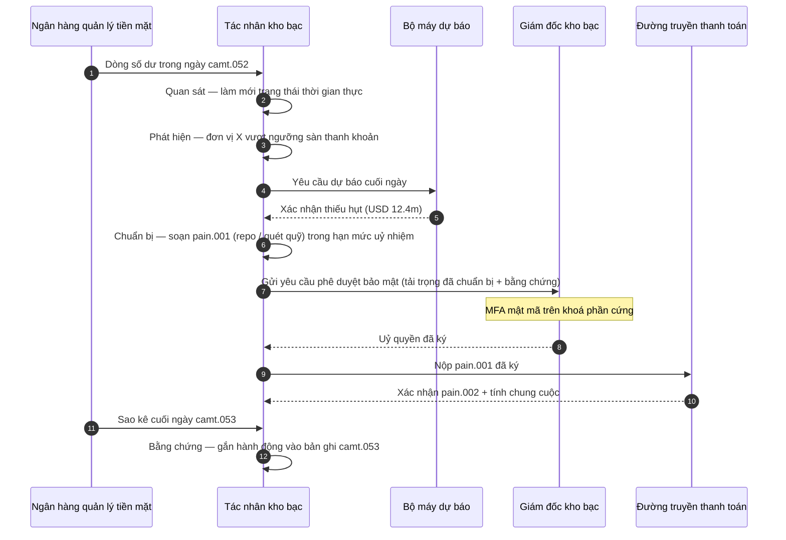

# Chỉ số Kho bạc Tự trị 2026: Kho bạc tác tử, thanh khoản có thể lập trình, tiền gửi token hoá và kiểm soát tiền mặt thời gian thực

<!-- lead-start -->
<aside class="post-lead" aria-label="Tóm tắt bài viết">

<strong>Tóm lược.</strong> Một chỉ số kho bạc tự trị 2026 — đo lường quy trình tác tử, độ bao phủ thanh khoản có thể lập trình, tích hợp tiền gửi token hoá, điều phối thanh toán thời gian thực và kiểm soát tiền mặt tự động như một cấu trúc mô hình vận hành duy nhất.

<strong>Điểm chính</strong>

<ul class="post-lead-takeaways">
  <li><strong>Kho bạc đang trở thành hệ điều hành thời gian thực.</strong> Dự báo tiền mặt tĩnh và các đợt quét quỹ theo lô không còn là đơn vị đo lường; quy trình tác tử chạy trên dữ liệu thời gian thực mới là.</li>
  <li><strong>Thanh khoản có thể lập trình nay đã khả thi.</strong> Tiền gửi token hoá kết hợp đường truyền thời gian thực biến việc cấp thanh khoản theo từng sự kiện thành nguyên thủy quy trình, không còn là sáng kiến hàng quý.</li>
  <li><strong>Tiền gửi token hoá là loại tiền số ưa thích của giám đốc kho bạc.</strong> Kinh tế tiền ngân hàng, khả năng lập trình và sự chắc chắn trong ngày — không kèm rủi ro tổ chức phát hành và câu hỏi về dự trữ như stablecoin.</li>
  <li><strong>Mặt phẳng điều khiển là bề mặt kiểm toán mới.</strong> Ủy nhiệm, hạn mức, đường ghi đè thủ công và bằng chứng đảo ngược phải chạy như nguyên thủy nền tảng, không phải phê duyệt thủ công theo từng hành động.</li>
  <li><strong>Bảng điểm CFO là theo từng quyết định, không phải theo từng quý.</strong> Chi phí tiền mặt, mức giảm đệm thanh khoản trong ngày, hiệu quả FX và độ chính xác dự báo được đo ở tốc độ quy trình.</li>
</ul>

<strong>Đọc liên quan:</strong> <a href="https://sebastienrousseau.com/2026-05-25-programmable-liquidity-ai-tokenised-deposits-real-time-treasury-2026/index.html">Thanh khoản có thể lập trình năm 2026: AI, tiền gửi token hoá và điều phối kho bạc thời gian thực</a>, <a href="https://sebastienrousseau.com/2026-05-21-tokenised-deposits-banking-services-status-2026/index.html">Tiền gửi token hoá năm 2026: Dịch vụ ngân hàng, cạnh tranh stablecoin và hiện trạng của tiền ngân hàng thương mại có thể lập trình</a>.

</aside>
<!-- lead-end -->

Kho bạc tự trị là điểm gặp tự nhiên của AI tác tử, thanh toán bán buôn, tiền gửi token hoá và thanh khoản thời gian thực. Trong năm 2026, các kiến trúc kho bạc tốt nhất sẽ không chỉ đơn thuần dự báo tiền mặt; chúng sẽ khuyến nghị, giải thích và rốt cuộc thực thi các hành động thanh khoản có ranh giới xuyên qua tài khoản, đồng tiền, đường truyền và tài sản quyết toán.

---

> **Tóm tắt điều hành / Điểm chính**
>
> - **Kho bạc đang chuyển từ báo cáo sang kiểm soát.** Số dư thời gian thực, dự báo, trạng thái thanh toán và chuyển động thanh khoản đang trở thành một phần của cùng một quy trình.
> - **AI tác tử tạo ra giao diện kho bạc mới.** Tác tử có thể giám sát trạng thái, làm nổi bật điểm bất thường, chuẩn bị hành động cấp vốn và leo thang quyết định trong phạm vi ủy nhiệm đã định.
> - **Tiền có thể lập trình thay đổi nhánh tiền mặt.** Tiền gửi token hoá và các thử nghiệm CBDC bán buôn tạo ra khả năng mới cho quyết toán nguyên tử, thanh toán có điều kiện và thanh khoản luôn sẵn sàng.
> - **Chỉ số phải đo lường thẩm quyền.** Câu hỏi không phải tác tử có thể đề xuất một hành động hay không; mà là thẩm quyền, hạn mức, phê duyệt và bằng chứng có rõ ràng hay không.
> - **Giá trị kho bạc có thể đo lường được.** Thanh khoản tiết kiệm được, các cuộc điều tra thủ công giảm đi, thất bại quyết toán tránh được và vốn lưu động được giải phóng cần xác định thành công.
>
---

## Vì sao 2026 là năm chỉ số này trở thành chiến lược

Chỉ số AI Stanford hữu ích vì nó coi một lĩnh vực công nghệ chuyển động nhanh như điều gì đó có thể đo lường được: sản lượng nghiên cứu, hiệu năng kỹ thuật, triển khai có trách nhiệm, kinh tế, mức độ chấp nhận theo ngành, chính sách và cảm xúc công chúng đều được đưa vào một khung duy nhất ([Stanford HAI ⧉](https://hai.stanford.edu/ai-index/2026-ai-index-report "Báo cáo Chỉ số AI 2026")). Ngân hàng và các định chế tài chính nay cần kỷ luật tương tự cho hạ tầng. AI tác tử, an ninh kháng lượng tử, độ bền cloud-native và thanh toán bán buôn không còn là các nhánh đổi mới riêng biệt; chúng đang hội tụ thành một mô hình vận hành duy nhất.

Câu hỏi thực tế đối với một ngân hàng không phải là từng lĩnh vực có quan trọng hay không. Mà là định chế đó có thể đo lường mức sẵn sàng xuyên suốt tất cả các lĩnh vực đó cùng một lúc hay không. Một ngân hàng có thể triển khai AI tác tử mà vẫn dễ vỡ nếu mật mã chưa sẵn sàng cho di trú. Có thể hiện đại hoá nền tảng cloud mà vẫn thất bại nếu dữ liệu thanh toán còn phi cấu trúc. Có thể chạy các thử nghiệm token hoá mà vẫn tạo ra rủi ro hệ thống nếu các lớp quyết toán, thanh khoản, định danh và kiểm toán không được thiết kế cùng nhau.

## Kiến trúc Chỉ số 2026

| Lớp chỉ số | Hướng đi 2026 | Chỉ số mức sẵn sàng | Rủi ro nếu xử lý sai |
|---|---|---|---|
| **Khả năng quan sát** | Hợp nhất dữ liệu tài khoản, thanh toán, thanh khoản và phơi nhiễm | Độ bao phủ trạng thái tiền mặt thời gian thực | Hiển thị tiền mặt phân mảnh |
| **Dự báo** | Dùng AI để dự báo số dư, dòng tiền và nhu cầu cấp vốn | Độ chính xác dự báo và tỷ lệ ngoại lệ | Niềm tin sai vào dữ liệu yếu |
| **Tự trị** | Trao cho tác tử thẩm quyền có ranh giới đối với khuyến nghị và hành động | Độ bao phủ ủy nhiệm và chất lượng phê duyệt | Hành động không được uỷ quyền hoặc không giải thích được |
| **Khả năng lập trình** | Dùng tiền gửi token hoá và điều kiện thông minh nơi chúng tạo giá trị | Trường hợp thanh toán có điều kiện và quyết toán nguyên tử | Các thử nghiệm kho bạc dẫn dắt bởi công nghệ |
| **Kiểm soát** | Nhúng hạn mức, trừng phạt, FX, thanh khoản và biện pháp kiểm soát kiểm toán | Bằng chứng kiểm soát theo từng hành động kho bạc | Quản trị thủ công sau khi thực thi |

## Các tín hiệu hiện tại cần theo dõi

| Tín hiệu | Ý nghĩa với ngân hàng | Nguồn |
|---|---|---|
| **52% mức chấp nhận AI tác tử trong dịch vụ tài chính** | Kho bạc nay có thể hấp thụ quy trình tác tử qua các nền tảng được quản trị | [Cambridge CCAF ⧉](https://www.jbs.cam.ac.uk/faculty-research/centres/alternative-finance/publications/2026-global-ai-in-financial-services-report/ "Báo cáo AI toàn cầu trong dịch vụ tài chính 2026") |
| **Thanh toán có điều kiện của Project Agorá** | Token hoá có thể cho phép năng lực thanh toán có điều kiện và luôn sẵn sàng | [BIS ⧉](https://www.bis.org/about/bisih/topics/fmis/agora.htm "Project Agorá") |
| **Bank of England — Digital Securities Sandbox** | Trái phiếu và cổ phiếu phát hành trên DLT được quyết toán trên cơ sở 「Giao hàng đối ứng thanh toán (DvP)」 — nhánh tài sản và nhánh tiền mặt (CBDC bán buôn hoặc tiền gửi ngân hàng thương mại token hoá) được quyết toán trong cùng một giao dịch nguyên tử, loại bỏ rủi ro đối tác gốc | [Bank of England ⧉](https://www.bankofengland.co.uk/financial-stability/digital-securities-sandbox "Digital Securities Sandbox") |
| **Hạn chót địa chỉ có cấu trúc của SWIFT** | Dữ liệu kho bạc phải được nắm bắt chính xác từ nguồn | [SWIFT ⧉](https://www.swift.com/news-events/news/iso-20022-milestone-november-2026-unstructured-addresses-be-removed "Mốc địa chỉ có cấu trúc ISO 20022 tháng 11 năm 2026") |
| **Các định chế tài chính lớn gặp khó khi đo lường giá trị AI** | Tự động hoá kho bạc cần các chỉ số kinh tế cứng | [Cambridge CCAF ⧉](https://www.jbs.cam.ac.uk/faculty-research/centres/alternative-finance/publications/2026-global-ai-in-financial-services-report/ "Báo cáo AI toàn cầu trong dịch vụ tài chính 2026") |

## Ủy nhiệm của tác nhân kho bạc

Tác nhân kho bạc không nên được thiết kế như một trợ lý đa năng. Nó cần một ủy nhiệm: quan sát tài khoản, phát hiện ngoại lệ, dự báo lỗ hổng cấp vốn, chuẩn bị hành động, yêu cầu phê duyệt, thực thi trong hạn mức và tạo bằng chứng. Mỗi bước cần có một mô hình thẩm quyền khác nhau.

Vòng lặp kiểm soát chạy theo trình tự Quan sát → Phát hiện → Dự báo → Chuẩn bị → Yêu cầu phê duyệt — rồi dừng. Tác nhân không bao giờ tự mình vượt qua ranh giới uỷ quyền mật mã. Sơ đồ bên dưới mô tả một chu kỳ trọn vẹn: một khoản thiếu hụt thanh khoản trong ngày trị giá hàng triệu đô la xuất hiện trong dòng dữ liệu `camt.052`, tác nhân dự báo trạng thái cuối ngày, chuẩn bị một giao dịch repo hoặc quét quỹ liên công ty dưới dạng `pain.001` được định hình đầy đủ, rồi chuyển giao cho giám đốc kho bạc để ký mật mã đa yếu tố trên khoá phần cứng. Tác nhân sau đó nộp tải trọng đã ký; tính chung cuộc đến dưới dạng xác nhận `pain.002` và bản `camt.053` ghi nhận tiếp theo.

Ranh giới chính là trọng điểm — mọi hành động dịch chuyển tiền thật đều nằm sau một cổng mật mã mà tác nhân không thể tự mình thoả mãn.

## Thanh khoản có thể lập trình

Thanh khoản có thể lập trình là khả năng dịch chuyển giá trị theo điều kiện: nếu một ngưỡng bị vượt, nếu tài sản thế chấp đủ điều kiện, nếu đối tác qua được sàng lọc, nếu tính chung cuộc quyết toán có sẵn, hoặc nếu đệm thanh khoản trong ngày quá thấp. Tiền gửi token hoá và các nền tảng quyết toán bán buôn làm cho các mẫu này trở nên thực tế hơn.

Có thể lập trình không có nghĩa là phi tiêu chuẩn. Đường thực thi là `pain.001` — Khởi tạo Chuyển khoản Tín dụng Khách hàng theo ISO 20022. Hành động đã chuẩn bị của tác nhân là một tải trọng `pain.001` được định hình đầy đủ, định tuyến đến ngân hàng qua cùng kênh mà một hệ thống ERP doanh nghiệp sẽ sử dụng, được xác thực theo cùng lược đồ, được chấm điểm bởi cùng các bộ máy chống gian lận và trừng phạt, và được xác nhận trên cùng các báo cáo trạng thái `pain.002`. Lớp điều kiện (ngưỡng, đủ điều kiện tài sản thế chấp, sẵn có tính chung cuộc, sàn đệm) nằm trên thông điệp — nó kiểm soát *liệu* một `pain.001` có được gửi hay không, chứ không phải *hình dạng* nào của nó. Các nền tảng kho bạc tự sáng tạo tải trọng riêng để diễn đạt điều kiện sẽ rơi ra khỏi đường tiêu thụ của ngân hàng và quay trở lại tích hợp song phương.

## Phòng kiểm soát kho bạc

Mô hình vận hành nên trông giống như một phòng kiểm soát: trạng thái, dự báo, trạng thái thanh toán, mức sử dụng hạn mức, ngoại lệ, phê duyệt và bằng chứng trong một giao diện. Chỉ số nên trừng phạt các kho bạc đòi hỏi đội ngũ phải khâu vá email, bảng tính, cổng ngân hàng và các bảng điều khiển rời rạc.

Mặt phẳng dữ liệu phía sau giao diện đó là quản lý tiền mặt ISO 20022. Trạng thái trong ngày là `camt.052` — Báo cáo Tài khoản Ngân hàng đến Khách hàng — được phát trực tuyến từ mọi ngân hàng quản lý tiền mặt vào lớp quan sát của tác nhân theo tần suất mà ngân hàng công bố (theo phút đối với nhà cung cấp GTB hạng nhất, theo cuối chu kỳ đối với nhóm còn lại). Đối chiếu cuối ngày là `camt.053` — Sao kê Ngân hàng đến Khách hàng — bản ghi có thể kiểm toán mà dự báo của tác nhân được chấm điểm vào sáng hôm sau. Các nền tảng kho bạc đọc sao kê PDF hoặc cào màn hình cổng ngân hàng không thể đáp ứng 「Cấp 4」 của chỉ số; dữ liệu trong ngày phải đến dưới dạng `camt.052` có cấu trúc để vòng dự báo khép lại kịp thời gian hành động.

## Ý nghĩa theo loại hình ngân hàng

### Ngân hàng có tầm quan trọng hệ thống toàn cầu

Ngân hàng toàn cầu nên coi chỉ số này là bảng điểm kiến trúc doanh nghiệp. Ưu tiên không phải thêm một bằng chứng khái niệm; mà là bằng chứng rằng các quy trình tự trị, di trú mật mã, phụ thuộc cloud và hiện đại hoá thanh toán có thể được quản trị như một hệ thống rủi ro và giá trị duy nhất.

### Ngân hàng giao dịch và ngân hàng doanh nghiệp

Ngân hàng giao dịch nên tập trung vào thanh toán bán buôn, dữ liệu có cấu trúc, thanh khoản, tiền gửi token hoá và dịch vụ kho bạc tác tử. Đề xuất giá trị nhất cho khách hàng không chỉ là dịch chuyển tiền nhanh hơn; mà là dịch chuyển tiền có thể giải thích, có thể kiểm toán và có thể lập trình với ít cuộc điều tra hơn và hiển thị vốn lưu động tốt hơn.

### Ngân hàng khu vực

Ngân hàng khu vực nên dùng chỉ số này để tránh chương trình tràn lan. Họ không cần dẫn đầu mọi mặt trận, nhưng cần các vị thế đáng tin cậy về quản trị AI, kiểm kê hậu lượng tử, bằng chứng thoát cloud và mức sẵn sàng dữ liệu thanh toán.

### Fintech, PSP và nhà cung cấp hạ tầng

Fintech và nhà cung cấp hạ tầng nên gắn lộ trình sản phẩm với mức sẵn sàng ngân hàng đo lường được. Các đề xuất tốt nhất sẽ giảm rủi ro tích hợp, củng cố bằng chứng và làm cho hạ tầng phức tạp dễ quản trị hơn cho ngân hàng.

## Kết luận

Giá trị của một báo cáo theo dạng chỉ số là nó chuyển đổi một chương trình công nghệ phân mảnh thành một mô hình vận hành có thể đo lường được. Trong năm 2026, các tổ chức chiến thắng trong hạ tầng tài chính sẽ không phải là tổ chức có nhiều thử nghiệm nhất. Họ sẽ là các định chế có thể chứng minh mức sẵn sàng đồng thời trên các trục tự trị, an ninh, độ bền, quyết toán, kinh tế và quản trị.

## Câu hỏi thường gặp

**Kho bạc tự trị là gì?**

Kho bạc tự trị là việc sử dụng tác tử AI, dữ liệu thời gian thực và thanh toán có thể lập trình để giám sát, khuyến nghị và có thể thực thi các hành động kho bạc trong phạm vi kiểm soát đã định.

**Tác tử kho bạc có nên được phép thực thi thanh toán?**

Chỉ trong phạm vi các ủy nhiệm hẹp, hạn mức mạnh, phê duyệt rõ ràng và khả năng kiểm toán đầy đủ. Thẩm quyền thực thi cần được giành lấy qua sự trưởng thành.

**Tiền gửi token hoá hỗ trợ kho bạc ra sao?**

Chúng có thể hỗ trợ quyết toán có thể lập trình, thực thi nguyên tử và có thể giúp kiểm soát thanh khoản trong ngày tốt hơn trong khi vẫn giữ các quan hệ tiền ngân hàng thương mại.

**Bước triển khai đầu tiên là gì?**

Xây hiển thị thời gian thực và chất lượng dữ liệu trước khi trao quyền tự trị. Tác tử không thể tối ưu hoá an toàn lượng tiền mà chúng không thể thấy chính xác.

## Tham khảo

- Cambridge Centre for Alternative Finance, (2026). [Báo cáo AI toàn cầu trong dịch vụ tài chính 2026 ⧉](https://www.jbs.cam.ac.uk/faculty-research/centres/alternative-finance/publications/2026-global-ai-in-financial-services-report/ "Báo cáo AI toàn cầu trong dịch vụ tài chính 2026").
- SWIFT, (2026). [Mốc địa chỉ có cấu trúc ISO 20022 tháng 11 năm 2026 ⧉](https://www.swift.com/news-events/news/iso-20022-milestone-november-2026-unstructured-addresses-be-removed "Mốc địa chỉ có cấu trúc ISO 20022 tháng 11 năm 2026").
- BIS Innovation Hub, (2026). [Project Agorá ⧉](https://www.bis.org/about/bisih/topics/fmis/agora.htm "Project Agorá").
- Bank of England, (2026). [Định hình tương lai tài chính số của Vương quốc Anh ⧉](https://www.bankofengland.co.uk/speech/2025/january/sasha-mills-speech-at-the-tokenisation-summit "Định hình tương lai tài chính số của Vương quốc Anh").

<!-- enrich-start -->
<aside class="author-card" aria-label="Về tác giả"><strong class="author-card-name"><a href="/about/index.html">Sebastien Rousseau</a></strong>Chuyên gia công nghệ ngân hàng cấp cao, viết về AI ứng dụng, hạ tầng thanh toán, tiền được mã hóa token, ISO 20022, an ninh hậu lượng tử, dịch vụ tài chính cloud-native và thị trường số được quản lý.Hơn 20 năm kinh nghiệm tại HSBC Commercial &amp; Investment Bank, PayPal, Barclays, Shazam, AKQA, Virgin Group. <a href="/about/index.html">Hồ sơ đầy đủ</a> &middot; <a href="https://www.linkedin.com/in/sebastienrousseau/" rel="external noopener">LinkedIn</a> &middot; <a href="https://github.com/sebastienrousseau" rel="external noopener">GitHub</a></aside>

Đã rà soát gần nhất <time datetime="2026-06-07">2026-06-07</time>.

<!-- enrich-end -->
