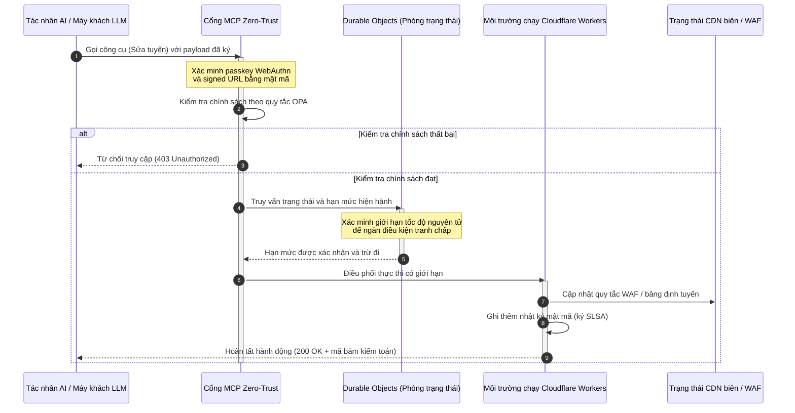

# CloudCDN: bản thiết kế mã nguồn mở cho biên AI-bản địa 2026

<!-- lead-start: manual -->
<aside class="post-lead" aria-label="Tóm tắt bài viết">

<strong>TL;DR.</strong> Công nghệ doanh nghiệp năm 2026 được định hình bởi sự hội tụ giữa thực thi serverless phân tán toàn cầu và AI tác nhân. CDN tiêu chuẩn — được xây dựng cho lưu đệm tệp tĩnh và định tuyến lưu lượng cơ bản — đã lỗi thời về mặt cấu trúc trong kỷ nguyên điều phối dữ liệu chủ động, thời gian thực. CloudCDN là bản thiết kế mã nguồn mở tái định hình biên thành mặt phẳng điều khiển chủ động: môi trường chạy serverless, điều phối trạng thái qua Cloudflare Durable Objects, và cổng Model Context Protocol (MCP) zero-trust cho phép các tác nhân AI tự chủ vận hành hạ tầng web bên trong các đường bao vận hành có giới hạn, được bảo đảm bằng mật mã.

<strong>Điểm chính</strong>

<ul class="post-lead-takeaways">
  <li><strong>Từ cache tĩnh sang mặt phẳng điều khiển có giới hạn.</strong> CloudCDN chuyển ranh giới vận hành ra biên, biến các nút CDN thành cổng chính sách chủ động thực thi quyết định bảo mật, định tuyến và kiểm soát truy cập dưới mili giây.</li>
  <li><strong>Điều phối trạng thái tại biên.</strong> Cloudflare Durable Objects thực thi giới hạn tốc độ nguyên tử, thời gian thực và điều phối trạng thái trên toàn cầu — không có điều kiện tranh chấp phân tán, không có lạm dụng hạn mức hệ thống giữa các khu vực biên.</li>
  <li><strong>Quản trị hạ tầng bằng tác nhân an toàn qua MCP.</strong> Một cổng zero-trust phơi bày 42 công cụ MCP chuyên biệt, cho phép tác nhân AI kiểm tra, cấu hình và vận hành hạ tầng trong giới hạn được ký bằng mật mã.</li>
  <li><strong>Bảo mật chuỗi cung ứng là một sản phẩm bàn giao của pipeline.</strong> Nguồn gốc bản dựng SLSA Level 3 qua Sigstore/Cosign và 3.185 kiểm thử đơn vị với độ phủ 100% trên mỗi bản phát hành.</li>
  <li><strong>Bằng chứng cấp hội đồng quản trị, không phải dashboard.</strong> Dữ liệu đo từ biên ánh xạ trực tiếp tới trách nhiệm hội đồng quản trị theo Điều 5 DORA, báo cáo rủi ro BCBS 239 và quy tắc vốn rủi ro vận hành Basel III.</li>
</ul>

<strong>Đọc liên quan:</strong> <a href="/2026-05-16-best-cloud-infrastructure-architecture-2026/">Kiến trúc hạ tầng đám mây tốt nhất năm 2026: bản thiết kế AI-bản địa, đa đám mây, nhận thức lượng tử cho dịch vụ tài chính</a> · <a href="/2026-06-05-cloud-native-banking-index-dora-resilience-platform-engineering-2026/">Chỉ số ngân hàng cloud native năm 2026: DORA, kỹ thuật nền tảng, đám mây chủ quyền và khả năng phục hồi vận hành</a> · <a href="/2026-06-03-agentic-ai-index-banks-autonomy-governance-auditability-2026/">Chỉ số AI tác nhân cho ngân hàng năm 2026: đo lường tính tự chủ, quản trị, khả năng kiểm toán và tác động kinh doanh</a>.

</aside>
<!-- lead-end -->

Cuộc tranh luận về CDN đã kết thúc. Biên không còn là một bộ nhớ đệm; nó là mặt phẳng điều khiển cho phần mềm AI-bản địa. Khi tác nhân gọi công cụ, di chuyển dữ liệu, thanh lọc cache, yêu cầu signed URLs và điều phối quy trình, mô hình cũ với dashboard mờ đục và mặt phẳng điều khiển độc quyền không còn là một bất tiện mà trở thành một rủi ro pháp lý. CloudCDN lập luận cho một mô hình khác: một nền tảng biên mở, có thể kiểm tra, có thể điều khiển bằng tác nhân, coi bảo mật, khả năng truy cập, hiệu năng và khả năng kiểm toán là các mặc định có thể thực thi thay vì lời hứa của nhà cung cấp.

Điểm tham chiếu mã nguồn mở của bài viết này là [cloudcdn.pro ⧉](https://github.com/sebastienrousseau/cloudcdn.pro "cloudcdn.pro"). Kho mã là một CDN AI-bản địa, đa khách hàng, có thể đọc từ đầu đến cuối và triển khai độc lập: TTFB dưới 100ms trên các PoP của Cloudflare, điều khiển bằng MCP, giới hạn tốc độ Durable Objects, khả năng truy cập WCAG-AA, signed URLs, passkey, SLSA Level 3 và 3.185 kiểm thử với độ phủ 100%.

---

> **Tóm tắt điều hành / Điểm chính**
>
> - **Biên trở thành ranh giới vận hành.** CloudCDN biến các nút CDN tiêu chuẩn thành cổng chính sách chủ động thực thi bảo mật, định tuyến và kiểm soát truy cập dưới mili giây.
> - **Durable Objects làm cho giới hạn tốc độ trở nên nguyên tử.** Việc thực thi hạn mức nhất quán toàn cầu, thời gian thực đóng lại cửa sổ điều kiện tranh chấp mà các bộ giới hạn nhất quán cuối cùng (eventually consistent) bỏ ngỏ cho kẻ tấn công và tác nhân trục trặc.
> - **Tác nhân vận hành hạ tầng qua 42 công cụ MCP có giới hạn.** Mọi lời gọi đều được xác minh theo passkey WebAuthn, payload đã ký và chính sách OPA trước khi bất kỳ điều gì được thực thi.
> - **Chuỗi cung ứng là một phần của sản phẩm.** Nguồn gốc bản dựng SLSA Level 3 qua Sigstore/Cosign liên kết mỗi bản phát hành với mã nguồn đã kiểm toán bằng mật mã.
> - **Dữ liệu đo là bằng chứng tuân thủ.** Các thao tác tại biên ánh xạ tới Điều 5 DORA, BCBS 239 và vốn rủi ro vận hành Basel III — một cách trực tiếp, không qua báo cáo hồi tố.
>
---

## Vì sao dự án mã nguồn mở này quan trọng trong 2026

CNTT doanh nghiệp năm 2026 đã chuyển từ cấp phát hạ tầng tĩnh sang điều phối dữ liệu hướng sự kiện, thời gian thực. Hai lực thị trường thúc đẩy sự chuyển dịch này.

Thứ nhất là sự lan rộng của AI tác nhân. Các mô hình tự chủ và tác nhân phần mềm nay thực hiện các tác vụ vận hành phức tạp — giảm thiểu mối đe dọa tự động, quyết định định tuyến, cân bằng sổ cái thời gian thực. Chúng không dùng dashboard. Chúng gọi công cụ.

Thứ hai là việc thực thi chủ động [Đạo luật về Khả năng Phục hồi Vận hành Số (DORA) ⧉](https://eur-lex.europa.eu/legal-content/EN/TXT/?uri=CELEX%3A32022R2554 "Quy định (EU) 2022/2554 về khả năng phục hồi vận hành số cho khu vực tài chính"). Các định chế ngân hàng không còn có thể dựa vào CDN bên thứ ba độc quyền, mờ đục. Cơ quan quản lý yêu cầu khả năng nhìn thấu toàn bộ chuỗi cung ứng phần mềm, năng lực rút lui có thể xác minh và dấu vết kiểm toán mật mã không thể sửa đổi.

Kiến trúc máy chủ tập trung áp đặt độ trễ mà điều phối thời gian thực không thể hấp thụ. CDN độc quyền vận hành như hộp đen, đẩy các định chế vào rủi ro xâm phạm chuỗi cung ứng mà họ không thể nhìn thấy, chứ chưa nói tới chứng minh. CloudCDN đóng khoảng trống đó bằng một bản thiết kế mã nguồn mở minh bạch, zero-trust, biến biên thành mặt phẳng điều khiển chủ động. Với lãnh đạo công nghệ, nó chuyển cuộc đối thoại từ chi phí tuân thủ sang Return on Resilience — lợi suất của khả năng phục hồi: vốn được bảo toàn nhờ các pipeline vận hành tự động, sẵn sàng cho kiểm toán.

## Góc nhìn kiến trúc

Kiến trúc CloudCDN được cấu trúc theo năm tầng, thay middleware tập trung bằng các nguyên thủy biên cục bộ, có trạng thái:

| Tầng | Quyết định thiết kế | Vì sao quan trọng | Rủi ro nếu xử lý sai |
|---|---|---|---|
| **Môi trường chạy biên** | Cloudflare Workers và Pages | Loại bỏ độ trễ của VM tập trung; thực thi chính sách dưới mili giây trên toàn cầu | Lợi ích hiệu năng thiếu kỷ luật chính sách tạo ra trôi dạt biên hỗn loạn |
| **Điều phối trạng thái** | Durable Objects | Bảo đảm tính nhất quán nguyên tử, thời gian thực cho giới hạn tốc độ và trạng thái chia sẻ giữa các khu vực | Điều kiện tranh chấp phân tán, lạm dụng tài nguyên API, hạn mức vành đai bị vượt qua |
| **Giao diện tác nhân** | Cổng MCP zero-trust | Phơi bày 42 công cụ MCP chuyên biệt để tác nhân AI vận hành hạ tầng trong giới hạn được quản trị | Lời gọi công cụ không giới hạn và thay đổi cấu hình trái phép |
| **Kiểm soát truy cập** | Passkey WebAuthn và signed URLs | Thay mật khẩu tĩnh bằng chữ ký mật mã cho các thao tác có thể kiểm toán | Thay đổi khó quy trách nhiệm; đánh cắp thông tin xác thực dẫn tới xâm nhập vành đai |
| **Cổng chất lượng** | SLSA Level 3 và độ phủ kiểm thử 100% | Xác minh nguồn bản dựng bằng toán học; chặn tiêm phụ thuộc độc hại | Mã độc được chèn qua chuỗi cung ứng phần mềm |

## Tín hiệu vận hành cần theo dõi

Mức độ sẵn sàng tại biên đo được. Đây là các chỉ số định lượng chứng minh năng lực thực thi thay vì ý định:

| Tín hiệu | Chỉ số / Chuẩn đối sánh | Tham chiếu pháp lý | Triển khai nền tảng |
|---|---|---|---|
| **42 công cụ MCP** | Số lượng công cụ trong sổ đăng ký có giới hạn cho quản trị tự động | COBIT 2019 (BAI06) | Cổng MCP xác minh chữ ký tác nhân theo chính sách OPA |
| **Durable Objects** | Thực thi hạn mức nguyên tử dưới mili giây, không rò rỉ | Điều 6 DORA | Durable Objects theo dõi trạng thái hạn mức API toàn cầu |
| **Passkey và signed URLs** | 100% phiên quản trị được xác minh qua FIDO2 WebAuthn | Điều 30 DORA | Kiểm tra chữ ký mật mã nhúng trong bộ định tuyến biên |
| **SLSA Level 3** | Bản kê bản dựng được ký bằng mật mã (Sigstore) | Điều 30 DORA | Pipeline GitHub Actions sinh siêu dữ liệu bản dựng đã ký |
| **3.185 kiểm thử đơn vị** | Độ phủ 100%; cổng chặn hồi quy trên mỗi bản phát hành | NIST CSF 2.0 (PR.DS-01) | Pipeline CI dừng triển khai khi bất kỳ kiểm thử nào thất bại |

## CDN trở thành mặt phẳng điều khiển chủ động

CDN truyền thống được thiết kế quanh việc tăng tốc nội dung tĩnh, thụ động. CloudCDN định nghĩa lại mô hình đó. Với Cloudflare Workers và Durable Objects được tích hợp, biên vận hành như một cổng chính sách chủ động, có trạng thái.

Khi một tác nhân AI hay tiến trình tự động yêu cầu thay đổi cấu hình hạ tầng hoặc điều chỉnh định tuyến, nó không nói chuyện với một cơ sở dữ liệu tập trung dễ tổn thương. Yêu cầu được chặn tại nút biên gần nhất và đi qua các bước kiểm tra danh tính, chính sách và hạn mức trước khi bất kỳ điều gì được thực thi:

Mỗi bước trong chuỗi đó tạo ra một bản ghi có chữ ký, quy được trách nhiệm. Đó là khác biệt giữa một CDN tăng tốc nội dung và một mặt phẳng điều khiển có thể được quản trị.

## Vì sao mã nguồn mở thay đổi mô hình tin cậy

Với các Giám đốc An ninh Thông tin (CISO), CDN độc quyền mờ đục là một rủi ro tích lũy. Mạng biên mã nguồn đóng là hộp đen: nếu nhà cung cấp bị xâm phạm nội bộ, ngân hàng không có chút khả năng nhìn thấy nào cho tới khi vụ việc được công bố.

CloudCDN thay sự bất cân xứng đó bằng một mô hình tin cậy mã nguồn mở, kiểm toán được toàn diện, dựa trên ba cơ chế:

1. **Nguồn gốc bản dựng chứng minh bằng toán học.** Theo SLSA Level 3, mỗi bản phát hành được liên kết bằng mật mã với kho GitHub mã nguồn mở của nó. Một CISO có thể xác minh — bằng toán học, không phải bằng hợp đồng — rằng tệp nhị phân chạy trên các nút biên toàn cầu của Cloudflare chứa đúng mã nguồn đã được kiểm toán.
2. **Kiểm toán bảo mật liên tục, công khai.** Mã nguồn chịu quét tự động, công bố lỗ hổng công khai và kiểm toán mã có bình duyệt. Sự che giấu không phải là một biện pháp kiểm soát; sự rà soát mới là.
3. **Không khóa chặt vào nhà cung cấp (Điều 28 DORA).** DORA yêu cầu ngân hàng chứng minh một chiến lược rút lui rõ ràng, đã kiểm thử khỏi các nhà cung cấp bên thứ ba trọng yếu. Vì CloudCDN là mã nguồn mở và xây trên các nguyên thủy serverless tiêu chuẩn, định chế có thể di chuyển cấu hình biên từ Cloudflare sang các môi trường serverless khác hoặc cụm Kubernetes riêng — và chứng minh năng lực đó với cơ quan quản lý.

## Mô hình biên chuẩn ngân hàng

CloudCDN được thiết kế để đáp ứng các chuẩn tuân thủ của khu vực tài chính toàn cầu, ánh xạ trực tiếp các thao tác kỹ thuật tại biên tới những khung mà cơ quan giám sát thực sự kiểm tra:

- **Quản lý rủi ro mô hình ([US Fed SR 11-7 ⧉](https://www.federalreserve.gov/supervisionreg/srletters/sr1107.htm "Hướng dẫn giám sát về quản lý rủi ro mô hình") / UK PRA SS1/23).** Các mô hình tự chủ thực thi tác vụ vận hành thuộc phạm vi quản trị rủi ro mô hình. Cổng MCP của CloudCDN coi công cụ tác nhân như mô hình định lượng: giới hạn chính sách chặt, ghi nhật ký thời gian thực và bắt buộc có con người can thiệp đối với hành động tác động cao.
- **BCBS 239 (tổng hợp dữ liệu rủi ro).** Bằng cách thu thập, gắn nhãn và cấu trúc dữ liệu giao dịch ngay tại biên, các chỉ số vận hành được sinh ra theo thời gian thực — khớp với yêu cầu của BCBS 239 về tính toàn vẹn dữ liệu, tính kịp thời và khả năng truy vết pháp lý.
- **Điều 5 DORA (trách nhiệm hội đồng quản trị).** Hội đồng quản trị chịu trách nhiệm cá nhân cuối cùng về khả năng phục hồi vận hành. CloudCDN chuyển dữ liệu đo từ biên thành bằng chứng định lượng, xác minh được mà các thành viên hội đồng không chuyên kỹ thuật có thể mang vào một cuộc kiểm toán trách nhiệm cá nhân.
- **Vốn rủi ro vận hành Basel III.** Ngân hàng giữ vốn pháp định cho rủi ro vận hành. Chuyển dự phòng DR tự động và nguồn gốc bản dựng SLSA Level 3 giảm hồ sơ rủi ro vận hành của định chế — bảo toàn vốn trên bảng cân đối, không chỉ làm hài lòng một cuộc kiểm toán.

## Ý nghĩa theo loại hình ngân hàng

### Ngân hàng quan trọng hệ thống toàn cầu (G-SIB)

G-SIB xử lý khối lượng giao dịch khổng lồ trên nhiều khu vực pháp lý. Ưu tiên là thay các kiểm soát vành đai kế thừa, phân mảnh bằng một mặt phẳng biên hợp nhất duy nhất. Triển khai mô hình CloudCDN cho phép một G-SIB chuẩn hóa chính sách bảo mật, cổng API và quản trị tác nhân trên toàn cầu — và sinh ra các pipeline bằng chứng tuân thủ DORA như một sản phẩm phụ của vận hành thay vì một cuộc chạy nước rút mỗi quý.

### Ngân hàng giao dịch và ngân hàng doanh nghiệp

Với ngân hàng giao dịch, sản phẩm hướng tới khách hàng là một gói gồm tốc độ thực thi, bảo mật và minh bạch dữ liệu. Mô hình CloudCDN cho phép các ngân hàng này cung cấp dashboard API bảo mật và dịch vụ theo dõi tiền mặt thời gian thực cho giám đốc ngân quỹ doanh nghiệp — một tư thế biên có khả năng phục hồi giúp bảo vệ tiền gửi doanh nghiệp.

### Ngân hàng khu vực và ngân hàng nhỏ

Ngân hàng khu vực đối mặt với cùng các tác nhân đe dọa như G-SIB nhưng không có ngân sách kỹ thuật tương đương. Một bản thiết kế biên chuẩn ngân hàng, mã nguồn mở cung cấp các biện pháp kiểm soát sẵn dùng: sự phù hợp pháp lý ngay lập tức mà không tốn phí giấy phép độc quyền, kèm mã nguồn để chứng minh điều đó.

## Cẩm nang cho hội đồng quản trị

Khả năng phục hồi vận hành không còn là một chỉ số CNTT hậu trường vô hình; nó là ưu tiên của hội đồng quản trị, gắn với trách nhiệm cá nhân. Những định chế giữ được niềm tin của cơ quan quản lý, khách hàng và cổ đông trong năm 2026 coi công nghệ là một tài sản có thể xác minh, có thể quan sát.

Lộ trình cho lãnh đạo công nghệ cấp cao ngắn gọn:

1. **Bắt buộc coi bằng chứng là một sản phẩm.** Cấp ngân sách cho các pipeline tự động, tự tài liệu hóa tại biên — bằng chứng được sinh ra từ vận hành, không phải lắp ráp cho kiểm toán viên.
2. **Chuyển sang điều khiển biên có trạng thái.** Đưa giới hạn tốc độ, WAF và xác minh danh tính ra khỏi máy chủ tập trung, đặt lên các nguyên thủy biên nguyên tử.
3. **Thiết lập giới hạn tác nhân bằng mật mã.** Thực thi cổng MCP zero-trust với xác minh passkey và OPA cho mọi lời gọi công cụ tự động.
4. **Yêu cầu kiểm toán bản dựng mã nguồn mở.** Biến nguồn gốc bản dựng SLSA Level 3 thành điều kiện triển khai, không phải một nguyện vọng.

## Câu hỏi thường gặp

**CloudCDN đã sẵn sàng cho kiểm toán DORA chưa?**

Rồi. CloudCDN được thiết kế để sinh bằng chứng tuân thủ tự động, ánh xạ trực tiếp tới các mẫu ITS của Sổ đăng ký Thông tin (RT.01 đến RT.15) và các điều khoản hợp đồng theo Điều 30 DORA.

**Lợi thế của việc dùng Durable Objects cho giới hạn tốc độ là gì?**

Bộ giới hạn tốc độ phân tán truyền thống dựa vào tính nhất quán cuối cùng, để lại một cửa sổ độ trễ mà kẻ tấn công hoặc tác nhân trục trặc có thể khai thác. Durable Objects bảo đảm tính nhất quán nguyên tử, tức thời trên toàn cầu, đóng hoàn toàn cửa sổ điều kiện tranh chấp.

**Điều gì khiến CloudCDN AI-bản địa?**

Các thao tác do MCP điều khiển và mô hình kiểm soát nhận biết tác nhân. Hạ tầng được vận hành qua 42 công cụ được quản trị với danh tính mật mã và giới hạn chính sách — được thiết kế cho quy trình tự chủ, không chỉ cho dashboard của con người.

**Mã nguồn mở có làm tăng rủi ro khai thác zero-day không?**

Không. CDN độc quyền, mã nguồn đóng dựa vào bảo mật bằng che giấu. Mã nguồn của CloudCDN liên tục chịu kiểm thử tự động, bình duyệt công khai và xác minh SLSA Level 3 — một ngưỡng tin cậy cao hơn, có thể kiểm chứng.

## Tham khảo

- Nghị viện châu Âu và Hội đồng Liên minh châu Âu, (2022). [Quy định (EU) 2022/2554 về khả năng phục hồi vận hành số cho khu vực tài chính (DORA) ⧉](https://eur-lex.europa.eu/legal-content/EN/TXT/?uri=CELEX%3A32022R2554 "Quy định (EU) 2022/2554 về khả năng phục hồi vận hành số cho khu vực tài chính (DORA)"). Brussels: Công báo Liên minh châu Âu.
- Ủy ban Basel về Giám sát Ngân hàng (BCBS), (2013). [Các nguyên tắc tổng hợp dữ liệu rủi ro và báo cáo rủi ro hiệu quả (BCBS 239) ⧉](https://www.bis.org/publ/bcbs239.htm "Các nguyên tắc tổng hợp dữ liệu rủi ro và báo cáo rủi ro hiệu quả (BCBS 239)"). Basel: Ngân hàng Thanh toán Quốc tế.
- Hội đồng Thống đốc Cục Dự trữ Liên bang Hoa Kỳ, (2011). [Hướng dẫn giám sát về quản lý rủi ro mô hình (SR Letter 11-7) ⧉](https://www.federalreserve.gov/supervisionreg/srletters/sr1107.htm "Hướng dẫn giám sát về quản lý rủi ro mô hình (SR Letter 11-7)"). Washington D.C.: Cục Dự trữ Liên bang.
- Cloudflare, (2026). [Tài liệu Durable Objects: điều phối trạng thái tại biên ⧉](https://developers.cloudflare.com/durable-objects/ "Tài liệu Durable Objects"). San Francisco: Cloudflare.
- Cloudflare, (2026). [Xây dựng tác nhân AI với MCP, xác thực và Durable Objects ⧉](https://blog.cloudflare.com/building-ai-agents-with-mcp-authn-authz-and-durable-objects/ "Xây dựng tác nhân AI với MCP, xác thực và Durable Objects").
- GitHub, (2026). [Kho mã cloudcdn.pro ⧉](https://github.com/sebastienrousseau/cloudcdn.pro "Kho mã cloudcdn.pro").

<!-- enrich-start -->
<aside class="author-card" aria-label="Về tác giả"><strong class="author-card-name"><a href="/about/index.html">Sebastien Rousseau</a></strong>Chuyên gia công nghệ ngân hàng cấp cao, viết về AI ứng dụng, hạ tầng thanh toán, tiền được mã hóa token, ISO 20022, an ninh hậu lượng tử, dịch vụ tài chính cloud-native, hạ tầng mã nguồn mở và thị trường số được quản lý.Hơn 20 năm kinh nghiệm tại HSBC Commercial &amp; Investment Bank, PayPal, Barclays, Shazam, AKQA, Virgin Group. <a href="/about/index.html">Hồ sơ đầy đủ</a> &middot; <a href="https://www.linkedin.com/in/sebastienrousseau/" rel="external noopener">LinkedIn</a> &middot; <a href="https://github.com/sebastienrousseau" rel="external noopener">GitHub</a></aside>

Đã rà soát gần nhất <time datetime="2026-06-11">2026-06-11</time>.

<!-- enrich-end -->
