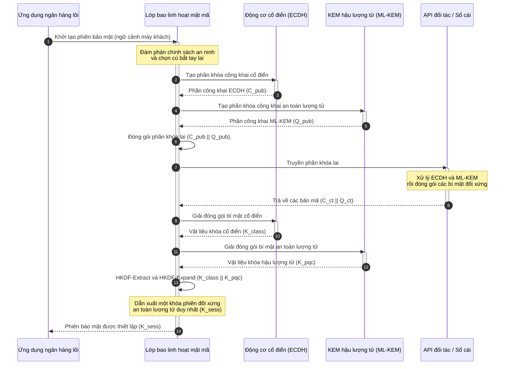

# KyberLib và di chuyển ngân hàng hậu lượng tử năm 2026: từ tiêu chuẩn đến mã

<!-- lead-start: manual -->
<aside class="post-lead" aria-label="Tóm tắt bài viết">

<strong>Tóm lược.</strong> Hạ tầng ngân hàng năm 2026 đối mặt với một mối đe dọa hệ thống có điểm kết đã biết: năng lực tính toán quy mô lượng tử sẽ phá vỡ trao đổi khóa RSA và ECC đang bảo vệ lưu lượng truyền tải hôm nay. Các tiêu chuẩn liên bang và tài liệu chính sách giám sát đã nâng cao nhận thức; phần thực thi kỹ thuật vẫn rời rạc. <a href="https://github.com/sebastienrousseau/kyberlib">KyberLib</a> là một bản thiết kế kỹ thuật mã nguồn mở đưa câu chuyện hậu lượng tử vào mã Rust cụ thể, an toàn bộ nhớ — triển khai ML-KEM được NIST tiêu chuẩn hóa (FIPS 203) phía sau các ranh giới trừu tượng linh hoạt mật mã, để các tổ chức nâng cấp an ninh truyền tải và đóng gói khóa trước khi các cuộc tấn công "Store Now, Decrypt Later" chạm tới kho lưu trữ của họ.

<strong>Điểm chính</strong>

<ul class="post-lead-takeaways">
  <li><strong>Từ chính sách đến mã có thể kiểm tra.</strong> KyberLib đưa mật mã hậu lượng tử từ các lộ trình chiến lược trừu tượng vào các bản triển khai Rust cụ thể, hiệu năng cao và kiểm toán được.</li>
  <li><strong>Thực thi FIPS 203 ML-KEM theo chuẩn.</strong> Thư viện triển khai ML-KEM — thuật toán thiết lập khóa được hoàn thiện trong NIST FIPS 203 — giữ mức tuân chuẩn khớp với kỳ vọng quản lý toàn cầu.</li>
  <li><strong>Linh hoạt mật mã từ thiết kế.</strong> Các ranh giới trừu tượng ổn định cho phép ứng dụng ngân hàng thay nguyên thủy mật mã mà không phải viết lại ứng dụng tốn kém và dễ lỗi.</li>
  <li><strong>An toàn bộ nhớ nhờ Rust.</strong> Quy tắc sở hữu tại thời điểm biên dịch loại bỏ tràn bộ đệm và rò rỉ bộ nhớ vốn ám ảnh các thư viện mật mã kế thừa viết bằng C, với tốc độ trừu tượng hóa không tốn chi phí.</li>
  <li><strong>Giảm nhẹ trách nhiệm ủy thác.</strong> Bằng chứng di chuyển quan sát được, kiểm thử được cho hội đồng quản trị hồ sơ "các bước hợp lý" mà các cuộc kiểm toán trách nhiệm cá nhân theo Điều 5 DORA đòi hỏi.</li>
</ul>

<strong>Đọc thêm:</strong> <a href="/2026-05-18-quantum-cryptography-standards-developments-2026/">Tái thiết mật mã lượng tử năm 2026: tiêu chuẩn PQC, bảo đảm QKD và công việc di chuyển ngân hàng không thể trì hoãn</a> · <a href="/2026-05-28-dora-ai-act-data-sovereignty-banking-compliance-stack-2026/">Ngăn xếp tuân thủ DORA + Đạo luật AI</a> · <a href="/2026-05-20-cloud-native-banking-financial-institutions-2026/">Ngân hàng cloud-native</a>

</aside>
<!-- lead-end -->

Di chuyển hậu lượng tử đã không còn là bài tập lập kế hoạch. Năm 2026 nó là một yêu cầu vận hành đang hiện hữu, và khoảng cách giữa ý chí quản lý và thực thi kỹ thuật chính là nơi rủi ro đang nằm. [KyberLib ⧉](https://github.com/sebastienrousseau/kyberlib "kyberlib") thu hẹp một phần khoảng cách đó: một thư viện Rust an toàn bộ nhớ, hướng sản xuất, triển khai ML-KEM theo đúng các tham số FIPS 203 đã hoàn thiện và bao bọc nó trong các ranh giới linh hoạt mật mã mà hệ thống giao dịch của một ngân hàng thực sự cần.

---

> **Tóm tắt điều hành / Điểm chính**
>
> - **Mối đe dọa đã ở trạng thái vận hành.** Đối thủ đang chạy chiến dịch thu hoạch "Store Now, Decrypt Later" ngay hôm nay; tính bảo mật dữ liệu sẽ sụp đổ hồi tố vào ngày một máy tính lượng tử đủ năng lực mật mã xuất hiện.
> - **Các tiêu chuẩn đã hoàn thiện.** NIST FIPS 203 (ML-KEM) và FIPS 204 (ML-DSA) cho ủy ban kiểm toán một chuẩn đối sánh rõ ràng, kiểm thử được — không còn lý do bào chữa "chờ tiêu chuẩn".
> - **KyberLib là bản thiết kế kỹ thuật.** Rust an toàn bộ nhớ, biên dịch `no_std` cho HSM và thẻ thông minh, cùng các mẫu bắt tay lai bảo toàn khả năng tương tác cổ điển.
> - **Linh hoạt mật mã là mục tiêu bền vững.** Các ranh giới trừu tượng ổn định cho phép thay nguyên thủy mà không phải viết lại ứng dụng — bài học sống lâu hơn bất kỳ thuật toán đơn lẻ nào.
> - **Hội đồng quản trị gánh trách nhiệm pháp lý.** Điều 5 DORA đặt trách nhiệm cá nhân lên các thành viên hội đồng; mã di chuyển có thể kiểm tra, quan sát được chính là bằng chứng đáp ứng yêu cầu đó.
>
---

## Vì sao dự án mã nguồn mở này quan trọng trong năm 2026

Khi mật mã bất đối xứng tiến gần tới lỗi thời, mối đe dọa không chờ một máy tính lượng tử đủ năng lực mật mã được chế tạo xong. Đối thủ đang thực hiện các cuộc tấn công **"Store Now, Decrypt Later" (SNDL)** ngay lúc này — thu hoạch các luồng truyền tải đã mã hóa chứa giao dịch ngân hàng doanh nghiệp, bí mật thương mại và liên lạc nội bộ tổ chức, với ý định giải mã chúng khi năng lực lượng tử chín muồi. Với một ngân hàng, mỗi cú bắt tay cổ điển trên đường truyền hôm nay là một vụ vi phạm bảo mật có ngày kích nổ bị trì hoãn.

Các cơ quan quản lý đã phản hồi bằng những nghĩa vụ cụ thể:

1. **Điều 6 DORA (quản lý rủi ro ICT)** yêu cầu các tổ chức lập bản đồ, nhận diện và giảm nhẹ các điểm yếu trên toàn bộ hệ thống mật mã của mình — bao gồm cả trao đổi khóa bất đối xứng nằm sâu trong lớp middleware chưa ai kiểm kê.
2. **NIST FIPS 203 và 204** thiết lập các tiêu chuẩn hậu lượng tử chính thức cho đóng gói khóa (ML-KEM) và chữ ký số (ML-DSA), cho ủy ban kiểm toán một chuẩn đối sánh thống nhất để đo lường tiến độ di chuyển.

Thực thi cuộc di chuyển này mà không gián đoạn vận hành trực tiếp đòi hỏi vượt qua các tài liệu chính sách để đến với **hạ tầng mật mã mã nguồn mở, có thể kiểm tra**. [KyberLib ⧉](https://github.com/sebastienrousseau/kyberlib "kyberlib") cung cấp đúng điều đó: một thư viện Rust an toàn bộ nhớ tuân theo FIPS 203, biến quá trình chuyển đổi hậu lượng tử thành một quy trình kỹ thuật đo lường được, xác minh được — và chuyển cuộc thảo luận đầu tư công nghệ sang một Lợi suất Khả năng phục hồi hữu hình.

## Lăng kính kiến trúc

KyberLib nằm phía sau các ranh giới API ổn định, cách ly các ứng dụng giao dịch lõi của ngân hàng khỏi những thay đổi trong nguyên thủy mật mã tầng thấp.

| Lớp | Quyết định thiết kế | Vì sao quan trọng | Rủi ro nếu xử lý sai |
|---|---|---|---|
| **Nguyên thủy** | Đóng gói khóa ML-KEM theo FIPS 203 | Thay thế trao đổi khóa Diffie-Hellman và RSA cổ điển bằng cấu trúc dựa trên lưới | Không tuân thủ các tham số FIPS 203 đã hoàn thiện, dẫn tới trượt kiểm toán tuân thủ |
| **Ngôn ngữ** | Triển khai Rust an toàn bộ nhớ | Loại bỏ các lỗ hổng hỏng bộ nhớ (tràn bộ đệm, use-after-free) cố hữu của C/C++ | Phụ thuộc lan rộng làm tổn hại tính toàn vẹn chuỗi build |
| **Trừu tượng hóa** | Ranh giới linh hoạt mật mã ổn định | Ứng dụng đổi thuật toán phía sau một giao diện thống nhất khi tiêu chuẩn tiến hóa | Nguyên thủy ghim cứng buộc viết lại thủ công trong mọi cuộc di chuyển tương lai |
| **Triển khai** | Bắt tay mã hóa lai | Kết hợp KEM hậu lượng tử với thuật toán cổ điển trong một phong bì bọc kép | Mất khả năng tương tác kế thừa hoặc trôi cấu hình âm thầm |
| **Bảo đảm** | Nguồn gốc SLSA Level 3 và kiểm thử có thể kiểm tra | Bảo đảm nguồn và xuất xứ mã; các ví dụ có thể được kiểm toán từng dòng | Trình diễn an ninh — thư viện hộp đen với lỗi triển khai chỉ lộ ra trong sản xuất |

## Các tín hiệu vận hành cần theo dõi

Chứng minh tuân thủ hậu lượng tử với hội đồng giám sát và cơ quan quản lý đồng nghĩa với việc theo dõi các chỉ số cụ thể, định lượng được:

| Tín hiệu | Chỉ số | Tham chiếu quản lý | Triển khai trên nền tảng |
|---|---|---|---|
| **Tuân chuẩn FIPS 203 ML-KEM** | Tuân thủ 100% các tham số đã hoàn thiện (ML-KEM-512/768/1024) | NIST FIPS 203 | Mật mã lưới được xác minh tham số, biên dịch bên trong các mô-đun KyberLib |
| **Kiểm kê mật mã** | Kiểm kê đầy đủ việc sử dụng trao đổi khóa bất đối xứng trên mọi hệ thống | NIST SP 1800-38 | Các tác tử quét tự động ghi lại bộ mã hóa đang hoạt động vào sổ đăng ký trung tâm |
| **Trao đổi khóa lai** | Tỷ lệ bắt tay tầng truyền tải thực thi trong phong bì lai | Điều 6 DORA | Proxy mạng bọc bắt tay TLS 1.3 cổ điển trong lớp đóng gói PQC |
| **Biên dịch `no_std`** | Khả năng biên dịch không cần thư viện chuẩn của Rust cho các mục tiêu bị ràng buộc | Điều 30 DORA | Biên dịch `no_std` có điều kiện trong KyberLib cho các Hardware Security Module |
| **Chỉ số linh hoạt mật mã** | Thời gian tính bằng phút để thay một nguyên thủy mật mã trên toàn cổng API | UK PRA SS1/23 | Sổ đăng ký định tuyến trừu tượng quản lý phân bổ thuật toán qua biến thời gian chạy |

## Vì sao Rust quan trọng đối với mật mã hậu lượng tử

Triển khai các thuật toán hậu lượng tử như ML-KEM đòi hỏi các phép toán toán học tầng thấp phức tạp trên vành đa thức. Trước đây, chạy các phép toán đó ở tốc độ sản xuất đồng nghĩa với C/C++ hoặc assembly viết tay — một bề mặt tấn công lớn cho lỗi hỏng bộ nhớ, ở chính phần mã mà ngân hàng ít có quyền sai sót nhất.

Rust thay đổi tư thế an ninh của kỹ thuật mật mã theo ba cách cụ thể:

1. **An toàn bộ nhớ tại thời điểm biên dịch.** Mô hình sở hữu của Rust bảo đảm tràn bộ đệm, giải phóng kép và lỗi use-after-free bị chặn ngay khi biên dịch. Điều này đặc biệt hệ trọng với thư viện hậu lượng tử, nơi kích thước khóa và bản mã lớn hơn đáng kể so với các thuật toán cổ điển tương ứng.
2. **Trừu tượng hóa tất định, không tốn chi phí.** Rust biên dịch ra mã máy gốc không cần bộ thu gom rác, nên tốc độ thực thi và dấu chân bộ nhớ ngang bằng hoặc vượt các thư viện gốc C trong khi vẫn giữ tính an toàn.
3. **Tương thích `no_std`.** KyberLib biên dịch không cần thư viện chuẩn của Rust, nên chạy được trong các môi trường bare-metal bị ràng buộc — bao gồm Hardware Security Module và thẻ thông minh — giữ mật mã cấp ngân hàng bên trong các ranh giới an ninh vật lý.

## Thiết kế kiến trúc linh hoạt mật mã

Chế độ thất bại kinh điển trong các cuộc di chuyển mật mã là ghim cứng: các giả định gắn với thuật toán cụ thể được nhúng thẳng vào logic ứng dụng, rồi được phát hiện lại một cách đau đớn ở mỗi lần chuyển đổi. Mục tiêu bền vững cho năm 2026 là **linh hoạt mật mã** — một lớp trừu tượng coi thuật toán như các mô-đun thay được phía sau một giao diện ổn định, để cuộc di chuyển kế tiếp chỉ là thay đổi cấu hình thay vì viết lại toàn bộ hệ thống.

Trình tự dưới đây cho thấy lớp bao linh hoạt mật mã của KyberLib điều phối một cú bắt tay trao đổi khóa lai (cổ điển cộng hậu lượng tử) như thế nào:

Phong bì lai chính là chi tiết quan trọng về mặt vận hành. Cho tới khi các nguyên thủy hậu lượng tử tích lũy đủ nhiều năm soi xét trong sản xuất, khóa phiên được dẫn xuất từ cả bí mật cổ điển lẫn bí mật hậu lượng tử: kẻ tấn công phải phá vỡ ECDH **và** ML-KEM mới khôi phục được kênh. Các đối tác chưa di chuyển vẫn hoạt động bình thường; các đối tác đã di chuyển lập tức nhận được lớp bảo vệ dựa trên lưới.

## Cẩm nang cho hội đồng quản trị

An ninh hậu lượng tử không phải mối bận tâm mã hóa của bộ phận hậu cần; nó là vấn đề quản trị cấp hội đồng với rủi ro cá nhân. Lãnh đạo cấp cao nên đóng khung cuộc di chuyển qua lăng kính trách nhiệm ủy thác:

- **Điều 5 DORA (quản trị và tổ chức)** đặt trách nhiệm cá nhân về an ninh ICT lên hội đồng quản trị. Các bài kiểm thử mã nguồn mở, quan sát được chính là bằng chứng trực tiếp mà một cuộc kiểm toán trách nhiệm cá nhân yêu cầu — "chúng tôi đã chọn một bản triển khai FIPS 203 có thể kiểm tra và đây là các lượt chạy tuân chuẩn của nó" là câu trả lời bảo vệ được; "nhà cung cấp đã cam đoan với chúng tôi" thì không.
- **Quản lý rủi ro mô hình (Fed Hoa Kỳ SR 11-7 / UK PRA SS1/23)** áp dụng cho kiến trúc lớp bao mật mã không kém gì các mô hình định giá. Các lớp trừu tượng nên đi qua quy trình thẩm định MRM, bao gồm hiệu năng trong các kịch bản gián đoạn cực đoan.
- **Vốn rủi ro vận hành Basel III** tưởng thưởng cho mức trưởng thành kiểm soát đã được chứng minh. Bắt tay lai đã qua kiểm thử hạ thấp hồ sơ rủi ro vận hành dài hạn của tổ chức, cắt giảm phần bù vốn và giải phóng năng lực bảng cân đối cho hoạt động ngân quỹ chủ động.

## Ý nghĩa theo từng loại hình ngân hàng

### Ngân hàng có tầm quan trọng hệ thống toàn cầu (G-SIB)

G-SIB vận hành các hệ thống giao dịch nặng tính kế thừa, nên ràng buộc trói buộc nhất của họ là khâu khám phá: biết trao đổi khóa bất đối xứng thực sự diễn ra ở đâu. Kiểm kê mật mã liên tục theo hướng dẫn NIST SP 1800-38 phải đi trước; KyberLib sau đó cung cấp thư viện chuẩn hóa, an toàn bộ nhớ để thực thi đóng gói khóa hậu lượng tử trên mọi nút hiện đại mà bản kiểm kê phát hiện.

### Ngân hàng giao dịch và ngân hàng doanh nghiệp

Tính bảo mật trên các tuyến thanh toán chính là giá trị cốt lõi của thương quyền. Vì KyberLib biên dịch được cho các mục tiêu `no_std` bare-metal, ngân hàng giao dịch có thể triển khai bắt tay hậu lượng tử thẳng vào phần cứng định tuyến thanh toán và quản lý thanh khoản tại biên — không chỉ ở tầng ứng dụng.

### Ngân hàng khu vực và quy mô nhỏ

Các tổ chức khu vực đối mặt với cùng hoạt động thu hoạch dữ liệu do nhà nước bảo trợ nhưng không có ngân sách nghiên cứu của G-SIB. Một bản triển khai Rust mã nguồn mở, có thể kiểm tra cho họ con đường chìa khóa trao tay tới tuân chuẩn NIST FIPS 203 ngay lập tức, không phải đàm phán các lộ trình hộp đen của nhà cung cấp.

## Từ lộ trình đến mã biên dịch được

Quá trình chuyển đổi hậu lượng tử là một nhiệm vụ kỹ thuật đang diễn ra, và những tổ chức giữ được lòng tin của cơ quan giám sát, đối tác và giám đốc ngân quỹ doanh nghiệp qua năm 2026 là những tổ chức đi từ lộ trình trừu tượng đến mã quan sát được, biên dịch được. Mệnh lệnh điều hành rút ra trực tiếp: kiểm toán các điểm trao đổi khóa kế thừa, triển khai bắt tay lai trên các kênh giá trị cao nhất, và xây dựng các ranh giới trừu tượng ổn định khiến mọi lần thay nguyên thủy trong tương lai trở thành việc thường nhật. KyberLib biến mỗi bước đó thành một năng lực vận hành đo lường được thay vì một cam kết trên slide.

## Câu hỏi thường gặp

**KyberLib có tuân thủ các tiêu chuẩn NIST đã hoàn thiện không?**

Có. KyberLib được thiết kế quanh các tham số của ML-KEM như được hoàn thiện trong FIPS 203, giữ cho thư viện biên dịch khớp với kỳ vọng quản lý liên bang và toàn cầu.

**Một thư viện hậu lượng tử có đòi hỏi phần cứng chuyên dụng không?**

Không. Bản triển khai Rust của KyberLib biên dịch cho các kiến trúc hệ thống tiêu chuẩn. Năng lực `no_std` còn cho phép nó chạy trên các Hardware Security Module chuyên dụng và thẻ thông minh, nơi yêu cầu lưu ký khóa vật lý.

**"Store Now, Decrypt Later" ảnh hưởng tới tuân thủ hiện tại như thế nào?**

Nếu tầng truyền tải dựa vào RSA hoặc ECC cổ điển, đối thủ có thể thu hoạch lưu lượng ngay hôm nay và giải mã khi năng lực lượng tử chín muồi. Trao đổi khóa lai triển khai ngay bây giờ giữ dữ liệu bị thu giữ phía sau lớp bảo vệ dựa trên lưới.

**Vì sao chọn bắt tay lai thay vì chuyển thẳng sang nguyên thủy hậu lượng tử?**

Phong bì lai dẫn xuất khóa phiên từ cả bí mật cổ điển lẫn bí mật hậu lượng tử, nên tính an toàn chỉ thất bại khi cả hai cùng bị phá. Cách này duy trì khả năng tương tác với các đối tác chưa di chuyển trong khi nguyên thủy mới tích lũy sự soi xét trong sản xuất.

## Tham khảo

- National Institute of Standards and Technology, (2024). [FIPS 203: Tiêu chuẩn Cơ chế Đóng gói Khóa dựa trên Lưới Mô-đun ⧉](https://www.nist.gov/news-events/news/2024/08/nist-releases-first-3-finalized-post-quantum-encryption-standards "Thông báo NIST FIPS 203").
- Board of Governors of the Federal Reserve System, (2011). [Hướng dẫn giám sát về quản lý rủi ro mô hình (SR Letter 11-7) ⧉](https://www.federalreserve.gov/supervisionreg/srletters/sr1107.htm "Federal Reserve SR 11-7").
- European Parliament and Council of the European Union, (2022). [Quy định (EU) 2022/2554 về khả năng phục hồi vận hành số cho khu vực tài chính (DORA) ⧉](https://eur-lex.europa.eu/legal-content/EN/TXT/?uri=CELEX%3A32022R2554 "Quy định DORA").
- NIST National Cybersecurity Center of Excellence, (2025). [Di chuyển sang mật mã hậu lượng tử (NIST SP 1800-38) ⧉](https://www.nccoe.nist.gov/projects/migration-post-quantum-cryptography "NIST SP 1800-38").
- GitHub, (2026). [Kho mã nguồn mở kyberlib ⧉](https://github.com/sebastienrousseau/kyberlib "Kho kyberlib").

<!-- enrich-start -->
<aside class="author-card" aria-label="Về tác giả"><strong class="author-card-name"><a href="/about/index.html">Sebastien Rousseau</a></strong>Chuyên gia công nghệ ngân hàng cấp cao, viết về AI ứng dụng, hạ tầng thanh toán, tiền được mã hóa token, ISO 20022, an ninh hậu lượng tử, dịch vụ tài chính cloud-native, hạ tầng mã nguồn mở và thị trường số được quản lý.Hơn 20 năm kinh nghiệm tại HSBC Commercial &amp; Investment Bank, PayPal, Barclays, Shazam, AKQA, Virgin Group. <a href="/about/index.html">Hồ sơ đầy đủ</a> &middot; <a href="https://www.linkedin.com/in/sebastienrousseau/" rel="external noopener">LinkedIn</a> &middot; <a href="https://github.com/sebastienrousseau" rel="external noopener">GitHub</a></aside>

Đã rà soát gần nhất <time datetime="2026-06-12">2026-06-12</time>.

<!-- enrich-end -->
