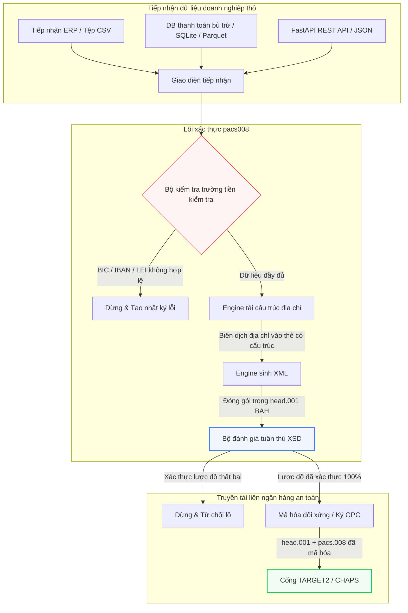

---

# Front Matter (YAML)

author: "contact@sebastienrousseau.com (Sebastien Rousseau)"
banner_alt: "Nhân viên văn phòng với trợ lý giọng nói và máy tính xách tay — biểu trưng cho các thông điệp thanh toán liên ngân hàng có cấu trúc, đọc được bằng máy mà tự động hóa pacs.008 biến thành lập trình được"
banner_height: "1597"
banner_width: "2584"
banner: "https://cloudcdn.pro/stocks/images/tyler-prahm-lmV3gJSAgbo.webp"
cdn: "https://cloudcdn.pro"
charset: "UTF-8"
cname: "sebastienrousseau.com"
copyright: "© Copyright 2025 - 2026 - Sebastien Rousseau. All rights reserved."
date: "15 tháng 6 năm 2026"
description: "pacs008 là thư viện Python mã nguồn mở tự động hóa việc tạo và xác thực thông điệp ISO 20022 pacs.008 FI-to-FI chuyển khoản tín dụng khách hàng — địa chỉ có cấu trúc, đóng gói BAH head.001, mã kiểm tra BIC/LEI/IBAN, truy vết UETR qua OpenTelemetry — sẵn sàng cho mốc SWIFT tháng 11 năm 2026."
format-detection: "telephone=no"
hreflang: "vi"
icon: "https://cloudcdn.pro/clients/sebastienrousseau/v1/logos/sebastienrousseau.svg"
id: "https://sebastienrousseau.com/2026-06-15-pacs008-automation-iso-20022-interbank-payments-2026"
image_alt: "Chân dung đen trắng của Sebastien Rousseau"
image_height: "162"
image_width: "162"
image: "https://cloudcdn.pro/stocks/images/sebastien-rousseau.png"
keywords: "pacs008, ISO 20022 pacs.008, FI to FI chuyển khoản tín dụng khách hàng, địa chỉ có cấu trúc, SWIFT CBPR+, BAH head.001, TARGET2, CHAPS, Fedwire, DORA, BCBS 239, Basel III, UETR, xác thực LEI, SEPA VoP"
language: "vi-VN"
last_reviewed: "2026-06-15"
layout: "report"
locale: "vi_VN"
logo_alt: "Logo Sebastien Rousseau"
logo_height: "44"
logo_width: "44"
logo: "https://cloudcdn.pro/clients/sebastienrousseau/v1/logos/sebastienrousseau.svg"
menu: ""
measurementID: "G-169G4ET5HQ"
name: "Sebastien Rousseau"
permalink: "https://sebastienrousseau.com/2026-06-15-pacs008-automation-iso-20022-interbank-payments-2026"
rating: "general"
referrer: "no-referrer"
robots: "index, follow"
schema: "FAQPage, Article"
seo_title: "Tự động hóa pacs.008 cho kỷ nguyên ISO 20022"
short_name: "sebastienrousseau"
subtitle: "Thông điệp pacs.008 là nơi dữ liệu thanh toán liên ngân hàng, địa chỉ có cấu trúc, tuân thủ, định tuyến và vận hành quyết toán gặp nhau."
tags: "pacs008, ISO 20022, thanh toán liên ngân hàng, thanh toán bán buôn, Python"
theme-color: "0, 83, 191"
title: "Xây dựng tự động hóa pacs.008 cho kỷ nguyên liên ngân hàng ISO 20022 năm 2026"
url: "https://sebastienrousseau.com/2026-06-15-pacs008-automation-iso-20022-interbank-payments-2026"
viewport: "width=device-width, initial-scale=1, shrink-to-fit=no"

# RSS - The RSS feed front matter (YAML).
atom_link: "https://sebastienrousseau.com/2026-06-15-pacs008-automation-iso-20022-interbank-payments-2026/rss.xml"
category: "Finance"
docs: https://validator.w3.org/feed/docs/rss2.html
generator: "Static Site Generator (SSG) (version 0.0.26)"
item_description: "pacs008 cung cấp nền tảng Python mã nguồn mở để tự động hóa thông điệp ISO 20022 FI-to-FI chuyển khoản tín dụng khách hàng trong kỷ nguyên thanh toán liên ngân hàng."
item_guid: "https://sebastienrousseau.com/2026-06-15-pacs008-automation-iso-20022-interbank-payments-2026/rss.xml"
item_link: "https://sebastienrousseau.com/2026-06-15-pacs008-automation-iso-20022-interbank-payments-2026/rss.xml"
item_pub_date: "Mon, 15 Jun 2026 06:06:06 +0000"
item_title: "Xây dựng tự động hóa pacs.008 cho kỷ nguyên liên ngân hàng ISO 20022 năm 2026"
last_build_date: "Mon, 15 Jun 2026 06:06:06 +0000"
managing_editor: "contact@sebastienrousseau.com (Sebastien Rousseau)"
pub_date: "Mon, 15 Jun 2026 06:06:06 +0000"
ttl: "60"
type: "article"
webmaster: "contact@sebastienrousseau.com"

# Apple - The Apple front matter (YAML).
apple_mobile_web_app_orientations: "portrait"
apple_touch_icon_sizes: "192x192"
apple-mobile-web-app-capable: "yes"
apple-mobile-web-app-status-bar-inset: "black"
apple-mobile-web-app-status-bar-style: "black-translucent"
apple-mobile-web-app-title: "Tự động hóa pacs.008 ISO 20022"
apple-touch-fullscreen: "yes"

# MS Application - The MS Application front matter (YAML).

msapplication-navbutton-color: "0, 83, 191"

# Twitter Card - The Twitter Card front matter (YAML).

twitter_card: "summary_large_image"
twitter_creator: "@wwdseb"
twitter_description: "pacs008 cung cấp nền tảng Python mã nguồn mở để tự động hóa thông điệp ISO 20022 FI-to-FI chuyển khoản tín dụng khách hàng trong kỷ nguyên thanh toán liên ngân hàng."
twitter_image: "https://cloudcdn.pro/clients/sebastienrousseau/v1/logos/sebastienrousseau.svg"
twitter_image_alt: "Logo Sebastien Rousseau"
twitter_site: "@wwdseb"
twitter_title: "Tự động hóa pacs.008 cho kỷ nguyên ISO 20022"
twitter_url: "https://sebastienrousseau.com/2026-06-15-pacs008-automation-iso-20022-interbank-payments-2026"

excerpt: "pacs008 là bộ công cụ Python mã nguồn mở biến thông điệp ISO 20022 FI-to-FI chuyển khoản tín dụng khách hàng thành lập trình được — địa chỉ có cấu trúc, xác thực, định tuyến, móc tuân thủ và hạn chót SWIFT tháng 11 năm 2026 đều được tích hợp sẵn làm mặc định."

# Humans.txt - The Humans.txt front matter (YAML).
author_website: "https://sebastienrousseau.com"
author_twitter: "@wwdseb"
author_location: "London, UK"
thanks: "Cảm ơn bạn đã đọc!"
site_last_updated: "2026-06-15"
site_standards: "HTML5, CSS3, RSS, Atom, JSON, XML, YAML, Markdown, TOML"
site_components: "Kaishi, Kaishi Builder, Kaishi CLI, Kaishi Templates, Kaishi Themes"
site_software: "Static Site Generator, Rust"

---

# Tự động hóa thanh toán liên ngân hàng ISO 20022 pacs.008 bằng Python mã nguồn mở trong năm 2026

<!-- lead-start -->
<aside class="post-lead" aria-label="Tóm tắt bài viết">

<strong>Tóm lược.</strong> Theo hướng dẫn SWIFT CBPR+, Mốc địa chỉ có cấu trúc ngày 14 tháng 11 năm 2026 sẽ ngừng sử dụng địa chỉ bưu điện phi cấu trúc trên TARGET2, CHAPS, Fedwire, Lynx và SEPA. pacs008 là thư viện Python mã nguồn mở tự động hóa việc tạo và xác thực thông điệp ISO 20022 FI-to-FI chuyển khoản tín dụng khách hàng (pacs.008), đóng gói thanh toán trong Business Application Header (BAH head.001), và đưa việc tuân thủ địa chỉ có cấu trúc vào đường dữ liệu trước khi thông điệp chạm vào bất kỳ mạng thanh toán bù trừ nào.

<strong>Điểm chính</strong>

<ul class="post-lead-takeaways">
  <li><strong>Hạn chót địa chỉ có cấu trúc là tuyệt đối.</strong> Sau ngày 14 tháng 11 năm 2026, các khối địa chỉ phi cấu trúc bị loại bỏ. pacs008 ép buộc các phần tử địa chỉ bưu điện có cấu trúc (<code>&lt;TwnNm&gt;</code>, <code>&lt;Ctry&gt;</code>, <code>&lt;PstCd&gt;</code>) tại bước biên dịch dữ liệu để ngăn từ chối tại biên mạng.</li>
  <li><strong>Điều phối thông điệp thống nhất.</strong> Đóng gói khối tải pacs.008 lõi trong phong bì Business Application Header (head.001) tuân thủ, cung cấp mô hình xử lý vòng tròn tiêu chuẩn.</li>
  <li><strong>Tính toàn vẹn theo thuật toán.</strong> Bộ xác thực tích hợp cho BIC và Legal Entity Identifier (LEI) sử dụng tính toán mã kiểm tra ISO 7064 Modulo 97-10.</li>
  <li><strong>Khả năng truy vết cấp DORA.</strong> Đo lường đầy đủ qua OpenTelemetry gắn với Unique End-to-End Transaction Reference (UETR) cho nhật ký kiểm toán theo thời gian thực và chữ ký kiểm toán mật mã.</li>
  <li><strong>Bảo toàn nghĩa vụ thác quản cấp hội đồng.</strong> Gắn độ chính xác thông điệp liên ngân hàng với DORA Điều 5, báo cáo BCBS 239 và tiết kiệm vốn Rủi ro Vận hành Basel III.</li>
</ul>

<strong>Đọc liên quan:</strong> <a href="https://sebastienrousseau.com/2026-05-19-global-wholesale-payments-economics-2026">Thanh toán bán buôn toàn cầu năm 2026: ISO 20022, đổi mới RTGS và kinh tế của khả năng tương tác</a>, <a href="https://sebastienrousseau.com/2026-05-27-ai-operating-system-payments-fraud-routing-resilience-compliance-2026">AI như hệ điều hành của thanh toán: gian lận, định tuyến, khả năng phục hồi và tuân thủ trong năm 2026</a>, <a href="https://sebastienrousseau.com/2026-05-12-iso-20022-pacs008-structured-address-deadline">Hạn chót địa chỉ có cấu trúc pacs.008 tháng 11 năm 2026: tầm nhìn sáu tháng</a>.

</aside>
<!-- lead-end -->

Bắc cầu giữa dữ liệu tài chính kế thừa và thông điệp liên ngân hàng có cấu trúc thông qua một pipeline Python đã được xác thực lược đồ và có thể kiểm toán.

Điểm tham chiếu mã nguồn mở cho bài viết này là [pacs008 ⧉](https://github.com/sebastienrousseau/pacs008 "pacs008 — thư viện Python mã nguồn mở"). Kho lưu trữ được định vị là một thư viện Python để tự động hóa các thông điệp XML ISO 20022 pacs.008 FI-to-FI chuyển khoản tín dụng khách hàng.

## Vì sao dự án mã nguồn mở này quan trọng trong năm 2026

Hạ tầng thanh toán bù trừ liên ngân hàng toàn cầu đang trải qua đợt hiện đại hóa sâu sắc nhất trong gần nửa thế kỷ.

Tháng 6 năm 2026, ngành dịch vụ tài chính đang nhanh chóng tiến gần đến **Mốc địa chỉ có cấu trúc SWIFT ngày 14 tháng 11 năm 2026**. Kể từ ngày đó, hướng dẫn SWIFT CBPR+ cùng với TARGET2, CHAPS, Fedwire và Lynx của Canada sẽ chính thức ngừng sử dụng các dòng địa chỉ bưu điện phi cấu trúc (chỉ dùng `<AdrLine>` bên trong khối `<PstlAdr>`). Mọi định chế tài chính tham gia phải truyền địa chỉ ở định dạng hỗn hợp (`<TwnNm>` và `<Ctry>` có cấu trúc, với tối đa hai phần tử `<AdrLine>` cho chi tiết còn lại) hoặc định dạng có cấu trúc đầy đủ (các phần tử riêng cho tên đường, số nhà và mã bưu điện). Bất kỳ thông điệp nào không đáp ứng tiêu chí này sẽ bị từ chối tại biên mạng.

Đối với các định chế tài chính, quá trình chuyển đổi này tạo ra các ràng buộc vận hành lớn:

1. **Hình phạt từ chối tại biên.** Các khoản thanh toán không đáp ứng tiêu chí địa chỉ có cấu trúc sẽ bị mạng từ chối ngay lập tức, kích hoạt chậm trễ giao dịch, tắc nghẽn thanh khoản và tồn đọng vận hành.
2. **SEPA Verification of Payee (VoP).** Yêu cầu mọi Payment Service Provider (PSP) trong vùng SEPA xác thực sự khớp giữa tên người thụ hưởng và IBAN trước khi thực hiện chuyển khoản tín dụng, thêm một cổng xác thực nữa cho khởi tạo thông điệp.

[pacs008](https://github.com/sebastienrousseau/pacs008) giải quyết vấn đề này. Đây là một thư viện Python mã nguồn mở, gọn nhẹ, tự động hóa việc chuyển đổi dữ liệu tài chính thô thành các thông điệp pacs.008 chuyển khoản tín dụng khách hàng liên ngân hàng ISO 20022 đã được xác thực đầy đủ và tuân thủ lược đồ. Bằng cách bắc cầu khoảng cách giữa dữ liệu kế thừa và có cấu trúc, pacs008 mang lại Return on Resilience (RoR) cao, bảo toàn vốn lưu động và đảm bảo thực thi theo thời gian thực trên các mạng thanh toán toàn cầu.

## Lăng kính kiến trúc pacs008 năm 2026

Thư viện pacs008 được cấu trúc như một engine xác thực và sinh thông điệp được cách ly, đảm bảo các đầu vào thô được phân tích, làm giàu và đóng gói trong các phong bì tiêu chuẩn một cách hệ thống:

| Lớp | Quyết định thiết kế | Vì sao quan trọng | Rủi ro nếu xử lý sai |
|---|---|---|---|
| **Lớp đầu vào** | Tiếp nhận CSV, JSON, SQLite và Parquet | Gặp đội tích hợp ngân hàng tại nơi dữ liệu đã tồn tại, tránh phải di chuyển nền tảng. | Tiếp nhận khối tải dữ liệu thô, chưa xác thực hoặc bị hỏng. |
| **Lớp xác thực** | Xác thực tiền kiểm tra theo lược đồ XSD chính thức và quy tắc nghiệp vụ tùy chỉnh | Dừng thực thi và đánh dấu lỗi trước khi tệp thanh toán được truyền tới mạng thanh toán bù trừ. | Tệp XML không hợp lệ kích hoạt từ chối mạng ngay lập tức và chậm trễ thanh toán bù trừ. |
| **Lớp phong bì BAH** | Tự động đóng gói Business Application Header (head.001) | Chuẩn hóa việc gửi và định tuyến thông điệp dựa trên thẻ `<MsgDefIdr>`. | Truyền khối tải pacs.008 thô mà không có phong bì ngoài cần thiết, gây từ chối hệ thống. |
| **Lớp tuần tự hóa** | Hỗ trợ XML tiêu chuẩn và JSON tuân thủ ISO (TS 23029) | Cho phép dịch trực tiếp giữa khối tải XML và JSON, hỗ trợ REST API hiện đại và streaming Kafka. | Biểu diễn dữ liệu phân mảnh vi phạm hướng dẫn ISO chính thức. |
| **Lớp quan sát** | Truy vết OpenTelemetry gắn với UETR | Ghi lại đường thực thi chi tiết và nhật ký, cung cấp khả năng kiểm toán theo thời gian thực. | Khoảng trống truy vết chặn khả năng quan sát vận hành và kiểm toán. |

## Các tín hiệu liên ngân hàng và mốc quy định chính

Để chứng minh khả năng phục hồi vận hành giao dịch, các nhà quản lý công nghệ và rủi ro cấp cao phải theo dõi các chỉ số tuân thủ định lượng được, cụ thể:

| Tín hiệu | Chỉ số / Chuẩn vận hành | Tham chiếu G20 / SWIFT / DORA | Triển khai nền tảng kỹ thuật |
|---|---|---|---|
| **Tuân thủ địa chỉ có cấu trúc** | % thông điệp pacs.008 sử dụng đầy đủ trường `<PstlAdr>` có cấu trúc với `<TwnNm>` và `<Ctry>` được chỉ định. | Hạn chót SWIFT SR 2026 | Kiểm tra lược đồ tiền kiểm tra trong pacs008 từ chối các dòng địa chỉ phi cấu trúc. |
| **SEPA Verification of Payee** | Xác thực khớp giữa tên người thụ hưởng và IBAN trước khi thực thi thông điệp. | Quy định SEPA VoP | Lớp trợ giúp VoP tích hợp thực hiện truy vấn tiền kiểm tra trên IBAN/BIC. |
| **Tích hợp BAH head.001** | Tỷ lệ phần trăm khối tải thanh toán đi được đóng gói thành công trong Business Application Header. | Hướng dẫn TARGET2 / CBPR+ | Hệ thống con đóng gói BAH biên dịch phong bì XML ngoài tự động. |
| **Mã kiểm tra Modulo LEI** | Xác thực chữ số kiểm tra ISO 7064 Modulo 97-10 trên các khối `<LEI>` của bên ghi nợ và ghi có. | Yêu cầu của Bank of England | Trình kiểm tra theo thuật toán xác minh tính toàn vẹn của định danh 20 ký tự. |
| **Độ chính xác theo dõi UETR** | 100% thanh toán được tạo có Unique End-to-End Transaction Reference hợp lệ. | Đặc tả UETR của SWIFT | Tự động sinh và truy vết mã tham chiếu UUIDv4 36 ký tự. |

## Vì sao Python là cửa ngõ lý tưởng cho tự động hóa liên ngân hàng

Các hub thanh toán hiện đại và đội vận hành kho bạc trong năm 2026 phụ thuộc nhiều vào Python cho chuyển đổi dữ liệu, mô hình hóa tài chính và tích hợp cơ sở dữ liệu ERP.

Bằng cách tận dụng thư viện Python mã nguồn mở, các định chế đạt được lợi thế đáng kể:

1. **Tải nhận thức thấp và khả năng tương tác cao.** Python hoạt động như một cây cầu gắn kết. Nó cho phép lập trình viên viết script đơn giản kéo chỉ thị thanh toán thô từ cơ sở dữ liệu kế thừa, xác thực chúng theo quy tắc ngân hàng quốc tế phức tạp và xuất ra XML tuân thủ trong một quy trình thống nhất, duy nhất.
2. **Loại bỏ các bộ dịch "hộp đen" mờ đục.** Các cổng thông tin ngân hàng độc quyền thường tính phí cấp phép cao cho các bộ dịch tệp thanh toán tùy chỉnh. Các bộ dịch này là hộp đen độc quyền, khiến các đội bảo mật không thể kiểm toán cách dữ liệu được xử lý hoặc khóa được lưu trữ ở đâu. Một thư viện mã nguồn mở, có thể kiểm tra như pacs008 đảm bảo tính minh bạch hoàn toàn của mã.
3. **Tích hợp CI/CD liền mạch.** pacs008 tích hợp trực tiếp vào các pipeline tích hợp và triển khai liên tục, cho phép lập trình viên tự động hóa việc kiểm thử tệp thanh toán như một phần của vòng đời phát hành phần mềm tiêu chuẩn.

## Thiết kế một pipeline liên ngân hàng có ranh giới

Một lỗ hổng lớn trong thanh toán bù trừ liên ngân hàng là "sinh lô không kiểm soát" — sinh tệp mà không có vòng xác minh rõ ràng, có ranh giới. pacs008 được thiết kế để hoạt động như engine xác thực lõi bên trong một pipeline giao dịch nhiều giai đoạn, được kiểm soát chặt chẽ.

Luồng vận hành dưới đây cho thấy dữ liệu giao dịch thô đi qua pipeline pacs008 ra sao để tạo ra một tệp pacs.008 an toàn về mật mã, tuân thủ lược đồ và được đóng gói trong phong bì BAH:

## Cẩm nang hội đồng quản trị và trách nhiệm thác quản

Tự động hóa thanh toán liên ngân hàng là vấn đề quản trị doanh nghiệp và quản lý rủi ro cấp hội đồng. Các nhà quản lý cấp cao phải tiếp cận chất lượng dữ liệu giao dịch dưới góc nhìn trách nhiệm thác quản và giảm rủi ro vận hành:

- **DORA Điều 5 (Trách nhiệm của hội đồng).** Đặt trách nhiệm cá nhân, trực tiếp lên thành viên hội đồng đối với khả năng phục hồi và an ninh của hoạt động ICT của định chế. Vì thanh toán bù trừ liên ngân hàng là chức năng doanh nghiệp trọng yếu, hội đồng phải chứng minh đã triển khai các kiểm soát giao dịch mạnh mẽ, đã xác thực và tự động để ngăn gián đoạn vận hành hoặc chậm trễ thanh toán.
- **BCBS 239 (Tổng hợp và báo cáo dữ liệu rủi ro).** Yêu cầu báo cáo giao dịch tài chính phải chính xác, đầy đủ và được tạo theo thời gian thực. pacs008 giúp các định chế đạt tuân thủ BCBS 239 bằng cách đảm bảo dữ liệu thanh toán được cấu trúc sạch và xác thực tại nguồn, loại bỏ các khoảng trống dữ liệu và lỗi đối chiếu thủ công đang gây khó cho bảng tính kế thừa.
- **Giảm thiểu phí vốn Rủi ro Vận hành (Basel III).** Theo hướng dẫn Basel III, tỷ lệ lỗi thanh toán cao và chi phí can thiệp thủ công làm tăng yêu cầu vốn rủi ro vận hành của ngân hàng, khóa lại số vốn lẽ ra có thể được triển khai cho cho vay hoặc đầu tư. Tự động hóa pipeline thanh toán trực tiếp giảm thiểu các khoản phụ phí vốn này, bảo toàn giá trị bảng cân đối.

## Điều này có ý nghĩa gì theo loại ngân hàng

### Ngân hàng quan trọng hệ thống toàn cầu (G-SIB)

G-SIB quản lý khối lượng giao dịch doanh nghiệp xuyên biên giới khổng lồ. Thách thức chính của họ là khắc phục dữ liệu kế thừa phi cấu trúc trước khi nó chạm vào mạng thanh toán bù trừ. Bằng cách tích hợp pacs008 vào cổng ngân hàng doanh nghiệp, G-SIB có thể cung cấp tiện ích xác thực tự động cho khách hàng doanh nghiệp, giảm chi phí sửa chữa thanh toán thủ công và đảm bảo thực thi theo thời gian thực trên mạng SWIFT.

### Ngân hàng giao dịch và ngân hàng doanh nghiệp

Đối với ngân hàng giao dịch, chất lượng dữ liệu thanh toán là yếu tố cạnh tranh khác biệt. Bằng cách cung cấp công cụ xác thực mã nguồn mở, có thể kiểm tra như pacs008 cho khách hàng kho bạc doanh nghiệp, các ngân hàng này có thể đẩy nhanh việc tiếp nhận, giảm thiểu từ chối tệp thanh toán và xây dựng lòng tin khách hàng qua tỷ lệ xử lý thẳng vượt trội.

### Ngân hàng khu vực và ngân hàng nhỏ

Ngân hàng khu vực phải duy trì tuân thủ các tiêu chuẩn thanh toán quốc tế mà không có ngân sách công nghệ khổng lồ của G-SIB. pacs008 cung cấp giải pháp dựa trên Python gọn nhẹ, tiết kiệm chi phí và tuân thủ đầy đủ, cho phép các định chế nhỏ hơn cung cấp khả năng khởi tạo thanh toán hiện đại, có cấu trúc mà không cần giấy phép middleware độc quyền đắt đỏ.

## Kết luận: Lộ trình thanh toán bù trừ liên ngân hàng

Hạn chót địa chỉ có cấu trúc SWIFT tháng 11 năm 2026 sắp tới là một ranh giới cứng đối với hoạt động kho bạc doanh nghiệp. Dựa vào bảng tính kế thừa, nhập dữ liệu thủ công và tệp thanh toán phi cấu trúc là một rủi ro kinh doanh đang diễn ra.

Để đảm bảo tính liên tục giao dịch và giảm thiểu chi phí vận hành, các nhà quản lý công nghệ và tài chính cấp cao nên thực hiện một lộ trình thanh toán bù trừ rõ ràng ngay hôm nay:

1. **Ép buộc xác thực tại nguồn.** Yêu cầu mọi chỉ thị thanh toán được xác thực và định dạng theo lược đồ XSD ISO 20022 chính thức trước khi rời khỏi ranh giới ERP doanh nghiệp.
2. **Kiểm toán pipeline dữ liệu.** Chuyển khỏi xử lý bảng tính thủ công và triển khai các quy trình dựa trên Python tự động, có thể kiểm tra bằng pacs008.
3. **Triển khai bảo mật hỗn hợp.** Đảm bảo tệp thanh toán được tạo ra được ký và mã hóa về mật mã trước khi truyền, đáp ứng kỳ vọng mạng không tin cậy.
4. **Gắn kết với ưu tiên thác quản.** Báo cáo chính thức các chỉ số tự động hóa thanh toán và chất lượng dữ liệu lên hội đồng, định khung khoản đầu tư như một chương trình giảm rủi ro vận hành trọng yếu theo DORA.

## Câu hỏi thường gặp

**pacs008 có tuân thủ các quy tắc địa chỉ SWIFT SR 2026 sắp tới không?**

Có. pacs008 được thiết kế để hỗ trợ mốc địa chỉ có cấu trúc SWIFT tháng 11 năm 2026 nghiêm ngặt, ép buộc việc tách bắt buộc các phần tử địa chỉ bưu điện (thành phố, quốc gia, mã bưu điện) vào các trường XML ISO 20022 được chỉ định.

**pacs008 có thể đóng gói khối tải thanh toán trong Business Application Header không?**

Có. Vì pacs008 hỗ trợ Business Application Header (BAH head.001) một cách nguyên gốc, nó tự động biên dịch phong bì ngoài mà TARGET2, CHAPS và mạng CBPR+ yêu cầu.

**Vì sao thư viện mã nguồn mở được ưu tiên hơn các bộ dịch tệp độc quyền?**

Các bộ dịch độc quyền là hộp đen mờ đục, khiến việc kiểm toán bảo mật không khả thi. Một thư viện mã nguồn mở, được giới chuyên môn rà soát như pacs008 cung cấp tính minh bạch hoàn toàn của mã, cho phép các đội bảo mật xác minh không có dữ liệu thanh toán nhạy cảm nào bị lộ trong quá trình xử lý.

**pacs008 xác thực những định danh nào?**

pacs008 đi kèm bộ xác thực tích hợp cho Bank Identifier Code (BIC) và Legal Entity Identifier (LEI) sử dụng tính toán mã kiểm tra ISO 7064 Modulo 97-10, cộng với xác thực chữ số kiểm tra IBAN và kiểm tra tính duy nhất của UETR.

## Tham khảo

- SWIFT, (2024). *Mốc địa chỉ có cấu trúc ISO 20022 tháng 11 năm 2026*. La Hulpe: SWIFT. Có tại: [Mốc ISO 20022 của SWIFT ⧉](https://www.swift.com/standards/iso-20022/iso-20022-bytes/call-action-november-2026 "Mốc ISO 20022 của SWIFT").
- Basel Committee on Banking Supervision (BCBS), (2013). *Các nguyên tắc tổng hợp dữ liệu rủi ro và báo cáo rủi ro hiệu quả (BCBS 239)*. Basel: Bank for International Settlements. Có tại: [Nguyên tắc BCBS 239 ⧉](https://www.bis.org/publ/bcbs239.htm "Nguyên tắc BCBS 239").
- Nghị viện châu Âu và Hội đồng Liên minh châu Âu, (2022). *Quy định (EU) 2022/2554 về khả năng phục hồi vận hành kỹ thuật số cho khu vực tài chính (DORA)*. Brussels: Công báo Liên minh châu Âu. Có tại: [Quy định DORA ⧉](https://eur-lex.europa.eu/legal-content/EN/TXT/?uri=CELEX%3A32022R2554 "Quy định DORA").
- GitHub, (2026). *Kho mã nguồn mở pacs008*. Có tại: [Kho pacs008 ⧉](https://github.com/sebastienrousseau/pacs008 "Kho pacs008").

<!-- enrich-start -->
<aside class="author-card" aria-label="Về tác giả"><strong class="author-card-name"><a href="/about/index.html">Sebastien Rousseau</a></strong>Chuyên gia công nghệ ngân hàng cấp cao, viết về AI ứng dụng, di chuyển ISO 20022, mật mã hậu lượng tử cho dịch vụ tài chính và chuyển đổi cơ cấu của thanh toán bán buôn.Hơn 20 năm kinh nghiệm tại HSBC Commercial &amp; Investment Bank, PayPal, Barclays, Shazam, AKQA, Virgin Group. <a href="/about/index.html">Hồ sơ đầy đủ</a> &middot; <a href="https://www.linkedin.com/in/sebastienrousseau/" rel="external noopener">LinkedIn</a> &middot; <a href="https://github.com/sebastienrousseau" rel="external noopener">GitHub</a></aside>

Đã rà soát gần nhất <time datetime="2026-06-15">2026-06-15</time>.

<aside class="related-posts" aria-labelledby="related-heading">
<h2 id="related-heading" class="related-heading">Đọc liên quan</h2>

<article class="related-card"><footer class="related-body"><h3><a href="https://sebastienrousseau.com/2026-05-19-global-wholesale-payments-economics-2026">Thanh toán bán buôn toàn cầu năm 2026: ISO 20022, đổi mới RTGS và kinh tế của khả năng tương tác</a></h3>
<time datetime="2026-05-19">2026-05-19</time>
</footer></article>
<article class="related-card"><footer class="related-body"><h3><a href="https://sebastienrousseau.com/2026-05-27-ai-operating-system-payments-fraud-routing-resilience-compliance-2026">AI như hệ điều hành của thanh toán: gian lận, định tuyến, khả năng phục hồi và tuân thủ trong năm 2026</a></h3>
<time datetime="2026-05-27">2026-05-27</time>
</footer></article>
<article class="related-card"><footer class="related-body"><h3><a href="https://sebastienrousseau.com/2026-05-12-iso-20022-pacs008-structured-address-deadline">Hạn chót địa chỉ có cấu trúc pacs.008 tháng 11 năm 2026: tầm nhìn sáu tháng</a></h3>
<time datetime="2026-05-12">2026-05-12</time>
</footer></article>

</aside>
<!-- enrich-end -->
