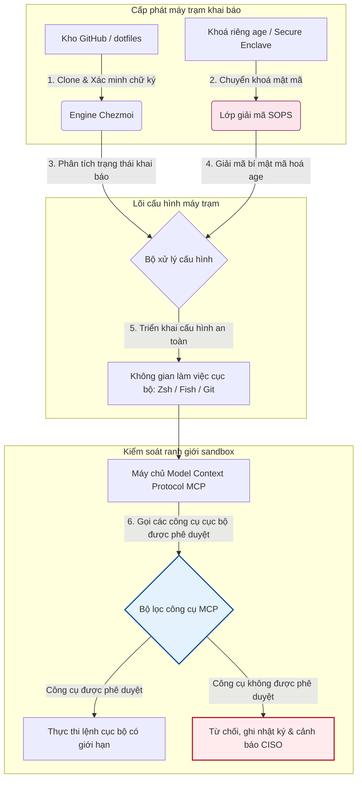

---

# Front Matter (YAML)

author: "contact@sebastienrousseau.com (Sebastien Rousseau)"
banner_alt: "Máy trạm nhà phát triển trong ánh sáng dịu — biểu trưng cho dotfiles có nhận thức AI, có khả năng tái tạo và bảo mật cho máy chủ MCP, ký SLSA, bí mật age/SOPS và tương đương đa shell"
banner_height: "1597"
banner_width: "2584"
banner: "https://cloudcdn.pro/stocks/images/almas-salakhov-Vq2ap8aFFEs.webp"
cdn: "https://cloudcdn.pro"
charset: "UTF-8"
cname: "sebastienrousseau.com"
copyright: "© Copyright 2025 - 2026 - Sebastien Rousseau. All rights reserved."
date: "June 16, 2026"
description: "Dotfiles có nhận thức AI là mô hình máy trạm an toàn, có khả năng tái tạo cho kỷ nguyên MCP — cấu hình khai báo qua Chezmoi, bí mật SOPS/age, nguồn gốc SLSA Level 3, tương đương đa shell và ranh giới sandbox cho tác nhân AI cục bộ."
format-detection: "telephone=no"
hreflang: "vi"
icon: "https://cloudcdn.pro/clients/sebastienrousseau/v1/logos/sebastienrousseau.svg"
id: "https://sebastienrousseau.com/2026-06-16-ai-aware-dotfiles-secure-reproducible-workstation-2026"
image_alt: "Chân dung đen trắng của Sebastien Rousseau"
image_height: "162"
image_width: "162"
image: "https://cloudcdn.pro/stocks/images/sebastien-rousseau.png"
keywords: "dotfiles, Chezmoi, MCP, Model Context Protocol, SLSA, SOPS, mã hoá age, cấu hình khai báo, máy trạm nhà phát triển, DORA Điều 5, NIST CSF 2.0, bảo mật chuỗi cung ứng, AI tác nhân, tương đương đa shell, Zsh, Fish, Nushell"
language: "vi-VN"
last_reviewed: "2026-06-16"
layout: "report"
locale: "vi_VN"
logo_alt: "Logo của Sebastien Rousseau"
logo_height: "44"
logo_width: "44"
logo: "https://cloudcdn.pro/clients/sebastienrousseau/v1/logos/sebastienrousseau.svg"
menu: ""
measurementID: "G-169G4ET5HQ"
name: "Sebastien Rousseau"
permalink: "https://sebastienrousseau.com/2026-06-16-ai-aware-dotfiles-secure-reproducible-workstation-2026"
rating: "general"
referrer: "no-referrer"
robots: "index, follow"
schema: "FAQPage, Article"
seo_title: "Dotfiles nhận thức AI cho máy trạm nhà phát triển an toàn"
short_name: "sebastienrousseau"
subtitle: "Máy trạm nhà phát triển nay là một phần của chuỗi cung ứng AI; dotfiles cần bảo mật, khả năng tái tạo, vệ sinh bí mật và quy trình có nhận thức MCP."
tags: "dotfiles, công cụ nhà phát triển, MCP, SLSA, máy trạm an toàn, chezmoi, macOS, Linux, WSL"
theme-color: "0, 83, 191"
title: "Dotfiles nhận thức AI 2026: máy trạm nhà phát triển an toàn, tái tạo cho MCP, SLSA, đa shell"
url: "https://sebastienrousseau.com/2026-06-16-ai-aware-dotfiles-secure-reproducible-workstation-2026"
viewport: "width=device-width, initial-scale=1, shrink-to-fit=no"

# RSS - The RSS feed front matter (YAML).
atom_link: "https://sebastienrousseau.com/2026-06-16-ai-aware-dotfiles-secure-reproducible-workstation-2026/rss.xml"
category: "Technology"
docs: https://validator.w3.org/feed/docs/rss2.html
generator: "Static Site Generator (SSG) (version 0.0.26)"
item_description: "Phân tích về dotfiles khai báo cho máy trạm nhà phát triển an toàn, có khả năng tái tạo trên macOS, Linux và WSL, với nhận thức MCP, SLSA, age, SOPS và tương đương đa shell."
item_guid: "https://sebastienrousseau.com/2026-06-16-ai-aware-dotfiles-secure-reproducible-workstation-2026/rss.xml"
item_link: "https://sebastienrousseau.com/2026-06-16-ai-aware-dotfiles-secure-reproducible-workstation-2026/rss.xml"
item_pub_date: "Tue, 16 Jun 2026 06:06:06 +0000"
item_title: "Dotfiles nhận thức AI 2026: máy trạm nhà phát triển an toàn, tái tạo cho MCP, SLSA, đa shell"
last_build_date: "Tue, 16 Jun 2026 06:06:06 +0000"
managing_editor: "contact@sebastienrousseau.com (Sebastien Rousseau)"
pub_date: "Tue, 16 Jun 2026 06:06:06 +0000"
ttl: "60"
type: "article"
webmaster: "contact@sebastienrousseau.com"

# Apple - The Apple front matter (YAML).
apple_mobile_web_app_orientations: "portrait"
apple_touch_icon_sizes: "192x192"
apple-mobile-web-app-capable: "yes"
apple-mobile-web-app-status-bar-inset: "black"
apple-mobile-web-app-status-bar-style: "black-translucent"
apple-mobile-web-app-title: "Dotfiles nhận thức AI cho máy trạm an toàn"
apple-touch-fullscreen: "yes"

# MS Application - The MS Application front matter (YAML).

msapplication-navbutton-color: "0, 83, 191"

# Twitter Card - The Twitter Card front matter (YAML).

twitter_card: "summary_large_image"
twitter_creator: "@wwdseb"
twitter_description: "Phân tích về dotfiles khai báo cho máy trạm nhà phát triển an toàn, có khả năng tái tạo trên macOS, Linux và WSL, với nhận thức MCP, SLSA, age, SOPS và tương đương đa shell."
twitter_image: "https://cloudcdn.pro/clients/sebastienrousseau/v1/logos/sebastienrousseau.svg"
twitter_image_alt: "Logo của Sebastien Rousseau"
twitter_site: "@wwdseb"
twitter_title: "Dotfiles nhận thức AI cho máy trạm nhà phát triển an toàn"
twitter_url: "https://sebastienrousseau.com/2026-06-16-ai-aware-dotfiles-secure-reproducible-workstation-2026"

excerpt: "Dotfiles có nhận thức AI trong năm 2026 coi máy trạm nhà phát triển là hạ tầng chuỗi cung ứng — cấu hình khai báo do chezmoi quản lý với nhận thức MCP, các bản phát hành ký SLSA, bí mật age/SOPS, khởi động dưới giây và tương đương macOS/Linux/WSL."

# Humans.txt - The Humans.txt front matter (YAML).
author_website: "https://sebastienrousseau.com"
author_twitter: "@wwdseb"
author_location: "London, UK"
thanks: "Cảm ơn bạn đã đọc!"
site_last_updated: "2026-06-16"
site_standards: "HTML5, CSS3, RSS, Atom, JSON, XML, YAML, Markdown, TOML"
site_components: "Kaishi, Kaishi Builder, Kaishi CLI, Kaishi Templates, Kaishi Themes"
site_software: "Static Site Generator, Rust"

---

# Dotfiles nhận thức AI 2026: máy trạm nhà phát triển an toàn, tái tạo cho MCP, SLSA, đa shell

<!-- lead-start -->
<aside class="post-lead" aria-label="Tóm tắt bài viết">

<strong>Tóm lược.</strong> Máy trạm nhà phát triển không còn là điểm cuối thuần tuý; nó là một thành phần chủ động trong chuỗi cung ứng phần mềm và là giao diện trực tiếp cho mặt phẳng điều khiển AI cục bộ. Các trợ lý AI trên terminal và các máy chủ <a href="https://modelcontextprotocol.io">Model Context Protocol (MCP)</a> thực thi lệnh shell cục bộ, kiểm tra kho mã và đọc trực tiếp các tệp cấu hình nhạy cảm. <a href="https://github.com/sebastienrousseau/dotfiles">Dotfiles của Sebastien Rousseau</a> là một khung mã nguồn mở, khai báo, xây dựng máy trạm an toàn và có khả năng tái tạo trên macOS, Linux và Windows Subsystem for Linux (WSL) — tích hợp <a href="https://www.chezmoi.io/">Chezmoi</a>, <a href="https://github.com/getsops/sops">SOPS, age</a> và nguồn gốc build SLSA Level 3 để cô lập bí mật an toàn về bộ nhớ và giới hạn các đường thực thi cho mô hình AI cục bộ.

<strong>Điểm chính</strong>

<ul class="post-lead-takeaways">
  <li><strong>Máy trạm là hạ tầng chuỗi cung ứng.</strong> Cấu hình môi trường nhà phát triển phải được xử lý với cùng mức độ kỷ luật khai báo như triển khai máy chủ sản xuất, loại bỏ trôi dạt cấu hình thủ công.</li>
  <li><strong>Thách thức mặt phẳng điều khiển AI.</strong> Mô hình AI trên terminal và công cụ MCP có thể truy cập thư mục cục bộ. Dotfiles phải thực thi ranh giới sandbox, danh sách quyền công cụ nghiêm ngặt và nhật ký cục bộ không thể sửa đổi để ngăn rò rỉ dữ liệu.</li>
  <li><strong>Tương đương đa nền tảng tuyệt đối.</strong> Hiệu năng shell và hồ sơ bảo mật giống hệt nhau, khởi động dưới giây trên macOS, Linux (Zsh, Fish, Nushell) và WSL, rút thời gian onboarding nhà phát triển từ vài tuần xuống vài phút.</li>
  <li><strong>Cô lập bí mật an toàn bằng mật mã.</strong> Mã hoá tệp SOPS và age ngăn thông tin xác thực cứng (GitHub token, khoá truy cập cloud) bị commit vào Git hoặc bị LLM cục bộ đọc.</li>
  <li><strong>Giá trị fiduciary ở cấp hội đồng quản trị.</strong> Chuyển tuân thủ cấu hình máy trạm thành ưu tiên rõ ràng của ban lãnh đạo, hỗ trợ DORA Điều 5, chuẩn endpoint NIST CSF 2.0 và giảm Rủi ro Vận hành Basel III.</li>
</ul>

<strong>Đọc liên quan:</strong> <a href="https://sebastienrousseau.com/2026-05-23-agentic-payments-banking-consent-liability-new-payment-ux-2026">Thanh toán tác nhân trong ngân hàng: đồng thuận, trách nhiệm pháp lý và UX thanh toán mới năm 2026</a>, <a href="https://sebastienrousseau.com/2024-03-12-revolutionising-real-time-speech-recognition-on-macos-with-openai-whisper/index.html">Nhận dạng giọng nói thời gian thực nhanh trên macOS: OpenAI Whisper</a>, <a href="https://sebastienrousseau.com/2024-02-26-google-gemma-ai-transforming-open-source-ai-development/index.html">Google Gemma AI: định hình lại phát triển AI mã nguồn mở</a>.

</aside>
<!-- lead-end -->

Bắc cầu giữa cấu hình máy trạm khai báo và chuỗi cung ứng phần mềm an toàn trong thời đại của mô hình AI cục bộ và công cụ phát triển tác nhân.

Điểm tham chiếu mã nguồn mở cho bài viết này là [dotfiles ⧉](https://github.com/sebastienrousseau/dotfiles "dotfiles — cấu hình máy trạm khai báo"). Kho mã được định vị là: dotfiles khai báo cho macOS, Linux và WSL, cung cấp tương đương đa shell, khởi động dưới giây, các bản phát hành ký SLSA và cấu hình có nhận thức AI/MCP.

## Tại sao dự án mã nguồn mở này có ý nghĩa trong năm 2026

Tháng 6 năm 2026, máy trạm nhà phát triển là mắt xích yếu nhất trong chuỗi cung ứng phần mềm và là mục tiêu giá trị cao cho các nhóm tin tặc do nhà nước hậu thuẫn và các tổ chức tội phạm mạng tinh vi.

Bối cảnh bảo mật của môi trường phát triển đã thay đổi căn bản với sự trỗi dậy của các trợ lý lập trình AI trên terminal (như Claude Code) và việc áp dụng Model Context Protocol (MCP). Terminal của nhà phát triển cục bộ nay chứa các tác nhân AI tự trị, có khả năng:

- Đọc và chỉnh sửa các tệp mã nguồn cục bộ.
- Gọi các công cụ CLI cục bộ (`git`, `npm`, `aws`, `kubectl`).
- Kiểm tra biến môi trường shell, cơ sở dữ liệu cục bộ và thiết lập cấu hình.

Nếu môi trường cục bộ của nhà phát triển thiếu ranh giới nghiêm ngặt, các công cụ AI tự trị này có thể vô tình đọc dữ liệu cá nhân nhạy cảm, rò rỉ thông tin xác thực cloud tới các API LLM công khai, hoặc thực thi gói độc hại trong các bản build tự động.

Theo Đạo luật Khả năng chống chịu Vận hành Số (DORA) và Khung An ninh mạng NIST (CSF) 2.0, các định chế tài chính có nghĩa vụ pháp lý phải xác minh nguồn gốc và tính toàn vẹn bảo mật của mọi thiết bị truy cập chuỗi cung ứng phần mềm. "Máy tính xách tay bông tuyết" — cấu hình thủ công, không được kiểm toán, trôi dạt — không còn tuân thủ các chuẩn ngân hàng toàn cầu.

[Dotfiles của Sebastien Rousseau](https://github.com/sebastienrousseau/dotfiles) giải quyết vấn đề này. Đây là một khung quản lý máy trạm mã nguồn mở, khai báo, thiết lập máy trạm nhà phát triển an toàn và có khả năng tái tạo. Bằng việc áp đặt một đường cơ sở cấu hình chuẩn hoá, có thể kiểm toán, dự án mang lại Lợi tức Khả năng chống chịu (RoR) cao, rút thời gian onboarding nhà phát triển từ vài tuần xuống vài giờ và bảo vệ chuỗi cung ứng tài chính nhạy cảm khỏi lỗ hổng endpoint.

## Lăng kính kiến trúc máy trạm có nhận thức AI 2026

Khung dotfiles vận hành như một trình quản lý môi trường khai báo, an toàn — toàn bộ shell, công cụ và bí mật cục bộ đều được quản lý, kiểm toán và cô lập một cách hệ thống:

| Lớp | Quyết định thiết kế | Tại sao quan trọng | Rủi ro nếu xử lý sai |
|---|---|---|---|
| **Lớp cấp phát** | Quản lý cấu hình khai báo qua Chezmoi | Xây máy trạm có khả năng tái tạo hoàn toàn trên macOS, Linux và WSL, loại bỏ trôi dạt. | Cấu hình bông tuyết với trạng thái cục bộ không được kiểm toán, dễ tổn thương. |
| **Lớp shell** | Tương đương đa shell (Zsh, Fish, Nushell) | Đảm bảo khởi động dưới giây giống hệt nhau và hành vi alias nhất quán trên các môi trường khác nhau. | Sự không nhất quán của lệnh shell gây ra kết quả script bất ngờ. |
| **Lớp bí mật** | Mã hoá tệp dùng SOPS và age | Ngăn thông tin xác thực cứng và khoá thô bị commit vào Git hoặc lộ cho LLM cục bộ. | Thông tin xác thực rò rỉ vào lịch sử kho công khai hoặc bị tác nhân cục bộ chiếm đoạt. |
| **Lớp AI/MCP** | Kiểm soát ranh giới Model Context Protocol | Hạn chế tác nhân AI cục bộ vào danh sách công cụ được phê duyệt cụ thể, ghi nhật ký mọi lần thực thi cục bộ. | Tác nhân AI không giới hạn thực thi các lệnh chạy lạc hoặc phá huỷ cục bộ. |
| **Lớp chuỗi cung ứng** | Các bản phát hành ký SLSA và xác minh Sigstore | Chứng minh bằng mật mã tính xác thực của script bootstrap và tệp cấu hình. | Script thiết lập bị xâm phạm, cài backdoor độc hại vào môi trường nhà phát triển. |

## Các tín hiệu bảo mật và tự động hoá máy trạm chính

Để duy trì bảo mật tuyệt đối trên toàn bộ hạ tầng phát triển, Giám đốc An ninh thông tin (CISO) và quản lý công nghệ phải theo dõi các chỉ báo vận hành cụ thể, đo lường được:

| Tín hiệu | Chỉ số / Mốc vận hành | Tham chiếu NIST CSF / DORA | Triển khai nền tảng kỹ thuật |
|---|---|---|---|
| **Khả năng tái tạo máy trạm** | % máy tính xách tay nhà phát triển được quản lý hoàn toàn qua kho dotfile khai báo, không có trôi dạt cấu hình. | NIST CSF 2.0 (PR.DS-01) | Kiểm toán phát hiện trôi dạt Chezmoi chạy tự động khi khởi động terminal. |
| **Vệ sinh thông tin xác thực** | Không có bí mật hay khoá nào lưu dưới dạng văn bản thuần trên các tệp cấu hình cục bộ. | DORA Điều 6 (Bảo mật ICT) | Git pre-commit hooks và quét cục bộ từ chối các tệp không mã hoá. |
| **Nguồn gốc build** | 100% tiện ích bootstrap máy trạm được xác minh bằng manifest ký bằng mật mã. | DORA Điều 30 (Chuỗi cung ứng) | Sigstore và xác minh SLSA Level 3 được nhúng vào pipeline thiết lập. |
| **Thời gian onboarding nhà phát triển** | Thời gian trôi qua từ phần cứng thô đến không gian phát triển được cấu hình đầy đủ và tuân thủ. | Lợi tức Khả năng chống chịu (RoR) | Script thiết lập khai báo tự động dựng môi trường trong dưới 15 phút. |
| **Truy cập có giới hạn của tác nhân AI** | Xác minh rằng công cụ AI cục bộ hoạt động trong giới hạn thư mục được định nghĩa, mặc định chỉ-đọc. | Quản lý rủi ro mô hình | Hồ sơ cấu hình MCP hạn chế danh mục công cụ tác nhân vào các thao tác được phê duyệt. |

## Tại sao cấu hình khai báo là cốt lõi của bảo mật máy trạm

Cách tiếp cận truyền thống để thiết lập máy trạm nhà phát triển mang tính thủ công cao, sinh ra "máy tính xách tay bông tuyết" — môi trường mà cấu hình trôi dạt theo thời gian khi nhà phát triển cài công cụ tuỳ biến, điều chỉnh biến và sửa đổi script cục bộ. Sự trôi dạt này tạo ra nhiều lỗ hổng nghiêm trọng:

1. **Cấu hình bóng không được theo dõi.** Máy tính xách tay trôi dạt thường chạy các gói phần mềm lỗi thời, dễ tổn thương hoặc script cục bộ né tránh công cụ bảo mật của doanh nghiệp.
2. **Rò rỉ bí mật.** Nhà phát triển thường xuyên hardcode API key, GitHub token hoặc thông tin xác thực AWS trực tiếp vào script văn bản thuần hoặc shell profile, khiến chúng cực kỳ dễ bị đánh cắp.
3. **Onboarding kém hiệu quả.** Thiết lập máy trạm nhà phát triển mới một cách thủ công có thể tốn tới hai tuần thời gian kỹ thuật, ảnh hưởng đến tốc độ của đội.

Bằng việc chuyển sang cấu hình khai báo, hướng mô hình bằng Chezmoi, toàn bộ không gian làm việc của nhà phát triển trở thành một hệ thống ghi nhận có version-control, có khả năng tái tạo. Mọi thay đổi, alias, phụ thuộc gói và mặc định bảo mật đều được tài liệu hoá trong Git, kiểm chứng theo chính sách tuân thủ của tổ chức và xác minh bằng mật mã trước khi áp dụng lên máy tính xách tay vật lý.

## Thiết kế môi trường phát triển AI có giới hạn

Để ngăn các tác nhân AI cục bộ và công cụ MCP có truy cập không giới hạn vào tài sản cục bộ, máy trạm phải vận hành như một mặt phẳng thực thi có giới hạn.

Luồng vận hành dưới đây cho thấy khung dotfiles phối hợp Chezmoi, SOPS và age như thế nào để giải mã và triển khai dotfiles an toàn, đồng thời duy trì ranh giới thực thi cô lập, được sandbox cho tác nhân AI cục bộ gọi các công cụ MCP:

## Sổ tay hội đồng quản trị và trách nhiệm fiduciary

Bảo mật máy trạm nhà phát triển và toàn vẹn chuỗi cung ứng là ưu tiên trọng yếu của hội đồng quản trị. Quản lý cấp cao phải tiếp cận rủi ro môi trường nhà phát triển qua lăng kính trách nhiệm fiduciary, tuân thủ pháp lý và bảo toàn giá trị kinh doanh:

- **DORA Điều 5 (Trách nhiệm hội đồng).** Yêu cầu cơ quan quản trị (hội đồng) chịu trách nhiệm cuối cùng cho quản lý rủi ro ICT của định chế. Vì máy trạm nhà phát triển là cổng vào chuỗi cung ứng phần mềm, các thành viên hội đồng phải xác minh rằng endpoint là an toàn, có thể kiểm toán đầy đủ và được quản lý theo các khung cấu hình nghiêm ngặt, có khả năng tái tạo để đáp ứng các đợt kiểm toán pháp lý.
- **Tuân thủ NIST CSF 2.0 (Bảo mật endpoint).** Yêu cầu chỉ những thiết bị được uỷ quyền và được kiểm chứng, chạy cấu hình chuẩn hoá, an toàn, mới có thể truy cập mạng nội bộ và kho mã của doanh nghiệp. Dotfiles khai báo cho phép đội bảo mật chứng minh bằng toán học rằng mọi môi trường nhà phát triển đều tuân thủ đường cơ sở bảo mật của tổ chức, loại bỏ rủi ro từ các thiết lập "bông tuyết" không được kiểm toán.
- **Bảo toàn giá trị bảng cân đối kế toán.** Một thông tin xác thực nhà phát triển bị xâm phạm hay một sự cố chuỗi cung ứng có thể khiến định chế tốn hàng triệu đô-la chi phí khắc phục, tiền phạt pháp lý và thiệt hại uy tín. Chuyển sang môi trường nhà phát triển khai báo, an toàn trực tiếp giảm thiểu rủi ro này, bảo toàn giá trị bảng cân đối kế toán và bảo vệ niềm tin của khách hàng.

## Ý nghĩa theo loại hình ngân hàng

### Ngân hàng có tầm quan trọng hệ thống toàn cầu (G-SIBs)

G-SIBs quản lý hàng nghìn máy trạm nhà phát triển trên nhiều châu lục và khu vực pháp lý. Thách thức chính của họ là duy trì tính nhất quán của cấu hình và ngăn rò rỉ thông tin xác thực trên các đội kỹ thuật quy mô lớn. Bằng việc áp dụng mô hình dotfiles khai báo, mã nguồn mở dùng Chezmoi, G-SIBs có thể chuẩn hoá bảo mật endpoint, tự động hoá kiểm toán tuân thủ và rút thời gian onboarding nhà phát triển từ vài tuần xuống vài phút trên toàn tổ chức toàn cầu.

### Ngân hàng giao dịch và ngân hàng doanh nghiệp

Các ngân hàng giao dịch vận hành các cổng thanh toán nhạy cảm và hạ tầng bù trừ bán buôn. Chứng minh tính toàn vẹn tuyệt đối của mã được triển khai vào các môi trường sản xuất này là yêu cầu pháp lý không thể thương lượng. Chuẩn hoá máy trạm nhà phát triển dưới khung dotfiles tuân thủ SLSA, an toàn đảm bảo rằng chuỗi cung ứng phần mềm được kiểm toán đầy đủ và được bảo vệ khỏi các lỗ hổng endpoint cục bộ của nhà phát triển.

### Ngân hàng khu vực và ngân hàng nhỏ hơn

Ngân hàng khu vực phải duy trì chuẩn an ninh mạng cao mà không có ngân sách bảo mật khổng lồ của G-SIBs. Khung dotfiles mã nguồn mở này cung cấp một giải pháp nhẹ, hiệu quả về chi phí, an toàn cao, thân thiện với Python và Rust, cho phép các định chế nhỏ hơn triển khai bảo mật endpoint cấp doanh nghiệp và bảo vệ chuỗi cung ứng mà không cần giấy phép phần mềm độc quyền đắt đỏ.

## Kết luận: lộ trình máy trạm nhà phát triển

Máy trạm nhà phát triển không còn là thiết bị ngoại vi; nó là một mặt phẳng kiểm soát trọng yếu trong chuỗi cung ứng phần mềm. Cho phép "máy tính xách tay bông tuyết" được cấu hình thủ công, không được kiểm toán truy cập tài sản doanh nghiệp là một rủi ro vận hành và pháp lý nghiêm trọng.

Để bảo vệ chuỗi cung ứng phần mềm và bảo vệ endpoint khỏi lỗ hổng tác nhân AI cục bộ, quản lý công nghệ và bảo mật cấp cao nên thực thi một lộ trình phát triển rõ ràng ngay hôm nay:

1. **Bắt buộc cấp phát khai báo.** Loại bỏ các quy trình thiết lập thủ công, theo tài liệu và bắt buộc mọi môi trường nhà phát triển được cấp phát theo cách khai báo bằng Chezmoi.
2. **Thực thi vệ sinh bí mật.** Thực thi pre-commit hooks và tiện ích quét nghiêm ngặt để đảm bảo không có thông tin xác thực thô, khoá hay API token nào được lưu dưới dạng văn bản thuần trên cấu hình máy trạm cục bộ.
3. **Thiết lập ranh giới sandbox AI.** Triển khai hồ sơ cấu hình MCP an toàn, có giới hạn để hạn chế các trợ lý và tác nhân lập trình AI cục bộ vào các công cụ và thư mục được phê duyệt, chỉ-đọc.
4. **Bảo vệ chuỗi cung ứng.** Đảm bảo mọi script bootstrap và cấu hình môi trường đều được xác minh bằng mật mã với nguồn gốc SLSA Level 3 trước khi triển khai.

## Câu hỏi thường gặp

**Chezmoi là gì và tại sao nó được dùng cho dotfiles?**

Chezmoi là một trình quản lý dotfile khai báo, an toàn và mã nguồn mở. Nó cho phép nhà phát triển quản lý cấu hình cục bộ như một kho có version-control, đảm bảo tính nhất quán và khả năng tái tạo tuyệt đối trên các hệ điều hành khác nhau (macOS, Linux, WSL).

**Khung này bảo vệ bí mật bằng cách nào?**

Khung này dùng SOPS (Secrets Operations) và mã hoá tệp age để mã hoá thông tin xác thực nhạy cảm (như GitHub token hoặc khoá truy cập cloud) trực tiếp trong kho dotfile. Điều này ngăn khoá bị commit dưới dạng văn bản thuần hoặc bị các tác nhân AI cục bộ không được uỷ quyền đọc.

**Model Context Protocol (MCP) là gì và nó ảnh hưởng đến bảo mật như thế nào?**

MCP là một chuẩn mở cho phép mô hình AI thực thi an toàn các công cụ cục bộ và truy cập tệp. Khung dotfiles triển khai các tệp cấu hình MCP nghiêm ngặt để hạn chế công cụ AI cục bộ và tác nhân vào các thư mục và lệnh được phê duyệt.

**Khung hỗ trợ những shell nào?**

Bash, Zsh, Fish, Nushell và PowerShell — với tương đương trên macOS, Linux và WSL để hành vi lệnh giữ nguyên dù nhà phát triển mở terminal nào.

## Tham khảo

- Open Source Security Foundation (OpenSSF), (2024). *Supply-chain Levels for Software Artifacts (SLSA)*. Available at: [Khung SLSA ⧉](https://slsa.dev/ "khung SLSA").
- NIST, (2024). *NIST Cybersecurity Framework 2.0*. Gaithersburg: National Institute of Standards and Technology. Available at: [NIST CSF 2.0 ⧉](https://www.nist.gov/cyberframework "NIST Cybersecurity Framework 2.0").
- European Parliament and Council of the European Union, (2022). *Regulation (EU) 2022/2554 on digital operational resilience for the financial sector (DORA)*. Brussels: Official Journal of the European Union. Available at: [Quy định DORA ⧉](https://eur-lex.europa.eu/legal-content/EN/TXT/?uri=CELEX%3A32022R2554 "quy định DORA").
- GitHub, (2026). *Kho mã nguồn mở dotfiles*. Available at: [Kho mã dotfiles ⧉](https://github.com/sebastienrousseau/dotfiles "kho mã dotfiles").

<!-- enrich-start -->
<aside class="author-card" aria-label="Về tác giả"><strong class="author-card-name"><a href="/about/index.html">Sebastien Rousseau</a></strong>Chuyên gia công nghệ ngân hàng cấp cao viết về AI ứng dụng, di trú ISO 20022, mật mã hậu lượng tử cho dịch vụ tài chính và sự chuyển dịch cấu trúc của thanh toán bán buôn.Hơn 20 năm tại HSBC Commercial &amp; Investment Bank, PayPal, Barclays, Shazam, AKQA, Virgin Group. <a href="/about/index.html">Hồ sơ đầy đủ</a> &middot; <a href="https://www.linkedin.com/in/sebastienrousseau/" rel="external noopener">LinkedIn</a> &middot; <a href="https://github.com/sebastienrousseau" rel="external noopener">GitHub</a></aside>

Xem xét lần cuối <time datetime="2026-06-16">2026-06-16</time>.

<aside class="related-posts" aria-labelledby="related-heading">
<h2 id="related-heading" class="related-heading">Đọc liên quan</h2>

<article class="related-card"><footer class="related-body"><h3><a href="https://sebastienrousseau.com/2026-05-23-agentic-payments-banking-consent-liability-new-payment-ux-2026">Thanh toán tác nhân trong ngân hàng: đồng thuận, trách nhiệm pháp lý và UX thanh toán mới năm 2026</a></h3>
<time datetime="2026-05-23">2026-05-23</time>
</footer></article>
<article class="related-card"><footer class="related-body"><h3><a href="https://sebastienrousseau.com/2024-03-12-revolutionising-real-time-speech-recognition-on-macos-with-openai-whisper/index.html">Nhận dạng giọng nói thời gian thực nhanh trên macOS: OpenAI Whisper</a></h3>
<time datetime="2024-03-12">2024-03-12</time>
</footer></article>
<article class="related-card"><footer class="related-body"><h3><a href="https://sebastienrousseau.com/2024-02-26-google-gemma-ai-transforming-open-source-ai-development/index.html">Google Gemma AI: định hình lại phát triển AI mã nguồn mở</a></h3>
<time datetime="2024-02-26">2024-02-26</time>
</footer></article>

</aside>
<!-- enrich-end -->
