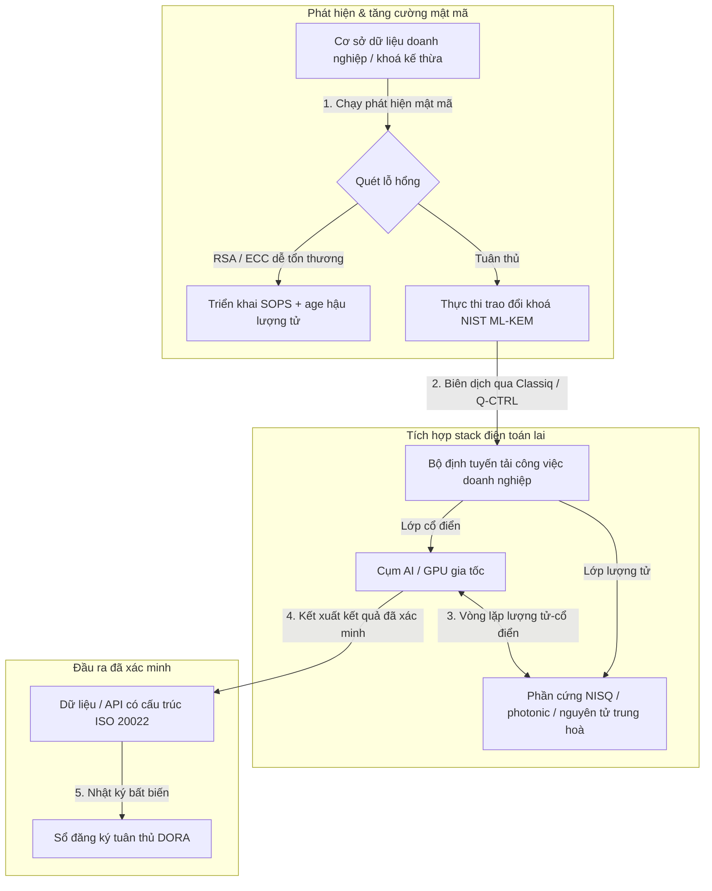

---

# Front Matter (YAML)

author: "contact@sebastienrousseau.com (Sebastien Rousseau)"
banner_alt: "Toàn cảnh sân khấu của Hội nghị thượng đỉnh thường niên lần thứ 5 Commercialising Quantum Global 2026 của Economist Impact tại London — biểu trưng cho bước chuyển của công nghệ lượng tử từ nghiên cứu vật lý sang quy trình doanh nghiệp sẵn sàng vận hành"
banner_height: "1597"
banner_width: "2584"
banner: "https://cloudcdn.pro/stocks/images/sebastien-rousseau-20260617-5th-commercialising-quantum-2.webp"
cdn: "https://cloudcdn.pro"
charset: "UTF-8"
cname: "sebastienrousseau.com"
copyright: "© Copyright 2025 - 2026 - Sebastien Rousseau. All rights reserved."
date: "June 17, 2026"
description: "Bài học hội đồng quản trị từ Hội nghị thượng đỉnh thường niên lần thứ 5 Commercialising Quantum Global 2026 của Economist Impact — làn sóng tài trợ 1,3 tỷ USD, các stack lai không hối tiếc, mức độ cấp bách của di trú mật mã hậu lượng tử, thương mại hoá cảm biến lượng tử và chỉ đạo của HSBC rằng chần chừ là một sai lầm tự gây ra."
format-detection: "telephone=no"
hreflang: "vi"
icon: "https://cloudcdn.pro/clients/sebastienrousseau/v1/logos/sebastienrousseau.svg"
id: "https://sebastienrousseau.com/2026-06-17-economist-commercialising-quantum-summit-2026"
image_alt: "Chân dung đen trắng của Sebastien Rousseau"
image_height: "162"
image_width: "162"
image: "https://cloudcdn.pro/stocks/images/sebastien-rousseau.png"
keywords: "Commercialising Quantum Global 2026, hội nghị Economist Impact, mật mã hậu lượng tử, NIST ML-KEM, thu hoạch ngay giải mã sau, SNDL, lượng tử HSBC, Philip Intallura, cảm biến lượng tử, định vị không phụ thuộc GPS, NQCC, Đạo luật Lượng tử EU, Quantcore, giải thưởng qBIG, Lord Vallance, lượng tử-cổ điển lai, DORA Điều 6"
language: "vi-VN"
last_reviewed: "2026-06-17"
layout: "report"
locale: "vi_VN"
logo_alt: "Logo của Sebastien Rousseau"
logo_height: "44"
logo_width: "44"
logo: "https://cloudcdn.pro/clients/sebastienrousseau/v1/logos/sebastienrousseau.svg"
menu: ""
measurementID: "G-169G4ET5HQ"
name: "Sebastien Rousseau"
permalink: "https://sebastienrousseau.com/2026-06-17-economist-commercialising-quantum-summit-2026"
rating: "general"
referrer: "no-referrer"
robots: "index, follow"
schema: "FAQPage, Article"
seo_title: "Commercialising Quantum 2026: bài học hội đồng quản trị"
short_name: "sebastienrousseau"
subtitle: "Lượng tử đã vượt qua giai đoạn khoa học phòng thí nghiệm để bước vào quy trình doanh nghiệp lai; hội đồng quản trị phải đáp lại bằng 1,3 tỷ USD tài trợ trong năm 2026, di trú hậu lượng tử tức thì và chỉ đạo của HSBC rằng phải ngừng chần chừ."
tags: "lượng tử, mật mã hậu lượng tử, NIST ML-KEM, thu hoạch ngay giải mã sau, cảm biến lượng tử, HSBC, Economist Impact, điện toán lai, DORA, Đạo luật Lượng tử EU, NQCC, bài học hội nghị thượng đỉnh"
theme-color: "0, 83, 191"
title: "Từ qubit đến lợi nhuận: bài học chiến lược từ Hội nghị thượng đỉnh thường niên lần thứ 5 Commercialising Quantum Global 2026 của Economist"
url: "https://sebastienrousseau.com/2026-06-17-economist-commercialising-quantum-summit-2026"
viewport: "width=device-width, initial-scale=1, shrink-to-fit=no"

# RSS - The RSS feed front matter (YAML).
atom_link: "https://sebastienrousseau.com/2026-06-17-economist-commercialising-quantum-summit-2026/rss.xml"
category: "Technology"
docs: https://validator.w3.org/feed/docs/rss2.html
generator: "Static Site Generator (SSG) (version 0.0.26)"
item_description: "Bài học hội đồng quản trị từ Hội nghị thượng đỉnh thường niên lần thứ 5 Commercialising Quantum Global 2026 của Economist Impact — làn sóng tài trợ 1,3 tỷ USD, các stack lai không hối tiếc, mức độ cấp bách của di trú mật mã hậu lượng tử, thương mại hoá cảm biến lượng tử và chỉ đạo của HSBC rằng chần chừ là một sai lầm tự gây ra."
item_guid: "https://sebastienrousseau.com/2026-06-17-economist-commercialising-quantum-summit-2026/rss.xml"
item_link: "https://sebastienrousseau.com/2026-06-17-economist-commercialising-quantum-summit-2026/rss.xml"
item_pub_date: "Wed, 17 Jun 2026 06:06:06 +0000"
item_title: "Từ qubit đến lợi nhuận: bài học chiến lược từ Hội nghị thượng đỉnh thường niên lần thứ 5 Commercialising Quantum Global 2026 của Economist"
last_build_date: "Wed, 17 Jun 2026 06:06:06 +0000"
managing_editor: "contact@sebastienrousseau.com (Sebastien Rousseau)"
pub_date: "Wed, 17 Jun 2026 06:06:06 +0000"
ttl: "60"
type: "article"
webmaster: "contact@sebastienrousseau.com"

# Apple - The Apple front matter (YAML).
apple_mobile_web_app_orientations: "portrait"
apple_touch_icon_sizes: "192x192"
apple-mobile-web-app-capable: "yes"
apple-mobile-web-app-status-bar-inset: "black"
apple-mobile-web-app-status-bar-style: "black-translucent"
apple-mobile-web-app-title: "Commercialising Quantum 2026: bài học hội đồng"
apple-touch-fullscreen: "yes"

# MS Application - The MS Application front matter (YAML).

msapplication-navbutton-color: "0, 83, 191"

# Twitter Card - The Twitter Card front matter (YAML).

twitter_card: "summary_large_image"
twitter_creator: "@wwdseb"
twitter_description: "Bài học hội đồng quản trị từ Hội nghị thượng đỉnh thường niên lần thứ 5 Commercialising Quantum Global 2026 của Economist Impact — làn sóng tài trợ 1,3 tỷ USD, các stack lai không hối tiếc, mức độ cấp bách của di trú mật mã hậu lượng tử, thương mại hoá cảm biến lượng tử và chỉ đạo của HSBC rằng chần chừ là một sai lầm tự gây ra."
twitter_image: "https://cloudcdn.pro/clients/sebastienrousseau/v1/logos/sebastienrousseau.svg"
twitter_image_alt: "Logo của Sebastien Rousseau"
twitter_site: "@wwdseb"
twitter_title: "Commercialising Quantum 2026: bài học hội đồng quản trị"
twitter_url: "https://sebastienrousseau.com/2026-06-17-economist-commercialising-quantum-summit-2026"

excerpt: "Hội nghị thượng đỉnh thường niên lần thứ 5 Commercialising Quantum Global 2026 của Economist Impact xác nhận bước ngoặt của lượng tử sang quy trình doanh nghiệp: 1,3 tỷ USD huy động được trong năm tháng, mật mã hậu lượng tử là vấn đề fiduciary cấp hội đồng dưới áp lực thu hoạch SNDL, cảm biến lượng tử đang được giao hàng hôm nay cho định vị không phụ thuộc GPS, và Philip Intallura của HSBC đưa ra chỉ đạo rằng chờ đợi phần cứng chịu lỗi là một sai lầm tự gây ra."

# Humans.txt - The Humans.txt front matter (YAML).
author_website: "https://sebastienrousseau.com"
author_twitter: "@wwdseb"
author_location: "London, UK"
thanks: "Cảm ơn quý vị đã đọc!"
site_last_updated: "2026-06-17"
site_standards: "HTML5, CSS3, RSS, Atom, JSON, XML, YAML, Markdown, TOML"
site_components: "Kaishi, Kaishi Builder, Kaishi CLI, Kaishi Templates, Kaishi Themes"
site_software: "Static Site Generator, Rust"

---

# Từ qubit đến lợi nhuận: bài học chiến lược từ Hội nghị thượng đỉnh thường niên lần thứ 5 Commercialising Quantum Global 2026 của Economist

Mức độ sẵn sàng của doanh nghiệp, di trú mật mã hậu lượng tử, các stack điện toán lai và bối cảnh thương mại mới nổi của cảm biến và mạng lượng tử.

**Tóm lược.** Hội nghị thường niên lần thứ 5 Commercialising Quantum Global 2026, do Economist Impact tổ chức ngày 16–17 tháng 6 năm 2026 tại Business Design Centre ở London, đã quy tụ hơn 1.100 nhà lãnh đạo toàn cầu thuộc doanh nghiệp, tài chính, hoạch định chính sách và nghiên cứu. Chủ đề trung tâm đánh dấu một bước ngoặt cấu trúc rõ rệt: công nghệ lượng tử đã chuyển từ khoa học phòng thí nghiệm suy đoán sang quy trình doanh nghiệp lai, thiết thực. Được hậu thuẫn bởi 1,3 tỷ USD vốn mạo hiểm huy động được chỉ trong năm tháng đầu năm 2026, thảo luận tại hội đồng quản trị không còn xoay quanh việc đếm qubit vật lý, mà tập trung vào thiết lập các stack điện toán lai "không hối tiếc", bảo vệ tài sản số trước mối đe doạ mật mã "thu hoạch ngay, giải mã sau" (SNDL) và triển khai hệ thống cảm biến lượng tử ngắn hạn cho định vị không phụ thuộc GPS.

## Điểm chính

- **Doanh nghiệp dịch chuyển sang quy trình thiết thực.** Các nhà lãnh đạo ngành ([Steve Suarez](https://www.linkedin.com/in/stevesuarez) của HorizonX, [Phil Intallura](https://www.linkedin.com/in/intallura) của HSBC) nhấn mạnh rằng tích hợp lượng tử không còn là bài toán vật lý mà là bài toán vận hành. Các ngân hàng và doanh nghiệp đang triển khai các thử nghiệm lượng tử-cổ điển lai để chuẩn bị nhân lực và tối ưu các tải công việc đang chạy.
- **Mật mã hậu lượng tử (PQC) là ưu tiên cấp hội đồng quản trị.** Các chuyên gia bảo mật và pháp lý (CMS UK, [Joanne Miller](https://www.linkedin.com/in/joanne-miller-nso) của Microsoft, [Craig Farrell](https://www.linkedin.com/in/craig-farrell) của EY) cảnh báo rằng các tổ chức không thể chờ phần cứng chịu lỗi mới triển khai PQC. Hoạt động thu hoạch "thu hoạch ngay, giải mã sau" đang diễn ra hôm nay, khiến việc di trú sang chuẩn NIST ML-KEM trở thành mối quan ngại fiduciary tức thì.
- **Cảm biến lượng tử dẫn đầu lợi nhuận ngắn hạn.** Trong khi điện toán chịu lỗi vẫn cách nhiều năm nữa, cảm biến lượng tử ([Matthew Kinsella](https://www.linkedin.com/in/matthewkinsella) của Infleqtion) đang mở rộng quy mô nhanh chóng. Đồng hồ lượng tử và cảm biến quán tính đang được triển khai cho định vị không phụ thuộc GPS, an ninh quốc gia và lưới năng lượng siêu ổn định.
- **Chủ quyền, cụm và áp lực chính sách.** Bộ trưởng Khoa học Vương quốc Anh [Lord Vallance](https://www.linkedin.com/in/patrick-vallance) và [Lord William Hague](https://www.linkedin.com/in/williamhague) phác thảo các sứ mệnh quốc gia nhằm chuyển nghiên cứu thành "siêu cụm" quy mô công nghiệp phối hợp với National Quantum Computing Centre (NQCC). Đạo luật Lượng tử EU sắp tới càng nhấn mạnh cuộc đua địa-chính trị về năng lực điện toán có chủ quyền.
- **Quantcore giành giải thưởng qBIG.** Quantcore, doanh nghiệp tách ra từ University of Glasgow, đã giành giải thưởng IOP qBIG cho thành phần siêu dẫn dựa trên niobium đột phá, hoạt động ở nhiệt độ cao hơn vật liệu truyền thống, giảm đáng kể chi phí hạ tầng đông lạnh.

**Đọc liên quan:** [KyberLib và di trú ngân hàng hậu lượng tử trong năm 2026: từ chuẩn đến mã](https://sebastienrousseau.com/2026-06-12-kyberlib-post-quantum-banking-migration-standards-code-2026/), [Chỉ số khả năng chống chịu ngân hàng trong năm 2026: AI, đám mây, lượng tử, thanh toán và rủi ro tập trung bên thứ ba](https://sebastienrousseau.com/2026-06-08-banking-resilience-index-ai-cloud-quantum-payments-third-party-risk-2026/), [Chỉ số ngân hàng cloud-native trong năm 2026: DORA, kỹ thuật nền tảng, đám mây có chủ quyền và khả năng chống chịu vận hành](https://sebastienrousseau.com/2026-06-05-cloud-native-banking-index-dora-resilience-platform-engineering-2026/).

## 01. Vì sao Hội nghị thượng đỉnh 2026 quan trọng với hội đồng quản trị

Phiên bản 2026 của Hội nghị thượng đỉnh Commercialising Quantum Global do Economist tổ chức đánh dấu một bước chuyển vĩnh viễn trong cách thế giới doanh nghiệp đánh giá công nghệ chiều sâu.

Trong lịch sử, điện toán lượng tử bị xem là việc của các bộ phận R&D như một nỗ lực khoa học kéo dài hàng thập kỷ. Đến tháng 6 năm 2026, góc nhìn này đã lỗi thời. Các tổ chức phải chuyển từ tò mò "lấy vật lý làm trung tâm" sang triển khai "lấy kinh doanh làm trung tâm". Lý do gồm hai phần:

1. **Hội tụ lượng tử-AI.** Các stack điện toán hiệu năng cao (HPC) đang hợp nhất các nút cổ điển, AI gia tốc và NISQ (Noisy Intermediate-Scale Quantum) vào một lớp điện toán thống nhất duy nhất. Các tổ chức trì hoãn xây dựng ứng dụng sẵn sàng cho lượng tử sẽ phát hiện rằng cửa sổ giành lợi thế chiến lược đang khép lại nhanh hơn dự kiến.
2. **Áp lực địa-chính trị và fiduciary.** Với chương trình lượng tử theo sứ mệnh của Vương quốc Anh và Đạo luật Lượng tử EU sắp tới, năng lực lượng tử đã trở thành vấn đề chủ quyền quốc gia và liên tục vận hành doanh nghiệp.

Hơn nữa, an ninh mạng hậu lượng tử không còn là yêu cầu tuân thủ trong tương lai. Mối đe doạ tấn công "lưu trữ ngay, giải mã sau" (SNDL) đồng nghĩa với việc dữ liệu doanh nghiệp bị chặn thu hôm nay sẽ bị giải mã khi hệ thống lượng tử thương mại mở rộng quy mô, tạo ra trách nhiệm pháp lý tức thì theo các uỷ nhiệm khả năng chống chịu vận hành toàn cầu như Đạo luật Khả năng chống chịu Vận hành Số (DORA).

## 02. Lăng kính chiến lược Commercialising Quantum 2026

Các nhà lãnh đạo công nghệ doanh nghiệp phải ánh xạ độ trưởng thành lượng tử qua năm lớp vận hành riêng biệt, đánh giá các chân trời thời gian và rủi ro bảng cân đối kế toán.

### Bảng 1: Lăng kính chiến lược Commercialising Quantum 2026

| Lớp | Trọng tâm doanh nghiệp | Mốc / chân trời | Rủi ro doanh nghiệp chính |
| ---- | ---- | ---- | ---- |
| **Phần cứng & trình biên dịch** | Lựa chọn giữa các hướng tiếp cận cạnh tranh (siêu dẫn, ion bẫy, nguyên tử trung hoà, photonic) | 3 – 5 năm (chịu lỗi) | Bị khoá vào kiến trúc ngõ cụt hoặc đặt cược vào một nền tảng duy nhất quá sớm. |
| **Tăng cường mật mã** | Phát hiện và kiểm kê các phụ thuộc mật mã; di trú sang NIST ML-KEM | Tức thì (đang di trú) | Vi phạm dữ liệu mang tính hệ thống và thất bại tuân thủ theo DORA và NIST CSF 2.0. |
| **Cảm biến lượng tử** | Triển khai định vị không phụ thuộc GPS, đồng hồ siêu ổn định và máy đo trọng lực | 1 – 2 năm (thương mại tức thì) | Gián đoạn vận hành logistics, vận tải biển và lưới năng lượng do nhiễu GPS. |
| **Tích hợp hệ thống** | Kết nối phần cứng lượng tử vào trung tâm dữ liệu HPC cổ điển và siêu máy tính hiện có | 1 – 3 năm (pha lai) | Độ trễ cao, nút thắt truyền dữ liệu và silo điện toán phân mảnh. |
| **Phần mềm doanh nghiệp** | Phơi bày thuật toán lượng tử qua các lớp trừu tượng và API cấp cao (Classiq, Q-CTRL) | Tức thì (xây dựng kỹ năng) | Nhân lực và quy trình tách rời thực thi kỹ thuật thực tế. |

## 03. Các tín hiệu lượng tử và kích hoạt hội đồng quản trị chính

Các nhà lãnh đạo công nghệ phải theo dõi các chỉ số thị trường và pháp lý cụ thể, đo lường được để định hướng đầu tư lượng tử.

### Bảng 2: Các tín hiệu lượng tử và kích hoạt hội đồng quản trị chính

| Tín hiệu | Chỉ số định lượng | Tham chiếu pháp lý / chính sách | Ưu tiên nền tảng hành động |
| ---- | ---- | ---- | ---- |
| **Làn sóng tài trợ lượng tử** | 1,3 tỷ USD huy động trên toàn cầu trong năm tháng đầu năm 2026 | Lợi tức Khả năng chống chịu (RoR) | Chuyển ngân sách từ các thử nghiệm suy đoán sang tải công việc lượng tử-cổ điển lai "không hối tiếc". |
| **Mức độ phơi nhiễm giải mã dữ liệu** | 100% dữ liệu mã hoá truyền qua kênh công cộng phơi nhiễm trước thu hoạch SNDL | DORA Điều 6 (bảo mật ICT) | Triển khai công cụ phát hiện mật mã để xác định khoá RSA/ECC dễ tổn thương trên toàn hệ thống. |
| **Hạ tầng có chủ quyền** | Phân bổ 2,5 tỷ bảng cho Chiến lược Lượng tử Quốc gia Vương quốc Anh | Sứ mệnh Lượng tử Vương quốc Anh / Lord Vallance | Thiết lập quan hệ đối tác địa phương với các siêu cụm quốc gia như NQCC. |
| **Hạn chót tuân thủ** | Hạn chuyển đổi địa chỉ có cấu trúc SWIFT ngày 14 tháng 11 năm 2026 | Chỉ thị SWIFT SR 2026 | Làm sạch và định dạng cơ sở dữ liệu liên ngân hàng để đáp ứng đặc tả XML có cấu trúc. |

## 04. Đi sâu vào các chủ đề cốt lõi của hội nghị

### Lượng tử chạm tới điểm bùng phát đầu tư

Tài trợ vốn mạo hiểm đã tăng tốc đáng kể, huy động được **1,3 tỷ USD** chỉ trong năm tháng đầu năm 2026. Khác với các chu kỳ thổi phồng suy đoán của những năm trước, làn sóng vốn hiện tại được hậu thuẫn bởi các tải công việc ngắn hạn, có thật. Diễn giả từ Classiq và IBM Quantum Platform trình diễn cách các lớp trừu tượng phần mềm và trình biên dịch tự động cho phép các nhóm phát triển không chuyên thực thi thuật toán lượng tử-cổ điển lai trên hạ tầng cổ điển hiện nay. Chiến lược "không hối tiếc" này cho phép các tổ chức xây dựng nhân lực và quy trình sẵn sàng cho lượng tử ngay lập tức.

### Cảnh báo pháp lý và pháp luật về "thu hoạch ngay, giải mã sau"

Các đối tác pháp lý và lãnh đạo an ninh mạng đã khơi mào những trao đổi quan trọng quanh mức độ tức thì của rủi ro dữ liệu. Đại diện từ hãng luật tài trợ CMS UK và CSO của Microsoft [Joanne Miller](https://www.linkedin.com/in/joanne-miller-nso) đưa ra cảnh báo thẳng thắn cho ban lãnh đạo cấp cao: *chờ phần cứng chịu lỗi xuất hiện trước khi triển khai mật mã hậu lượng tử là một thất bại fiduciary nghiêm trọng.*

Theo mô hình "lưu trữ ngay, giải mã sau" (SNDL), các tác nhân thù địch đang chủ động thu hoạch dữ liệu doanh nghiệp đã mã hoá hôm nay với ý định giải mã ngay khi máy tính lượng tử có ý nghĩa mật mã xuất hiện. Các tổ chức phải triển khai bảo vệ hậu lượng tử (như NIST ML-KEM) ngay lập tức để bảo vệ các tập dữ liệu nhạy cảm có vòng đời dài, sở hữu trí tuệ và hồ sơ khách hàng lịch sử.

### Tái định vị thổi phồng "cảm biến lượng tử"

Trong khi điện toán lượng tử chịu lỗi vẫn cách nhiều năm nữa, hội nghị nêu bật cảm biến lượng tử là làn sóng triển khai thực tế có lợi nhuận thật sự đầu tiên. Giám đốc Điều hành [Matthew Kinsella](https://www.linkedin.com/in/matthewkinsella) của Infleqtion trình bày chi tiết cách đồng hồ lượng tử, cảm biến quán tính và hệ thống tần số vô tuyến đang mở rộng nhanh chóng trên nhiều ngành.

Vì các công nghệ này đo các hằng số vật lý với độ chính xác dưới nguyên tử, chúng cho phép **định vị không phụ thuộc GPS**, lưới năng lượng siêu ổn định và viễn thông không gian sâu. Các ứng dụng này đặc biệt liên quan đến hàng không, vận tải biển và hệ thống quốc phòng đang đối mặt với mối đe doạ nhiễu GPS gia tăng.

### Hợp tác hệ sinh thái và cụm

Hệ sinh thái lượng tử Vương quốc Anh đã tận dụng hội nghị London để giới thiệu các siêu cụm đổi mới sáng tạo trong nước. Cập nhật trực tiếp từ National Quantum Computing Centre (NQCC) và Digital Catapult trình bày chi tiết cách các công ty deep-tech tách ra ở giai đoạn đầu có thể bắc cầu "khoảng cách công nghệ" bằng cách tích hợp phần cứng lượng tử trực tiếp vào trung tâm dữ liệu siêu máy tính cổ điển.

[Wridhdhisom Karar](https://www.linkedin.com/in/wridhdhisomkarar), đồng sáng lập của startup lượng tử Scotland Quantcore, đã nhận giải thưởng danh giá Quantum Business Innovation and Growth (qBIG) của Institute of Physics (IOP) cho các thành phần siêu dẫn dựa trên niobium của công ty. Các thành phần này hoạt động ở nhiệt độ cao hơn vật liệu truyền thống, giảm đáng kể chi phí hạ tầng đông lạnh cần thiết để mở rộng quy mô bộ xử lý lượng tử.

### Nghiên cứu điển hình HSBC: vì sao chần chừ với lượng tử là "sai lầm tự gây ra"

Các nhận định từ [**Philip Intallura, Ph.D.**](https://www.linkedin.com/in/intallura) (Trưởng phòng Toàn cầu Công nghệ Lượng tử tại HSBC, Cố vấn Chính phủ Vương quốc Anh và Cố vấn Hội đồng) tại Sự kiện thường niên lần thứ 5 Commercialising Quantum của Economist (2026) đã đưa ra một chỉ đạo mạnh mẽ cho hội đồng quản trị: *"Chờ lượng tử chịu lỗi trước khi bắt đầu là một sai lầm tự gây ra."*

Tiến sĩ Intallura lập luận rằng tâm thế "chờ và xem" phổ biến trong các định chế tài chính là một bàn phản lưới nhà xây dựng trên ba giả định sai:

- **ROI ngắn hạn là có thật.** Trong thử nghiệm thực nghiệm, HSBC đã vượt qua các mô hình hiện đang chạy trong sản xuất, kết nối công việc lượng tử với các bộ phận khác trong doanh nghiệp, dùng lượng tử để làm sâu sắc thêm quan hệ với một số khách hàng lớn nhất và thu hút công việc mới đáng kể vào **HSBC Innovation Banking**.
- **Lượng tử có đường cong áp dụng dốc.** Xây dựng năng lực, hoạch định chiến lược, đảm bảo tài trợ và vận hành các chu kỳ thử nghiệm bên trong một tổ chức bị quản lý chặt không phải việc làm trong thời gian ngắn. Các quy trình phải được kiểm thử và điều chỉnh có hệ thống cho công nghệ.
- **Lượng tử là một hệ sinh thái.** Không một người chơi đơn lẻ nào tới đó một mình. Mọi bài báo nghiên cứu, POC và thử nghiệm mà HSBC đã thực thi đều có sự hợp tác chặt chẽ với một nhà cung cấp lượng tử — và trong một số trường hợp, hợp tác mở rộng tới giới hàn lâm, cơ quan quản lý và chính phủ.

**Chỉ đạo khép lại cho hội đồng quản trị:** *"Năng lực quý vị cần trong ngày đầu tiên của chịu lỗi là năng lực quý vị xây dựng ngay bây giờ."*

## 05. Pipeline tích hợp lượng tử và mật mã doanh nghiệp

Để bảo vệ tài sản số trong khi xây dựng mức độ sẵn sàng cho lượng tử, doanh nghiệp phải thiết lập một pipeline tích hợp rõ ràng.

## 06. Sổ tay hội đồng quản trị: các nhiệm vụ hành động

Để chuyển các hiểu biết từ hội nghị Commercialising Quantum Global 2026 thành giá trị kinh doanh tức thì, ban lãnh đạo cấp cao nên thực thi sổ tay hội đồng quản trị bốn bước sau:

1. **Bắt buộc phát hiện mật mã.** Chỉ đạo Giám đốc An ninh thông tin (CISO) lập danh mục mọi tài sản mật mã, ánh xạ từng khoá RSA và ECC kế thừa trên toàn doanh nghiệp để chuẩn bị cho di trú hậu lượng tử.
2. **Triển khai chiến lược lai "không hối tiếc".** Tránh chờ phần cứng hoàn hảo. Đầu tư vào phần mềm lấy cảm hứng từ lượng tử và các thử nghiệm cổ điển-lượng tử lai để phát triển nhân lực nội bộ và tối ưu logistics phức tạp hoặc danh mục rủi ro ngay hôm nay.
3. **Đánh giá cảm biến lượng tử cho logistics.** Nếu tổ chức của quý vị phụ thuộc vào chuỗi cung ứng toàn cầu, vận tải biển hoặc hạ tầng trọng yếu, hãy chủ động đánh giá hệ thống cảm biến lượng tử (như định vị không phụ thuộc GPS) để giảm thiểu rủi ro gián đoạn địa-chính trị.
4. **Đăng ký Insight Hour ngày 30 tháng 6.** Đảm bảo các nhà lãnh đạo công nghệ của quý vị đăng ký **Commercialising Quantum Global Insight Hour** trực tuyến ngày 30 tháng 6 năm 2026 lúc 3:00 PM BST (được IonQ hỗ trợ) để tiếp tục theo dõi chiến lược quản lý rủi ro doanh nghiệp và phân bổ nhân lực.

## 07. Câu hỏi thường gặp

**"Thu hoạch ngay, giải mã sau" (SNDL) là gì và vì sao nó quan trọng hôm nay?**
SNDL là hành vi chặn thu và lưu trữ dữ liệu đã mã hoá hôm nay, với ý định giải mã sau khi máy tính lượng tử có ý nghĩa mật mã trở nên khả dụng. Các tập dữ liệu nhạy cảm có vòng đời dài — sở hữu trí tuệ, hồ sơ khách hàng, thông tin liên lạc chính phủ — đã đang là mục tiêu. Di trú sang NIST ML-KEM là quyết định fiduciary mà hội đồng quản trị không thể trì hoãn.

**Vì sao cảm biến lượng tử là làn sóng thương mại đầu tiên thay vì điện toán?**
Cảm biến lượng tử đo các hằng số vật lý với độ chính xác dưới nguyên tử và không cần phần cứng chịu lỗi như điện toán lượng tử. Đồng hồ lượng tử, máy đo trọng lực và cảm biến quán tính đã đang được triển khai thí điểm cho định vị không phụ thuộc GPS, lưới năng lượng siêu ổn định và truyền thông không gian sâu.

**Công việc lượng tử của HSBC chỉ là R&D hay đã mang lại lợi tức đo lường được?**
Theo Philip Intallura tại hội nghị, HSBC đã vượt qua các mô hình hiện đang chạy trong sản xuất, dùng lượng tử để làm sâu sắc thêm quan hệ với các khách hàng lớn nhất và thu hút công việc mới đáng kể vào HSBC Innovation Banking. Công việc đã chuyển từ nghiên cứu sang tích hợp vận hành.

## 08. Tham khảo

- **Economist Impact, (2026).** *5th Annual Commercialising Quantum Global 2026.* Biên bản hội nghị trực tiếp, ngày 16–17 tháng 6 năm 2026. London: Business Design Centre. Available at: [Economist Impact](https://events.economist.com/commercialising-quantum/).
- **National Institute of Standards and Technology (NIST), (2024).** *First Three Finalized Post-Quantum Encryption Standards (FIPS 203, 204, and 205).* Gaithersburg: U.S. Department of Commerce. Available at: [NIST Standards](https://www.nist.gov/news-events/news/2024/08/nist-releases-first-3-finalized-post-quantum-encryption-standards).
- **European Parliament and Council of the European Union, (2022).** *Regulation (EU) 2022/2554 on digital operational resilience for the financial sector (DORA).* Brussels: Official Journal of the European Union. Available at: [DORA Regulation](https://eur-lex.europa.eu/legal-content/EN/TXT/?uri=CELEX%3A32022R2554).
- **SWIFT, (2024).** *ISO 20022 November 2026 Structured Address Milestone.* La Hulpe: SWIFT. Available at: [SWIFT ISO 20022 milestone](https://www.swift.com/standards/iso-20022/iso-20022-bytes/call-action-november-2026).
