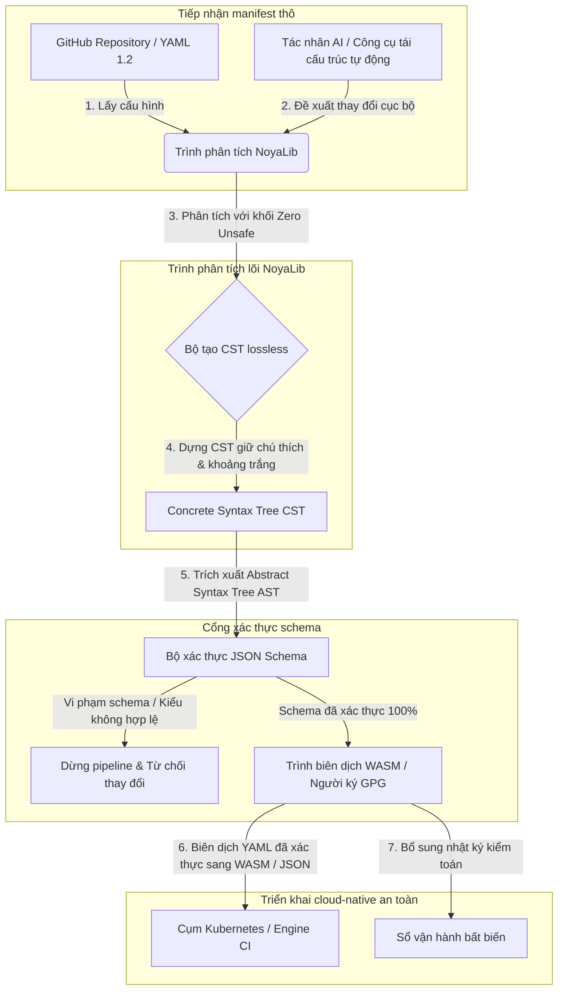

---

# Front Matter (YAML)

author: "contact@sebastienrousseau.com (Sebastien Rousseau)"
banner_alt: "Hình học kiến trúc dưới ánh sáng kịch tính — biểu trưng cho vai trò chịu lực của NoyaLib như trình phân tích YAML Rust an toàn nằm bên dưới CI, Kubernetes, MCP và cấu hình dịch vụ tài chính"
banner_height: "1597"
banner_width: "2584"
banner: "https://cloudcdn.pro/stocks/images/ken-cheung-KonWFWUaAuk.webp"
cdn: "https://cloudcdn.pro"
charset: "UTF-8"
cname: "sebastienrousseau.com"
copyright: "© Copyright 2025 - 2026 - Sebastien Rousseau. All rights reserved."
date: "June 18, 2026"
description: "NoyaLib — trình phân tích YAML 1.2 Rust zero-unsafe, 406/406 spec, JSON Schema, CST lossless và bindings MCP/WASM cho hạ tầng tài chính."
format-detection: "telephone=no"
hreflang: "vi"
icon: "https://cloudcdn.pro/clients/sebastienrousseau/v1/logos/sebastienrousseau.svg"
id: "https://sebastienrousseau.com/2026-06-18-noyalib-safe-yaml-rust-ai-mcp-financial-infrastructure-2026"
image_alt: "Chân dung đen trắng của Sebastien Rousseau"
image_height: "162"
image_width: "162"
image: "https://cloudcdn.pro/stocks/images/sebastienrousseau.webp"
keywords: "trình phân tích YAML Rust an toàn hơn, NoyaLib, tuân thủ đặc tả YAML 1.2, Rust zero-unsafe, xác thực JSON Schema, Concrete Syntax Tree lossless, CST, MCP, Model Context Protocol, WebAssembly, manifest Kubernetes, cấu hình CI/CD, DORA Điều 5, BCBS 239, rủi ro vận hành Basel III, hạ tầng tài chính, bảo mật cấu hình, chuỗi cung ứng phần mềm"
language: "vi-VN"
last_reviewed: "2026-06-18"
layout: "report"
locale: "vi_VN"
logo_alt: "Logo của Sebastien Rousseau"
logo_height: "44"
logo_width: "44"
logo: "https://cloudcdn.pro/clients/sebastienrousseau/v1/logos/sebastienrousseau.svg"
menu: ""
measurementID: "G-169G4ET5HQ"
name: "Sebastien Rousseau"
permalink: "https://sebastienrousseau.com/2026-06-18-noyalib-safe-yaml-rust-ai-mcp-financial-infrastructure-2026"
rating: "general"
referrer: "no-referrer"
robots: "index, follow"
schema: "FAQPage, Article"
seo_title: "Stack YAML Rust an toàn hơn cho AI, MCP & Tài chính"
short_name: "sebastienrousseau"
subtitle: "Một stack YAML Rust an toàn hơn — NoyaLib — biến YAML 1.2 từ markup tiện lợi thành mặt phẳng điều khiển cấu hình tuân thủ đặc tả, an toàn về mật mã cho tác nhân AI, MCP, Kubernetes và hạ tầng dịch vụ tài chính."
tags: "trình phân tích YAML Rust an toàn hơn, NoyaLib, YAML 1.2, Rust zero-unsafe, JSON Schema, MCP, WebAssembly, Kubernetes, DORA, BCBS 239, Basel III, hạ tầng tài chính, bảo mật chuỗi cung ứng"
theme-color: "0, 83, 191"
title: "Vì sao YAML cần một stack Rust an toàn hơn cho AI, MCP và hạ tầng tài chính trong năm 2026"
url: "https://sebastienrousseau.com/2026-06-18-noyalib-safe-yaml-rust-ai-mcp-financial-infrastructure-2026"
viewport: "width=device-width, initial-scale=1, shrink-to-fit=no"

# RSS - The RSS feed front matter (YAML).
atom_link: "https://sebastienrousseau.com/2026-06-18-noyalib-safe-yaml-rust-ai-mcp-financial-infrastructure-2026/rss.xml"
category: "Technology"
docs: https://validator.w3.org/feed/docs/rss2.html
generator: "Static Site Generator (SSG) (version 0.0.26)"
item_description: "NoyaLib — trình phân tích YAML 1.2 Rust zero-unsafe, 406/406 spec, JSON Schema, CST lossless và bindings MCP/WASM cho hạ tầng tài chính."
item_guid: "https://sebastienrousseau.com/2026-06-18-noyalib-safe-yaml-rust-ai-mcp-financial-infrastructure-2026/rss.xml"
item_link: "https://sebastienrousseau.com/2026-06-18-noyalib-safe-yaml-rust-ai-mcp-financial-infrastructure-2026/rss.xml"
item_pub_date: "Thu, 18 Jun 2026 06:06:06 +0000"
item_title: "Vì sao YAML cần một stack Rust an toàn hơn cho AI, MCP và hạ tầng tài chính trong năm 2026"
last_build_date: "Thu, 18 Jun 2026 06:06:06 +0000"
managing_editor: "contact@sebastienrousseau.com (Sebastien Rousseau)"
pub_date: "Thu, 18 Jun 2026 06:06:06 +0000"
ttl: "60"
type: "article"
webmaster: "contact@sebastienrousseau.com"

# Apple - The Apple front matter (YAML).
apple_mobile_web_app_orientations: "portrait"
apple_touch_icon_sizes: "192x192"
apple-mobile-web-app-capable: "yes"
apple-mobile-web-app-status-bar-inset: "black"
apple-mobile-web-app-status-bar-style: "black-translucent"
apple-mobile-web-app-title: "Stack YAML Rust an toàn cho AI, MCP & Tài chính"
apple-touch-fullscreen: "yes"

# MS Application - The MS Application front matter (YAML).

msapplication-navbutton-color: "0, 83, 191"

# Twitter Card - The Twitter Card front matter (YAML).

twitter_card: "summary_large_image"
twitter_creator: "@wwdseb"
twitter_description: "NoyaLib — trình phân tích YAML 1.2 Rust zero-unsafe, 406/406 spec, JSON Schema, CST lossless và bindings MCP/WASM cho hạ tầng tài chính."
twitter_image: "https://cloudcdn.pro/clients/sebastienrousseau/v1/logos/sebastienrousseau.svg"
twitter_image_alt: "Logo của Sebastien Rousseau"
twitter_site: "@wwdseb"
twitter_title: "Stack YAML Rust an toàn hơn cho AI, MCP & Tài chính"
twitter_url: "https://sebastienrousseau.com/2026-06-18-noyalib-safe-yaml-rust-ai-mcp-financial-infrastructure-2026"

excerpt: "NoyaLib là một stack YAML Rust an toàn hơn — không có khối unsafe, tuân thủ đặc tả YAML 1.2 đạt 406/406, Concrete Syntax Tree lossless, xác thực JSON Schema (Draft 2020-12) và bindings MCP/WASM — được thiết kế cho tác nhân AI, Kubernetes, CI/CD và mặt phẳng điều khiển cấu hình bên dưới hạ tầng tài chính."

# Humans.txt - The Humans.txt front matter (YAML).
author_website: "https://sebastienrousseau.com"
author_twitter: "@wwdseb"
author_location: "London, UK"
thanks: "Cảm ơn quý vị đã đọc!"
site_last_updated: "2026-06-18"
site_standards: "HTML5, CSS3, RSS, Atom, JSON, XML, YAML, Markdown, TOML"
site_components: "Kaishi, Kaishi Builder, Kaishi CLI, Kaishi Templates, Kaishi Themes"
site_software: "Static Site Generator, Rust"

---

# Vì sao YAML cần một stack Rust an toàn hơn cho AI, MCP và hạ tầng tài chính trong năm 2026

Một stack YAML Rust an toàn hơn quan trọng vì YAML hiện gánh các pipeline CI/CD, các manifest Kubernetes, các quy tắc [Open Policy Agent](https://www.openpolicyagent.org/) và các sổ đăng ký công cụ Model Context Protocol (MCP) — và chỉ một phân tích cú pháp mơ hồ có thể làm hỏng một hệ thống thanh toán bù trừ, cấu hình sai một security group hoặc cấp cho một tác nhân AI cục bộ quyền hạn sai. [NoyaLib](https://github.com/sebastienrousseau/noyalib) là một hệ sinh thái phân tích và xác thực [YAML 1.2](https://yaml.org/spec/1.2.2/) thuần Rust, zero-unsafe, được thiết kế để khiến hạ tầng đó an toàn theo mặc định.

## Trả lời nhanh

**NoyaLib là gì trong một câu?** NoyaLib là một hệ sinh thái phân tích và xác thực YAML 1.2 mã nguồn mở, thuần Rust, với mã `unsafe` bằng không, tuân thủ đặc tả 100% trên bộ kiểm thử chính thức 406 bài của YAML, một Concrete Syntax Tree lossless và xác thực [JSON Schema](https://json-schema.org/) thời gian thực — được thiết kế để khiến cấu hình tác nhân AI, MCP, Kubernetes và hạ tầng tài chính an toàn theo mặc định.

## Tóm lược điều hành

YAML trông khiêm tốn cho tới khi một phân tích cú pháp mơ hồ hoặc vi phạm schema làm hỏng một hệ thống thanh toán bù trừ sản xuất nhiều tỷ đô-la. Trong năm 2026, YAML là chuẩn de-facto cho các pipeline [CI/CD](https://docs.github.com/en/actions/learn-github-actions/workflow-syntax-for-github-actions), các manifest [Kubernetes](https://kubernetes.io/docs/concepts/configuration/overview/), các quy tắc [Open Policy Agent](https://www.openpolicyagent.org/) và các sổ đăng ký công cụ Model Context Protocol (MCP). Các trình phân tích kế thừa mờ đục — với lỗ hổng bộ nhớ và phân tích phá huỷ — là một rủi ro bảo mật không thể chấp nhận. NoyaLib là một hệ sinh thái YAML 1.2 thuần Rust, zero-unsafe: tuân thủ đặc tả 100% trên cả 406 bài kiểm thử chính thức, một Concrete Syntax Tree (CST) lossless lưu giữ chú thích và khoảng trắng, và xác thực JSON Schema tích hợp sẵn. Kết quả là YAML được tái định hình thành một mặt phẳng điều khiển cấu hình kiểm toán được, an toàn và tác nhân có thể truy cập.

## Điểm chính

- **Cấu hình là mã sản xuất.** Một file YAML sai định dạng duy nhất có thể cấu hình sai security group cloud-native hoặc quyền hạn tác nhân AI. NoyaLib coi YAML là hạ tầng trọng yếu.
- **Thiết kế zero-unsafe.** Được xây dựng hoàn toàn trong Rust an toàn với mã `unsafe` bằng không, NoyaLib loại bỏ các lỗ hổng an toàn bộ nhớ — buffer overflow, thực thi mã từ xa — ở các lớp phân tích lõi.
- **Tuân thủ đặc tả tuyệt đối 406/406.** Xác thực toán học các cấu trúc cấu hình, loại bỏ chênh lệch phân tích và trôi cấu trúc giữa môi trường staging và sản xuất.
- **Concrete Syntax Tree lossless.** Khác các trình phân tích kế thừa loại bỏ chú thích và định dạng, NoyaLib bảo toàn khoảng trắng và chú thích, cho phép tái cấu trúc tự động vòng tròn an toàn bởi tác nhân AI.
- **Giá trị fiduciary cấp hội đồng quản trị.** Kết nối tính toàn vẹn cấu hình với các chỉ số vốn rủi ro vận hành theo [DORA Điều 5](https://eur-lex.europa.eu/legal-content/EN/TXT/?uri=CELEX%3A32022R2554) và [Basel III](https://www.bis.org/bcbs/publ/d424.htm), trực tiếp che chắn ban lãnh đạo cấp cao khỏi trách nhiệm cá nhân.

**Đọc liên quan:** [KyberLib và di trú ngân hàng hậu lượng tử trong năm 2026: từ chuẩn đến mã](https://sebastienrousseau.com/2026-06-12-kyberlib-post-quantum-banking-migration-standards-code-2026/), [Chỉ số ngân hàng cloud-native trong năm 2026: DORA, kỹ thuật nền tảng, đám mây có chủ quyền và khả năng chống chịu vận hành](https://sebastienrousseau.com/2026-06-05-cloud-native-banking-index-dora-resilience-platform-engineering-2026/), [Dotfiles nhận biết AI trong năm 2026: xây dựng máy trạm nhà phát triển an toàn, có thể tái lập cho MCP, SLSA và tính đồng nhất đa shell](https://sebastienrousseau.com/2026-06-16-ai-aware-dotfiles-secure-reproducible-workstation-2026/).

## 01. Vì sao stack YAML Rust an toàn hơn quan trọng trong năm 2026

Vào tháng 6 năm 2026, hạ tầng IT doanh nghiệp đã phân tán cao và ngày càng tự động hoá.

YAML đã âm thầm trở thành ngôn ngữ cấu hình chịu lực cho toàn bộ stack kỹ thuật phần mềm. Nó gánh các quy trình tích hợp liên tục (CI) biên dịch các artefact sản xuất, các manifest [Kubernetes](https://kubernetes.io/docs/concepts/overview/) điều phối các cụm cloud-native toàn cầu và các schema máy chủ [Model Context Protocol](https://modelcontextprotocol.io/) (MCP) cấp quyền cho tác nhân AI cục bộ thực thi các thao tác cục bộ.

Các trình phân tích YAML kế thừa — [PyYAML](https://pyyaml.org/), [yaml-cpp](https://github.com/jbeder/yaml-cpp), [libyaml](https://github.com/yaml/libyaml) — mang hai rủi ro cấu trúc:

1. **Lỗ hổng ép kiểu (vấn đề "Norway").** Các trình phân tích kế thừa thường ép các chuỗi không trích dẫn (mã quốc gia `NO` thành boolean `false`, `yes`/`no` cũng tương tự) — xem [thẻ boolean YAML 1.1 và 1.2](https://yaml.org/type/bool.html) — gây hỏng hệ thống trọng yếu hoặc cấu hình sai bảo mật âm thầm.
2. **Khai thác an toàn bộ nhớ.** Các trình phân tích mờ đục viết bằng C/C++ chịu lỗ hổng rò bộ nhớ và buffer overflow, có thể dẫn tới thực thi mã từ xa (RCE) trên máy chủ build lõi.

[NoyaLib](https://github.com/sebastienrousseau/noyalib) giải quyết các thách thức này. Nó là một hệ sinh thái phân tích và xác thực YAML 1.2 thuần Rust, zero-unsafe. Bằng cách đạt tuân thủ đặc tả tuyệt đối 406/406 và áp dụng xác thực JSON Schema nghiêm ngặt trực tiếp trong khi phân tích, NoyaLib mang lại **Lợi tức Khả năng chống chịu (RoR)** cao — ngăn ngừa thời gian chết do cấu hình và bảo mật chuỗi cung ứng phần mềm cấp tài chính.

## 02. Lăng kính kiến trúc NoyaLib 2026

Hệ sinh thái NoyaLib hoạt động như một trình phân tích cấu hình lossless, an toàn. Mọi manifest cục bộ và đám mây đều được xác thực cấu trúc và bảo vệ ở lớp thực thi thấp nhất.

### Bảng 1: Các lớp kiến trúc NoyaLib và giảm thiểu rủi ro

| Lớp | Quyết định thiết kế | Vì sao quan trọng | Rủi ro nếu xử lý sai |
| ---- | ---- | ---- | ---- |
| **Lớp phân tích** | Trình phân tích YAML 1.2 thuần Rust với khối `unsafe` bằng không | Loại bỏ lỗ hổng an toàn bộ nhớ và buffer overflow ở lớp thực thi thấp nhất. | Thực thi mã từ xa (RCE) trên máy chủ build lõi. |
| **Lớp tuân thủ** | Tuân thủ 100% trên 406/406 bài kiểm thử chính thức của YAML 1.2 | Loại bỏ chênh lệch phân tích và trôi ép kiểu giữa staging và sản xuất. | Lỗi ép kiểu "Norway" vô hiệu hoá các security group. |
| **Lớp cây cú pháp** | Concrete Syntax Tree (CST) lossless | Bảo toàn chú thích, khoảng trắng và thứ tự trong phân tích vòng tròn và tái cấu trúc lập trình. | Tái cấu trúc AI tự động phá huỷ các chú thích của nhà phát triển. |
| **Lớp xác thực** | Xác thực [JSON Schema (Draft 2020-12)](https://json-schema.org/draft/2020-12/release-notes) trong khi phân tích | Áp dụng các mô hình dữ liệu nghiêm ngặt cho file cấu hình trước khi tới các cụm sản xuất. | File cấu hình sai định dạng kích hoạt sập cụm cloud-native. |
| **Lớp giao diện** | Bindings WebAssembly (WASM) và MCP | Cho phép xác thực cấu hình chạy trực tiếp trong trình duyệt, nút biên và bộ công cụ tác nhân cục bộ. | Các silo công cụ nơi xác thực không thể thực thi trên thiết bị biên. |

## 03. Các tín hiệu bảo mật máy trạm và cấu hình chính

Để duy trì bảo mật tuyệt đối trên toàn bộ hệ sinh thái phát triển và vận hành, các Giám đốc An ninh thông tin (CISO) phải giám sát các chỉ số cụ thể, định lượng được.

### Bảng 2: Các tín hiệu bảo mật máy trạm và cấu hình

| Tín hiệu | Chỉ số / mốc vận hành | Tham chiếu NIST CSF / DORA | Triển khai nền tảng kỹ thuật |
| ---- | ---- | ---- | ---- |
| **Tuân thủ trình phân tích** | Tỷ lệ đạt 100% trên bộ kiểm thử chính thức YAML 1.2 (406/406 bài). | [DORA Điều 6](https://eur-lex.europa.eu/legal-content/EN/TXT/?uri=CELEX%3A32022R2554) (bảo mật ICT) | Lõi phân tích NoyaLib xác thực mọi manifest trước khi thực thi CI. |
| **Hồ sơ an toàn bộ nhớ** | Không có khối Rust `unsafe` nào trong các phụ thuộc trình phân tích và serializer. | DORA Điều 30 (chuỗi cung ứng) | Kiểm tra trình biên dịch tự động ([`forbid(unsafe_code)`](https://doc.rust-lang.org/reference/attributes/diagnostics.html#the-forbid-attribute)) trong các bản build cargo. |
| **Xác thực schema** | 100% file cấu hình đã phân tích được kiểm chứng với mô hình [JSON Schema](https://json-schema.org/) hợp lệ. | [NIST CSF 2.0](https://www.nist.gov/cyberframework) (PR.DS-01) | Cổng xác thực thời gian thực dừng pipeline build khi vi phạm schema. |
| **Trôi cấu hình** | Phát hiện thời gian thực và khôi phục các file cấu hình cục bộ về trạng thái phiên bản hoá git. | Lợi tức Khả năng chống chịu (RoR) | Telemetry liên tục ghi nhận mọi thay đổi file cục bộ. |
| **Kiểm soát truy cập tác nhân** | Quyền hạn giới hạn, chỉ đọc cho các công cụ AI cục bộ vận hành qua cấu hình MCP. | Quản lý rủi ro mô hình ([SR 11-7](https://web.archive.org/web/20260414150921/https://www.federalreserve.gov/supervisionreg/srletters/sr1107.htm)) | Ranh giới máy chủ MCP giới hạn các thao tác tác nhân trong các thư mục được duyệt. |

## 04. Sự nguỵ biện của phân tích cấu hình mờ đục

Một lỗ hổng lớn trong vận hành cloud-native là *phân tích mờ đục* — sử dụng các trình phân tích loại bỏ metadata cấu trúc (chú thích, khoảng trắng, thứ tự tài liệu) hoặc ép kiểu âm thầm khi biên dịch. Hành vi này đưa ra hai rủi ro bảo mật nghiêm trọng:

1. **Tái cấu trúc phá huỷ.** Khi một trợ lý mã hoá AI hoặc công cụ tái cấu trúc tự động cập nhật một manifest triển khai, các trình phân tích truyền thống loại bỏ chú thích và định dạng của nhà phát triển, phá huỷ bối cảnh cần cho các đợt rà soát thủ công và pháp y hậu sự cố.
2. **Chênh lệch phân tích.** Nếu môi trường staging dùng trình phân tích nền Python và sản xuất chạy trình phân tích nền C, các khác biệt nhỏ trong tuân thủ đặc tả YAML 1.2 có thể khiến một manifest staging hợp lệ thất bại hoặc hành xử khác đi trong sản xuất, tạo ra các lỗ hổng bảo mật ẩn.

**Concrete Syntax Tree (CST) lossless** của NoyaLib giải quyết điều này. Nó bảo toàn mọi khoảng trắng, chú thích và dòng tài liệu trong vòng phân tích-và-tuần tự hoá. Các trợ lý AI tự động có thể chỉnh sửa, tái cấu trúc và commit các file cấu hình trong khi vẫn giữ 100% chú thích do con người viết — một dấu vết kiểm toán tuyệt đối.

## 05. Thiết kế một pipeline cấu hình AI giới hạn

Để ngăn các thay đổi cấu hình độc hại tới được môi trường sản xuất, tổ chức phải triển khai một pipeline cấu hình giới hạn nghiêm ngặt, được xác thực schema.

Dòng vận hành dưới đây cho thấy cách NoyaLib phân tích YAML thô, dựng CST lossless, xác thực AST theo mô hình JSON Schema và biên dịch bindings WebAssembly cho môi trường trình duyệt hoặc biên.

## 06. Sổ tay hội đồng quản trị và trách nhiệm fiduciary

Bảo mật cấu hình và tính toàn vẹn chuỗi cung ứng phần mềm là ưu tiên trọng yếu của hội đồng quản trị. Các nhà quản lý cấp cao phải tiếp cận quản lý cấu hình qua lăng kính nghĩa vụ fiduciary và khả năng chống chịu vận hành.

- **DORA Điều 5 (trách nhiệm hội đồng).** Quy định rằng hội đồng quản trị chịu trách nhiệm cuối cùng, không thể uỷ quyền trong việc quản lý rủi ro ICT của định chế. Vì file cấu hình kiểm soát các security group cloud-native trọng yếu và các đường đi định tuyến thanh toán, hội đồng quản trị phải xác minh rằng các hệ thống phân tích các manifest này an toàn bộ nhớ và tuân thủ đặc tả đầy đủ để đáp ứng các đợt kiểm toán pháp lý. ([Quy định (EU) 2022/2554](https://eur-lex.europa.eu/legal-content/EN/TXT/?uri=CELEX%3A32022R2554))
- **BCBS 239 (tổng hợp dữ liệu rủi ro và báo cáo).** Yêu cầu báo cáo rủi ro và chỉ số hạ tầng phải chính xác, đầy đủ và được tạo ra dưới các kiểm soát chất lượng dữ liệu nghiêm ngặt. NoyaLib hỗ trợ BCBS 239 bằng cách phân tích và xác thực file cấu hình theo các schema nghiêm ngặt ngay tại nguồn, ngăn rò rỉ dữ liệu âm thầm hoặc gián đoạn do cấu hình sai. ([Chuẩn BCBS 239](https://www.bis.org/publ/bcbs239.htm))
- **Giảm thiểu phí vốn rủi ro vận hành (Basel III).** Các gián đoạn do cấu hình trực tiếp làm tăng phí vốn rủi ro vận hành theo Basel III, gắn vốn bảng cân đối. Chuẩn hoá stack cấu hình doanh nghiệp trên một trình phân tích Rust an toàn như NoyaLib giảm thiểu rủi ro này, bảo toàn vốn và bảo vệ niềm tin của khách hàng. ([Chuẩn Basel III](https://www.bis.org/bcbs/publ/d424.htm))

## 07. Ý nghĩa theo loại hình ngân hàng

### Ngân hàng quan trọng hệ thống toàn cầu (G-SIBs)

G-SIBs quản lý hàng nghìn microservice và pipeline triển khai trên nhiều khu vực pháp lý. Thách thức chính của họ là duy trì tính nhất quán cấu hình và ngăn trôi bảo mật trên các hệ sinh thái cloud-native quy mô khổng lồ. Chuẩn hoá trên một stack YAML Rust an toàn hơn như NoyaLib bảo đảm rằng mọi manifest Kubernetes, pipeline CI/CD và chính sách bảo mật được phân tích và xác thực dưới một khuôn khổ thống nhất, an toàn bộ nhớ — loại bỏ rủi ro cấu hình "bông tuyết" chưa được kiểm toán.

### Ngân hàng giao dịch và doanh nghiệp

Ngân hàng giao dịch vận hành các cổng thanh toán nhạy cảm và hạ tầng thanh toán bù trừ bán buôn. Chứng minh bảo mật tuyệt đối của mã và cấu hình triển khai tới các môi trường sản xuất này là yêu cầu pháp lý không thể thương lượng. Tích hợp NoyaLib bảo đảm rằng chuỗi cung ứng phần mềm được kiểm toán đầy đủ, lossless và bảo vệ khỏi lỗ hổng phân tích — một kiểm soát ánh xạ gọn gàng tới DORA Điều 6 và [PCI DSS v4.0](https://www.pcisecuritystandards.org/document_library/) mục 6.

### Ngân hàng khu vực và quy mô nhỏ

Ngân hàng khu vực phải duy trì các tiêu chuẩn an ninh mạng cao mà không có ngân sách công nghệ quy mô G-SIB. Khuôn khổ mã nguồn mở NoyaLib cung cấp một giải pháp nhẹ, hiệu quả về chi phí và rất an toàn, thân thiện với Rust, cho phép các định chế nhỏ hơn triển khai bảo mật cấu hình và bảo vệ chuỗi cung ứng cấp doanh nghiệp mà không có phí giấy phép độc quyền.

## 08. Kết luận: lộ trình bảo mật cấu hình

Cấu hình máy trạm nhà phát triển và hạ tầng cloud-native là các mặt phẳng điều khiển trọng yếu trong chuỗi cung ứng phần mềm. Cho phép các file cấu hình chưa được kiểm toán, mơ hồ hoặc không an toàn tới được tài sản doanh nghiệp là một rủi ro vận hành và pháp lý không thể chấp nhận.

Để bảo mật chuỗi cung ứng phần mềm và bảo vệ các điểm cuối khỏi lỗ hổng cấu hình, các nhà quản lý công nghệ và bảo mật cấp cao nên thực thi một lộ trình phát triển rõ ràng ngay hôm nay:

1. **Bắt buộc cấu hình khai báo.** Loại bỏ các điều chỉnh cấu hình thủ công, chưa được kiểm toán và bắt buộc mọi manifest được quản lý như một hệ thống ghi chép khai báo, có phiên bản hoá.
2. **Áp dụng xác thực schema.** Áp dụng các hook pre-commit nghiêm ngặt và tiện ích quét để bảo đảm mọi file cấu hình được xác thực theo các mô hình JSON Schema hợp lệ trước khi triển khai.
3. **Triển khai vòng tròn lossless.** Bảo đảm mọi trợ lý mã hoá AI và công cụ tái cấu trúc tự động sử dụng phân tích lossless để bảo toàn chú thích, khoảng trắng và bối cảnh nhà phát triển.
4. **Bảo mật chuỗi cung ứng.** Bảo đảm mọi thiết lập cấu hình và tiện ích phân tích được xác minh mật mã bằng các thư viện Rust thuần, zero-unsafe như NoyaLib trước khi thực thi. ([Khuôn khổ SLSA](https://slsa.dev/))

## 09. Câu hỏi thường gặp

**NoyaLib là gì và vì sao được dùng cho phân tích YAML?**
NoyaLib là một trình phân tích YAML 1.2 mã nguồn mở, thuần Rust, zero-unsafe. Nó đạt tuân thủ đặc tả 100% trên bộ kiểm thử chính thức 406 bài, áp dụng xác thực [JSON Schema](https://json-schema.org/) nghiêm ngặt trong khi phân tích, và phơi bày bindings WASM và [MCP](https://modelcontextprotocol.io/) — biến nó thành một stack YAML Rust an toàn hơn cho tác nhân AI, Kubernetes và hạ tầng tài chính.

**Vì sao thiết kế zero-unsafe quan trọng cho phân tích cấu hình?**
Các lỗ hổng an toàn bộ nhớ — buffer overflow, use-after-free — bên trong các trình phân tích kế thừa viết bằng C/C++ có thể dẫn tới thực thi mã từ xa trên máy chủ build lõi. Thiết kế thuần Rust của NoyaLib với [`#![forbid(unsafe_code)]`](https://doc.rust-lang.org/reference/attributes/diagnostics.html#the-forbid-attribute) loại bỏ về mặt toán học các lỗ hổng này tại thời điểm biên dịch.

**Concrete Syntax Tree (CST) lossless là gì và vì sao quan trọng?**
Các trình phân tích truyền thống loại bỏ chú thích và định dạng, khiến các chỉnh sửa tự động của tác nhân AI mang tính phá huỷ. Concrete Syntax Tree lossless của NoyaLib bảo toàn mọi chú thích, khoảng trắng và dòng tài liệu — nên các trợ lý AI có thể chỉnh sửa và tái cấu trúc các file cấu hình an toàn trong khi giữ nguyên bối cảnh nhà phát triển, pháp y hậu sự cố và dấu vết kiểm toán.

**NoyaLib ánh xạ tới DORA, BCBS 239 và Basel III như thế nào?**
DORA Điều 5 đặt trách nhiệm rủi ro ICT lên hội đồng quản trị; BCBS 239 yêu cầu các kiểm soát chất lượng dữ liệu cho báo cáo rủi ro; Basel III tính phí vốn rủi ro vận hành. NoyaLib cung cấp lớp phân tích an toàn bộ nhớ, đã xác thực schema mà các quy định đó đòi hỏi cho cấu hình dưới dạng mã — khiến việc ánh xạ pháp lý trở nên thẳng thắn và phí vốn rủi ro vận hành nhỏ hơn.

## 10. Tham khảo

- **YAML, (2026).** *YAML 1.2 specification*. Available at: [YAML 1.2 spec](https://yaml.org/spec/1.2.2/).
- **JSON Schema, (2026).** *JSON Schema Draft 2020-12 release notes*. Available at: [JSON Schema Draft 2020-12](https://json-schema.org/draft/2020-12/release-notes).
- **European Parliament and Council of the European Union, (2022).** *Regulation (EU) 2022/2554 on digital operational resilience for the financial sector (DORA)*. Brussels: Official Journal of the European Union. Available at: [DORA regulation](https://eur-lex.europa.eu/legal-content/EN/TXT/?uri=CELEX%3A32022R2554).
- **Basel Committee on Banking Supervision, (2013).** *Principles for effective risk data aggregation and risk reporting (BCBS 239)*. Basel: Bank for International Settlements. Available at: [BCBS 239 standard](https://www.bis.org/publ/bcbs239.htm).
- **Basel Committee on Banking Supervision, (2017).** *Basel III: finalising post-crisis reforms*. Basel: Bank for International Settlements. Available at: [Basel III standards](https://www.bis.org/bcbs/publ/d424.htm).
- **Anthropic, (2025).** *Model Context Protocol (MCP) specification*. Available at: [Model Context Protocol](https://modelcontextprotocol.io/).
- **GitHub, (2026).** *noyalib open-source repository*. Available at: [NoyaLib repository](https://github.com/sebastienrousseau/noyalib).
