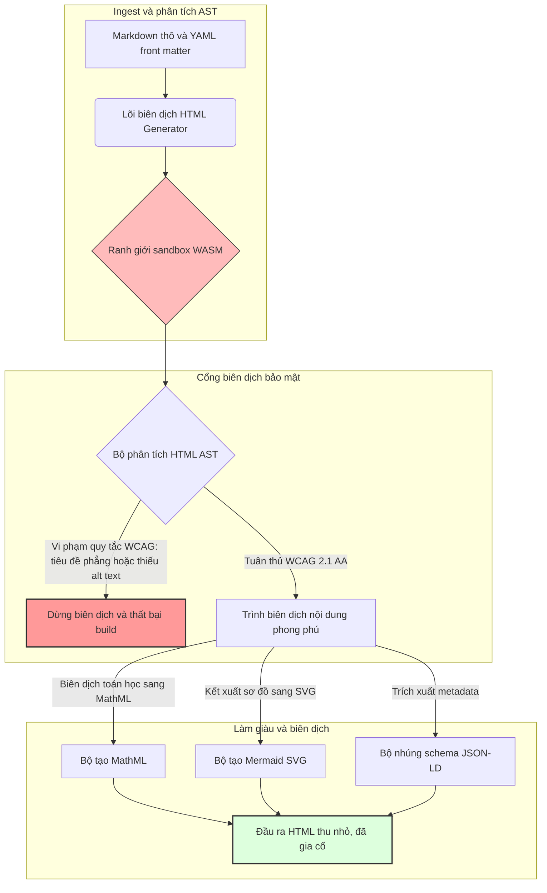

---

# Front Matter (YAML)

author: "contact@sebastienrousseau.com (Sebastien Rousseau)"
banner_alt: "Hình học kiến trúc dưới ánh sáng cấu trúc — biểu trưng cho vai trò của HTML Generator như một pipeline biên dịch Markdown sang HTML được kiểm soát tại giai đoạn biên dịch, phục vụ hạ tầng xuất bản an toàn, tuân thủ chuẩn trợ năng và tối ưu SEO"
banner_height: "1597"
banner_width: "2584"
banner: "https://cloudcdn.pro/api/transform?url=/stocks/images/markus-winkler-IrRbSND5EUc-unsplash.webp&w=1200&format=webp&q=80"
cdn: "https://cloudcdn.pro"
charset: "UTF-8"
cname: "sebastienrousseau.com"
copyright: "© Copyright 2025 - 2026 - Sebastien Rousseau. All rights reserved."
date: "June 20, 2026"
description: "HTML Generator là thư viện Rust thuần túy chuyển đổi Markdown thành HTML tuân thủ WCAG, tối ưu SEO và nhúng JSON-LD — trợ năng-như-mã, hỗ trợ MathML và Mermaid, thực thi trong sandbox WebAssembly để xuất bản doanh nghiệp an toàn."
format-detection: "telephone=no"
hreflang: "vi"
icon: "https://cloudcdn.pro/clients/sebastienrousseau/v1/logos/sebastienrousseau.svg"
id: "https://sebastienrousseau.com/2026-06-20-html-generator-accessible-seo-structured-markdown-rust-2026"
image_alt: "Chân dung đen trắng của Sebastien Rousseau"
image_height: "162"
image_width: "162"
image: "https://cloudcdn.pro/stocks/images/sebastien-rousseau.png"
keywords: "html-generator, Rust Markdown sang HTML, trợ năng như mã, WCAG 2.1 AA, HTML tối ưu SEO, JSON-LD, MathML, Mermaid, WebAssembly, EAA, DORA, ADA Title III, xuất bản trợ năng, phân tích cú pháp sandbox, mã nguồn mở"
language: "vi-VN"
last_reviewed: "2026-06-20"
layout: "report"
locale: "vi_VN"
logo_alt: "Logo của Sebastien Rousseau"
logo_height: "44"
logo_width: "44"
logo: "https://cloudcdn.pro/clients/sebastienrousseau/v1/logos/sebastienrousseau.svg"
menu: ""
measurementID: "G-169G4ET5HQ"
name: "Sebastien Rousseau"
permalink: "https://sebastienrousseau.com/2026-06-20-html-generator-accessible-seo-structured-markdown-rust-2026"
rating: "general"
referrer: "no-referrer"
robots: "index, follow"
schema: "FAQPage, Article"
seo_title: "Trợ Năng Như Mã: Từ Markdown Sang HTML AAA Với Rust Năm 2026"
short_name: "sebastienrousseau"
subtitle: "Chuyển đổi xuất bản web doanh nghiệp, tài liệu sản phẩm và cổng thông tin khách hàng từ tệp văn bản không đạt chuẩn trợ năng thành tài sản kỹ thuật số có cấu trúc cao, tuân thủ quy định và được bảo vệ trong sandbox."
tags: "html-generator, Rust, Markdown, trợ năng, WCAG, SEO, JSON-LD, MathML, Mermaid, WebAssembly, EAA, DORA, ADA, AI-discovery, RAG, mã nguồn mở, hạ tầng ngân hàng"
theme-color: "0, 83, 191"
title: "Chuyển Đổi Markdown Thành HTML Trợ Năng, Tối Ưu SEO và Có Cấu Trúc Với Rust Năm 2026"
url: "https://sebastienrousseau.com/2026-06-20-html-generator-accessible-seo-structured-markdown-rust-2026"
viewport: "width=device-width, initial-scale=1, shrink-to-fit=no"

# RSS - The RSS feed front matter (YAML).
atom_link: "https://sebastienrousseau.com/2026-06-20-html-generator-accessible-seo-structured-markdown-rust-2026/rss.xml"
category: "Technology"
docs: https://validator.w3.org/feed/docs/rss2.html
generator: "Static Site Generator (SSG) (version 0.0.40)"
item_description: "HTML Generator là thư viện Rust thuần túy chuyển đổi Markdown thành HTML tuân thủ WCAG, tối ưu SEO và nhúng JSON-LD — trợ năng-như-mã, hỗ trợ MathML và Mermaid, thực thi trong sandbox WebAssembly để xuất bản doanh nghiệp an toàn."
item_guid: "https://sebastienrousseau.com/2026-06-20-html-generator-accessible-seo-structured-markdown-rust-2026/rss.xml"
item_link: "https://sebastienrousseau.com/2026-06-20-html-generator-accessible-seo-structured-markdown-rust-2026/rss.xml"
item_pub_date: "Sat, 20 Jun 2026 06:06:06 +0000"
item_title: "Chuyển Đổi Markdown Thành HTML Trợ Năng, Tối Ưu SEO và Có Cấu Trúc Với Rust Năm 2026"
last_build_date: "Sat, 20 Jun 2026 06:06:06 +0000"
managing_editor: "contact@sebastienrousseau.com (Sebastien Rousseau)"
pub_date: "Sat, 20 Jun 2026 06:06:06 +0000"
ttl: "60"
type: "article"
webmaster: "contact@sebastienrousseau.com"

# Apple - The Apple front matter (YAML).
apple_mobile_web_app_orientations: "portrait"
apple_touch_icon_sizes: "192x192"
apple-mobile-web-app-capable: "yes"
apple-mobile-web-app-status-bar-inset: "black"
apple-mobile-web-app-status-bar-style: "black-translucent"
apple-mobile-web-app-title: "Markdown Sang HTML AAA Với Rust"
apple-touch-fullscreen: "yes"

# MS Application - The MS Application front matter (YAML).

msapplication-navbutton-color: "0, 83, 191"

# Twitter Card - The Twitter Card front matter (YAML).

twitter_card: "summary_large_image"
twitter_creator: "@wwdseb"
twitter_description: "HTML Generator là thư viện Rust thuần túy chuyển đổi Markdown thành HTML tuân thủ WCAG, tối ưu SEO và nhúng JSON-LD — trợ năng-như-mã, hỗ trợ MathML và Mermaid, thực thi trong sandbox WebAssembly để xuất bản doanh nghiệp an toàn."
twitter_image: "https://cloudcdn.pro/clients/sebastienrousseau/v1/logos/sebastienrousseau.svg"
twitter_image_alt: "Logo của Sebastien Rousseau"
twitter_site: "@wwdseb"
twitter_title: "Trợ Năng Như Mã: Markdown Sang HTML AAA Với Rust"
twitter_url: "https://sebastienrousseau.com/2026-06-20-html-generator-accessible-seo-structured-markdown-rust-2026"

# Humans.txt - The Humans.txt front matter (YAML).
author_website: "https://sebastienrousseau.com"
author_twitter: "@wwdseb"
author_location: "London, UK"
thanks: "Cảm ơn bạn đã đọc!"
site_last_updated: "2026-06-20"
site_standards: "HTML5, CSS3, RSS, Atom, JSON, XML, YAML, Markdown, TOML"
site_components: "Kaishi, Kaishi Builder, Kaishi CLI, Kaishi Templates, Kaishi Themes"
site_software: "Static Site Generator, Rust"

---

# Chuyển Đổi Markdown Thành HTML Trợ Năng, Tối Ưu SEO và Có Cấu Trúc Với Rust Năm 2026

<!-- lead-start -->
<aside class="post-lead" aria-label="Tóm tắt bài viết">

<strong>TL;DR.</strong> HTML Generator là trình biên dịch Markdown sang HTML thuần Rust, thực thi chuẩn WCAG 2.1 AA tại thời điểm biên dịch, tự động nhúng JSON-LD tuân thủ schema, kết xuất MathML và Mermaid SVG nguyên bản, đồng thời cô lập quá trình phân tích cú pháp trong sandbox WebAssembly — biến xuất bản tài liệu thành một mặt phẳng kiểm soát được kiểm định tại biên dịch, đạt chuẩn nghĩa vụ ủy thác về trợ năng, SEO và bảo mật ICT.

<strong>Điểm cốt yếu</strong>

<ul class="post-lead-takeaways">
  <li><strong>Câu trả lời nhanh.</strong> HTML Generator là gì trong một câu?</li>
  <li><strong>Tóm tắt điều hành.</strong> Kết xuất Markdown trông có vẻ đơn giản; đạt chuẩn HTML xuất bản doanh nghiệp là bài toán tuân thủ.</li>
  <li><strong>01. Tại sao trình biên dịch HTML ưu tiên trợ năng quan trọng năm 2026.</strong> EAA và ADA Title III đã nâng trợ năng từ yêu cầu kỹ thuật lên trách nhiệm pháp lý ủy thác.</li>
  <li><strong>02. Góc nhìn kiến trúc HTML Generator 2026.</strong> Pipeline biên dịch đa giai đoạn, kiểm soát tại biên dịch, từ Markdown thô đến đầu ra HTML đã được gia cố.</li>
</ul>

<strong>Đọc thêm:</strong> <a href="https://sebastienrousseau.com/2026-06-18-noyalib-safe-yaml-rust-ai-mcp-financial-infrastructure-2026">Tại Sao YAML Cần Stack Rust An Toàn Hơn Cho AI, MCP và Hạ Tầng Tài Chính Năm 2026</a>, <a href="https://sebastienrousseau.com/2026-06-17-static-site-generator-secure-default-ai-era-publishing-2026">Static Site Generator Bảo Mật Mặc Định Cho Xuất Bản Trong Kỷ Nguyên AI Năm 2026</a>, <a href="https://sebastienrousseau.com/2026-06-11-cloudcdn-open-source-blueprint-ai-native-edge-2026">CloudCDN: Thiết Kế Mã Nguồn Mở Cho Edge AI-Native Năm 2026</a>.

</aside>
<!-- lead-end -->

Năm 2026, nội dung web được tiêu thụ không kém bởi các trình thu thập tìm kiếm AI, công cụ tìm kiếm hỗ trợ LLM và pipeline Retrieval-Augmented Generation (RAG) so với người đọc thông thường. HTML phẳng hoặc bị lỗi cấu trúc cản trở khả năng nhận diện của máy, trong khi việc không tuân thủ các quy định toàn cầu nghiêm ngặt như [Đạo luật Trợ năng Châu Âu (EAA)](https://www.accessibility-act.eu/) và [ADA Title III của Hoa Kỳ](https://www.ada.gov/topics/title-iii/) hiện đã là trách nhiệm dân sự rõ ràng. [HTML Generator](https://github.com/sebastienrousseau/html-generator) là thư viện Rust hiệu năng cao được thiết kế để lấp những lỗ hổng đó — tại trình biên dịch, không phải bằng bản vá sau triển khai.

## Câu trả lời nhanh

**HTML Generator là gì trong một câu?** HTML Generator là trình biên dịch Markdown sang HTML thuần Rust, mã nguồn mở, thực thi chuẩn [WCAG 2.1 AA](https://www.w3.org/TR/WCAG21/) tại thời điểm biên dịch, tự động tạo các mốc ngữ nghĩa và thuộc tính ARIA, nhúng metadata [JSON-LD](https://json-ld.org/) tuân thủ schema từ YAML front matter, kết xuất sơ đồ Mermaid và toán học sang SVG trợ năng và MathML, đồng thời chạy trong sandbox [WebAssembly](https://webassembly.org/) — biến xuất bản doanh nghiệp thành mặt phẳng kiểm soát được kiểm định tại biên dịch, đạt chuẩn nghĩa vụ ủy thác.

## Tóm tắt điều hành

Kết xuất Markdown trông có vẻ đơn giản. HTML đạt chuẩn xuất bản doanh nghiệp là bài toán tuân thủ. Tháng 6 năm 2026, mọi điểm tiếp xúc doanh nghiệp — cổng quan hệ nhà đầu tư, hồ sơ quy định, tài liệu khách hàng, tài liệu tham chiếu API, kho marketing — đều được phân tích bởi cả người và máy. Hai áp lực va chạm trên mỗi trang: [EAA](https://www.accessibility-act.eu/) và [ADA Title III](https://www.ada.gov/topics/title-iii/) biến trợ năng thành rủi ro pháp lý cấp hội đồng quản trị, trong khi ingestion AI và pipeline RAG ưu tiên đầu ra có cấu trúc, có thể đọc bằng máy. Các thư viện Markdown tiêu chuẩn tạo ra HTML phẳng, không vượt qua được cả hai cổng kiểm soát này. HTML Generator xử lý việc tạo tài liệu như một pipeline được kiểm định tại biên dịch: xác thực WCAG là lỗi biên dịch, JSON-LD đến từ YAML front matter mà không cần đánh dấu thủ công, MathML và Mermaid kết xuất có trợ năng, và toàn bộ engine được phát hành dưới dạng đích WebAssembly để phân tích tài liệu không tin cậy luôn được sandbox khỏi máy chủ.

## Điểm cốt yếu

- **Trợ năng-như-mã là tiêu chuẩn mới.** EAA bắt buộc trợ năng cho các dịch vụ kỹ thuật số tiêu dùng. HTML Generator đánh giá cây tài liệu tại thời điểm biên dịch, tự động tạo các mốc ngữ nghĩa và thuộc tính ARIA — ít sửa lỗi sau triển khai hơn, ít ngân sách khắc phục hơn, không có alt-text thiếu nào xuất hiện trên môi trường production.
- **Dữ liệu có cấu trúc cho khám phá AI.** Tìm kiếm hiện đại và RAG phụ thuộc vào metadata có thể đọc bằng máy. Trình biên dịch phân tích YAML front matter và nhúng [JSON-LD tuân thủ Schema.org](https://schema.org/) trực tiếp vào phần head tài liệu, giúp nội dung được diễn giải đầy đủ bởi [Google Rich Results](https://developers.google.com/search/docs/appearance/structured-data/intro-structured-data), [Bing Webmaster](https://www.bing.com/webmasters) và các trình thu thập hỗ trợ LLM.
- **Xuất sắc trong nội dung kỹ thuật.** Xuất bản kỹ thuật không phải văn bản phẳng. HTML Generator biên dịch phần mở rộng toán học Markdown thô thành [MathML](https://www.w3.org/Math/) trợ năng, và kết xuất sơ đồ [Mermaid.js](https://mermaid.js.org/) sang SVG responsive — cả hai đều bảo toàn cấu trúc tuân thủ WCAG thay vì giảm xuống hình ảnh mờ đục.
- **Sandbox WebAssembly.** Phân tích cú pháp Markdown không tin cậy là rủi ro bảo mật. Bằng cách nhắm đích [WASM](https://webassembly.org/), HTML Generator thực thi trong sandbox cô lập, ngăn chặn việc thực thi mã tùy ý và bảo vệ hệ thống máy chủ — đáp ứng trực tiếp nghĩa vụ bảo mật ICT theo [DORA Article 6](https://eur-lex.europa.eu/legal-content/EN/TXT/?uri=CELEX%3A32022R2554).
- **Bảo vệ nghĩa vụ ủy thác cho hội đồng quản trị.** Vi phạm kỹ thuật đã leo thang vào phòng họp hội đồng. Chuẩn hóa trên engine HTML được kiểm định tại biên dịch bảo vệ giám đốc và ban lãnh đạo cấp cao khỏi trách nhiệm dân sự và pháp lý cá nhân theo DORA, EAA và ADA Title III.

**Đọc thêm:** [Tại Sao YAML Cần Stack Rust An Toàn Hơn Cho AI, MCP và Hạ Tầng Tài Chính Năm 2026](https://sebastienrousseau.com/2026-06-18-noyalib-safe-yaml-rust-ai-mcp-financial-infrastructure-2026/), [Static Site Generator Bảo Mật Mặc Định Cho Xuất Bản Trong Kỷ Nguyên AI Năm 2026](https://sebastienrousseau.com/2026-06-17-static-site-generator-secure-default-ai-era-publishing-2026/), [CloudCDN: Thiết Kế Mã Nguồn Mở Cho Edge AI-Native Năm 2026](https://sebastienrousseau.com/2026-06-11-cloudcdn-open-source-blueprint-ai-native-edge-2026/).

## 01. Tại Sao Trình Biên Dịch HTML Ưu Tiên Trợ Năng Quan Trọng Năm 2026

Kho web doanh nghiệp, thư viện tài liệu và trung tâm hỗ trợ sản phẩm là các điểm tiếp xúc kỹ thuật số cốt yếu. Hiện chúng chịu hai áp lực cường độ cao, giao nhau.

Áp lực thứ nhất là **ingestion AI và khả năng khám phá**. Nội dung ngày càng được xử lý bởi các mô hình ngôn ngữ lớn và pipeline Retrieval-Augmented Generation. HTML phẳng hoặc bị lỗi cấu trúc gây nhầm lẫn cho trình thu thập, khiến nghiên cứu và tài liệu doanh nghiệp trở nên vô hình với các mô hình tìm kiếm hiện đại — bao gồm [Google Search Generative Experience](https://blog.google/products/search/generative-ai-search/), duyệt web [ChatGPT](https://chat.openai.com/) và các agent RAG doanh nghiệp.

Áp lực thứ hai là **luật trợ năng toàn cầu nghiêm ngặt**. Theo [Đạo luật Trợ năng Châu Âu](https://www.accessibility-act.eu/) (áp dụng đầy đủ từ tháng 6 năm 2025) và [ADA Title III của Hoa Kỳ](https://www.ada.gov/topics/title-iii/), các nền tảng xuất bản doanh nghiệp phải đảm bảo trợ năng kỹ thuật số hoàn chỉnh. Không đáp ứng [WCAG 2.1 AA](https://www.w3.org/TR/WCAG21/) không còn là lỗi kỹ thuật; đó là trách nhiệm dân sự và pháp lý đã tạo ra các khoản giải quyết hàng triệu đô la.

[HTML Generator](https://github.com/sebastienrousseau/html-generator) giải quyết cả hai áp lực trực tiếp. Đây là thư viện Rust thread-safe được thiết kế để chuyển đổi Markdown thành HTML trợ năng, tối ưu SEO và có cấu trúc. Bằng cách xử lý việc tạo tài liệu như một pipeline được kiểm định tại biên dịch, engine mang lại **Return on Resilience (RoR)** cao — bảo vệ bảng cân đối kế toán khỏi kiện tụng về trợ năng trong khi tối đa hóa khả năng đọc bằng máy cho khám phá AI.

## 02. Góc Nhìn Kiến Trúc HTML Generator 2026

Framework được thiết kế như một pipeline biên dịch an toàn, đa giai đoạn, chuyển đổi văn bản Markdown thô thành tài sản tĩnh được xác minh ở mức độ cao về trợ năng.

### Bảng 1: Các lớp kiến trúc HTML Generator và giảm thiểu rủi ro

| Lớp | Quyết định thiết kế | Lý do quan trọng | Rủi ro nếu xử lý sai |
| ---- | ---- | ---- | ---- |
| **Lớp đầu vào** | Bộ phân tích Markdown và YAML front matter | Gặp người viết ở điểm họ đang dùng; tách nội dung văn xuôi khỏi metadata cấu trúc. | Metadata không nhất quán, sitemap bị hỏng, lỗ hổng lập chỉ mục. |
| **Lớp cấu trúc** | Mục lục tự động và các mốc ngữ nghĩa với thẻ ARIA | Tạo cây tài liệu có thể điều hướng, trợ năng theo cấu trúc. | HTML phẳng phá vỡ trình đọc màn hình và vi phạm WCAG. |
| **Lớp nội dung phong phú** | Kết xuất MathML và Mermaid.js SVG nguyên bản | Biên dịch công thức và sơ đồ sang SVG và MathML trợ năng. | Độ trễ kết xuất JS phía client và đầu ra công nghệ hỗ trợ bị hỏng. |
| **Lớp SEO và dữ liệu** | Tạo JSON-LD và metadata có cấu trúc tích hợp | Nhúng JSON-LD tuân thủ [Schema.org](https://schema.org/) trực tiếp vào phần head. | Công cụ tìm kiếm và trình thu thập AI đọc sai tác giả, ngữ cảnh, giấy phép. |
| **Lớp runtime** | Trình biên dịch Rust nguyên bản với đích WebAssembly | Cho phép thực thi sandbox an toàn trên máy chủ, node edge và trình duyệt. | Thực thi mã tùy ý khi phân tích Markdown không tin cậy. |

## 03. Các Tín Hiệu Bảo Mật Web và Trợ Năng Chính

Để xác minh rằng các tài sản xuất bản hướng đến công chúng đáp ứng các cuộc kiểm tra quy định và bảo mật hiện đại, các giám đốc công nghệ cấp cao phải theo dõi các chỉ số cụ thể, có thể định lượng.

### Bảng 2: Tín hiệu bảo mật web và trợ năng

| Tín hiệu | Chỉ số / chuẩn vận hành | Tham chiếu EAA / DORA / W3C | Triển khai kỹ thuật |
| ---- | ---- | ---- | ---- |
| **Tuân thủ trợ năng** | 100% trang được biên dịch xác thực theo quy tắc WCAG 2.1 AA. | [EAA](https://www.accessibility-act.eu/) và [ADA Title III](https://www.ada.gov/topics/title-iii/) | Bộ phân tích HTML tại thời điểm biên dịch đánh giá thẻ alt hình ảnh và các mốc ngữ nghĩa. |
| **Sandbox thực thi WASM** | 100% đầu vào Markdown không tin cậy được biên dịch trong runtime WebAssembly cô lập. | [DORA Article 6](https://eur-lex.europa.eu/legal-content/EN/TXT/?uri=CELEX%3A32022R2554) (bảo mật ICT) | Cô lập môi trường phân tích khỏi máy chủ. |
| **Độ phủ metadata có cấu trúc** | 100% bài viết được xuất bản nhúng tiêu đề JSON-LD hợp lệ, tuân thủ schema. | Thông số kỹ thuật [Schema.org](https://schema.org/) | Phân tích front matter tự động và chuyển đổi sang đối tượng JSON-LD. |
| **Thông lượng biên dịch** | Mục tiêu trang/giây trên 10.000 trên phần cứng thông thường. | Return on Resilience (RoR) | Trình biên dịch AST Rust song song hóa cao. |
| **Xác minh rich snippet** | Không có lỗi phân tích trên [Google Rich Results](https://search.google.com/test/rich-results) và chạy [Schema validator](https://validator.schema.org/). | Hướng dẫn Google Search | Xác thực cấu trúc JSON-LD được tạo ra trong pipeline biên dịch. |

## 04. Huyền Thoại Về Kết Xuất Markdown Đơn Giản

Một quan niệm sai lầm phổ biến trong giới quản lý công nghệ là chuyển đổi Markdown sang HTML là một bài toán thay thế văn bản đơn giản. Nhiều thư viện tiêu chuẩn dịch định dạng Markdown thành HTML phẳng, không có cấu trúc. Đầu ra hiển thị cho người đọc có thị lực trong trình duyệt, nhưng đó là bẫy tuân thủ.

HTML phẳng thường thiếu ba điều.

1. **Phân cấp tiêu đề đúng.** Markdown tiêu chuẩn không bắt buộc thứ tự tiêu đề. Nhảy từ `<h1>` sang `<h4>` vi phạm WCAG 2.1 AA và phá vỡ điều hướng tài liệu cho trình đọc màn hình.
2. **Ngữ nghĩa bảng rõ ràng.** Bảng Markdown tiêu chuẩn hiếm khi được kết xuất với phạm vi `<th>` và thuộc tính `<tbody>` đúng theo yêu cầu phân tích trợ năng.
3. **Metadata có thể đọc bằng máy.** HTML tiêu chuẩn thiếu các hook JSON-LD mà các nền tảng tìm kiếm AI hiện đại và hệ thống ingestion RAG phụ thuộc vào.

HTML Generator giải quyết điều này bằng cách phân tích Markdown thành **Abstract Syntax Tree (AST)**. Engine đánh giá cấu trúc tài liệu trước khi phát ra HTML, xác thực lồng ghép tiêu đề, nhúng các thuộc tính ARIA phù hợp và khẳng định rằng mọi tài sản phương tiện đều mang văn bản thay thế — biến trợ năng từ kiểm tra thủ công thành bất biến được đảm bảo tại thời điểm biên dịch.

## 05. Thiết Kế Pipeline Biên Dịch Trợ Năng Như Mã

Để ngăn các tài sản không trợ năng hoặc không được lập chỉ mục xuất hiện trên môi trường public, trợ năng phải là cổng biên dịch nghiêm ngặt. Pipeline sau đây cho thấy HTML Generator đánh giá Markdown như thế nào, chạy xác thực cô lập WebAssembly và phát ra HTML có cấu trúc đã được gia cố.

## 06. Cẩm Nang Phòng Họp Hội Đồng và Trách Nhiệm Ủy Thác

Tuân thủ trợ năng và bảo mật web hiện đại là các vấn đề phòng họp hội đồng không thể thương lượng. Ban lãnh đạo cấp cao phải tiếp cận hạ tầng xuất bản qua lăng kính rủi ro pháp lý, bảo toàn tài chính và mức độ phơi nhiễm quy định.

- **Đạo luật Trợ năng Châu Âu (EAA).** Áp đặt các nghĩa vụ tuân thủ ràng buộc pháp lý trực tiếp lên các cổng thông tin kỹ thuật số công cộng và tư nhân. Không tuân thủ có thể dẫn đến hình phạt tài chính nghiêm trọng, kiện tụng dân sự và thu hồi ngay lập tức tài sản khỏi thị trường EU. Bằng cách tích hợp trợ năng-như-mã, hội đồng có thể chứng nhận rằng mã không tuân thủ không thể xuất bản — chuyển khắc phục phản ứng thành lá chắn pháp lý cấu trúc.
- **DORA Article 6 (Môi trường ICT An toàn).** Thiết lập các quy tắc nghiêm ngặt cho bảo mật môi trường ICT. Bằng cách cô lập biên dịch Markdown trong sandbox WebAssembly, các tổ chức đảm bảo rằng phân tích tài liệu do khách hàng tải lên hoặc luồng từ đối tác không thể phơi bày máy chủ với thực thi mã tùy ý, bảo vệ các cổng ngân hàng quan trọng.
- **Giảm chi phí kiểm tra tuân thủ.** Tuân thủ trợ năng truyền thống dựa vào các cuộc kiểm tra sau triển khai tốn kém, hồi tố — hàng chục nghìn đô la hàng năm mỗi site. Triển khai xác thực WCAG như một khối tại thời điểm biên dịch loại bỏ các chi phí hồi tố đó, chuyển ngân sách tuân thủ từ phòng thủ sang đổi mới.

## 07. Ý Nghĩa Theo Loại Ngân Hàng / Doanh Nghiệp

### Ngân hàng Có Tầm Quan Trọng Hệ Thống Toàn Cầu (G-SIB)

Các G-SIB vận hành kho web công cộng đa ngôn ngữ khổng lồ, xuất bản hàng nghìn báo cáo nghiên cứu, công bố quy định và tài liệu quan hệ nhà đầu tư trên nhiều khu vực pháp lý. Thách thức của họ là quy mô và tương đương đa ngôn ngữ. Đích WebAssembly và engine Rust thông lượng cao của HTML Generator cho phép các thư viện nghiên cứu được bản địa hóa quy mô lớn được cập nhật, biên dịch và triển khai toàn cầu trong vài giây — không có độ trễ kết xuất hay hồi quy trợ năng.

### Ngân hàng Giao dịch và Doanh nghiệp

Đối với ngân hàng giao dịch, các cổng khách hàng, trung tâm tài liệu và hướng dẫn API cho nhà phát triển là các điểm tiếp xúc kỹ thuật số quan trọng. Biên dịch các tài sản đó qua HTML Generator có nghĩa là các kênh hướng đến khách hàng không có phơi nhiễm XSS, không có vector chiếm quyền phụ thuộc và không có thiếu hụt trợ năng — bảo toàn niềm tin tổ chức và giảm bề mặt kiện tụng.

### Ngân hàng Khu vực và Fintech

Ngân hàng khu vực và fintech linh hoạt cạnh tranh về trải nghiệm kỹ thuật số mà không có ngân sách kỹ thuật của G-SIB. HTML Generator cung cấp cho các đội ngũ đó pipeline xuất bản cấp doanh nghiệp ngay từ đầu, cho phép các kho nhỏ hơn xuất bản tài sản trợ năng, tối ưu SEO và được sandbox, chịu được sự kiểm tra từ cả cơ quan quản lý và khách hàng doanh nghiệp tiềm năng.

## 08. Lộ Trình Hạ Tầng Xuất Bản

Kho web hướng đến công chúng của doanh nghiệp là thành phần cốt lõi của khả năng phục hồi hoạt động. Dựa vào các engine web dựa trên cơ sở dữ liệu động, chậm, dễ bị tấn công — hoặc tài sản tĩnh chưa ký — là rủi ro kinh doanh không thể chấp nhận được.

Để bảo mật các điểm tiếp xúc kỹ thuật số công cộng và bảo vệ bảng cân đối kế toán khỏi kiện tụng về trợ năng, các giám đốc công nghệ và bảo mật cấp cao nên thực hiện lộ trình rõ ràng.

1. **Chuyển đổi sang kiến trúc tĩnh.** Loại bỏ dần các nền tảng CMS động cũ cho kho nghiên cứu, marketing và tài liệu. Chuyển nội dung vào các pipeline được kiểm định tại biên dịch như HTML Generator.
2. **Thực thi trợ năng tại thời điểm biên dịch.** Triển khai trợ năng-như-mã. Tự động thất bại pipeline biên dịch với bất kỳ vi phạm WCAG 2.1 AA nào.
3. **Cô lập phân tích trong WebAssembly.** Sandbox mọi phân tích tài liệu và nội dung trong runtime WASM để đầu vào không tin cậy không bao giờ chạm vào hệ thống máy chủ.
4. **Nhúng metadata JSON-LD phong phú.** Đảm bảo mọi tài sản được xuất bản mang tiêu đề JSON-LD tuân thủ schema để tối đa hóa khả năng khám phá AI.

## 09. Câu Hỏi Thường Gặp

**HTML Generator thực thi trợ năng như thế nào?**

Engine phân tích HTML Abstract Syntax Tree được tạo ra tại thời điểm biên dịch, đánh giá tài liệu theo quy tắc [WCAG 2.1 AA](https://www.w3.org/TR/WCAG21/). Nếu một quy tắc bị vi phạm — thiếu thuộc tính alt, bỏ qua tiêu đề, điều khiển form không có nhãn — trình biên dịch dừng build, xử lý trợ năng như một bất biến tại thời điểm biên dịch thay vì nhiệm vụ kiểm tra sau triển khai.

**Tại sao cô lập WebAssembly quan trọng?**

[WebAssembly](https://webassembly.org/) cho phép engine phân tích Markdown thực thi trong sandbox cô lập, tách biệt khỏi máy chủ. Ngay cả khi một tác nhân thù địch tải lên tài liệu Markdown được chế tạo để khai thác lỗ hổng bộ phân tích, quá trình thực thi bị bẫy — bảo vệ hệ thống máy chủ và thỏa mãn nghĩa vụ bảo mật ICT theo DORA Article 6.

**JSON-LD mang lại lợi ích gì cho khả năng khám phá tìm kiếm năm 2026?**

[JSON-LD](https://json-ld.org/) cung cấp metadata có cấu trúc, có thể đọc bằng máy trong phần head tài liệu. [Google Rich Results](https://developers.google.com/search/docs/appearance/structured-data/intro-structured-data), trình thu thập Bing và các agent tìm kiếm hỗ trợ LLM xác định tác giả, giấy phép, ngày xuất bản và ngữ cảnh ngữ nghĩa ngay lập tức — bỏ qua sự mơ hồ của HTML tiêu chuẩn và tăng diện tích bề mặt trong khám phá dựa trên AI.

**Đối tượng mục tiêu của HTML Generator là ai?**

Người xây dựng trang web tĩnh, đội ngũ tài liệu, người viết kỹ thuật, nhà phát triển Rust và kỹ sư nền tảng xuất bản các kho quan trọng về trợ năng hoặc đối diện với cơ quan quản lý. Đây cũng là lớp xử lý nội dung khả thi trong các pipeline xuất bản an toàn lớn hơn như [Static Site Generator (SSG)](https://github.com/sebastienrousseau/static-site-generator).

## 10. Tài Liệu Tham Khảo

- World Wide Web Consortium (W3C), 2024. [Web Content Accessibility Guidelines (WCAG) 2.1 ⧉](https://www.w3.org/TR/WCAG21/ "Hướng dẫn Trợ năng Nội dung Web 2.1").
- Schema.org, 2026. [Thông số kỹ thuật dữ liệu có cấu trúc Schema.org ⧉](https://schema.org/ "Thông số kỹ thuật dữ liệu có cấu trúc Schema.org").
- European Parliament and Council of the European Union, 2022. [Regulation (EU) 2022/2554 on digital operational resilience for the financial sector (DORA) ⧉](https://eur-lex.europa.eu/legal-content/EN/TXT/?uri=CELEX%3A32022R2554 "Quy định DORA").
- European Commission, 2025. [Đạo luật Trợ năng Châu Âu ⧉](https://www.accessibility-act.eu/ "Đạo luật Trợ năng Châu Âu").
- US Department of Justice, 2024. [ADA Title III ⧉](https://www.ada.gov/topics/title-iii/ "ADA Title III").
- WebAssembly Community Group, 2026. [Thông số kỹ thuật WebAssembly ⧉](https://webassembly.org/ "WebAssembly").
- GitHub, 2026. [Kho lưu trữ HTML Generator ⧉](https://github.com/sebastienrousseau/html-generator "Kho lưu trữ mã nguồn mở HTML Generator").

<!-- enrich-start -->
<aside class="author-card" aria-label="Về tác giả"><strong class="author-card-name"><a href="/about/index.html">Sebastien Rousseau</a></strong>Chuyên gia công nghệ ngân hàng cấp cao viết về AI ứng dụng, hạ tầng thanh toán, tiền mã hóa token hóa, ISO 20022, bảo mật hậu lượng tử, dịch vụ tài chính cloud-native, hạ tầng mã nguồn mở và thị trường kỹ thuật số được quản lý.20+ năm kinh nghiệm tại HSBC Commercial &amp; Investment Bank, PayPal, Barclays, Shazam, AKQA, Virgin Group. <a href="/about/index.html">Hồ sơ đầy đủ</a> &middot; <a href="https://www.linkedin.com/in/sebastienrousseau/" rel="external noopener">LinkedIn</a> &middot; <a href="https://github.com/sebastienrousseau" rel="external noopener">GitHub</a></aside>

Lần xem xét cuối cùng <time datetime="2026-06-20">2026-06-20</time>.

<!-- enrich-end -->
