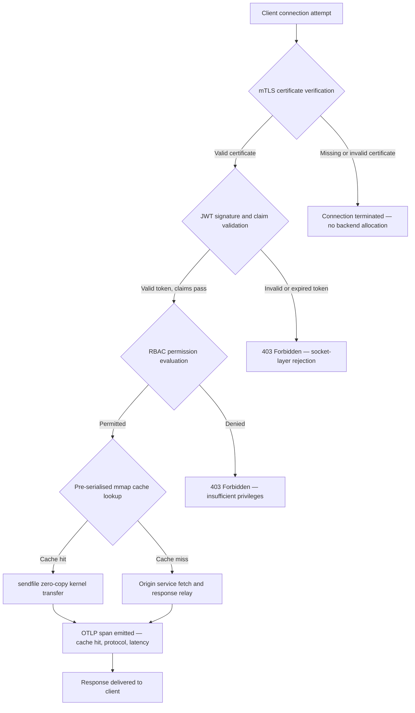

---

# Front Matter (YAML)

author: "contact@sebastienrousseau.com (Sebastien Rousseau)"
banner_alt: "Cảnh quan thành phố trừu tượng trên bảng mạch vào ban đêm — trực quan hóa cạnh ngân hàng nơi các truyền tải zero-copy cấp nhân, bắt tay mTLS và xác thực JWT hội tụ trong một tệp nhị phân liên kết tĩnh duy nhất"
banner_height: "1597"
banner_width: "2584"
banner: "https://cloudcdn.pro/stocks/images/bit-cloud-GlqbGLCPnQ4.webp"
cdn: "https://cloudcdn.pro"
charset: "UTF-8"
cname: "sebastienrousseau.com"
copyright: "© Copyright 2025 - 2026 - Sebastien Rousseau. All rights reserved."
date: "June 20, 2026"
description: "http-handle là một tệp nhị phân Rust liên kết tĩnh cung cấp 180.000 yêu cầu mỗi giây tại cạnh ngân hàng với không có phụ thuộc thời gian chạy, xác thực mTLS và JWT tích hợp, HTTP/2 và HTTP/3 được đàm phán qua ALPN và khả năng quan sát OTLP — đóng các khoảng trống bảo mật và khả năng phục hồi mà Nginx và Envoy để lại."
format-detection: "telephone=no"
hreflang: "vi"
icon: "https://cloudcdn.pro/clients/sebastienrousseau/v1/logos/sebastienrousseau.svg"
id: "https://sebastienrousseau.com/2026-06-20-http-handle-zero-dependency-edge-ingress-banking-rust-2026"
image_alt: "Ảnh chân dung đen trắng của Sebastien Rousseau"
image_height: "162"
image_width: "162"
image: "https://cloudcdn.pro/stocks/images/sebastienrousseau.webp"
keywords: "http-handle, Rust edge ingress, proxy không phụ thuộc, cơ sở hạ tầng ngân hàng, mTLS JWT, sendfile zero-copy, ALPN HTTP3, tuân thủ DORA, Basel III, khả năng quan sát OTLP, nhị phân tĩnh, ARM64 ngân hàng, zero trust ngân hàng, ingress nhẹ, bảo mật ngân hàng Rust"
language: "vi-VN"
last_reviewed: "2026-06-20"
layout: "report"
locale: "vi_VN"
logo_alt: "Logo của Sebastien Rousseau"
logo_height: "44"
logo_width: "44"
logo: "https://cloudcdn.pro/clients/sebastienrousseau/v1/logos/sebastienrousseau.svg"
menu: ""
measurementID: "G-169G4ET5HQ"
name: "Sebastien Rousseau"
permalink: "https://sebastienrousseau.com/2026-06-20-http-handle-zero-dependency-edge-ingress-banking-rust-2026"
rating: "general"
referrer: "no-referrer"
robots: "index, follow"
schema: "FAQPage, Article"
seo_title: "http-handle: Rust Ingress Không Phụ Thuộc cho Ngân Hàng tại 180k yêu cầu/s"
short_name: "sebastienrousseau"
subtitle: "Cách một tệp nhị phân Rust liên kết tĩnh duy nhất cung cấp 180.000 yêu cầu mỗi giây với mTLS, JWT và ALPN tại cạnh ngân hàng — và ý nghĩa của nó đối với việc tuân thủ DORA và Basel III."
tags: "http-handle, Rust, banking, edge-ingress, mTLS, JWT, ALPN, HTTP3, DORA, Basel-III, zero-copy, sendfile, ARM64, zero-trust, OTLP, observability, open-source, infrastructure"
theme-color: "0, 83, 191"
title: "http-handle: Ingress Edge Hiệu Suất Cao Không Phụ Thuộc cho Ngân Hàng năm 2026"
url: "https://sebastienrousseau.com/2026-06-20-http-handle-zero-dependency-edge-ingress-banking-rust-2026"
viewport: "width=device-width, initial-scale=1, shrink-to-fit=no"

# RSS - The RSS feed front matter (YAML).
atom_link: "https://sebastienrousseau.com/2026-06-20-http-handle-zero-dependency-edge-ingress-banking-rust-2026/rss.xml"
category: "Technology"
docs: https://validator.w3.org/feed/docs/rss2.html
generator: "Static Site Generator (SSG) (version 0.0.40)"
item_description: "http-handle là một tệp nhị phân Rust liên kết tĩnh cung cấp 180.000 yêu cầu mỗi giây tại cạnh ngân hàng với không có phụ thuộc thời gian chạy, xác thực mTLS và JWT tích hợp, HTTP/2 và HTTP/3 được đàm phán qua ALPN và khả năng quan sát OTLP — đóng các khoảng trống bảo mật và khả năng phục hồi mà Nginx và Envoy để lại."
item_guid: "https://sebastienrousseau.com/2026-06-20-http-handle-zero-dependency-edge-ingress-banking-rust-2026/rss.xml"
item_link: "https://sebastienrousseau.com/2026-06-20-http-handle-zero-dependency-edge-ingress-banking-rust-2026/rss.xml"
item_pub_date: "Sat, 20 Jun 2026 07:07:07 +0000"
item_title: "http-handle: Ingress Edge Hiệu Suất Cao Không Phụ Thuộc cho Ngân Hàng năm 2026"
last_build_date: "Sat, 20 Jun 2026 07:07:07 +0000"
managing_editor: "contact@sebastienrousseau.com (Sebastien Rousseau)"
pub_date: "Sat, 20 Jun 2026 07:07:07 +0000"
ttl: "60"
type: "article"
webmaster: "contact@sebastienrousseau.com"

# Apple - The Apple front matter (YAML).
apple_mobile_web_app_orientations: "portrait"
apple_touch_icon_sizes: "192x192"
apple-mobile-web-app-capable: "yes"
apple-mobile-web-app-status-bar-inset: "black"
apple-mobile-web-app-status-bar-style: "black-translucent"
apple-mobile-web-app-title: "Cạnh Ngân Hàng Không Phụ Thuộc"
apple-touch-fullscreen: "yes"

# MS Application - The MS Application front matter (YAML).

msapplication-navbutton-color: "0, 83, 191"

# Twitter Card - The Twitter Card front matter (YAML).

twitter_card: "summary_large_image"
twitter_creator: "@wwdseb"
twitter_description: "http-handle là một tệp nhị phân Rust liên kết tĩnh cung cấp 180.000 yêu cầu mỗi giây tại cạnh ngân hàng với không có phụ thuộc thời gian chạy, mTLS, JWT và khả năng quan sát OTLP."
twitter_image: "https://cloudcdn.pro/clients/sebastienrousseau/v1/logos/sebastienrousseau.svg"
twitter_image_alt: "Logo of Sebastien Rousseau"
twitter_site: "@wwdseb"
twitter_title: "http-handle: Rust Ingress Không Phụ Thuộc cho Ngân Hàng tại 180k yêu cầu/s"
twitter_url: "https://sebastienrousseau.com/2026-06-20-http-handle-zero-dependency-edge-ingress-banking-rust-2026"

# Humans.txt - The Humans.txt front matter (YAML).
author_website: "https://sebastienrousseau.com"
author_twitter: "@wwdseb"
author_location: "London, UK"
thanks: "Thanks for reading!"
site_last_updated: "2026-06-20"
site_standards: "HTML5, CSS3, RSS, Atom, JSON, XML, YAML, Markdown, TOML"
site_components: "Kaishi, Kaishi Builder, Kaishi CLI, Kaishi Templates, Kaishi Themes"
site_software: "Static Site Generator, Rust"

---

# http-handle: Ingress Edge Hiệu Suất Cao Không Phụ Thuộc cho Ngân Hàng năm 2026

<!-- lead-start -->
<aside class="post-lead" aria-label="Tóm tắt bài viết">

<strong>TL;DR.</strong> http-handle là một tệp nhị phân Rust nguồn mở, liên kết tĩnh, thay thế Nginx và Envoy tại cạnh ngân hàng. Nó cung cấp 180.000 yêu cầu mỗi giây trên các nút ARM64 qua truyền tải zero-copy <code>sendfile(2)</code> của Linux, thực thi mTLS và xác thực JWT tại lớp socket mạng trước khi bất kỳ mã ứng dụng nào chạy, tự động đàm phán HTTP/2 và HTTP/3 qua ALPN và phát ra chỉ số OpenTelemetry tự nhiên — tất cả với không có phụ thuộc thời gian chạy ngoài <code>libc</code>.

<strong>Điểm mấu chốt</strong>

<ul class="post-lead-takeaways">
  <li><strong>Vấn đề proxy nặng.</strong> Nginx và Envoy mang theo cây phụ thuộc mở rộng bề mặt CVE và làm phức tạp các chu kỳ khắc phục rủi ro ICT của DORA.</li>
  <li><strong>Hiệu suất zero-copy ở quy mô lớn.</strong> Các khối bộ nhớ đệm mmap được tuần tự hóa trước và truyền tải nhân <code>sendfile(2)</code> duy trì 180.000 yêu cầu/s trên ARM64 với chi phí proxy dưới mili giây.</li>
  <li><strong>Bảo mật tại socket, không phải ứng dụng.</strong> Xác minh chứng chỉ máy khách mTLS, xác thực JWT và đánh giá RBAC hoàn thành trước khi bất kỳ tài nguyên backend nào được phân bổ cho yêu cầu.</li>
  <li><strong>Tuân thủ quy định tích hợp sẵn.</strong> Bề mặt tấn công giảm và triển khai nhị phân đơn có thể kiểm tra trực tiếp giải quyết Điều 5 và 6 DORA, rủi ro vận hành Basel III và chuỗi trách nhiệm SM&CR.</li>
</ul>

<strong>Đọc thêm:</strong> <a href="https://sebastienrousseau.com/2026-06-18-noyalib-safe-yaml-rust-ai-mcp-financial-infrastructure-2026">Tại Sao YAML Cần Stack Rust An Toàn Hơn cho AI, MCP và Cơ Sở Hạ Tầng Tài Chính năm 2026</a>, <a href="https://sebastienrousseau.com/2026-06-11-cloudcdn-open-source-blueprint-ai-native-edge-2026">CloudCDN: Bản Thiết Kế Nguồn Mở cho AI-Native Edge năm 2026</a>, <a href="https://sebastienrousseau.com/2026-05-16-best-cloud-infrastructure-architecture-2026">Kiến Trúc Cơ Sở Hạ Tầng Đám Mây Tốt Nhất cho Ngân Hàng và Tổ Chức Tài Chính năm 2026</a>.

</aside>
<!-- lead-end -->

Cạnh ngân hàng có vấn đề phụ thuộc. Mỗi phiên bản Nginx hoặc Envoy định tuyến lưu lượng giữa máy khách và dịch vụ ngân hàng cốt lõi mang theo cây phụ thuộc: bản dựng OpenSSL, module Lua, thư viện gRPC và các lớp container — mỗi cái là CVE tiềm năng, mỗi cái yêu cầu chu kỳ vá lỗi riêng, mỗi cái thêm biến thiên độ trễ làm phức tạp việc đo lường SLA. Theo [Đạo luật Khả năng Phục hồi Vận hành Kỹ thuật số (DORA)](https://eur-lex.europa.eu/eli/reg/2022/2554/oj), sự phức tạp đó giờ là trách nhiệm pháp lý không kém phần vận hành.

[http-handle](https://github.com/sebastienrousseau/http-handle) áp dụng cách tiếp cận khác. Đây là tệp nhị phân Rust đơn, liên kết tĩnh với không có phụ thuộc thời gian chạy ngoài `libc`. Nó cung cấp 180.000 yêu cầu mỗi giây trên các nút ARM64, thực thi TLS lẫn nhau và xác thực JWT tại lớp socket mạng, và tự động đàm phán HTTP/2 và HTTP/3 — tất cả trong phạm vi triển khai dưới 20 MB RAM.

## Câu trả lời nhanh

**http-handle là gì trong một câu?** http-handle là tệp nhị phân Rust nguồn mở, liên kết tĩnh, thay thế các container proxy nặng tại cạnh ngân hàng, cung cấp 180.000 yêu cầu/s trên ARM64 qua truyền tải nhân zero-copy `sendfile(2)` của Linux, thực thi mTLS, JWT và RBAC tại lớp socket trước khi bất kỳ tài nguyên backend nào được chạm đến và phát ra chỉ số [OpenTelemetry](https://opentelemetry.io/) tự nhiên — với không có phụ thuộc thư viện thời gian chạy ngoài `libc`.

## Tóm tắt điều hành

Các ngân hàng đã sử dụng Nginx và Envoy tại cạnh của họ trong một thập kỷ. Cả hai đều có khả năng; không cái nào được thiết kế cho môi trường pháp lý năm 2026. Hình ảnh container chứa đầy phụ thuộc tạo ra hàng đợi CVE mà các nhóm tuân thủ không thể xóa đủ nhanh, và mỗi lần nâng cấp phiên bản thư viện mang rủi ro hồi quy. Điều 5 và 6 DORA yêu cầu rủi ro ICT được quản lý theo thiết kế, không phải vá lỗi sau khi phát hiện. Các khung rủi ro vận hành Basel III phạt các kiến trúc nơi các điểm thất bại nhân lên với độ phức tạp hệ thống.

http-handle loại bỏ vấn đề phụ thuộc tại nguồn. Tệp nhị phân được biên dịch một lần, tĩnh, không có yêu cầu thư viện bên ngoài trong thời gian chạy. Bề mặt tấn công thu hẹp xuống thư viện chuẩn Rust cộng `libc`. Thực thi bảo mật — xác minh chứng chỉ mTLS, xác thực claim JWT và kiểm soát truy cập dựa trên vai trò — thực thi tại socket mạng trước khi có bất kỳ phân bổ backend nào, thu hẹp chu vi Zero Trust xuống biểu hiện nhỏ nhất có thể. Hiệu suất theo sau kiến trúc: các khối bộ nhớ đệm ánh xạ bộ nhớ được tuần tự hóa trước kết hợp với truyền tải nhân `sendfile(2)` loại bỏ hoàn toàn dữ liệu khỏi đường sao chép CPU-đến-bộ nhớ, duy trì 180.000 yêu cầu/s trên phần cứng ARM64. Kết quả là một lớp ingress đáp ứng các yêu cầu khả năng phục hồi DORA, hỗ trợ các lập luận giảm rủi ro vận hành Basel III và cung cấp cho các lãnh đạo CNTT cấp cao dưới SM&CR chuỗi trách nhiệm một thành phần có thể xác minh cho cơ sở hạ tầng cạnh.

## Điểm mấu chốt

- **Tệp nhị phân nhỏ hơn, hàng đợi CVE nhỏ hơn.** Một tệp nhị phân liên kết tĩnh duy nhất có một gói để vá, một bản phát hành để xác thực và một hiện vật để kiểm tra. Nginx với bộ module tiêu chuẩn đi kèm với hơn 30 phụ thuộc thư viện chia sẻ; mỗi cái mang vòng đời lỗ hổng riêng.
- **Zero-copy không phải tối ưu hóa — đó là ràng buộc thiết kế.** Ở 180.000 yêu cầu/s, bất kỳ bản sao dữ liệu nào trong không gian người dùng đều gây ra biến thiên độ trễ có thể đo lường. `sendfile(2)` chuyển nội dung bộ mô tả tệp đến socket mạng hoàn toàn trong không gian nhân. Kết hợp với các khối bộ nhớ đệm phản hồi được ghim bởi mmap, CPU không bao giờ chạm vào đường dữ liệu cho các phản hồi được lưu trữ.
- **Chu vi bảo mật thuộc về socket.** Xác thực JWT và chứng chỉ mTLS trong middleware ứng dụng có nghĩa là backend đã phân bổ luồng và bộ nhớ trước khi yêu cầu bị từ chối. Xác thực lớp socket đảm bảo các yêu cầu không xác thực không tiêu thụ bất kỳ tài nguyên backend nào.
- **OTLP loại bỏ khoảng trống quan sát.** Tích hợp OpenTelemetry tự nhiên có nghĩa là mỗi yêu cầu, mỗi quyết định xác thực và mỗi đàm phán giao thức tạo ra dữ liệu đo từ xa có cấu trúc mà không cần agent sidecar. Các bảng điều khiển ngân hàng hiện có tiếp nhận các dấu vết OTLP trực tiếp.

**Đọc thêm:** [Tại Sao YAML Cần Stack Rust An Toàn Hơn cho AI, MCP và Cơ Sở Hạ Tầng Tài Chính năm 2026](https://sebastienrousseau.com/2026-06-18-noyalib-safe-yaml-rust-ai-mcp-financial-infrastructure-2026/), [CloudCDN: Bản Thiết Kế Nguồn Mở cho AI-Native Edge năm 2026](https://sebastienrousseau.com/2026-06-11-cloudcdn-open-source-blueprint-ai-native-edge-2026/), [Kiến Trúc Cơ Sở Hạ Tầng Đám Mây Tốt Nhất cho Ngân Hàng và Tổ Chức Tài Chính năm 2026](https://sebastienrousseau.com/2026-05-16-best-cloud-infrastructure-architecture-2026/).

## 01. Vấn Đề Proxy Nặng trong Ngân Hàng

Nginx và Envoy đã xây dựng cạnh của internet hiện đại. Chúng có thể cấu hình, đã được kiểm nghiệm trong thực tế và được hỗ trợ bởi các cộng đồng lớn. Chúng cũng là các lựa chọn kiến trúc được thực hiện trước khi DORA tồn tại, trước khi các khung rủi ro vận hành Basel III yêu cầu giảm độ phức tạp có thể định lượng, và trước khi các nút đám mây ARM64 thay đổi kinh tế học của điện toán thông lượng cao.

Hậu quả thực tế là khoảng cách giữa những gì ngân hàng cần và những gì các container proxy nặng cung cấp.

**Bề mặt phụ thuộc.** Triển khai Envoy tiêu chuẩn kéo theo OpenSSL, Abseil, Protobuf, gRPC, Lua và hàng chục thư viện thứ cấp. Mỗi cái mang vòng đời CVE độc lập. Khi National Vulnerability Database công bố một cảnh báo OpenSSL nghiêm trọng, mỗi phiên bản Envoy trong tài sản trở thành đồng hồ tuân thủ: đánh giá, vá, kiểm tra, triển khai lại và chứng nhận lại — trong mọi môi trường nơi tệp nhị phân chạy. Theo Điều 6 DORA, các ngân hàng phải chứng minh rằng các quy trình quản lý rủi ro ICT là cân đối, được ghi lại và có thể xác minh. Một cây phụ thuộc đa thư viện làm cho việc chứng minh đó tốn kém để duy trì.

**Chi phí bộ nhớ.** Một quy trình worker Nginx được cấu hình tối thiểu tiêu thụ 40–80 MB bộ nhớ thường trú dưới tải vừa phải. Ở quy mô lớn — hàng trăm nút ingress trên các hệ thống giao dịch, API thanh toán và cổng thông tin hướng tới khách hàng — chi phí đó tích lũy thành chi phí cơ sở hạ tầng có thể đo lường mà không có lợi ích hiệu suất tương ứng so với một giải pháp thay thế nhị phân đơn được thiết kế tốt.

**Tốc độ vá lỗi.** Chuỗi cung ứng hình ảnh container giới thiệu độ trễ nhiều ngày giữa lần công bố CVE và bản vá được xác thực đến sản xuất. Hình ảnh cơ sở phải được xây dựng lại, lớp ứng dụng được phân lớp lại, ma trận kiểm tra đầy đủ được chạy lại và pipeline triển khai được thực thi lại. Đối với các hệ thống ngân hàng quan trọng hoạt động trong các cửa sổ báo cáo sự cố DORA, chu kỳ này là rủi ro cấu trúc.

http-handle giải quyết cả ba. Một tệp nhị phân. Một bề mặt CVE. Một hiện vật để vá. Dưới 20 MB RAM cho nút ingress sản xuất.

## 02. Lăng Kính Kiến Trúc http-handle 2026

Tệp nhị phân được cấu trúc thành năm lớp phụ thuộc lẫn nhau, mỗi lớp được thiết kế để loại bỏ một loại rủi ro cụ thể mà các kiến trúc proxy truyền thống tích lũy.

### Bảng 1: Các lớp kiến trúc http-handle và giảm thiểu rủi ro

| Lớp | Quyết định thiết kế | Tại sao quan trọng | Rủi ro nếu quản lý sai |
| ---- | ---- | ---- | ---- |
| **Lõi máy chủ** | Tệp nhị phân Rust đơn, liên kết tĩnh, không phụ thuộc ngoài `libc` | Một hiện vật để vá; loại bỏ lan truyền CVE thư viện trong toàn bộ tài sản | Tấn công nhầm lẫn phụ thuộc; tích lũy lỗ hổng thư viện |
| **Động cơ tăng tốc** | Các khối bộ nhớ đệm mmap được tuần tự hóa trước và truyền tải nhân zero-copy `sendfile(2)` | 180.000 yêu cầu/s trên ARM64 với chi phí proxy dưới mili giây; không có dữ liệu vào không gian người dùng cho các phản hồi được lưu trữ | Rò rỉ ánh xạ bộ nhớ; điểm nghẽn không gian nhân khi vô hiệu hóa bộ nhớ đệm |
| **Bảo mật mật mã** | mTLS tự nhiên với hỗ trợ tải lại chứng chỉ nóng và đàm phán ALPN | Đảm bảo tính toàn vẹn dữ liệu và khả năng tương thích giao thức; xoay chứng chỉ không có kết nối bị giảm | Hết hạn chứng chỉ gây gián đoạn dịch vụ; các bộ mật mã mặc định yếu |
| **Mặt phẳng chính sách truy cập** | Xác thực JWT lớp socket và đánh giá claim RBAC | Các yêu cầu không xác thực không tiêu thụ tài nguyên backend; Zero Trust được thực thi tại ranh giới nhân | Tấn công nhầm lẫn thuật toán JWT; cấu hình RBAC sai cấp quyền truy cập quá mức |
| **Khả năng quan sát** | Tích hợp [OpenTelemetry (OTLP)](https://opentelemetry.io/docs/specs/otlp/) tự nhiên | Dữ liệu đo từ xa có cấu trúc không có agent sidecar; tiếp nhận trực tiếp vào các tài sản giám sát ngân hàng hiện có | Điểm mù trong thời gian gián đoạn; dấu vết kiểm toán không đầy đủ cho báo cáo sự cố DORA |

## 03. Tín Hiệu Hiệu Suất và Bảo Mật Chính

Các ngân hàng vận hành http-handle tại cạnh phải đo lường năm tín hiệu có thể định lượng để đáp ứng các yêu cầu báo cáo vận hành DORA và quản trị SLA nội bộ.

### Bảng 2: Các tiêu chuẩn vận hành và tài liệu tham khảo pháp lý

| Tín hiệu | Tiêu chuẩn | Tài liệu tham khảo pháp lý | Triển khai kỹ thuật |
| ---- | ---- | ---- | ---- |
| **Thông lượng** | ≥ 180.000 yêu cầu/s trên nút ARM64 tại P99 ≤ 1 ms chi phí proxy | Rủi ro vận hành Basel III — giảm độ phức tạp hệ thống | `sendfile(2)` + các khối bộ nhớ đệm mmap được tuần tự hóa trước; không sao chép dữ liệu không gian người dùng cho cache hit |
| **Bề mặt tấn công** | Không phụ thuộc thư viện thời gian chạy; một hiện vật nhị phân mỗi bản phát hành | [Điều 6 DORA](https://eur-lex.europa.eu/eli/reg/2022/2554/oj) — quản lý rủi ro ICT theo thiết kế | Biên dịch tĩnh với `cargo build --release --target aarch64-unknown-linux-musl` |
| **Độ trễ xác thực** | Bắt tay mTLS + xác thực JWT hoàn thành trước byte đầu tiên của phản hồi backend | [Điều 5 DORA](https://eur-lex.europa.eu/eli/reg/2022/2554/oj) — bảo vệ bảo mật ICT | Chặn lớp socket; đánh giá claim JWT trong Rust liền kề nhân trước khi định tuyến backend |
| **Khả dụng chứng chỉ** | Tải lại nóng chứng chỉ mTLS với không kết nối bị giảm trong quá trình xoay | Trách nhiệm quản lý cấp cao SM&CR cho khả dụng cạnh | Bộ theo dõi chứng chỉ dựa trên inotify; hoán đổi bộ mô tả tệp nguyên tử trong quá trình tải lại |
| **Phạm vi khả năng quan sát** | 100% yêu cầu tạo span OTLP với kết quả xác thực, phiên bản giao thức và trạng thái bộ nhớ đệm | Điều 17 DORA — phát hiện và báo cáo sự cố | Xuất khẩu OTLP tự nhiên; không cần sidecar; vận chuyển gRPC hoặc HTTP/Protobuf có thể cấu hình |

## 04. Động Cơ Zero-Copy: mmap và sendfile(2)

Hiệu suất mạng trong ngân hàng tần số cao — thanh toán thời gian thực, API dữ liệu thị trường, dịch vụ token xác thực — bị giới hạn bởi một ràng buộc hơn bất kỳ điều gì khác: chi phí di chuyển byte từ bộ nhớ đến socket mạng.

Các máy chủ HTTP thông thường đọc nội dung tệp vào bộ đệm không gian người dùng, sau đó ghi bộ đệm đó vào socket. Chuỗi đó yêu cầu hai bản sao bộ nhớ và hai chuyển đổi ngữ cảnh giữa không gian người dùng và không gian nhân cho mỗi phản hồi. Ở 180.000 yêu cầu mỗi giây, chi phí tích lũy là đáng kể.

http-handle loại bỏ cả hai bản sao.

**Các khối bộ nhớ đệm được ánh xạ bộ nhớ.** Khi dịch vụ khởi động, nó tuần tự hóa nội dung phản hồi tĩnh vào các vùng được ánh xạ bộ nhớ bằng `mmap(2)`. Các vùng này được ghim trong bộ nhớ đệm trang của nhân. Khi yêu cầu đến cho tài nguyên được lưu trữ, phản hồi đã được ánh xạ trong bộ nhớ nhân — không đọc đĩa, không phân bổ bộ đệm.

**Truyền tải nhân `sendfile(2)`.** Cuộc gọi hệ thống Linux `sendfile(2)` chuyển dữ liệu trực tiếp từ bộ mô tả tệp — hoặc vùng được ánh xạ bộ nhớ — đến bộ mô tả tệp socket mạng, hoàn toàn trong nhân. Không có byte nào vào không gian người dùng. Vai trò của CPU giảm xuống còn phát lệnh gọi hệ thống và xử lý sự kiện hoàn thành. Trên các nút ARM64 với kiến trúc này, http-handle duy trì 180.000 yêu cầu/s với chi phí proxy dưới mili giây dưới tải duy trì.

Đối với các ngân hàng chạy đối soát theo lô cuối tháng, báo cáo thanh khoản trong ngày hoặc lưu lượng API chấm điểm gian lận thời gian thực, hậu quả kỹ thuật là trực tiếp: ít nút ARM64 hơn mỗi lớp lưu lượng, chi phí cơ sở hạ tầng thấp hơn và rủi ro khả năng phục hồi DORA nhỏ hơn từ thiếu hụt năng lực.

## 05. Mặt Phẳng Chính Sách Truy Cập mTLS và JWT

Trong ngân hàng, xác thực tại cạnh không phải là tính năng — đó là yêu cầu pháp lý. DORA yêu cầu các biện pháp kiểm soát bảo mật ICT phải cân đối, được ghi lại và có thể xác minh. SM&CR đặt trách nhiệm cá nhân cho các quyết định bảo mật cơ sở hạ tầng lên các nhà quản lý cấp cao được chỉ định. Câu hỏi không phải là có xác thực tại cạnh không, mà là tại lớp nào.

http-handle thực thi chính sách Zero Trust ba giai đoạn trước khi bất kỳ tài nguyên backend nào được phân bổ.

**Giai đoạn 1: Xác minh chứng chỉ máy khách mTLS.** Trong quá trình bắt tay TLS, http-handle yêu cầu và xác thực chứng chỉ máy khách dựa trên kho tin cậy có thể cấu hình. Các kết nối không có chứng chỉ hợp lệ kết thúc tại bắt tay. Không có luồng ứng dụng nào được tạo ra, không có nhóm bộ nhớ nào được phân bổ. Backend không bao giờ thấy yêu cầu.

**Giai đoạn 2: Xác thực claim JWT.** Đối với các kết nối vượt qua mTLS, http-handle trích xuất và xác thực JSON Web Token từ tiêu đề `Authorization` tại lớp socket. Xác minh chữ ký, kiểm tra hết hạn và xác thực nhà phát hành xảy ra trước khi yêu cầu đến lớp định tuyến. Tấn công nhầm lẫn thuật toán — khi máy chủ chấp nhận thuật toán đối xứng khi khóa bất đối xứng được mong đợi — bị chặn bởi danh sách cho phép thuật toán rõ ràng trong cấu hình.

**Giai đoạn 3: Đánh giá claim RBAC.** Các claim JWT được xác thực ánh xạ đến bảng vai trò trong bộ nhớ. Các yêu cầu với quyền không đủ nhận phản hồi 403 tại mặt phẳng chính sách truy cập. Dịch vụ backend không bao giờ được gọi cho lưu lượng không được phép.

Trình tự này quan trọng về mặt vận hành. Theo mô hình truyền thống — nơi xác thực chạy trong middleware ứng dụng — kẻ tấn công có thể làm cạn kiệt nhóm luồng backend với các yêu cầu không xác thực trước khi một lần từ chối nào được đưa ra. Xác thực lớp socket thu hẹp hoàn toàn vectơ tấn công đó.

## 06. Định Tuyến ALPN và Chuỗi Dự Phòng HTTP/3

Lưu lượng ngân hàng đến trong các điều kiện mạng đa dạng: cáp quang doanh nghiệp cho bàn giao dịch, 5G cho khách hàng ngân hàng di động, kết nối vệ tinh cho hoạt động từ xa và proxy kiểm tra TLS trong môi trường được quản lý. Ingress đơn giao thức tạo ra ràng buộc mẫu số chung nhỏ nhất.

http-handle sử dụng [Application-Layer Protocol Negotiation (ALPN)](https://www.rfc-editor.org/rfc/rfc7301) để tự động chọn giao thức tối ưu cho mỗi kết nối.

**HTTP/2** là mặc định cho lưu lượng trình duyệt và API qua TCP. Các luồng ghép kênh qua một kết nối duy nhất loại bỏ việc chặn head-of-line mà HTTP/1.1 giới thiệu dưới các mẫu yêu cầu đồng thời.

**HTTP/3 (QUIC)** kích hoạt khi mạng hỗ trợ UDP và máy khách quảng cáo `h3` trong phần mở rộng ALPN của nó. Ghép kênh luồng độc lập và di chuyển kết nối của QUIC làm cho nó tốt hơn đáng kể cho khách hàng ngân hàng di động trên các mạng di động tắc nghẽn nơi các kết nối TCP thường xuyên bị ngắt và kết nối lại.

**Dự phòng uyển chuyển.** Nếu đàm phán ALPN thất bại — vì proxy trung gian loại bỏ phần mở rộng hoặc máy khách cũ bỏ qua nó — http-handle trở về HTTP/1.1 trong khi duy trì tất cả tiêu đề bảo mật, thực thi mTLS và xác thực JWT. Không có thuộc tính bảo mật nào bị suy giảm trong quá trình dự phòng giao thức.

## 07. Vòng Đời Yêu Cầu Zero-Copy

Sơ đồ sau đây hiển thị đường dẫn yêu cầu đầy đủ từ kết nối máy khách đến phân phối phản hồi, bao gồm các cổng xác thực và các điểm phát dữ liệu quan sát.

Đường dẫn quan trọng cho các phản hồi cache hit đi qua ba cổng bảo mật và một lệnh gọi hệ thống. Không có bộ đệm không gian người dùng nào được phân bổ cho nội dung phản hồi. Span OTLP ghi lại kết quả xác thực, phiên bản giao thức được đàm phán qua ALPN, trạng thái bộ nhớ đệm và độ trễ đầu cuối trong một bản ghi có cấu trúc duy nhất.

## 08. Tuân Thủ Pháp Lý: DORA, Basel III và SM&CR

### Điều 5 và 6 DORA — Quản lý và bảo vệ rủi ro ICT

[Điều 5 DORA](https://eur-lex.europa.eu/eli/reg/2022/2554/oj) yêu cầu các tổ chức tài chính duy trì các khung quản lý rủi ro ICT. Điều 6 yêu cầu họ thực hiện các biện pháp bảo vệ và phòng ngừa tương xứng với hồ sơ rủi ro của các hệ thống ICT của họ.

Một tệp nhị phân liên kết tĩnh duy nhất đáp ứng cả hai yêu cầu hiệu quả hơn một ngăn xếp container đa thư viện. Bề mặt tấn công có thể định lượng — một hiện vật, một phụ thuộc (`libc`), một bề mặt CVE — và các biện pháp bảo vệ là cấu trúc chứ không phải thủ tục: thực thi mTLS và JWT không thể bị vượt qua bởi cấu hình sai vì chúng thực thi tại lớp socket trước khi bất kỳ logic ứng dụng nào có thể cấu hình chạy.

### Basel III — Yêu cầu vốn rủi ro vận hành

[Khung rủi ro vận hành Basel III](https://www.bis.org/bcbs/basel3.htm) gắn kết các yêu cầu vốn pháp lý với việc giảm rủi ro có thể chứng minh. Các ngân hàng có thể ghi lại sự giảm đáng kể về độ phức tạp hệ thống và số điểm thất bại ICT có lập luận có thể định lượng để giảm phân bổ vốn rủi ro vận hành. Thay thế tài sản proxy đa container bằng các nút ingress nhị phân đơn chính xác là loại giảm độ phức tạp hỗ trợ lập luận này — miễn là nhóm kỹ thuật có thể sản xuất tài liệu chứng thực.

Các hiện vật phát hành có thể kiểm tra của http-handle — các bản dựng có thể tái tạo, bản kê khai phụ thuộc tương thích SBOM và nhật ký vận hành dựa trên OTLP — hỗ trợ chuỗi tài liệu mà các cuộc thảo luận vốn Basel III yêu cầu.

### SM&CR — Trách nhiệm quản lý cấp cao

[Senior Managers and Certification Regime (SM&CR)](https://www.fca.org.uk/firms/senior-managers-certification-regime) đặt trách nhiệm pháp lý cá nhân lên các nhà quản lý cấp cao được chỉ định đích danh cho tư thế bảo mật ICT của các hệ thống dưới trách nhiệm của họ. Một ingress nhị phân đơn tải lại chứng chỉ nóng không có gián đoạn dịch vụ, tạo ra nhật ký kiểm toán có cấu trúc qua OTLP và có một hiện vật được gắn phiên bản mỗi lần triển khai cung cấp cho nhà quản lý cấp cao được chỉ định chuỗi bảo mật có thể xác minh và ghi lại. Ngăn xếp container đa thư viện không làm được điều đó.

## 09. Ý Nghĩa theo Vai Trò

### Hội đồng quản trị và giám đốc điều hành

Tối ưu hóa vốn pháp lý theo các khung rủi ro vận hành Basel III phụ thuộc vào việc giảm độ phức tạp có thể chứng minh. Thay thế Nginx hoặc Envoy bằng một tệp nhị phân liên kết tĩnh duy nhất làm giảm số điểm thất bại ICT theo cách có thể kiểm tra và trình bày cho các cơ quan quản lý thận trọng. Bề mặt CVE giảm cũng hỗ trợ đàm phán lại phí bảo hiểm mạng — các công ty bảo hiểm định giá dựa trên các chỉ số bề mặt tấn công có thể chứng minh, và tệp nhị phân ingress phụ thuộc đơn là điểm dữ liệu cụ thể.

### Giám đốc An ninh Thông tin và Giám đốc Rủi ro

Tuân thủ DORA yêu cầu các biện pháp bảo vệ ICT phải cân đối và có thể xác minh. Thực thi mTLS và JWT lớp socket cung cấp cổng xác thực có thể xác minh, không thể vượt qua tại cạnh. Xoay chứng chỉ tải lại nóng loại bỏ rủi ro cửa sổ dịch vụ mà các bản cập nhật chứng chỉ truyền thống mang lại. Mô hình biên dịch không phụ thuộc có nghĩa là khi một cảnh báo `libc` quan trọng được công bố, toàn bộ tài sản có thể được xây dựng lại, kiểm tra và triển khai lại từ một hiện vật nguồn Rust duy nhất trong vài giờ thay vì nhiều ngày.

### Kỹ thuật và quản lý CNTT

180.000 yêu cầu/s trên nút ARM64 tiêu chuẩn thay đổi cuộc trò chuyện về định cỡ cơ sở hạ tầng cho các API thanh toán và dịch vụ xác thực. Tích hợp OTLP tự nhiên loại bỏ nhu cầu về các nhà xuất khẩu Prometheus, agent sidecar hoặc các bộ gửi nhật ký tùy chỉnh. Mô hình triển khai Kubernetes là pod tiêu chuẩn — dưới 20 MB RAM, không có quyền container đặc quyền, không có quyền truy cập mạng máy chủ. Tải lại chứng chỉ nóng hoạt động mà không có chi phí khởi động lại cuộn Kubernetes.

## FAQ

**http-handle xử lý xoay chứng chỉ dưới tải như thế nào?**
Tệp nhị phân giám sát các đường dẫn tệp chứng chỉ bằng bộ theo dõi inotify. Khi các tệp chứng chỉ và khóa mới được phát hiện, nó thực hiện hoán đổi nguyên tử của ngữ cảnh TLS đang hoạt động — các kết nối hiện có hoàn thành bằng chứng chỉ trước trong khi các kết nối mới ngay lập tức sử dụng chứng chỉ đã xoay. Không có kết nối nào bị giảm. Không cần cửa sổ dịch vụ.

**http-handle có thể chạy trong cụm Kubernetes như một bộ điều khiển ingress không?**
Có. Tệp nhị phân chạy như một pod độc lập với chú thích dịch vụ ingress tiêu chuẩn. Yêu cầu tài nguyên là dưới 20 MB RAM ở thông lượng đầy đủ, không có quyền container đặc quyền và không có yêu cầu truy cập mạng máy chủ. Nó cũng có thể chạy như một sidecar trong các lưới dịch vụ nơi thực thi mTLS tại lớp sidecar được ưu tiên hơn xác thực gateway tập trung.

**Đóng góp độ trễ có thể đo lường của chính proxy là gì?**
Đối với các phản hồi cache hit, chi phí proxy — từ chấp nhận socket đến hoàn thành `sendfile(2)` — dưới mili giây trên phần cứng ARM64. Đối với các phản hồi cache miss yêu cầu tìm nạp ngược, chi phí là cùng con số dưới mili giây cộng thời gian phản hồi nguồn. Chính proxy không thêm độ trễ hàng đợi vì xác thực xảy ra đồng bộ tại lớp socket mà không phân bổ nhóm luồng trước khi hoàn thành xác thực thông tin xác thực.

**http-handle phù hợp với kiến trúc Zero Trust cùng với cổng API hiện có như thế nào?**
http-handle hoạt động tại ranh giới lớp OSI 4/7: nó thực thi mTLS lớp truyền tải và xác thực JWT lớp ứng dụng trước khi định tuyến đến các dịch vụ ngược dòng. Nó có thể ngồi trước cổng API đầy đủ — hấp thụ lưu lượng không xác thực trước khi nó đến lớp xử lý đắt tiền hơn của cổng — hoặc thay thế hoàn toàn cổng cho các dịch vụ mà chính sách truy cập có thể được biểu đạt hoàn toàn trong các claim JWT.

**Đầu ra nhị phân có thể tái tạo cho mục đích kiểm toán chuỗi cung ứng không?**
Có. Bản dựng có thể tái tạo với phiên bản chuỗi công cụ Rust được ghim và `Cargo.lock` bị khóa. Tạo SBOM qua `cargo cyclonedx` tạo ra danh sách nguyên liệu tương thích CycloneDX cho mỗi bản phát hành. Cả hai hiện vật đều có thể được công bố đến chuỗi công cụ phân tích thành phần phần mềm nội bộ của ngân hàng và đáp ứng các yêu cầu tài liệu rủi ro chuỗi cung ứng DORA.

## Kết Luận

Cạnh ngân hàng không cần thêm tính năng — nó cần ít thành phần hơn, mỗi cái làm ít hơn và làm điều đó có thể xác minh. http-handle thu hẹp lớp ingress xuống mức tối thiểu không thể thu hẹp hơn: một tệp nhị phân Rust duy nhất thực thi xác thực tại socket, chuyển dữ liệu mà không sao chép và báo cáo mọi thứ nó làm trong dữ liệu đo từ xa có cấu trúc. Đối với các ngân hàng điều hướng trong các mốc thời gian tuân thủ DORA, đánh giá tối ưu hóa vốn Basel III và các yêu cầu trách nhiệm SM&CR, sự đơn giản đó không phải là ưu tiên kỹ thuật — đó là lập luận pháp lý.

[Mã nguồn http-handle](https://github.com/sebastienrousseau/http-handle) có sẵn theo giấy phép kép MIT và Apache 2.0.

---

*Tài liệu tham khảo*

Basel Committee on Banking Supervision (2011). *Basel III: A global regulatory framework for more resilient banks and banking systems*. Bank for International Settlements. Available at: [https://www.bis.org/publ/bcbs189.htm](https://www.bis.org/publ/bcbs189.htm)

European Parliament and Council (2022). Regulation (EU) 2022/2554 on digital operational resilience for the financial sector (DORA). Available at: [https://eur-lex.europa.eu/legal-content/EN/TXT/?uri=CELEX:32022R2554](https://eur-lex.europa.eu/legal-content/EN/TXT/?uri=CELEX:32022R2554)

Financial Conduct Authority (2015). *Senior Managers and Certification Regime (SM&CR)*. Available at: [https://www.fca.org.uk/firms/senior-managers-certification-regime](https://www.fca.org.uk/firms/senior-managers-certification-regime)

Internet Engineering Task Force (2014). *RFC 7301: Transport Layer Security (TLS) Application-Layer Protocol Negotiation Extension*. Available at: [https://www.rfc-editor.org/rfc/rfc7301](https://www.rfc-editor.org/rfc/rfc7301)

OpenTelemetry Authors (2024). *OpenTelemetry Protocol Specification (OTLP)*. Available at: [https://opentelemetry.io/docs/specs/otlp/](https://opentelemetry.io/docs/specs/otlp/)
