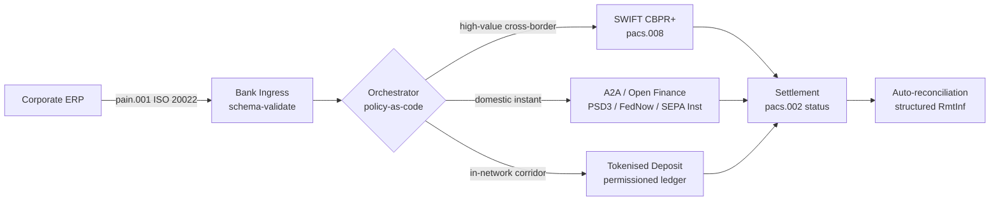

---

# Front Matter (YAML)

author: "contact@sebastienrousseau.com (Sebastien Rousseau)"
banner_alt: "Tàu container tại cảng nước sâu lúc bình minh — biểu trưng cho dòng giá trị doanh nghiệp xuyên biên giới, đa đường ray qua ISO 20022, open finance và các mạng thanh toán tiền gửi token hoá trong năm 2026"
banner_height: "1597"
banner_width: "2584"
banner: "https://cloudcdn.pro/stocks/images/viktor-forgacs-KxVRDiFdTVo.webp"
cdn: "https://cloudcdn.pro"
charset: "UTF-8"
cname: "sebastienrousseau.com"
copyright: "© Copyright 2025 - 2026 - Sebastien Rousseau. All rights reserved."
date: "24 tháng 6, 2026"
description: "Cách ISO 20022, A2A, open finance theo PSD3/FiDA và tiền gửi token hoá định hình lại ngân quỹ doanh nghiệp xuyên biên giới song hành với SWIFT trong năm 2026."
format-detection: "telephone=no"
hreflang: "vi"
icon: "https://cloudcdn.pro/clients/sebastienrousseau/v1/logos/sebastienrousseau.svg"
id: "https://sebastienrousseau.com/2026-06-24-cross-border-iso-20022-open-finance-tokenised-deposits-treasury-2026"
image_alt: "Chân dung đen trắng của Sebastien Rousseau"
image_height: "162"
image_width: "162"
image: "https://cloudcdn.pro/stocks/images/sebastienrousseau.webp"
keywords: "thanh toán xuyên biên giới, ISO 20022, open finance, PSD3, FiDA, tiền gửi token hoá, stablecoin, A2A, ngân quỹ, CIB, Nexi, Mastercard, đa đường ray, pacs.008, pain.001, SWIFT, FedNow, SEPA Instant, RTP, CBPR+"
language: "vi-VN"
last_reviewed: "2026-06-24"
layout: "report"
locale: "vi_VN"
logo_alt: "Logo của Sebastien Rousseau"
logo_height: "44"
logo_width: "44"
logo: "https://cloudcdn.pro/clients/sebastienrousseau/v1/logos/sebastienrousseau.svg"
menu: ""
measurementID: "G-169G4ET5HQ"
name: "Sebastien Rousseau"
permalink: "https://sebastienrousseau.com/2026-06-24-cross-border-iso-20022-open-finance-tokenised-deposits-treasury-2026"
rating: "general"
referrer: "no-referrer"
robots: "index, follow"
schema: "FAQPage, Article"
seo_title: "Xuyên biên giới 2026: ISO 20022, Open Finance, Đường ray token"
short_name: "sebastienrousseau"
subtitle: "Ngân quỹ doanh nghiệp xuyên biên giới năm 2026 vận hành theo cơ chế đa đường ray — ISO 20022 là ngữ pháp chung, A2A và open finance là đường ray hướng khách hàng, tiền gửi token hoá là chân thanh toán bán buôn, còn SWIFT vẫn neo phần đuôi dài."
tags: "thanh toán xuyên biên giới, ISO 20022, open finance, PSD3, FiDA, tiền gửi token hoá, A2A, ngân quỹ, CIB, đa đường ray, pacs.008, pain.001, SWIFT, FedNow, SEPA Instant, RTP, CBPR+"
theme-color: "0, 83, 191"
title: "Xuyên biên giới 2026: ISO 20022, Open Finance và Tiền gửi token hoá trong ngân quỹ doanh nghiệp"
url: "https://sebastienrousseau.com/2026-06-24-cross-border-iso-20022-open-finance-tokenised-deposits-treasury-2026"
viewport: "width=device-width, initial-scale=1, shrink-to-fit=no"

# RSS - The RSS feed front matter (YAML).
atom_link: "https://sebastienrousseau.com/2026-06-24-cross-border-iso-20022-open-finance-tokenised-deposits-treasury-2026/rss.xml"
category: "Technology"
docs: https://validator.w3.org/feed/docs/rss2.html
generator: "Static Site Generator (SSG) (version 0.0.26)"
item_description: "Cách ISO 20022, A2A, open finance theo PSD3/FiDA và tiền gửi token hoá định hình lại ngân quỹ doanh nghiệp xuyên biên giới song hành với SWIFT trong năm 2026."
item_guid: "https://sebastienrousseau.com/2026-06-24-cross-border-iso-20022-open-finance-tokenised-deposits-treasury-2026/rss.xml"
item_link: "https://sebastienrousseau.com/2026-06-24-cross-border-iso-20022-open-finance-tokenised-deposits-treasury-2026/rss.xml"
item_pub_date: "Wed, 24 Jun 2026 07:07:07 +0000"
item_title: "Xuyên biên giới 2026: ISO 20022, Open Finance và Tiền gửi token hoá trong ngân quỹ doanh nghiệp"
last_build_date: "Wed, 24 Jun 2026 06:06:06 +0000"
managing_editor: "contact@sebastienrousseau.com (Sebastien Rousseau)"
pub_date: "Wed, 24 Jun 2026 07:07:07 +0000"
ttl: "60"
type: "article"
webmaster: "contact@sebastienrousseau.com"

# Apple - The Apple front matter (YAML).
apple_mobile_web_app_orientations: "portrait"
apple_touch_icon_sizes: "192x192"
apple-mobile-web-app-capable: "yes"
apple-mobile-web-app-status-bar-inset: "black"
apple-mobile-web-app-status-bar-style: "black-translucent"
apple-mobile-web-app-title: "Xuyên biên giới 2026: ISO 20022, Đường ray token"
apple-touch-fullscreen: "yes"

# MS Application - The MS Application front matter (YAML).

msapplication-navbutton-color: "0, 83, 191"

# Twitter Card - The Twitter Card front matter (YAML).

twitter_card: "summary_large_image"
twitter_creator: "@wwdseb"
twitter_description: "Cách ISO 20022, A2A, open finance theo PSD3/FiDA và tiền gửi token hoá định hình lại ngân quỹ doanh nghiệp xuyên biên giới song hành với SWIFT trong năm 2026."
twitter_image: "https://cloudcdn.pro/clients/sebastienrousseau/v1/logos/sebastienrousseau.svg"
twitter_image_alt: "Logo của Sebastien Rousseau"
twitter_site: "@wwdseb"
twitter_title: "Xuyên biên giới 2026: ISO 20022, Open Finance, Đường ray token"
twitter_url: "https://sebastienrousseau.com/2026-06-24-cross-border-iso-20022-open-finance-tokenised-deposits-treasury-2026"

excerpt: "Ngân quỹ doanh nghiệp xuyên biên giới năm 2026 là một bài toán kỹ thuật đa đường ray. ISO 20022 là ngữ pháp chung, A2A và open finance theo PSD3/FiDA là đường ray hướng khách hàng, tiền gửi token hoá xử lý chân thanh toán bán buôn, còn SWIFT vẫn neo phần đuôi dài. Công việc đáng làm nằm ở lớp điều phối, không phải ở mô hình."

# Humans.txt - The Humans.txt front matter (YAML).
author_website: "https://sebastienrousseau.com"
author_twitter: "@wwdseb"
author_location: "London, UK"
thanks: "Cảm ơn quý vị đã đọc!"
site_last_updated: "2026-06-24"
site_standards: "HTML5, CSS3, RSS, Atom, JSON, XML, YAML, Markdown, TOML"
site_components: "Kaishi, Kaishi Builder, Kaishi CLI, Kaishi Templates, Kaishi Themes"
site_software: "Static Site Generator, Rust"

---

# Xuyên biên giới 2026: ISO 20022, Open Finance và Tiền gửi token hoá trong ngân quỹ doanh nghiệp

<!-- lead-start -->
<aside class="post-lead" aria-label="Tóm tắt bài viết">

<strong>TL;DR.</strong> Ngân quỹ doanh nghiệp xuyên biên giới năm 2026 vận hành trên bốn đường ray song song — SWIFT CBPR+, A2A tức thời theo PSD3/FiDA, tiền gửi token hoá và đường ray stablecoin — được ghép lại bằng ISO 20022 như ngữ pháp chung. Công việc của CIB và các nhóm ngân quỹ doanh nghiệp là điều phối, không phải chọn đường ray.

<strong>Điểm chính</strong>

<ul class="post-lead-takeaways">
  <li><strong>Đa đường ray là mặc định.</strong> Không một đường ray duy nhất nào thanh toán cho mọi hành lang, mọi quy mô giao dịch, mọi giờ cắt. Ngân quỹ chọn đường ray theo từng khoản thanh toán, không phải theo từng ngân hàng.</li>
  <li><strong>ISO 20022 là ngôn ngữ chung.</strong> pacs.008, pacs.009 và pain.001 hiện mang dữ liệu chuyển khoản qua các đường ray RTGS, tức thời, A2A và tiền gửi token hoá — khiến các quyết định định tuyến dựa trên dữ liệu thay vì bị khoá theo đường ray.</li>
  <li><strong>Open finance mở rộng vành đai.</strong> PSD3 và FiDA đẩy mô hình open banking sang lương hưu, bảo hiểm và dữ liệu ngân quỹ; Nexi và Mastercard đang xây lớp điều phối mà doanh nghiệp sẽ tiêu dùng.</li>
  <li><strong>Tiền gửi token hoá là chân bán buôn.</strong> Tiền gửi token hoá do ngân hàng phát hành và các đường ray stablecoin tích hợp nằm bên dưới đường ray tức thời hướng khách hàng và thanh toán chân bán buôn gần như T+0.</li>
</ul>

<strong>Đọc liên quan:</strong> <a href="https://sebastienrousseau.com/2026-06-07-autonomous-treasury-index-programmable-liquidity-tokenised-deposits-2026">Chỉ số Ngân quỹ Tự trị 2026: Thanh khoản có thể lập trình và tiền gửi token hoá</a>, <a href="https://sebastienrousseau.com/2026-06-15-pacs008-automation-iso-20022-interbank-payments-2026">Tự động hoá pacs.008: Thanh toán liên ngân hàng ISO 20022 năm 2026</a>.

</aside>
<!-- lead-end -->

> **Tóm tắt cho lãnh đạo.** Ngân quỹ doanh nghiệp xuyên biên giới năm 2026 là một bài toán kỹ thuật đa đường ray trước khi là bài toán quản lý quan hệ. PSD3 và quy định Financial Data Access (FiDA) mở rộng vành đai open banking sang dữ liệu ngân quỹ doanh nghiệp; đợt chuyển đổi MT/MX của SWIFT tháng 11 năm 2026 khiến pacs.008 tuân thủ CBPR+ trở thành định dạng liên ngân hàng xuyên biên giới khả thi duy nhất; tiền gửi token hoá và các đường ray stablecoin được quản lý xử lý chân thanh toán bán buôn gần T+0 bên trong các mạng được cấp quyền. CIB thắng cuộc trong chu kỳ này không phải CIB chọn một đường ray duy nhất; mà là CIB thiết kế lớp điều phối ràng buộc tất cả chúng lại với nhau. Bài viết này đi qua kiến trúc bốn đường ray (A2A theo PSD3, SWIFT CBPR+, tiền gửi token hoá do ngân hàng phát hành, stablecoin được quản lý) — mỗi đường ray giỏi gì, ranh giới rủi ro tín dụng nằm ở đâu, và lớp điều phối policy-as-code phía trên chúng phải thực thi điều gì để doanh nghiệp thấy một khoản thanh toán và cơ quan giám sát thấy một dấu vết kiểm toán duy nhất.

Một doanh nghiệp công nghiệp châu Âu trả nhà cung cấp Brazil 4,2 triệu EUR vào sáng thứ Tư. Trạm làm việc ngân quỹ không chọn ngân hàng. Nó chọn một đường ray — một chuỗi đường ray. Lệnh hướng khách hàng đáp xuống bằng tin nhắn A2A pain.001 định tuyến qua một nhà cung cấp open finance theo PSD3. Ngân hàng đi tiếp hai khu vực pháp lý đại lý trên tiền gửi token hoá bên trong một mạng riêng CIB. Phần đuôi dài — một khoản hoá đơn 80.000 USD dọn dẹp cho nhà cung cấp phụ không có quan hệ tiền gửi token hoá — vẫn đi SWIFT CBPR+ dưới dạng pacs.008. Khách hàng thấy một khoản thanh toán. Kiến trúc thấy bốn đường ray. ISO 20022 là lý do duy nhất khiến mọi thứ gắn kết.

Đây là mô hình vận hành mà Mastercard mô tả khi nói về [sự tiến hoá từ open banking sang open finance](https://www.mastercard.com/us/en/news-and-trends/Insights/2026/open-banking-to-open-finance-the-evolution-of-financial-data.html "Mastercard: từ open banking sang open finance, sự tiến hoá của dữ liệu tài chính") — dữ liệu và thanh toán hợp nhất thành một lớp điều phối, với đường ray do hệ thống chọn, không phải khách hàng. Câu hỏi đáng quan tâm với các nhà công nghệ ngân hàng cấp cao không phải đường ray nào sẽ thắng. Mà là lớp điều phối được thiết kế, quản trị và đối soát như thế nào.

## 01. Từ thẻ tới A2A — bước chuyển open finance

Đường ray thẻ không biến mất. Chúng đang được tái định khung.

Suốt năm 2025 và sang năm 2026, [PSD3 và quy định Financial Data Access (FiDA)](https://www.consultancy.uk/news/42202/orchestrating-open-banking-for-platform-growth-2026-outlook "Consultancy.uk: điều phối open banking cho tăng trưởng nền tảng, triển vọng 2026") mở rộng nghĩa vụ open banking vượt ra ngoài tài khoản thanh toán sang lương hưu, vay thế chấp, tiết kiệm, bảo hiểm và dữ liệu ngân quỹ doanh nghiệp. Hệ quả cho ngân quỹ doanh nghiệp là trực tiếp: một quản lý quan hệ CIB nay có thể tiêu thụ bức tranh thanh khoản đầy đủ của doanh nghiệp trên nhiều ngân hàng qua một hợp đồng API duy nhất, theo lệnh của doanh nghiệp.

Hai nhà vận hành đang công khai xây lớp điều phối mà doanh nghiệp sẽ tiêu dùng. Nexi đã mở rộng dấu chân thu hộ sang khởi tạo A2A trên các hành lang SEPA Instant và RTGS toàn châu Âu, ISO 20022 nguyên sinh đầu cuối. Nền tảng open finance của Mastercard — neo trên các thương vụ mua Aiia và Finicity — cung cấp lớp tổng hợp dữ liệu và đồng thuận bên dưới, với khởi tạo thanh toán xuất hiện qua chính bộ API trước đây phục vụ uỷ quyền thẻ.

Bước chuyển này quan trọng vì ba lý do:

1. **Kinh tế đơn vị.** A2A khởi tạo theo PSD3 loại interchange ra khỏi khoản thanh toán. Với dòng B2B giá trị lớn, mức tiết kiệm là đáng kể; với dòng tiêu dùng giá trị nhỏ, ngăn xếp chi phí thương nhân sụp đổ.
2. **Chất lượng dữ liệu.** A2A theo ISO 20022 mang dữ liệu chuyển khoản có cấu trúc mà thẻ chưa bao giờ làm được. Tỷ lệ đối soát tự động trên 95% nay là điều kiện cần.
3. **Mô hình rủi ro.** A2A là chuyển khoản tín dụng, không phải uỷ quyền thẻ. Bề mặt gian lận, mô hình chargeback và mô hình tranh chấp đều khác. Các nhóm ngân quỹ doanh nghiệp cần hiểu rằng lớp bảo vệ khách hàng đang được xây lại, không được kế thừa.

CIB bán đề xuất đa đường ray năm 2026 đang bán sự điều phối — không phải quyền truy cập. Quyền truy cập nay đã được quản lý theo luật.

## 02. ISO 20022 như ngôn ngữ chung xuyên đường ray

Lý do đa đường ray khả thi là vì định dạng tin nhắn nay nhất quán xuyên đường ray.

Uỷ ban Thanh toán và Hạ tầng Thị trường của BIS (CPMI) đã làm rõ luận điểm kiến trúc trong [các yêu cầu hài hoà ISO 20022 để cải thiện thanh toán xuyên biên giới](https://www.bis.org/cpmi/publ/d230.pdf "BIS CPMI: yêu cầu hài hoà ISO 20022 để cải thiện thanh toán xuyên biên giới"). Đợt chuyển đổi tháng 11 năm 2025 sang CBPR+ đã đóng kỷ nguyên MT103 / MT202 cho tin nhắn liên ngân hàng xuyên biên giới. Từ thời điểm đó, mọi đường ray lớn — SWIFT, FedNow, SEPA Instant, RTP và các hệ thống thanh toán tức thời chủ chốt ở châu Á và Mỹ Latinh — đều nói chung ngữ pháp pacs.008 / pacs.009 / pain.001.

Hệ quả thực tiễn với ngân quỹ doanh nghiệp:

- **Định tuyến dựa trên dữ liệu.** Trạm làm việc ngân quỹ có thể đọc pain.001 một lần và quyết định đường ray theo từng khoản thanh toán dựa trên hành lang, quy mô giao dịch, giờ cắt và quan hệ đối tác — không cần ánh xạ lại tin nhắn.
- **Dữ liệu chuyển khoản sống sót qua từng chặng.** Các trường chuyển khoản có cấu trúc (`<RmtInf><Strd>`) đi xuyên các chặng đại lý mà không bị cắt cụt. Tỷ lệ đối soát tự động tăng vì dữ liệu không còn mất ở ranh giới đường ray.
- **Sàng lọc lệnh trừng phạt có thể kiểm toán.** Các trường có cấu trúc `<Dbtr>` / `<Cdtr>` / `<DbtrAgt>` / `<CdtrAgt>` cùng tham chiếu LEI thay thế sàng lọc tên dạng văn bản tự do. Tỷ lệ trùng giảm. Hàng đợi điều tra co lại.

Sơ đồ dưới đây lần theo một pain.001 duy nhất qua cổng tiếp nhận của ngân hàng, vào bộ điều phối policy-as-code, rồi ra đường ray mà hành lang và quy mô giao dịch đòi hỏi — một tin nhắn, nhiều đường ray, không ánh xạ lại.

Cái giá của sự nhất quán này là kỷ luật kỹ thuật. ISO 20022 cho phép linh hoạt. Hai ngân hàng có thể đều tuân thủ CBPR+ đầy đủ và vẫn tạo ra các tin nhắn pacs.008 khác nhau về cách dùng trường, tập ký tự và cấu trúc dữ liệu chuyển khoản. CIB thắng cuộc trên xuyên biên giới năm 2026 áp dụng một profile tin nhắn nghiêm ngặt hơn chuẩn yêu cầu — và từ chối tại bước phân tích, không phải tại bước thanh toán.

## 03. Tiền gửi token hoá và đường ray ổn định

Chân thanh toán bán buôn là nơi câu chuyện đường ray trở nên thú vị.

Bức tranh năm 2026, được khắc hoạ tốt trong [phân tích của Trade Treasury Payments về tự động hoá, đường ray dự phòng, ISO 20022 và stablecoin](https://tradetreasurypayments.com/articles/automation-contingency-rails-iso-20022-and-stablecoins-the-2026-trends-reshaping-corporate-finance-and-b2b-payments "Trade Treasury Payments: tự động hoá, đường ray dự phòng, ISO 20022 và stablecoin, các xu hướng 2026 định hình lại tài chính doanh nghiệp và thanh toán B2B"), tách lớp thanh toán bán buôn thành hai mô hình có cấu trúc khác nhau.

**Tiền gửi token hoá do ngân hàng phát hành.** Một ngân hàng thương mại phát hành một khoản nợ token hoá trên sổ cái được cấp quyền — JPM Coin, token tiền gửi liên kết Orion của HSBC, các đối tác tương đương của CIB châu Âu lớn. Token là một yêu cầu trực tiếp với ngân hàng phát hành. Thanh toán gần T+0 bên trong mạng. Tuân thủ là trách nhiệm của ngân hàng phát hành. Đường ray được quản lý đầy đủ, có thể truy vết đầy đủ và giới hạn ở các thành viên mà nhà phát hành đã tiếp nhận.

**Đường ray stablecoin tích hợp.** Một stablecoin được quản lý — dự trữ đầy đủ, đã kiểm toán và vận hành theo MiCA hoặc chế độ khu vực tương đương — thanh toán cho một hành lang mà tiền gửi token hoá do ngân hàng phát hành chưa vươn tới. Token là một yêu cầu với khoản dự trữ, không phải với bảng cân đối của ngân hàng. Tuân thủ được chia sẻ giữa nhà phát hành, on-ramp và off-ramp.

Hai mô hình không cạnh tranh. Chúng xếp chồng. Một sản phẩm xuyên biên giới của CIB năm 2026 điển hình dùng tiền gửi token hoá do ngân hàng phát hành cho chặng trong mạng và một stablecoin được quản lý cho hành lang nơi đường ray trong mạng kết thúc. Doanh nghiệp thấy một khoản thanh toán ISO 20022. Câu chuyện thanh toán bên dưới là đa token.

Câu hỏi cấp hội đồng quản trị vẫn là câu mà các uỷ ban rủi ro vận hành đã đặt từ khi có thí điểm thanh khoản có thể lập trình đầu tiên: ai gánh rủi ro tín dụng trên token, và trong bao lâu? Tiền gửi token hoá đưa ra câu trả lời rõ ràng — ngân hàng phát hành, cho tới khi burn. Đường ray stablecoin tích hợp đưa ra câu trả lời tinh tế hơn — khoản dự trữ, tuỳ thuộc vào chu kỳ kiểm toán và bảo đảm hoàn lại. Một nhóm ngân quỹ không tài liệu hoá câu trả lời cho từng đường ray theo từng hành lang đang gánh rủi ro tín dụng chưa được đo lường trên bảng cân đối.

## 04. Ngăn xếp ngân quỹ tự trị

Phía trên lớp đường ray là lớp điều phối. Phía trên lớp điều phối là lớp tác nhân.

Tôi đã trình bày kiến trúc chi tiết trong [Chỉ số Ngân quỹ Tự trị 2026: Thanh khoản có thể lập trình và tiền gửi token hoá](https://sebastienrousseau.com/2026-06-07-autonomous-treasury-index-programmable-liquidity-tokenised-deposits-2026 "Sebastien Rousseau: Chỉ số Ngân quỹ Tự trị 2026"). Phiên bản ngắn: ngân quỹ kiểu tác nhân năm 2026 là lớp điều phối, biểu đạt dưới dạng chính sách như mã, với các tác nhân giới hạn thực thi bên trong nó.

Ngăn xếp là:

1. **Lớp đường ray.** SWIFT CBPR+, A2A tức thời, tiền gửi token hoá, stablecoin được quản lý. Mỗi đường ray có profile đã công bố, bảng giờ cắt, đường cong chi phí và mô hình tính cuối cùng của thanh toán.
2. **Lớp điều phối.** ISO 20022 vào, ISO 20022 ra. Quyết định đường ray theo từng khoản thanh toán dựa trên hành lang, giao dịch, giờ cắt, quan hệ đối tác và chính sách. Chính sách được phiên bản hoá, ký số và có thể kiểm toán.
3. **Lớp tác nhân.** Các tác nhân ngân quỹ giới hạn thực thi chính sách điều phối với biên giới gọi công cụ, nhật ký kiểm toán và công tắc khẩn cấp. Tác nhân không chọn đường ray. Chính sách chọn đường ray. Tác nhân chạy chính sách.
4. **Lớp đối soát.** Các tin nhắn ISO 20022 pacs.008 / pacs.002 / camt.054 đối soát với lệnh pain.001 gốc, với dữ liệu chuyển khoản có cấu trúc khép vòng mà không cần can thiệp thủ công.

CIB bán ngăn xếp này năm 2026 đang bán bốn thứ cùng lúc — và định giá riêng. Doanh nghiệp mua đang mua sự lựa chọn linh hoạt giữa các đường ray, với một chuẩn tin nhắn, một lớp chính sách, một luồng đối soát. Đó là bước chuyển kiến trúc. Mọi thứ khác là chi tiết triển khai.

## Câu hỏi thường gặp

**"Open finance" có phải chỉ là open banking được đổi tên?**
Không. Open banking theo PSD2 phủ các tài khoản thanh toán. PSD3 và quy định Financial Data Access (FiDA) mở rộng nghĩa vụ chia sẻ dữ liệu sang lương hưu, vay thế chấp, tiết kiệm, bảo hiểm và dữ liệu ngân quỹ doanh nghiệp. Hệ quả cho ngân quỹ doanh nghiệp là trực tiếp: một quản lý quan hệ CIB nay có thể tiêu thụ bức tranh thanh khoản đầy đủ của doanh nghiệp trên nhiều ngân hàng qua một hợp đồng API duy nhất, theo lệnh của doanh nghiệp, không chỉ lịch sử tài khoản thanh toán.

**Tại sao lớp điều phối là trọng tâm kiến trúc, không phải đường ray?**
Vì các đường ray đang trở thành hàng hoá. SWIFT CBPR+ pacs.008, A2A theo PSD3, tiền gửi token hoá và stablecoin được quản lý đều mang cùng ngữ pháp ISO 20022 ở cấp tin nhắn. Điều phân biệt một CIB năm 2026 là động cơ policy-as-code chọn đường ray theo từng khoản thanh toán dựa trên hành lang, quy mô giao dịch, yêu cầu tính cuối cùng của thanh toán và quan hệ đối tác — và ghi lại lựa chọn trong dữ liệu kiểm toán mà cơ quan giám sát sẽ yêu cầu. Không có động cơ đó, đa đường ray chỉ là sự lựa chọn linh hoạt không có quản trị.

**Ranh giới rủi ro tín dụng nằm ở đâu trên chặng tiền gửi token hoá?**
Tiền gửi token hoá do ngân hàng phát hành trên sổ cái được cấp quyền là yêu cầu trực tiếp với ngân hàng phát hành — rủi ro tín dụng kết thúc khi burn. Các đường ray stablecoin được quản lý (giám sát theo MiCA ở EU, chế độ trong tài liệu thảo luận của Ngân hàng Trung ương Anh ở Anh, tương đương ở nơi khác) là yêu cầu với khoản dự trữ, với cửa sổ rủi ro tuỳ thuộc vào chu kỳ kiểm toán và điều khoản bảo đảm hoàn lại. Một nhóm ngân quỹ không tài liệu hoá câu trả lời cho từng đường ray theo từng hành lang đang gánh rủi ro tín dụng chưa được đo lường trên bảng cân đối.

**Điều gì xảy ra với SWIFT trong kiến trúc này?**
SWIFT không biến mất — nó neo phần đuôi dài. Các hành lang nơi tiền gửi token hoá do ngân hàng phát hành chưa vươn tới (hầu hết quan hệ với nhà cung cấp phụ ở thị trường mới nổi, hầu hết dòng xuyên biên giới tần suất thấp / giá trị nhỏ), và các hành lang nơi doanh nghiệp hoặc ngân hàng yêu cầu dấu vết kiểm toán ngân hàng đại lý CBPR+, vẫn chạy trên SWIFT pacs.008. Kiến trúc 2026 là "SWIFT + đường ray mới", không phải "đường ray mới thay cho SWIFT".

**Doanh nghiệp mua được gì khi mua ngăn xếp này?**
Sự lựa chọn linh hoạt giữa các đường ray, với một chuẩn tin nhắn (ISO 20022), một lớp chính sách (động cơ điều phối) và một luồng đối soát (trạng thái pacs.002 + xác nhận camt.054 + sao kê có cấu trúc camt.053). Doanh nghiệp không trả tiền cho bốn kết nối đường ray riêng. Họ trả cho lớp điều phối khiến bốn đường ray vận hành như một về mặt vận hành — và dấu vết kiểm toán cho phép họ trả lời "khoản thanh toán 4,2 triệu EUR đó đã đi đường ray nào, và vì sao?" vào sáng hôm sau cuộc yêu cầu giám sát kế tiếp.

## Kết luận

Ngân quỹ doanh nghiệp xuyên biên giới năm 2026 là một bài toán kỹ thuật đa đường ray. ISO 20022 là ngữ pháp khiến đa đường ray khả thi. PSD3 và FiDA mở rộng vành đai dữ liệu và buộc open finance vào quy trình ngân quỹ doanh nghiệp. Tiền gửi token hoá và stablecoin được quản lý xử lý chân thanh toán bán buôn. SWIFT vẫn neo phần đuôi dài.

CIB thắng cuộc là CIB xây lớp điều phối — không phải CIB chọn một đường ray duy nhất và đặt cược cả franchise vào đó. Nhóm ngân quỹ doanh nghiệp thắng cuộc là nhóm tài liệu hoá rủi ro tín dụng theo từng đường ray theo từng hành lang, áp dụng profile ISO 20022 nghiêm ngặt hơn cơ quan quản lý yêu cầu, và đối xử với quyết định đường ray như chính sách, không như một phán xét theo từng khoản thanh toán.

Công việc đáng làm nằm ở lớp điều phối. Xây nó cẩn thận.

## Tài liệu tham khảo

Bank for International Settlements, Committee on Payments and Market Infrastructures (2023). *Harmonised ISO 20022 data requirements for enhancing cross-border payments* (CPMI Papers No. 230). Có tại: [https://www.bis.org/cpmi/publ/d230.htm](https://www.bis.org/cpmi/publ/d230.htm "BIS CPMI 230 — Yêu cầu dữ liệu ISO 20022 hài hoà")

Bank for International Settlements (2024). *Project Agorá: cross-border payments with tokenised commercial bank deposits and central bank money*. BIS Innovation Hub. Có tại: [https://www.bis.org/about/bisih/topics/fmis/agora.htm](https://www.bis.org/about/bisih/topics/fmis/agora.htm "BIS Project Agorá")

Bank of England (2023). *Regulatory regime for systemic payment systems using stablecoins and related service providers — Discussion Paper*. Có tại: [https://www.bankofengland.co.uk/paper/2023/dp/regulatory-regime-for-systemic-payment-systems-using-stablecoins-and-related-service-providers](https://www.bankofengland.co.uk/paper/2023/dp/regulatory-regime-for-systemic-payment-systems-using-stablecoins-and-related-service-providers "Bank of England — Tài liệu thảo luận về chế độ quản lý stablecoin")

European Commission (2023). *Proposal for a Directive on payment services and electronic money services (PSD3)*. Có tại: [https://finance.ec.europa.eu/regulation-and-supervision/financial-services-legislation/implementing-and-delegated-acts/payment-services-directive_en](https://finance.ec.europa.eu/regulation-and-supervision/financial-services-legislation/implementing-and-delegated-acts/payment-services-directive_en "European Commission — Đề xuất Chỉ thị dịch vụ thanh toán")

European Parliament and Council (2023). *Regulation (EU) 2023/1114 on markets in crypto-assets (MiCA)*. Có tại: [https://eur-lex.europa.eu/eli/reg/2023/1114/oj](https://eur-lex.europa.eu/eli/reg/2023/1114/oj "Quy định (EU) 2023/1114 — Thị trường tài sản tiền mã hoá (MiCA)")

Financial Action Task Force (2023). *International standards on combating money laundering and the financing of terrorism — Recommendation 16 on wire transfers*. Có tại: [https://www.fatf-gafi.org/en/publications/Fatfrecommendations/Fatf-recommendations.html](https://www.fatf-gafi.org/en/publications/Fatfrecommendations/Fatf-recommendations.html "Khuyến nghị FATF")

International Organization for Standardization (2020). *ISO 17442 Financial services — Legal entity identifier (LEI)*. Có tại: [https://www.gleif.org/en/about-lei/iso-17442-the-lei-code-structure](https://www.gleif.org/en/about-lei/iso-17442-the-lei-code-structure "ISO 17442 — Mã định danh thực thể pháp lý")

SWIFT (2024). *Cross-Border Payments and Reporting Plus (CBPR+) usage guidelines*. Có tại: [https://www.swift.com/standards/iso-20022/iso-20022-programme](https://www.swift.com/standards/iso-20022/iso-20022-programme "Hướng dẫn sử dụng SWIFT CBPR+")

<!-- enrich-start -->
<aside class="author-card" aria-label="Về tác giả"><strong class="author-card-name"><a href="/about/index.html">Sebastien Rousseau</a></strong>Nhà công nghệ ngân hàng cấp cao viết về AI ứng dụng, di trú ISO 20022, mật mã hậu lượng tử cho dịch vụ tài chính và sự chuyển đổi cấu trúc của thanh toán bán buôn.Hơn 20 năm tại HSBC Commercial &amp; Investment Bank, PayPal, Barclays, Shazam, AKQA, Virgin Group. <a href="/about/index.html">Hồ sơ đầy đủ</a> &middot; <a href="https://www.linkedin.com/in/sebastienrousseau/" rel="external noopener">LinkedIn</a> &middot; <a href="https://github.com/sebastienrousseau" rel="external noopener">GitHub</a></aside>

Rà soát lần cuối <time datetime="2026-06-24">2026-06-24</time>.

<!-- enrich-end -->
