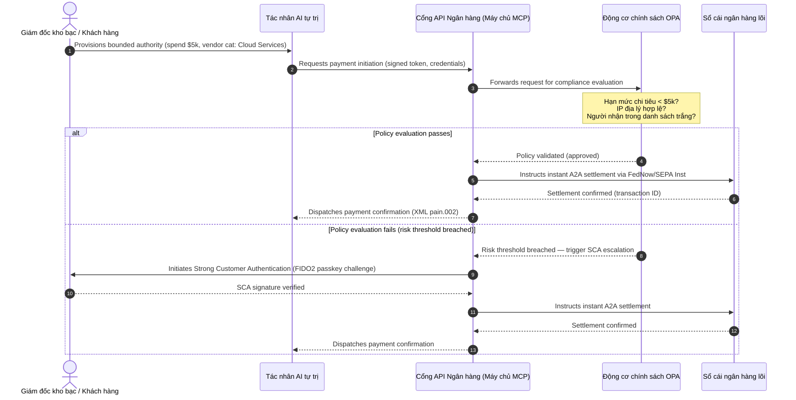

# Triển vọng thanh toán toàn cầu 2026: Mô hình vận hành, rủi ro và doanh thu trong một thế giới tác nhân, vô hình và theo thời gian thực

Chu kỳ thanh toán toàn cầu 2026 được định hình bởi ba lực hội tụ — thương mại tác nhân, thanh toán nhúng vô hình và quyết toán theo thời gian thực — vận hành trên một sổ cái thống nhất token hóa theo Project Agorá cùng mốc cứng chuyển đổi địa chỉ có cấu trúc của SWIFT vào tháng 11/2026.

<!-- lead-start -->
<aside class="post-lead" aria-label="Tóm tắt bài viết">

<strong>Tóm lược.</strong> Bối cảnh thanh toán 2026 đã chuyển từ giai đoạn di trú thông điệp sang một mô hình vận hành đa chiều, trong đó rủi ro và doanh thu do quyết toán theo thời gian thực quyết định. Bài viết tổng hợp triển vọng 2026 của J.P. Morgan, Global Payments, HSBC và Payments Association thành kế hoạch vận hành G-SIB bốn trụ cột, bao trùm thương mại tác nhân do mô hình khởi tạo, API kho bạc luôn sẵn sàng, sổ cái thống nhất token hóa theo Project Agorá của BIS và hạn chót địa chỉ có cấu trúc của SWIFT ngày 14/15 tháng 11 năm 2026.

<strong>Điểm cốt lõi</strong>

<ul class="post-lead-takeaways">
  <li><strong>Thương mại tác nhân mở ra biên giới trách nhiệm uỷ quyền.</strong> Các tác nhân AI tự trị dự kiến trung gian 3-5 nghìn tỷ USD thương mại hàng năm vào năm 2030. Ngân hàng phải xác định cơ chế gác cổng MCP, uỷ quyền SCA theo PSD3/PSR, và chủ thể chịu trách nhiệm KYC/AML bên trong các chuỗi thanh toán đa tác nhân.</li>
  <li><strong>Thanh khoản luôn sẵn sàng nay là chuẩn vận hành và pháp lý.</strong> API kho bạc 24/7 và tài khoản ảo giảm thiểu tiền mặt mắc kẹt và nâng chuẩn khả năng phục hồi. Đối với API ngân quỹ thời gian thực có tầm quan trọng hệ thống, tính sẵn sàng năm số chín (99,999 %) đang trở thành mục tiêu kỹ thuật nội bộ mà các ngân hàng tự đặt ra để chứng minh khả năng phục hồi cấp DORA với cơ quan giám sát. Bản thân DORA không quy định ngưỡng năm số chín phổ quát; nó bao gồm quản lý rủi ro CNTT, báo cáo sự cố, kiểm tra khả năng phục hồi, rủi ro bên thứ ba và giám sát các nhà cung cấp CNTT trọng yếu.</li>
  <li><strong>Token hóa đã trưởng thành thành sổ cái thống nhất được quản lý.</strong> Project Agorá là khuôn khổ công-tư lớn nhất cho tiền gửi ngân hàng thương mại token hóa và dự trữ ngân hàng trung ương. Ngân hàng cần một hành trình token hóa năm bước, với cách xử lý an toàn vốn rõ ràng.</li>
  <li><strong>Mốc chuyển đổi địa chỉ có cấu trúc ngày 14/15 tháng 11 năm 2026 là mốc cứng.</strong> Swift CBPR+ loại bỏ khối `<AdrLine>` không có cấu trúc từ ngày 14 tháng 11 năm 2026; quy tắc EPC SEPA chỉ cho phép địa chỉ không có cấu trúc đến ngày 15 tháng 11 năm 2026. Cần quản trị dữ liệu sạch xuyên suốt các đội sản phẩm, công nghệ và tuân thủ.</li>
</ul>

<strong>Đọc thêm:</strong> <a href="https://sebastienrousseau.com/2026-06-23-iso-20022-pain001-programmable-liquidity-autonomic-treasury-2026">Từ Pain.001 đến thanh khoản có thể lập trình: ISO 20022 như hệ thần kinh tự chủ của kho bạc năm 2026</a>, <a href="https://sebastienrousseau.com/2026-06-24-cross-border-iso-20022-open-finance-tokenised-deposits-treasury-2026">Xuyên biên giới 2026: ISO 20022, tài chính mở và tiền gửi token hóa trong kho bạc doanh nghiệp</a>, <a href="https://sebastienrousseau.com/2026-06-25-quantum-dawn-cib-kyberlib-quantum-resilient-payments-stack-2026">Bình minh lượng tử cho CIB: Từ KyberLib đến ngăn xếp thanh toán kháng lượng tử</a>.

</aside>
<!-- lead-end -->

Đối với các ngân hàng giao dịch toàn cầu, chu kỳ 2026-2028 là một cửa sổ cấu trúc. Hạ tầng thanh toán hiện đại không còn là tiện ích quản trị — nó là cốt lõi của chiến lược công nghệ cấp ngân hàng. Bên trong các G-SIB và những định chế khu vực lớn, công nghệ, pháp lý và kỳ vọng khách hàng đã hội tụ trên một mặt phẳng vận hành duy nhất.

Ba lực định hình chu kỳ này, và mỗi lực ánh xạ trực tiếp tới một mối quan tâm cấp điều hành.

- **Thương mại tác nhân** — phân phối kênh, thiết kế sản phẩm, phân bổ trách nhiệm và Quản lý rủi ro mô hình dưới sự giám sát của cơ quan thanh tra.
- **Thanh toán vô hình** — trải nghiệm khách hàng, kèm rủi ro bị trung gian hóa khi ngân hàng không nhúng được sổ cái của mình vào các giao diện doanh nghiệp và người bán.
- **Quyết toán theo thời gian thực** — vận tốc vốn, kéo theo thay đổi trong quản lý thanh khoản, rủi ro tín dụng, khả năng phục hồi vận hành và phòng vệ gian lận.

Chi phí tài chính là đáng kể. Gian lận leo thang về tốc độ và độ tinh vi; hạn pháp lý là cứng; và những ngân hàng chủ động hiện đại hóa hệ thống lõi sẽ mở khóa các cơ hội doanh thu phí lớn. Cái giá của bất động là điều ngược lại: giao dịch bị từ chối ngay lập tức, tắc nghẽn vận hành, hình phạt từ cơ quan quản lý và xói mòn thị phần nhanh chóng.

## Thang chắc chắn — điều gì có thời hạn, được quy định, hay là dự báo

Không phải mọi mục trong báo cáo này đều có cùng mức độ chắc chắn. Câu hỏi ở cấp hội đồng quản trị là đâu là hạn chót, đâu là kỳ vọng giám sát, và đâu vẫn là dự báo thị trường — vì câu trả lời thay đổi cuộc trao đổi về ngân sách.

| Hạng mục | Ví dụ |
| --- | --- |
| **Hạn chót cứng** | Mốc chuyển đổi địa chỉ có cấu trúc Swift CBPR+ (14 tháng 11 năm 2026); quy tắc EPC SEPA (15 tháng 11 năm 2026) |
| **Nghĩa vụ pháp lý** | DORA về rủi ro CNTT + kiểm tra khả năng phục hồi + giám sát bên thứ ba (EU); ủy quyền SCA theo PSD3/PSR; MRM theo SR 11-7 + PRA SS1/23 |
| **Chuyển dịch thị trường xác suất cao** | API ngân quỹ thời gian thực, phòng vệ gian lận do AI dẫn dắt, thanh khoản qua API, gian lận sinh trắc học do deepfake |
| **Lựa chọn chiến lược** | Tiền gửi token hóa, sổ cái thống nhất theo Project Agorá, hành lang thương mại tác nhân, FX liên tục (Wire 365) |
| **Dự báo** | `$3-$5 trillion` dòng thương mại tác nhân hàng năm vào năm 2030 (kịch bản cơ sở của McKinsey) |

Xem hai hàng đầu như những thực tế tuân thủ kéo theo một dòng ngân sách bất kể ngân hàng có nắm bắt được phần thượng lưu hay không. Xem hai hàng cuối như các lựa chọn chiến lược — định hướng có độ tin cậy cao, nhưng thời điểm thực thi là quyết định của hội đồng quản trị thay vì một mục lịch của cơ quan quản lý.

## Sự hội tụ của các tiếng nói thanh toán toàn cầu

Báo cáo này tổng hợp triển vọng thương mại và thanh toán 2026 từ bốn tiếng nói có thẩm quyền trong ngành — [J.P. Morgan Payments](https://www.jpmorgan.com/payments/newsroom/payments-outlook-2026-trends-report-released "J.P. Morgan Payments — Outlook 2026"), [Global Payments](https://investors.globalpayments.com/news-events/press-releases/detail/497/global-payments-releases-its-2026-commerce-and-payment "Global Payments — 2026 Commerce and Payment Trends Report"), HSBC và The Payments Association — và đối chiếu chéo với [Lộ trình G20 về Nâng cao Thanh toán Xuyên biên giới](https://www.fsb.org/2026/03/fsb-kicks-off-new-implementation-phase-to-enhance-cross-border-payments-through-public-private-partnership/ "FSB — giai đoạn triển khai thanh toán xuyên biên giới, tháng 3/2026").

Mỗi tổ chức tiếp cận hệ sinh thái từ một góc thị trường khác nhau, nhưng kết luận của họ hội tụ về ba bất biến.

1. **Đường ray tức thời, vận hành qua API là chuẩn nền.** Mô hình xử lý theo lô kế thừa bị đẩy ra rìa đối với các luồng xuyên biên giới và giá trị cao; vận tốc giao dịch ở những phân khúc đó do thông điệp luôn sẵn sàng, theo thời gian thực, quyết định.
2. **AI vừa là mối đe doạ vừa là phòng vệ.** Công cụ sinh và deepfake mở rộng quy mô gian lận giao dịch, đòi hỏi các phòng vệ học máy đa lớp, theo thời gian thực.
3. **Token hóa là hạ tầng sẵn sàng cho sản xuất.** Sổ cái đang được hợp nhất để chứa các nghĩa vụ thương mại token hóa và tiền số ngân hàng trung ương dạng bán buôn.

| Báo cáo | Đối tượng chính | Trọng tâm | Trụ cột chủ đạo | Hàm ý cho ngân hàng |
| --- | --- | --- | --- | --- |
| **J.P. Morgan Payments** | Corporate treasurers, G-SIBs | Real-time liquidity, fraud | APIs, AI biometrics | Rebuild liquidity, FX, and risk systems for continuous 365-day settlement. |
| **Global Payments** | Merchants, e-commerce | POS evolution, omnichannel | Agentic commerce, frictionless checkout | Build secure, API-gated merchant payment corridors for autonomous AI agents. |
| **HSBC Insights** | Multinational corporates | ERP integrations (SAP/Oracle), real-time cash | Treasury-as-a-Service, cash visibility | Monetise transactional API suites and embed real-time cash ledger reporting at source. |
| **The Payments Association** | Fintechs, payment institutions | Stablecoins, tokenisation, global regulation | Regulated digital assets, policy compliance | Prepare balance sheets for tokenised deposits and navigate PSD3/PSR liability structures. |

Bốn triển vọng này, trên thực tế, định nghĩa ngăn xếp vận hành khu vực tư nhân chạy trên nền hạ tầng chính sách công của G20, dịch ý định chính sách thành các quyết định cụ thể về thanh khoản, token hóa, dữ liệu và kiểm soát gian lận bên trong ngân hàng.

## Trụ cột 1 — Thương mại tác nhân và thanh toán vô hình

Thương mại tác nhân là quá trình chuyển từ thanh toán do con người nhấp-để-mua sang khởi tạo giao dịch tự trị, do mô hình điều khiển. Dự báo ngành hội tụ ở mức 3-5 nghìn tỷ USD thương mại hàng năm được trung gian bởi các tác nhân tự trị vào năm 2030 — một tỷ trọng vài phần trăm trong tổng khối lượng thanh toán toàn cầu được thực hiện mà không có con người nhấn nút "mua".

Hệ sinh thái bán lẻ và thương mại đang có khoảng cách tương ứng. Đa số người tiêu dùng nay kỳ vọng thanh toán gần như không ma sát, nhưng chưa tới một nửa người bán ưu tiên thanh toán một chạm hoặc danh mục sản phẩm có thể truy cập qua API. Tác nhân AI không thể điều hướng các màn hình thanh toán nhiều trang được thiết kế cho mắt người; chúng cần các bắt tay API có cấu trúc, máy-tới-máy.

### Ưu tiên ngân hàng và tác động vận hành

- **Sở hữu KYC và AML.** Ngân hàng phải xác định ai gánh nghĩa vụ tuân thủ bên trong chuỗi giao dịch tác nhân. Nếu tác nhân AI cá nhân của người tiêu dùng khởi tạo giao dịch qua quy trình thanh toán tác nhân của người bán, ngân hàng phải xác minh rằng quyền uỷ nhiệm khởi tạo được ràng buộc bằng mật mã với chủ tài khoản chính.
- **Tái thiết kế trách nhiệm và bồi hoàn.** Các sơ đồ thẻ và đường ray A2A được thiết kế quanh việc cấp quyền của con người. Khi một tác nhân AI mua nhầm — ví dụ mua sai tồn kho công nghiệp do lỗi phân tích dữ liệu — ngân hàng phải phân bổ trách nhiệm rõ ràng giữa người tiêu dùng, nhà cung cấp tác nhân và người bán.
- **Định mức rủi ro cho dòng tác nhân.** Các động cơ định tuyến thanh toán phải định mức rủi ro cho thanh toán tác nhân một cách động, áp dụng yêu cầu dự trữ cao hơn hoặc phí trao đổi (interchange) cao hơn cho các giao dịch không do con người khởi tạo cho đến khi tồn tại lịch sử quyết toán ổn định.

### Hành động giới hạn và quyền hạn giới hạn

Để giảm thiểu "hành động không giới hạn" — chẳng hạn một tác nhân mua sắm doanh nghiệp chạy vòng lặp mua đệ quy vô tận do lỗi phần mềm — ngân hàng phải triển khai **cổng API quyền hạn giới hạn**. Cổng này áp đặt các giới hạn ở cấp chính sách trên ba chiều.

1. **Hạn mức tài chính phân tầng** — chi tiêu của tác nhân bị giới hạn theo quy mô giao dịch, giá trị tích lũy hàng ngày và danh mục người bán.
2. **Bảo vệ theo ngữ cảnh** — các tín hiệu thứ cấp (thời điểm trong ngày, vị trí IP, tần suất giao dịch) được đánh giá trước khi sổ cái giải ngân.
3. **Leo thang con người trong vòng lặp** — bắt buộc cấp quyền của con người thông qua Xác thực Khách hàng Mạnh (SCA) theo PSD3 / PSR mỗi khi giao dịch vượt ngưỡng rủi ro.

Sơ đồ Mermaid bên dưới cho thấy kiến trúc đích mà nhiều ngân hàng sẽ nhận ra như luồng thanh toán tác nhân theo quyền hạn giới hạn.

### Giao thức Model Context Protocol (MCP)

Để kết nối các mô hình AI cục bộ với lớp thực thi do ngân hàng quản trị, ngành đang chuẩn hóa quanh [Model Context Protocol (MCP)](https://modelcontextprotocol.io "Model Context Protocol — open standard for LLM tool integration") — một giao thức mở cho phép LLM gọi các công cụ và API có phạm vi rõ ràng, có thể kiểm toán, mà không có quyền truy cập thô vào hệ thống lõi.

Bao bọc các API ngân hàng (khởi tạo thanh toán, vấn tin số dư, xác minh bên đối tác) bên trong một máy chủ MCP giữ LLM cách xa các bảng cơ sở dữ liệu và quyền root hệ thống. Mô hình tương tác với sổ cái chỉ qua các điểm cuối có cấu trúc, được kiểm toán, có giới hạn tần suất — bảo mật được áp đặt tại ranh giới của lớp thực thi công cụ tác nhân, thay vì chôn vùi bên trong mô hình.

## Trụ cột 2 — Chuyển đổi kho bạc và tái hình dung thanh khoản

Vận tốc của ngân hàng giao dịch năm 2026 được xác lập bởi sự chuyển dịch từ xử lý theo lô cuối ngày sang vận hành kho bạc luôn sẵn sàng, theo thời gian thực. Các tập đoàn đa quốc gia không còn chấp nhận tiền mặt mắc kẹt — thanh khoản nằm im trong các tài khoản nội địa qua cuối tuần hay ngày lễ vì hệ thống quyết toán đóng cửa.

### Lập luận kinh tế cho thanh khoản thời gian thực

J.P. Morgan và HSBC cùng báo cáo rằng các doanh nghiệp có năng lực tiền mặt và dữ liệu thời gian thực tiên tiến có xác suất vượt trội đáng kể so với cùng ngành về tăng trưởng doanh thu và hiệu quả vốn, chủ yếu nhờ giảm thanh khoản mắc kẹt và tối ưu chu kỳ vốn lưu động.

Để nắm bắt giá trị đó, ngân hàng phát hành các **sản phẩm API Treasury-as-a-Service (TaaS)** cho phép ERP doanh nghiệp (SAP, Oracle) kết nối trực tiếp vào sổ cái ngân hàng.

- **API số dư thời gian thực** sử dụng lược đồ `camt.052` — thay thế giao thức truyền tệp bằng báo cáo vị thế tiền mặt tức thời, dựa trên sự kiện.
- **API khởi tạo thanh toán hàng loạt** sử dụng `pain.001` — thực thi trực tiếp, xuyên suốt các lô thanh toán nhà cung cấp từ sổ cái ERP.
- **API FX liên tục** — động cơ kho bạc khóa tỷ giá ngoại hối theo thuật toán, thời gian thực cho quyết toán xuyên biên giới, triệt tiêu rủi ro khoảng trống thị trường qua đêm.
- **API tài khoản ảo** — doanh nghiệp tạo và đóng hàng nghìn tài khoản phụ một cách động để đối chiếu khoản phải thu tự động và tách biệt sổ cái.

### Khả năng phục hồi vận hành và DORA

Cung cấp thanh khoản luôn sẵn sàng làm biến đổi hồ sơ rủi ro của ngân hàng. Đối với API ngân quỹ thời gian thực có tầm quan trọng hệ thống, tính sẵn sàng năm số chín (99,999 %) đang trở thành mục tiêu kỹ thuật nội bộ mà các ngân hàng tự đặt ra để chứng minh khả năng phục hồi cấp DORA với cơ quan giám sát. Bản thân DORA không quy định ngưỡng năm số chín phổ quát; nó bao gồm quản lý rủi ro CNTT, báo cáo sự cố, kiểm tra khả năng phục hồi, rủi ro bên thứ ba và giám sát các nhà cung cấp CNTT trọng yếu.

Theo [Đạo luật Khả năng Phục hồi Vận hành Kỹ thuật số (DORA)](https://eur-lex.europa.eu/legal-content/EN/TXT/?uri=CELEX%3A32022R2554 "Regulation (EU) 2022/2554 — Digital Operational Resilience Act"), cơ quan quản lý kỳ vọng ngân hàng chứng minh được rằng bề mặt API kho bạc thời gian thực và cơ sở dữ liệu sổ cái có thể hấp thụ các tấn công mạng nặng nhưng có thể hình dung, sự cố mạng, và gián đoạn của các hyperscaler mà không gián đoạn các thanh toán quan trọng hay làm suy yếu thanh khoản hệ thống. Điều đó đòi hỏi kiến trúc cơ sở dữ liệu đa đám mây active-active, dự phòng địa lý, các lớp phát hiện mối đe dọa thời gian thực, và chuyển đổi dự phòng tự động — hiện diện trên dòng chi phí thay đổi, không chỉ trong hồ sơ kiểm toán.

### FX liên tục và đổi mới xuyên biên giới

Kho bạc thời gian thực không thể sống bên trong ranh giới đơn tiền tệ. Các G-SIB đang triển khai hạ tầng FX liên tục — nền tảng [Wire 365](https://www.jpmorgan.com/insights/payments/fx-cross-border/wire-365-global-clearing "J.P. Morgan — Wire 365 global clearing reinvented") của J.P. Morgan xử lý thanh toán xuyên biên giới và chuyển đổi FX vào bất kỳ ngày nào trong năm, vượt ra ngoài giờ RTGS truyền thống của ngân hàng trung ương. Lớp đó kết nối trực tiếp với hệ thống tiền gửi token hóa và sổ cái thống nhất được bàn ở Trụ cột 3.

## Trụ cột 3 — Tiền gửi token hóa và sổ cái thống nhất

Token hóa đã trưởng thành từ các thử nghiệm khái niệm rời rạc thành hạ tầng tiền tệ cấp ngân hàng, ở quy mô lớn. Trọng tâm đã dịch chuyển từ các stablecoin tư nhân và tài sản tiền số đầu cơ sang **tiền gửi ngân hàng thương mại token hóa** và **tiền số ngân hàng trung ương dạng bán buôn (wCBDC)** chạy trên sổ cái thống nhất có thể lập trình.

Khung tham chiếu là [Project Agorá](https://www.bis.org/about/bisih/topics/fmis/agora.htm "BIS Project Agorá — tokenisation of wholesale cross-border payments") — một hợp tác công-tư lớn do BIS và IIF triệu tập, có sự tham gia của **tám ngân hàng trung ương** và hơn 40 định chế tài chính tư nhân (theo trang BIS Agorá, cập nhật ngày 27 tháng 5 năm 2026). Dự án khám phá cách tiền gửi ngân hàng thương mại token hóa tích hợp với wCBDC token hóa trên một sổ cái thống nhất có thể lập trình để triệt tiêu ma sát quyết toán xuyên biên giới, phối hợp các kiểm tra tuân thủ, và cho phép tính cuối cùng nguyên tử 24/7.

### Hành trình token hóa năm bước

Đối với các G-SIB và ngân hàng khu vực lớn, token hóa là một hành trình theo bước, từ tối ưu nội bộ đến khả năng tương tác thị trường mở.

1. **Thanh khoản kho bạc nội bộ** — token hóa số dư tiền mặt doanh nghiệp nội bộ (ví dụ JPM Coin hoặc sổ cái ngân hàng tư nhân tương đương) để cho phép chuyển và bù trừ xuyên biên giới tức thời, 24/7, giữa các chi nhánh của chính ngân hàng.
2. **Hành lang đa ngân hàng có giới hạn** — các tổ hợp đóng, được quản lý (sandbox Project Agorá) để thử nghiệm quyết toán liên ngân hàng và trạng thái sổ cái chung giữa các định chế khác nhau.
3. **FX có thể lập trình liên tục** — hợp đồng thông minh trên sổ cái thống nhất thực thi FX tức thời theo Payment-versus-Payment (PvP), triệt tiêu rủi ro quyết toán giữa các múi giờ.
4. **Tài sản thực được token hóa (RWA)** — chân tiền mặt token hóa tích hợp với chứng khoán, nợ hoặc sổ cái thương mại token hóa để đạt tính cuối cùng Delivery-versus-Payment (DvP) tức thời, giảm khóa vốn từ ngày xuống mili-giây.
5. **Khả năng tương tác công khai/lai được quản lý** — các bộ bao bọc cổng an toàn cho phép thanh khoản tổ chức tương tác an toàn với các mạng công khai mở.

### Hàm ý an toàn vốn và bảng cân đối

Tiền mặt token hóa phải được điều hướng qua các khuôn khổ an toàn vốn một cách cẩn trọng. Cơ quan thanh tra nhấn mạnh rằng tiền gửi token hóa phải tương đương kinh tế với tiền gửi ngân hàng thương mại truyền thống — nghĩa là một nghĩa vụ không có bảo đảm trên bảng cân đối ngân hàng với cùng phạm vi bảo hiểm tiền gửi.

Về mặt vận hành, tiền gửi token hóa đưa vào những rủi ro mà các mô hình kiểm tra sức chịu đựng thanh khoản cổ điển không được xây dựng để mô phỏng. Hợp đồng thông minh thực thi các đợt rút có thể lập trình ở tốc độ và khối lượng mà các giả định kế thừa không nắm bắt được. Theo Basel III, ngân hàng phải bảo đảm động cơ rủi ro có thể mô hình hóa các đợt chạy tiền mặt có thể lập trình và rằng sổ cái token hóa tương tác sạch với hệ thống RTGS kế thừa xuyên suốt chu kỳ thanh khoản hàng ngày.

### Stablecoin so với tiền gửi token hóa — một lập trường sắc thái

Các stablecoin tư nhân được dự trữ đầy đủ (USDC, v.v.) tiếp tục chiếm thị phần trong chuyển tiền xuyên biên giới bán lẻ và thương mại phi tập trung, nhưng thiếu năng lực tạo tín dụng và tính cuối cùng của quyết toán mà hệ thống ngân hàng thương mại có.

Thay vì cạnh tranh trên đường ray bán lẻ, các ngân hàng giao dịch thiết lập dịch vụ lưu ký, phát hành các công cụ nghĩa vụ token hóa được quản lý của riêng mình, và xây dựng các cổng vào/ra an toàn. Khách hàng doanh nghiệp có được sự linh hoạt lập trình mà vẫn giữ vốn bên trong phạm vi được quản lý.

### Các câu hỏi mà hội đồng quản trị nên đặt về tiền token hóa

- **Tham gia sổ cái thống nhất.** Lộ trình chiến lược chủ động của chúng ta cho việc tham gia các sáng kiến sổ cái thống nhất công-tư dạng bán buôn như Project Agorá là gì?
- **Mô hình hóa bảng cân đối và rủi ro.** Các động cơ rủi ro và khuôn khổ đủ vốn của chúng ta đã cập nhật kiểm tra sức chịu đựng để tính tới tốc độ của các đợt chạy token do hợp đồng thông minh kích hoạt chưa?
- **Phân khúc khách hàng tiên phong.** Phân khúc kho bạc doanh nghiệp và ngân hàng thương mại nào của chúng ta sẽ hưởng lợi tức thời từ quyết toán DvP/PvP có thể lập trình, token hóa?

## Trụ cột 4 — Dữ liệu có cấu trúc và phòng vệ gian lận

Tuân thủ hạ tầng năm 2026 bị chi phối bởi **mốc chuyển đổi địa chỉ có cấu trúc ngày 14/15 tháng 11 năm 2026** được thiết lập theo [SWIFT Standards Release (SR) 2026](https://www.swift.com/standards/iso-20022/removal-unstructured-address "SWIFT — Removal of unstructured address, November 2026"). Swift CBPR+ loại bỏ khối `<AdrLine>` không có cấu trúc từ ngày 14 tháng 11 năm 2026; quy tắc EPC SEPA chỉ cho phép địa chỉ không có cấu trúc đến ngày 15 tháng 11 năm 2026. Bất kỳ thông điệp xuyên biên giới hoặc nội địa nào mang địa chỉ phi cấu trúc nơi cần các phần tử có cấu trúc sẽ bị mạng làm chậm hoặc từ chối.

Hầu hết các định chế biết ngày này. Nhiều bên xem đó là bài tập ánh xạ hời hợt ở lớp giao diện. Thực tế là một thách thức sâu hơn về chất lượng dữ liệu và quản trị dữ liệu. Để tránh tỷ lệ từ chối thảm họa, vận hành thanh toán cần một khung quản trị liên chức năng rõ ràng.

- **Sản phẩm và vận hành.** Bắt dữ liệu tại nguồn. Cổng số tiếp xúc khách hàng, giao diện gia nhập, và trường nhập ERP doanh nghiệp phải áp đặt các trường địa chỉ có cấu trúc (`<StrtNm>`, `<PstCd>`, `<TwnNm>`, `<Ctry>`) tại điểm khởi tạo thanh toán.
- **Công nghệ.** Phân tích cú pháp, ánh xạ, xác thực lược đồ. Các động cơ xác thực chặn tệp kế thừa trước khi chúng đến giao diện SWIFT. Mô hình học máy triển khai cục bộ phân tích các khối địa chỉ phi cấu trúc kế thừa thành các thẻ tuân thủ XML dưới `<PstlAdr>`.
- **Tuân thủ và rủi ro.** Sàng lọc trừng phạt, giám sát giao dịch, và logic AML được cập nhật để tiêu thụ các trường XML có cấu trúc — giảm tỷ lệ cảnh báo sai và điều tra thủ công.

### Lập luận kinh doanh cho dữ liệu có cấu trúc

Khi xem là chi phí tuân thủ, chương trình dữ liệu có cấu trúc tốn kém. Khi xem là yếu tố thúc đẩy doanh thu, nó tự bù chi phí.

1. **Quyết định tín dụng nâng cao.** Hóa đơn, thông tin chuyển khoản và dữ liệu con nợ cuối có cấu trúc cho phép ngân hàng xây dựng các chương trình tài trợ vốn lưu động và phân tách hóa đơn chuỗi cung ứng tự động, chính xác cho khách hàng doanh nghiệp.
2. **Đối chiếu khoản phải thu tự động.** Việc bộc lộ định danh bên và hóa đơn có cấu trúc hỗ trợ các sản phẩm đối chiếu tiền mặt cao cấp và gộp tài khoản ảo, tạo doanh thu phí giao dịch mới.
3. **Phân tích giao dịch có thể kiếm tiền.** Ngân hàng đóng gói và bán các bảng phân tích chi tiết về thanh khoản thời gian thực và mẫu hình mua hàng cho CFO và giám đốc kho bạc doanh nghiệp.

### Phòng vệ gian lận AI phân lớp

Khi tốc độ giao dịch tăng tới thời gian thực, kỹ thuật gian lận đã mở rộng quy mô tương ứng. [Báo cáo Gian lận Danh tính 2026 của Entrust](https://www.entrust.com/resources/reports/identity-fraud-report "Entrust 2026 Identity Fraud Report") đặt deepfake ở mức **một trên năm nỗ lực gian lận sinh trắc học**; phân tích trước đó của Entrust đặt deepfake cụ thể ở **40 % nỗ lực gian lận sinh trắc học video**.

Phòng vệ là một **mô hình gian lận AI ba lớp**.

1. **Lớp danh tính.** Passkey [FIDO2](https://fidoalliance.org/fido2/ "FIDO Alliance — FIDO2 specification") được xác minh sinh trắc, ràng buộc thiết bị phần cứng được ký mật mã, và ví ID kỹ thuật số phi tập trung để bảo vệ quyền truy cập thanh toán.
2. **Lớp hành vi.** Sinh trắc hành vi liên tục — nhịp điều hướng phiên, nhịp gõ phím, hướng thiết bị — để phát hiện thực thi bot tự động hoặc các nỗ lực chiếm phiên.
3. **Lớp giao dịch.** Các trường có cấu trúc của ISO 20022 nuôi các động cơ rủi ro học máy thời gian thực, đối chiếu siêu dữ liệu giao dịch với trí tuệ tổ hợp cấp mạng để nhận diện các giao dịch khả nghi trong vòng mili-giây kể từ khi khởi tạo.

Để đáp ứng cơ quan thanh tra, các mô hình AI lớp giao dịch tích hợp các **tham số tính giải thích được** nghiêm ngặt và vận hành dưới một chương trình Quản lý Rủi ro Mô hình (MRM) chuyên trách. Cơ quan quản lý kỳ vọng ngân hàng giải thích được những điểm dữ liệu cụ thể và logic thuật toán nào đã kích hoạt một lệnh chặn tự động hoặc cảnh báo gian lận, phù hợp với [US Federal Reserve SR 11-7](https://www.federalreserve.gov/frrs/guidance/supervisory-guidance-on-model-risk-management.htm "US Federal Reserve — Supervisory Guidance on Model Risk Management, SR 11-7") và [PRA SS1/23](https://www.bankofengland.co.uk/prudential-regulation/publication/2023/may/model-risk-management-principles-for-banks-ss "Bank of England PRA SS1/23 — Model Risk Management principles for banks") của Ngân hàng Anh.

## Nghị trình hội đồng quản trị 2026-2028

Để thực thi xuyên bốn trụ cột, các cơ quan quản lý của G-SIB và ngân hàng khu vực nên tổ chức đầu tư vận hành và công nghệ dọc theo một lộ trình ba chân trời rõ ràng.

### Chân trời 1 — Tuân thủ tức thời và củng cố lõi (0-12 tháng)

- **Trọng tâm.** Chuẩn hóa chất lượng dữ liệu ISO 20022 và bảo đảm các đường giao dịch thời gian thực cơ bản.
- **Chỉ báo thành công (KPI).** Không có giao dịch bị từ chối vì địa chỉ phi cấu trúc trên SWIFT và SEPA sau mốc chuyển đổi ngày 14/15 tháng 11 năm 2026.
- **Chủ sở hữu điều hành.** Giám đốc Vận hành / Trưởng Vận hành Thanh toán.
- **Loại sản phẩm bàn giao.** Bước đi không hối tiếc. Cập nhật lược đồ cơ sở dữ liệu lõi và động cơ xác thực SWIFT SR 2026.

### Chân trời 2 — Tự động hóa và biện pháp bảo vệ tác nhân (12-24 tháng)

- **Trọng tâm.** Cổng API tác nhân có quyền hạn giới hạn và kiến trúc phòng vệ gian lận liên tục.
- **Chỉ báo thành công (KPI).** 100 % giao dịch API máy-tới-máy và do AI khởi tạo được xác thực qua ràng buộc phần cứng FIDO2 và các động cơ chính sách quyền hạn giới hạn.
- **Chủ sở hữu điều hành.** Giám đốc Thông tin / Giám đốc Rủi ro.
- **Loại sản phẩm bàn giao.** Bước đi không hối tiếc (phòng vệ gian lận) cộng tùy chọn chiến lược (thương mại tác nhân). Triển khai MCP và AI gian lận ba lớp.

### Chân trời 3 — Token hóa nền tảng và sổ cái thống nhất (24-36 tháng)

- **Trọng tâm.** Chuyển tài sản kho bạc sang tiền gửi token hóa và tham gia các sổ cái xuyên biên giới chung.
- **Chỉ báo thành công (KPI).** Ít nhất 15 % khối lượng quyết toán kho bạc doanh nghiệp giá trị cao được xử lý gốc qua công cụ tiền gửi token hóa hoặc thoả thuận sổ cái thống nhất (ví dụ các hành lang Project Agorá).
- **Chủ sở hữu điều hành.** Giám đốc Kho bạc Tập đoàn / Trưởng Ngân hàng Giao dịch.
- **Loại sản phẩm bàn giao.** Tùy chọn chiến lược. Hạ tầng sổ cái có thể lập trình, quy tắc thanh khoản hợp đồng thông minh, bộ chuyển đổi quyết toán DvP/PvP.

## Phải làm gì sáng thứ Hai — danh sách kiểm tra sáu điểm cho ngân hàng

Lộ trình ba chân trời là kế hoạch của chu kỳ. Danh sách kiểm tra bên dưới là thứ mà một CIO, COO, hoặc Trưởng Ngân hàng Giao dịch có thể đưa ra bàn vào cuối tuần làm việc tới, bất kể phần còn lại của chương trình đã trưởng thành tới đâu.

1. **Kiểm kê mức phơi nhiễm địa chỉ không có cấu trúc** theo kênh và loại thông điệp. Mọi tuyến tệp kế thừa, mọi điểm cuối API kế thừa, mọi ERP doanh nghiệp vẫn phát ra `<AdrLine>` dạng văn bản tự do. Kết quả: một số đếm, một chủ sở hữu và ngày khắc phục cho từng nguồn.
2. **Thiết lập một phân loại rủi ro thanh toán tác nhân.** Phân loại các luồng không do con người khởi tạo theo phương thức khởi tạo (tác nhân người tiêu dùng, tác nhân người bán, tác nhân mua sắm doanh nghiệp), loại bên đối tác và đường ray. Kết quả: một phân loại một trang và một phiếu cho động cơ định tuyến.
3. **Xác định giới hạn chính sách ủy quyền cho thanh toán do AI khởi tạo.** Hạn mức phân tầng theo quy mô giao dịch, danh mục người bán, vị trí địa lý. Kết quả: một bản thảo đặc tả chính sách-dưới-dạng-mã mà động cơ OPA có thể thực thi.
4. **Lập bản đồ API ngân quỹ trọng yếu theo DORA và các phụ thuộc bên thứ ba.** Những API nào nằm trong danh sách kịch bản nghiêm trọng nhưng có thể hình dung; chúng phụ thuộc vào bên thứ ba nào; những hợp đồng nào đã đáp ứng DORA Article 28. Kết quả: một dòng trong sổ đăng ký bên thứ ba CNTT trọng yếu cho mỗi API.
5. **Nhận diện hai trường hợp sử dụng tiền gửi token hóa có giá trị ngân quỹ đo lường được.** Bù trừ nội bộ liên chi nhánh và một hành lang liền kề Project Agorá là hai trường hợp đầu tiên thực tế. Kết quả: một hồ sơ kinh doanh được định lượng cho mỗi trường hợp, có chủ sở hữu và ngày quyết định 90 ngày.
6. **Tạo một khung kiểm soát rủi ro mô hình cho phòng vệ gian lận và quyết định tác nhân.** Lập bản đồ mọi mô hình ML trên các đường dẫn gian lận và thanh toán tác nhân tới các kỳ vọng SR 11-7 / PRA SS1/23: mục đích được tài liệu hóa, nguồn gốc dữ liệu, tính giải thích được, giám sát, đường dẫn ghi đè. Kết quả: một ma trận kiểm soát MRM một trang cho mỗi mô hình.

Điểm cốt lõi của danh sách không phải là bất kỳ mục nào trong đó mới mẻ. Điểm cốt lõi là nó đủ nhỏ để bắt đầu tuần này, đủ quan sát được để theo dõi tại ủy ban điều hành tiếp theo, và liên kết cấu trúc với bốn trụ cột để công việc ban đầu cung cấp cho chương trình thay vì cạnh tranh với nó.

## FAQ

**Liệu thương mại tác nhân có thực sự đạt 3-5 nghìn tỷ USD vào năm 2030?**
Kịch bản cơ sở của McKinsey chỉ ra 5 nghìn tỷ USD doanh số thương mại tác nhân vào năm 2030, với dải dự báo độc lập tập trung trong khoảng 3-5 nghìn tỷ USD. Mức biến thiên phản ánh tốc độ người bán phát hành API thanh toán máy đọc được và tốc độ ngân hàng cho phép tác nhân giao dịch theo uỷ quyền SCA — điểm thắt nằm ở phía ngân hàng và người bán, không ở năng lực tác nhân.

**Mốc chuyển đổi SWIFT ngày 14/15 tháng 11 năm 2026 có áp dụng cho cả luồng SEPA nội địa không?**
Có. Yêu cầu địa chỉ có cấu trúc áp dụng cho thông điệp CBPR+ xuyên biên giới và thông điệp thanh toán SEPA. Ngân hàng vận hành cả hai đường ray cần một lược đồ địa chỉ chuẩn duy nhất ở thượng nguồn của giao diện SWIFT, không phải hai ánh xạ song song.

**Tiền gửi token hóa có giống stablecoin không?**
Không. Tiền gửi token hóa là một nghĩa vụ không có bảo đảm trên bảng cân đối của một ngân hàng được quản lý, với cùng phạm vi bảo hiểm tiền gửi như tiền gửi truyền thống. Stablecoin thường là công cụ được dự trữ đầy đủ do bên ngoài ngân hàng phát hành, không có năng lực tạo tín dụng. Thiết kế của Project Agorá giả định tiền gửi token hóa nằm cạnh wCBDC trên một sổ cái thống nhất có thể lập trình; stablecoin không hiện diện ở chân quyết toán bán buôn.

**Project Agorá liên hệ thế nào với các thử nghiệm wCBDC hiện có?**
Agorá là khung tích hợp. Các thử nghiệm wCBDC quốc gia bao trùm chân tiền ngân hàng trung ương; Agorá đưa tiền gửi thương mại token hóa lên cùng một sổ cái có thể lập trình để quyết toán xuyên biên giới mang tính nguyên tử trên cả hai loại tiền. Tám ngân hàng trung ương tham gia và hơn 40 định chế tư nhân làm cho dự án trở thành sân thiết kế công-tư lớn nhất cho kiến trúc tiền token hóa bán buôn.

**Tư thế tuân thủ DORA tối thiểu cho một API TaaS là gì?**
Triển khai active-active dự phòng địa lý, các kịch bản mạng nặng nhưng có thể hình dung được tài liệu hóa với chủ sở hữu cụ thể theo SM&CR (Anh), và một chuyển đổi dự phòng đã kiểm thử không làm gián đoạn các thanh toán quan trọng. Thiếu điều đó, sản phẩm TaaS là một trách nhiệm pháp lý trước khi là một dòng doanh thu.

## Tài liệu tham khảo

- Bank for International Settlements (BIS) Innovation Hub. (2026). *Project Agorá: exploring tokenisation of wholesale cross-border payments*. [BIS Project Agorá](https://www.bis.org/about/bisih/topics/fmis/agora.htm).
- Deutsche Bank. (2026). *Digital Money: a perspective on stablecoins, tokenised deposits and CBDCs*. [Deutsche Bank Flow](https://flow.db.com/publications/flow-white-papers-and-guides/digital-money-a-perspective-on-stablecoins-tokenised-deposits-and-cbdcs).
- European Parliament and Council. (2022). *Regulation (EU) 2022/2554 on Digital Operational Resilience (DORA)*. [DORA Regulation](https://eur-lex.europa.eu/legal-content/EN/TXT/?uri=CELEX%3A32022R2554).
- Financial Stability Board. (2026). *FSB kicks off new implementation phase to enhance cross-border payments*. [FSB statement](https://www.fsb.org/2026/03/fsb-kicks-off-new-implementation-phase-to-enhance-cross-border-payments-through-public-private-partnership/).
- Global Payments. (2025). *2026 Commerce and Payment Trends Report — press release*. [Global Payments press release](https://investors.globalpayments.com/news-events/press-releases/detail/497/global-payments-releases-its-2026-commerce-and-payment).
- J.P. Morgan Payments. (2026). *Payments Outlook 2026 Trends Report Released*. [J.P. Morgan Newsroom](https://www.jpmorgan.com/payments/newsroom/payments-outlook-2026-trends-report-released).
- J.P. Morgan Insights. (2026). *5 Payment Trends to Watch for in 2026*. [J.P. Morgan Trends](https://www.jpmorgan.com/insights/payments/trends-innovation/five-payment-trends-in-2026).
- J.P. Morgan FX & Cross-Border. (2026). *Wire 365: Global Clearing Reinvented*. [J.P. Morgan FX Wire 365](https://www.jpmorgan.com/insights/payments/fx-cross-border/wire-365-global-clearing).
- SWIFT. (2026). *ISO 20022 milestone for November 2026: unstructured addresses to be removed*. [SWIFT ISO 20022 Milestone](https://www.swift.com/news-events/news/iso-20022-milestone-november-2026-unstructured-addresses-be-removed).
- SWIFT Standards. (2026). *Removal of unstructured address*. [SWIFT Standards](https://www.swift.com/standards/iso-20022/removal-unstructured-address).
- Bank of England. (2023). *Supervisory Statement (SS1/23) — Model Risk Management principles for banks*. [Bank of England PRA SS1/23](https://www.bankofengland.co.uk/prudential-regulation/publication/2023/may/model-risk-management-principles-for-banks-ss).
- US Federal Reserve. (2011). *Supervisory Guidance on Model Risk Management (SR 11-7)*. [SR 11-7](https://www.federalreserve.gov/frrs/guidance/supervisory-guidance-on-model-risk-management.htm).
- McKinsey & Company. (2025). *McKinsey forecast: $5 trillion in agentic commerce sales by 2030* (via Digital Commerce 360). [McKinsey agentic forecast](https://www.digitalcommerce360.com/2025/10/20/mckinsey-forecast-5-trillion-agentic-commerce-sales-2030/).
- HSBC Business. (2026). *HSBC Business Insights*. [HSBC Insights](https://www.business.hsbc.com/en-gb/insights).
- Bright Defense. (2026). *Deepfake Statistics: A Growing Security Concern*. [Deepfake fraud statistics](https://www.brightdefense.com/resources/deepfake-statistics/).
- European Banking Authority. (2019). *Guidelines on outsourcing arrangements (EBA/GL/2019/02)*. [EBA Outsourcing Guidelines](https://www.eba.europa.eu/regulation-and-policy/internal-governance/guidelines-on-outsourcing-arrangements).

<!-- enrich-start -->
<aside class="author-card" aria-label="Về tác giả"><strong class="author-card-name"><a href="/about/index.html">Sebastien Rousseau</a></strong>Chuyên gia công nghệ ngân hàng cấp cao viết về AI ứng dụng, di trú ISO 20022, mật mã hậu lượng tử cho dịch vụ tài chính và sự chuyển đổi cấu trúc của thanh toán bán buôn.Hơn 20 năm tại HSBC Commercial &amp; Investment Bank, PayPal, Barclays, Shazam, AKQA, Virgin Group. <a href="/about/index.html">Hồ sơ đầy đủ</a> &middot; <a href="https://www.linkedin.com/in/sebastienrousseau/" rel="external noopener">LinkedIn</a> &middot; <a href="https://github.com/sebastienrousseau" rel="external noopener">GitHub</a></aside>

Lần rà soát gần nhất <time datetime="2026-06-25">2026-06-25</time>.

<!-- enrich-end -->
