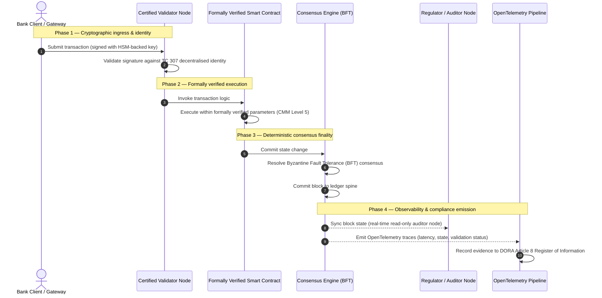

# Từ bằng chứng đến sự thật: vì sao blockchain được chứng nhận sẽ định hình kỷ nguyên tiếp theo của niềm tin ngân hàng

## Tóm tắt chiến lược (điều cốt yếu)

Ngân hàng bán buôn và các giao dịch toàn cầu năm 2026 đang ở một bước ngoặt lịch sử. Khi dịch vụ tài chính chuyển sang các mạng thanh toán bù trừ kỹ thuật số nguyên bản, thời gian thực, và khi trí tuệ nhân tạo đưa vào tính bất định xác suất, các mô hình bảo đảm truyền thống — tương tự và hồi cố (như kiểm toán tĩnh dựa trên thực thể) — không còn đáp ứng được các yêu cầu hiện đại về quản lý rủi ro và nghĩa vụ ủy thác.

Ủy ban Kỹ thuật ISO/IEC TC 307 đã thiết lập một nền tảng chuẩn hóa cho công nghệ sổ cái phân tán. Tuy nhiên, việc áp dụng thực sự ở cấp tổ chức đòi hỏi chuyển từ hướng dẫn mô tả sang bảo đảm blockchain mang tính quy định, có thể chứng nhận độc lập. Bằng cách chấm điểm quản trị sổ cái, tính toàn vẹn của đồng thuận, an toàn hợp đồng thông minh và sự linh hoạt mật mã theo một Mô hình Trưởng thành Năng lực (CMM) năm cấp nghiêm ngặt, các ngân hàng có thể chuyển từ những giả định rời rạc, riêng của từng nhà cung cấp sang một sự thật tài chính có thể chứng nhận, có thể được hội đồng quản trị kiểm toán.

## Những điểm chính

* **Khoảng cách ma sát ủy thác**: hiện nay chúng ta có thể chứng nhận ngân hàng (Basel III), đám mây (ISO 27001) và các hệ thống quản trị AI (ISO 42001), nhưng chưa thể chứng nhận sổ cái phân tán đang ngày càng quyết định điều gì là đúng. Sự bất đối xứng này là một lỗ hổng vận hành lớn.  
* **DORA áp đặt trách nhiệm ủy thác trực tiếp**: theo Điều 5 của DORA, hội đồng quản trị ngân hàng chịu trách nhiệm cá nhân trực tiếp, không thể ủy quyền đối với khả năng phục hồi vận hành của mọi triển khai bên thứ ba và sổ cái, với các chế tài cá nhân nghiêm khắc theo chế độ SM&CR khi có sai phạm.  
* **Xương sống kiểm toán của AI**: ở nơi học máy tạo ra kết quả xác suất, không thể tái lập, blockchain được chứng nhận cung cấp việc ghi nhận trạng thái mang tính tất định. Ghi các phiên bản mô hình, đầu vào và quyết định xác thực lên chuỗi đáp ứng ISO 42001 và các chuẩn quản lý rủi ro mô hình.  
* **Chỉ số Blockchain Được chứng nhận**: chỉ số này hình thức hóa quản trị, đồng thuận, hợp đồng thông minh và khả năng quan sát thành một bảng điểm có thể xác minh, sẵn sàng kiểm toán trên thang CMM từ 0 đến 5, chuyển các thước đo kỹ thuật thành các tuyên bố khẩu vị rủi ro được hội đồng phê duyệt.

## 01. Khoảng cách ma sát ủy thác trong ngân hàng số

Trong ngân hàng cổ điển, niềm tin mang tính quan hệ, thể chế và hồi cố. Nó dựa vào các kiểm toán viên bên thứ ba độc lập rà soát tình trạng tài chính tại các thời điểm cố định, đối chiếu các khác biệt giữa những kho sổ cái song phương. Trong các thị trường thời gian thực, do API dẫn dắt của năm 2026, mô hình này tạo ra độ trễ cấm đoán và rủi ro cấu trúc.

Khi các giao dịch được thanh toán tức thì, các bể thanh khoản trong ngày được quản lý động bằng các cổng API, và quyền sở hữu tài sản được token hóa trên các sổ cái chung, kiểm toán hồi cố trở thành bài tập pháp y thay vì kiểm soát phòng ngừa. Người ủy thác không thể chỉ dựa vào việc chứng nhận thực thể pháp lý. Họ phải chứng nhận chính nền tảng số.

Hiện nay, các ngân hàng vận hành dưới một sự bất đối xứng kiến trúc rõ rệt:

1. **Hạ tầng đám mây được chứng nhận**: các nút phần cứng, container ảo hóa và trung tâm dữ liệu vật lý được xác thực theo các kiểm soát ISO/IEC 27001 và SOC 2 Type II.  
2. **Quy trình quản lý được chứng nhận**: chính sách rủi ro vận hành, kế hoạch liên tục kinh doanh và các triển khai thuật toán được quản lý theo các khung rủi ro nghiêm ngặt.  
3. **Động cơ sổ cái chưa được chứng nhận**: cơ chế đồng thuận phân tán, chuỗi cung ứng nút xác thực, ranh giới hợp đồng thông minh và mô hình quản trị mạng bị bỏ mặc cho các giả định chưa được chứng nhận, tùy chỉnh hoặc riêng của từng liên minh.

Sự bất đối xứng này là một điểm hỏng nghiêm trọng. Một ngân hàng có thể chạy một ứng dụng đã xác thực bên trong một container đám mây an toàn, được chứng nhận ISO 27001, nhưng nếu container đó ghi vào một sổ cái phân tán có kiểm soát xác thực tập trung, tham số đồng thuận dễ tổn thương hoặc hợp đồng thông minh chưa được kiểm toán, thì tính toàn vẹn của giao dịch bị tổn hại. Để lấp khoảng cách này, chính động cơ sổ cái phải trở thành một đối tượng bảo đảm có thể chứng nhận.

## 02. Nền tảng chuẩn hóa ISO/IEC TC 307

Công việc nền tảng cần thiết để chuẩn hóa sổ cái phân tán đang được Ủy ban Kỹ thuật ISO/IEC TC 307 (Công nghệ blockchain và sổ cái phân tán) thiết lập. Thay vì coi blockchain là một giao thức kỹ thuật biệt lập, TC 307 tiếp cận nó như một hạ tầng niềm tin thể chế, tổ chức công việc quanh năm trụ cột cốt lõi:

1. **Phân loại và thuật ngữ (ISO 22739)**: thiết lập một hệ danh pháp chung, bảo đảm các định nghĩa pháp lý và vận hành nhất quán giữa các khu vực pháp lý, hệ thống tài chính và tổ chức.  
2. **Kiến trúc tham chiếu (ISO/TR 23245)**: xác định ranh giới, lớp, luồng dữ liệu và các thành phần chức năng của một hệ thống sổ cái phân tán tuân thủ.  
3. **An toàn, quyền riêng tư và hợp đồng thông minh (ISO/TR 23244 / ISO 23613)**: thiết lập các hướng dẫn an toàn nền tảng cho hệ thống tài sản số và trình bày chi tiết các thực hành tốt nhất về giảm thiểu lỗ hổng hợp đồng thông minh và quản trị vòng đời.  
4. **Khung liên vận hành**: giải quyết các cơ chế trao đổi dữ liệu và tài sản giữa các mạng sổ cái không đồng nhất, ngăn hình thành các kho token hóa biệt lập.  
5. **Danh tính phi tập trung và neo niềm tin**: tích hợp các định danh mật mã dựa trên sổ cái với hạ tầng khóa công khai (PKI) chính thức và các cơ quan đăng ký được nhà nước ủy quyền.

Nhìn chung, TC 307 báo hiệu sự chuyển đổi của DLT từ một lựa chọn kỹ thuật tùy chỉnh thành một kỷ luật kiến trúc chuẩn hóa. Tuy nhiên, TC 307 vẫn chủ yếu mang tính mô tả. Nó định nghĩa sự xuất sắc trông như thế nào (hướng dẫn), nhưng không cung cấp giao thức xác minh mang tính quy định (bảo đảm) mà các cán bộ rủi ro và cơ quan giám sát cần để phê duyệt triển khai sản xuất các chức năng quan trọng hoặc thiết yếu (CIF).

## 03. Hướng dẫn so với bảo đảm: sự phân biệt ủy thác

Các bên tham gia thị trường tài chính không triển khai công nghệ vì nó đổi mới hay tinh tế; họ triển khai khi nó có thể được quản trị, kiểm toán, bảo vệ và đối chiếu với yêu cầu dự trữ vốn. Đó là lý do việc chuẩn hóa trong ngân hàng tự nhiên phân thành hai lớp:

* **Hướng dẫn (khung)**: phác thảo các thực hành tốt nhất, mục tiêu tham chiếu và chỉ dẫn kiến trúc (ví dụ ISO/IEC TC 307, các khung của NIST).  
* **Bảo đảm (bằng chứng)**: cung cấp bằng chứng độc lập, liên tục và có thể xác minh bởi bên thứ ba rằng khung đã được triển khai và vận hành như thiết kế (ví dụ chứng nhận ISO 27001, kiểm toán SOC 2, thanh tra quy định).

Dựa vào đồng thuận sổ cái chưa được chứng nhận trong khi chứng nhận hạ tầng đám mây là một lỗ hổng quy định nghiêm trọng. Một blockchain "bất biến" không nhất thiết "được tin cậy ở cấp thể chế". Tính bất biến chỉ bảo đảm rằng dữ liệu đã nhập không bị thay đổi; nó không xác minh liệu các nút xác thực có an toàn không, giao thức đồng thuận có kháng thông đồng không, logic hợp đồng thông minh có đúng về mặt toán học không, hay việc quản lý khóa mật mã có tuân thủ các nhiệm vụ hậu lượng tử không.

Để đóng khoảng cách này, Chỉ số Blockchain Được chứng nhận 2026 hình thức hóa các yêu cầu này thành một Mô hình Trưởng thành Năng lực (CMM) có thể định lượng, ánh xạ tới các quy định ngân hàng toàn cầu.

## 04. Chỉ số Blockchain Được chứng nhận 2026

Để ban lãnh đạo cấp cao có thể đánh giá và chứng nhận các nền tảng sổ cái của mình, chỉ số này cấu trúc hạ tầng sổ cái phân tán thành năm lớp vận hành có thể kiểm toán, chấm điểm trên thang CMM từ 0 đến 5.

## Bảng 1: kiến trúc Chỉ số Blockchain Được chứng nhận

| Lớp chỉ số | Cấp trưởng thành (CMM) | Thước đo kỹ thuật và vận hành | Tham chiếu kiểm soát quy định / ủy thác |
| ---- | ---- | ---- | ---- |
| **Quản trị sổ cái** | **Cấp 0**: liên minh tạm thời**Cấp 3**: xét duyệt và luân chuyển nút xác thực tự động**Cấp 5**: neo danh tính mật mã phi tập trung, nhiều bên | % nút xác thực do các thực thể tài chính đã được xét duyệt vận hành; thời gian trung bình giải quyết tranh chấp giữa các nút xác thực; phân bố địa lý của các nút | **DORA Điều 5** (Quản trị và tổ chức); **CPMI-IOSCO PFMI Nguyên tắc 2** (Quản trị) và **Nguyên tắc 3** (Khung quản lý rủi ro toàn diện) |
| **Tính toàn vẹn đồng thuận** | **Cấp 0**: nút đơn hoặc PoW mờ đục**Cấp 3**: BFT đã kiểm toán với tính chung cuộc tất định**Cấp 5**: đồng thuận đa khu vực pháp lý, đã xác minh chính thức, với giám sát độ trễ liên tục | độ trễ đồng thuận tối đa chấp nhận được; ngưỡng kháng thông đồng; SLA khả dụng khi mô phỏng phân mảnh nút | **DORA Điều 6** (Khung quản lý rủi ro ICT); **CPMI-IOSCO PFMI Nguyên tắc 8** (Tính chung cuộc của thanh toán) |
| **Danh tính và mật mã** | **Cấp 0**: khóa RSA / ECDSA yếu**Cấp 3**: đa chữ ký với quản lý khóa dựa trên HSM**Cấp 5**: khóa lai an toàn lượng tử (FIPS 203 ML-KEM) và cổng riêng tư không kiến thức | % giao dịch sổ cái được ký bằng khóa dựa trên HSM; điểm sẵn sàng chuyển đổi PQC; độ trễ bằng chứng ZK | **NIST FIPS 203 / 204**; **ISO/IEC 27001** (Quản lý an toàn thông tin) |
| **Bảo đảm hợp đồng thông minh** | **Cấp 0**: script Solidity chưa kiểm toán**Cấp 3**: xác thực trình biên dịch tự động và kiểm toán bên ngoài**Cấp 5**: hợp đồng thông minh bất biến, đã xác minh chính thức, với nâng cấp kiểu cầu dao | % hợp đồng thông minh có xác minh chính thức toán học; số cảnh báo trình biên dịch; độ bao phủ quét lỗ hổng | **Hướng dẫn EBA về thuê ngoài** (đoạn 81, 113-117); **DORA Điều 30** (Điều khoản hợp đồng tối thiểu) |
| **Kiểm toán và khả năng quan sát** | **Cấp 0**: thu thập log thủ công**Cấp 3**: dấu vết OTel có cấu trúc và nút kiểm toán chỉ đọc**Cấp 5**: đối chiếu tự động, liên tục với sổ đăng ký theo Điều 8 | % giao dịch được bao phủ bởi dấu vết OpenTelemetry; độ trễ từ khi commit khối đến khi đồng bộ nút kiểm toán | **BCBS 239** (Tổng hợp dữ liệu rủi ro); **DORA Điều 8** (Sổ đăng ký thông tin / lược đồ ITS) |

## Bảng 2: các tín hiệu niềm tin chính ánh xạ tới các chuẩn ngân hàng toàn cầu

| Tín hiệu / chuẩn đối sánh | Thước đo | Tác động đến nền tảng ngân hàng | Nguồn quy định |
| ---- | ---- | ---- | ---- |
| **Tiến độ ISO/IEC TC 307** | Chuyển từ báo cáo kỹ thuật ISO/TR sang các sơ đồ chứng nhận chính thức | Thiết lập khung chuẩn hóa đầu tiên để chứng nhận động cơ sổ cái phân tán | **ISO/IEC JTC 1 / SC 44** (Công nghệ sổ cái phân tán) |
| **Giai đoạn nguyên mẫu Dự án Agorá** | Hơn 40 ngân hàng thương mại tham gia; thử nghiệm sổ cái hợp nhất cho tiền gửi token hóa | Chuyển thanh toán bù trừ xuyên biên giới từ nhắn tin (SWIFT) sang thanh toán token hóa nguyên tử | **Trung tâm Đổi mới của Ngân hàng Thanh toán Quốc tế (BIS)** |
| **Kiểm toán bên thứ ba DORA Điều 30** | 100% nhà cung cấp nút và máy chủ hạ tầng được kiểm toán theo tiêu chí an toàn | Loại bỏ "nút xác thực bóng tối"; bắt buộc minh bạch chuỗi cung ứng toàn diện | **Các Cơ quan Giám sát châu Âu (ESA)** |
| **ISO/IEC 42001 (quản trị AI)** | Log mô hình và huấn luyện AI được làm cho bất biến bằng mật mã trên chuỗi | Sử dụng blockchain làm sổ đăng ký bằng chứng bất biến ("xương sống kiểm toán") cho học máy | **ISO/IEC 42001:2023** (Công nghệ thông tin — Trí tuệ nhân tạo) |
| **Đủ vốn Basel III** | Giảm đệm vốn cho rủi ro vận hành dựa trên việc giảm độ phức tạp đã được ghi nhận | Các khung rủi ro vận hành chuẩn hóa ghi nhận trực tiếp khả năng phục hồi đã xác minh của sổ cái | **Ủy ban Basel về Giám sát Ngân hàng (BCBS)** |

## 05. "Xương sống kiểm toán" của AI: trí tuệ xác suất trên hạ tầng tất định

Một trong những vai trò chiến lược mạnh mẽ nhất của một blockchain được chứng nhận vào năm 2026 là hoạt động như một **"xương sống kiểm toán"** cho các triển khai trí tuệ nhân tạo. Các hệ thống tài chính hiện đại ngày càng mang tính xác suất. Chấm điểm tín dụng, phát hiện gian lận thời gian thực, giao dịch thuật toán và tương tác khách hàng tự chủ đều được điều khiển bởi các mô hình học máy tiến hóa, trôi dạt và thích nghi theo thời gian. Các mô hình này không tất định: với cùng một đầu vào tại hai thời điểm khác nhau, chúng có thể tạo ra các đầu ra khác nhau do trọng số động và huấn luyện liên tục.

Tính không tất định này đặt ra một thách thức quản trị sâu sắc theo **ISO/IEC 42001 (quản trị AI)** và các chuẩn quản lý rủi ro mô hình (MRM) (như **SR 11-7 của Cục Dự trữ Liên bang Hoa Kỳ** và **SS1/23 của PRA Anh**): *làm sao bạn kiểm toán, giải thích và bảo vệ các quyết định không thể tái lập một cách nghiêm ngặt?*

Một sổ cái phân tán được chứng nhận cung cấp đối trọng tất định. Ở nơi các mô hình AI vận hành theo xác suất, blockchain được chứng nhận ghi các tham số của chúng một cách tất định, thiết lập một xương sống bằng chứng không thể thay đổi:

* **Quản lý phiên bản mô hình và neo trọng số**: mỗi phiên bản mô hình được triển khai, các trọng số liên quan và tổng kiểm tra dữ liệu huấn luyện của nó được băm và ghi vào sổ cái tại thời điểm dựng, đáp ứng các yêu cầu chuỗi cung ứng **SLSA Level 3**.  
* **Ghi log đầu vào theo ngữ cảnh**: khi một mô hình AI thực hiện một quyết định quan trọng (ví dụ phê duyệt khoản vay hoặc gắn cờ một giao dịch), các đầu vào ngữ cảnh chính xác và băm mô hình được ghi vào sổ cái, tạo ra một lịch sử chống giả mạo.  
* **Khả năng kiểm toán mà không cần truy cập mã**: nếu một cơ quan quản lý hỏi "vì sao mô hình của bạn từ chối đơn xin tín dụng này vào ngày 3 tháng 6?", ngân hàng không cần phơi bày mã độc quyền hay cố tái tạo trạng thái chính xác của mô hình. Nó trình ra bản ghi trên chuỗi, được ký bằng mật mã, về đầu vào, trọng số và trạng thái xác thực.

Bằng cách neo các quyết định xác suất của mô hình học máy vào đồng thuận tất định của một blockchain được chứng nhận, tổ chức tạo ra một dòng thời gian các hành động tự động có thể bảo vệ, tái dựng và xác minh độc lập.

## 06. Trực quan hóa quy trình được chứng nhận từ đồng thuận đến kiểm toán

Sơ đồ tuần tự sau minh họa vòng đời của một giao dịch đi qua một nền tảng blockchain được chứng nhận, cho thấy cách các cổng xác thực, tính toàn vẹn đồng thuận, thực thi hợp đồng thông minh và phát telemetry lồng vào nhau để tạo ra bằng chứng quy định sẵn sàng cho hội đồng:

Đường tới hạn của chuỗi giao dịch này đòi hỏi mọi bước xác thực, thực thi và đồng thuận đều được ký bằng mật mã, bảo đảm nguồn gốc đầu-cuối. Nút kiểm toán của cơ quan quản lý đồng bộ trạng thái khối theo thời gian thực, loại bỏ nhu cầu đối chiếu tài chính thủ công, hồi cố.

## 07. Cẩm nang hội đồng cho các nhà quản lý cấp cao

Để điều hướng thành công quá trình chuyển từ niềm tin tổ chức sang niềm tin hạ tầng, lãnh đạo ngân hàng và các nhà quản lý cấp cao nên thực thi ngay bốn chỉ thị then chốt:

1. **Bắt buộc kiểm toán sổ cái trong quản lý rủi ro doanh nghiệp (ERM)**: áp dụng một chính sách theo đó không nền tảng sổ cái phân tán nào — riêng tư, công cộng hay liên minh — được triển khai cho các chức năng quan trọng hoặc thiết yếu (CIF) mà chưa được kiểm toán theo **kiến trúc Chỉ số Blockchain Được chứng nhận** năm lớp (tối thiểu CMM Cấp 3).  
2. **Tích hợp blockchain làm xương sống bằng chứng AI theo ISO 42001**: chỉ đạo Giám đốc Rủi ro và Kiến trúc sư AI trưởng tích hợp tất cả các mô hình học máy có tác động cao với một blockchain được chứng nhận, tạo ra một sổ đăng ký kiểm toán chống giả mạo về phiên bản mô hình, trọng số, đầu vào và quyết định.  
3. **Kiểm toán chuỗi cung ứng nút xác thực (DORA Điều 30)**: yêu cầu bộ phận mua sắm kiểm toán tất cả các bên thứ ba lưu trữ nút xác thực hoặc quản lý lưu trữ đám mây cho các mạng DLT, áp đặt các chuẩn an ninh mạng và khả năng phục hồi vận hành như đối với các nút đám mây nội bộ của ngân hàng.  
4. **Căn chỉnh kiến trúc sổ cái với CPMI-IOSCO và BCBS 239**: chỉ đạo đội kỹ thuật nền tảng căn chỉnh telemetry đầu ra của sổ cái trực tiếp với các yêu cầu báo cáo dữ liệu **BCBS 239**, và bảo đảm các tham số đồng thuận và tính chung cuộc của thanh toán tuân thủ nghiêm ngặt **Nguyên tắc 8 và 9 của CPMI-IOSCO**.

## 08. Câu hỏi thường gặp

**ISO/IEC TC 307 có phải là một chuẩn chứng nhận không?**  
Không. ISO/IEC TC 307 là một ủy ban kỹ thuật thiết lập thuật ngữ, kiến trúc tham chiếu và hướng dẫn an toàn. Dù nó định nghĩa "sự xuất sắc trông như thế nào" (hướng dẫn), ngành phải vận hành hóa các tài liệu này thành các sơ đồ chứng nhận chính thức, có thể kiểm toán (bảo đảm) để làm hài lòng các cơ quan giám sát ngân hàng.

**Một blockchain được chứng nhận hỗ trợ tuân thủ DORA như thế nào?**  
Theo Điều 5 của DORA, hội đồng ngân hàng chịu trách nhiệm cá nhân trực tiếp về khả năng phục hồi công nghệ. Một blockchain được chứng nhận cung cấp bằng chứng mật mã có thể xác minh về tính toàn vẹn đồng thuận, kiểm soát chuỗi cung ứng nút xác thực và an toàn hợp đồng thông minh, mang lại cho các thành viên hội đồng các "bước hợp lý" có thể ghi thành văn bản cần thiết để bảo vệ trước các khiếu nại trách nhiệm cá nhân theo SM&CR.

Sự khác biệt giữa kiểm toán sổ cái truyền thống và kiểm toán blockchain được chứng nhận là gì?  
Một kiểm toán truyền thống mang tính hồi cố: nó xác minh các bút toán thủ công và tệp tĩnh sau khi giao dịch đã được thanh toán. Một kiểm toán blockchain được chứng nhận là liên tục và thời gian thực; các nút xác thực, động cơ đồng thuận BFT và hợp đồng thông minh đã xác minh chính thức được chứng nhận để thực thi giao dịch một cách tất định, phát ra telemetry có cấu trúc (OpenTelemetry) liên tục xác thực tình trạng của hệ thống.

Blockchain công cộng có thể được chứng nhận cho mục đích ngân hàng không?  
Ở hầu hết các khu vực pháp lý, blockchain công cộng thuần túy không cần cấp phép không đáp ứng các quy định ngân hàng do thiếu xác minh danh tính nút xác thực, chi phí giao dịch khó lường và tính chung cuộc không tất định (ví dụ các nhánh xác suất proof-of-work/stake). Blockchain được chứng nhận trong ngân hàng thường sử dụng kiến trúc doanh nghiệp có cấp phép hoặc kiến trúc công cộng-lai được quản lý chặt, nơi các nhà vận hành nút xác thực là các thực thể tài chính được định danh và kiểm toán.

## 09. Tài liệu tham khảo

* Ủy ban Basel về Giám sát Ngân hàng (BCBS), 2013. *Principles for effective risk data aggregation and reporting (BCBS 239)*. Basel: Ngân hàng Thanh toán Quốc tế. Có tại: [https://www.bis.org/publ/bcbs239.pdf](https://www.bis.org/publ/bcbs239.pdf).  
* Committee on Payments and Market Infrastructures và Technical Committee of the International Organization of Securities Commissions (CPMI-IOSCO), 2012. *Principles for financial market infrastructures*. Basel: Ngân hàng Thanh toán Quốc tế. Có tại: [https://www.bis.org/cpmi/publ/d101a.pdf](https://www.bis.org/cpmi/publ/d101a.pdf).  
* Cơ quan Ngân hàng châu Âu (EBA), 2019. *EBA/GL/2019/02 — Guidelines on outsourcing arrangements*. Paris: EBA. Có tại: [https://www.eba.europa.eu/regulation-and-policy/internal-governance/guidelines-on-outsourcing-arrangements](https://www.eba.europa.eu/regulation-and-policy/internal-governance/guidelines-on-outsourcing-arrangements).  
* Nghị viện châu Âu và Hội đồng Liên minh châu Âu, 2022. *Quy định (EU) 2022/2554 về khả năng phục hồi vận hành số cho khu vực tài chính (DORA)*. Brussels: Công báo của Liên minh châu Âu. Có tại: [https://eur-lex.europa.eu/legal-content/EN/TXT/?uri=CELEX%3A32022R2554](https://eur-lex.europa.eu/legal-content/EN/TXT/?uri=CELEX%3A32022R2554).  
* ISO/IEC JTC 1/SC 42, 2023. *ISO/IEC 42001:2023 — Information technology — Artificial intelligence — Management system*. Geneva: Tổ chức Tiêu chuẩn hóa Quốc tế. Có tại: [https://www.iso.org/standard/81230.html](https://www.iso.org/standard/81230.html).  
* Ủy ban Kỹ thuật ISO/IEC 307, 2020. *ISO/IEC 22739:2020 — Blockchain and distributed ledger technologies — Vocabulary*. Geneva: Tổ chức Tiêu chuẩn hóa Quốc tế. Có tại: [https://www.iso.org/standard/73771.html](https://www.iso.org/standard/73771.html).  
* National Institute of Standards and Technology (NIST), 2026. *First Three Finalized Post-Quantum Encryption Standards (FIPS 203, 204, and 205)*. Gaithersburg: U.S. Department of Commerce. Có tại: [https://www.nist.gov/news-events/news/2024/08/nist-releases-first-3-finalized-post-quantum-encryption-standards](https://www.nist.gov/news-events/news/2024/08/nist-releases-first-3-finalized-post-quantum-encryption-standards).
