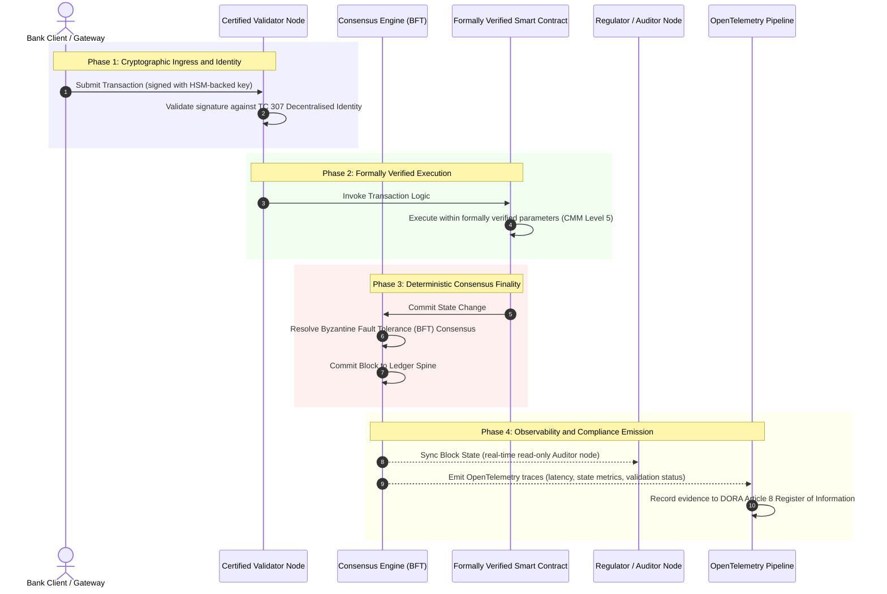

# Từ Bằng chứng đến Sự thật: Vì sao Blockchain được Chứng nhận sẽ Định hình Kỷ nguyên Mới của Niềm tin Ngân hàng

**Bất biến không đồng nghĩa với đáng tin.** Khi ngân hàng bán buôn chuyển sang thanh toán thời gian thực và AI xác suất, sổ cái quyết định điều gì là thật đã trở thành lớp duy nhất mà ngân hàng vẫn chưa thể chứng nhận. Họ chứng nhận pháp nhân theo Basel III, đám mây theo ISO 27001 và AI của mình theo ISO 42001, nhưng sổ cái phân tán, cùng với quản trị, đồng thuận, mật mã và hợp đồng thông minh của nó, lại bị bỏ mặc cho những giả định riêng của từng nhà cung cấp. Báo cáo này lập luận rằng để khép lại khoảng trống ủy thác đó, cần chuyển từ hướng dẫn ISO/IEC TC 307 sang bảo đảm mang tính quy định: chấm điểm sổ cái theo Chỉ số Blockchain Chứng nhận 5 cấp, biến các chỉ số kỹ thuật thành sự thật có thể kiểm toán ở cấp hội đồng và phòng thủ được theo DORA.

<!-- lead-start -->
<aside class="post-lead" aria-label="Tóm tắt bài viết">

<strong>TL;DR.</strong> Ngân hàng chứng nhận pháp nhân, đám mây và AI của mình, nhưng không phải sổ cái ngày càng quyết định điều gì là thật. ISO/IEC TC 307 đưa ra hướng dẫn, không phải bảo đảm. Chỉ số Blockchain Chứng nhận 5 cấp chấm điểm quản trị sổ cái, tính toàn vẹn của đồng thuận, danh tính và mật mã, bảo đảm hợp đồng thông minh và khả năng quan sát theo một Mô hình Trưởng thành Năng lực, khép lại khoảng trống ủy thác và trao cho AI xác suất một xương sống kiểm toán mang tính tất định.

<strong>Những điểm chính</strong>

<ul class="post-lead-takeaways">
  <li><strong>Khoảng trống ma sát ủy thác.</strong> Ngân hàng (Basel III), đám mây (ISO 27001) và hệ thống quản trị AI (ISO 42001) đều có thể được chứng nhận; sổ cái phân tán quyết định điều gì là thật thì chưa. Sự bất đối xứng đó là một lỗ hổng vận hành đang hiện hữu.</li>
  <li><strong>DORA khiến điều đó thành trách nhiệm cá nhân.</strong> Theo DORA Article 5, hội đồng quản trị ngân hàng gánh trách nhiệm trực tiếp, không thể ủy thác đối với khả năng chống chịu của các triển khai bên thứ ba và sổ cái, kèm theo các chế tài cá nhân SM&amp;CR khi thất bại.</li>
  <li><strong>Xương sống kiểm toán cho AI.</strong> Học máy không thể tái lập; một blockchain được chứng nhận ghi lại các phiên bản mô hình, đầu vào và quyết định xác thực một cách tất định trên chuỗi, đáp ứng ISO 42001 và các tiêu chuẩn quản lý rủi ro mô hình.</li>
  <li><strong>Chỉ số Blockchain Chứng nhận.</strong> Quản trị, đồng thuận, mật mã, hợp đồng thông minh và khả năng quan sát trở thành một bảng điểm CMM từ 0 đến 5, chuyển các chỉ số kỹ thuật thành Tuyên bố Khẩu vị Rủi ro được hội đồng phê duyệt.</li>
</ul>

<strong>Đọc thêm:</strong> <a href="https://sebastienrousseau.com/2026-07-02-certified-blockchains-banking-trust-tc307-assurance-2026">Blockchain được chứng nhận và niềm tin ngân hàng: Bảo đảm TC 307</a>, <a href="https://sebastienrousseau.com/2026-07-24-global-payments-outlook-operating-model-risk-revenue">Triển vọng Thanh toán Toàn cầu 2026</a>.

</aside>
<!-- lead-end -->

> **Tóm tắt cho lãnh đạo**
>
> - **Ngân hàng bán buôn đang ở điểm bước ngoặt.** Thanh toán bù trừ thời gian thực và AI xác suất phá vỡ mô hình bảo đảm tương tự, hồi cứu: các cuộc kiểm toán tĩnh, dựa trên pháp nhân không còn đáp ứng được các yêu cầu quản lý rủi ro hay ủy thác hiện đại.
> - **TC 307 là một mức nền, không phải một chứng chỉ.** ISO/IEC TC 307 đã chuẩn hóa từ vựng, kiến trúc tham chiếu và hướng dẫn bảo mật cho sổ cái phân tán, nhưng nó mang tính mô tả. Nó định nghĩa thế nào là tốt; nó không cung cấp việc kiểm chứng mang tính quy định mà các cán bộ rủi ro và cơ quan giám sát cần để phê duyệt triển khai sản xuất.
> - **Bảo đảm nghĩa là chấm điểm sổ cái.** Quản trị, tính toàn vẹn của đồng thuận, an toàn hợp đồng thông minh và tính linh hoạt mật mã, được chấm điểm theo một Mô hình Trưởng thành Năng lực 5 cấp nghiêm ngặt, đưa ngân hàng từ những giả định chắp vá, riêng của từng nhà cung cấp sang sự thật tài chính có thể chứng nhận và kiểm toán ở cấp hội đồng.
> - **Sổ cái là xương sống kiểm toán cho AI.** Neo các phiên bản mô hình, đầu vào và quyết định xác thực vào đồng thuận mang tính tất định trao cho học máy không thể tái lập một hồ sơ bằng chứng có thể phòng thủ và tái dựng theo ISO 42001, SR 11-7 và PRA SS1/23.

## Khoảng trống Ma sát Ủy thác trong Ngân hàng Số

Trong ngân hàng cổ điển, niềm tin mang tính quan hệ, thể chế và hồi cứu. Nó phụ thuộc vào các kiểm toán viên độc lập, bên thứ ba rà soát trạng thái tài chính tại những thời điểm tĩnh, đối chiếu các chênh lệch giữa những kho sổ cái song phương tách biệt. Trong các thị trường thời gian thực, dựa trên API của năm 2026, mô hình này tạo ra độ trễ và rủi ro cấu trúc không thể chấp nhận.

Khi các giao dịch thanh toán tức thời, các bể thanh khoản trong ngày được quản lý động bởi các cổng API, và quyền sở hữu tài sản được token hóa trên các sổ cái dùng chung, kiểm toán hồi cứu trở thành bài tập pháp y thay vì kiểm soát phòng ngừa. Người ủy thác không còn có thể chỉ dựa vào việc chứng nhận pháp nhân doanh nghiệp. Họ phải chứng nhận chính nền tảng số.

Hiện tại, các ngân hàng vận hành dưới một sự bất đối xứng kiến trúc rõ rệt:

1. **Hạ tầng Đám mây được Chứng nhận**: Các nút phần cứng, container ảo hóa và trung tâm dữ liệu vật lý được kiểm chứng theo các kiểm soát ISO/IEC 27001 và SOC 2 Type II.  
2. **Quy trình Quản lý được Chứng nhận**: Các chính sách rủi ro vận hành, kế hoạch duy trì hoạt động liên tục và triển khai thuật toán được quản trị theo các khung rủi ro nghiêm ngặt.  
3. **Bộ máy Sổ cái Chưa được Chứng nhận**: Các cơ chế đồng thuận phân tán cốt lõi, chuỗi cung ứng nút xác thực, ranh giới hợp đồng thông minh và các mô hình quản trị mạng lưới bị bỏ mặc cho những giả định chưa được chứng nhận, tùy biến hoặc riêng của từng liên minh.

Sự bất đối xứng này là một điểm gãy lớn. Một ngân hàng có thể chạy một ứng dụng đã được kiểm chứng bên trong một container đám mây an toàn, được chứng nhận ISO 27001, nhưng nếu container đó ghi vào một sổ cái phân tán có quyền kiểm soát nút xác thực tập trung, các tham số đồng thuận dễ tổn thương, hoặc hợp đồng thông minh chưa được kiểm toán, thì tính toàn vẹn giao dịch bị tổn hại. Để bắc cầu qua khoảng trống này, chính bộ máy sổ cái phải trở thành một đối tượng bảo đảm có thể chứng nhận.

## Mức nền Chuẩn hóa ISO/IEC TC 307

Công việc nền tảng cần thiết để chuẩn hóa sổ cái phân tán đang được thiết lập bởi Ủy ban Kỹ thuật ISO/IEC 307 (TC 307\) (Công nghệ blockchain và sổ cái phân tán). Thay vì xem blockchain như một giao thức kỹ thuật đơn lẻ, TC 307 tiếp cận nó như một hạ tầng niềm tin thể chế, tổ chức công việc quanh năm trụ cột cốt lõi:

1. **Phân loại và Từ vựng (ISO 22739\)**: Thiết lập một hệ danh pháp chung, bảo đảm các định nghĩa pháp lý và vận hành nhất quán giữa các khu vực pháp lý, chương trình tài chính và tổ chức khác nhau.  
2. **Kiến trúc Tham chiếu (ISO/TR 23245\)**: Xác định ranh giới, các tầng, luồng dữ liệu và các thành phần chức năng của một hệ thống sổ cái phân tán tuân thủ.  
3. **Bảo mật, Quyền riêng tư và Hợp đồng thông minh (ISO/TR 23244 / ISO 23613\)**: Thiết lập các hướng dẫn bảo mật nền cho hệ thống tài sản số và trình bày chi tiết các thực hành tốt nhất để giảm thiểu lỗ hổng hợp đồng thông minh và quản trị vòng đời.  
4. **Khung Khả năng Tương tác**: Giải quyết các cơ chế trao đổi dữ liệu và tài sản giữa các mạng sổ cái không đồng nhất, ngăn hình thành các kho token hóa tách biệt.  
5. **Danh tính Phi tập trung và Neo Niềm tin**: Tích hợp các định danh mật mã dựa trên sổ cái với các hạ tầng khóa công khai chính thức (PKI) và các cơ quan đăng ký được nhà nước ủy quyền.

Nhìn chung, TC 307 báo hiệu sự chuyển đổi của DLT từ một lựa chọn kỹ thuật tùy biến thành một kỷ luật kiến trúc được chuẩn hóa. Tuy nhiên, TC 307 vẫn chủ yếu mang tính mô tả. Nó định nghĩa thế nào là tốt (hướng dẫn), nhưng nó không cung cấp giao thức kiểm chứng mang tính quy định (bảo đảm) mà các cán bộ rủi ro và cơ quan giám sát yêu cầu để phê duyệt triển khai sản xuất các chức năng trọng yếu hoặc quan trọng (CIFs).

## Hướng dẫn và Bảo đảm: Sự Phân biệt Ủy thác

Các bên tham gia thị trường tài chính không triển khai công nghệ vì nó đổi mới hay tinh tế; họ triển khai nó khi nó có thể được quản trị, kiểm toán, phòng thủ và đối chiếu với các yêu cầu dự trữ vốn. Đây là lý do vì sao việc chuẩn hóa trong ngân hàng tự nhiên phân giải thành hai lớp:

* **Hướng dẫn (Khung)**: Phác thảo các thực hành tốt nhất, mục tiêu tham chiếu và hướng dẫn kiến trúc (ví dụ: ISO/IEC TC 307, các khung của NIST).  
* **Bảo đảm (Bằng chứng)**: Cung cấp bằng chứng độc lập, liên tục và có thể kiểm chứng bởi bên thứ ba rằng khung đó được triển khai và vận hành đúng như thiết kế (ví dụ: chứng nhận ISO 27001, kiểm toán SOC 2, các cuộc kiểm tra của cơ quan quản lý).

Dựa vào đồng thuận sổ cái chưa được chứng nhận trong khi lại chứng nhận hạ tầng đám mây là một khoảng trống quản lý nghiêm trọng. Một blockchain "bất biến" chưa hẳn đã được "tin tưởng ở cấp thể chế." Tính bất biến chỉ bảo đảm rằng dữ liệu đã nhập không bị thay đổi; nó không kiểm chứng rằng các nút xác thực an toàn, giao thức đồng thuận có khả năng chống thông đồng, logic hợp đồng thông minh đúng đắn về mặt toán học, hay việc quản lý khóa mật mã tuân thủ các yêu cầu hậu lượng tử.

Để khép lại khoảng trống này, Chỉ số Blockchain Chứng nhận 2026 chính thức hóa các yêu cầu này thành một Mô hình Trưởng thành Năng lực (CMM) có thể định lượng, ánh xạ tới các quy định ngân hàng toàn cầu.

## Chỉ số Blockchain Chứng nhận 2026

Để giúp ban lãnh đạo cấp cao đánh giá và chứng nhận các nền tảng sổ cái của mình, chỉ số này cấu trúc hạ tầng sổ cái phân tán thành năm lớp vận hành có thể kiểm toán, được chấm điểm trên thang CMM từ 0 đến 5.

### Bảng 1: Kiến trúc Chỉ số Blockchain Chứng nhận

| Lớp Chỉ số | Cấp độ Trưởng thành Năng lực (CMM) | Chỉ số Kỹ thuật và Vận hành | Tham chiếu Kiểm soát Quản lý / Ủy thác |
| ---- | ---- | ---- | ---- |
| **Quản trị Sổ cái** | **Level 0**: Liên minh tùy hứng**Level 3**: Thẩm định & luân chuyển nút xác thực tự động**Level 5**: Neo danh tính mật mã đa bên, phi tập trung | % nút xác thực do các pháp nhân tài chính đã được thẩm định vận hành; thời gian trung bình để giải quyết tranh chấp nút xác thực; phân bố địa lý của các nút | **DORA Article 5** (Quản trị và Tổ chức); **CPMI-IOSCO PFMI Principle 2** (Quản trị) & **Principle 3** (Khung quản lý rủi ro toàn diện) |
| **Tính Toàn vẹn của Đồng thuận** | **Level 0**: Đơn nút hoặc POW mờ đục**Level 3**: BFT được kiểm toán với tính chung cuộc tất định**Level 5**: Đồng thuận được kiểm chứng hình thức, đa khu vực pháp lý với giám sát độ trễ liên tục | Độ trễ đồng thuận tối đa chấp nhận được; ngưỡng chống thông đồng; SLA thời gian hoạt động dưới phân mảnh nút mô phỏng | **DORA Article 6** (Khung Quản lý Rủi ro ICT); **CPMI-IOSCO PFMI Principle 8** (Tính chung cuộc của Thanh toán) |
| **Danh tính & Mật mã** | **Level 0**: Khóa RSA / ECDSA yếu**Level 3**: Đa chữ ký với quản lý khóa dựa trên HSM**Level 5**: Khóa lai an toàn lượng tử (FIPS 203 ML-KEM) và các cổng riêng tư không kiến thức | % giao dịch sổ cái được ký bằng khóa dựa trên HSM; điểm sẵn sàng chuyển đổi PQC; độ trễ chứng minh ZK | **NIST FIPS 203 / 204**; **ISO/IEC 27001** (Quản lý An toàn Thông tin) |
| **Bảo đảm Hợp đồng thông minh** | **Level 0**: Kịch bản solidity chưa được kiểm toán**Level 3**: Kiểm chứng trình biên dịch tự động & kiểm toán bên ngoài**Level 5**: Hợp đồng thông minh bất biến, được kiểm chứng hình thức với nâng cấp cầu dao ngắt | % hợp đồng thông minh có kiểm chứng hình thức toán học; số lượng cảnh báo trình biên dịch; độ phủ quét lỗ hổng | **EBA Guidelines on Outsourcing Arrangements** (Đoạn 81, 113-117); **DORA Article 30** (Điều khoản Hợp đồng Tối thiểu) |
| **Kiểm toán & Khả năng Quan sát** | **Level 0**: Quét log thủ công**Level 3**: Vết OTel có cấu trúc & nút kiểm toán chỉ đọc**Level 5**: Đối chiếu tự động, liên tục tới sổ đăng ký Article 8 | % giao dịch được bao phủ bởi vết OpenTelemetry; độ trễ từ khi commit khối sổ cái đến khi đồng bộ nút kiểm toán | **BCBS 239** (Tổng hợp Dữ liệu Rủi ro); **DORA Article 8** (Sổ đăng ký Thông tin / Lược đồ ITS) |

### Bảng 2: Các Tín hiệu Niềm tin Chính Ánh xạ tới các Tiêu chuẩn Ngân hàng Toàn cầu

| Tín hiệu / Chuẩn tham chiếu | Chỉ số | Tác động lên Nền tảng Ngân hàng | Nguồn Quản lý |
| ---- | ---- | ---- | ---- |
| **Tiến độ ISO/IEC TC 307** | Chuyển từ báo cáo kỹ thuật ISO/TR sang các chương trình chứng nhận chính thức | Thiết lập khung chuẩn hóa đầu tiên để chứng nhận các bộ máy sổ cái phân tán | **ISO/IEC JTC 1 / SC 44** (Công nghệ Sổ cái Phân tán) |
| **Giai đoạn Nguyên mẫu Dự án Agorá** | Hơn 40 ngân hàng thương mại tham gia; thử nghiệm sổ cái hợp nhất cho tiền gửi token hóa | Chuyển thanh toán bù trừ xuyên biên giới từ nhắn tin (SWIFT) sang thanh toán token hóa nguyên tử | **Trung tâm Đổi mới của Ngân hàng Thanh toán Quốc tế (BIS)** |
| **Kiểm toán Bên thứ ba theo DORA Article 30** | 100% nhà cung cấp nút và đơn vị lưu trữ hạ tầng được kiểm toán theo các tiêu chí bảo mật | Loại bỏ "nút xác thực bóng tối"; bắt buộc minh bạch toàn bộ chuỗi cung ứng | **Các Cơ quan Giám sát châu Âu (ESA)** |
| **ISO/IEC 42001 (Quản trị AI)** | Nhật ký mô hình và huấn luyện AI được làm bất biến bằng mật mã trên chuỗi | Sử dụng blockchain làm sổ cái bằng chứng bất biến ("xương sống kiểm toán") cho học máy | **ISO/IEC 42001:2023** (Công nghệ thông tin, Trí tuệ nhân tạo) |
| **Đủ vốn theo Basel III** | Giảm bộ đệm vốn rủi ro vận hành dựa trên việc giảm độ phức tạp được ghi nhận | Các khung rủi ro vận hành chuẩn hóa ghi nhận trực tiếp khả năng chống chịu sổ cái đã được kiểm chứng | **Ủy ban Basel về Giám sát Ngân hàng (BCBS)** |

## Xương sống Kiểm toán của AI: Trí tuệ Xác suất trên Hạ tầng Tất định

Một trong những vai trò chiến lược mạnh mẽ nhất của một blockchain được chứng nhận trong năm 2026 là đóng vai trò **"Xương sống Kiểm toán"** cho các triển khai trí tuệ nhân tạo. Các hệ thống tài chính hiện đại ngày càng mang tính xác suất. Chấm điểm tín dụng, phát hiện gian lận thời gian thực, giao dịch thuật toán và tương tác khách hàng tự động đều được vận hành bởi các mô hình học máy tiến hóa, trôi dạt và thích nghi theo thời gian. Các mô hình này không tất định: với cùng một đầu vào tại hai thời điểm khác nhau, chúng có thể cho ra các đầu ra khác nhau do trọng số động và huấn luyện liên tục.

Sự không tất định này tạo ra một thách thức quản trị sâu sắc theo **ISO/IEC 42001 (Quản trị AI)** và các tiêu chuẩn **Quản lý Rủi ro Mô hình (MRM)** (chẳng hạn như **US Federal Reserve SR 11-7** và **UK PRA SS1/23**): *Làm thế nào để bạn kiểm toán, giải thích và phòng thủ những quyết định không thể tái lập một cách chính xác?*

Một sổ cái phân tán được chứng nhận cung cấp đối trọng tất định. Trong khi các mô hình AI vận hành theo xác suất, blockchain được chứng nhận ghi lại các tham số của chúng một cách tất định, thiết lập một xương sống bằng chứng không thể thay đổi:

* **Đánh phiên bản Mô hình và Neo Trọng số**: Mỗi phiên bản mô hình được triển khai, các trọng số liên quan và tổng kiểm dữ liệu huấn luyện của nó được băm và ghi vào sổ cái tại thời điểm dựng, đáp ứng các yêu cầu chuỗi cung ứng **SLSA Level 3**.  
* **Ghi nhật ký Đầu vào theo Ngữ cảnh**: Khi một mô hình AI thực thi một quyết định trọng yếu (ví dụ: phê duyệt một khoản vay hoặc gắn cờ một giao dịch), các đầu vào ngữ cảnh chính xác và các băm mô hình được ghi vào sổ cái, tạo ra một lịch sử có bằng chứng chống giả mạo.  
* **Khả năng Kiểm toán mà không cần Truy cập Mã nguồn**: Nếu một cơ quan quản lý hỏi, "Vì sao mô hình của bạn từ chối đơn xin tín dụng này vào ngày 3 tháng 6?" ngân hàng không cần phơi bày mã nguồn độc quyền hay cố tái tạo trạng thái mô hình chính xác. Ngân hàng trình ra bản ghi sổ cái trên chuỗi, được ký bằng mật mã, về các đầu vào, trọng số và trạng thái xác thực.

Bằng cách neo các quyết định xác suất của các mô hình học máy vào đồng thuận tất định của một blockchain được chứng nhận, tổ chức tạo ra một dòng thời gian các hành động tự động có thể phòng thủ, tái dựng và kiểm chứng độc lập.

## Trực quan hóa Đường ống Đồng thuận-đến-Kiểm toán được Chứng nhận

Sơ đồ tuần tự dưới đây minh họa vòng đời của một giao dịch đi qua một nền tảng blockchain được chứng nhận, cho thấy các cổng kiểm chứng, tính toàn vẹn của đồng thuận, thực thi hợp đồng thông minh và phát tín hiệu đo lường lồng khớp với nhau như thế nào để tạo ra bằng chứng quản lý sẵn sàng cho hội đồng:

Đường đi trọng yếu cho chuỗi giao dịch này đòi hỏi mọi bước kiểm chứng, thực thi và đồng thuận đều được ký bằng mật mã, bảo đảm truy xuất nguồn gốc đầu-cuối. Nút kiểm toán của cơ quan quản lý đồng bộ trạng thái khối theo thời gian thực, loại bỏ nhu cầu đối chiếu tài chính thủ công, hồi cứu.

## Cẩm nang Hội đồng Quản trị cho Cán bộ Quản lý Cấp cao

Để quản lý thành công sự dịch chuyển từ niềm tin tổ chức sang niềm tin hạ tầng, các lãnh đạo và cán bộ quản lý cấp cao của ngân hàng nên thực hiện ngay bốn chỉ thị then chốt:

1. **Bắt buộc Kiểm toán Sổ cái trong Quản lý Rủi ro Doanh nghiệp (ERM)**: Thực thi một chính sách rằng không nền tảng sổ cái phân tán nào, dù là riêng tư, công khai hay dựa trên liên minh, được triển khai cho các chức năng trọng yếu hoặc quan trọng (CIFs) trừ khi nó đã được kiểm toán theo **Kiến trúc Chỉ số Blockchain Chứng nhận** 5 lớp (tối thiểu CMM Level 3).  
2. **Tích hợp Blockchain làm Xương sống Bằng chứng AI theo ISO 42001**: Chỉ đạo Giám đốc Rủi ro và Kiến trúc sư AI Trưởng tích hợp tất cả các mô hình học máy có tác động cao với một blockchain được chứng nhận, tạo ra một sổ cái kiểm toán chống giả mạo về các phiên bản mô hình, trọng số, đầu vào và quyết định.  
3. **Kiểm toán Chuỗi Cung ứng Nút Xác thực (DORA Article 30\)**: Yêu cầu bộ phận mua sắm kiểm toán tất cả các pháp nhân bên thứ ba lưu trữ nút xác thực hoặc quản lý lưu trữ đám mây cho các mạng DLT, bắt buộc tuân thủ cùng các tiêu chuẩn an ninh mạng và khả năng chống chịu vận hành áp dụng cho các nút đám mây nội bộ của ngân hàng.  
4. **Căn chỉnh Kiến trúc Sổ cái với CPMI-IOSCO và BCBS 239**: Chỉ đạo đội kỹ thuật nền tảng căn chỉnh tín hiệu đo lường đầu ra của sổ cái trực tiếp với các yêu cầu báo cáo dữ liệu **BCBS 239**, và bảo đảm các tham số đồng thuận và tính chung cuộc của thanh toán tuân thủ nghiêm ngặt **CPMI-IOSCO Principles 8 và 9**.

## Câu hỏi Thường gặp

**ISO/IEC TC 307 có phải là một tiêu chuẩn chứng nhận không?**  
Không. ISO/IEC TC 307 là một ủy ban kỹ thuật thiết lập từ vựng, kiến trúc tham chiếu và hướng dẫn bảo mật. Dù nó định nghĩa "thế nào là tốt" (hướng dẫn), ngành phải vận hành hóa các tài liệu này thành các chương trình chứng nhận chính thức, có thể kiểm toán (bảo đảm) để đáp ứng các cơ quan giám sát ngân hàng.

**Một blockchain được chứng nhận hỗ trợ tuân thủ DORA như thế nào?**  
Theo DORA Article 5, hội đồng quản trị ngân hàng gánh trách nhiệm cá nhân, trực tiếp đối với khả năng chống chịu công nghệ. Một blockchain được chứng nhận cung cấp bằng chứng mật mã, có thể kiểm chứng về tính toàn vẹn của đồng thuận, quyền kiểm soát chuỗi cung ứng nút xác thực và an toàn hợp đồng thông minh, trao cho các thành viên hội đồng "các bước hợp lý" có thể ghi chép để phòng thủ trước các cáo buộc trách nhiệm cá nhân theo SM\&CR.

**Sự khác biệt giữa một cuộc kiểm toán sổ cái truyền thống và một cuộc kiểm toán blockchain được chứng nhận là gì?**  
Một cuộc kiểm toán truyền thống mang tính hồi cứu, kiểm chứng các mục nhập thủ công và các tệp tĩnh sau khi giao dịch đã thanh toán bù trừ. Một cuộc kiểm toán blockchain được chứng nhận mang tính liên tục và thời gian thực; các nút xác thực, bộ máy đồng thuận BFT và các hợp đồng thông minh được kiểm chứng hình thức được chứng nhận để thực thi giao dịch một cách tất định, phát ra tín hiệu đo lường có cấu trúc (OpenTelemetry) liên tục kiểm chứng sức khỏe của hệ thống.

**Blockchain công khai có thể được chứng nhận cho sử dụng ngân hàng không?**  
Ở hầu hết các khu vực pháp lý, các blockchain công khai phi cấp phép thuần túy không đáp ứng được các quy định ngân hàng do thiếu kiểm chứng danh tính nút xác thực, chi phí gas/giao dịch không dự đoán được, và tính chung cuộc không tất định (ví dụ: các nhánh proof-of-work/stake mang tính xác suất). Các blockchain được chứng nhận trong ngân hàng thường sử dụng các kiến trúc doanh nghiệp có cấp phép hoặc công khai-lai được quản lý chặt chẽ, trong đó các đơn vị vận hành nút xác thực là các pháp nhân tài chính được định danh và kiểm toán.

## Tài liệu tham khảo

* Ủy ban Basel về Giám sát Ngân hàng (BCBS), 2013\. *Các nguyên tắc về tổng hợp và báo cáo dữ liệu rủi ro hiệu quả (BCBS 239\)*. Basel: Ngân hàng Thanh toán Quốc tế. Có tại: [Ủy ban Basel về Giám sát Ngân hàng (BCBS), 2013\.](https://www.bis.org/publ/bcbs239.pdf "Ủy ban Basel về Giám sát Ngân hàng (BCBS), 2013\.").  
* Ủy ban Thanh toán và Hạ tầng Thị trường và Ủy ban Kỹ thuật của Tổ chức Quốc tế các Ủy ban Chứng khoán (CPMI-IOSCO), 2012\. *Các nguyên tắc cho hạ tầng thị trường tài chính*. Basel: Ngân hàng Thanh toán Quốc tế. Có tại: [Ủy ban Thanh toán và Hạ tầng Thị trường và Ủy ban Kỹ thuật của Tổ chức Quốc tế các Ủy ban Chứng khoán (CPMI-IOSCO), 2012\.](https://www.bis.org/cpmi/publ/d101.htm "Ủy ban Thanh toán và Hạ tầng Thị trường và Ủy ban Kỹ thuật của Tổ chức Quốc tế các Ủy ban Chứng khoán (CPMI-IOSCO), 2012\.").  
* Cơ quan Ngân hàng châu Âu (EBA), 2019\. *EBA/GL/2019/02, Hướng dẫn về các thỏa thuận thuê ngoài*. Paris: EBA. Có tại: [Cơ quan Ngân hàng châu Âu (EBA), 2019\.](https://www.eba.europa.eu/regulation-and-policy/internal-governance/guidelines-on-outsourcing-arrangements "Cơ quan Ngân hàng châu Âu (EBA), 2019\.").  
* Nghị viện châu Âu và Hội đồng Liên minh châu Âu, 2022\. *Quy định (EU) 2022/2554 về khả năng chống chịu vận hành số cho lĩnh vực tài chính (DORA)*. Brussels: Công báo Liên minh châu Âu. Có tại: [Nghị viện châu Âu và Hội đồng Liên minh châu Âu, 2022\.](https://eur-lex.europa.eu/legal-content/EN/TXT/?uri=CELEX%3A32022R2554 "Nghị viện châu Âu và Hội đồng Liên minh châu Âu, 2022\.").  
* ISO/IEC JTC 1/SC 42, 2023\. *ISO/IEC 42001:2023, Công nghệ thông tin, Trí tuệ nhân tạo, Hệ thống quản lý*. Geneva: Tổ chức Tiêu chuẩn hóa Quốc tế. Có tại: [ISO/IEC JTC 1/SC 42, 2023\.](https://www.iso.org/standard/81230.html "ISO/IEC JTC 1/SC 42, 2023\.").  
* Ủy ban Kỹ thuật ISO/IEC 307, 2020\. *ISO/IEC 22739:2020, Công nghệ blockchain và sổ cái phân tán, Từ vựng*. Geneva: Tổ chức Tiêu chuẩn hóa Quốc tế. Có tại: [Ủy ban Kỹ thuật ISO/IEC 307, 2020\.](https://www.iso.org/standard/73771.html "Ủy ban Kỹ thuật ISO/IEC 307, 2020\.").  
* Viện Tiêu chuẩn và Công nghệ Quốc gia (NIST), 2026\. *Ba Tiêu chuẩn Mã hóa Hậu lượng tử Được hoàn thiện Đầu tiên (FIPS 203, 204, và 205\)*. Gaithersburg: Bộ Thương mại Hoa Kỳ. Có tại: [Viện Tiêu chuẩn và Công nghệ Quốc gia (NIST), 2026\.](https://www.nist.gov/news-events/news/2024/08/nist-releases-first-3-finalized-post-quantum-encryption-standards "Viện Tiêu chuẩn và Công nghệ Quốc gia (NIST), 2026\.").

