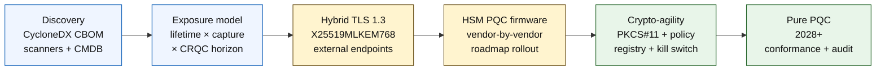

# Atọ́ka Bánkì Aláàbò-Quantum ní 2026: Cryptography Lẹ́yìn-Quantum, QKD, Crypto-Agility, àti Ewu Harvest-Now-Decrypt-Later

<!-- lead-start: manual -->
<aside class="post-lead" aria-label="Àkótán àpilẹ̀kọ">

<strong>TL;DR.</strong> Bánkì aláàbò-quantum ní 2026 jẹ́ ètò ìfijíṣẹ́ pẹ̀lú ìpinnu àkókò tí ìsọdimọ́ àwọn ọ̀nà méjì ti gbé kalẹ̀ — ìgbà ìkọ̀kọ̀ ti data tí ilé-iṣẹ́ ní lóní, àti àkókò dídé Cryptographically Relevant Quantum Computer (CRQC). NIST FIPS 203 / 204 / 205 ti pé láti August 2024; CNSA 2.0 ti gbé ipò ìparí àpapọ̀ ìjọba US sí 2033; harvest-now-decrypt-later ti ń ṣẹlẹ̀ tẹ́lẹ̀ lórí data tó pẹ́. Scorecard Quantum Ipele-Board ń tọpa ìpín mẹ́rin gangan: ìpé àkójọ, ìfihàn HNDL, ìtẹ̀síwájú ìṣíkiri NIST, ìmúrasílẹ̀ crypto-agility.

<strong>Àwọn kókó pàtàkì</strong>

<ul class="post-lead-takeaways">
  <li><strong>Ìjiyàn algorithm parí ní 13 August 2024.</strong> ML-KEM (FIPS 203), ML-DSA (FIPS 204), SLH-DSA (FIPS 205) ni ìdáhùn. Àwọn bánkì tí ó ṣì ń ṣe ìfọwọ́sí inú láti "yan olúborí" ti pẹ́ jù ní oṣù mẹ́tàdínlógún.</li>
  <li><strong>Harvest-now-decrypt-later ti ń ṣiṣẹ́ tẹ́lẹ̀.</strong> Ohunkóhun tí ìgbà ìkọ̀kọ̀ rẹ̀ kọjá dídé CRQC tó ṣeéfọ̀hùnyàn — àwọn mortgage ọdún 30, ìkọ̀wé ìṣẹ́dájúkòkò ẹ̀mí, ìgbasílẹ̀ ìṣòwò MiFID II / GDPR, àwọn archive ìpamọ́ M&amp;A — gbọdọ̀ lọ sí ìṣànwọ́ kọ́kọ́rọ́ hybrid aláàbò-quantum nísinsìnyí, kì í ṣe nígbà tí a bá ti ṣe ìkéde CRQC.</li>
  <li><strong>Àkójọ ni ìdàgbàsókè tó ń ṣàkóso.</strong> Cryptographic Bill of Materials (CBOM) — ìlànà ìjùmọ̀sọ̀rọ̀, library, ìwé-ẹ̀rí, ìpín HSM, àfọwọ́sọ̀ vendor, oníṣẹ́ àpilẹ̀kọ, ìgbà ìpín-data — ni àkọ́kọ́ fún ohun gbogbo mìíràn. Tọpa ìtuntun, kì í ṣe ìbojú.</li>
  <li><strong>TLS 1.3 hybrid ni ìfiránṣẹ́ 2026.</strong> Ìpín kọ́kọ́rọ́ hybrid X25519MLKEM768 ni ohun tí Chrome / Firefox / Cloudflare / Akamai ń ṣètò ní gbangba lóní. ML-KEM TLS dájú ń dúró fún firmware HSM àti ìmúrasílẹ̀ CA.</li>
  <li><strong>Crypto-agility ni ohun tó wà gbére tó yẹ ó tọ́jú.</strong> Abstraction PKCS#11, àwọn kọ́kọ́rọ́ alámì, policy registry tó so iṣẹ́ ìṣòwò pọ̀ mọ́ àkójọ algorithm tí a yọ̀ǹda. Láìsí rẹ̀, ìyípadà algorithm tó ń bọ̀ jẹ́ ètò ọdún púpọ̀ mìíràn.</li>
</ul>
</aside>
<!-- lead-end -->

Bánkì aláàbò-quantum ní 2026 dá lórí ìṣíkiri ìṣiṣẹ́, kì í ṣe àròsọ. NIST ti parí àwọn ìlànà cryptography lẹ́yìn-quantum mẹ́ta àkọ́kọ́, àwọn bánkì sì gbọdọ̀ mọ ètò wo ló dá lórí RSA, ECC, TLS, àwọn àmì-iṣẹ́, HSM, ìwé-ẹ̀rí, àwọn ìjùmọ̀sọ̀rọ̀ ìsanwó, archive, àti data ìkọ̀kọ̀ tó pẹ́. Ìbéèrè atọ́ka rọrùn: ǹjẹ́ ilé-iṣẹ́ lè yí cryptography padà kí ìhàlẹ̀ tó di ìṣiṣẹ́?

---

> **Àkótán Aṣáájú / Àwọn Kókó Pàtàkì**
>
> - **Àwọn ìlànà NIST ti dájú nísinsìnyí.** FIPS 203 ṣàlàyé ML-KEM fún ìṣànwọ́ kọ́kọ́rọ́, FIPS 204 ṣàlàyé ML-DSA fún àwọn àmì-iṣẹ́, FIPS 205 sì ṣàlàyé SLH-DSA gẹ́gẹ́ bí ìlànà àmì-iṣẹ́ tó dá lórí hash láìsí ipò.
> - **Àkójọ ni ẹnu-ọ̀nà ìdàgbàsókè àkọ́kọ́.** Bánkì kò lè ṣíkiri ohun tí kò lè rí: àwọn ìwé-ẹ̀rí, kọ́kọ́rọ́, ìlànà ìjùmọ̀sọ̀rọ̀, àpilẹ̀kọ, vendor, HSM, API, archive, àti ètò ìfibọ́ gbọdọ̀ wà nínú àwòrán.
> - **Crypto-agility ni àfojúsùn tó wà gbére.** Ète kì í ṣe ìpààrọ̀ algorithm ìgbà kan; ó jẹ́ agbára láti yí àwọn ìpilẹ̀ cryptographic padà láìsí àtúnṣe gbogbo àwọn àpilẹ̀kọ.
> - **Data tó pẹ́ ń yí ìjẹ́pàtàkì padà.** Ewu harvest-now-decrypt-later túmọ̀ sí pé data tí a kó lóní lè di kíkàwé lẹ́yìn-òdé tí ó bá wà ní iyebíye fún ìgbà tó tó.
> - **QKD jẹ́ àfikún àkànṣe.** Ìpín kọ́kọ́rọ́ quantum (QKD) lè bá àwọn ìjùmọ̀sọ̀rọ̀ tó ní iyebíye jùlọ jẹ́, ṣùgbọ́n kò rọ́pò ìṣíkiri PQC àpapọ̀ gbogbo ilé-iṣẹ́.
>
---

## Ìdí Tí 2026 Fi Jẹ́ Ọdún Tí Atọ́ka Yìí Ṣe Pàtàkì

Ìyípadà mẹ́ta ní 2024-2025 sọ aláàbò-quantum di ètò bánkì tí a lè wọ̀n dípò àwòkọ̀ fún ìwádìí. Lákọ̀ọ́kọ́, NIST parí àwọn ìlànà lẹ́yìn-quantum àkọ́kọ́ ní 13 August 2024: [FIPS 203 (ML-KEM) ⧉](https://nvlpubs.nist.gov/nistpubs/FIPS/NIST.FIPS.203.pdf "FIPS 203 — Module-Lattice-Based Key-Encapsulation Mechanism"), [FIPS 204 (ML-DSA) ⧉](https://nvlpubs.nist.gov/nistpubs/FIPS/NIST.FIPS.204.pdf "FIPS 204 — Module-Lattice-Based Digital Signature Standard"), [FIPS 205 (SLH-DSA) ⧉](https://nvlpubs.nist.gov/nistpubs/FIPS/NIST.FIPS.205.pdf "FIPS 205 — Stateless Hash-Based Digital Signature Standard"). Ìjiyàn yíyàn-algorithm parí ní ọjọ́ yẹn; àwọn bánkì tí ó ṣì ń ṣiṣẹ́ "ètò wo ló borí" ní 2026 ti pẹ́ jù ní oṣù mẹ́tàdínlógún.

Èkejì, [CNSA 2.0 ti NSA ⧉](https://media.defense.gov/2022/Sep/07/2003071834/-1/-1/0/CSA_CNSA_2.0_ALGORITHMS_.PDF "Commercial National Security Algorithm Suite 2.0") gbé ipò ìparí àpapọ̀ ìjọba US sí 2033 pẹ̀lú àwọn ìpinnu agbedeméjì tí ó bẹ̀rẹ̀ ní 2027 fún àmì-iṣẹ́ software àti firmware, 2030 fún awọn browser àti operating system. Bánkì kankan tí ó ní ìfihàn alábàápadé àpapọ̀ US — FedNow, ìṣiṣẹ́ Treasury, àkáǹtì àwọn aráàlú àpapọ̀ — wà nínú ààlà yẹn fún àwọn ètò tó fọwọ́ kàn data àpapọ̀. Aago kò sí àròsọ mọ́.

Ẹ̀kẹta, [Harvest-Now-Decrypt-Later (HNDL) ⧉](https://csrc.nist.gov/Projects/post-quantum-cryptography "NIST Post-Quantum Cryptography programme") ni àríyànjiyàn ewu pataki fún ìyára. Àwọn ọ̀tá tó dáa ti ń kó àwọn ìfiránṣẹ́ ìsanwó tí TLS dáàbò bò, àwọn envelope SWIFT, ìwé KYC, àti ciphertext archive tó pẹ́ ní àwọn ilé-iṣẹ́ ìnáwó pàtàkì. Data tí a kó ní 2026 nìkan ní láti wà ní ìkọ̀kọ̀-aláyẹ̀wò ní àkókò ìṣànwọ́-kúrò — fún àwọn mortgage ọdún 30, ìkọ̀wé ìṣẹ́dájúkòkò ẹ̀mí, ìgbasílẹ̀ ìṣòwò MiFID II / GDPR, àti àwọn archive ìpamọ́ M&A, ferese yẹn fa kọjá gbogbo iṣirò tó ṣeéfọ̀hùnyàn fún Cryptographically Relevant Quantum Computer (CRQC). Ọ̀tá kò nílò kọ̀ǹpútà quantum lóní. Wọ́n nílò ìkan kí data tó dẹ́kun nínà.

Atọ́ka Bánkì Aláàbò-Quantum ń wọn bóyá ilé-iṣẹ́ rẹ lè firanṣẹ́ ìṣíkiri kí ìsọdimọ́ yẹn tó dé. Iṣẹ́ kò mọ́ nípa ǹjẹ́ kí a ṣíkiri; ó jẹ́ nípa ǹjẹ́ ìṣíkiri parí lórí àkókò tó lè dáàbò bò.

## Ètò Atọ́ka 2026

| Ipele Atọ́ka | Ìtọ́sọ́nà 2026 | Ìwọ̀n Ìmúrasílẹ̀ | Ewu Tí A Kò Ṣàkóso Dáadáa |
|---|---|---|---|
| **Àkójọ** | Sètò àwọn ohun-ìní cryptographic, ìlànà ìjùmọ̀sọ̀rọ̀, ìwé-ẹ̀rí, vendor, àti àwọn ipele data | Ìpín ohun-ìní tí a tó | Àfọwọ́sọ̀ tó lewu sí quantum tí a kò mọ̀ |
| **Ìfihàn** | Pín àwọn ètò sí ìpele ní ìbámu pẹ̀lú ìgbà ìkọ̀kọ̀ àti pàtàkì ìṣòwò | Ohun-ìní ewu giga nípa iyebíye àti ìgbà | Ìṣíkiri tí a kò ṣètò dáadáa |
| **Ìṣíkiri** | Gba àwọn àpẹẹrẹ hybrid àti tí ó ṣetán fún PQC ní ìbámu pẹ̀lú ìlànà NIST | Ìmúrasílẹ̀ ML-KEM àti ML-DSA | Ìtúnṣe-platform pajawiri lábẹ́ àkókò |
| **Crypto-agility** | Yà ọgbọ́n àpilẹ̀kọ kúrò lọ́dọ̀ àwọn ìpilẹ̀ cryptographic | Ìbojú crypto tí policy ń ṣàkóso | Àwọn algorithm tí a fi sí inú code káàkiri ohun-ìní |
| **Ìdánilójú** | Dán interoperability, iṣẹ́, ìbámu HSM, ìwé-ẹ̀rí, àti ìmúrasílẹ̀ vendor wò | Òṣùwọ̀n àdánwò tí ó kọjá àti àkójọ àfọwọ́sọ̀ | Àwọn ìjùmọ̀sọ̀rọ̀ tí ó fọ́ tàbí àkóso fallback tó lágbára |

### Scorecard Quantum Ipele-Board

Scorecard ìmúrasílẹ̀ quantum tó dájú nílò títọpa ìpín gangan, kì í ṣe ipò àwọn iṣẹ́-akanṣe nìkan:

1. **Ìpé Àkójọ:** Ìpín àwọn àpilẹ̀kọ ipele-1 pẹ̀lú Cryptographic Bill of Materials (CBOM) tí a sètò ní kíkún.
2. **Ìfihàn HNDL:** Iye data ìkọ̀kọ̀ tó pẹ́ (fún àpẹẹrẹ, PII, àṣírí ìṣòwò) tí a fi ránṣẹ́ lórí àwọn network láìsí ìṣànwọ́ kọ́kọ́rọ́ hybrid aláàbò-quantum.
3. **Ìtẹ̀síwájú Ìṣíkiri NIST:** Ìpín àwọn kọ́kọ́rọ́ encryption asymmetric àti àmì-iṣẹ́ dígítà tí a ti yí padà sí àwọn ìlànà FIPS 203 (ML-KEM) àti FIPS 204 (ML-DSA).
4. **Ìmúrasílẹ̀ Crypto-Agility:** Ìpín àwọn ètò pàtàkì níbi tí a lè yí àwọn algorithm cryptographic padà nípa policy tó wà ní àárín-gbùngbùn láìsí ìmúdàgba code padà.

## Àwọn Àmì Tó Wà Nísinsìnyí Láti Tọpa

| Àmì | Kí Ni Ó Túmọ̀ Fún Àwọn Bánkì | Orísun |
|---|---|---|
| **FIPS 203 ML-KEM** | Ìlànà NIST àkọ́kọ́ fún ìṣètò kọ́kọ́rọ́ encryption gbogbogbòò | [NIST ⧉](https://www.nist.gov/news-events/news/2024/08/nist-releases-first-3-finalized-post-quantum-encryption-standards "First three finalized post-quantum encryption standards") |
| **FIPS 204 ML-DSA** | Ìlànà NIST àkọ́kọ́ fún àwọn àmì-iṣẹ́ dígítà | [NIST ⧉](https://www.nist.gov/news-events/news/2024/08/nist-releases-first-3-finalized-post-quantum-encryption-standards "First three finalized post-quantum encryption standards") |
| **FIPS 205 SLH-DSA** | Àfikún àmì-iṣẹ́ tó dá lórí hash àti àpẹẹrẹ àpamọ́ | [NIST ⧉](https://www.nist.gov/news-events/news/2024/08/nist-releases-first-3-finalized-post-quantum-encryption-standards "First three finalized post-quantum encryption standards") |
| **A gba ìṣàkópọ̀ lẹ́sẹ̀kẹsẹ̀** | NIST sọ ní gbangba fún àwọn olùṣàkóso láti bẹ̀rẹ̀ ìṣàkópọ̀ àwọn ìlànà nítorí pé ìṣàkópọ̀ kíkún gba àkókò | [NIST ⧉](https://www.nist.gov/news-events/news/2024/08/nist-releases-first-3-finalized-post-quantum-encryption-standards "First three finalized post-quantum encryption standards") |
| **Àwọn ètò quantum bánkì ń gbòòrò sí i** | Àwọn bánkì pàtàkì ń ṣàwárí àwọn ìmọ̀-ẹ̀rọ quantum nígbà tí wọ́n ń múrasílẹ̀ fún àwọn ìyípadà PQC | [Quantum Insider ⧉](https://thequantuminsider.com/2026/03/27/15-plus-global-banks-probing-the-wonderful-world-of-quantum-technologies/ "Overview of global banks exploring quantum technologies") |

## Ìṣíkiri Bẹ̀rẹ̀ Pẹ̀lú Ìwé Akọsílẹ̀ Cryptography

A ti yé ìlò ìṣíkiri ní àkókò yìí. Ẹnu-ọ̀nà kọ̀ọ̀kan ń ṣe ẹ̀rí tó ń darí èyí tí ó kàn; fífò ẹnu-ọ̀nà tàbí dídí kì rẹ̀ ni ó ń ṣe ewu ìtúnṣe-platform pajawiri tó ń farahàn ní iwe ìkùnà Ètò Atọ́ka.

Ohun àkọ́kọ́ tí ó ní láti firanṣẹ́ kì í ṣe algorithm titun; ó jẹ́ cryptographic bill of materials (CBOM). Àwọn bánkì nílò àkójọ ìwàláàyè tó so àwọn iṣẹ́ ìṣòwò pọ̀ mọ́ àwọn algorithm, library, ìwé-ẹ̀rí, gígùn kọ́kọ́rọ́, HSM, ìgbà data, vendor, àti àwọn oníṣẹ́ ìṣiṣẹ́. Láìsí àkọsílẹ̀ yẹn, ìṣíkiri aláàbò-quantum di àròsọ.

Àkọsílẹ̀ CBOM yẹ kí ó kó, fún ìpilẹ̀ cryptographic kọ̀ọ̀kan: ìlànà ìjùmọ̀sọ̀rọ̀ tàbí àkànlò (TLS 1.3, IPsec, SSH, ọ̀nà ìfiránṣẹ́-ìsanwó àkànṣe), algorithm àti àkójọ parameter (RSA-2048, ECDH P-256, ML-KEM-768, ML-DSA-65), library àti àfọwọ́sọ̀ (OpenSSL 3.4, BoringSSL commit hash, vendor SDK build), ààlà hardware (ìpín HSM, TPM, secure enclave, tàbí kò sí ìkankan), idanimọ̀ ìwé-ẹ̀rí bí ó bá yẹ, oníṣẹ́ àpilẹ̀kọ, àti ìgbà ìpín-data. Àwọn irinṣẹ́ tó ń dé ìṣiṣẹ́ ní 2025-2026 — IBM Quantum Safe Inventory, [ìlànà CycloneDX CBOM tó jẹ́ orísun-ìmọ́ ⧉](https://cyclonedx.org/capabilities/cbom/ "CycloneDX Cryptography Bill of Materials"), àwọn scanner ilé-iṣẹ́ láti ọ̀dọ̀ CryptoNext / Sandbox / PQShield — kópa nínú àwọn pipeline CMDB tí ó ti wà tẹ́lẹ̀. Kò sí ọ̀kankan nínú wọn tó pé fún ara rẹ̀; reti àyíká ìkọ́ CBOM oṣù 12-18 pàápàá pẹ̀lú irinṣẹ́ vendor àti àwọn ènìyàn tí a yà sọ́tọ̀.

Ìwọ̀n tí a ní láti tọpa ni ìtuntun, kì í ṣe ìbojú. CBOM tí ó ti pẹ́ ní oṣù méjì burú ju kò sí CBOM rárá lọ nítorí pé ó fún ẹgbẹ́ ààbò ní ìgbẹ́kẹ̀lé èké nípa ohun tí a ti ṣíkiri.

## Hybrid Lákọ̀ọ́kọ́, Agile Nígbà Gbogbo

Ọ̀pọ̀ àwọn bánkì kì yóò yí gbogbo nǹkan padà lẹ́ẹ̀kan. Àpẹẹrẹ tó ṣeéṣe ni ìfiránṣẹ́ hybrid, níbi tí àwọn ọnà classical àti lẹ́yìn-quantum ti ń ṣiṣẹ́ papọ̀ nígbà tí àwọn vendor, ìlànà ìjùmọ̀sọ̀rọ̀, ìwé-ẹ̀rí, àti irinṣẹ́ ìṣiṣẹ́ ń dàgbà. Àfojúsùn ìgbà-pípẹ́ ni crypto-agility: yíyàn cryptographic tó dá lórí policy tó lè yí padà láìsí àtúnkọ́ àpilẹ̀kọ ìṣòwò.

[Insert Interactive Component: Harvest-Now-Decrypt-Later (HNDL) Risk Calculator — Irinṣẹ́ tó dá lórí slider níbi tí àwọn olùṣàkóso ti ń gba data shelf-life vs. àkókò quantum tí a fojú-sí láti ri ferese ìfihàn wọn.]

> **Òye pàtàkì:** Bí data rẹ bá nílò láti wà ní ìkọ̀kọ̀ fún ọdún 10, tí Cryptographically Relevant Quantum Computer (CRQC) sì jìnnà sí ọdún 7, àkókò ìṣíkiri rẹ kì í ṣe ní ọdún 7 — ó wà ní ọdún 3 sẹ́yìn.

Ní iṣe èyí túmọ̀ sí TLS 1.3 pẹ̀lú ìpín kọ́kọ́rọ́ hybrid `X25519MLKEM768` fún àwọn ojú-òde tó tọkasi-jade (Chrome / Firefox / Cloudflare / Akamai gbogbo wọn ń ṣètò èyí lóní), àwọn ìṣàkóso àmì-iṣẹ́ classical títí ohun-èlò HSM àti CA yóò fi tẹ̀lé, àti ìpele abstraction PKCS#11 tí ó jẹ́ kí policy registry yí àwọn algorithm padà láìsí ìmúdàgba àpilẹ̀kọ ìṣòwò padà. Crypto-agility ni ohun tó pinnu bóyá ìyípadà algorithm tó ń bọ̀ (kì í ṣe ǹjẹ́, ṣùgbọ́n nígbà) jẹ́ ìyípadà ọ̀sẹ̀ mẹ́fà tàbí ètò ọdún meje mìíràn.

## Ibi Tí QKD Bá Bá

Ìpín kọ́kọ́rọ́ quantum wà nínú atọ́ka gẹ́gẹ́ bí àṣàyàn ìjùmọ̀sọ̀rọ̀ aláyẹ̀wò-giga, pàápàá fún ohun-èlò ọjà ìnáwó, ìjùmọ̀sọ̀rọ̀ bánkì-àárín, àti àwọn ìṣàn ilé-iṣẹ́ tó ní aláyẹ̀wò-giga jùlọ. Ó yẹ kí a tọ́jú gẹ́gẹ́ bí àfikún sí PQC, kì í ṣe gẹ́gẹ́ bí àwáwí láti dáwọ́ ìṣíkiri ilé-iṣẹ́ dúró.

## Kí Ni Èyí Túmọ̀ Sí nípa Irú Bánkì

### Àwọn Bánkì Pàtàkì ti Ìṣètò Àgbáyé (G-SIBs)

Ìṣòro tó le ni ìwọ̀n: ẹgbẹ̀rún mẹ́wàá àwọn ojú-òde TLS, ọgọ́rùn-ún àwọn ìpín HSM, ọ̀pọ̀lọpọ̀ certificate authority ti inú, ọgọ́rùn-ún àpilẹ̀kọ ìṣòwò pẹ̀lú àwọn ìpilẹ̀ cryptographic tí a fi sí inú, àti àwọn SDK vendor tí bánkì kò lè yí padà. Ìdókòwò kì í ṣe pilot mìíràn; ó jẹ́ irinṣẹ́ CBOM, ìpele abstraction PKCS#11 tí a ṣe sí inú gbogbo ìkọ́ titun, ètò ìṣàkópọ̀ HSM tó yan vendor kan láti darí PQC firmware tí ó sì gba ìru ọdún púpọ̀ lórí àwọn yòókù, àti policy registry tó di pẹpẹ crypto-agility tó wà gbére lẹ́yìn tí ìṣíkiri FIPS 203 / 204 / 205 parí.

### Bánkì Ìṣòwò àti Bánkì Ilé-Iṣẹ́

Ààyè ìṣíkiri kéré ju ní ipele G-SIB ṣùgbọ́n ìfihàn HNDL le: ìfiránṣẹ́ SWIFT láàárín-orílẹ̀-èdè, data ìsanwó tó ní ìṣètò tó gbé PII alábàápadé-ilé-iṣẹ́, pẹpẹ ìfọwọ́sọ̀-ìwé tó dáàbò ìwé-ìṣèdá ìnáwó-ìṣòwò, àti àwọn archive ìròyìn tó ní ìpamọ́-pẹ́. Fún ààyò sí TLS hybrid lórí gbogbo ojú-òde tó dojúkọ alábàrá àti PQC ní ìsinmi fún àwọn archive ìpamọ́. Tì ojúṣe vendor-HSM — ẹgbẹ́ pẹpẹ bánkì-ilé-iṣẹ́ ní agbára ìfàrà ìrajà tó tààrà tí ẹgbẹ́ ìmọ̀-ẹ̀rọ ìṣòwò-nlá tí kò ní lẹ́ẹ̀kọ̀ọ̀kan.

### Àwọn Bánkì Agbègbè

Ra àkójọ vendor tó ti ní àwọn ìpilẹ̀ crypto-agility tẹ́lẹ̀. Yan pẹpẹ bánkì pàtàkì tí vendor rẹ̀ ń tẹ CBOM jáde tí ó sì ti fọwọ́sí àwọn àkókò ìbámu ML-KEM / ML-DSA. Mọ̀ bóyá àwòkọ̀ HSM ti vendor bá àkókò ìpinnu ìṣíkiri bánkì wí. Agbára ìmọ̀-ẹ̀rọ tí a nílò láti kọ́ crypto-agility láti orí kò sí jẹ́ ọdún púpọ̀; vendor san iye yẹn káàkiri àwọn alábàárá púpọ̀ tí bánkì sì jogún àǹfààní. Iṣẹ́ ìfọwọ́sí — ṣíṣe ìbéèrè bóyá ìpolongo vendor wáyé nínú àyẹ̀wò MRM ilé-iṣẹ́ — jẹ́ ààyè inú tó tọ́.

### Àwọn Fintech, PSP, àti Olùpèsè Ohun-èlò

Ìbéèrè ìdìjà fún àwọn vendor tó ń tà sí àwọn bánkì ní 2026 kì í ṣe "ǹjẹ́ ẹ ń ṣètìlẹ́yìn PQC." Ó jẹ́ "ǹjẹ́ ẹ lè ṣe CycloneDX CBOM fún pẹpẹ yín, àkójọ-matrix ìṣètìlẹ́yìn vendor-HSM, àti SLA ìyípo-algorithm tí a kọ sílẹ̀." Àwọn vendor tó dá èsì rere yóò kọjá ẹnu-ọ̀nà ìrajà ipele-1 ní 2026-2027. Àwọn vendor tí kò bá lè yóò pàdánù àyíká àtúnṣe sí olùdìjà tí ó lè.

## Ìparí

Bánkì aláàbò-quantum ní 2026 kì í ṣe àwòkọ̀ fún ìwádìí; ó jẹ́ ètò ìfijíṣẹ́ pẹ̀lú ìpinnu àkókò tí ìsọdimọ́ àwọn ọ̀nà méjì ti gbé kalẹ̀ — ìgbà ìkọ̀kọ̀ ti data tí ilé-iṣẹ́ ní lóní, àti àkókò dídé Cryptographically Relevant Quantum Computer. Àwọn ilé-iṣẹ́ tí yóò rí àfọwọ́sí sí àwọn alábojútó àti alábàápadé ní 2030 jẹ́ àwọn tí ó bẹ̀rẹ̀ ìkọ́ CBOM ní 2024, tí ó fi TLS hybrid sí gbogbo ojú-òde òde ní ìparí-2026, tí wọ́n sì ṣe ọgbọ́n crypto-agility sí inú gbogbo ìkọ́ titun láti ọjọ́ àkọ́kọ́. Àwọn ilé-iṣẹ́ tí kò ṣe bẹ́ẹ̀ yóò ṣe ìwádìí bóyá ferese ìṣíkiri wọn ti pa lórí data tí ọ̀tá wọn ń kó lóní.

Wọn ìṣíkiri bí o ṣe ń wọn ètò ìṣiṣẹ́ kankan: ààyè mọ̀, ìṣètò ààyò, àkókò ìpinnu, àkójọ àfọwọ́sọ̀ tó ní òtítọ́. Bí o ṣe wo ohun-ìní rẹ tó dájú, ferese ìṣíkiri ní agbára kéré sí i.

## Àwọn Ìbéèrè Tí A Sábàá Bèèrè

**Kí ni bánkì gbọdọ̀ kọ́kọ́ ṣe àkójọ?**

Bẹ̀rẹ̀ pẹ̀lú TLS tó tọkasi-jade, ìjùmọ̀sọ̀rọ̀ ìsanwó, ìfọwọ́sí alábàrá, ìjùmọ̀sọ̀rọ̀ láàárín-bánkì, àwọn iṣẹ́ tí HSM ń ṣe àtìlẹ́yìn, àwọn archive ìgbà-gbáyé, àti àwọn ètò tó ń mú data ìkọ̀kọ̀ pẹ̀lú àkókò pẹ̀lú ìfaragbá.

**Ǹjẹ́ PQC jẹ́ ọ̀rọ̀ cybersecurity nìkan?**

Bẹ́ẹ̀ kọ́. Ó kan àwọn ìsanwó, idanimọ̀, ẹ̀rí òfin, àmì-iṣẹ́ ìṣòwò, ìgbẹ́kẹ̀lé alábàrá, ìpamọ́-data, ìṣàkóso vendor, àti ìbámu ìṣiṣẹ́.

**Kí ni crypto-agility túmọ̀ sí?**

Crypto-agility túmọ̀ sí agbára láti yí àwọn ìpilẹ̀ cryptographic padà nípa policy àti àkóso pẹpẹ dípò àwọn ìyípadà àpilẹ̀kọ tí a fi sí inú code.

**Ǹjẹ́ kí àwọn bánkì dúró fún àwọn ìlànà mìíràn?**

Bẹ́ẹ̀ kọ́. NIST ti gba àwọn olùṣàkóso níyànjú láti bẹ̀rẹ̀ ìṣàkópọ̀ àwọn ìlànà ìparí àkọ́kọ́ nítorí pé ìṣàkópọ̀ kíkún gba àkókò.

## Àwọn Ìtọ́kasí

- NIST, (2026). [Àwọn Ìlànà Encryption Lẹ́yìn-Quantum Mẹ́ta Àkọ́kọ́ Tí A Parí ⧉](https://www.nist.gov/news-events/news/2024/08/nist-releases-first-3-finalized-post-quantum-encryption-standards "Àwọn Ìlànà Encryption Lẹ́yìn-Quantum Mẹ́ta Àkọ́kọ́ Tí A Parí").

<!-- enrich-start -->
<aside class="author-card" aria-label="Nípa Òǹkọ̀wé"><strong class="author-card-name"><a href="/about/index.html">Sebastien Rousseau</a></strong>Onímọ̀ ẹ̀rọ bánkì àgbà tí ó ń kọ nípa AI tí a lo, ohun èlò ìsanwó, owó tókenì, ISO 20022, ààbò lẹ́yìn-quantum, iṣẹ́ ìnáwó orígínal-àwọsánmà, àti àwọn ọjà onírọ́pò tí a ṣàkóso.Ọdún 20+ kọjá HSBC Commercial &amp; Investment Bank, PayPal, Barclays, Shazam, AKQA, Virgin Group. <a href="/about/index.html">Profaìlì kíkún</a> &middot; <a href="https://www.linkedin.com/in/sebastienrousseau/" rel="external noopener">LinkedIn</a> &middot; <a href="https://github.com/sebastienrousseau" rel="external noopener">GitHub</a></aside>

Àyẹ̀wò ìkẹyìn <time datetime="2026-06-04">2026-06-04</time>.

<!-- enrich-end -->
