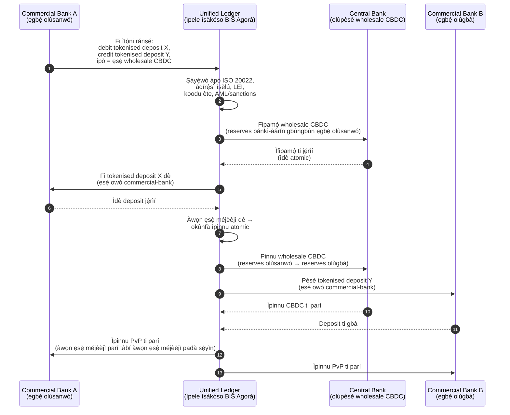

<!-- lead-start: manual -->
<aside class="post-lead" aria-label="Ìsọ́kún àpilẹ̀kọ">

<strong>TL;DR.</strong> Ìsanwó ńlá ní 2026 dúró ní àárín ìyípadà ìṣèlú méjì: ISO 20022 ń fipá mú data ìsanwó tí ó ní ìṣèlú láti wọ àpẹẹrẹ-iṣẹ́, tokenised deposits àti BIS Project Agorá sì ń mú ìpinnu kọjá-ààlà sún sí ọ̀nà tí ó jẹ́ atomic, ìṣèlú-ètò, àti tí ó ṣí ní gbogbo ìgbà. Ìbéèrè 2026 fún bánkì kì í ṣe "ṣé a ti ṣípò àwọn ìfọwọ́sí" mọ́, ṣùgbọ́n "ṣé ìṣiṣẹ́ ìsanwó wa lè ṣe wíwọn, ìṣàkóso, àti àbójútó" — àkójọ náà sì pin èyí sí ìpín gangan mẹ́rin: ìpé data-ìṣèlú, ìṣàṣèyọrí ìṣàkóso ọ̀nà, àkókò-ìpari ìpinnu, àti ìbo ọ̀nà-Agorá.

<strong>Àwọn kókó tó ṣe pàtàkì</strong>

<ul class="post-lead-takeaways">
  <li><strong>November 2026 ni ọjọ́-ààlà tó le, kì í ṣe ìtọ́sọ́nà.</strong> SWIFT yóò yọ ìfọwọ́sí àdírẹ́sì tí kò ní ìṣèlú kúrò ní SR 2026; ìsanwó tí kò ní ìlú àti orílẹ̀-èdè ní àwọn pápá tí a yàn yóò dáwọ́ ìparí dúró. Ìnáwó àtúnṣe, ìwọ̀n ìkọsílẹ̀, àti agbára ìṣiṣẹ́ gbogbo ń ṣípò láti "ìwọ̀n" sí "ipò tí ó hàn fún olùṣàkóso".</li>
  <li><strong>Tokenised deposits ṣẹ́gun stablecoins fún ìsanwó ńlá tí a ṣàkóso.</strong> Wọ́n ń pa ìbátan bánkì-olùgbé-owó mọ́ pẹ̀lú àlùmọ́ọ́nì ìpinnu bánkì-àárín gbùngbùn, nígbà tí wọ́n ń ṣí ìṣèlú-ètò. Stablecoins kò ní pàdánù ipò ní ẹ̀gbẹ́; tokenised deposits ni a fi ìdí mú nínú ipò àkọ́kọ́.</li>
  <li><strong>BIS Project Agorá ni ìtọ́kasí ọ̀nà.</strong> Bí ọjà kọjá-ààlà ti bánkì kò bá lè ṣiṣẹ́ nínú ọ̀nà-Agorá nígbà 2027, ó ń dije lórí ọ̀nà tí àwọn ìyókù ọjà ti ń fi sílẹ̀ tẹ́lẹ̀.</li>
  <li><strong>Ìṣàkóso ọ̀nà àkókò-gangan ni àpẹẹrẹ-iṣẹ́.</strong> Ìpinnu ọ̀nà-púpọ̀ ti 2026 (FedNow / RTP / TIPS / SEPA Inst / on-chain) kì í ṣe "ọ̀nà wo" — ó jẹ́ ìforúkọsílẹ̀ ìlànà, àpẹẹrẹ owó-rírọ̀, àti ẹ̀rọ ìṣàkóso tí ó ń yan ọ̀nà fún ìsanwó kọ̀ọ̀kan.</li>
  <li><strong>Wọn, tàbí kí a wọ́n.</strong> Ìpín mẹ́rin — ìpé data-ìṣèlú, ìṣàṣèyọrí ìṣàkóso ọ̀nà, àkókò-ìpari ìpinnu, ìbo ọ̀nà-Agorá — yí ipò ìsanwó padà sí ẹ̀rí tó ṣetán fún àbójútó ṣáájú fèrèsé ìṣàyẹ̀wò 2026/27.</li>
</ul>
</aside>
<!-- lead-end -->

# Àkójọ-Ìwọ̀n Ìsanwó Ńlá ní 2026: ISO 20022, Tokenised Deposits, Ọ̀nà Àkókò-Gangan, àti Ìpinnu Kọjá-Ààlà

Ìsanwó ńlá ní 2026 ni ìyípadà méjì tí ó wáyé ní àkókò kan ń tún ṣe: data ìsanwó tí ó ní ìṣèlú àti ìpinnu ìṣèlú-ètò. Àkókò àdírẹ́sì-ìṣèlú November 2026 ti SWIFT ń fipá mú ìpé data sí àpẹẹrẹ-iṣẹ́, BIS Project Agorá àti tokenised deposits sì ń ṣe àdánwò bóyá ìpinnu kọjá-ààlà lè di atomic, tí ó hàn kedere, àti tí ó ṣí ní gbogbo ìgbà.

---

> **Àkójọpọ̀ Olórí / Àwọn kókó pàtàkì**
>
> - **November 2026 jẹ́ àkókò data tó le.** SWIFT sọ pé ìsanwó tí ó ní àdírẹ́sì tí kò ní ìṣèlú kò ní ní ìfọwọ́sí mọ́ lẹ́yìn ìyípadà SR 2026.
> - **Data tí ó ní ìṣèlú di àtìlẹ́yìn ọjà.** Ó kéré jùlọ ni pé ìlú àti orílẹ̀-èdè gbọdọ̀ wà ní àwọn pápá tí a yàn, èyí sì yí ìpé data-ìsanwó padà sí ọ̀ràn oníbàárà, ìṣiṣẹ́, àti ìbámu.
> - **Tokenised deposits jẹ́ àṣàyàn ìpinnu fún ìsanwó ńlá.** Project Agorá ń ṣàwárí tokenised commercial bank deposits àti tokenised central bank reserves nínú àpẹẹrẹ ìwé-ìkọsílẹ̀ àpapọ̀.
> - **Àkójọ náà gbọdọ̀ wọn ìpé ìpinnu, kì í ṣe àyíká nìkan.** Àkókò-ìpari, ìhàn kedere, ìwọ̀n àtúnṣe, ìlò owó-rírọ̀, data ìbámu, àti ìhàn fún oníbàárà ṣe pàtàkì bí ìṣiṣẹ́ ojú-ẹsẹ̀.
> - **Ìsanwó kọjá-ààlà ṣì jẹ́ ètò gbogbo-aláṣẹ àti aládàáni.** FSB ń tẹ̀síwájú láti darí ọ̀nà-iṣẹ́ G20 nípasẹ̀ ìmúṣẹ, pẹ̀lú ìṣàkóso ẹ̀gbẹ́ gbogbo-aláṣẹ àti aládàáni.
>
---

## Ìdí Tí 2026 Fi Jẹ́ Ọdún Tí Àkójọ Yìí Ṣe Pàtàkì

Stanford AI Index ṣe àǹfààní nítorí pé ó ń tọ́jú pápá ìmọ̀-ẹ̀rọ tí ń yára yí padà bí ohun tí a lè wọ́n: ìpèsè ìwádìí, iṣẹ́ ìmọ̀-ẹ̀rọ, ìfìmúlò onírẹ̀lẹ̀, ìṣòwò, ìgbà-mímú-lò pápá, ìlànà, àti ìmọ̀lára gbogbogbòò ni a kó wá sí àpapọ̀ kan ([Stanford HAI ⧉](https://hai.stanford.edu/ai-index/2026-ai-index-report "The 2026 AI Index Report")). Bánkì àti ilé-iṣẹ́ ìnáwó nísinsìnyí nílò ìdánilẹ́kọ̀ọ́ kan náà fún àtìlẹ́yìn-iṣẹ́. Agentic AI, ààbò quantum-safe, ìfẹsẹ̀múlẹ̀ cloud native, àti ìsanwó ńlá kì í ṣe ọ̀nà ìmọ̀-tuntun ọ̀tọ̀ọ̀tọ̀ mọ́; wọ́n ń pàdé sí àpẹẹrẹ-iṣẹ́ kan.

Ìbéèrè gangan fún bánkì kì í ṣe bóyá pápá kọ̀ọ̀kan ṣe pàtàkì. Ó jẹ́ bóyá ilé-iṣẹ́ lè wọn ìmúrasílẹ̀ kọjá gbogbo wọn ní àkókò kan náà. Bánkì lè fi agentic AI ránṣẹ́, ó sì lè ṣì jẹ́ aláìlera bí cryptography rẹ̀ kò bá ṣetán fún ìṣípò. Ó lè ṣe àtúnṣe pẹpẹ cloud, ó sì lè ṣì kùnà bí data ìsanwó kò bá ní ìṣèlú. Ó lè ṣiṣẹ́ àdánwò tokenisation, ó sì lè ṣẹ̀dá ewu ètò bí ìpele ìpinnu, owó-rírọ̀, ìdámọ̀, àti ìṣàyẹ̀wò kò bá jẹ́ àpẹẹrẹ papọ̀.

## Àpẹẹrẹ Àkójọ 2026

| Ìpele Àkójọ | Ìtọ́sọ́nà 2026 | Ìwọ̀n Ìmúrasílẹ̀ | Ewu Tí Kò Bá Ṣakóso |
|---|---|---|---|
| **Data ISO 20022** | Ṣípò láti ọ̀rọ̀ tí kò ní ìṣèlú sí àwọn pápá tí ó ní ìṣàkóso | Ìmúrasílẹ̀ àdírẹ́sì-ìṣèlú àti ìwọ̀n ìkọsílẹ̀ | Ìkọsílẹ̀ ìsanwó àti àtúnṣe ọwọ́ |
| **Ìṣàkóso ọ̀nà** | Ìṣàkóso kọjá RTGS, instant, correspondent, stablecoin, àti àwọn ọ̀nà tokenised | Ìnáwó, àyíká, àkókò-ìpari, àti ìṣàkóso tí ó mọ ofin ààlà | Ọ̀nà tí ó pín pẹ̀lú ìṣàkóso tí a tún ṣe |
| **Ìpinnu tokenised** | Lò tokenised deposits àti owó bánkì-àárín gbùngbùn níbi tí wọ́n ti ń dín àìrọ̀rùn kù | DvP, PvP, ìbo ìpinnu atomic | Àwọn àlùmọ́ọ́nì àdánwò láìní iye iṣẹ́ ọjà |
| **Owó-rírọ̀** | Mú owó-rírọ̀ inú ọjọ́, owó tí a dèdè, àti fèrèsé ìpinnu dára sí | Owó-rírọ̀ tí a fi pamọ́ àti ìdín ìkùnà-ìpinnu | Owó-rírọ̀ tí ń yára tán |
| **Ìbámu** | Fi AML, sanctions, FATF, àti àwọn ìbéèrè ìṣàyẹ̀wò sí inú data ìsanwó | Ìbámu straight-through àti ìṣàlàyé | Data tí ó pọ̀ sí láìní ìṣàkóso tó lágbára |

## Àwọn Àmì Pàtàkì Ìsanwó Ńlá Tí A So Mọ́ Àwọn Àkànṣe Àgbáyé

Àkójọ àwọn àmì 2026 kì í ṣe ètò ìwádìí. Ó jẹ́ àkójọ-iṣẹ́ ìfijíṣẹ́ tí a ti ń wọn Chief Payments Officer ti bánkì lórí. Iṣẹ́ àtúnṣe náà yóò hàn ní àyè mẹ́ta: àpò ìfọwọ́sí, ìpele ìṣàkóso ọ̀nà, àti ìwé-ìkọsílẹ̀ ìpinnu.

| Àmì | Ìtọ́kasí G20 / SWIFT / BIS | Ìmúṣẹ Pẹpẹ Ìmọ̀-ẹ̀rọ |
|---|---|---|
| **65% àwọn ìfọwọ́sí ìsanwó ṣì ní àdírẹ́sì tí kò ní ìṣèlú** | [SWIFT SR 2026 — àkókò àdírẹ́sì-ìṣèlú, Nov 2026 ⧉](https://www.swift.com/news-events/news/iso-20022-milestone-november-2026-unstructured-addresses-be-removed "ISO 20022 November 2026 structured address milestone") | Ìfọwọ́sí schema nínú middleware ìsanwó kí ìfọwọ́sí tó dé adapter SWIFTNet; àyẹ̀wò àdírẹ́sì aládàáṣe ní ẹnu-ọ̀nà oníkànnà-corporate + bánkì-correspondent. |
| **Àfojúsùn FSB G20: 75% àwọn ìsanwó kọjá-ààlà yóò parí láàrin wákàtí 1 nígbà 2027** | [Ọ̀nà-iṣẹ́ ìsanwó kọjá-ààlà FSB, ìpele ìmúṣẹ 2026 ⧉](https://www.fsb.org/2026/03/fsb-kicks-off-new-implementation-phase-to-enhance-cross-border-payments-through-public-private-partnership/ "FSB cross-border payments implementation phase") | Ẹnu-ọ̀nà ìyípadà-FX àkókò-gangan pẹ̀lú fèrèsé owó-rírọ̀ tí a ti gbà tẹ́lẹ̀; ìjẹ́rìí T+0 sí inú portal oníbàárà; ẹ̀rọ ìṣàkóso ọ̀nà tí ó yọ ọ̀nà èyíkéyìí tí kò lè pàdé fèrèsé wákàtí 1 kúrò. |
| **Àfojúsùn FSB G20: ìnáwó ìsanwó kọjá-ààlà àpapọ̀ kò gbọdọ̀ ju 1%, ti retail kò ju 3%** | [Àwọn àfojúsùn iye FSB G20 ⧉](https://www.fsb.org/2026/03/fsb-kicks-off-new-implementation-phase-to-enhance-cross-border-payments-through-public-private-partnership/ "FSB cross-border payments implementation phase") | Telemetry ìpín-ìnáwó lórí ọ̀nà kọ̀ọ̀kan (ààlà FX, owó correspondent, ìnáwó lifting); ìforúkọsílẹ̀ ìlànà ààlà tí ó fi iye tí kò bá òfin mu hàn ṣáájú quote. |
| **BIS Project Agorá wọ ìpele prototype kọjá bánkì-àárín gbùngbùn meje + bánkì-òwò 41** | [BIS Project Agorá ⧉](https://www.bis.org/about/bisih/topics/fmis/agora.htm "Project Agorá") | Ìtumọ̀ ìṣàpapọ̀ ìwé-ìkọsílẹ̀-àpapọ̀: node ìwé-tokenised-deposit + ìpele ìpinnu wholesale-CBDC + ìhàn-jáde KYC/AML; àdágún owó-rírọ̀ on-chain tí ó báa ìpín ọ̀nà bánkì mu. |
| **Ètò "digital money" ti Deutsche Bank ń di àpẹẹrẹ oníbàárà** | [Deutsche Bank — Digital Money: stablecoins, tokenised deposits and CBDCs ⧉](https://flow.db.com/publications/flow-white-papers-and-guides/digital-money-a-perspective-on-stablecoins-tokenised-deposits-and-cbdcs "Digital Money: stablecoins, tokenised deposits and CBDCs") | API ìpinnu tí kò sọ wallet-pàtó tí ó yọ ìyàn stablecoin / tokenised-deposit / CBDC kọjá fún ìsanwó kọ̀ọ̀kan; àwọn ipò ìṣèlú-ètò tí a wọn lòdì sí ìforúkọsílẹ̀ ìlànà bánkì, kì í ṣe ti oníbàárà. |

## Ibi-Ìyípadà Data Ìsanwó

ISO 20022 ti ṣípò láti iṣẹ́ àpẹẹrẹ-ìfọwọ́sí sí àpẹẹrẹ-iṣẹ́ ìpé-data. Bí data beneficiary, debtor, creditor, agent, ìlú, orílẹ̀-èdè, ète, àti party bá jẹ́ aláìlera, bánkì yóò ní ìkọsílẹ̀, àtúnṣe, àìrọ̀rùn sanctions, ìbínú oníbàárà, àti analytics aláìlera.

**SR 2026 yí èyí padà sí àdéhùn tó le, kì í ṣe ìmọ̀ràn.** SWIFT Standards Release 2026 (November 2026) yóò fipá mú òfin àdírẹ́sì-ìṣèlú ní ìpele nẹ́twọ́ọ̀kì — àwọn ìfọwọ́sí tí ó jẹ́ pé èròjà `<PstlAdr>` wọn kò ní `<TwnNm>` àti `<Ctry>` yóò di ìkọsílẹ̀ ní ìgbà gbígbà nípasẹ̀ stack ìfọwọ́sí SWIFTNet, kì í ṣe àmì fún àtúnṣe. Ọ̀wọ̀-àtúnṣe yóò dáwọ́ jíjẹ́ ìlà-ìnáwó ẹ̀yìn-iṣẹ́ dúró, ó sì di ìṣẹ̀lẹ̀ ìkùnà-ìpinnu pẹ̀lú ìdádúró tí ó hàn fún oníbàárà. Àwọn ẹgbẹ́ ìṣiṣẹ́ tí wọ́n ti ń tọ́jú SR 2026 gẹ́gẹ́ bí "ìtọ́sọ́nà tó muna sí i" ń ṣiṣẹ́ láti runbook tí kò tọ́.

### Ìbámu Data Ìsanwó Ìṣèlú lábẹ́ ISO 20022

Ojú-iṣẹ́ àtúnṣe náà kéré, ó sì hàn kedere. Àwọn èròjà XML nísàlẹ̀ ni ibi tí stack ìfọwọ́sí SWIFTNet November 2026 yóò ti kọ ìfọwọ́sí sílẹ̀ ní gangan; gbogbo ìyókù jẹ́ àbájáde tó ń tẹ̀le.

| Èròjà Data | Tag XML ISO 20022 | Ìbéèrè SWIFT November 2026 | Ìlànà Àtúnṣe Ìmọ̀-ẹ̀rọ |
|---|---|---|---|
| **Àdírẹ́sì Ìṣèlú** | `<PstlAdr>` tí ó ní `<TwnNm>` + `<Ctry>` | Dandan. Ọ̀rọ̀ `<AdrLine>` tí kò ní ìṣèlú yóò mú ìkọsílẹ̀ nẹ́twọ́ọ̀kì wá ní adapter SWIFTNet gbígbà. | Àyẹ̀wò àdírẹ́sì aládàáṣe ní ìbẹ̀rẹ̀ ìsanwó; àtúnkọ fọ́ọ̀mù oníkànnà-corporate; ìfọṣọ ìwé-ẹ̀yìn lórí ìṣèlú-ìbátan kọ̀ọ̀kan ṣáájú debit ti ń bọ̀. |
| **Legal Entity Identifier (LEI)** | `<Id>` lábẹ́ `<OrgId>` | Ní ìmọ̀ràn gígbóná fún ìjẹ́rìí ìṣèlú-ìbátan ìnáwó tí kì í ṣe ti ènìyàn; dandan ní àwọn ọ̀nà CBPR+ púpọ̀. | Wíwá LEI + àyẹ̀wò GLEIF ní ìforúkọsílẹ̀ corporate; ìfikún aládàáṣe fún ìṣèlú-ìbátan ìwé-ẹ̀yìn nípasẹ̀ àwọn iṣẹ́ data-ìtọ́kasí. |
| **Koodu Ète Ìsanwó** | `<Purp>` tí ó ní `<Cd>` | Dandan ní àwọn ọ̀nà àkókò-gangan agbègbè púpọ̀ (CBPR+, SEPA Inst, TIPS) fún àyẹ̀wò AML / sanctions aládàáṣe. | Tọpa koodu ìṣiṣẹ́ inu-bánkì àtijọ́ sí àkójọ ìṣe-bóṣewà ISO 20022 ExternalPurposeCode; fi ìyàn ète hàn ní UI oníkànnà-corporate; default-deny lórí àwọn koodu tí kò ní mọ̀. |
| **Ultimate Parties** | `<UltmtDbtr>` / `<UltmtCdtr>` | Fi ipò olùgbà ìkẹyìn hàn láti pàdé àwọn ìlànà travel-rule + sanctions G20 FATF; dandan fún àwọn koodu irú-ìsanwó púpọ̀. | Yọ orúkọ àwọn ẹgbẹ́ ìpari-sí-ìpari kúrò nínú sub-account ìwé-ìkọsílẹ̀; tún ṣe ìbáwí pẹ̀lú graph KYC; fi ẹgbẹ́ ìkẹyìn hàn lórí ìjẹ́rìí kọ̀ọ̀kan. |
| **Remittance Information (Ìṣèlú)** | `<RmtInf><Strd>` pẹ̀lú `<RfrdDocInf>` | A nílò rẹ̀ fún ìsanwó corporate tí a so mọ́ ìwé-ìpawọ́pé tí a lè bá báwí lábẹ́ CBPR+ Phase 2. | Gbà remittance ìṣèlú ní àkókò-quote nínú portal corporate; kọ àlá ọ̀rọ̀-òfin sílẹ̀ fún ìṣàn iye-ńlá. |

## Tokenised Deposits àti Wholesale CBDC

Tokenised deposits ń pa àpẹẹrẹ owó commercial-bank mọ́ nígbà tí wọ́n ń fi ìṣèlú-ètò kún. Owó bánkì-àárín gbùngbùn wholesale ń pa àkókò-ìpari ìpinnu mọ́. Àpẹẹrẹ tí ó wúni jẹ́ àpapọ̀: owó commercial-bank fún ìbátan oníbàárà àti ìbújọ́pò gbèsè, owó bánkì-àárín gbùngbùn fún ìpinnu ìkẹyìn àti ìgbẹ́kẹ̀lé ètò.

Project Agorá fi àpapọ̀ náà ṣe gangan. Àpẹẹrẹ nísàlẹ̀ ni àpẹẹrẹ-ìtọ́kasí BIS fún ìpinnu kọjá-ààlà atomic, payment-versus-payment (PvP) tí ó ń lo ìwé-ìkọsílẹ̀ tokenised-deposit ti commercial-bank àti ìpele ìpinnu wholesale-CBDC, tí a ṣàkóso nípasẹ̀ ìwé-ìkọsílẹ̀-àpapọ̀.

Ìpinnu náà jẹ́ atomic nípasẹ̀ ìṣètò: àwọn ẹsẹ̀ méjèèjì parí tàbí àwọn méjèèjì padà sẹ́yìn. Àkókò-ìpari ìpinnu lórí ẹsẹ̀ wholesale-CBDC mú ìṣípò tokenised-deposit commercial-bank ní agbára láìní ewu correspondent. Ìwé-ìkọsílẹ̀-àpapọ̀ ni ìpele ìṣàkóso, kì í ṣe ètò ìsanwó nínú ara rẹ̀ — bánkì-àárín gbùngbùn ṣì ń pèsè àlùmọ́ọ́nì ìpinnu, bánkì commercial sì ń ṣe ìwé gbèsè deposit.

## Ọjà Ìsanwó Ńlá Tuntun

Ọjà náà kì í ṣe ìsanwó nìkan mọ́. Ó jẹ́ àkójọ ìṣiṣẹ́, data, owó-rírọ̀, ìbámu, ìtọpa, àti ìṣàkóso àyàfí. Bánkì tí ó lè fi agbára yẹn hàn nípasẹ̀ APIs àti dashboards oníbàárà yóò yí ìbámu àtìlẹ́yìn padà sí iye fún oníbàárà.

## Kí Ni Èyí Túmọ̀ Sí Nípa Irú Bánkì

### Global Systemically Important Banks

Bánkì àgbáyé gbọdọ̀ tọ́jú àkójọ yìí gẹ́gẹ́ bí ìṣàyẹ̀wò àpẹẹrẹ-iṣẹ́ ilé-iṣẹ́. Ohun tó ṣe pàtàkì kì í ṣe proof of concept mìíràn; ó jẹ́ ẹ̀rí pé àwọn workflow aládàáṣe, ìṣípò cryptographic, ìgbára-cloud, àti ìmúdèrà ìsanwó lè ṣe ìṣàkóso gẹ́gẹ́ bí ètò ewu àti iye kan ṣoṣo.

### Transaction Banks àti Corporate Banks

Transaction banks gbọdọ̀ fokansí ìsanwó ńlá, data tí ó ní ìṣèlú, owó-rírọ̀, tokenised deposits, àti agentic treasury services. Ìpèsè oníbàárà tó níye jùlọ kì í ṣe ìṣípò owó tí ó yára kan; ó jẹ́ ìṣípò owó tí ó lè ṣàlàyé, ṣe ìṣàyẹ̀wò, àti ṣe ìṣèlú-ètò pẹ̀lú ìwádìí díẹ̀ àti ìhàn working-capital tó dára.

### Bánkì Agbègbè

Bánkì agbègbè gbọdọ̀ lo àkójọ náà láti yẹra fún ètò tí ó tóbi jù. Wọn kò nílò láti darí gbogbo ipò tuntun, ṣùgbọ́n wọn nílò ìpò tó dára lórí ìṣàkóso AI, àkójọ post-quantum, ẹ̀rí ìjáde cloud, àti ìmúrasílẹ̀ data ìsanwó.

### Fintechs, PSPs, àti Olùpèsè Àtìlẹ́yìn

Fintechs àti olùpèsè àtìlẹ́yìn gbọdọ̀ darí ọ̀nà ọjà wọn sí ìmúrasílẹ̀ bánkì tí a lè wọ́n. Ìpèsè tó dára jùlọ yóò dín ewu ìṣàpapọ̀ kù, fi ẹ̀rí lágbára, àti mú àtìlẹ́yìn tó pọn dà rọrùn fún bánkì láti ṣàkóso.

## Ìparí

Iye ti ìròyìn-àkójọ ni pé ó yí ètò ìmọ̀-ẹ̀rọ tí ó pín padà sí àpẹẹrẹ-iṣẹ́ tí a lè wọ́n. Ní 2026, àwọn tó yóò ṣẹ́gun nínú àtìlẹ́yìn ìnáwó kì í ṣe àwọn ilé-iṣẹ́ tí ó ní àdánwò jùlọ. Wọ́n yóò jẹ́ àwọn ilé-iṣẹ́ tí ó lè fi ẹ̀rí ìmúrasílẹ̀ hàn kọjá ìṣàkóso-ara-ẹni, ààbò, ìfẹsẹ̀múlẹ̀, ìpinnu, ìṣòwò, àti ìṣàkóso ní àkókò kan náà.

## Àwọn Ìbéèrè Tí A Sábà Béèrè

**Kí ló dé tí ISO 20022 ṣì jẹ́ ọ̀ràn 2026?**

Nítorí pé ìṣípò kò pé ṣáájú kí data ìsanwó tó ní ìṣèlú, ìṣàkóso, gbígbà ní orísun, àti tó lè lò kọjá ọ̀nà, oníbàárà, àti àtìlẹ́yìn ọjà.

**Kí ni tokenised deposit?**

Tokenised deposit jẹ́ àpẹẹrẹ ìdijítà ti owó commercial bank, tí a ṣe láti pa ìbátan bánkì-olùgbé-owó mọ́ nígbà tí ó ń fún ìpinnu ìṣèlú-ètò láàyè.

**Ṣé tokenised deposits ń rọ́pò stablecoins?**

Kì í ṣe níbi gbogbo. Stablecoins lè ṣì ní àǹfààní ní àwọn ipo digital-asset àti kọjá-ààlà kan, nígbà tí tokenised deposits fẹ́ràn ìṣèlú fún ìṣàkóso ìsanwó ńlá tí a ṣàkóso.

**Kí ni bánkì gbọdọ̀ wọn?**

Wọn ìmúrasílẹ̀ data-ìṣèlú, ìkọsílẹ̀ ìsanwó, ìnáwó àtúnṣe, àkókò ìpinnu, ìlò owó-rírọ̀, èsì ìṣàkóso ọ̀nà, àti ìhàn oníbàárà.

## Àwọn Ìtọ́kasí

- SWIFT, (2026). [ISO 20022 November 2026 structured address milestone ⧉](https://www.swift.com/news-events/news/iso-20022-milestone-november-2026-unstructured-addresses-be-removed "ISO 20022 November 2026 structured address milestone").
- BIS Innovation Hub, (2026). [Project Agorá ⧉](https://www.bis.org/about/bisih/topics/fmis/agora.htm "Project Agorá").
- FSB, (2026). [Cross-border payments implementation phase ⧉](https://www.fsb.org/2026/03/fsb-kicks-off-new-implementation-phase-to-enhance-cross-border-payments-through-public-private-partnership/ "Cross-border payments implementation phase").
- Deutsche Bank, (2026). [Digital Money: stablecoins, tokenised deposits and CBDCs ⧉](https://flow.db.com/publications/flow-white-papers-and-guides/digital-money-a-perspective-on-stablecoins-tokenised-deposits-and-cbdcs "Digital Money: stablecoins, tokenised deposits and CBDCs").

<!-- enrich-start -->
<aside class="author-card" aria-label="Nípa olùkọ̀wé"><strong class="author-card-name"><a href="/about/index.html">Sebastien Rousseau</a></strong>Onímọ̀-ẹ̀rọ bánkì agbà tí ń kọ̀wé lórí AI tí a fìmúlò, àtìlẹ́yìn ìsanwó, owó tokenised, ISO 20022, ààbò post-quantum, iṣẹ́ ìnáwó cloud-native, àti ọjà digital tí a ṣàkóso.Ọdún 20+ kọjá HSBC Commercial &amp; Investment Bank, PayPal, Barclays, Shazam, AKQA, Virgin Group. <a href="/about/index.html">Profaili kíkún</a> &middot; <a href="https://www.linkedin.com/in/sebastienrousseau/" rel="external noopener">LinkedIn</a> &middot; <a href="https://github.com/sebastienrousseau" rel="external noopener">GitHub</a></aside>

Àyẹ̀wò ìkẹyìn <time datetime="2026-06-06">2026-06-06</time>.

<!-- enrich-end -->
