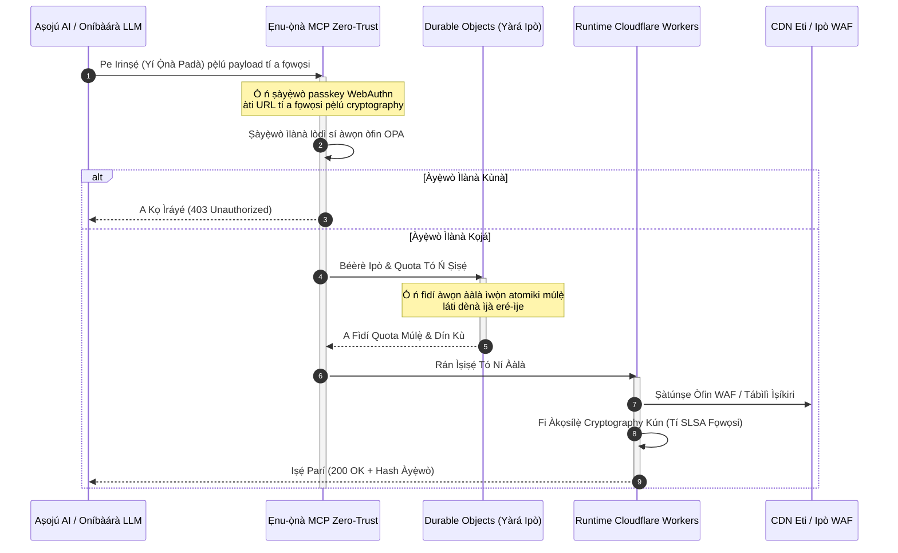

---

# Front Matter (YAML)

author: "contact@sebastienrousseau.com (Sebastien Rousseau)"
banner_alt: "Àkójọ rack ilé-iṣẹ́ dátà tó ń tàn ní alẹ́ — àmì ti eti orisun ṣiṣi tí a lè yẹ̀wò tí ó sì lè jẹ́ kíkó nípasẹ̀ aṣojú, èyí tí a kọ́ CloudCDN sí"
banner_height: "1597"
banner_width: "2584"
banner: "https://cloudcdn.pro/stocks/images/alis-po-IdVNRv-5wJo.webp"
cdn: "https://cloudcdn.pro"
charset: "UTF-8"
cname: "sebastienrousseau.com"
copyright: "© Copyright 2025 - 2026 - Sebastien Rousseau. All rights reserved."
date: "June 11, 2026"
description: "CloudCDN yí CDN padà di ipele iṣakoso eti tí aṣojú lè kó, tó ní ààbò cryptography — ẹnu-ọ̀nà MCP zero-trust, Durable Objects, SLSA Level 3, ẹ̀rí DORA."
format-detection: "telephone=no"
hreflang: "yo"
icon: "https://cloudcdn.pro/clients/sebastienrousseau/v1/logos/sebastienrousseau.svg"
id: "https://sebastienrousseau.com/yo/2026-06-11-cloudcdn-open-source-blueprint-ai-native-edge-2026"
image_alt: "Àwòrán Aláwọ̀ Dúdú àti Funfun ti Sebastien Rousseau"
image_height: "162"
image_width: "162"
image: "https://cloudcdn.pro/stocks/images/sebastienrousseau.webp"
keywords: "CloudCDN, eti AI-ìbílẹ̀, CDN orisun ṣiṣi, MCP server, Cloudflare Workers, Durable Objects, zero trust, WebAuthn, signed URLs, SLSA Level 3, DORA, ipele iṣakoso eti"
language: "yo"
last_reviewed: "2026-06-11"
layout: "report"
locale: "yo_NG"
logo_alt: "Logo fún Sebastien Rousseau"
logo_height: "44"
logo_width: "44"
logo: "https://cloudcdn.pro/clients/sebastienrousseau/v1/logos/sebastienrousseau.svg"
menu: ""
measurementID: "G-169G4ET5HQ"
name: "Sebastien Rousseau"
permalink: "https://sebastienrousseau.com/yo/2026-06-11-cloudcdn-open-source-blueprint-ai-native-edge-2026"
rating: "general"
referrer: "no-referrer"
robots: "index, follow"
schema: "FAQPage, Article"
seo_title: "CloudCDN: Ètò Ìpinnu Eti AI-Ìbílẹ̀ Orisun Ṣiṣi"
short_name: "sebastienrousseau"
subtitle: "Gbígbé CDN àgbáyé kúrò ní ìpamọ́ àkóónú aimi lọ sí ipele iṣakoso eti tí ó ní ààbò cryptography tí aṣojú sì lè kó."
tags: "CloudCDN, orisun ṣiṣi, CDN, eti, aṣojú AI, MCP, Cloudflare Workers, Durable Objects, ìdìnà ìwọ̀n, zero trust, WebAuthn, SLSA, DORA, BCBS 239, Basel III, báńkì cloud native"
theme-color: "0, 83, 191"
title: "CloudCDN: Ètò Ìpinnu Orisun Ṣiṣi fún Eti AI-Ìbílẹ̀ ní 2026"
url: "https://sebastienrousseau.com/yo/2026-06-11-cloudcdn-open-source-blueprint-ai-native-edge-2026"
viewport: "width=device-width, initial-scale=1, shrink-to-fit=no"

# RSS - The RSS feed front matter (YAML).
atom_link: "https://sebastienrousseau.com/2026-06-11-cloudcdn-open-source-blueprint-ai-native-edge-2026/rss.xml"
category: "Technology"
docs: https://validator.w3.org/feed/docs/rss2.html
generator: "Static Site Generator (SSG) (version 0.0.26)"
item_description: "CloudCDN yí CDN padà di ipele iṣakoso eti tí aṣojú lè kó, tó ní ààbò cryptography — ẹnu-ọ̀nà MCP zero-trust, Durable Objects, SLSA Level 3, ẹ̀rí DORA."
item_guid: "https://sebastienrousseau.com/2026-06-11-cloudcdn-open-source-blueprint-ai-native-edge-2026/rss.xml"
item_link: "https://sebastienrousseau.com/2026-06-11-cloudcdn-open-source-blueprint-ai-native-edge-2026/rss.xml"
item_pub_date: "Thu, 11 Jun 2026 06:06:06 +0000"
item_title: "CloudCDN: Ètò Ìpinnu Orisun Ṣiṣi fún Eti AI-Ìbílẹ̀ ní 2026"
last_build_date: "Thu, 11 Jun 2026 06:06:06 +0000"
managing_editor: "contact@sebastienrousseau.com (Sebastien Rousseau)"
pub_date: "Thu, 11 Jun 2026 06:06:06 +0000"
ttl: "60"
type: "article"
webmaster: "contact@sebastienrousseau.com"

# Apple - The Apple front matter (YAML).
apple_mobile_web_app_orientations: "portrait"
apple_touch_icon_sizes: "192x192"
apple-mobile-web-app-capable: "yes"
apple-mobile-web-app-status-bar-inset: "black"
apple-mobile-web-app-status-bar-style: "black-translucent"
apple-mobile-web-app-title: "CloudCDN: Ètò Ìpinnu Eti AI-Ìbílẹ̀ Orisun Ṣiṣi"
apple-touch-fullscreen: "yes"

# MS Application - The MS Application front matter (YAML).

msapplication-navbutton-color: "0, 83, 191"

# Twitter Card - The Twitter Card front matter (YAML).

twitter_card: "summary_large_image"
twitter_creator: "@wwdseb"
twitter_description: "CloudCDN yí CDN padà di ipele iṣakoso eti tí aṣojú lè kó, tó ní ààbò cryptography — ẹnu-ọ̀nà MCP zero-trust, Durable Objects, SLSA Level 3, ẹ̀rí DORA."
twitter_image: "https://cloudcdn.pro/clients/sebastienrousseau/v1/logos/sebastienrousseau.svg"
twitter_image_alt: "Logo ti Sebastien Rousseau"
twitter_site: "@wwdseb"
twitter_title: "CloudCDN: Ètò Ìpinnu Eti AI-Ìbílẹ̀ Orisun Ṣiṣi"
twitter_url: "https://sebastienrousseau.com/2026-06-11-cloudcdn-open-source-blueprint-ai-native-edge-2026"

excerpt: "CloudCDN jẹ́ ètò ìpinnu orisun ṣiṣi fún eti AI-ìbílẹ̀ — ẹnu-ọ̀nà MCP zero-trust pẹ̀lú irinṣẹ́ 42, ìdìnà ìwọ̀n Durable Objects atomiki, passkeys WebAuthn, signed URLs, orísun SLSA Level 3, àti ìdánwò 3,185 ní ìbòlẹ̀wò 100%, tí a so mọ́ DORA, BCBS 239, àti Basel III."

# Humans.txt - The Humans.txt front matter (YAML).
author_website: "https://sebastienrousseau.com"
author_twitter: "@wwdseb"
author_location: "London, UK"
thanks: "Thanks for reading!"
site_last_updated: "2026-06-11"
site_standards: "HTML5, CSS3, RSS, Atom, JSON, XML, YAML, Markdown, TOML"
site_components: "Kaishi, Kaishi Builder, Kaishi CLI, Kaishi Templates, Kaishi Themes"
site_software: "Static Site Generator, Rust"

---

# CloudCDN: Ètò Ìpinnu Orisun Ṣiṣi fún Eti AI-Ìbílẹ̀ ní 2026

<!-- lead-start: manual -->
<aside class="post-lead" aria-label="Àkótán àpilẹ̀kọ">

<strong>TL;DR.</strong> Ìmọ̀-ẹ̀rọ ilé-iṣẹ́ ní 2026 dúró lórí ìṣọ̀kan ìṣiṣẹ́ serverless tí a pín káàkiri àgbáyé àti AI aṣojú. Àwọn CDN ìbílẹ̀ — tí a kọ́ fún ìpamọ́ fáìlì aimi àti ìṣíkiri ìjábọ̀ ìpìlẹ̀ — ti di ohun ìgbàanì ní ti ìkọ́lé ní sáà ìṣètò dátà àkókò gangan tó ń ṣiṣẹ́ lọ́wọ́. CloudCDN jẹ́ ètò ìpinnu orisun ṣiṣi tí ó yí eti padà di ipele iṣakoso tó ń ṣiṣẹ́: àwọn runtime serverless, ìṣọ̀kan ipò nípasẹ̀ Cloudflare Durable Objects, àti ẹnu-ọ̀nà Model Context Protocol (MCP) zero-trust tí ó jẹ́ kí àwọn aṣojú AI adáṣiṣẹ́ lè ṣiṣẹ́ ìgbékalẹ̀ wẹ́ẹ̀bù nínú àwọn ààlà iṣẹ́ tó ní ààlà tí cryptography sì ń ṣọ́.

<strong>Àwọn àyọkà pàtàkì</strong>

<ul class="post-lead-takeaways">
  <li><strong>Láti ìpamọ́ aimi sí ipele iṣakoso tó ní ààlà.</strong> CloudCDN gbé ààlà iṣẹ́ lọ sí eti, ó sì yí àwọn nodu CDN padà di ẹnu-ọ̀nà ìlànà tó ń ṣiṣẹ́ tí ó ń mú àwọn ìpinnu ààbò, ìṣíkiri, àti ìṣàkóso ìráyé ṣẹ ní ìsàlẹ̀ millisecond kan.</li>
  <li><strong>Ìṣọ̀kan eti tó ní ipò.</strong> Cloudflare Durable Objects ń fipá mú ìdìnà ìwọ̀n atomiki, àkókò gangan àti ìṣọ̀kan ipò káàkiri àgbáyé — kò sí ìjà eré-ìje tí a pín, kò sí ilòkulò quota ètò káàkiri àwọn agbègbè eti.</li>
  <li><strong>Ìṣàkóso ìgbékalẹ̀ aṣojú aláìléwu nípasẹ̀ MCP.</strong> Ẹnu-ọ̀nà zero-trust ń fi irinṣẹ́ MCP pàtàkì 42 hàn, tí ó jẹ́ kí àwọn aṣojú AI lè yẹ̀wò, ṣètò, àti ṣiṣẹ́ ìgbékalẹ̀ lábẹ́ àwọn ààlà tí a fọwọsi pẹ̀lú cryptography.</li>
  <li><strong>Ààbò ẹ̀wọ̀n ìpèsè gẹ́gẹ́ bí èso pipeline.</strong> Orísun ìkọ́lé SLSA Level 3 nípasẹ̀ Sigstore/Cosign àti ìdánwò ẹ̀ka 3,185 ní ìbòlẹ̀wò 100% lórí ìfilọ́lẹ̀ kọ̀ọ̀kan.</li>
  <li><strong>Ẹ̀rí ipele ìgbìmọ̀, kìí ṣe pẹpẹ àfihàn.</strong> Telemetry eti ń bá ìjíhìn ìgbìmọ̀ Abala 5 DORA, ìjábọ̀ ewu BCBS 239, àti àwọn òfin olú ewu-iṣẹ́ Basel III mu tààrà.</li>
</ul>

<strong>Kíkà tí ó jẹmọ́:</strong> <a href="/2026-05-16-best-cloud-infrastructure-architecture-2026/">Ìkọ́lé Ìpìlẹ̀ Ìkùukùu Tó Dára Jùlọ ní 2026: Ìlànà AI-Native, Multi-Cloud, Olùmọ̀-Quantum fún Àwọn Iṣẹ́-Ìnáwó</a> · <a href="/2026-06-05-cloud-native-banking-index-dora-resilience-platform-engineering-2026/">Atọ́ka Bánkì Ọlọ́nà-Àwọsánmà ní 2026: DORA, Platform Engineering, Àwọsánmà Alágbára, àti Ìfaradà Iṣẹ́</a> · <a href="/2026-06-03-agentic-ai-index-banks-autonomy-governance-auditability-2026/">Atọ́ka Agentic AI fún Àwọn Bánkì ní 2026: Dídiwọ̀n Ìṣọmọ̀dáṣe, Ìṣàkóso, Agbára Àyẹ̀wò, àti Ipa Ìṣòwò</a>

</aside>
<!-- lead-end -->

Àríyànjiyàn CDN ti parí. Eti kìí ṣe ìpamọ́ mọ́; ó jẹ́ ipele iṣakoso fún sọ́fítíwà AI-ìbílẹ̀. Bí àwọn aṣojú ṣe ń pe irinṣẹ́, gbé dátà, pa àwọn ìpamọ́ rẹ́, béèrè signed URLs, tí wọ́n sì ń ṣètò àwọn ìṣàn iṣẹ́, àwòkọ́ṣe àtijọ́ ti àwọn pẹpẹ tí kò ní àlàyé àti àwọn ipele iṣakoso aládàáni dáwọ́ jíjẹ́ ìnira dúró, ó sì di gbèsè ìlànà. CloudCDN ń jiyàn fún àwòkọ́ṣe mìíràn: pẹpẹ eti tí ó ṣíi, tí a lè yẹ̀wò, tí aṣojú lè kó, tí ó ka ààbò, ìráyé, agbára iṣẹ́, àti agbára àyẹ̀wò sí gẹ́gẹ́ bí àwọn ìpilẹ̀ tí a lè fipá mú dípò àwọn ìlérí olùpèsè.

Ojúàmì ìtọ́kasí orisun ṣiṣi fún àpilẹ̀kọ yìí ni [cloudcdn.pro ⧉](https://github.com/sebastienrousseau/cloudcdn.pro "cloudcdn.pro"). Ibi ìpamọ́ náà jẹ́ CDN AI-ìbílẹ̀ onígbalejò-pípọ̀ tí a lè kà láti ìbẹ̀rẹ̀ dé òpin tí a sì lè gbé jáde lọ́tọ̀ọ̀tọ̀: TTFB tí ó dín ní 100ms káàkiri àwọn PoP Cloudflare, ìṣàkóso MCP, ìdìnà ìwọ̀n Durable Objects, ìráyé WCAG-AA, signed URLs, passkeys, SLSA Level 3, àti ìdánwò 3,185 ní ìbòlẹ̀wò 100%.

---

> **Àkótán Àlàṣẹ / Àwọn Àyọkà Pàtàkì**
>
> - **Eti ń di ààlà iṣẹ́.** CloudCDN yí àwọn nodu CDN ìbílẹ̀ padà di ẹnu-ọ̀nà ìlànà tó ń ṣiṣẹ́ tí ó ń mú ààbò, ìṣíkiri, àti ìṣàkóso ìráyé ṣẹ ní ìsàlẹ̀ millisecond kan.
> - **Durable Objects sọ ìdìnà ìwọ̀n di atomiki.** Ìfipámú quota àkókò gangan tó bá ara mu káàkiri àgbáyé ń dí fèrèsé ìjà eré-ìje tí àwọn adínwọ̀n tó ń bá ara mu níkẹyìn fi sílẹ̀ fún àwọn agbóguntini àti àwọn aṣojú tó ń ṣiṣẹ́ àṣìṣe.
> - **Àwọn aṣojú ń ṣiṣẹ́ ìgbékalẹ̀ nípasẹ̀ irinṣẹ́ MCP 42 tó ní ààlà.** A ń ṣàyẹ̀wò ìpè kọ̀ọ̀kan lòdì sí passkeys WebAuthn, àwọn payload tí a fọwọsi, àti ìlànà OPA kí ohunkóhun tó ṣiṣẹ́.
> - **Ẹ̀wọ̀n ìpèsè jẹ́ ara ọjà náà.** Orísun SLSA Level 3 nípasẹ̀ Sigstore/Cosign ń so ìfilọ́lẹ̀ kọ̀ọ̀kan pọ̀ mọ́ orísun rẹ̀ tí a ti yẹ̀wò pẹ̀lú cryptography.
> - **Telemetry jẹ́ ẹ̀rí ìbámu.** Àwọn iṣẹ́ eti ń bá Abala 5 DORA, BCBS 239, àti olú ewu-iṣẹ́ Basel III mu — tààrà, kìí ṣe nípasẹ̀ ìjábọ̀ lẹ́yìn ìṣẹ̀lẹ̀.
>
---

## Ìdí Tí Iṣẹ́ Orisun Ṣiṣi Yìí Fi Ṣe Pàtàkì Ní 2026

IT ilé-iṣẹ́ ní 2026 ti kúrò ní ìpèsè ìgbékalẹ̀ aimi lọ sí ìṣètò dátà àkókò gangan tí ìṣẹ̀lẹ̀ ń darí. Agbára ọjà méjì ló ń darí ìyípadà náà.

Èkíní ni gbígbilẹ̀ AI aṣojú. Àwọn àwòkọ́ṣe adáṣiṣẹ́ àti àwọn aṣojú sọ́fítíwà ń ṣe àwọn iṣẹ́ ìṣiṣẹ́ tó díjú báyìí — ìdènà ewu adáṣiṣẹ́, àwọn ìpinnu ìṣíkiri, ìdọ́gba ìwé-ìkàwé àkókò gangan. Wọn kìí lo pẹpẹ àfihàn. Wọ́n ń pe irinṣẹ́.

Èkejì ni ìfipámú tó ń lọ lọ́wọ́ ti [Òfin Ìfaradà Iṣẹ́ Díjítà (DORA) ⧉](https://eur-lex.europa.eu/legal-content/EN/TXT/?uri=CELEX%3A32022R2554 "Ìlànà (EU) 2022/2554 lórí ìfaradà iṣẹ́ díjítà fún ẹ̀ka ìnáwó"). Àwọn ilé-iṣẹ́ báńkì kò lè gbáralé àwọn CDN ẹgbẹ́-kẹta aládàáni tí kò ní àlàyé mọ́. Àwọn aṣòfin ń béèrè ìríran pípé sínú ẹ̀wọ̀n ìpèsè sọ́fítíwà, agbára ìjáde tí a lè fìdí rẹ̀ múlẹ̀, àti àwọn ipa àyẹ̀wò cryptography tí a kò lè yí padà.

Àwọn ìkọ́lé sáfà àárín gbùngbùn ń fa ìjìyà latency tí ìṣètò àkókò gangan kò lè gbà. Àwọn CDN aládàáni ń ṣiṣẹ́ gẹ́gẹ́ bí àpótí dúdú tí ó ń fi àwọn ilé-iṣẹ́ hàn sí ìbàjẹ́ ẹ̀wọ̀n-ìpèsè tí wọn kò lè rí, ká má tilẹ̀ sọ ti ẹ̀rí. CloudCDN dí àlàfo yẹn pẹ̀lú ètò ìpinnu orisun ṣiṣi, zero-trust, tó ní àlàyé tí ó yí eti padà di ipele iṣakoso tó ń ṣiṣẹ́. Fún àwọn alàṣẹ ìmọ̀-ẹ̀rọ, ó gbé ìjíròrò náà kúrò ní iye owó ìbámu lọ sí Return on Resilience: olú tí a dáàbò bò nípasẹ̀ àwọn pipeline iṣẹ́ adáṣiṣẹ́ tó ṣetán fún àyẹ̀wò.

## Gilasi Ìkọ́lé

A ṣètò ìkọ́lé CloudCDN káàkiri ipele márùn-ún, ó sì ń fi àwọn ìpilẹ̀ eti onípò ti agbègbè rọ́pò middleware àárín gbùngbùn:

| Ìpele | Ìpinnu Ìkọ́lé | Ìdí Tí Ó Fi Ṣe Pàtàkì | Ewu Bí A Kò Bá Ṣàkóso |
|---|---|---|---|
| **Ìran eti** | Cloudflare Workers àti Pages | Ó mú latency VM àárín gbùngbùn kúrò; ó ń mú àwọn ìlànà ṣẹ ní ìsàlẹ̀ millisecond kan káàkiri àgbáyé | Èrè agbára iṣẹ́ láìsí ìbáwí ìlànà ń mú ìyapa eti rúdurùdu jáde |
| **Ìṣọ̀kan ipò** | Durable Objects | Ó ń ṣe ìdánilójú ìbáramu atomiki, àkókò gangan fún àwọn ààlà ìwọ̀n àti ipò tí a pín káàkiri àwọn agbègbè | Ìjà eré-ìje tí a pín, ilòkulò ohun èlò API, àwọn quota ààlà tí a fò kọjá |
| **Ojú aṣojú** | Ẹnu-ọ̀nà MCP zero-trust | Ó ń fi irinṣẹ́ MCP pàtàkì 42 hàn kí àwọn aṣojú AI lè ṣiṣẹ́ ìgbékalẹ̀ lábẹ́ àwọn ààlà tí a ṣàkóso | Ìpè irinṣẹ́ tí kò ní ààlà àti àwọn ìyípadà ìṣètò aláìláṣẹ |
| **Ìṣàkóso ìráyé** | Passkeys WebAuthn àti signed URLs | Ó ń fi àwọn ìbuwọ́lù cryptography rọ́pò ọ̀rọ̀-aṣínà aimi fún àwọn iṣẹ́ tí a lè yẹ̀wò | Àwọn ìyípadà tí ìdánimọ̀ wọn kò lágbára; olè kredẹnṣalì tó ń yọrí sí ìbàjẹ́ ààlà |
| **Ẹnu-ọ̀nà ìdára** | SLSA Level 3 àti ìbòlẹ̀wò ìdánwò 100% | Ó ń fìdí orísun ìkọ́lé múlẹ̀ ní ti ìṣirò; ó ń dí abẹrẹ ìgbẹ́kẹ̀lé burúkú lọ́nà | Kóòdù burúkú tí a fi sínú nípasẹ̀ ẹ̀wọ̀n ìpèsè sọ́fítíwà |

## Àwọn Àmì Iṣẹ́ Láti Tọpinpin

A lè wọn ìmúrasílẹ̀ eti. Àwọn wọ̀nyí ni àwọn atọ́ka oníye tí ó ń ṣe àfihàn agbára ìṣiṣẹ́ dípò èrò inú:

| Àmì | Mẹ́tíríkì / Ìdiwọ̀n | Ìtọ́kasí Ìlànà | Ìmúṣẹ Pẹpẹ |
|---|---|---|---|
| **Irinṣẹ́ MCP 42** | Iye ibi-ìforúkọsílẹ̀ irinṣẹ́ tó ní ààlà fún ìṣàkóso adáṣiṣẹ́ | COBIT 2019 (BAI06) | Ẹnu-ọ̀nà MCP tó ń ṣàyẹ̀wò àwọn ìbuwọ́lù aṣojú lòdì sí àwọn ìlànà OPA |
| **Durable Objects** | Ìfipámú quota atomiki aláìjò ní ìsàlẹ̀ millisecond kan | Abala 6 DORA | Durable Objects tó ń tọpinpin ipò quota API àgbáyé |
| **Passkeys àti signed URLs** | 100% àwọn ìpàdé alámòjútó ni a fìdí múlẹ̀ nípasẹ̀ FIDO2 WebAuthn | Abala 30 DORA | Àwọn àyẹ̀wò ìbuwọ́lù cryptography tí a gbìn sínú aṣàtúnṣíkiri eti |
| **SLSA Level 3** | Àwọn manifest ìkọ́lé tí a fọwọsi pẹ̀lú cryptography (Sigstore) | Abala 30 DORA | Àwọn pipeline GitHub Actions tó ń ṣẹ̀dá metadata ìkọ́lé tí a fọwọsi |
| **Ìdánwò ẹ̀ka 3,185** | Ìbòlẹ̀wò 100%; ẹnu-ọ̀nà ìfàsẹ́yìn lórí ìfilọ́lẹ̀ kọ̀ọ̀kan | NIST CSF 2.0 (PR.DS-01) | Àwọn pipeline CI tó ń dá ìgbéjáde dúró lórí ìkùnà ìdánwò èyíkéyìí |

## CDN Ń Di Ipele Iṣakoso Tó Ń Ṣiṣẹ́

A ṣe àwọn CDN ìbílẹ̀ yí ìyára àkóónú aimi, aláìṣiṣẹ́ ká. CloudCDN tún àwòkọ́ṣe náà ṣe àlàyé. Pẹ̀lú Cloudflare Workers àti Durable Objects tí a ṣọ̀kan, eti ń ṣiṣẹ́ gẹ́gẹ́ bí ẹnu-ọ̀nà ìlànà onípò tó ń ṣiṣẹ́.

Nígbà tí aṣojú AI tàbí ìlànà adáṣiṣẹ́ bá béèrè ìyípadà ìṣètò ìgbékalẹ̀ tàbí àtúnṣe ìṣíkiri, kò bá ibi ìpamọ́ dátà àárín gbùngbùn aláìlágbára sọ̀rọ̀. A ń dá ìbéèrè náà dúró ní nodu eti tó súnmọ́ jùlọ, a sì ń mú un gba àwọn àyẹ̀wò ìdánimọ̀, ìlànà, àti quota kọjá kí ohunkóhun tó ṣiṣẹ́:

Ìgbésẹ̀ kọ̀ọ̀kan nínú ìtẹ̀léra yẹn ń mú àkọsílẹ̀ tí a fọwọsi tí a sì lè dá sí ẹnìkan jáde. Ìyẹn ni ìyàtọ̀ láàrín CDN tó ń mú àkóónú yára àti ipele iṣakoso tí a lè ṣàkóso.

## Ìdí Tí Orisun Ṣiṣi Fi Yí Àwòkọ́ṣe Ìgbẹ́kẹ̀lé Padà

Fún àwọn Olórí Aláṣẹ Ààbò Ìwífun (CISO), àwọn CDN aládàáni tí kò ní àlàyé ń mú ewu tó ń pọ̀ síi wá. Àwọn nẹ́tíwọ̀ọ̀kì eti orisun-pípadé jẹ́ àpótí dúdú: bí olùpèsè bá jìyà ìbàjẹ́ inú, báńkì kò ní ìríran kankan títí tí a ó fi sọ ìbàjẹ́ náà ní gbangba.

CloudCDN fi àwòkọ́ṣe ìgbẹ́kẹ̀lé orisun ṣiṣi tí a lè yẹ̀wò ní kíkún rọ́pò àìdọ́gba yẹn, èyí tí a kọ́ lórí ọ̀nà mẹ́ta:

1. **Orísun ìkọ́lé ti ìṣirò.** Lábẹ́ SLSA Level 3, a so ìfilọ́lẹ̀ kọ̀ọ̀kan pọ̀ mọ́ ibi ìpamọ́ GitHub orisun ṣiṣi rẹ̀ pẹ̀lú cryptography. CISO lè fìdí rẹ̀ múlẹ̀ — ní ti ìṣirò, kìí ṣe ní ti àdéhùn — pé bainárì tó ń ṣiṣẹ́ lórí àwọn nodu eti àgbáyé Cloudflare ní gan-an kóòdù orísun tí a ti yẹ̀wò nínú.
2. **Àyẹ̀wò ààbò gbangba tó ń lọ títí.** A ń fi ìpìlẹ̀ kóòdù náà sábẹ́ àwọn ìwádìí adáṣiṣẹ́, ìfihàn àìlera ní gbangba, àti àwọn àyẹ̀wò kóòdù tí àwọn ẹlẹgbẹ́ ṣe. Ìbòmọ́lẹ̀ kìí ṣe ìṣàkóso; àyẹ̀wò ni.
3. **Kò sí ìdèkùn olùpèsè (Abala 28 DORA).** DORA ń béèrè kí àwọn báńkì fi ẹ̀rí ìlànà ìjáde tó ṣe kedere, tí a ti dánwò hàn kúrò lọ́dọ̀ àwọn olùpèsè ẹgbẹ́-kẹta pàtàkì. Nítorí pé CloudCDN jẹ́ orisun ṣiṣi tí a sì kọ́ lórí àwọn ìpilẹ̀ serverless ìdiwọ̀n, àwọn ilé-iṣẹ́ lè ṣí àwọn ìṣètò eti kúrò ní Cloudflare lọ sí àwọn runtime serverless mìíràn tàbí àwọn àkójọpọ̀ Kubernetes aládàáni — kí wọ́n sì fi agbára yẹn hàn fún aṣòfin pẹ̀lú ẹ̀rí.

## Àwòkọ́ṣe Eti Tó Tó Ipele Báńkì

A ṣe CloudCDN láti bá àwọn ìdiwọ̀n ìbámu ti ẹ̀ka ìnáwó àgbáyé mu, ó sì ń so àwọn iṣẹ́ eti ìmọ̀-ẹ̀rọ pọ̀ mọ́ àwọn ìlànà tí àwọn alábojútó ń ṣàyẹ̀wò ní ti gidi tààrà:

- **Ìṣàkóso ewu àwòkọ́ṣe ([US Fed SR 11-7 ⧉](https://www.federalreserve.gov/supervisionreg/srletters/sr1107.htm "Ìtọ́sọ́nà Alábojútó lórí Ìṣàkóso Ewu Àwòkọ́ṣe") / UK PRA SS1/23).** Àwọn àwòkọ́ṣe adáṣiṣẹ́ tó ń ṣe àwọn iṣẹ́ ìṣiṣẹ́ wà lábẹ́ ìṣàkóso ewu-àwòkọ́ṣe. Ẹnu-ọ̀nà MCP CloudCDN ka àwọn irinṣẹ́ aṣojú sí gẹ́gẹ́ bí àwọn àwòkọ́ṣe oníye: àwọn ààlà ìlànà tó le, ìkọsílẹ̀ àkókò gangan, àti àwọn ìfagilé ènìyàn-nínú-àyíká tó pọn dandan fún àwọn iṣẹ́ tó ní ipa ńlá.
- **BCBS 239 (ìkójọpọ̀ dátà ewu).** Nípa gbígbà, fífi àmì sí, àti ṣíṣètò dátà ìdúnàdúrà ní eti, a ń ṣẹ̀dá àwọn mẹ́tíríkì iṣẹ́ ní àkókò gangan — èyí tó bá àwọn ohun tí BCBS 239 nílò fún ìduróṣinṣin dátà, àsìkò, àti ìtọpinpin ìlànà mu.
- **Abala 5 DORA (ìjíhìn ìgbìmọ̀).** Ìgbìmọ̀ ni ó gbé gbèsè ti ara ẹni tó ga jùlọ fún ìfaradà iṣẹ́. CloudCDN ń túmọ̀ telemetry eti sí ẹ̀rí oníye tí a lè fìdí rẹ̀ múlẹ̀ tí àwọn olùdarí tí kìí ṣe ti ìmọ̀-ẹ̀rọ lè mú lọ sínú àyẹ̀wò gbèsè-ti-ara-ẹni.
- **Olú ewu-iṣẹ́ Basel III.** Àwọn báńkì ń di olú ìlànà mú lòdì sí ewu iṣẹ́. Ìyípadà-ìkùnà DR adáṣiṣẹ́ àti orísun SLSA Level 3 ń dín profaìlì ewu iṣẹ́ ilé-iṣẹ́ náà kù — ó ń dáàbò bo olú lórí ìwé ìdọ́gba, kìí ṣe láti tẹ́ àyẹ̀wò lọ́rùn nìkan.

## Ohun Tí Èyí Túmọ̀ Sí Nípa Irú Báńkì

### Àwọn Báńkì Pàtàkì fún Gbogbo Ètò Àgbáyé (G-SIBs)

Àwọn G-SIB ń ṣiṣẹ́ iye ìdúnàdúrà ńlá káàkiri ọ̀pọ̀ àgbègbè-àṣẹ. Ohun pàtàkì jùlọ ni fífi ipele eti kan ṣoṣo tó ṣọ̀kan rọ́pò àwọn ìṣàkóso ààlà àtijọ́ tó ti pín yẹ́lẹyẹ̀lẹ. Gbígbé àwòkọ́ṣe CloudCDN kalẹ̀ jẹ́ kí G-SIB lè ṣe ìdiwọ̀n àwọn ìlànà ààbò, àwọn ẹnu-ọ̀nà API, àti ìṣàkóso aṣojú káàkiri àgbáyé — kí ó sì ṣẹ̀dá àwọn pipeline ẹ̀rí tó bá DORA mu gẹ́gẹ́ bí èso ìṣiṣẹ́ dípò ìsáré ìgbà-mẹ́rin-lọ́dún.

### Àwọn Báńkì Ìdúnàdúrà àti Ti Ilé-iṣẹ́

Fún àwọn báńkì ìdúnàdúrà, ọjà tó dojúkọ oníbàárà jẹ́ àkójọpọ̀ ìyára ìṣiṣẹ́, ààbò, àti àlàyé dátà. Àwòkọ́ṣe CloudCDN jẹ́ kí àwọn báńkì wọ̀nyí lè fi àwọn pẹpẹ API aláìléwu àti àwọn iṣẹ́ ìtọpinpin owó àkókò gangan hàn fún àwọn olùṣàkóso owó ilé-iṣẹ́ — ìdúró eti onífaradà tó ń dáàbò bo àwọn ìfowópamọ́ ilé-iṣẹ́.

### Àwọn Báńkì Agbègbè àti Kéékèèké

Àwọn báńkì agbègbè ń dojúkọ àwọn oníjàgídíjàgan kan náà bí àwọn G-SIB láìsí àwọn ìnáwó iṣẹ́-ẹ̀rọ. Ètò ìpinnu eti orisun ṣiṣi tó tó ipele báńkì ń pèsè àwọn ìṣàkóso náà láti inú àpótí: ìbáramu ìlànà lẹ́sẹ̀kẹsẹ̀ láìsí iye owó ìwé-àṣẹ aládàáni, àti kóòdù orísun láti fi ẹ̀rí rẹ̀ hàn.

## Ìwé Ìtọ́nisọ́nà Yàrá Ìgbìmọ̀

Ìfaradà iṣẹ́ kìí ṣe mẹ́tíríkì IT ọ́fíìsì-ẹ̀yìn tí a kò rí mọ́; ó jẹ́ ohun pàtàkì yàrá ìgbìmọ̀ tí gbèsè ti ara ẹni so mọ́. Àwọn ilé-iṣẹ́ tó pa ìgbẹ́kẹ̀lé àwọn aṣòfin, àwọn oníbàárà, àti àwọn onípín mọ́ ní 2026 ń ka ìmọ̀-ẹ̀rọ sí gẹ́gẹ́ bí dúkìá tí a lè fìdí rẹ̀ múlẹ̀ tí a sì lè ṣàkíyèsí.

Ojú-ọ̀nà fún àwọn aṣáájú ìmọ̀-ẹ̀rọ àgbà kúrú:

1. **Pàṣẹ ẹ̀rí gẹ́gẹ́ bí ọjà.** Ṣe ìnáwó fún àwọn pipeline adáṣiṣẹ́ tó ń kọ àkọsílẹ̀ ara wọn ní eti — ẹ̀rí tí ìṣiṣẹ́ ń ṣẹ̀dá, kìí ṣe èyí tí a kó jọ fún olùyẹ̀wò.
2. **Lọ sí ìṣàkóso eti onípò.** Gbé ìdìnà ìwọ̀n, WAF, àti ìmúdájú ìdánimọ̀ kúrò lórí àwọn sáfà àárín gbùngbùn lọ sí àwọn ìpilẹ̀ eti atomiki.
3. **Gbé àwọn ààlà aṣojú cryptography kalẹ̀.** Fipá mú àwọn ẹnu-ọ̀nà MCP zero-trust pẹ̀lú ìṣàyẹ̀wò passkey àti OPA fún ìpè irinṣẹ́ adáṣiṣẹ́ kọ̀ọ̀kan.
4. **Béèrè àwọn àyẹ̀wò ìkọ́lé orisun ṣiṣi.** Sọ orísun ìkọ́lé SLSA Level 3 di àdéhùn ìgbéjáde, kìí ṣe ìfẹ́-ọkàn.

## Àwọn Ìbéèrè Tí A Ń Béèrè Léraléra

**Ǹjẹ́ CloudCDN ti ṣetán fún àwọn àyẹ̀wò DORA?**

Bẹ́ẹ̀ni. A ṣe CloudCDN láti mú ẹ̀rí ìbámu adáṣiṣẹ́ jáde tó ń bá àwọn àwòṣe ITS lórí Ibi Ìforúkọsílẹ̀ Ìwífun (RT.01 sí RT.15) àti àwọn gbólóhùn àdéhùn Abala 30 DORA mu tààrà.

**Kínni àǹfààní lílo Durable Objects fún ìdìnà ìwọ̀n?**

Àwọn adínwọ̀n ìbílẹ̀ tí a pín ń gbáralé ìbáramu níkẹyìn, èyí tó fi fèrèsé latency sílẹ̀ tí àwọn agbóguntini tàbí àwọn aṣojú tó ń ṣiṣẹ́ àṣìṣe lè lò. Durable Objects ń ṣe ìdánilójú ìbáramu atomiki lẹ́sẹ̀kẹsẹ̀ káàkiri àgbáyé, ó sì ń dí fèrèsé ìjà eré-ìje pátápátá.

**Kínni ó sọ CloudCDN di AI-ìbílẹ̀?**

Àwọn iṣẹ́ rẹ̀ tí MCP ń ṣàkóso àti àwòkọ́ṣe ìṣàkóso tó mọ̀ nípa aṣojú. A ń ṣiṣẹ́ ìgbékalẹ̀ nípasẹ̀ irinṣẹ́ 42 tí a ṣàkóso pẹ̀lú ìdánimọ̀ cryptography àti àwọn ààlà ìlànà — tí a ṣe fún àwọn ìṣàn iṣẹ́ adáṣiṣẹ́, kìí ṣe fún àwọn pẹpẹ ènìyàn nìkan.

**Ǹjẹ́ kóòdù orisun ṣiṣi ń mú ewu àwọn ìlòkulò ọjọ́-òdo pọ̀ síi?**

Bẹ́ẹ̀kọ́. Àwọn CDN aládàáni, orisun-pípadé ń gbáralé ààbò nípasẹ̀ ìbòmọ́lẹ̀. A ń fi ìpìlẹ̀ kóòdù CloudCDN sábẹ́ ìdánwò adáṣiṣẹ́, àyẹ̀wò ẹlẹgbẹ́ ní gbangba, àti ìṣàyẹ̀wò SLSA Level 3 nígbà gbogbo — ààlà ìgbẹ́kẹ̀lé tó ga jùlọ tí a lè fìdí rẹ̀ múlẹ̀.

## Àwọn Ìtọ́kasí

- European Parliament and Council of the European Union, (2022). [Ìlànà (EU) 2022/2554 lórí ìfaradà iṣẹ́ díjítà fún ẹ̀ka ìnáwó (DORA) ⧉](https://eur-lex.europa.eu/legal-content/EN/TXT/?uri=CELEX%3A32022R2554 "Ìlànà (EU) 2022/2554 lórí ìfaradà iṣẹ́ díjítà fún ẹ̀ka ìnáwó (DORA)"). Brussels: Ìwé Ìròyìn Aṣòfin ti European Union.
- Basel Committee on Banking Supervision (BCBS), (2013). [Àwọn ìlànà fún ìkójọpọ̀ dátà ewu àti ìjábọ̀ ewu tó múnádóko (BCBS 239) ⧉](https://www.bis.org/publ/bcbs239.htm "Àwọn ìlànà fún ìkójọpọ̀ dátà ewu àti ìjábọ̀ ewu tó múnádóko (BCBS 239)"). Basel: Bank for International Settlements.
- Board of Governors of the Federal Reserve System, (2011). [Ìtọ́sọ́nà Alábojútó lórí Ìṣàkóso Ewu Àwòkọ́ṣe (SR Letter 11-7) ⧉](https://www.federalreserve.gov/supervisionreg/srletters/sr1107.htm "Ìtọ́sọ́nà Alábojútó lórí Ìṣàkóso Ewu Àwòkọ́ṣe (SR Letter 11-7)"). Washington D.C.: Federal Reserve.
- Cloudflare, (2026). [Àkọsílẹ̀ Durable Objects: ìṣọ̀kan eti onípò ⧉](https://developers.cloudflare.com/durable-objects/ "Àkọsílẹ̀ Durable Objects"). San Francisco: Cloudflare.
- Cloudflare, (2026). [Kíkọ́ àwọn aṣojú AI pẹ̀lú MCP, ìfìdímúlẹ̀ àti Durable Objects ⧉](https://blog.cloudflare.com/building-ai-agents-with-mcp-authn-authz-and-durable-objects/ "Kíkọ́ àwọn aṣojú AI pẹ̀lú MCP, ìfìdímúlẹ̀ àti Durable Objects").
- GitHub, (2026). [Ibi ìpamọ́ cloudcdn.pro ⧉](https://github.com/sebastienrousseau/cloudcdn.pro "Ibi ìpamọ́ cloudcdn.pro").

<!-- enrich-start -->
<aside class="author-card" aria-label="Nípa Onkọwe"><strong class="author-card-name"><a href="/about/index.html">Sebastien Rousseau</a></strong>Onímọ̀ ẹ̀rọ bánkì àgbà tí ó ń kọ nípa AI tí a lo, ìgbékalẹ̀ ìsanwó, owó tókènì, ISO 20022, ààbò post-quantum, iṣẹ́ ìnáwó cloud-native, ìgbékalẹ̀ orisun ṣiṣi, àti àwọn ọjà oníbàátì tí a ṣàkóso.Ọdún 20+ kọjá HSBC Commercial &amp; Investment Bank, PayPal, Barclays, Shazam, AKQA, Virgin Group. <a href="/about/index.html">Profaìlì kíkún</a> &middot; <a href="https://www.linkedin.com/in/sebastienrousseau/" rel="external noopener">LinkedIn</a> &middot; <a href="https://github.com/sebastienrousseau" rel="external noopener">GitHub</a></aside>

Àyẹ̀wò tó kẹ́yìn <time datetime="2026-06-11">2026-06-11</time>.

<!-- enrich-end -->
