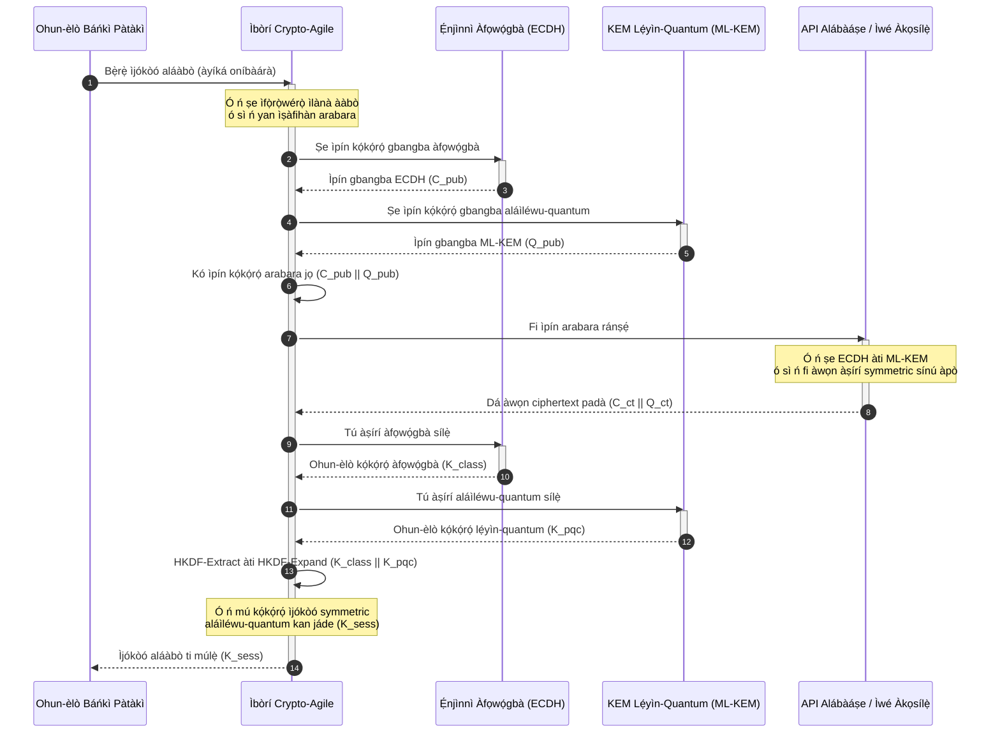

# KyberLib àti Ìrìnkiri Báńkì Lẹ́yìn-Quantum 2026: Láti Àwọn Ìpilẹ̀ṣẹ̀ sí Kóòdù

<!-- lead-start: manual -->
<aside class="post-lead" aria-label="Àkópọ̀ àpilẹ̀kọ">

<strong>TL;DR.</strong> Ìgbékalẹ̀ báńkì ní 2026 dojú kọ ewu ètò-ara tí òpin rẹ̀ ti hàn kedere: ìṣirò ní ìwọ̀n quantum yóò fọ́ pàṣípààrọ̀ kọ́kọ́rọ́ RSA àti ECC tí ó ń dáàbò bo ìjábọ̀ tí ń kọjá lórí ẹ̀rọ lónìí. Àwọn ìpilẹ̀ṣẹ̀ ìjọba àpapọ̀ àti àwọn ìwé ìlànà alábojútó ti gbé ìmọ̀ sókè; ìmúṣẹ ìmọ̀-iṣẹ́ ṣì wà ní ọ̀tọ̀ọ̀tọ̀. <a href="https://github.com/sebastienrousseau/kyberlib">KyberLib</a> jẹ́ àwòrán ìkọ́lé ìmọ̀-iṣẹ́ orisun ṣiṣi tí ó gbé ìtàn lẹ́yìn-quantum lọ sí kóòdù Rust gangan tó ní ààbò ìrántí — ó ń ṣe ìmúṣẹ ML-KEM tí NIST ṣe ìpilẹ̀ṣẹ̀ (FIPS 203) lẹ́yìn àwọn ààlà ìyàsọ́tọ̀ crypto-agile, kí àwọn ilé-iṣẹ́ lè gbé ààbò ìgbéjáde àti ìfilọ́ kọ́kọ́rọ́ ga kí àwọn ìkọlù "Store Now, Decrypt Later" tó dé ibi ìpamọ́ wọn.

<strong>Àwọn àyọkà pàtàkì</strong>

<ul class="post-lead-takeaways">
  <li><strong>Láti ìlànà sí kóòdù tí a lè yẹ̀wò.</strong> KyberLib gbé crypto lẹ́yìn-quantum láti àwọn àwòrán ìlànà àìní-ohun lọ sí àwọn ìmúṣẹ Rust gangan, tó yára, tí a sì lè ṣàyẹ̀wò.</li>
  <li><strong>Ìmúṣẹ FIPS 203 ML-KEM tó ní ìpilẹ̀ṣẹ̀.</strong> Ilé-ìkàwé náà ń ṣe ìmúṣẹ ML-KEM — algoríthìm ìdásílẹ̀ kọ́kọ́rọ́ tí a parí lábẹ́ NIST FIPS 203 — ó sì ń pa ìbámu mọ́ pẹ̀lú àwọn ìfojúsọ́nà ìlànà àgbáyé.</li>
  <li><strong>Crypto-agility nípa ìpalẹ̀mọ́.</strong> Àwọn ààlà ìyàsọ́tọ̀ tó dúró ṣinṣin ń jẹ́ kí àwọn ohun-èlò báńkì yí àwọn primitive crypto padà láìsí àtúnkọ ohun-èlò tó wọ́n tó sì kún fún àṣìṣe.</li>
  <li><strong>Ààbò ìrántí pẹ̀lú agbára Rust.</strong> Àwọn òfin ìnini ní àkókò àkójọ ń pa àwọn buffer overflow àti jíjò ìrántí tí ń yọ àwọn ilé-ìkàwé crypto C àtijọ́ lẹ́nu run, ní ìyára zero-cost-abstraction.</li>
  <li><strong>Dídín gbèsè aláṣẹ kù.</strong> Ẹ̀rí ìrìnkiri tí a lè wòye tí a sì lè dán wò ń fún àwọn olùdarí ní àkọsílẹ̀ "ìgbésẹ̀ tó bọ́gbọ́n mu" tí àwọn àyẹ̀wò ojúṣe-ẹnìkọ̀ọ̀kan DORA Abala 5 ń béèrè.</li>
</ul>

<strong>Ìwé ìbátan:</strong> <a href="/2026-05-18-quantum-cryptography-standards-developments-2026/">Àwọn ìpilẹ̀ṣẹ̀ crypto quantum 2026</a> · <a href="/2026-05-28-dora-ai-act-data-sovereignty-banking-compliance-stack-2026/">Akopọ ìbámu DORA + AI Act</a> · <a href="/2026-05-20-cloud-native-banking-financial-institutions-2026/">Báńkì cloud-native</a>

</aside>
<!-- lead-end -->

Ìrìnkiri lẹ́yìn-quantum ti dáwọ́ jíjẹ́ iṣẹ́ ìpalẹ̀mọ́ dúró. Ní 2026 ó jẹ́ ìbéèrè ìṣiṣẹ́ tó ń lọ lọ́wọ́, àlàfo tó wà láàrin èrò ìlànà àti ìmúṣẹ ìmọ̀-iṣẹ́ sì ni ibi tí ewu náà jókòó sí báyìí. [KyberLib ⧉](https://github.com/sebastienrousseau/kyberlib "kyberlib") ti apá kan àlàfo yẹn pa: ilé-ìkàwé Rust aláàbò-ìrántí tí a múra fún iṣẹ́ gangan, tí ó ń ṣe ìmúṣẹ ML-KEM ní ìbámu pẹ̀lú àwọn paramita FIPS 203 tí a ti parí, tí ó sì ń fi í sínú àwọn ààlà crypto-agile tí ohun-ìní ìdúnàdúrà báńkì nílò ní ti gidi.

---

> **Àkótán Àlàṣẹ / Àwọn Àyọkà Pàtàkì**
>
> - **Ewu náà ti ń ṣiṣẹ́ tẹ́lẹ̀.** Àwọn ọ̀tá ń ṣe ìkórè "Store Now, Decrypt Later" lónìí; àṣírí dátà yóò já sí ìbàjẹ́ padà-sẹ́yìn ní ọjọ́ tí kọ̀mpútà quantum tó lágbára nínú crypto bá dé.
> - **Àwọn ìpilẹ̀ṣẹ̀ ti parí.** NIST FIPS 203 (ML-KEM) àti FIPS 204 (ML-DSA) ń fún àwọn ìgbìmọ̀ àyẹ̀wò ní ìwọ̀n tó ṣe kedere tí a sì lè dán wò — kò sí àwíjàre "a ń dúró de àwọn ìpilẹ̀ṣẹ̀" mọ́.
> - **KyberLib ni àwòrán ìkọ́lé ìmọ̀-iṣẹ́ náà.** Rust aláàbò-ìrántí, àkójọ `no_std` fún àwọn HSM àti káàdì ọlọ́gbọ́n, àti àwọn àpẹẹrẹ ìṣàfihàn arabara tí ó ń pa ìṣiṣẹ́pọ̀ àfọwọ́gbà mọ́.
> - **Crypto-agility ni àfojúsùn tó dúró pẹ́.** Àwọn ààlà ìyàsọ́tọ̀ tó dúró ṣinṣin ń jẹ́ kí àwọn primitive yí padà láìsí àtúnkọ ohun-èlò — ẹ̀kọ́ tí ó pẹ́ ju algoríthìm kankan lọ.
> - **Àwọn ìgbìmọ̀ ló gbé gbèsè náà.** DORA Abala 5 gbé ojúṣe ẹnìkọ̀ọ̀kan lé àwọn olùdarí lọ́wọ́; kóòdù ìrìnkiri tí a lè yẹ̀wò tí a sì lè wòye ni ẹ̀rí tí ó tẹ́ ẹ lọ́rùn.
>
---

## Ìdí Tí Iṣẹ́ Orisun Ṣiṣi Yìí Fi Ṣe Pàtàkì ní 2026

Bí crypto asymmetric ṣe ń súnmọ́ ìgbà àtijọ́ rẹ̀, ewu náà kò dúró de kíkọ́ kọ̀mpútà quantum tó lágbára nínú crypto. Àwọn ọ̀tá ń ṣe àwọn ìkọlù **"Store Now, Decrypt Later" (SNDL)** báyìí — wọ́n ń kórè àwọn ìṣàn ìjábọ̀ tí a ti pamọ́ ti àwọn ìdúnàdúrà báńkì ilé-iṣẹ́, àṣírí òwò, àti ìbánisọ̀rọ̀ àwọn ilé-iṣẹ́, pẹ̀lú èrò láti tú wọn nígbà tí agbára quantum bá dàgbà. Fún báńkì, gbogbo ìṣàfihàn àfọwọ́gbà tó wà lórí ẹ̀rọ lónìí jẹ́ ìfọ́ àṣírí tí ọjọ́ ìbúgbàù rẹ̀ ti sún síwájú.

Àwọn alábojútó ti dáhùn pẹ̀lú àwọn ojúṣe gangan:

1. **DORA Abala 6 (ìṣàkóso ewu ICT)** ń béèrè kí àwọn ilé-iṣẹ́ ya àwòrán, dá mọ̀, kí wọ́n sì dín àwọn àìlera kù káàkiri ohun-ìní crypto wọn — pẹ̀lú pàṣípààrọ̀ kọ́kọ́rọ́ asymmetric tí a sin sínú middleware tí ẹnikẹ́ni kò tíì ka sílẹ̀.
2. **NIST FIPS 203 àti 204** ń gbé àwọn ìpilẹ̀ṣẹ̀ lẹ́yìn-quantum oníbiṣẹ́ kalẹ̀ fún ìfilọ́ kọ́kọ́rọ́ (ML-KEM) àti ìfọwọ́sí dígítà (ML-DSA), wọ́n sì ń fún àwọn ìgbìmọ̀ àyẹ̀wò ní ìwọ̀n tó ní ìpilẹ̀ṣẹ̀ tí a fi ń díwọ̀n ìtẹ̀síwájú ìrìnkiri.

Ṣíṣe ìrìnkiri yìí láìsí dídá àwọn iṣẹ́ tó ń lọ lọ́wọ́ dúró nílò gbígbé kọjá àwọn ìwé ìlànà sí **ìgbékalẹ̀ crypto orisun ṣiṣi tí a lè yẹ̀wò**. [KyberLib ⧉](https://github.com/sebastienrousseau/kyberlib "kyberlib") ń pèsè ìyẹn gan-an: ilé-ìkàwé Rust aláàbò-ìrántí tó bá FIPS 203 mu, tí ó sọ ìyípadà lẹ́yìn-quantum di ọ̀nà iṣẹ́ ìmọ̀-iṣẹ́ tí a lè wọ̀n tí a sì lè jẹ́rìí sí — ó sì ń yí ọ̀rọ̀ ìdókòwò ìmọ̀-ẹ̀rọ padà sí Èrè Ìfaradà tó dájú.

## Gilasi Ìpalẹ̀mọ́

KyberLib jókòó sí ẹ̀yìn àwọn ààlà API tó dúró ṣinṣin, ó sì ń dáàbò bo àwọn ohun-èlò ìdúnàdúrà pàtàkì báńkì kúrò nínú àyípadà àwọn primitive crypto ìpele-ìsàlẹ̀.

| Ìpele | Ìpinnu Ìpalẹ̀mọ́ | Ìdí Tí Ó Fi Ṣe Pàtàkì | Ewu Bí A Bá Ṣe É Lọ́nà Òdì |
|---|---|---|---|
| **Primitive** | Ìfilọ́ kọ́kọ́rọ́ FIPS 203 ML-KEM | Ó ń rọ́pò pàṣípààrọ̀ kọ́kọ́rọ́ Diffie-Hellman àti RSA àfọwọ́gbà pẹ̀lú àwọn ìṣètò lattice | Àìbámu pẹ̀lú àwọn paramita FIPS 203 tí a parí, tó ń yọrí sí ìkùnà àyẹ̀wò ìbámu |
| **Èdè** | Ìmúṣẹ Rust aláàbò-ìrántí | Ó ń pa àwọn àìlera ìbàjẹ́-ìrántí (buffer overflow, use-after-free) tó wọ́pọ̀ nínú C/C++ run | Ìtànkálẹ̀ ìgbẹ́kẹ̀lé tó ń ba ìduroṣinṣin ẹ̀wọ̀n ìkọ́lé jẹ́ |
| **Ìyàsọ́tọ̀** | Àwọn ààlà crypto-agile tó dúró ṣinṣin | Àwọn ohun-èlò ń yí algoríthìm padà lẹ́yìn interface ìṣọ̀kan bí àwọn ìpilẹ̀ṣẹ̀ ṣe ń dàgbà | Àwọn primitive tí a so mọ́ kóòdù tó ń fipá mú àtúnkọ ọwọ́ nínú gbogbo ìrìnkiri ọjọ́ iwájú |
| **Ìfilọ́lẹ̀** | Àwọn ìṣàfihàn ìpamọ́ arabara | Ó ń pa àwọn KEM lẹ́yìn-quantum àti àwọn algoríthìm àfọwọ́gbà pọ̀ nínú àpò ìbòrí méjì | Pípàdánù ìṣiṣẹ́pọ̀ àtijọ́ tàbí ìyípadà ìṣètò láìfọ̀rọ̀sọ |
| **Ìdánilójú** | Ìpilẹ̀ṣẹ̀ SLSA Level 3 àti àwọn ìdánwò tí a lè yẹ̀wò | Ó ń ṣe ìdánilójú orisun àti ìpilẹ̀ṣẹ̀ kóòdù; a lè ṣàyẹ̀wò àwọn àpẹẹrẹ ní ìlà-sí-ìlà | Eré ààbò — àwọn ilé-ìkàwé àpótí-dúdú tí àṣìṣe ìmúṣẹ wọn ń yọ jáde ní ibi iṣẹ́ gangan |

## Àwọn Àmì Ìṣiṣẹ́ Láti Tẹ̀lé

Fífi ìbámu lẹ́yìn-quantum hàn fún àwọn ìgbìmọ̀ alábojútó àti àwọn alábojútó túmọ̀ sí títẹ̀lé àwọn ìwọ̀n pàtó tí a lè ka:

| Àmì | Ìwọ̀n | Ìtọ́kasí Ìlànà | Ìmúṣẹ Pẹpẹ |
|---|---|---|---|
| **Ìbámu FIPS 203 ML-KEM** | Ìbámu 100% pẹ̀lú àwọn paramita tí a parí (ML-KEM-512/768/1024) | NIST FIPS 203 | Crypto lattice tí a jẹ́rìí paramita rẹ̀ tí a kó sínú àwọn module KyberLib |
| **Àkójọpọ̀ crypto** | Àkójọpọ̀ kíkún ti lílò pàṣípààrọ̀ kọ́kọ́rọ́ asymmetric káàkiri gbogbo ètò | NIST SP 1800-38 | Àwọn aṣojú àyẹ̀wò aládàáṣe tí ń ṣe àkọsílẹ̀ àwọn cipher suite tó ń ṣiṣẹ́ sí ibi ìforúkọsílẹ̀ àárín kan |
| **Pàṣípààrọ̀ kọ́kọ́rọ́ arabara** | Ìpín ọgọ́rùn-ún àwọn ìṣàfihàn ìpele-ìgbéjáde tó ń ṣiṣẹ́ nínú àpò arabara | DORA Abala 6 | Àwọn proxy nẹ́tíwọ́ọ̀kì tó ń fi ìfilọ́ PQC bo àwọn ìṣàfihàn TLS 1.3 àfọwọ́gbà |
| **Àkójọ `no_std`** | Agbára láti ṣàkójọ láìsí ilé-ìkàwé ìpilẹ̀ Rust fún àwọn àfojúsùn aláàlà | DORA Abala 30 | Àkójọ `no_std` oníìpò nínú KyberLib fún àwọn Hardware Security Module |
| **Atọ́ka crypto-agility** | Àkókò ní ìṣẹ́jú láti yí primitive crypto padà káàkiri ẹnu-ọ̀nà API | UK PRA SS1/23 | Àwọn ìforúkọsílẹ̀ ìtọ́sọ́nà tí a yà sọ́tọ̀ tó ń ṣàkóso ìpín algoríthìm nípasẹ̀ àwọn oníyípadà àkókò-ìṣiṣẹ́ |

## Ìdí Tí Rust Fi Ṣe Pàtàkì fún Crypto Lẹ́yìn-Quantum

Ṣíṣe ìmúṣẹ àwọn algoríthìm lẹ́yìn-quantum bíi ML-KEM nílò àwọn iṣẹ́ ìṣirò ìpele-ìsàlẹ̀ tó díjú lórí àwọn òrùka polynomial. Ní ìtàn, ṣíṣe àwọn iṣẹ́ yẹn ní ìyára ibi-iṣẹ́ túmọ̀ sí C/C++ tàbí assembly tí a fi ọwọ́ kọ — ojú ìkọlù ńlá fún ìbàjẹ́ ìrántí, nínú kóòdù gan-an tí báńkì kò lè fara da àṣìṣe rẹ̀.

Rust yí ìdúró ààbò ti iṣẹ́ ìmọ̀-iṣẹ́ crypto padà ní ọ̀nà gangan mẹ́ta:

1. **Ààbò ìrántí ní àkókò àkójọ.** Àwòkọ́ṣe ìnini Rust ń ṣe ìdánilójú pé a dí àwọn buffer overflow, double free, àti àṣìṣe use-after-free lọ́wọ́ ní àkókò àkójọ. Ìyẹn ṣe pàtàkì gidigidi fún àwọn ilé-ìkàwé lẹ́yìn-quantum, níbi tí ìwọ̀n kọ́kọ́rọ́ àti ciphertext ti tóbi ju ti àfọwọ́gbà lọ ní pàtàkì.
2. **Ìyàsọ́tọ̀ aláìlówó tó dájú.** Rust ń ṣàkójọ sí kóòdù ẹ̀rọ ìbílẹ̀ láìsí olùkó-pàǹtírí, nítorí náà ìyára ìṣiṣẹ́ àti ìwọ̀n ìrántí bá àwọn ilé-ìkàwé orísun-C mu tàbí kọjá wọn nígbà tí ó ń pa ààbò mọ́.
3. **Ìbámu `no_std`.** KyberLib ń ṣàkójọ láìsí ilé-ìkàwé ìpilẹ̀ Rust, nítorí náà ó ń ṣiṣẹ́ ní àwọn àyíká aláàlà, oníbárè-irin — pẹ̀lú àwọn Hardware Security Module àti káàdì ọlọ́gbọ́n — ó sì ń pa crypto onípele-báńkì mọ́ sínú àwọn ààlà ààbò ti ara.

## Ìpalẹ̀mọ́ Ètò Crypto-Agile

Ọ̀nà ìkùnà àtọwọ́dọ́wọ́ nínú àwọn ìrìnkiri crypto ni sísopọ̀ mọ́ kóòdù: àwọn àbá tó jẹ mọ́ algoríthìm kan tí a fi sínú ìrònú ohun-èlò tààrà, tí a sì tún ṣàwárí pẹ̀lú ìrora ní gbogbo ìyípadà. Àfojúsùn tó dúró pẹ́ fún 2026 ni **crypto-agility** — ìpele ìyàsọ́tọ̀ tí ó ń wo àwọn algoríthìm gẹ́gẹ́ bí àwọn module tí a lè yí padà lẹ́yìn interface tó dúró ṣinṣin, kí ìrìnkiri tó kàn jẹ́ àyípadà ìṣètò dípò àtúnkọ gbogbo ohun-ìní.

Ìtòlẹ́sẹẹsẹ tó wà nísàlẹ̀ fi hàn bí ìbòrí crypto-agile KyberLib ṣe ń ṣàkóso ìṣàfihàn pàṣípààrọ̀ kọ́kọ́rọ́ arabara (àfọwọ́gbà pẹ̀lú lẹ́yìn-quantum):

Àpò arabara ni kúlẹ̀kúlẹ̀ tó ṣe pàtàkì ní ti ìṣiṣẹ́. Títí àwọn primitive lẹ́yìn-quantum yóò fi kó ọ̀pọ̀lọpọ̀ ọdún àyẹ̀wò ibi-iṣẹ́ jọ, kọ́kọ́rọ́ ìjókòó ń wá láti inú àṣírí àfọwọ́gbà àti ti lẹ́yìn-quantum méjèèjì: ọ̀tá gbọ́dọ̀ fọ́ ECDH **àti** ML-KEM kó tó gba ìkànnì náà padà. Àwọn alábàáṣe tí kò tíì ṣe ìrìnkiri ń bá iṣẹ́ lọ; àwọn tó ti ṣe é ń gba ààbò orísun-lattice lẹ́sẹ̀kẹsẹ̀.

## Ìwé Ìlànà Yàrá Ìgbìmọ̀

Ààbò lẹ́yìn-quantum kìí ṣe ọ̀rọ̀ ìpamọ́ ti ọ́fíìsì ẹ̀yìn; ó jẹ́ ọ̀rọ̀ ìṣàkóso yàrá ìgbìmọ̀ pẹ̀lú àbájáde ti ara ẹni. Àwọn alákòóso àgbà gbọ́dọ̀ gbé ìrìnkiri náà ka orí ojúṣe aláṣẹ:

- **DORA Abala 5 (ìṣàkóso àti ètò-ajọ)** gbé ojúṣe ẹnìkọ̀ọ̀kan fún ààbò ICT lé ìgbìmọ̀ àwọn olùdarí lọ́wọ́. Àwọn ìdánwò orisun ṣiṣi tí a lè wòye ni ẹ̀rí tààrà tí àyẹ̀wò gbèsè-ẹnìkọ̀ọ̀kan ń béèrè — "a yan ìmúṣẹ FIPS 203 tí a lè yẹ̀wò, àwọn ìṣiṣẹ́ ìbámu rẹ̀ sì rèé" jẹ́ ìdáhùn tí a lè gbèjà; "olùtà wa fi wá lọ́kàn balẹ̀" kìí ṣe bẹ́ẹ̀.
- **Ìṣàkóso ewu àwòkọ́ṣe (US Fed SR 11-7 / UK PRA SS1/23)** kan àwọn ètò ìbòrí crypto gẹ́gẹ́ bí ó ti kan àwọn àwòkọ́ṣe ìdíyelé. Àwọn ìpele ìyàsọ́tọ̀ gbọ́dọ̀ kọjá nínú ìjẹ́rìí MRM, pẹ̀lú ìṣiṣẹ́ lábẹ́ àwọn ipò ìdàrúdàpọ̀ tó le gan-an.
- **Olú-owó ewu-ìṣiṣẹ́ Basel III** ń san èrè fún ìdàgbàsókè ìṣàkóso tí a fi hàn. Àwọn ìṣàfihàn arabara tí a ti dán wò ń rẹ profaìlì ewu ìṣiṣẹ́ ilé-iṣẹ́ sílẹ̀ ní ìgbà pípẹ́, wọ́n ń gé owó àfikún olú-owó kù, wọ́n sì ń tú agbára ìwé-ìṣirò sílẹ̀ fún ìfilọ́lẹ̀ ìṣúra tó ń ṣiṣẹ́.

## Kí Ni Èyí Túmọ̀ sí Ní Ìbámu sí Irú Báńkì

### Àwọn Báńkì Pàtàkì fún Ètò-Ajé Àgbáyé (G-SIBs)

Àwọn G-SIB ń ṣiṣẹ́ pẹ̀lú ohun-ìní ìdúnàdúrà tó kún fún ẹrù àtijọ́, nítorí náà ìdíwọ́ tó dè wọ́n ni ìṣàwárí: mímọ̀ ibi tí pàṣípààrọ̀ kọ́kọ́rọ́ asymmetric ti ń ṣẹlẹ̀ ní ti gidi. Àwọn àkójọpọ̀ crypto tó ń lọ déédéé lábẹ́ ìtọ́sọ́nà NIST SP 1800-38 ni ó kọ́kọ́ wá; lẹ́yìn náà KyberLib ń pèsè ilé-ìkàwé oníìpilẹ̀ṣẹ̀ aláàbò-ìrántí fún ṣíṣe ìfilọ́ kọ́kọ́rọ́ lẹ́yìn-quantum káàkiri gbogbo ojú-ìpàdé òde-òní tí àkójọpọ̀ náà bá tú jáde.

### Àwọn Báńkì Ìdúnàdúrà àti ti Ilé-iṣẹ́

Àṣírí káàkiri àwọn ojú-ọ̀nà ìsanwó ni ìpilẹ̀ òwò wọn. Nítorí pé KyberLib ń ṣàkójọ sí àwọn àfojúsùn `no_std` oníbárè-irin, àwọn báńkì ìdúnàdúrà lè fi àwọn ìṣàfihàn lẹ́yìn-quantum lọ́lẹ̀ tààrà sínú ohun-èlò ìtọ́sọ́nà-ìsanwó àti ìṣàkóso-omi-owó ti etí nẹ́tíwọ́ọ̀kì — kìí ṣe nínú ìpele ohun-èlò nìkan.

### Àwọn Báńkì Àgbègbè àti Kékeré

Àwọn ilé-iṣẹ́ àgbègbè dojú kọ ìkórè kan náà tí ìjọba ń ṣe àtìlẹ́yìn fún láìsí ìnáwó ìwádìí G-SIB. Ìmúṣẹ Rust orisun ṣiṣi tí a lè yẹ̀wò ń fún wọn ní ọ̀nà tó ṣetán sí ìbámu NIST FIPS 203 lẹ́sẹ̀kẹsẹ̀, láìsí ìdúnàdúrà lórí àwọn àwòrán ìlànà olùtà àpótí-dúdú.

## Láti Àwòrán Ìlànà sí Kóòdù Tó Ń Ṣàkójọ

Ìyípadà lẹ́yìn-quantum jẹ́ iṣẹ́ ìmọ̀-iṣẹ́ tó ń lọ lọ́wọ́, àwọn ilé-iṣẹ́ tí yóò sì pa ìgbẹ́kẹ̀lé àwọn alábojútó, àwọn alábàáṣe, àti àwọn olùṣàkóso ìṣúra ilé-iṣẹ́ mọ́ jálẹ̀ 2026 ni àwọn tó gbé láti àwọn àwòrán ìlànà àìní-ohun lọ sí kóòdù tí a lè wòye tó ń ṣàkójọ. Àṣẹ aláṣẹ tẹ̀lé e tààrà: ṣàyẹ̀wò àwọn ibi pàṣípààrọ̀ kọ́kọ́rọ́ àtijọ́, fi àwọn ìṣàfihàn arabara lọ́lẹ̀ sórí àwọn ìkànnì tó níye lórí jù lọ, kí o sì kọ́ àwọn ààlà ìyàsọ́tọ̀ tó dúró ṣinṣin tí yóò sọ gbogbo ìyípadà primitive ọjọ́ iwájú di iṣẹ́ ojoojúmọ́. KyberLib ń sọ ọ̀kọ̀ọ̀kan àwọn ìgbésẹ̀ yẹn di agbára ìṣiṣẹ́ tí a lè wọ̀n dípò ìlérí orí-sílíìdì.

## Àwọn Ìbéèrè Tí A Ń Béèrè Léraléra

**Ǹjẹ́ KyberLib bá àwọn ìpilẹ̀ṣẹ̀ NIST tí a parí mu?**

Bẹ́ẹ̀ ni. A ṣe ìpalẹ̀mọ́ KyberLib yí àwọn paramita ML-KEM ká gẹ́gẹ́ bí a ti parí wọn nínú FIPS 203, èyí tó ń pa ilé-ìkàwé tí a ṣàkójọ mọ́ ní ìbámu pẹ̀lú àwọn ìfojúsọ́nà ìlànà ìjọba àpapọ̀ àti àgbáyé.

**Ǹjẹ́ ilé-ìkàwé lẹ́yìn-quantum nílò ohun-èlò amọ̀já pàtàkì?**

Bẹ́ẹ̀ kọ́. Ìmúṣẹ Rust ti KyberLib ń ṣàkójọ sí àwọn ètò-ìkọ́lé ẹ̀rọ tó wọ́pọ̀. Agbára `no_std` rẹ̀ tún ń jẹ́ kí ó ṣiṣẹ́ lórí àwọn Hardware Security Module amọ̀já àti káàdì ọlọ́gbọ́n níbi tí ìtọ́jú kọ́kọ́rọ́ ti ara bá jẹ́ dandan.

**Báwo ni "Store Now, Decrypt Later" ṣe kan ìbámu lọ́wọ́lọ́wọ́?**

Bí ìpele ìgbéjáde bá gbẹ́kẹ̀lé RSA tàbí ECC àfọwọ́gbà, àwọn ọ̀tá lè kórè ìjábọ̀ lónìí kí wọ́n sì tú u nígbà tí agbára quantum bá dàgbà. Pàṣípààrọ̀ kọ́kọ́rọ́ arabara tí a fi lọ́lẹ̀ báyìí ń pa dátà tí a kó mọ́ lẹ́yìn ààbò orísun-lattice.

**Èéṣe tí a fi ń lo ìṣàfihàn arabara dípò lílọ tààrà sí àwọn primitive lẹ́yìn-quantum?**

Àwọn àpò arabara ń mú kọ́kọ́rọ́ ìjókòó jáde láti inú àṣírí àfọwọ́gbà àti ti lẹ́yìn-quantum méjèèjì, nítorí náà ààbò dúró àyàfi bí a bá fọ́ méjèèjì. Ìyẹn ń pa ìṣiṣẹ́pọ̀ mọ́ pẹ̀lú àwọn alábàáṣe tí kò tíì ṣe ìrìnkiri nígbà tí àwọn primitive tuntun ń kó àyẹ̀wò ibi-iṣẹ́ jọ.

## Àwọn Ìtọ́kasí

- National Institute of Standards and Technology, (2024). [FIPS 203: Ìpilẹ̀ṣẹ̀ Ìlànà Ìfilọ́ Kọ́kọ́rọ́ Orísun-Lattice Module ⧉](https://www.nist.gov/news-events/news/2024/08/nist-releases-first-3-finalized-post-quantum-encryption-standards "Ìkéde NIST FIPS 203").
- Board of Governors of the Federal Reserve System, (2011). [Ìtọ́sọ́nà Alábojútó lórí Ìṣàkóso Ewu Àwòkọ́ṣe (SR Letter 11-7) ⧉](https://web.archive.org/web/20260414150921/https://www.federalreserve.gov/supervisionreg/srletters/sr1107.htm "Federal Reserve SR 11-7").
- European Parliament and Council of the European Union, (2022). [Ìlànà (EU) 2022/2554 lórí ìfaradà ìṣiṣẹ́ dígítà fún ẹ̀ka ìnáwó (DORA) ⧉](https://eur-lex.europa.eu/legal-content/EN/TXT/?uri=CELEX%3A32022R2554 "Ìlànà DORA").
- NIST National Cybersecurity Center of Excellence, (2025). [Ìrìnkiri sí Crypto Lẹ́yìn-Quantum (NIST SP 1800-38) ⧉](https://www.nccoe.nist.gov/projects/migration-post-quantum-cryptography "NIST SP 1800-38").
- GitHub, (2026). [Ibi ìpamọ́ orisun ṣiṣi kyberlib ⧉](https://github.com/sebastienrousseau/kyberlib "Ibi ìpamọ́ kyberlib").

<!-- enrich-start -->
<aside class="author-card" aria-label="Nípa òǹkọ̀wé"><strong class="author-card-name"><a href="/about/index.html">Sebastien Rousseau</a></strong>Onímọ̀ ẹ̀rọ bánkì àgbà tí ó ń kọ nípa AI tí a lo, ìgbékalẹ̀ ìsanwó, owó tókènì, ISO 20022, ààbò post-quantum, iṣẹ́ ìnáwó cloud-native, àti àwọn ọjà oníbàátì tí a ṣàkóso.Ọdún 20+ kọjá HSBC Commercial &amp; Investment Bank, PayPal, Barclays, Shazam, AKQA, Virgin Group. <a href="/about/index.html">Profaìlì kíkún</a> &middot; <a href="https://www.linkedin.com/in/sebastienrousseau/" rel="external noopener">LinkedIn</a> &middot; <a href="https://github.com/sebastienrousseau" rel="external noopener">GitHub</a></aside>

Àyẹ̀wò tó kẹ́yìn <time datetime="2026-06-12">2026-06-12</time>.

<!-- enrich-end -->
