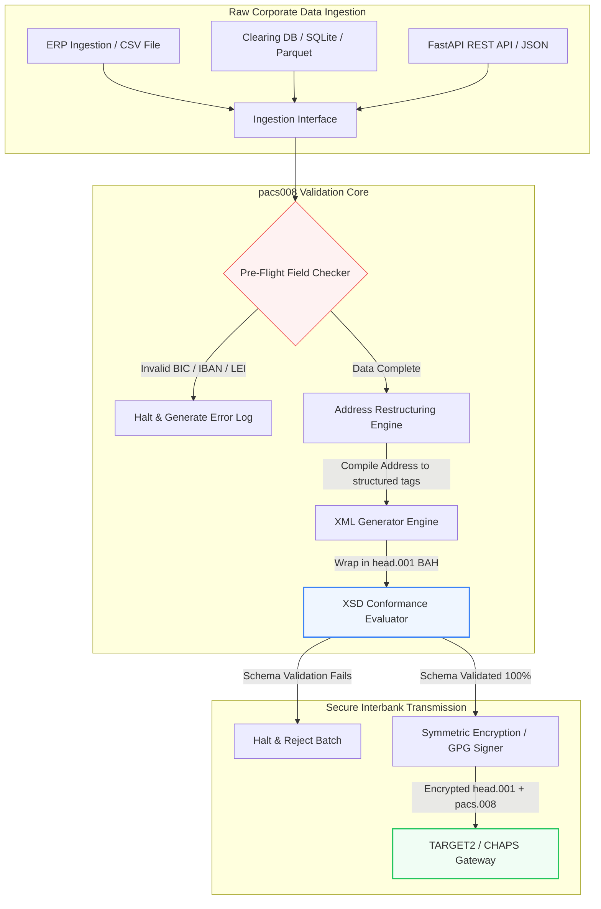

---

# Front Matter (YAML)

author: "contact@sebastienrousseau.com (Sebastien Rousseau)"
banner_alt: "Òṣìṣẹ́ ọ́fíìsì pẹ̀lú olùrànlọ́wọ́ ohùn àti laptop — àpẹẹrẹ àwọn ìránṣẹ́ ìsanwó láàárín àwọn báńkì tó ní ètò, tó ṣe é kà fún ẹ̀rọ, tí àdàṣe pacs.008 ń mú di ṣíṣe ìṣàmúlò"
banner_height: "1597"
banner_width: "2584"
banner: "https://cloudcdn.pro/stocks/images/tyler-prahm-lmV3gJSAgbo.webp"
cdn: "https://cloudcdn.pro"
charset: "UTF-8"
cname: "sebastienrousseau.com"
copyright: "© Copyright 2025 - 2026 - Sebastien Rousseau. All rights reserved."
date: "Okudu 15, 2026"
description: "pacs008 jẹ́ ìwé-ìkàwé Python orisun ṣiṣi tó ń ṣe àdàṣe ìṣẹ̀dá àti ìfọwọsì ìránṣẹ́ ISO 20022 pacs.008 FI-to-FI gbígbé awin onibara — àdírẹ́sì tó ní ètò, ìfìpamọ́ BAH head.001, ìfọwọsì BIC/LEI/IBAN, ìwádìí UETR OpenTelemetry — tí a kọ́ fún ọjọ́ ìparí SWIFT November 2026."
format-detection: "telephone=no"
hreflang: "yo"
icon: "https://cloudcdn.pro/clients/sebastienrousseau/v1/logos/sebastienrousseau.svg"
id: "https://sebastienrousseau.com/2026-06-15-pacs008-automation-iso-20022-interbank-payments-2026"
image_alt: "Àwòrán Aláwọ̀ Dúdú àti Funfun ti Sebastien Rousseau"
image_height: "162"
image_width: "162"
image: "https://cloudcdn.pro/stocks/images/sebastien-rousseau.png"
keywords: "pacs008, ISO 20022 pacs.008, gbígbé awin onibara FI-to-FI, àdírẹ́sì tó ní ètò, SWIFT CBPR+, BAH head.001, TARGET2, CHAPS, Fedwire, DORA, BCBS 239, Basel III, UETR, ìfọwọsì LEI, SEPA VoP"
language: "yo-NG"
last_reviewed: "2026-06-15"
layout: "report"
locale: "yo_NG"
logo_alt: "Logo fún Sebastien Rousseau"
logo_height: "44"
logo_width: "44"
logo: "https://cloudcdn.pro/clients/sebastienrousseau/v1/logos/sebastienrousseau.svg"
menu: ""
measurementID: "G-169G4ET5HQ"
name: "Sebastien Rousseau"
permalink: "https://sebastienrousseau.com/2026-06-15-pacs008-automation-iso-20022-interbank-payments-2026"
rating: "general"
referrer: "no-referrer"
robots: "index, follow"
schema: "FAQPage, Article"
seo_title: "Àdàṣe pacs.008 fún Àkókò ISO 20022"
short_name: "sebastienrousseau"
subtitle: "Ìránṣẹ́ pacs.008 ni ibi tí dátà ìsanwó láàárín àwọn báńkì, àdírẹ́sì tó ní ètò, ìbámu, ìṣàrọ́, àti iṣẹ́ ìpinnu ti pàdé."
tags: "pacs008, ISO 20022, ìsanwó láàárín àwọn báńkì, ìsanwó òṣùnwọ̀n, Python"
theme-color: "0, 83, 191"
title: "Kíkọ́ Àdàṣe pacs.008 fún Àkókò Interbank ISO 20022 ní 2026"
url: "https://sebastienrousseau.com/2026-06-15-pacs008-automation-iso-20022-interbank-payments-2026"
viewport: "width=device-width, initial-scale=1, shrink-to-fit=no"

# RSS - The RSS feed front matter (YAML).
atom_link: "https://sebastienrousseau.com/2026-06-15-pacs008-automation-iso-20022-interbank-payments-2026/rss.xml"
category: "Finance"
docs: https://validator.w3.org/feed/docs/rss2.html
generator: "Static Site Generator (SSG) (version 0.0.26)"
item_description: "pacs008 pèsè ìpìlẹ̀ Python orisun ṣiṣi fún àdàṣe àwọn ìránṣẹ́ ISO 20022 FI-to-FI gbígbé awin onibara ní àkókò ìsanwó láàárín àwọn báńkì."
item_guid: "https://sebastienrousseau.com/2026-06-15-pacs008-automation-iso-20022-interbank-payments-2026/rss.xml"
item_link: "https://sebastienrousseau.com/2026-06-15-pacs008-automation-iso-20022-interbank-payments-2026/rss.xml"
item_pub_date: "Mon, 15 Jun 2026 06:06:06 +0000"
item_title: "Kíkọ́ Àdàṣe pacs.008 fún Àkókò Interbank ISO 20022 ní 2026"
last_build_date: "Mon, 15 Jun 2026 06:06:06 +0000"
managing_editor: "contact@sebastienrousseau.com (Sebastien Rousseau)"
pub_date: "Mon, 15 Jun 2026 06:06:06 +0000"
ttl: "60"
type: "article"
webmaster: "contact@sebastienrousseau.com"

# Apple - The Apple front matter (YAML).
apple_mobile_web_app_orientations: "portrait"
apple_touch_icon_sizes: "192x192"
apple-mobile-web-app-capable: "yes"
apple-mobile-web-app-status-bar-inset: "black"
apple-mobile-web-app-status-bar-style: "black-translucent"
apple-mobile-web-app-title: "Àdàṣe pacs.008 fún ISO 20022"
apple-touch-fullscreen: "yes"

# MS Application - The MS Application front matter (YAML).

msapplication-navbutton-color: "0, 83, 191"

# Twitter Card - The Twitter Card front matter (YAML).

twitter_card: "summary_large_image"
twitter_creator: "@wwdseb"
twitter_description: "pacs008 pèsè ìpìlẹ̀ Python orisun ṣiṣi fún àdàṣe àwọn ìránṣẹ́ ISO 20022 FI-to-FI gbígbé awin onibara ní àkókò ìsanwó láàárín àwọn báńkì."
twitter_image: "https://cloudcdn.pro/clients/sebastienrousseau/v1/logos/sebastienrousseau.svg"
twitter_image_alt: "Logo ti Sebastien Rousseau"
twitter_site: "@wwdseb"
twitter_title: "Àdàṣe pacs.008 fún Àkókò ISO 20022"
twitter_url: "https://sebastienrousseau.com/2026-06-15-pacs008-automation-iso-20022-interbank-payments-2026"

excerpt: "pacs008 jẹ́ irinṣẹ́ Python orisun ṣiṣi tó ń mú àwọn ìránṣẹ́ ISO 20022 FI-to-FI gbígbé awin onibara di ṣíṣe ìṣàmúlò — àdírẹ́sì tó ní ètò, ìfọwọsì, ìṣàrọ́, àwọn ìkọ́ ìbámu, àti ọjọ́ ìparí SWIFT November 2026 ti wà gẹ́gẹ́ bí àwọn ààyò ìpìlẹ̀."

# Humans.txt - The Humans.txt front matter (YAML).
author_website: "https://sebastienrousseau.com"
author_twitter: "@wwdseb"
author_location: "London, UK"
thanks: "Ẹ ṣé fún kíkà!"
site_last_updated: "2026-06-15"
site_standards: "HTML5, CSS3, RSS, Atom, JSON, XML, YAML, Markdown, TOML"
site_components: "Kaishi, Kaishi Builder, Kaishi CLI, Kaishi Templates, Kaishi Themes"
site_software: "Static Site Generator, Rust"

---

# Àdàṣe Ìsanwó Interbank ISO 20022 pacs.008 pẹ̀lú Python Orisun Ṣiṣi ní 2026

<!-- lead-start -->
<aside class="post-lead" aria-label="Àkótán àpilẹ̀kọ">

<strong>TL;DR.</strong> Lábẹ́ àwọn ìtọ́sọ́nà SWIFT CBPR+, November 14, 2026 Ààlà Àdírẹ́sì Tó Ní Ètò ń yọ àwọn àdírẹ́sì ìfìránṣẹ́ láìní ètò kúrò ní TARGET2, CHAPS, Fedwire, Lynx, àti SEPA. pacs008 jẹ́ ìwé-ìkàwé Python orisun ṣiṣi tó ń ṣe àdàṣe ìṣẹ̀dá àti ìfọwọsì ìránṣẹ́ ISO 20022 FI-to-FI gbígbé awin onibara (pacs.008), tó ń fi àwọn ìsanwó pamọ́ sínú Business Application Headers (BAH head.001), tó sì ń sin ìbámu àdírẹ́sì tó ní ètò sínú ọ̀nà dátà kí ìránṣẹ́ tó kàn nẹ́tíwọ́kì ìpinnu.

<strong>Àwọn àyọkà pàtàkì</strong>

<ul class="post-lead-takeaways">
  <li><strong>Ọjọ́ Ìparí Àdírẹ́sì Tó Ní Ètò kò ní ìṣípadà.</strong> Lẹ́yìn November 14, 2026, a yọ àwọn òbìrìkítí àdírẹ́sì láìní ètò kúrò. pacs008 ń fi agbára mú àwọn ẹ̀yà àdírẹ́sì ìfìránṣẹ́ tó ní ètò (<code>&lt;TwnNm&gt;</code>, <code>&lt;Ctry&gt;</code>, <code>&lt;PstCd&gt;</code>) ní àkójọpọ̀ dátà láti dáàbò bo ìkọ̀sílẹ̀ ní ààlà.</li>
  <li><strong>Ìṣọ̀kan ìṣàrọ́ ìránṣẹ́.</strong> Ó ń fi èrò ìsanwó pacs.008 ìpìlẹ̀ pamọ́ sínú òbìrìkítí Business Application Header (head.001) tó bá ìbámu mu, tó sì ń pèsè àpẹẹrẹ ìṣiṣẹ́ ìpadàbọ̀ òṣùnwọ̀n.</li>
  <li><strong>Ìjásí àlgorithm.</strong> Àwọn olùfọwọsì tí a sin sí inú fún BICs àti Legal Entity Identifiers (LEIs) ní lílo ìṣirò òṣùnwọ̀n ISO 7064 Modulo 97-10.</li>
  <li><strong>Ìwádìí tó bá DORA mu.</strong> Ìfàyàrá OpenTelemetry kíkún tó dá lórí Unique End-to-End Transaction Reference (UETR) fún àkọsílẹ̀ àyẹ̀wò àkókò gangan àti àmì àyẹ̀wò ìpamọ́.</li>
  <li><strong>Ìpamọ́ ojúṣe ìṣàkóso ní ipele bọ́ọ̀dù.</strong> Ó ń bá ìdájú ìránṣẹ́ interbank mu pẹ̀lú DORA Àpilẹ̀kọ 5, ìròyìn BCBS 239, àti àfipamọ́ owó ewu ìṣiṣẹ́ Basel III.</li>
</ul>

<strong>Àwọn àpilẹ̀kọ tó jẹ mọ́ ọn:</strong> <a href="https://sebastienrousseau.com/2026-05-19-global-wholesale-payments-economics-2026">Ìsanwó Òṣùnwọ̀n Àgbáyé ní 2026: ISO 20022, Ìmúlò RTGS, àti Ọrọ̀-ajé Ìbárasọ̀rọ̀</a>, <a href="https://sebastienrousseau.com/2026-05-27-ai-operating-system-payments-fraud-routing-resilience-compliance-2026">AI gẹ́gẹ́ bí Ètò Ìṣiṣẹ́ Ìsanwó: Jìbìtì, Ìṣàrọ́, Ìfaradà, àti Ìbámu ní 2026</a>, <a href="https://sebastienrousseau.com/2026-05-12-iso-20022-pacs008-structured-address-deadline">Ọjọ́ Ìparí Àdírẹ́sì Tó Ní Ètò pacs.008 November 2026: Èèdì Oṣù Mẹ́fà</a>.

</aside>
<!-- lead-end -->

Ìsopọ̀ aafo láàárín dátà ìnáwó àtijọ́ àti ìfìránṣẹ́ interbank tó ní ètò nípasẹ̀ ọ̀nà Python tí a lè ṣàyẹ̀wò, tí a sì fọwọsi pẹ̀lú àwòkọ́ṣe.

Ipilẹ̀ ìtọ́kasí orisun ṣiṣi fún àpilẹ̀kọ yìí ni [pacs008 ⧉](https://github.com/sebastienrousseau/pacs008 "pacs008 — ìwé-ìkàwé Python orisun ṣiṣi"). A ti fi ìpamọ́ náà sí gẹ́gẹ́ bí ìwé-ìkàwé Python fún àdàṣe àwọn ìránṣẹ́ XML ISO 20022 pacs.008 FI-to-FI gbígbé awin onibara.

## Ìdí Tí Iṣẹ́ Orisun Ṣiṣi Yìí Fi Ṣe Pàtàkì ní 2026

Ìpilẹ̀ ìpinnu ìsanwó interbank àgbáyé ń kọjá ìmúlò tó jinlẹ̀ jùlọ ní ìdá-ìdá ọgọ́rùn-ún ọdún.

Ní Okudu 2026, ẹ̀ka iṣẹ́ ìnáwó ti súnmọ́ **Ààlà Àdírẹ́sì Tó Ní Ètò SWIFT November 14, 2026**. Láti ọjọ́ yẹn lọ, àwọn ìtọ́sọ́nà SWIFT CBPR+, pẹ̀lú TARGET2, CHAPS, Fedwire, àti Lynx ti Canada, yóò yọ àwọn ìlà àdírẹ́sì ìfìránṣẹ́ láìní ètò kúrò ní gbangba (èyí tó ń lò `<AdrLine>` nìkan nínú àwọn òbìrìkítí `<PstlAdr>`). Gbogbo àwọn ilé-ìṣirò owó tó ń kópa gbọ́dọ̀ fi àwọn àdírẹ́sì ránṣẹ́ yálà ní ìṣàkójọpọ̀ híbírídì (`<TwnNm>` àti `<Ctry>` tó ní ètò, pẹ̀lú àwọn ẹ̀yà `<AdrLine>` méjì jùlọ fún àwọn àlàyé tó kù) tàbí ní ìṣàkójọpọ̀ tó ní ètò gbangba (àwọn ẹ̀yà ọ̀tọ̀ọ̀tọ̀ fún orúkọ òpópó, nọ́mbà ilé, àti kóòdù ìfìránṣẹ́). A óò kọ ìránṣẹ́ èyíkéyìí tí kò bá pàdé àwọn òṣùnwọ̀n yìí sílẹ̀ ní ààlà nẹ́tíwọ́kì.

Fún àwọn ilé-ìṣirò owó, ìṣíkiri yìí ń dá àwọn ìnira ìṣiṣẹ́ ńlá sílẹ̀:

1. **Ìjìyà ìkọ̀sílẹ̀ ààlà.** Àwọn ìsanwó tí kò bá pàdé àwọn ìtọ́kasí àdírẹ́sì tó ní ètò yóò pàdé ìkọ̀sílẹ̀ nẹ́tíwọ́kì lójú ẹsẹ̀, tó ń dá ìdúró ìṣòwò, ìdíwọ́ owó wíwà, àti àfọwọ́ ìṣiṣẹ́ sílẹ̀.
2. **SEPA Verification of Payee (VoP).** Ó ń ṣe àṣẹ pé gbogbo àwọn Payment Service Providers (PSPs) nínú àgbègbè SEPA gbọ́dọ̀ fọwọsi ìbáramu láàárín orúkọ olùgbà àti IBAN kí wọn tó ṣe àwọn gbígbé awin, èyí tó ń fi ẹnu-ọ̀nà ìfọwọsì mìíràn kún ìbẹ̀rẹ̀ ìránṣẹ́.

[pacs008](https://github.com/sebastienrousseau/pacs008) ń yanjú ìṣòro yìí. Ó jẹ́ ìwé-ìkàwé Python orisun ṣiṣi tó fẹ́rẹ̀ẹ́, tó ń ṣe àdàṣe ìyípadà dátà ìnáwó òṣùwọ̀n sí àwọn ìránṣẹ́ gbígbé awin onibara interbank ISO 20022 pacs.008 tí a ti fọwọsi gbangba, tí ó sì bá àwòkọ́ṣe mu. Nípa pípa aafo dátà àtijọ́-sí-tó-ní-ètò, pacs008 ń pèsè Return on Resilience (RoR) tó ga, ó ń pa owó iṣẹ́ wíwà mọ́, ó sì ń dáàbò bo ìṣiṣẹ́ àkókò gangan kọjá àwọn ọ̀nà àgbáyé.

## Èèdì Ìkọ́lé pacs008 ní 2026

A ti gbé ìwé-ìkàwé pacs008 kalẹ̀ gẹ́gẹ́ bí ẹ̀rọ ìfọwọsì àti ìṣẹ̀dá tí a kò sopọ̀, tí ó ń ṣe ìdáńdé pé a kọ́, a fi agbára kún, a sì fi àwọn dátà òṣùwọ̀n pamọ́ sínú àwọn òbìrìkítí òṣùnwọ̀n:

| Ìpele | Ìpinnu Àpẹẹrẹ | Ìdí Tí Ó Fi Ṣe Pàtàkì | Ewu Bí A Kò Bá Ṣàkóso |
|---|---|---|---|
| **Ìpele Ìkọsí** | Ìkọsí CSV, JSON, SQLite, àti Parquet | Ó pàdé àwọn ẹgbẹ́ ìṣọ̀kan báńkì níbi tí dátà wọn ti wà tẹ́lẹ̀, tó ń dáàbò bo ìṣíkiri pẹpẹ. | Ìkọsí àwọn ẹrù dátà òṣùwọ̀n, tí a kò fọwọsi, tàbí tí a ti bàjẹ́. |
| **Ìpele Ìfọwọsì** | Ìfọwọsì ṣáájú-òfo lòdì sí àwọn àwòkọ́ṣe XSD òṣèlú àti àwọn òfin iṣẹ́ àdáyé | Ó dá ìṣiṣẹ́ dúró, ó sì ń fi àwọn àṣìṣe hàn kí a tó fi fáìlì ìsanwó ránṣẹ́ sí nẹ́tíwọ́kì ìpinnu. | Àwọn fáìlì XML tí kò pé tí ń dá ìkọ̀sílẹ̀ nẹ́tíwọ́kì lójú ẹsẹ̀ àti ìdúró ìpinnu sílẹ̀. |
| **Ìpele Òbìrìkítí BAH** | Àdàṣe ìfìpamọ́ Business Application Header (head.001) | Ó ń sọ ìṣàrọ́ àti ìfìránṣẹ́ ìránṣẹ́ di òṣùnwọ̀n nípa àmì `<MsgDefIdr>`. | Fífi àwọn ẹrù pacs.008 òṣùwọ̀n ránṣẹ́ láìsí òbìrìkítí òde tí a nílò, tó ń mú kí ètò kọ̀ wọ́n sílẹ̀. |
| **Ìpele Serialization** | Àtìlẹ́yìn XML òṣùnwọ̀n àti JSON tó bá ISO mu (TS 23029) | Ó jẹ́ kí ìyípadà tààrà àárín àwọn ẹrù XML àti JSON ṣeé ṣe, tó ń ṣe àtìlẹ́yìn fún REST API òde-òní àti ṣíṣàn Kafka. | Àwọn àpẹẹrẹ dátà tó ya ìpin tó ń tako àwọn ìtọ́sọ́nà ISO òṣèlú. |
| **Ìpele Observability** | Ìfàyàrá OpenTelemetry tó dá lórí UETR | Ó ń mú àwọn ọ̀nà ìṣiṣẹ́ àti àkọsílẹ̀ tí a ṣàlàyé, tó ń pèsè agbára àyẹ̀wò àkókò gangan. | Àwọn aafo ìfàyàrá tí ń dí ìríran ìṣiṣẹ́ àti àyẹ̀wò lọ́nà. |

## Àwọn Àmì Interbank àti Àwọn Ìpàdé Òfin Pàtàkì

Láti fi ìfaradà ìṣiṣẹ́ ìṣòwò hàn, àwọn olùṣàkóso imọ̀-ẹ̀rọ àgbà àti ewu gbọ́dọ̀ tọ́jú àwọn àmì ìbámu pàtó, tí a lè wọn:

| Àmì | Òṣùnwọ̀n / Ìwọ̀n Ìṣiṣẹ́ | Ìtọ́kasí G20 / SWIFT / DORA | Ìṣàmúlò Pẹpẹ Imọ̀-ẹ̀rọ |
|---|---|---|---|
| **Ìbámu Àdírẹ́sì Tó Ní Ètò** | % àwọn ìránṣẹ́ pacs.008 tí ó ń lo àwọn pápá `<PstlAdr>` tó ní ètò gbangba pẹ̀lú `<TwnNm>` àti `<Ctry>` tí a tọ́ka sí. | Ọjọ́ Ìparí SWIFT SR 2026 | Àwọn àyẹ̀wò àwòkọ́ṣe ṣáájú-òfo nínú pacs008 tó ń kọ àwọn ìlà àdírẹ́sì láìní ètò sílẹ̀. |
| **SEPA Verification of Payee** | Ìfọwọsì ìbáramu láàárín orúkọ olùgbà àti IBAN kí ìṣiṣẹ́ ìránṣẹ́ tó bẹ̀rẹ̀. | Òfin SEPA VoP | Àwọn kíláàsì olùrànlọ́wọ́ VoP tí a sin sí inú tó ń ṣe àwọn ìbéèrè ìfọwọsì ṣáájú lórí IBAN/BIC. |
| **Ìṣọ̀kan BAH head.001** | Ìdá àwọn ẹrù ìsanwó tó ń jáde tí a fi pamọ́ ní àṣeyọrí sínú Business Application Headers. | Àwọn Ìtọ́sọ́nà TARGET2 / CBPR+ | Ètò ìfìpamọ́ BAH tó ń kọ òbìrìkítí XML òde sílẹ̀ lọ́nà àdàṣe. |
| **Òṣùnwọ̀n Modulo LEI** | Ìfọwọsì àmì-tó-yà ISO 7064 Modulo 97-10 lórí àwọn òbìrìkítí `<LEI>` olùdá àti olùgbà. | Àṣẹ Bank of England | Olùyẹ̀wò àlgorithm tó ń jẹ́rìí sí ìjásí àmì-ìdánimọ̀ ẹ̀yà-20. |
| **Ìjásí Ìfàyàrá UETR** | 100% ti àwọn ìsanwó tí a ṣẹ̀dá ni a fi Unique End-to-End Transaction Reference tó tọ́ kún. | Àwọn Ìtọ́kasí UETR SWIFT | Ìṣẹ̀dá àdàṣe àti ìfàyàrá ti àmì-ìtọ́kasí UUIDv4 tó ní ẹ̀yà-36. |

## Ìdí Tí Python Fi Jẹ́ Ọ̀nà Ìbẹ̀rẹ̀ Tó Bá Àdàṣe Interbank Mu

Àwọn ìpamọ́ ìsanwó òde-òní àti àwọn ẹgbẹ́ iṣẹ́ ìṣàkóso owó ní 2026 gbára lé Python lọ́pọ̀ fún ìyípadà dátà, ìṣàpẹẹrẹ ìnáwó, àti ìṣọ̀kan ibi-ìpamọ́ dátà ERP.

Nípa lílo ìwé-ìkàwé Python orisun ṣiṣi, àwọn ilé-ìṣirò owó ń jẹ àǹfààní ńlá:

1. **Ẹrù ìmọ̀ kéré àti ìbárasọ̀rọ̀ ga.** Python ń ṣiṣẹ́ gẹ́gẹ́ bí afárá tó so àwọn nǹkan pọ̀. Ó ń jẹ́ kí àwọn olùṣèlò kọ àwọn ìwé-ìṣirò rọrùn tó ń fa àwọn ìtọ́ni ìsanwó òṣùwọ̀n láti àwọn ibi-ìpamọ́ dátà àtijọ́, tó ń fọwọsi wọ́n lòdì sí àwọn òfin ìṣiṣẹ́ báńkì àgbáyé tó nira, tó sì ń tú XML tó bá ìbámu mu jáde nínú ọ̀nà iṣẹ́ ọ̀kan tí a so pọ̀.
2. **Ìparẹ́ àwọn olùyípadà "black-box" tí kò ṣàlàyé.** Àwọn ọ̀nà báńkì òṣèlú máa ń gba owó ìwé-àṣẹ ńlá fún àwọn olùyípadà fáìlì ìsanwó àdáyé. Àwọn olùyípadà yẹn jẹ́ àwọn àpòti dúdú òṣèlú, èyí tó ń mú kí ó ṣòro fún àwọn ẹgbẹ́ ààbò láti ṣàyẹ̀wò bí a ṣe ń ṣiṣẹ́ dátà tàbí ibi tí a ti pa àwọn kọ́kọ́rọ́ mọ́. Ìwé-ìkàwé orisun ṣiṣi, tó ṣeé ṣàyẹ̀wò bíi pacs008 ń ṣe ìdáńdé ìfihàn kóòdù kíkún.
3. **Ìṣọ̀kan CI/CD tó rọrùn.** pacs008 ń wọ̀ tààrà sí inú àwọn ìpamọ́ ìṣọ̀kan àti ìṣàfilọ́lẹ̀ tó ń bá a lọ, tó ń jẹ́ kí àwọn olùṣèlò ṣe àdàṣe ìdánwò fáìlì ìsanwó gẹ́gẹ́ bí ara àyè ìfilọ́lẹ̀ sọ́fíítìwérì wọn.

## Ṣíṣe Ìpèsè Ọ̀nà Interbank Tó Ní Àlọ́

Ààlà pàtàkì kan ní ìpinnu interbank ni "ìṣẹ̀dá òbìrìkítí láìní ìṣàkóso" — ṣíṣe àwọn fáìlì láìsí àyè ìfọwọsì tó ní ààlà tó kedere. A ti ṣe àpẹẹrẹ pacs008 láti ṣiṣẹ́ gẹ́gẹ́ bí ẹ̀rọ ìfọwọsì ìpìlẹ̀ nínú ọ̀nà ìṣòwò onípele-pupọ̀ tí a ṣàkóso ní gbígbóná.

Ọ̀nà ìṣiṣẹ́ tó wà nísàlẹ̀ ń fi hàn bí dátà ìṣòwò òṣùwọ̀n ṣe ń kọjá inú ọ̀nà pacs008 láti ṣẹ̀dá fáìlì pacs.008 tó ní ààbò ìpamọ́, tó bá àwòkọ́ṣe mu, tí a fi pamọ́ sínú òbìrìkítí BAH:

## Ìwé-Ìṣiṣẹ́ Bọ́ọ̀dù àti Ojúṣe Ìṣàkóso

Àdàṣe ìsanwó interbank jẹ́ ìṣòro ìṣàkóso ewu àti ìṣèlú-ilé-iṣẹ́ ní ipele bọ́ọ̀dù. Àwọn olùṣàkóso àgbà gbọ́dọ̀ kojú dídára dátà ìṣòwò nípasẹ̀ ojú ojúṣe àti ìdín ewu ìṣiṣẹ́ kù:

- **DORA Àpilẹ̀kọ 5 (Ojúṣe Bọ́ọ̀dù).** Ó fi ojúṣe tààrà, ti ara ẹni lé àwọn ọmọ ẹgbẹ́ bọ́ọ̀dù lórí ìfaradà àti ààbò ìṣiṣẹ́ ICT ti ilé-iṣẹ́. Nítorí pé ìpinnu interbank jẹ́ iṣẹ́ ilé-iṣẹ́ pàtàkì, àwọn bọ́ọ̀dù gbọ́dọ̀ fi hàn pé wọ́n ti ṣe àwọn ìṣàkóso ìṣòwò tó lágbára, tí a fọwọsi, tí a sì ṣe àdàṣe láti dáàbò bo àwọn ìdíwọ́ ìṣiṣẹ́ tàbí àwọn ìsanwó tí ó ń dúró.
- **BCBS 239 (Àkójọpọ̀ Dátà Ewu àti Ìròyìn).** Ó ń béèrè pé kí ìròyìn ìṣòwò ìnáwó dájú, kí ó pé, kí a sì ṣẹ̀dá rẹ̀ ní àkókò gangan. pacs008 ń ràn àwọn ilé-ìṣirò owó lọ́wọ́ láti ṣe àṣeyọrí ìbámu BCBS 239 nípa ṣíṣe ìdáńdé pé dátà ìsanwó ní ètò mímọ́ tí a sì fọwọsi ní orísun, tó ń pa àwọn aafo dátà àti àwọn àṣìṣe ìbárasọ̀rọ̀ àfọwọ́ tó ń yọ àwọn spreadsheet àtijọ́ lẹ́nu kúrò.
- **Ìdín Owó Ewu Ìṣiṣẹ́ kù (Basel III).** Lábẹ́ àwọn ìtọ́sọ́nà Basel III, oṣuwọn àṣìṣe ìsanwó tó ga àti ẹrù àfọwọ́sí àfọwọ́ ń mú kí àwọn ìbéèrè owó ewu ìṣiṣẹ́ báńkì pọ̀ sí i, èyí tó ń di owó tí a lè lò fún awin tàbí ìnáwó. Àdàṣe ọ̀nà ìsanwó ń dín àwọn ìṣanwó owó yẹn kù tààrà, tó ń pa iye iwé-ìṣirò mọ́.

## Kínní Èyí Túmọ̀ Sí Nípa Irú Báńkì

### Àwọn Báńkì Pàtàkì Ètò Àgbáyé (G-SIBs)

Àwọn G-SIBs ń ṣàkóso àwọn iye ìṣòwò ilé-iṣẹ́ ńlá, tó kọjá ààlà. Ìnira ìpìlẹ̀ wọn ni àtúnṣe dátà àtijọ́ láìní ètò kí ó tó dé nẹ́tíwọ́kì ìpinnu. Nípa fífi pacs008 sí inú àwọn ọ̀nà báńkì ilé-iṣẹ́ wọn, àwọn G-SIBs lè pèsè àwọn irinṣẹ́ ìfọwọsì àdàṣe fún àwọn oníbàátì ilé-iṣẹ́ wọn, tó ń dín ẹrù àtúnṣe ìsanwó àfọwọ́ kù, tó sì ń dáàbò bo ìṣiṣẹ́ àkókò gangan kọjá nẹ́tíwọ́kì SWIFT.

### Àwọn Báńkì Ìṣòwò àti Ilé-iṣẹ́

Fún àwọn báńkì ìṣòwò, dídára dátà ìsanwó jẹ́ àyà ìdánilójú ìjà. Nípa fífi irinṣẹ́ ìfọwọsì orisun ṣiṣi, tó ṣeé ṣàyẹ̀wò bíi pacs008 fún àwọn oníbàátì ìṣàkóso owó ilé-iṣẹ́, àwọn báńkì wọnyí lè yára ìṣàkóso onibara, dín ìkọ̀sílẹ̀ fáìlì ìsanwó kù, kí wọ́n sì kọ́ ìgbẹ́kẹ̀lé oníbàátì nípasẹ̀ oṣuwọn ìṣiṣẹ́ tààrà tó ga.

### Àwọn Báńkì Àgbègbè àti Kéékèèké

Àwọn báńkì àgbègbè gbọ́dọ̀ pa ìbámu pẹ̀lú àwọn òṣùnwọ̀n ìsanwó àgbáyé mọ́ láìsí àwọn ìnáwó imọ̀-ẹ̀rọ ńlá ti G-SIBs. pacs008 ń pèsè ọ̀nà tó fẹ́rẹ̀ẹ́, tó wọ́pọ̀, tó sì bá ìbámu mu gbangba, tí ó dá lórí Python, tó ń jẹ́ kí àwọn ilé-ìṣirò kéékèèké pèsè agbára ìbẹ̀rẹ̀ ìsanwó òde-òní tó ní ètò láìsí àwọn ìwé-àṣẹ middleware òṣèlú tó wọ́n.

## Ìparí: Ìwé-Òpópó Ìpinnu Interbank

Ọjọ́ ìparí àdírẹ́sì tó ní ètò SWIFT November 2026 tó ń bọ̀ jẹ́ ààlà lílera fún àwọn iṣẹ́ ìṣàkóso owó ilé-iṣẹ́. Gbígbára lé àwọn spreadsheet àtijọ́, ìfikún dátà àfọwọ́, àti àwọn fáìlì ìsanwó láìní ètò jẹ́ ewu iṣẹ́ ṣíṣe.

Láti dáàbò bo ìtẹ̀síwájú ìṣòwò àti dín ẹrù ìṣiṣẹ́ kù, àwọn olùṣàkóso imọ̀-ẹ̀rọ àti ìnáwó àgbà gbọ́dọ̀ ṣe ìwé-òpópó ìpinnu kedere lónìí:

1. **Fi agbára mú ìfọwọsì ní orísun.** Ṣe àṣẹ pé gbogbo àwọn ìtọ́ni ìsanwó gbọ́dọ̀ ní ìfọwọsì àti ìṣàkójọpọ̀ gẹ́gẹ́ bí àwọn àwòkọ́ṣe XSD ISO 20022 òṣèlú kí ó tó jáde kúrò ní àwọn ààlà ERP ilé-iṣẹ́.
2. **Ṣàyẹ̀wò ọ̀nà dátà.** Yí ọ̀nà padà kúrò ní ìṣiṣẹ́ spreadsheet àfọwọ́, kí o sì fi àwọn iṣẹ́ Python àdàṣe, tó ṣeé ṣàyẹ̀wò sí ipò ní lílo pacs008.
3. **Ṣe àdàṣe ààbò híbírídì.** Ṣe ìdáńdé pé a fi àmì sí àwọn fáìlì ìsanwó tí a ṣẹ̀dá, tí a sì fi pamọ́ kí a tó fi ránṣẹ́, tó ń pàdé ìfojúsùn nẹ́tíwọ́kì zero-trust.
4. **Bá àwọn ààyò ìṣàkóso mu.** Ṣe ìròyìn àwọn òṣùnwọ̀n àdàṣe ìsanwó àti dídára dátà sí bọ́ọ̀dù lọ́nà ìṣètò, kí o sì fi ìnáwó hàn gẹ́gẹ́ bí ètò ìdín ewu ìṣiṣẹ́ pàtàkì lábẹ́ DORA.

## Àwọn Ìbéèrè Tí A Ń Béèrè Léraléra

**Ǹjẹ́ pacs008 bá àwọn òfin àdírẹ́sì SWIFT SR 2026 tó ń bọ̀ mu?**

Bẹ́ẹ̀ ni. A ti ṣe àpẹẹrẹ pacs008 láti ṣe àtìlẹ́yìn fún àmì àdírẹ́sì tó ní ètò SWIFT November 2026 tó lera, tó ń fi agbára mú ìpínyà àwọn ẹ̀yà àdírẹ́sì ìfìránṣẹ́ (ìlú, orílẹ̀-èdè, kóòdù ìfìránṣẹ́) sí àwọn pápá XML ISO 20022 tí a tọ́ka sí.

**Ǹjẹ́ pacs008 lè fi àwọn ẹrù ìsanwó pamọ́ sínú Business Application Headers?**

Bẹ́ẹ̀ ni. Nítorí pé pacs008 ń ṣe àtìlẹ́yìn ìfìpamọ́ Business Application Header (BAH head.001) ní àkójọpọ̀, ó ń kọ òbìrìkítí òde tí a nílò fún àwọn nẹ́tíwọ́kì TARGET2, CHAPS, àti CBPR+ sílẹ̀ lọ́nà àdàṣe.

**Ìdí tí ó fi yẹ kí a fẹ́ ìwé-ìkàwé orisun ṣiṣi ju àwọn olùyípadà fáìlì òṣèlú?**

Àwọn olùyípadà òṣèlú jẹ́ àpòti dúdú tí kò ṣàlàyé, èyí tó ń mú kí àyẹ̀wò ààbò ṣòro láti ṣe. Ìwé-ìkàwé orisun ṣiṣi, tí a ti ṣàyẹ̀wò nípasẹ̀ àwọn ọmọ ẹgbẹ́ bíi pacs008 ń pèsè ìfihàn kóòdù kíkún, tó ń jẹ́ kí àwọn ẹgbẹ́ ààbò fọwọsi pé kò sí dátà ìsanwó tó ní ìmọ̀-ìjìnlẹ̀ tí a ń fihàn lákòókò ìṣiṣẹ́.

**Àwọn àmì-ìdánimọ̀ wo ni pacs008 ń fọwọsi?**

pacs008 wá pẹ̀lú àwọn olùfọwọsì tí a sin sí inú fún Bank Identifier Codes (BICs) àti Legal Entity Identifiers (LEIs) ní lílo ìṣirò òṣùnwọ̀n ISO 7064 Modulo 97-10, pẹ̀lú ìfọwọsì àmì-tó-yà IBAN àti àwọn àyẹ̀wò ìyàtọ̀ UETR.

## Àwọn Ìtọ́kasí

- SWIFT, (2024). *ISO 20022 November 2026 Structured Address Milestone*. La Hulpe: SWIFT. Wà ní: [Àmì ISO 20022 SWIFT ⧉](https://www.swift.com/standards/iso-20022/iso-20022-bytes/call-action-november-2026 "Àmì ISO 20022 SWIFT").
- Basel Committee on Banking Supervision (BCBS), (2013). *Principles for effective risk data aggregation and risk reporting (BCBS 239)*. Basel: Bank for International Settlements. Wà ní: [Àwọn Àṣàrò BCBS 239 ⧉](https://www.bis.org/publ/bcbs239.htm "Àwọn àṣàrò BCBS 239").
- European Parliament and Council of the European Union, (2022). *Regulation (EU) 2022/2554 on digital operational resilience for the financial sector (DORA)*. Brussels: Official Journal of the European Union. Wà ní: [Òfin DORA ⧉](https://eur-lex.europa.eu/legal-content/EN/TXT/?uri=CELEX%3A32022R2554 "Òfin DORA").
- GitHub, (2026). *Ìpamọ́ orisun ṣiṣi pacs008*. Wà ní: [Ìpamọ́ pacs008 ⧉](https://github.com/sebastienrousseau/pacs008 "Ìpamọ́ pacs008").

<!-- enrich-start -->
<aside class="author-card" aria-label="Nípa Onkọ̀wé"><strong class="author-card-name"><a href="/about/index.html">Sebastien Rousseau</a></strong>Onímọ̀ ẹ̀rọ báńkì àgbà tó ń kọ nípa AI tí a lò, ìṣíkiri ISO 20022, ìpamọ́ post-quantum fún iṣẹ́ ìnáwó, àti ìmúlò ìpilẹ̀ ti àwọn ìsanwó òṣùnwọ̀n.Ọdún 20+ kọjá HSBC Commercial &amp; Investment Bank, PayPal, Barclays, Shazam, AKQA, Virgin Group. <a href="/about/index.html">Profaìlì kíkún</a> &middot; <a href="https://www.linkedin.com/in/sebastienrousseau/" rel="external noopener">LinkedIn</a> &middot; <a href="https://github.com/sebastienrousseau" rel="external noopener">GitHub</a></aside>

Àyẹ̀wò tó kẹ́yìn <time datetime="2026-06-15">2026-06-15</time>.

<aside class="related-posts" aria-labelledby="related-heading">
<h2 id="related-heading" class="related-heading">Àwọn àpilẹ̀kọ tó jẹ mọ́ ọn</h2>

<article class="related-card"><footer class="related-body"><h3><a href="https://sebastienrousseau.com/2026-05-19-global-wholesale-payments-economics-2026">Ìsanwó Òṣùnwọ̀n Àgbáyé ní 2026: ISO 20022, Ìmúlò RTGS, àti Ọrọ̀-ajé Ìbárasọ̀rọ̀</a></h3>
<time datetime="2026-05-19">2026-05-19</time>
</footer></article>
<article class="related-card"><footer class="related-body"><h3><a href="https://sebastienrousseau.com/2026-05-27-ai-operating-system-payments-fraud-routing-resilience-compliance-2026">AI gẹ́gẹ́ bí Ètò Ìṣiṣẹ́ Ìsanwó: Jìbìtì, Ìṣàrọ́, Ìfaradà, àti Ìbámu ní 2026</a></h3>
<time datetime="2026-05-27">2026-05-27</time>
</footer></article>
<article class="related-card"><footer class="related-body"><h3><a href="https://sebastienrousseau.com/2026-05-12-iso-20022-pacs008-structured-address-deadline">Ọjọ́ Ìparí Àdírẹ́sì Tó Ní Ètò pacs.008 November 2026: Èèdì Oṣù Mẹ́fà</a></h3>
<time datetime="2026-05-12">2026-05-12</time>
</footer></article>

</aside>
<!-- enrich-end -->
