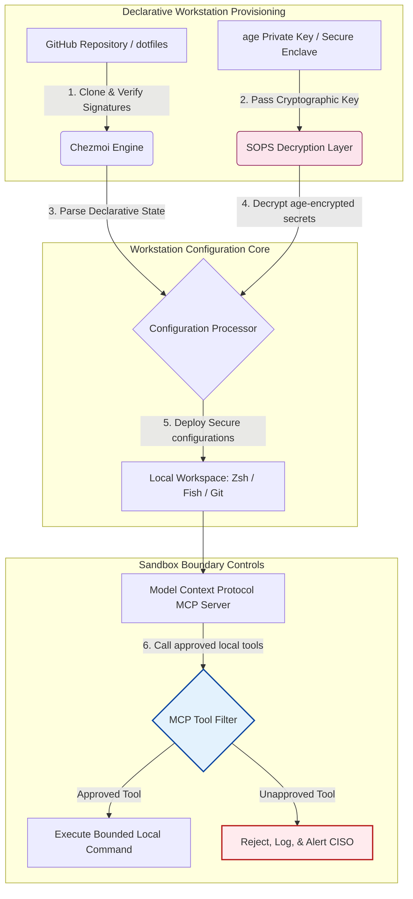

---

# Front Matter (YAML)

author: "contact@sebastienrousseau.com (Sebastien Rousseau)"
banner_alt: "Ibi iṣẹ́ olùdàgbàsókè nínú ìmọ́lẹ̀ kékeré — àmì dotfiles tó mọ AI, ìbára-mu, ààbò fún àwọn olùṣiṣẹ́ MCP, ìfọwọ́sí SLSA, àṣírí age/SOPS, àti ìbámu shells púpọ̀"
banner_height: "1597"
banner_width: "2584"
banner: "https://cloudcdn.pro/stocks/images/almas-salakhov-Vq2ap8aFFEs.webp"
cdn: "https://cloudcdn.pro"
charset: "UTF-8"
cname: "sebastienrousseau.com"
copyright: "© Copyright 2025 - 2026 - Sebastien Rousseau. All rights reserved."
date: "June 16, 2026"
description: "Dotfiles tó mọ AI jẹ́ àpẹẹrẹ ibi iṣẹ́ tó ní ààbò àti tí a lè dá padà fún àkókò MCP — ètò ìpolówó nípasẹ̀ Chezmoi, àṣírí SOPS/age, ẹ̀rí orísun SLSA Ìpele 3, ìbámu shells púpọ̀, àti ààlà sandbox fún àwọn aṣojú AI àdúgbò."
format-detection: "telephone=no"
hreflang: "yo"
icon: "https://cloudcdn.pro/clients/sebastienrousseau/v1/logos/sebastienrousseau.svg"
id: "https://sebastienrousseau.com/2026-06-16-ai-aware-dotfiles-secure-reproducible-workstation-2026"
image_alt: "Àwòrán Aláwọ̀ Dúdú àti Funfun ti Sebastien Rousseau"
image_height: "162"
image_width: "162"
image: "https://cloudcdn.pro/stocks/images/sebastienrousseau.webp"
keywords: "dotfiles, Chezmoi, MCP, Model Context Protocol, SLSA, SOPS, age encryption, ètò ìpolówó, ibi iṣẹ́ olùdàgbàsókè, DORA Article 5, NIST CSF 2.0, ààbò ìjẹun ìpèsè, agentic AI, ìbámu shells púpọ̀, Zsh, Fish, Nushell"
language: "yo-NG"
last_reviewed: "2026-06-16"
layout: "report"
locale: "yo_NG"
logo_alt: "Logo fún Sebastien Rousseau"
logo_height: "44"
logo_width: "44"
logo: "https://cloudcdn.pro/clients/sebastienrousseau/v1/logos/sebastienrousseau.svg"
menu: ""
measurementID: "G-169G4ET5HQ"
name: "Sebastien Rousseau"
permalink: "https://sebastienrousseau.com/2026-06-16-ai-aware-dotfiles-secure-reproducible-workstation-2026"
rating: "general"
referrer: "no-referrer"
robots: "index, follow"
schema: "FAQPage, Article"
seo_title: "Dotfiles Tó Mọ AI fún Ibi Iṣẹ́ Olùdàgbàsókè Tó Ní Ààbò"
short_name: "sebastienrousseau"
subtitle: "Ibi iṣẹ́ olùdàgbàsókè ti di apá ìjẹun ìpèsè AI báyìí; dotfiles nílò ààbò, ìbára-mu, ìmọtoto àṣírí, àti àwọn iṣẹ́ tó mọ MCP."
tags: "dotfiles, irinṣẹ́ olùdàgbàsókè, MCP, SLSA, ibi iṣẹ́ tó ní ààbò, chezmoi, macOS, Linux, WSL"
theme-color: "0, 83, 191"
title: "Dotfiles Tó Mọ AI ní 2026: Kíkọ́ Ibi Iṣẹ́ Olùdàgbàsókè Tó Ní Ààbò àti Ìbára-mu fún MCP, SLSA, àti Ìbámu Shells Púpọ̀"
url: "https://sebastienrousseau.com/2026-06-16-ai-aware-dotfiles-secure-reproducible-workstation-2026"
viewport: "width=device-width, initial-scale=1, shrink-to-fit=no"

# RSS - The RSS feed front matter (YAML).
atom_link: "https://sebastienrousseau.com/2026-06-16-ai-aware-dotfiles-secure-reproducible-workstation-2026/rss.xml"
category: "Technology"
docs: https://validator.w3.org/feed/docs/rss2.html
generator: "Static Site Generator (SSG) (version 0.0.26)"
item_description: "Ìwò sí dotfiles ìpolówó fún ibi iṣẹ́ olùdàgbàsókè tó ní ààbò àti tí a lè dá padà lórí macOS, Linux, àti WSL, pẹ̀lú ìmọ̀ MCP, SLSA, age, SOPS, àti ìbámu shells púpọ̀."
item_guid: "https://sebastienrousseau.com/2026-06-16-ai-aware-dotfiles-secure-reproducible-workstation-2026/rss.xml"
item_link: "https://sebastienrousseau.com/2026-06-16-ai-aware-dotfiles-secure-reproducible-workstation-2026/rss.xml"
item_pub_date: "Tue, 16 Jun 2026 06:06:06 +0000"
item_title: "Dotfiles Tó Mọ AI ní 2026: Kíkọ́ Ibi Iṣẹ́ Olùdàgbàsókè Tó Ní Ààbò àti Ìbára-mu fún MCP, SLSA, àti Ìbámu Shells Púpọ̀"
last_build_date: "Tue, 16 Jun 2026 06:06:06 +0000"
managing_editor: "contact@sebastienrousseau.com (Sebastien Rousseau)"
pub_date: "Tue, 16 Jun 2026 06:06:06 +0000"
ttl: "60"
type: "article"
webmaster: "contact@sebastienrousseau.com"

# Apple - The Apple front matter (YAML).
apple_mobile_web_app_orientations: "portrait"
apple_touch_icon_sizes: "192x192"
apple-mobile-web-app-capable: "yes"
apple-mobile-web-app-status-bar-inset: "black"
apple-mobile-web-app-status-bar-style: "black-translucent"
apple-mobile-web-app-title: "Dotfiles Tó Mọ AI fún Ibi Iṣẹ́ Olùdàgbàsókè"
apple-touch-fullscreen: "yes"

# MS Application - The MS Application front matter (YAML).

msapplication-navbutton-color: "0, 83, 191"

# Twitter Card - The Twitter Card front matter (YAML).

twitter_card: "summary_large_image"
twitter_creator: "@wwdseb"
twitter_description: "Ìwò sí dotfiles ìpolówó fún ibi iṣẹ́ olùdàgbàsókè tó ní ààbò àti tí a lè dá padà lórí macOS, Linux, àti WSL, pẹ̀lú ìmọ̀ MCP, SLSA, age, SOPS, àti ìbámu shells púpọ̀."
twitter_image: "https://cloudcdn.pro/clients/sebastienrousseau/v1/logos/sebastienrousseau.svg"
twitter_image_alt: "Logo ti Sebastien Rousseau"
twitter_site: "@wwdseb"
twitter_title: "Dotfiles Tó Mọ AI fún Ibi Iṣẹ́ Olùdàgbàsókè Tó Ní Ààbò"
twitter_url: "https://sebastienrousseau.com/2026-06-16-ai-aware-dotfiles-secure-reproducible-workstation-2026"

excerpt: "Dotfiles tó mọ AI ní 2026 ń mú ibi iṣẹ́ olùdàgbàsókè gẹ́gẹ́ bí ìpìlẹ̀ ìjẹun ìpèsè — ètò ìpolówó tí chezmoi ń ṣàkóso pẹ̀lú ìmọ̀ MCP, àwọn ìtújáde tí SLSA fọwọ́sí, àṣírí age/SOPS, ìbẹ̀rẹ̀ tó kéré sí ìṣẹ́jú àáyá, àti ìbámu macOS/Linux/WSL."

# Humans.txt - The Humans.txt front matter (YAML).
author_website: "https://sebastienrousseau.com"
author_twitter: "@wwdseb"
author_location: "London, UK"
thanks: "A dúpẹ́ pé o kà á!"
site_last_updated: "2026-06-16"
site_standards: "HTML5, CSS3, RSS, Atom, JSON, XML, YAML, Markdown, TOML"
site_components: "Kaishi, Kaishi Builder, Kaishi CLI, Kaishi Templates, Kaishi Themes"
site_software: "Static Site Generator, Rust"

---

# Dotfiles Tó Mọ AI ní 2026: Kíkọ́ Ibi Iṣẹ́ Olùdàgbàsókè Tó Ní Ààbò àti Ìbára-mu fún MCP, SLSA, àti Ìbámu Shells Púpọ̀

<!-- lead-start -->
<aside class="post-lead" aria-label="Àkópọ̀ àpilẹ̀kọ">

<strong>TL;DR.</strong> Ibi iṣẹ́ olùdàgbàsókè kìí ṣe ojú-ìpàdé ẹ̀gbẹ́ mọ́; ó ti di alábàákẹ́gbẹ́ tó ń ṣiṣẹ́ nínú ìjẹun ìpèsè software, ó sì ti di ojú-ìpàdé tààrà fún pẹpẹ ìṣàkóso AI àdúgbò. Àwọn olùrànlọ́wọ́ AI tó dá lórí terminal àti àwọn olùṣiṣẹ́ <a href="https://modelcontextprotocol.io">Model Context Protocol (MCP)</a> ń pe àṣẹ shell àdúgbò, ń ṣàyẹ̀wò ibi ìpamọ́ kóòdù, wọ́n sì ń kà àwọn fáìlì ètò tó ní àṣírí tààrà. <a href="https://github.com/sebastienrousseau/dotfiles">Dotfiles Sebastien Rousseau</a> jẹ́ àwòkọ́ṣe orisun ṣiṣi, ìpolówó tí ń kọ́ àwọn ibi iṣẹ́ tó ní ààbò, tí a lè dá padà lórí macOS, Linux, àti Windows Subsystem for Linux (WSL) — ó ń da <a href="https://www.chezmoi.io/">Chezmoi</a>, <a href="https://github.com/getsops/sops">SOPS, age</a>, àti ẹ̀rí orísun SLSA Ìpele 3 pọ̀ fún ìpinyà àṣírí tó ní ààbò ìrántí àti ọ̀nà ìṣe tó ní ààlà fún àwọn àwòkọ́ṣe AI àdúgbò.

<strong>Àwọn àyọkà pàtàkì</strong>

<ul class="post-lead-takeaways">
  <li><strong>Ibi iṣẹ́ jẹ́ ìpìlẹ̀ ìjẹun ìpèsè.</strong> A gbọ́dọ̀ ṣe ìtọ́jú àwọn ètò àyíká olùdàgbàsókè pẹ̀lú ìbáwí ìpolówó kan náà bí ìfilọ́lẹ̀ olùṣiṣẹ́ ìṣelọ́jà, kí a sì pa ìṣíkiri ètò tí a fi ọwọ́ ṣe rẹ́.</li>
  <li><strong>Ìpèníjà pẹpẹ ìṣàkóso AI.</strong> Àwọn àwòkọ́ṣe AI tó dá lórí terminal àti àwọn irinṣẹ́ MCP lè wọ àwọn ilé-iṣẹ́ àdúgbò. Dotfiles gbọ́dọ̀ fi ààlà sandbox múlẹ̀, àwọn àkójọ ìfàyè irinṣẹ́ tó muna, àti àwọn àkọsílẹ̀ àdúgbò tí a kò lè yí padà láti dáàbò bo dátà.</li>
  <li><strong>Ìbámu kọjá pẹpẹ ní kíkún.</strong> Iṣẹ́ shell kan náà tó kéré sí ìṣẹ́jú àáyá àti àwọn àpẹẹrẹ ààbò kan náà lórí macOS, Linux (Zsh, Fish, Nushell), àti WSL, ń dín àkókò ìbẹ̀rẹ̀ olùdàgbàsókè kù láti ọ̀sẹ̀ sí ìṣẹ́jú.</li>
  <li><strong>Ìpinyà àṣírí tó ní ààbò cryptographic.</strong> Ìpamọ́ fáìlì SOPS àti age ń dá àwọn ìjẹrìí tí a tì sí inú kóòdù dúró (àwọn token GitHub, kọ́kọ́rọ́ ìráyé cloud) láti má ṣe kọ wọn sí Git tàbí kí àwọn LLM àdúgbò kà wọ́n.</li>
  <li><strong>Iye fún ìgbìmọ̀ olórí.</strong> Ó ń yí ìbámu ètò ibi iṣẹ́ padà sí àwọn pàtàkì ìgbìmọ̀ olórí tó kedere, tí ó sì ń ti DORA Article 5, àwọn àpẹẹrẹ ojú-ìpàdé NIST CSF 2.0, àti ìdínkù Basel III Operational Risk lẹ́yìn.</li>
</ul>

<strong>Àwọn ìwé tó jẹmọ́:</strong> <a href="https://sebastienrousseau.com/2026-05-23-agentic-payments-banking-consent-liability-new-payment-ux-2026">Ìsanwó Aṣojú Nínú Báńkì: Ìfọwọ́sí, Ojúṣe, àti UX Ìsanwó Tuntun ní 2026</a>, <a href="https://sebastienrousseau.com/2024-03-12-revolutionising-real-time-speech-recognition-on-macos-with-openai-whisper/index.html">Ìdánimọ̀ Ọ̀rọ̀ Àkókò Gangan Yáraáyára lórí macOS: OpenAI Whisper</a>, <a href="https://sebastienrousseau.com/2024-02-26-google-gemma-ai-transforming-open-source-ai-development/index.html">Google Gemma AI: Yíyípadà Ìdàgbàsókè AI Orisun Ṣiṣi</a>.

</aside>
<!-- lead-end -->

Ìsopọ̀ àlàfo láàárín ètò ibi iṣẹ́ ìpolówó àti àwọn ìjẹun ìpèsè software tó ní ààbò ní àkókò àwọn àwòkọ́ṣe AI àdúgbò àti àwọn irinṣẹ́ olùdàgbàsókè aṣojú.

Ibi ìtọ́kasí orisun ṣiṣi fún àpilẹ̀kọ yìí ni [dotfiles ⧉](https://github.com/sebastienrousseau/dotfiles "dotfiles — ètò ibi iṣẹ́ ìpolówó"). A gbé ibi ìpamọ́ náà kalẹ̀ bí: dotfiles ìpolówó fún macOS, Linux, àti WSL, tí ó ń pèsè ìbámu shells púpọ̀, ìbẹ̀rẹ̀ tó kéré sí ìṣẹ́jú àáyá, àwọn ìtújáde tí SLSA fọwọ́sí, àti ètò tó mọ AI/MCP.

## Ìdí Tí Iṣẹ́ Orisun Ṣiṣi Yìí Fi Ṣe Pàtàkì ní 2026

Ní Okudu 2026, ibi iṣẹ́ olùdàgbàsókè ni ìpadánù tó kéré jùlọ nínú ìjẹun ìpèsè software, ó sì jẹ́ àfojúsùn iye-gíga fún àwọn ẹgbẹ́ cyber tó ní ìtìlẹ́yìn ìjọba àti àwọn ẹgbẹ́ ọ̀daràn tó ní ìmọ̀.

Ojú ààbò àyíká ìdàgbàsókè ti yí padà ní kíkún pẹ̀lú ìdàgbàsókè àwọn olùrànlọ́wọ́ AI tó dá lórí terminal (bí Claude Code) àti gbígba Model Context Protocol (MCP). Àwọn terminal olùdàgbàsókè àdúgbò ń gbé àwọn aṣojú AI tó ń ṣiṣẹ́ fúnra wọn báyìí, tí wọ́n sì lè:

- Kà àti ṣàtúnṣe àwọn fáìlì orísun àdúgbò.
- Pe àwọn irinṣẹ́ CLI àdúgbò (`git`, `npm`, `aws`, `kubectl`).
- Ṣàyẹ̀wò àwọn ìyípadà àyíká shell, àwọn ibi ìpamọ́ dátà àdúgbò, àti àwọn ètò.

Bí àyíká àdúgbò olùdàgbàsókè kò bá ní ààlà tó muna, àwọn irinṣẹ́ AI tó ń ṣiṣẹ́ fúnra wọn lè kà dátà ti ara ẹni tó ní àṣírí láìmọ̀, kí wọ́n jọ àwọn ìjẹrìí cloud sí àwọn API LLM gbangba, tàbí kí wọ́n ṣiṣẹ́ àwọn package tó léwu lákòókò àwọn ìkọ́lé alaifọwọsi.

Lábẹ́ Digital Operational Resilience Act (DORA) àti NIST Cybersecurity Framework (CSF) 2.0, òfin ń béèrè lọ́wọ́ àwọn ilé-iṣẹ́ ìnáwó láti fọwọ́sí orísun àti ìṣiṣẹ́ ààbò gbogbo ohun èlò tó ń wọ ìjẹun ìpèsè software. "Àwọn kọ̀ǹpútà snowflake" — àwọn ètò tí a fi ọwọ́ ṣe, tí a kò ṣàyẹ̀wò, tí ó ń ṣíkiri — kò sí ní ìbámu mọ́ pẹ̀lú àwọn àpẹẹrẹ báńkì àgbáyé.

[Dotfiles Sebastien Rousseau](https://github.com/sebastienrousseau/dotfiles) ń yanjú ìṣòro yìí. Ó jẹ́ àwòkọ́ṣe ìṣàkóso ibi iṣẹ́ ìpolówó tó jẹ́ orisun ṣiṣi tí ó ń gbé àwọn ibi iṣẹ́ olùdàgbàsókè tó ní ààbò, tí a lè dá padà kalẹ̀. Nípa fífi ìpìlẹ̀ ètò tó dán wò, tí a lè ṣàyẹ̀wò múlẹ̀, iṣẹ́ náà ń pèsè Return on Resilience (RoR) gíga, ó ń dín àkókò ìbẹ̀rẹ̀ olùdàgbàsókè kù láti ọ̀sẹ̀ sí wákàtí, ó sì ń dáàbò bo àwọn ìjẹun ìpèsè ìnáwó tó ní àṣírí lọ́wọ́ àìlera ojú-ìpàdé.

## Ojú Ìkọ́lé Ibi Iṣẹ́ Tó Mọ AI ní 2026

Àwòkọ́ṣe dotfiles ń ṣiṣẹ́ gẹ́gẹ́ bí olùṣàkóso àyíká ìpolówó tó ní ààbò — gbogbo shells àdúgbò, irinṣẹ́, àti àṣírí ni a ń ṣàkóso, ṣàyẹ̀wò, àti yà sọ́tọ̀:

| Ìpele | Ìpinnu Ìkọ́lé | Ìdí Tó Fi Ṣe Pàtàkì | Ewu Bí Kò Bá Tọ́jú |
|---|---|---|---|
| **Ìpele Ìpèsè** | Ìṣàkóso ètò ìpolówó nípasẹ̀ Chezmoi | Ó ń kọ́ àwọn ibi iṣẹ́ tí a lè dá padà ní kíkún lórí macOS, Linux, àti WSL, ó sì ń pa ìṣíkiri rẹ́. | Àwọn ètò snowflake pẹ̀lú àwọn ìpinlẹ̀ àdúgbò tí kò ní àyẹ̀wò, tí ó sì ní àìlera. |
| **Ìpele Shell** | Ìbámu shells púpọ̀ (Zsh, Fish, Nushell) | Ó ń mú ìbẹ̀rẹ̀ kan náà tó kéré sí ìṣẹ́jú àáyá àti ìwà alias tó bára mu lórí àwọn àyíká ọ̀tọ̀ọ̀tọ̀. | Àwọn àìbáramu àṣẹ shell tó ń fa àbájáde script tí a kò retí. |
| **Ìpele Àṣírí** | Ìpamọ́ fáìlì pẹ̀lú SOPS àti age | Ó ń dá àwọn ìjẹrìí tí a tì sí inú kóòdù àti àwọn kọ́kọ́rọ́ tútù dúró láti má ṣe kọ wọn sí Git tàbí fi wọn hàn àwọn LLM àdúgbò. | Àwọn ìjẹrìí tó jó sí inú ìtàn ibi ìpamọ́ gbangba tàbí tí àwọn aṣojú àdúgbò gbé. |
| **Ìpele AI/MCP** | Àwọn ìṣàkóso ààlà Model Context Protocol | Ó ń dín àwọn aṣojú AI àdúgbò mọ́ àkójọ irinṣẹ́ tó dájú tí a fọwọ́sí, ó sì ń kọ gbogbo ṣíṣe àdúgbò sílẹ̀. | Àwọn aṣojú AI aláìní ààlà tó ń ṣe àwọn àṣẹ tó sá tàbí tó ń pa nǹkan run àdúgbò. |
| **Ìpele Ìjẹun Ìpèsè** | Àwọn ìtújáde tí SLSA fọwọ́sí àti àyẹ̀wò Sigstore | Ó ń fi ẹ̀rí cryptographic hàn pé àwọn script ìbẹ̀rẹ̀ àti fáìlì ètò jẹ́ òdodo. | Àwọn script ìmúrasílẹ̀ tó ti bàjẹ́ tó ń kọ backdoor tó léwu sí àwọn àyíká olùdàgbàsókè. |

## Àwọn Àmì Pàtàkì fún Ààbò àti Aládàá Ibi Iṣẹ́

Láti tọ́jú ààbò ní kíkún kọjá àwọn àyíká ìdàgbàsókè, àwọn Chief Information Security Officers (CISOs) àti àwọn olùṣàkóso ìmọ̀-ẹ̀rọ gbọ́dọ̀ tọ́pinpin àwọn àmì iṣẹ́ pàtó, tí a lè wọ̀n:

| Àmì | Ìwọ̀n / Àpẹẹrẹ Iṣẹ́ | Ìtọ́kasí NIST CSF / DORA | Ìṣàmúlò Pẹpẹ Imọ̀-ẹ̀rọ |
|---|---|---|---|
| **Ìbára-mu Ibi Iṣẹ́** | % àwọn kọ̀ǹpútà olùdàgbàsókè tí a ń ṣàkóso ní kíkún nípasẹ̀ àwọn ibi ìpamọ́ dotfile ìpolówó láìsí ìṣíkiri ètò. | NIST CSF 2.0 (PR.DS-01) | A ń ṣe àyẹ̀wò ìṣíkiri Chezmoi alaifọwọsi nígbà ìbẹ̀rẹ̀ terminal. |
| **Ìmọtoto Ìjẹrìí** | Kò sí àṣírí tàbí kọ́kọ́rọ́ tí kò ní ìpamọ́ tí a kọ sí inú àwọn fáìlì ètò àdúgbò ní ọ̀rọ̀ kedere. | DORA Article 6 (Ààbò ICT) | Àwọn hook pre-commit Git àti àwọn àyẹ̀wò àdúgbò ń kọ àwọn fáìlì aláìní ìpamọ́. |
| **Ẹ̀rí Orísun Ìkọ́lé** | 100% àwọn irinṣẹ́ ìbẹ̀rẹ̀ ibi iṣẹ́ tí a fọwọ́sí pẹ̀lú àwọn manifest tí a fọwọ́sí ní cryptographic. | DORA Article 30 (Ìjẹun Ìpèsè) | Àyẹ̀wò Sigstore àti SLSA Ìpele 3 tí a gbé sínú àwọn pipeline ìmúrasílẹ̀. |
| **Àkókò Ìbẹ̀rẹ̀ Olùdàgbàsókè** | Àkókò láti ọ̀dọ̀ ohun èlò tútù sí ibi iṣẹ́ ìdàgbàsókè tí ó ní ìbámu ní kíkún. | Return on Resilience (RoR) | Àwọn script ìmúrasílẹ̀ ìpolówó tí ó ń ṣe àyíká kíkọ́ ní abẹ́ ìṣẹ́jú 15. |
| **Ìráyé Aṣojú AI Ìpín** | Ìfọwọ́sí pé àwọn irinṣẹ́ AI àdúgbò ń ṣiṣẹ́ nínú àwọn ààlà ilé-iṣẹ́ tí a sọ tẹ́lẹ̀ pẹ̀lú àpẹẹrẹ kíkà nìkan. | Ìṣàkóso Ewu Àwòkọ́ṣe | Àwọn àpẹẹrẹ ètò MCP tó ń dín àkójọ irinṣẹ́ aṣojú mọ́ àwọn iṣẹ́ tí a fọwọ́sí. |

## Ìdí Tí Ètò Ìpolówó Fi Jẹ́ Ipò Ààbò Ibi Iṣẹ́

Àwọn ọ̀nà ìṣe ìpilẹ̀ṣẹ̀ sí ìmúrasílẹ̀ ibi iṣẹ́ olùdàgbàsókè jẹ́ ti ọwọ́, ó sì ń yọrí sí "àwọn kọ̀ǹpútà snowflake" — àwọn àyíká níbi tí àwọn ètò ti ń ṣíkiri ní ìgbà tí àwọn olùdàgbàsókè bá ń fi àwọn irinṣẹ́ aláyàtọ̀ sí i, tí wọ́n ń yí àwọn ìyípadà padà, tí wọ́n sì ń ṣàtúnṣe àwọn script àdúgbò. Ìṣíkiri yìí ń dá àwọn àìlera pàtàkì púpọ̀ sílẹ̀:

1. **Àwọn ètò òjìji tí kò ní àtẹ̀lé.** Àwọn kọ̀ǹpútà tó ń ṣíkiri máa ń ṣiṣẹ́ àwọn package software tí ó ti darúgbó, tó sì ní àìlera, tàbí àwọn script àdúgbò tó ń yẹ àwọn irinṣẹ́ ààbò ilé-iṣẹ́ jáde.
2. **Jíjò àṣírí.** Àwọn olùdàgbàsókè máa ń tì àwọn kọ́kọ́rọ́ API, token GitHub, tàbí àwọn ìjẹrìí AWS sí inú àwọn script ọ̀rọ̀ kedere tàbí profaìlì shell, tí ó sì ń mú wọn ní àìlera gíga sí jíjì.
3. **Ìbẹ̀rẹ̀ aláìṣiṣẹ́.** Ìmúrasílẹ̀ ibi iṣẹ́ olùdàgbàsókè tuntun ní ọwọ́ lè gba ọ̀sẹ̀ méjì ti àkókò ìmọ̀-ẹ̀rọ, ó sì ń kàn ìyára ẹgbẹ́.

Nípa yíyípadà sí ètò tí a ń darí nípa àwòkọ́ṣe pẹ̀lú Chezmoi, gbogbo ibi iṣẹ́ olùdàgbàsókè di ètò àkọsílẹ̀ tí a ń darí nípasẹ̀ ìṣàkóso ẹ̀dà, tí a sì lè dá padà. Gbogbo ìyípadà, alias, ìgbáralé package, àti àpẹẹrẹ ààbò ni a ń kọ sílẹ̀ ní Git, a ń fọwọ́sí lòdì sí àwọn òfin ìbámu àjọṣe, a sì ń ṣe àyẹ̀wò ní cryptographic kí a tó lò ó sí kọ̀ǹpútà gangan.

## Sísàpẹẹrẹ Àyíká Olùdàgbàsókè AI Ìpín

Láti dá àwọn aṣojú AI àdúgbò àti àwọn irinṣẹ́ MCP dúró láti má ní ìráyé aláìní ààlà sí àwọn ohun-ìní àdúgbò, ibi iṣẹ́ gbọ́dọ̀ ṣiṣẹ́ gẹ́gẹ́ bí pẹpẹ ṣíṣe tó ní ààlà.

Ìṣàn iṣẹ́ tí ó wà nísàlẹ̀ ń fi bí àwòkọ́ṣe dotfiles ṣe ń ṣètò Chezmoi, SOPS, àti age láti ṣíi àti gbé àwọn dotfiles tó ní ààbò kalẹ̀ nígbà tí ó ń pa ààlà ṣíṣe tó yà sọ́tọ̀, tí a ti sàndbox fún àwọn aṣojú AI àdúgbò tó ń pe àwọn irinṣẹ́ MCP mọ́:

## Ìwé Iṣẹ́ Ìgbìmọ̀ Olórí àti Ojúṣe Fiduciary

Ààbò ibi iṣẹ́ olùdàgbàsókè àti ìṣiṣẹ́ ìjẹun ìpèsè jẹ́ àwọn pàtàkì ìgbìmọ̀ olórí. Àwọn olùṣàkóso àgbà gbọ́dọ̀ kojú ewu àyíká olùdàgbàsókè nípasẹ̀ ojú ti ojúṣe fiduciary, ìbámu òfin, àti ìmúpadà iye iṣẹ́:

- **DORA Article 5 (Ìjẹ́risí Ìgbìmọ̀ Olórí).** Ó ń béèrè pé ara ìṣàkóso (ìgbìmọ̀ olórí) gbọ́dọ̀ gbé ojúṣe gígà jùlọ fún ìṣàkóso ewu ICT ilé-iṣẹ́ náà. Nítorí pé àwọn ibi iṣẹ́ olùdàgbàsókè jẹ́ ẹnu-ọ̀nà sí ìjẹun ìpèsè software, àwọn olùdarí ìgbìmọ̀ gbọ́dọ̀ fọwọ́sí pé àwọn ojú-ìpàdé ní ààbò, tí a lè ṣàyẹ̀wò ní kíkún, tí a sì ń ṣàkóso lábẹ́ àwọn àwòkọ́ṣe ètò tó muna, tí a lè dá padà láti tẹ́ àwọn àyẹ̀wò òfin lọ́rùn.
- **Ìbámu NIST CSF 2.0 (Ààbò Ojú-ìpàdé).** Ó ń béèrè pé àwọn ohun èlò tí a fọwọ́sí àti tí a fọwọ́sí nìkan, tí ń ṣiṣẹ́ àwọn ètò tó dán wò, tó ní ààbò, ló lè wọ àwọn nẹ́tíwọ́ọ̀kì àjọṣe àti ibi ìpamọ́. Dotfiles ìpolówó ń jẹ́ kí àwọn ẹgbẹ́ ààbò lè fi hàn ní mathematical pé gbogbo àwọn àyíká olùdàgbàsókè bá ìpìlẹ̀ ààbò àjọṣe mu, ó sì ń pa ewu àwọn ìmúrasílẹ̀ "snowflake" tí kò ní àyẹ̀wò rẹ́.
- **Ìmúpadà Iye Iwé-ìròyìn.** Ìjẹrìí olùdàgbàsókè kan tí ó ti bàjẹ́ tàbí ìfọ́jú ìjẹun ìpèsè kan lè ná ilé-iṣẹ́ ní àìmọye dọ́là nínú àtúnṣe, ìwà ìjìyà òfin, àti ìbàjẹ́ orúkọ. Yíyípadà sí àyíká olùdàgbàsókè ìpolówó tó ní ààbò ń dín ewu yìí kù tààrà, ó ń ṣe ìmúpadà iye iwé-ìròyìn, ó sì ń dáàbò bo ìgbẹ́kẹ̀lé oníbàárà.

## Ohun Tí Èyí Túmọ̀ Sí nípa Irú Báńkì

### Àwọn Báńkì Pàtàkì Àgbáyé (G-SIBs)

Àwọn G-SIBs ń ṣàkóso ẹgbẹẹgbẹ̀rún àwọn ibi iṣẹ́ olùdàgbàsókè kọjá àwọn kọ́ńtíǹẹ́ǹtì púpọ̀ àti àwọn agbègbè òfin. Ìpèníjà pàtàkì wọn ni mímú ìbáraẹnumu ètò àti dída jíjò ìjẹrìí dúró kọjá àwọn ẹgbẹ́ ìmọ̀-ẹ̀rọ ńlá. Nípa gbígba àwòkọ́ṣe dotfiles ìpolówó, orisun ṣiṣi pẹ̀lú Chezmoi, àwọn G-SIBs lè dán ààbò ojú-ìpàdé wò, ṣe àyẹ̀wò ìbámu alaifọwọsi, kí wọ́n sì ge àkókò ìbẹ̀rẹ̀ olùdàgbàsókè kù láti ọ̀sẹ̀ sí ìṣẹ́jú kọjá àjọṣe àgbáyé.

### Àwọn Báńkì Iṣòwò àti Ilé-iṣẹ́

Àwọn báńkì iṣòwò ń ṣiṣẹ́ àwọn ẹnu-ọ̀nà ìsanwó tó ní àṣírí àti àwọn ìpìlẹ̀ ìpinnu wholesale. Fífi ìṣiṣẹ́ kíkún ti kóòdù tí a gbé kalẹ̀ sí àwọn àyíká ìṣelọ́jà wọ̀nyí hàn jẹ́ ìbéèrè òfin tí a kò lè jíròrò. Dída àwọn ibi iṣẹ́ olùdàgbàsókè kalẹ̀ lábẹ́ àwòkọ́ṣe dotfiles tó ní ààbò, tó bá SLSA mu ń ṣe ìdánilójú pé ìjẹun ìpèsè software ní àyẹ̀wò ní kíkún, tí a sì dáàbò bo lọ́wọ́ àwọn àìlera ojú-ìpàdé olùdàgbàsókè àdúgbò.

### Àwọn Báńkì Agbègbè àti Kékeré

Àwọn báńkì agbègbè gbọ́dọ̀ tọ́jú àwọn àpẹẹrẹ ààbò cyber gíga láìsí àwọn ìnáwó ààbò ńlá ti G-SIBs. Àwòkọ́ṣe dotfiles orisun ṣiṣi yìí ń pèsè ojútùú tó kéré, tó dára iye, tó sì ní ààbò gíga tó bá Python àti Rust mu, ó ń jẹ́ kí àwọn ilé-iṣẹ́ kékeré lè ṣe ìmúrasílẹ̀ ààbò ojú-ìpàdé ìpele ilé-iṣẹ́ àti ìdáàbò ìjẹun ìpèsè láìsí àwọn ìwé-ẹ̀rí software ọlọ́pọ̀ owó.

## Ìparí: Ìwé-ọ̀nà Ibi Iṣẹ́ Olùdàgbàsókè

Ibi iṣẹ́ olùdàgbàsókè kìí ṣe ohun èlò ẹ̀gbẹ́ mọ́; ó jẹ́ pẹpẹ ìṣàkóso pàtàkì nínú ìjẹun ìpèsè software. Jíjẹ́ kí àwọn "kọ̀ǹpútà snowflake" tí a fi ọwọ́ ṣètò, tí a kò ṣàyẹ̀wò, lè wọ àwọn ohun-ìní àjọṣe jẹ́ ewu iṣẹ́ àti òfin tó le.

Láti pa ìjẹun ìpèsè software mọ́ àti dáàbò bo àwọn ojú-ìpàdé lọ́wọ́ àìlera aṣojú AI àdúgbò, àwọn olùṣàkóso ìmọ̀-ẹ̀rọ àgbà àti ààbò gbọ́dọ̀ ṣe ìwé-ọ̀nà ìdàgbàsókè tó kedere lónìí:

1. **Pàṣẹ ìpèsè ìpolówó.** Pa ìṣe ìmúrasílẹ̀ ọwọ́, tí a ṣàlàyé nípa àkọsílẹ̀ rẹ́, kí o sì pàṣẹ pé gbogbo àwọn àyíká olùdàgbàsókè ni a gbọ́dọ̀ pèsè ní ìpolówó pẹ̀lú Chezmoi.
2. **Fi ìmọtoto àṣírí múlẹ̀.** Fi àwọn hook pre-commit tó muna àti àwọn irinṣẹ́ àyẹ̀wò múlẹ̀ láti ṣe ìdánilójú pé kò sí ìjẹrìí tútù, kọ́kọ́rọ́, tàbí token API tí a kọ sí ọ̀rọ̀ kedere kọjá àwọn ètò ibi iṣẹ́ àdúgbò.
3. **Dá àwọn ààlà sandbox AI sílẹ̀.** Ṣe àwọn àpẹẹrẹ ètò MCP tó ní ààbò, tó ní ààlà láti dín àwọn olùrànlọ́wọ́ AI àdúgbò àti àwọn aṣojú mọ́ àwọn irinṣẹ́ àti ilé-iṣẹ́ tó ní ìfọwọ́sí, kíkà nìkan.
4. **Pa ìjẹun ìpèsè mọ́.** Ṣe ìdánilójú pé gbogbo àwọn script ìbẹ̀rẹ̀ àti ètò àyíká ni a fọwọ́sí ní cryptographic pẹ̀lú ẹ̀rí orísun SLSA Ìpele 3 kí a tó gbé wọn kalẹ̀.

## Àwọn Ìbéèrè Tí A Sábà Béèrè

**Kí ni Chezmoi, kí sì ni ìdí tí a fi ń lò ó fún dotfiles?**

Chezmoi jẹ́ olùṣàkóso dotfile orisun ṣiṣi, tó ní ààbò, tó sì jẹ́ ìpolówó. Ó ń jẹ́ kí àwọn olùdàgbàsókè lè ṣàkóso àwọn ètò àdúgbò wọn gẹ́gẹ́ bí ibi ìpamọ́ tí ìṣàkóso ẹ̀dà ń darí, ó ń ṣe ìdánilójú ìbáraẹnumu kíkún àti ìbára-mu kọjá àwọn ètò ṣiṣẹ́ ọ̀tọ̀ọ̀tọ̀ (macOS, Linux, WSL).

**Báwo ni àwòkọ́ṣe ṣe ń dáàbò bo àwọn àṣírí?**

Àwòkọ́ṣe ń lo ìpamọ́ fáìlì SOPS (Secrets Operations) àti age láti pa àwọn ìjẹrìí tó ní àṣírí mọ́ (bí àwọn token GitHub tàbí kọ́kọ́rọ́ ìráyé cloud) tààrà nínú ibi ìpamọ́ dotfile. Èyí ń dá àwọn kọ́kọ́rọ́ dúró láti má ṣe kọ wọn ní ọ̀rọ̀ kedere tàbí kí àwọn aṣojú AI àdúgbò aláìní ìfọwọ́sí kà wọ́n.

**Kí ni Model Context Protocol (MCP), báwo ló ṣe kàn ààbò?**

MCP jẹ́ àpẹẹrẹ ṣiṣi tó ń jẹ́ kí àwọn àwòkọ́ṣe AI lè ṣe àwọn irinṣẹ́ àdúgbò ní ààbò kí wọ́n sì wọ àwọn fáìlì. Àwòkọ́ṣe dotfiles ń ṣe àwọn fáìlì ètò MCP tó muna láti dín àwọn irinṣẹ́ AI àdúgbò àti aṣojú mọ́ àwọn ilé-iṣẹ́ àti àṣẹ tí a fọwọ́sí.

**Àwọn shells wo ni àwòkọ́ṣe ń ṣe ìtìlẹ́yìn fún?**

Bash, Zsh, Fish, Nushell, àti PowerShell — pẹ̀lú ìbámu kọjá macOS, Linux, àti WSL kí ìwà àṣẹ lè dúró bákan náà láìka iru terminal tí olùdàgbàsókè bá ṣíi sí.

## Àwọn Ìtọ́kasí

- Open Source Security Foundation (OpenSSF), (2024). *Supply-chain Levels for Software Artifacts (SLSA)*. Wà nínú: [Àwòkọ́ṣe SLSA ⧉](https://slsa.dev/ "Àwòkọ́ṣe SLSA").
- NIST, (2024). *NIST Cybersecurity Framework 2.0*. Gaithersburg: National Institute of Standards and Technology. Wà nínú: [NIST CSF 2.0 ⧉](https://www.nist.gov/cyberframework "NIST Cybersecurity Framework 2.0").
- European Parliament and Council of the European Union, (2022). *Regulation (EU) 2022/2554 on digital operational resilience for the financial sector (DORA)*. Brussels: Official Journal of the European Union. Wà nínú: [Òfin DORA ⧉](https://eur-lex.europa.eu/legal-content/EN/TXT/?uri=CELEX%3A32022R2554 "Òfin DORA").
- GitHub, (2026). *ibi ìpamọ́ dotfiles orisun ṣiṣi*. Wà nínú: [Ibi Ìpamọ́ dotfiles ⧉](https://github.com/sebastienrousseau/dotfiles "ibi ìpamọ́ dotfiles").

<!-- enrich-start -->
<aside class="author-card" aria-label="Nípa òǹkọ̀wé"><strong class="author-card-name"><a href="/about/index.html">Sebastien Rousseau</a></strong>Onímọ̀-ẹ̀rọ báńkì àgbà tí ó ń kọ nípa AI tí a lò, ìṣíkiri ISO 20022, cryptography post-quantum fún iṣẹ́ ìnáwó, àti ìyípadà ìpìlẹ̀ àwọn ìsanwó wholesale.Ọdún 20+ kọjá HSBC Commercial &amp; Investment Bank, PayPal, Barclays, Shazam, AKQA, Virgin Group. <a href="/about/index.html">Profaìlì kíkún</a> &middot; <a href="https://www.linkedin.com/in/sebastienrousseau/" rel="external noopener">LinkedIn</a> &middot; <a href="https://github.com/sebastienrousseau" rel="external noopener">GitHub</a></aside>

Àyẹ̀wò gbẹ̀yìn <time datetime="2026-06-16">2026-06-16</time>.

<aside class="related-posts" aria-labelledby="related-heading">
<h2 id="related-heading" class="related-heading">Àwọn ìwé tó jẹmọ́</h2>

<article class="related-card"><footer class="related-body"><h3><a href="https://sebastienrousseau.com/2026-05-23-agentic-payments-banking-consent-liability-new-payment-ux-2026">Ìsanwó Aṣojú Nínú Báńkì: Ìfọwọ́sí, Ojúṣe, àti UX Ìsanwó Tuntun ní 2026</a></h3>
<time datetime="2026-05-23">2026-05-23</time>
</footer></article>
<article class="related-card"><footer class="related-body"><h3><a href="https://sebastienrousseau.com/2024-03-12-revolutionising-real-time-speech-recognition-on-macos-with-openai-whisper/index.html">Ìdánimọ̀ Ọ̀rọ̀ Àkókò Gangan Yáraáyára lórí macOS: OpenAI Whisper</a></h3>
<time datetime="2024-03-12">2024-03-12</time>
</footer></article>
<article class="related-card"><footer class="related-body"><h3><a href="https://sebastienrousseau.com/2024-02-26-google-gemma-ai-transforming-open-source-ai-development/index.html">Google Gemma AI: Yíyípadà Ìdàgbàsókè AI Orisun Ṣiṣi</a></h3>
<time datetime="2024-02-26">2024-02-26</time>
</footer></article>

</aside>
<!-- enrich-end -->
