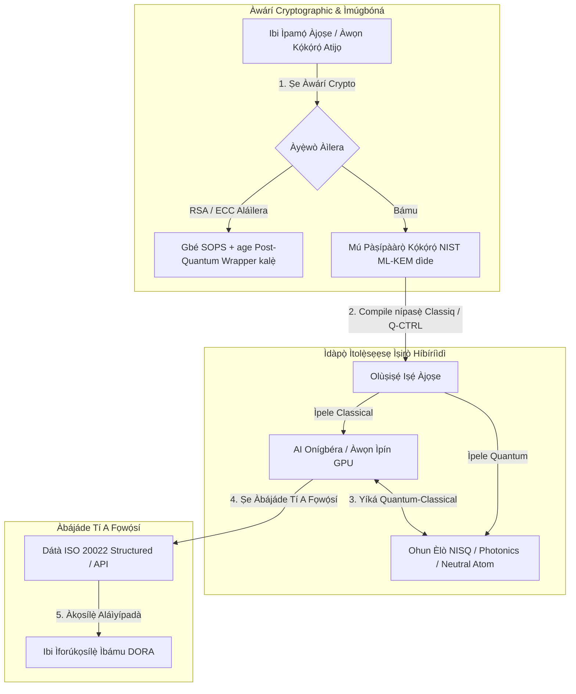

---

# Front Matter (YAML)

author: "contact@sebastienrousseau.com (Sebastien Rousseau)"
banner_alt: "Ìwò pẹpẹ láti ìpàdé Economist Impact 5th Annual Commercialising Quantum Global 2026 ní London — àmì ìyípadà ìmọ̀-ẹ̀rọ quantum láti ìwádìí physics sí àwọn iṣẹ́ ilé-iṣẹ́ tó ti múra sílẹ̀"
banner_height: "1597"
banner_width: "2584"
banner: "https://cloudcdn.pro/stocks/images/sebastien-rousseau-20260617-5th-commercialising-quantum-2.webp"
cdn: "https://cloudcdn.pro"
charset: "UTF-8"
cname: "sebastienrousseau.com"
copyright: "© Copyright 2025 - 2026 - Sebastien Rousseau. All rights reserved."
date: "June 17, 2026"
description: "Àwọn àyọkà ìgbìmọ̀ olórí láti ìpàdé Economist Impact 5th Annual Commercialising Quantum Global 2026 — ìfowó $1.3B, àwọn ìtolẹ̀sẹẹsẹ híbíríìdì aláìní àbámọ̀, ìjẹ́pàtàkì ìṣíkiri cryptography post-quantum, ìṣòwò ìmọ̀ quantum sensing, àti ìtọ́sọ́nà HSBC pé dúró-jẹ́ jẹ́ àṣìṣe láìfipá."
format-detection: "telephone=no"
hreflang: "yo"
icon: "https://cloudcdn.pro/clients/sebastienrousseau/v1/logos/sebastienrousseau.svg"
id: "https://sebastienrousseau.com/2026-06-17-economist-commercialising-quantum-summit-2026"
image_alt: "Àwòrán Aláwọ̀ Dúdú àti Funfun ti Sebastien Rousseau"
image_height: "162"
image_width: "162"
image: "https://cloudcdn.pro/stocks/images/sebastien-rousseau.png"
keywords: "Commercialising Quantum Global 2026, ìpàdé Economist Impact, cryptography post-quantum, NIST ML-KEM, harvest-now decrypt-later, SNDL, HSBC quantum, Philip Intallura, quantum sensing, ìrìnnà aláìní GPS, NQCC, EU Quantum Act, Quantcore, qBIG prize, Lord Vallance, híbíríìdì quantum-classical, DORA Article 6"
language: "yo-NG"
last_reviewed: "2026-06-17"
layout: "report"
locale: "yo_NG"
logo_alt: "Logo fún Sebastien Rousseau"
logo_height: "44"
logo_width: "44"
logo: "https://cloudcdn.pro/clients/sebastienrousseau/v1/logos/sebastienrousseau.svg"
menu: ""
measurementID: "G-169G4ET5HQ"
name: "Sebastien Rousseau"
permalink: "https://sebastienrousseau.com/2026-06-17-economist-commercialising-quantum-summit-2026"
rating: "general"
referrer: "no-referrer"
robots: "index, follow"
schema: "FAQPage, Article"
seo_title: "Commercialising Quantum 2026: Àyọkà Ìgbìmọ̀ Olórí"
short_name: "sebastienrousseau"
subtitle: "Quantum ti rékọjá láti sayẹ́nsì ilé-ìmọ̀ àròsọ sí àwọn iṣẹ́ ilé-iṣẹ́ híbíríìdì; ìgbìmọ̀ olórí gbọ́dọ̀ dáhùn sí ìfowó $1.3B ní 2026, ìṣíkiri post-quantum lẹ́sẹ̀kẹsẹ̀, àti ìtọ́sọ́nà HSBC láti dáwọ́ dúró-jẹ́ dúró."
tags: "quantum, cryptography post-quantum, NIST ML-KEM, harvest-now decrypt-later, quantum sensing, HSBC, Economist Impact, ìṣirò híbíríìdì, DORA, EU Quantum Act, NQCC, àyọkà ìpàdé"
theme-color: "0, 83, 191"
title: "Láti Qubits sí Èrè: Àyọkà Ìmúlò láti Ìpàdé Economist 5th Annual Commercialising Quantum Global 2026"
url: "https://sebastienrousseau.com/2026-06-17-economist-commercialising-quantum-summit-2026"
viewport: "width=device-width, initial-scale=1, shrink-to-fit=no"

# RSS - The RSS feed front matter (YAML).
atom_link: "https://sebastienrousseau.com/2026-06-17-economist-commercialising-quantum-summit-2026/rss.xml"
category: "Technology"
docs: https://validator.w3.org/feed/docs/rss2.html
generator: "Static Site Generator (SSG) (version 0.0.26)"
item_description: "Àwọn àyọkà ìgbìmọ̀ olórí láti ìpàdé Economist Impact 5th Annual Commercialising Quantum Global 2026 — ìfowó $1.3B, àwọn ìtolẹ̀sẹẹsẹ híbíríìdì aláìní àbámọ̀, ìjẹ́pàtàkì ìṣíkiri cryptography post-quantum, ìṣòwò ìmọ̀ quantum sensing, àti ìtọ́sọ́nà HSBC pé dúró-jẹ́ jẹ́ àṣìṣe láìfipá."
item_guid: "https://sebastienrousseau.com/2026-06-17-economist-commercialising-quantum-summit-2026/rss.xml"
item_link: "https://sebastienrousseau.com/2026-06-17-economist-commercialising-quantum-summit-2026/rss.xml"
item_pub_date: "Wed, 17 Jun 2026 06:06:06 +0000"
item_title: "Láti Qubits sí Èrè: Àyọkà Ìmúlò láti Ìpàdé Economist 5th Annual Commercialising Quantum Global 2026"
last_build_date: "Wed, 17 Jun 2026 06:06:06 +0000"
managing_editor: "contact@sebastienrousseau.com (Sebastien Rousseau)"
pub_date: "Wed, 17 Jun 2026 06:06:06 +0000"
ttl: "60"
type: "article"
webmaster: "contact@sebastienrousseau.com"

# Apple - The Apple front matter (YAML).
apple_mobile_web_app_orientations: "portrait"
apple_touch_icon_sizes: "192x192"
apple-mobile-web-app-capable: "yes"
apple-mobile-web-app-status-bar-inset: "black"
apple-mobile-web-app-status-bar-style: "black-translucent"
apple-mobile-web-app-title: "Commercialising Quantum 2026: Àyọkà Ìgbìmọ̀ Olórí"
apple-touch-fullscreen: "yes"

# MS Application - The MS Application front matter (YAML).

msapplication-navbutton-color: "0, 83, 191"

# Twitter Card - The Twitter Card front matter (YAML).

twitter_card: "summary_large_image"
twitter_creator: "@wwdseb"
twitter_description: "Àwọn àyọkà ìgbìmọ̀ olórí láti ìpàdé Economist Impact 5th Annual Commercialising Quantum Global 2026 — ìfowó $1.3B, àwọn ìtolẹ̀sẹẹsẹ híbíríìdì aláìní àbámọ̀, ìjẹ́pàtàkì ìṣíkiri cryptography post-quantum, ìṣòwò ìmọ̀ quantum sensing, àti ìtọ́sọ́nà HSBC pé dúró-jẹ́ jẹ́ àṣìṣe láìfipá."
twitter_image: "https://cloudcdn.pro/clients/sebastienrousseau/v1/logos/sebastienrousseau.svg"
twitter_image_alt: "Logo ti Sebastien Rousseau"
twitter_site: "@wwdseb"
twitter_title: "Commercialising Quantum 2026: Àyọkà Ìgbìmọ̀ Olórí"
twitter_url: "https://sebastienrousseau.com/2026-06-17-economist-commercialising-quantum-summit-2026"

excerpt: "Ìpàdé Economist Impact 5th Annual Commercialising Quantum Global 2026 fọwọ́sí ìyípadà quantum sí àwọn iṣẹ́ ilé-iṣẹ́: $1.3B kórè ní oṣù márùn-ún, cryptography post-quantum jẹ́ ọ̀rọ̀ fiduciary ìpele-ìgbìmọ̀ olórí lábẹ́ ìkórè SNDL, quantum sensing ń jẹ́ ìfijíṣẹ́ lónìí fún ìrìnnà aláìní GPS, Philip Intallura ti HSBC sì jẹ́ ìtọ́sọ́nà pé dúró fún ohun èlò fault-tolerant jẹ́ àṣìṣe láìfipá."

# Humans.txt - The Humans.txt front matter (YAML).
author_website: "https://sebastienrousseau.com"
author_twitter: "@wwdseb"
author_location: "London, UK"
thanks: "A dúpẹ́ pé o kà á!"
site_last_updated: "2026-06-17"
site_standards: "HTML5, CSS3, RSS, Atom, JSON, XML, YAML, Markdown, TOML"
site_components: "Kaishi, Kaishi Builder, Kaishi CLI, Kaishi Templates, Kaishi Themes"
site_software: "Static Site Generator, Rust"

---

# Láti Qubits sí Èrè: Àyọkà Ìmúlò láti Ìpàdé Economist 5th Annual Commercialising Quantum Global 2026

Ìmúrasílẹ̀ ilé-iṣẹ́, ìṣíkiri cryptography post-quantum, àwọn ìtolẹ̀sẹẹsẹ ìṣirò híbíríìdì, àti ojú ìṣòwò tó ń yọjáde ti quantum sensing àti networking.

**TL;DR.** Ìpàdé 5th Annual Commercialising Quantum Global 2026, tí Economist Impact ṣe ní Òṣù Kẹfà 16–17, 2026, ní Business Design Centre ní London, kó àwọn olùdarí àgbáyé tó ju 1,100 lọ jọ kọjá àwọn ẹgbẹ́ ilé-iṣẹ́, ìnáwó, ìlànà, àti ìwádìí. Ọ̀rọ̀ àárín fi ìyípadà ìṣẹ̀dá tó kedere hàn: ìmọ̀-ẹ̀rọ quantum ti rékọjá láti sayẹ́nsì ilé-ìmọ̀ àròsọ sí àwọn iṣẹ́ ilé-iṣẹ́ híbíríìdì tó ṣe é ṣe. Pẹ̀lú ìtìlẹ́yìn $1.3 bílíọ̀nù ti owó venture capital tí a kórè ní oṣù márùn-ún àkọ́kọ́ ti 2026 nìkan, ìjíròrò ìgbìmọ̀ olórí kò sí dá lórí kíkà àwọn qubit ti ara mọ́, ṣùgbọ́n lórí mímú àwọn ìtolẹ̀sẹẹsẹ ìṣirò híbíríìdì "aláìní àbámọ̀" kalẹ̀, dídáàbò bo àwọn dúkìá oníṣirò lòdì sí ìhalẹ̀ "harvest-now, decrypt-later" (SNDL) cryptographic, àti gbígbé àwọn ètò quantum sensing àkókò-kúkúrú kalẹ̀ fún ìrìnnà aláìní GPS.

## Àwọn àyọkà pàtàkì

- **Ìyípadà ilé-iṣẹ́ sí àwọn iṣẹ́ ṣiṣẹ́.** Àwọn olùdarí ilé-iṣẹ́ ([Steve Suarez](https://www.linkedin.com/in/stevesuarez) ti HorizonX, [Phil Intallura](https://www.linkedin.com/in/intallura) ti HSBC) tẹnu mọ́ pé ìdàpọ̀ quantum kìí ṣe ìṣòro physics mọ́ ṣùgbọ́n ó jẹ́ ìṣòro ìṣiṣẹ́. Àwọn báńkì àti àwọn ilé-iṣẹ́ ń gbé àwọn pilot híbíríìdì quantum-classical kalẹ̀ láti mú àwọn ọmọ-iṣẹ́ múrasílẹ̀ àti láti mu àwọn iṣẹ́ tó ń ṣiṣẹ́ dára sí i.
- **Cryptography post-quantum (PQC) jẹ́ pàtàkì ìgbìmọ̀ olórí.** Àwọn amòye ààbò àti òfin (CMS UK, [Joanne Miller](https://www.linkedin.com/in/joanne-miller-nso) ti Microsoft, [Craig Farrell](https://www.linkedin.com/in/craig-farrell) ti EY) kìlọ̀ pé àwọn àjọṣe kò lè dúró de ohun èlò fault-tolerant láti gbé PQC kalẹ̀. Ìkórè "Harvest-now, decrypt-later" ń ṣẹlẹ̀ lónìí, èyí sì ń mú ìṣíkiri sí àwọn àpẹẹrẹ NIST ML-KEM jẹ́ àníyàn fiduciary lẹ́sẹ̀kẹsẹ̀.
- **Quantum sensing ń darí èrè àkókò-kúkúrú.** Bí ó tilẹ̀ jẹ́ pé ìṣirò fault-tolerant ṣì wà ní ọdún púpọ̀ síwájú, quantum sensing ([Matthew Kinsella](https://www.linkedin.com/in/matthewkinsella) ti Infleqtion) ń gbòòrò sí i ní kíákíá. A ń gbé àwọn agogo quantum àti àwọn ohun èlò ìmọ̀ inertial kalẹ̀ fún ìrìnnà aláìní GPS, ààbò orílẹ̀-èdè, àti àwọn ètò agbára tó dúró ṣinṣin.
- **Ọba ọba, àwọn ìpín, àti ìjẹ́pàtàkì ìlànà.** Mínísítà Sayẹ́nsì UK [Lord Vallance](https://www.linkedin.com/in/patrick-vallance) àti [Lord William Hague](https://www.linkedin.com/in/williamhague) ṣàlàyé àwọn iṣẹ́ orílẹ̀-èdè láti yí ìwádìí padà sí àwọn "supercluster" ìṣirò ńlá tó ń ṣiṣẹ́ pẹ̀lú National Quantum Computing Centre (NQCC). EU Quantum Act tó ń bọ̀ síwájú tún tẹnu mọ́ kíkán ìpolówó geopolitical fún agbára ìṣirò ọba.
- **Quantcore gba ẹ̀bùn qBIG.** Spin-out University of Glasgow Quantcore gba ẹ̀bùn IOP qBIG fún àwọn paati superconducting niobium rẹ̀ tó ṣẹ́ṣẹ̀ jáde, tí ó ń ṣiṣẹ́ lórí ìgbóná tó pọ̀ ju àwọn ohun èlò ìbílẹ̀ lọ, tí ó sì ń dín ìnáwó ètò amọ̀-ọ̀rọ̀ cryogenic kù gan-an.

**Àwọn ìwé tó jẹmọ́:** [KyberLib àti Ìṣíkiri Báńkì Post-Quantum ní 2026: Láti Àwọn Àpẹẹrẹ sí Kóòdù](https://sebastienrousseau.com/2026-06-12-kyberlib-post-quantum-banking-migration-standards-code-2026/), [Ojú Iwé Resilience Báńkì ní 2026: AI, Cloud, Quantum, Ìsanwó, àti Ewu Ìpọ̀kan Ẹnikẹta](https://sebastienrousseau.com/2026-06-08-banking-resilience-index-ai-cloud-quantum-payments-third-party-risk-2026/), [Ojú Iwé Báńkì Cloud Native ní 2026: DORA, Platform Engineering, Cloud Ọba, àti Resilience Ìṣiṣẹ́](https://sebastienrousseau.com/2026-06-05-cloud-native-banking-index-dora-resilience-platform-engineering-2026/).

## 01. Ìdí Tí Ìpàdé 2026 Fi Ṣe Pàtàkì sí Ìgbìmọ̀ Olórí

Ẹ̀dà 2026 ti ìpàdé Commercialising Quantum Global ti Economist fi ìyípadà ọ̀sán hàn nínú bí ayé ìṣòwò ṣe ń ṣe ìgbéyẹ̀wò ìmọ̀-ẹ̀rọ jíjìn.

Ní ìtàn, a ti tì ìṣirò quantum sí àwọn ẹka R&D gẹ́gẹ́ bí iṣẹ́ sayẹ́nsì oníṣẹ́jú-ọ̀pọ̀lọ. Ní Òṣù Kẹfà 2026, ojú-ìwò yìí ti dàgbà. Àwọn àjọṣe gbọ́dọ̀ rékọjá láti ìwòye "ojú-physics" sí ìmúṣẹ "ojú-ìṣòwò". Ìdí náà jẹ́ méjì:

1. **Ìpàdé quantum-AI.** Àwọn ìtolẹ̀sẹẹsẹ HPC (high-performance computing) ń darapọ̀ classical, AI gbígbéra, àti àwọn ìpín NISQ (Noisy Intermediate-Scale Quantum) sí ìpele ìṣirò kan tó dapọ̀. Àwọn àjọṣe tó bá dúró láti kọ́ àwọn ohun-èlò tí ó múra fún quantum yóò ṣe àwárí pé fèrèsé láti gba àǹfààní ìlànà ń sé ní kíákíá ju bí a ti retí lọ.
2. **Ìjẹ́pàtàkì geopolitical àti fiduciary.** Pẹ̀lú ètò quantum tí UK ń darí àti EU Quantum Act tó ń bọ̀ síwájú, agbára quantum ti di ọ̀rọ̀ ọba orílẹ̀-èdè àti ìtẹ̀síwájú àjọṣe.

Síwájú sí i, cybersecurity post-quantum kìí ṣe ìbéèrè ìbámu ọjọ́ iwájú mọ́. Ìhalẹ̀ àwọn ìkọlù "store now, decrypt later" (SNDL) ti àwọn ọ̀tá túmọ̀ sí pé a óò pa dátà àjọṣe tó dìmú lónìí lóhùn nígbà tí àwọn ètò quantum ti ìṣòwò bá gbòòrò, èyí tí ó ń dá ìjẹrìí lẹ́sẹ̀kẹsẹ̀ sílẹ̀ lábẹ́ àwọn àṣẹ resilience ìṣiṣẹ́ àgbáyé bíi Digital Operational Resilience Act (DORA).

## 02. Ojú Ìlànà Commercialising Quantum 2026

Àwọn olùdarí ìmọ̀-ẹ̀rọ ilé-iṣẹ́ gbọ́dọ̀ ya ìdàgbàsókè quantum kọjá àwọn ìpele ìṣiṣẹ́ àlàrúrà márùn-ún, tí wọ́n ń ṣe ìgbéyẹ̀wò àwọn ìpòsí àkókò àti àwọn ewu balance-sheet.

### Tábìlì 1: Ojú ìlànà Commercialising Quantum 2026

| Ìpele | Ìfojúsùn àjọṣe | Àkókò / ìpòsí | Ewu àjọṣe pàtàkì |
| ---- | ---- | ---- | ---- |
| **Hardware & compiler** | Yíyàn láàárín àwọn ọ̀nà tí ń dije (superconducting, trapped ions, neutral atoms, photonics) | 3 – 5 ọdún (fault-tolerance) | Títì sí ìṣètò tí kò ní àbájáde tàbí ríràn sí pẹpẹ kan ní àkọ́kọ́. |
| **Ìmúgbóná cryptographic** | Àwárí àti àkójọ àwọn ìgbáralé cryptographic; ìṣíkiri sí NIST ML-KEM | Lẹ́sẹ̀kẹsẹ̀ (ìṣíkiri tó ń ṣiṣẹ́) | Àwọn ìfọ́jú dátà ìṣẹ̀dá àti àwọn àbájáde ìbámu lábẹ́ DORA àti NIST CSF 2.0. |
| **Quantum sensing** | Gbígbé ìrìnnà aláìní GPS, agogo tó dúró ṣinṣin, àti gravimeter kalẹ̀ | 1 – 2 ọdún (ìṣòwò lẹ́sẹ̀kẹsẹ̀) | Ìdààmú ìṣiṣẹ́ ti logistics, ọkọ̀, àti ètò agbára nítorí ìdíwọ́ GPS. |
| **Ìdàpọ̀ ètò** | Ìsopọ̀ ohun èlò quantum sínú àwọn ilé-iṣẹ́ dátà classical HPC àti supercomputing tó ti wà tẹ́lẹ̀ | 1 – 3 ọdún (ìpele híbíríìdì) | Ìdánudúró gíga, àwọn ìdíwọ́ ìṣípò dátà, àti àwọn silo ìṣirò tí ó pín. |
| **Software ilé-iṣẹ́** | Síṣàlàyé àwọn algorithm quantum nípasẹ̀ àwọn ìpele abstraction gíga àti API (Classiq, Q-CTRL) | Lẹ́sẹ̀kẹsẹ̀ (ìkọ́ ọgbọ́n) | Ìyàsọ́tọ̀ ọmọ-iṣẹ́ àti iṣẹ́ ṣíṣe láti inú ìmúṣẹ engineering gangan. |

## 03. Àwọn Àmì Quantum Pàtàkì àti Àwọn Ìfẹ́ Ìgbìmọ̀ Olórí

Àwọn olùdarí ìmọ̀-ẹ̀rọ gbọ́dọ̀ tọ́pinpin àwọn àmì ìṣòwò àti ìlànà tí a lè wọ̀n láti darí ìfowó quantum wọn.

### Tábìlì 2: Àwọn àmì quantum pàtàkì àti àwọn ìfẹ́ ìgbìmọ̀ olórí

| Àmì | Àpẹẹrẹ pípé | Ìtọ́kasí ìlànà / ìjọba | Pàtàkì pẹpẹ ìṣe |
| ---- | ---- | ---- | ---- |
| **Ìfowó quantum tí ń jó** | $1.3 bílíọ̀nù tí a kórè kárí ayé ní oṣù márùn-ún àkọ́kọ́ ti 2026 | Return on Resilience (RoR) | Yí ètò ìnáwó padà láti àwọn pilot àròsọ sí àwọn iṣẹ́ híbíríìdì quantum-classical "aláìní àbámọ̀". |
| **Àfihàn ìfọ́jú dátà** | 100% ti dátà tí a fi ìpamọ́ ránṣẹ́ kọjá àwọn ọnà gbangba ní àfihàn sí ìkórè SNDL | DORA Article 6 (ààbò ICT) | Gbé àwọn irinṣẹ́ àwárí cryptographic kalẹ̀ láti dá àwọn kọ́kọ́rọ́ RSA/ECC aláìlera kọjá ohun ìní mọ̀. |
| **Ètò amọ̀ ọba** | £2.5 bílíọ̀nù ìpín UK National Quantum Strategy | UK Quantum Missions / Lord Vallance | Mú àwọn ìbáṣepọ̀ àdúgbò pẹ̀lú àwọn supercluster orílẹ̀-èdè bíi NQCC dìde. |
| **Àwọn ọjọ́ ìbámu** | Òfin 14 Òṣù Kọkànlá 2026 SWIFT structured-address cutover | Ìtọ́sọ́nà SWIFT SR 2026 | Wẹ̀ àti ṣètò àwọn ibi ìpamọ́ dátà interbank láti tẹ́ àwọn àpẹẹrẹ structured XML lọ́rùn. |

## 04. Ìwò Jíjìn sí Àwọn Ọ̀rọ̀ Ìpàdé Pàtàkì

### Quantum dé ojú-ìfowó tipping point

Ìfowó venture capital ti ní ìṣẹ̀ṣẹ̀ pàtàkì, ó kórè **$1.3 bílíọ̀nù** ní oṣù márùn-ún àkọ́kọ́ ti 2026 nìkan. Ní ìyàtọ̀ sí àwọn yíká hype àròsọ ti àwọn ọdún tí ó kọjá, ìgbì owó òní ní ìtìlẹ́yìn àwọn iṣẹ́ àkókò-kúkúrú, tó dá lórí ayé gidi. Àwọn olùsọ̀rọ̀ láti Classiq àti IBM Quantum Platform fi hàn bí àwọn ìpele abstraction software àti àwọn compiler aládàṣe ṣe ń jẹ́ kí àwọn ẹgbẹ́ olùdàgbàsókè aláìní amọ̀ jíjìn lè ṣe àwọn algorithm híbíríìdì quantum-classical lórí àyíká classical òní. Ìlànà "aláìní àbámọ̀" yìí ń jẹ́ kí àwọn àjọṣe lè kọ́ ọmọ-iṣẹ́ àti àwọn iṣẹ́ tó múra fún quantum lẹ́sẹ̀kẹsẹ̀.

### Àwọn ìkìlọ̀ òfin àti ìlànà lórí "harvest now, decrypt later"

Àwọn alábàákẹ́gbẹ́ òfin àti àwọn olórí cybersecurity dá ìfẹ́ ńlá sílẹ̀ lórí ìjẹ́pàtàkì ewu dátà. Àwọn aṣojú láti ilé-iṣẹ́ òfin alátìlẹ́yìn CMS UK àti CSO Microsoft [Joanne Miller](https://www.linkedin.com/in/joanne-miller-nso) jẹ́ ìkìlọ̀ tó muna fún àwọn olùṣàkóso àgbà: *dúró fún ohun èlò fault-tolerant láti dé kí a tó gbé cryptography post-quantum kalẹ̀ jẹ́ àìṣiṣẹ́ fiduciary pàtàkì.*

Lábẹ́ àpẹẹrẹ "store now, decrypt later" (SNDL), àwọn ọ̀tá ń kórè dátà àjọṣe tí a fi ìpamọ́ ránṣẹ́ lónìí pẹ̀lú èrò láti pa á lóhùn ní kété tí àwọn kọ̀ǹpútà quantum tó tó cryptographically bá yọjáde. Àwọn àjọṣe gbọ́dọ̀ gbé àwọn ààbò post-quantum (bíi NIST ML-KEM) kalẹ̀ lẹ́sẹ̀kẹsẹ̀ láti dáàbò bo àwọn dátà oníṣẹ́jú-pípẹ́ tó dìmú, àwọn ohun-ìní amọ̀, àti àwọn àkọsílẹ̀ oníbàárà ìtàn.

### Ìṣàtúnṣe hype "quantum sensing"

Bí ó tilẹ̀ jẹ́ pé ìṣirò quantum fault-tolerant ṣì wà ní ọdún púpọ̀ síwájú, ìpàdé náà tẹnu mọ́ quantum sensing gẹ́gẹ́ bí ìgbì àkọ́kọ́ ti ìmúṣẹ ayé gidi tó ń mú èrè wá. Olórí Aláṣẹ [Matthew Kinsella](https://www.linkedin.com/in/matthewkinsella) ti Infleqtion ṣàlàyé bí àwọn agogo quantum, àwọn ohun èlò ìmọ̀ inertial, àti àwọn ètò radio-frequency ṣe ń gbòòrò sí i ní kíákíá kọjá àwọn ilé-iṣẹ́ púpọ̀.

Nítorí pé àwọn ìmọ̀-ẹ̀rọ wọ̀nyí ń wọn àwọn dúró-ṣinṣin ti ara pẹ̀lú pípé sub-atomic, wọ́n ń mú **ìrìnnà aláìní GPS**, àwọn ètò agbára tó dúró ṣinṣin, àti àwọn ìbánisọ̀rọ̀ òfuurufú jíjìn dìde. Àwọn ìmúṣẹ wọ̀nyí ṣe pàtàkì gan-an fún ọkọ̀ òfuurufú, ìrìnnà inú omi, àti àwọn ètò ààbò orílẹ̀-èdè tó dojú kọ àwọn ìhalẹ̀ jamming GPS tó ń pọ̀ sí i.

### Ìfọwọ́sowọ́pọ̀ ecosystem àti ìpín

Ecosystem quantum UK lo ìpàdé London láti ṣàfihàn àwọn supercluster ìṣẹ̀dá ilé. Àwọn ìmúdójúìwọ̀n láàyè láti National Quantum Computing Centre (NQCC) àti Digital Catapult ṣàlàyé bí àwọn spin-out deep-tech ìpele ìbẹ̀rẹ̀ ṣe lè bo "àlàfo ìmọ̀-ẹ̀rọ" nípa dída ohun èlò quantum sí àwọn ilé-iṣẹ́ dátà supercomputing classical tààrà.

[Wridhdhisom Karar](https://www.linkedin.com/in/wridhdhisomkarar), tí ó dá ile-iṣẹ́ start-up quantum Scottish Quantcore sílẹ̀, gba ẹ̀bùn olókìkí Institute of Physics (IOP) Quantum Business Innovation and Growth (qBIG) fún àwọn paati superconducting niobium ti ilé-iṣẹ́ náà. Àwọn paati wọ̀nyí ń ṣiṣẹ́ lórí ìgbóná tó pọ̀ ju àwọn ohun èlò ìbílẹ̀ lọ, èyí tí ó ń dín ìnáwó ètò amọ̀-ọ̀rọ̀ cryogenic tí a nílò láti gbé processor quantum dìde kù gan-an.

### Iwadi HSBC: ìdí tí dúró fún quantum fi jẹ́ "àṣìṣe láìfipá"

Àwọn ìmọ̀ láti ọ̀dọ̀ [**Philip Intallura, Ph.D.**](https://www.linkedin.com/in/intallura) (Olórí Àgbáyé fún Àwọn Ìmọ̀-ẹ̀rọ Quantum ní HSBC, Olùdámọ̀ràn Ìjọba UK, àti Olùdámọ̀ràn Ìgbìmọ̀ Olórí) ní 5th Annual Commercialising Quantum Event ti Economist (2026) jẹ́ ìtọ́sọ́nà ìgbìmọ̀ olórí tó lágbára: *"Dúró fún quantum fault-tolerant kí o tó bẹ̀rẹ̀ jẹ́ àṣìṣe láìfipá."*

Dr Intallura jiyàn pé ìlànà "dúró kí o sì wo" tó wọ́pọ̀ láàárín àwọn ilé-iṣẹ́ ìnáwó jẹ́ àfojúdi tí a kọ́ lórí àwọn àròsọ àìtọ́ mẹ́ta:

- **ROI àkókò-kúkúrú jẹ́ òdodo.** Nínú ìdánwò empirical, HSBC ti ré ọ̀nà mọ́dẹ̀lì tó ń ṣiṣẹ́ báyìí ní ìṣelọ́jà kọjá, ó so iṣẹ́ quantum pọ̀ mọ́ àwọn apá mìíràn ti ilé-iṣẹ́ náà, ó lo quantum láti mú àwọn ìbáṣepọ̀ pẹ̀lú àwọn oníbàárà tó tóbi jùlọ rẹ̀ jíjìn sí i, ó sì fa iṣẹ́ tuntun pàtàkì wá sí **HSBC Innovation Banking**.
- **Quantum jẹ́ ìbẹ̀rẹ̀ ìṣíkiri tó gùn.** Kíkọ́ agbára, ìṣètò ìlànà, mímú ìnáwó dìde, àti ṣíṣe àwọn yíká ìdánwò nínú àjọṣe tí a ń ṣàkóso ní lílá kìí ṣe iṣẹ́ kúkúrú. A gbọ́dọ̀ ṣe ìdánwò àti ṣàtúnṣe àwọn ìṣiṣẹ́ ní àtìnúdá fún ìmọ̀-ẹ̀rọ náà.
- **Quantum jẹ́ ecosystem.** Kò sí ẹ̀rọ́ kan tó lè dé ibẹ̀ nìkan. Gbogbo ìwé ìwádìí, POC, àti pilot tí HSBC ti ṣe ti wà nínú ìfọwọ́sowọ́pọ̀ pẹ́kípẹ́kí pẹ̀lú olùpèsè quantum — ní àwọn ìṣẹ̀lẹ̀ kan, ìfọwọ́sowọ́pọ̀ ń lọ títí dé academia, àwọn olùṣàkóso, àti ìjọba.

**Ìtọ́sọ́nà ìgbìmọ̀ olórí ìkẹyìn:** *"Agbára tí ìwọ yóò nílò ní ọjọ́ àkọ́kọ́ ti fault tolerance ni agbára tí ìwọ ń kọ́ báyìí."*

## 05. Ìdàpọ̀ Quantum Àjọṣe àti Ìpèsè Cryptography

Láti dáàbò bo àwọn dúkìá oníṣirò nígbà tí ó ń kọ́ ìmúrasílẹ̀ quantum, àjọṣe gbọ́dọ̀ mú ìpèsè ìdàpọ̀ tó kedere dìde.

## 06. Ìwé-ọ̀nà Ìgbìmọ̀ Olórí: Àwọn Ìbéèrè Tó Ṣe

Láti yí àwọn ìmọ̀ ìpàdé Commercialising Quantum Global 2026 padà sí iye àjọṣe lẹ́sẹ̀kẹsẹ̀, àwọn olùṣàkóso àgbà gbọ́dọ̀ ṣe ìwé-ọ̀nà ìgbìmọ̀ olórí mẹ́rin tí ó tẹ̀lé:

1. **Pàṣẹ àwárí cryptographic.** Tọ́sọ́nà Chief Information Security Officer (CISO) láti ṣe àkójọ gbogbo àwọn dúkìá cryptographic, tí ó ń yà gbogbo kọ́kọ́rọ́ atijọ RSA àti ECC kọjá àjọṣe láti múra fún ìṣíkiri post-quantum.
2. **Gbé ìlànà híbíríìdì "aláìní àbámọ̀" kalẹ̀.** Yẹra fún dúró fún ohun èlò tó pé. Fowó sí software tó dá lórí quantum àti àwọn pilot híbíríìdì classical-quantum láti mú ọmọ-iṣẹ́ inú-ilé dìde àti láti mu àwọn logistics tó dìmú tàbí àwọn portfolio ewu dára sí i lónìí.
3. **Ṣe àyẹ̀wò quantum sensing fún logistics.** Bí àjọṣe rẹ bá gbáralé àwọn ẹ̀wọ̀n ìpèsè àgbáyé, ọkọ̀, tàbí àyíká pàtàkì, ṣe àyẹ̀wò àwọn ètò quantum sensing (bíi ìrìnnà aláìní GPS) ní ṣiṣẹ́ láti dín àwọn ewu ìdààmú geopolitical kù.
4. **Forúkọsílẹ̀ fún Insight Hour ti Òṣù Kẹfà 30.** Ṣe ìdánilójú pé àwọn olùdarí ìmọ̀-ẹ̀rọ rẹ forúkọsílẹ̀ fún **Commercialising Quantum Global Insight Hour** ojúhájì lórí Òṣù Kẹfà 30, 2026, ní 3:00 PM BST (tí IonQ ń tìlẹ́yìn) láti máa tọ́pinpin àwọn ìlànà ìṣàkóso ewu àjọṣe àti àkójọ ọmọ-iṣẹ́.

## 07. Àwọn Ìbéèrè Tí A Sábà Béèrè

**Kí ni "harvest now, decrypt later" (SNDL), kí sì ni ìdí tí ó fi ṣe pàtàkì lónìí?**
SNDL ni ìṣe ìmúmọ́ àti pípamọ́ dátà tí a fi ìpamọ́ ránṣẹ́ lónìí, pẹ̀lú èrò láti pa á lóhùn nígbà tí àwọn kọ̀ǹpútà quantum tó tó cryptographically bá wà lárọ̀ọ́wọ́tó. A ti ń fojú àwọn dátà oníṣẹ́jú-pípẹ́ tó dìmú — àwọn ohun-ìní amọ̀, àwọn àkọsílẹ̀ oníbàárà, àwọn ìbáraẹnusọ̀rọ̀ ìjọba — báyìí. Ìṣíkiri sí NIST ML-KEM jẹ́ ìpinnu fiduciary tí ìgbìmọ̀ olórí kò lè dáwọ́ dúró sí.

**Kí ló dé tí quantum sensing fi jẹ́ ìgbì ìṣòwò àkọ́kọ́ dípò ìṣirò?**
Àwọn ohun èlò quantum sensing ń wọn àwọn dúró-ṣinṣin ti ara pẹ̀lú pípé sub-atomic, wọn kò sì nílò ohun èlò fault-tolerant tí ìṣirò quantum nílò. Àwọn agogo quantum, gravimeter, àti ohun èlò ìmọ̀ inertial ti wà ní pilot deployment fún ìrìnnà aláìní GPS, àwọn ètò agbára tó dúró ṣinṣin, àti àwọn ìbáraẹnusọ̀rọ̀ òfuurufú jíjìn.

**Ǹjẹ́ iṣẹ́ quantum HSBC kàn jẹ́ R&D ni tàbí ó ti fi èrè tí a lè wọ̀n hàn?**
Gẹ́gẹ́ bí Philip Intallura ṣe sọ ní ìpàdé náà, HSBC ti ré ọ̀nà mọ́dẹ̀lì tó ń ṣiṣẹ́ báyìí ní ìṣelọ́jà kọjá, ó lo quantum láti mú àwọn ìbáṣepọ̀ pẹ̀lú àwọn oníbàárà tó tóbi jùlọ rẹ̀ jíjìn sí i, ó sì fa iṣẹ́ tuntun pàtàkì wá sí HSBC Innovation Banking. Iṣẹ́ náà ti rékọjá láti ìwádìí sí ìdàpọ̀ ìṣiṣẹ́.

## 08. Àwọn Ìtọ́kasí

- **Economist Impact, (2026).** *5th Annual Commercialising Quantum Global 2026.* Àwọn ìjíròrò ìpàdé láàyè, Òṣù Kẹfà 16–17, 2026. London: Business Design Centre. Wà nínú: [Economist Impact](https://events.economist.com/commercialising-quantum/).
- **National Institute of Standards and Technology (NIST), (2024).** *First Three Finalized Post-Quantum Encryption Standards (FIPS 203, 204, and 205).* Gaithersburg: U.S. Department of Commerce. Wà nínú: [NIST Standards](https://www.nist.gov/news-events/news/2024/08/nist-releases-first-3-finalized-post-quantum-encryption-standards).
- **European Parliament and Council of the European Union, (2022).** *Regulation (EU) 2022/2554 on digital operational resilience for the financial sector (DORA).* Brussels: Official Journal of the European Union. Wà nínú: [DORA Regulation](https://eur-lex.europa.eu/legal-content/EN/TXT/?uri=CELEX%3A32022R2554).
- **SWIFT, (2024).** *ISO 20022 November 2026 Structured Address Milestone.* La Hulpe: SWIFT. Wà nínú: [SWIFT ISO 20022 milestone](https://www.swift.com/standards/iso-20022/iso-20022-bytes/call-action-november-2026).
