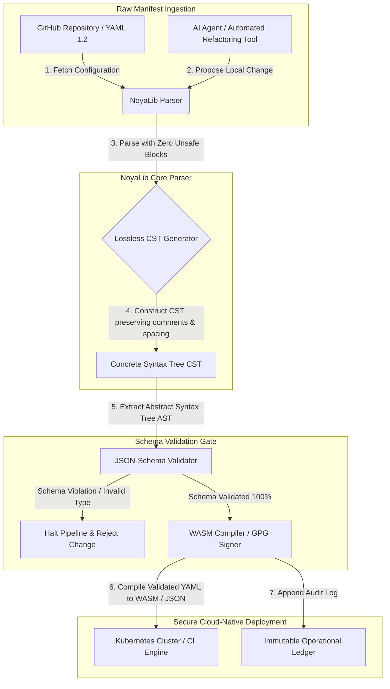

---

# Front Matter (YAML)

author: "contact@sebastienrousseau.com (Sebastien Rousseau)"
banner_alt: "Geometry ilé-iṣẹ́ lábẹ́ ìmọ́lẹ̀ ńlá — àmì ipa NoyaLib gẹ́gẹ́ bí olùgbé ẹrù YAML parser Rust aláìléwu lábẹ́ CI, Kubernetes, MCP, àti ìṣètò àwọn iṣẹ́ ìnáwó"
banner_height: "1597"
banner_width: "2584"
banner: "https://cloudcdn.pro/stocks/images/ken-cheung-KonWFWUaAuk.webp"
cdn: "https://cloudcdn.pro"
charset: "UTF-8"
cname: "sebastienrousseau.com"
copyright: "© Copyright 2025 - 2026 - Sebastien Rousseau. All rights reserved."
date: "June 18, 2026"
description: "NoyaLib, YAML 1.2 parser Rust aláìní unsafe pẹ̀lú ìbámu 406/406, ìfọwọ́sí JSON Schema, CST aláìpàdánù, àti àwọn ìsopọ̀ MCP/WASM fún àwọn iṣẹ́ ìnáwó."
format-detection: "telephone=no"
hreflang: "yo"
icon: "https://cloudcdn.pro/clients/sebastienrousseau/v1/logos/sebastienrousseau.svg"
id: "https://sebastienrousseau.com/2026-06-18-noyalib-safe-yaml-rust-ai-mcp-financial-infrastructure-2026"
image_alt: "Àwòrán Aláwọ̀ Dúdú àti Funfun ti Sebastien Rousseau"
image_height: "162"
image_width: "162"
image: "https://cloudcdn.pro/stocks/images/sebastien-rousseau.png"
keywords: "YAML parser Rust aláìléwu, NoyaLib, ìbámu YAML 1.2, Rust aláìní unsafe, ìfọwọ́sí JSON Schema, Concrete Syntax Tree aláìpàdánù, CST, MCP, Model Context Protocol, WebAssembly, àwọn manifest Kubernetes, ìṣètò CI/CD, DORA Article 5, BCBS 239, ewu ìṣiṣẹ́ Basel III, àwọn iṣẹ́ ìnáwó, ààbò ìṣètò, ààbò ẹ̀wọ̀n ìpèsè software"
language: "yo-NG"
last_reviewed: "2026-06-18"
layout: "report"
locale: "yo_NG"
logo_alt: "Logo fún Sebastien Rousseau"
logo_height: "44"
logo_width: "44"
logo: "https://cloudcdn.pro/clients/sebastienrousseau/v1/logos/sebastienrousseau.svg"
menu: ""
measurementID: "G-169G4ET5HQ"
name: "Sebastien Rousseau"
permalink: "https://sebastienrousseau.com/2026-06-18-noyalib-safe-yaml-rust-ai-mcp-financial-infrastructure-2026"
rating: "general"
referrer: "no-referrer"
robots: "index, follow"
schema: "FAQPage, Article"
seo_title: "YAML Parser Rust Aláìléwu fún AI, MCP & Ìnáwó"
short_name: "sebastienrousseau"
subtitle: "Ìtolẹ̀sẹẹsẹ YAML Rust aláìléwu — NoyaLib — ń yí YAML 1.2 padà láti ìṣàmì ìrọ̀rùn sí pẹpẹ ìṣàkóso ìṣètò tó dára ní cryptography, tó bámu pẹ̀lú àpẹẹrẹ, fún àwọn aṣojú AI, MCP, Kubernetes, àti àwọn iṣẹ́ ìnáwó."
tags: "YAML parser Rust aláìléwu, NoyaLib, YAML 1.2, Rust aláìní unsafe, JSON Schema, MCP, WebAssembly, Kubernetes, DORA, BCBS 239, Basel III, àwọn iṣẹ́ ìnáwó, ààbò ẹ̀wọ̀n ìpèsè"
theme-color: "0, 83, 191"
title: "Ìdí Tí YAML Fi Nílò Ìtolẹ̀sẹẹsẹ Rust Aláìléwu fún AI, MCP, àti Àwọn Iṣẹ́ Ìnáwó ní 2026"
url: "https://sebastienrousseau.com/2026-06-18-noyalib-safe-yaml-rust-ai-mcp-financial-infrastructure-2026"
viewport: "width=device-width, initial-scale=1, shrink-to-fit=no"

# RSS - The RSS feed front matter (YAML).
atom_link: "https://sebastienrousseau.com/2026-06-18-noyalib-safe-yaml-rust-ai-mcp-financial-infrastructure-2026/rss.xml"
category: "Technology"
docs: https://validator.w3.org/feed/docs/rss2.html
generator: "Static Site Generator (SSG) (version 0.0.26)"
item_description: "NoyaLib, YAML 1.2 parser Rust aláìní unsafe pẹ̀lú ìbámu 406/406, ìfọwọ́sí JSON Schema, CST aláìpàdánù, àti àwọn ìsopọ̀ MCP/WASM fún àwọn iṣẹ́ ìnáwó."
item_guid: "https://sebastienrousseau.com/2026-06-18-noyalib-safe-yaml-rust-ai-mcp-financial-infrastructure-2026/rss.xml"
item_link: "https://sebastienrousseau.com/2026-06-18-noyalib-safe-yaml-rust-ai-mcp-financial-infrastructure-2026/rss.xml"
item_pub_date: "Thu, 18 Jun 2026 06:06:06 +0000"
item_title: "Ìdí Tí YAML Fi Nílò Ìtolẹ̀sẹẹsẹ Rust Aláìléwu fún AI, MCP, àti Àwọn Iṣẹ́ Ìnáwó ní 2026"
last_build_date: "Thu, 18 Jun 2026 06:06:06 +0000"
managing_editor: "contact@sebastienrousseau.com (Sebastien Rousseau)"
pub_date: "Thu, 18 Jun 2026 06:06:06 +0000"
ttl: "60"
type: "article"
webmaster: "contact@sebastienrousseau.com"

# Apple - The Apple front matter (YAML).
apple_mobile_web_app_orientations: "portrait"
apple_touch_icon_sizes: "192x192"
apple-mobile-web-app-capable: "yes"
apple-mobile-web-app-status-bar-inset: "black"
apple-mobile-web-app-status-bar-style: "black-translucent"
apple-mobile-web-app-title: "YAML Parser Rust Aláìléwu fún AI, MCP & Ìnáwó"
apple-touch-fullscreen: "yes"

# MS Application - The MS Application front matter (YAML).

msapplication-navbutton-color: "0, 83, 191"

# Twitter Card - The Twitter Card front matter (YAML).

twitter_card: "summary_large_image"
twitter_creator: "@wwdseb"
twitter_description: "NoyaLib, YAML 1.2 parser Rust aláìní unsafe pẹ̀lú ìbámu 406/406, ìfọwọ́sí JSON Schema, CST aláìpàdánù, àti àwọn ìsopọ̀ MCP/WASM fún àwọn iṣẹ́ ìnáwó."
twitter_image: "https://cloudcdn.pro/clients/sebastienrousseau/v1/logos/sebastienrousseau.svg"
twitter_image_alt: "Logo ti Sebastien Rousseau"
twitter_site: "@wwdseb"
twitter_title: "YAML Parser Rust Aláìléwu fún AI, MCP & Ìnáwó"
twitter_url: "https://sebastienrousseau.com/2026-06-18-noyalib-safe-yaml-rust-ai-mcp-financial-infrastructure-2026"

excerpt: "NoyaLib jẹ́ ìtolẹ̀sẹẹsẹ YAML Rust aláìléwu — odo bulọ́ọ̀kì unsafe, ìbámu 406/406 pẹ̀lú àpẹẹrẹ YAML 1.2, Concrete Syntax Tree aláìpàdánù, ìfọwọ́sí JSON Schema (Draft 2020-12), àti àwọn ìsopọ̀ MCP/WASM — tí a ṣe fún àwọn aṣojú AI, Kubernetes, CI/CD, àti pẹpẹ ìṣàkóso ìṣètò lẹ́yìn àwọn iṣẹ́ ìnáwó."

# Humans.txt - The Humans.txt front matter (YAML).
author_website: "https://sebastienrousseau.com"
author_twitter: "@wwdseb"
author_location: "London, UK"
thanks: "A dúpẹ́ pé o kà á!"
site_last_updated: "2026-06-18"
site_standards: "HTML5, CSS3, RSS, Atom, JSON, XML, YAML, Markdown, TOML"
site_components: "Kaishi, Kaishi Builder, Kaishi CLI, Kaishi Templates, Kaishi Themes"
site_software: "Static Site Generator, Rust"

---

# Ìdí Tí YAML Fi Nílò Ìtolẹ̀sẹẹsẹ Rust Aláìléwu fún AI, MCP, àti Àwọn Iṣẹ́ Ìnáwó ní 2026

Ìtolẹ̀sẹẹsẹ YAML Rust aláìléwu ṣe pàtàkì nítorí pé YAML báyìí ni ó gbé àwọn ìṣàn CI/CD, àwọn manifest Kubernetes, àwọn òfin [Open Policy Agent](https://www.openpolicyagent.org/), àti àwọn ìforúkọsílẹ̀ irinṣẹ́ Model Context Protocol (MCP) — kí ìṣàlàyé parse aláìṣedéédéé kan ṣoṣo sì lè fọ́ ètò ìparí, ṣàmì àwọn ẹgbẹ́ ààbò ní àìtọ́, tàbí fún aṣojú AI àdúgbò ní ìyọ̀nda àìtọ́. [NoyaLib](https://github.com/sebastienrousseau/noyalib) jẹ́ ecosystem parsing àti ìfọwọ́sí [YAML 1.2](https://yaml.org/spec/1.2.2/) tí ó jẹ́ Rust mímọ́, tí kò ní unsafe, tí a ṣe láti jẹ́ kí ìṣètò yẹn jẹ́ aláìléwu láìfipá.

## Ìdáhùn kíákíá

**Kí ni NoyaLib ní gbólóhùn kan?** NoyaLib jẹ́ ecosystem parser àti ìfọwọ́sí YAML 1.2 ìmọ̀-ìpilẹ̀, Rust mímọ́, pẹ̀lú odo kóòdù `unsafe`, ìbámu àpẹẹrẹ 100% kọjá àpẹẹrẹ YAML aṣẹ́ 406-ìdánwò, Concrete Syntax Tree aláìpàdánù, àti ìfọwọ́sí [JSON Schema](https://json-schema.org/) àkókò-gidi — tí a ṣe láti jẹ́ kí ìṣètò aṣojú AI, MCP, Kubernetes, àti àwọn iṣẹ́ ìnáwó jẹ́ aláìléwu láìfipá.

## Ìsọnísókí olùdarí

YAML rí àìfojúsùn títí tí ìṣàlàyé parse aláìṣedéédéé tàbí ìrú àpẹẹrẹ kan yóò fi fọ́ ètò ìparí ìṣelọ́jà bíi bílíọ̀nù-dọ́là pupọ̀. Ní 2026, YAML jẹ́ àpẹẹrẹ de-facto fún àwọn ìṣàn [CI/CD](https://docs.github.com/en/actions/learn-github-actions/workflow-syntax-for-github-actions), àwọn manifest [Kubernetes](https://kubernetes.io/docs/concepts/configuration/overview/), àwọn òfin [Open Policy Agent](https://www.openpolicyagent.org/), àti àwọn ìforúkọsílẹ̀ irinṣẹ́ Model Context Protocol (MCP). Àwọn parser ìbílẹ̀ aláìmọ́ — pẹ̀lú àwọn àìlera ìrántí àti parsing apanirun — jẹ́ ewu ààbò tí a kò lè gbà. NoyaLib jẹ́ ecosystem YAML 1.2 tó jẹ́ Rust mímọ́, aláìní unsafe: ìbámu àpẹẹrẹ 100% kọjá gbogbo àwọn ìdánwò àpẹẹrẹ aṣẹ́ 406, Concrete Syntax Tree (CST) aláìpàdánù tí ó pa àwọn àlàyé àti àyè mọ́, àti ìfọwọ́sí JSON Schema tí a kọ́ sínú. Àbájáde rẹ̀ ni YAML tí a tún ṣe gẹ́gẹ́ bí pẹpẹ ìṣàkóso ìṣètò tó ṣeé yẹ̀wò, aláìléwu, tí aṣojú sì lè wọlé.

## Àwọn àyọkà pàtàkì

- **Ìṣètò jẹ́ kóòdù ìṣelọ́jà.** Faili YAML kan tó tì sí àìtọ́ lè ṣàmì àwọn ẹgbẹ́ ààbò cloud-native tàbí àwọn ìyọ̀nda aṣojú AI ní àìtọ́. NoyaLib ń bá YAML lò gẹ́gẹ́ bí àwọn iṣẹ́ pàtàkì.
- **Apẹrẹ aláìní unsafe.** Tí a kọ́ pátápátá nínú Rust aláìléwu pẹ̀lú odo bulọ́ọ̀kì `unsafe`, NoyaLib ń pa àwọn àìlera ìpamọ́-ìrántí — buffer overflow, RCE — rẹ́ nínú àwọn ìpele parsing pàtàkì.
- **Ìbámu àpẹẹrẹ pípé 406/406.** Ó ń fọwọ́sí àwọn ìṣètò ní ọ̀nà tó dá lórí ìṣirò, ó ń pa ìyàtọ̀ parsing rẹ́, ó sì ń yọ ìyípadà ìṣẹ̀dá láàárín àyíká staging àti ìṣelọ́jà.
- **Concrete Syntax Tree aláìpàdánù.** Yàtọ̀ sí àwọn parser ìbílẹ̀ tó ń sọ àwọn àlàyé àti ọ̀nà-ìkọ̀wé nù, NoyaLib ń pa àwọn àyè àti àkíyèsí mọ́, ó ń jẹ́ kí refactoring aládàṣe tó dá pa-padà tí àwọn aṣojú AI ń ṣe jẹ́ aláìléwu.
- **Iye fiduciary ìpele-ìgbìmọ̀ olórí.** Ó so ìṣòkan ìṣètò pọ̀ pẹ̀lú [DORA Article 5](https://eur-lex.europa.eu/legal-content/EN/TXT/?uri=CELEX%3A32022R2554) àti àwọn àmì owó-orí ewu-ìṣiṣẹ́ [Basel III](https://www.bis.org/bcbs/publ/d424.htm), tí ó ń dáàbò bo àwọn olùṣàkóso àgbà lòdì sí ọ̀ràn ti ara wọn.

**Àwọn ìwé tó jẹmọ́:** [KyberLib àti Ìṣíkiri Báńkì Post-Quantum ní 2026: Láti Àwọn Àpẹẹrẹ sí Kóòdù](https://sebastienrousseau.com/2026-06-12-kyberlib-post-quantum-banking-migration-standards-code-2026/), [Ojú Iwé Báńkì Cloud Native ní 2026: DORA, Platform Engineering, Cloud Ọba, àti Resilience Ìṣiṣẹ́](https://sebastienrousseau.com/2026-06-05-cloud-native-banking-index-dora-resilience-platform-engineering-2026/), [Àwọn Dotfiles Tó Mọ̀ AI ní 2026: Kíkọ́ Ibi-iṣẹ́ Olùdàgbàsókè Aláìléwu, Atúntún fún MCP, SLSA, àti Ìpapọ̀ Pápá-Shell Pípọ̀](https://sebastienrousseau.com/2026-06-16-ai-aware-dotfiles-secure-reproducible-workstation-2026/).

## 01. Ìdí Tí Ìtolẹ̀sẹẹsẹ YAML Rust Aláìléwu Fi Ṣe Pàtàkì ní 2026

Ní Òṣù Kẹfà 2026, àwọn ìṣètò IT ilé-iṣẹ́ ti pin gan-an, wọ́n sì ti ń ṣiṣẹ́ aládàṣe sí i.

YAML ti di àpẹẹrẹ ìṣètò olùgbé ẹrù fún gbogbo ìtolẹ̀sẹẹsẹ ìmọ̀-ẹ̀rọ software ní fífẹsẹ̀mulẹ̀. Ó gbé àwọn ìṣàn continuous-integration (CI) tí ó ń ṣe àwọn ohun-ìṣẹ̀dá ìṣelọ́jà, àwọn manifest [Kubernetes](https://kubernetes.io/docs/concepts/overview/) tí ó ń ṣakoso àwọn ìkórè cloud-native àgbáyé, àti àwọn àpẹẹrẹ ìránṣẹ́ [Model Context Protocol](https://modelcontextprotocol.io/) (MCP) tí ó ń fún àwọn aṣojú AI àdúgbò ní ìyọ̀nda láti ṣe àwọn iṣẹ́ àdúgbò.

Àwọn parser YAML ìbílẹ̀ — [PyYAML](https://pyyaml.org/), [yaml-cpp](https://github.com/jbeder/yaml-cpp), [libyaml](https://github.com/yaml/libyaml) — gbé ewu ìṣàlàyé méjì:

1. **Àwọn àìlera ìfipá-mu ìṣe (ìṣòro "Norway").** Àwọn parser ìbílẹ̀ ń ṣe ìfipá-mu àwọn ọ̀rọ̀ aláìní àmì-ọ̀rọ̀ (kóòdù orílẹ̀-èdè `NO` di boolean `false`, `yes`/`no` bákan náà) — wo [àpẹẹrẹ boolean YAML 1.1 vs 1.2](https://yaml.org/type/bool.html) — tí ó ń fa àwọn àìlera ètò pàtàkì tàbí àwọn àìtọ́ ìṣètò ààbò aláìfọhùn.
2. **Àwọn ìfọwọ́kàn ìpamọ́-ìrántí.** Àwọn parser aláìmọ́ tí a kọ́ ní C/C++ ń jìyà àwọn ìfọwọ́kàn ìjò-ìrántí àti buffer overflow, tí ó lè fa RCE lórí àwọn olùpèsè ìṣẹ̀dá pàtàkì.

[NoyaLib](https://github.com/sebastienrousseau/noyalib) ń yanjú àwọn àìnífẹ̀ẹ́ wọ̀nyí. Ó jẹ́ ecosystem parsing àti ìfọwọ́sí YAML 1.2 tó jẹ́ Rust mímọ́, aláìní unsafe. Nípa dída ìbámu àpẹẹrẹ pípé 406/406 dìde àti fífipá-mu ìfọwọ́sí JSON Schema lánàdá nígbà tí ó ń parse, NoyaLib ń fi **Return on Resilience (RoR)** gíga jíṣẹ́ — ó ń yọ ìdúró tí ìṣètò fa, ó sì ń dáàbò bo àwọn ẹ̀wọ̀n ìpèsè software ti ìpele-ìnáwó.

## 02. Ojú Ìṣètò NoyaLib 2026

Ecosystem NoyaLib ń ṣiṣẹ́ gẹ́gẹ́ bí parser ìṣètò aláìléwu, aláìpàdánù. Gbogbo manifest àdúgbò àti cloud ni a ń fọwọ́sí ní ìṣẹ̀dá, a sì ń dáàbò bo wọn ní ìpele ìṣe tí ó kéré jùlọ.

### Tábìlì 1: Àwọn ìpele ìṣètò NoyaLib àti dída ewu kù

| Ìpele | Ìpinnu ìṣètò | Ìdí tí ó fi ṣe pàtàkì | Ewu tí ó bá bí àìtọ́ |
| ---- | ---- | ---- | ---- |
| **Ìpele parser** | Parser Rust mímọ́ tó bámu pẹ̀lú YAML 1.2 pẹ̀lú odo bulọ́ọ̀kì `unsafe` | Ó ń pa àwọn àìlera ìpamọ́-ìrántí àti buffer overflow rẹ́ ní ìpele ìṣe tí ó kéré jùlọ. | RCE lórí àwọn olùpèsè ìṣẹ̀dá pàtàkì. |
| **Ìpele ìbámu** | Ìbámu 100% kọjá àwọn ìdánwò àpẹẹrẹ YAML 1.2 aṣẹ́ 406/406 | Ó ń pa àwọn ìyàtọ̀ parsing àti ìyípadà ìfipá-mu ìṣe láàárín staging àti ìṣelọ́jà rẹ́. | Àwọn àṣìṣe ìfipá-mu ìṣe "ìṣòro Norway" tí ó ń dáwọ́ àwọn ẹgbẹ́ ààbò dúró. |
| **Ìpele igi-syntax** | Concrete Syntax Tree (CST) aláìpàdánù | Ó ń pa àwọn àlàyé, àyè, àti ètò mọ́ nígbà parsing dá-pa-padà àti refactoring ìpilẹ̀-kóòdù. | Refactoring AI aládàṣe tó ń pa àwọn àkíyèsí olùdàgbàsókè rẹ́. |
| **Ìpele ìfọwọ́sí** | Ìfọwọ́sí [JSON Schema (Draft 2020-12)](https://json-schema.org/draft/2020-12/release-notes) nígbà parsing | Ó ń fipá-mu àwọn àpẹẹrẹ dátà ní ìmúrasílẹ̀ lórí àwọn faili ìṣètò kí wọ́n tó dé àwọn ìkórè ìṣelọ́jà. | Àwọn faili ìṣètò tó tì sí àìtọ́ tó ń mú àwọn ìkórè cloud-native wọ́n. |
| **Ìpele ìsopọ̀** | Àwọn ìsopọ̀ WebAssembly (WASM) àti MCP | Ó ń jẹ́ kí ìfọwọ́sí ìṣètò máa ṣiṣẹ́ tààrà nínú àwọn aṣàwákiri, àwọn node etí, àti àwọn àkójọpọ̀ irinṣẹ́ aṣojú àdúgbò. | Àwọn silo irinṣẹ́ níbi tí ìfọwọ́sí kò ti lè ṣiṣẹ́ lórí àwọn ohun èlò etí. |

## 03. Àwọn Àmì Ààbò Pàtàkì ti Ibi-iṣẹ́ àti Ìṣètò

Láti tọ́jú ààbò pípé kọjá ohun ìní ìdàgbàsókè àti ìṣiṣẹ́, àwọn Chief Information Security Officer (CISO) gbọ́dọ̀ tọ́pinpin àwọn àmì pípé tí a lè wọ̀n.

### Tábìlì 2: Àwọn àmì ààbò ibi-iṣẹ́ àti ìṣètò

| Àmì | Àpẹẹrẹ / ìpòsí ìṣiṣẹ́ | Ìtọ́kasí NIST CSF / DORA | Ìmúṣẹ pẹpẹ ìmọ̀-ẹ̀rọ |
| ---- | ---- | ---- | ---- |
| **Ìbámu parser** | Ìpín pàsì 100% kọjá àpẹẹrẹ ìdánwò YAML 1.2 aṣẹ́ (406/406). | [DORA Article 6](https://eur-lex.europa.eu/legal-content/EN/TXT/?uri=CELEX%3A32022R2554) (ààbò ICT) | Núkílíọ́ọ̀sì parser NoyaLib tí ó ń fọwọ́sí gbogbo manifest kí CI tó ṣe. |
| **Àkọsílẹ̀ ìpamọ́-ìrántí** | Odo bulọ́ọ̀kì Rust `unsafe` nínú parser àti àwọn ìgbáralé serializer. | DORA Article 30 (ẹ̀wọ̀n ìpèsè) | Àwọn àyẹ̀wò compiler aládàṣe ([`forbid(unsafe_code)`](https://doc.rust-lang.org/reference/attributes/diagnostics.html#the-forbid-attribute)) nínú àwọn cargo build. |
| **Ìfọwọ́sí àpẹẹrẹ** | 100% àwọn faili ìṣètò tí a parse ní a fọwọ́sí lòdì sí àwọn àpẹẹrẹ [JSON Schema](https://json-schema.org/) tó tọ́. | [NIST CSF 2.0](https://www.nist.gov/cyberframework) (PR.DS-01) | Ìbódè ìfọwọ́sí àkókò-gidi tó ń dáwọ́ àwọn ìṣàn ìṣẹ̀dá dúró lórí àwọn ìrúfìn àpẹẹrẹ. |
| **Ìyípadà ìṣètò** | Àwárí àti àbó àkókò-gidi ti àwọn faili ìṣètò àdúgbò sí ìpò tí git ti ṣe ìfìmúró rẹ̀. | Return on Resilience (RoR) | Telemetry tó ń tẹ̀síwájú láti ṣe àkọsílẹ̀ gbogbo ìyípadà faili àdúgbò. |
| **Ìṣàkóso àyẹ̀wò aṣojú** | Àwọn ìyọ̀nda kíkà-nìkan tó dájú fún àwọn irinṣẹ́ AI àdúgbò tó ń ṣiṣẹ́ nípasẹ̀ àwọn ìṣètò MCP. | Ìṣàkóso ewu mọ́dẹ̀lì ([SR 11-7](https://www.federalreserve.gov/supervisionreg/srletters/sr1107.htm)) | Àwọn ààlà olùpèsè MCP tó ń dín àwọn iṣẹ́ aṣojú kù sí àwọn ìtọ́kasí tó gba ìfọwọ́sí. |

## 04. Àṣìṣe Ìṣètò Parsing Aláìmọ́

Àìlera pàtàkì kan nínú àwọn iṣẹ́ cloud-native ni *parsing aláìmọ́* — lílo àwọn parser tó ń sọ metadata ìṣẹ̀dá nù (àwọn àlàyé, àyè, ètò ìwé) tàbí ń ṣe ìfipá-mu ìṣe láìfọhùn nígbà ìṣẹ̀dá. Ìṣe yìí ń mú ewu ààbò gbígbóná méjì wá:

1. **Refactoring apanirun.** Nígbà tí olùrànlọ́wọ́ kóòdù AI tàbí irinṣẹ́ refactoring aládàṣe bá tún manifest deployment ṣe, àwọn parser ìbílẹ̀ ń sọ àwọn àlàyé àti ọ̀nà-ìkọ̀wé olùdàgbàsókè nù, tí ó ń pa ìṣèlò tí a nílò fún àwọn àyẹ̀wò ènìyàn àti ìwádìí lẹ́yìn ìṣẹ̀lẹ̀.
2. **Àwọn ìyàtọ̀ parsing.** Tí àyíká staging bá ń lo parser tó dá lórí Python, tí ìṣelọ́jà sì ń lo parser tó dá lórí C, àwọn ìyàtọ̀ kéékèèké nínú ìbámu àpẹẹrẹ YAML 1.2 lè jẹ́ kí manifest staging tó tọ́ kùnà tàbí kí ó hùwà yàtọ̀ ní ìṣelọ́jà, tí ó ń dá àwọn àìlera ààbò ìpamọ́ sílẹ̀.

**Concrete Syntax Tree (CST) aláìpàdánù** ti NoyaLib ń yanjú èyí. Ó ń pa gbogbo àyè, àlàyé, àti ìlà ìwé mọ́ nígbà yíká parse-àti-serialise. Àwọn olùrànlọ́wọ́ AI aládàṣe lè ṣàtúnṣe, refactor, kí wọ́n sì fi àwọn faili ìṣètò sí ile-iṣẹ́ pẹ̀lú pípa 100% àwọn àkíyèsí tí ènìyàn kọ mọ́ — àkọsílẹ̀ ìwádìí pípé.

## 05. Apẹrẹ Ìṣàn Ìṣètò AI Tó Dájú

Láti yọ àwọn ìyípadà ìṣètò apanirun láti dé àwọn àyíká ìṣelọ́jà, àjọṣe gbọ́dọ̀ ṣe ìṣàn ìṣètò tó ní ìpinnu ààlà, tí a sì ti fọwọ́sí pẹ̀lú àpẹẹrẹ.

Ìṣàn ìṣiṣẹ́ tó wà nísàlẹ̀ ń fihàn bí NoyaLib ṣe ń parse YAML aláìṣe, ó ń kọ́ CST aláìpàdánù, ó ń fọwọ́sí AST lòdì sí àpẹẹrẹ JSON Schema, ó sì ń ṣe àwọn ìsopọ̀ WebAssembly fún àyíká aṣàwákiri tàbí etí.

## 06. Ìwé-ọ̀nà Ìgbìmọ̀ Olórí àti Ọ̀ràn Fiduciary

Ààbò ìṣètò àti ìṣòkan ẹ̀wọ̀n-ìpèsè software jẹ́ ohun pàtàkì ìgbìmọ̀ olórí. Àwọn olùṣàkóso àgbà gbọ́dọ̀ wo ìṣàkóso ìṣètò nípasẹ̀ ojú ojúṣe fiduciary àti resilience ìṣiṣẹ́.

- **DORA Article 5 (ojúṣe ìgbìmọ̀ olórí).** Ó pàṣẹ pé ìgbìmọ̀ olórí ni ń ru ojúṣe ìkẹyìn, tí a kò lè fi sí ọwọ́ ẹlòmíì, fún ìṣàkóso ewu ICT ti àjọṣe. Nítorí pé àwọn faili ìṣètò ń ṣàkóso àwọn ẹgbẹ́ ààbò cloud-native pàtàkì àti àwọn ọ̀nà-ìpèsè ìsanwó, àwọn ìgbìmọ̀ gbọ́dọ̀ rí i pé àwọn ètò tó ń parse àwọn manifest yìí ní ìpamọ́-ìrántí àti bámu pátápátá pẹ̀lú àpẹẹrẹ láti tẹ́ àwọn ìwádìí ìlànà lọ́rùn. ([Regulation (EU) 2022/2554](https://eur-lex.europa.eu/legal-content/EN/TXT/?uri=CELEX%3A32022R2554))
- **BCBS 239 (àkójọpọ̀ dátà ewu àti àkójọ ìròyìn).** Ó béèrè pé kí àwọn ìròyìn ewu àti àmì ìṣètò jẹ́ pípé, kíkún, tí a sì ṣe lábẹ́ àwọn ìṣàkóso dátà-dára. NoyaLib ń tì BCBS 239 lẹ́yìn nípa parsing àti fífọwọ́sí àwọn faili ìṣètò lòdì sí àwọn àpẹẹrẹ tí ó muna nígbà ìpilẹ̀ṣẹ̀, tí ó ń yọ ìjò dátà aláìfọhùn tàbí àwọn ìdúró tó wáyé láti àìtọ́ ìṣètò. ([Àpẹẹrẹ BCBS 239](https://www.bis.org/publ/bcbs239.htm))
- **Dída àwọn àkójọpọ̀ owó-orí ewu-ìṣiṣẹ́ kù (Basel III).** Àwọn ìdúró tí àìtọ́ ìṣètò fa ń bí àwọn owó-orí ewu-ìṣiṣẹ́ lábẹ́ Basel III, tí ó ń mú owó balance-sheet wọ̀. Ṣíṣe ìmúdúró ìtolẹ̀sẹẹsẹ ìṣètò àjọṣe lórí parser Rust mímọ́ tó dájú bíi NoyaLib ń dín ewu yìí kù, ó ń pa owó mọ́, ó sì ń dáàbò bo ìgbẹ́kẹ̀lé oníbàárà. ([Àpẹẹrẹ Basel III](https://www.bis.org/bcbs/publ/d424.htm))

## 07. Kí Ni Èyí Túmọ̀ Sí Nípa Iru Báńkì

### Àwọn Báńkì Pàtàkì Àgbáyé (G-SIB)

G-SIB ń ṣàkóso ẹgbẹẹgbẹ̀rún àwọn microservice àti àwọn ìṣàn deployment kọjá ọ̀pọ̀ orílẹ̀-èdè. Ìpèníjà àárín wọn ni mímú ìṣòkan ìṣètò dúró àti yíyọ ìyípadà ààbò kọjá àwọn ohun ìní cloud-native ńlá. Ìmúdúró lórí ìtolẹ̀sẹẹsẹ YAML Rust aláìléwu bíi NoyaLib ń ṣe ìdánilójú pé gbogbo manifest Kubernetes, àwọn ìṣàn CI/CD, àti àwọn òfin ààbò ni a ti parse, tí a sì fọwọ́sí lábẹ́ ìpilẹ̀ kan ṣoṣo tó ní ìpamọ́-ìrántí — tí ó ń pa ewu àwọn ìṣètò "snowflake" aláìnídánwò rẹ́.

### Àwọn báńkì ìṣòwò àti olú-ọ̀rọ̀

Àwọn báńkì ìṣòwò ń ṣiṣẹ́ àwọn ọ̀nà ìsanwó tó dìmú àti àwọn ètò ìparí wholesale. Pípa ààbò pípé ti kóòdù àti ìṣètò tí a fi sí àwọn àyíká ìṣelọ́jà wọ̀nyí jẹ́ ìbéèrè ìlànà tí a kò lè dúnà. Dída NoyaLib mọ́ ń ṣe ìdánilójú pé ẹ̀wọ̀n ìpèsè software jẹ́ aláìpàdánù, ti a yẹ̀wò pátápátá, tí a sì dáàbò bo lòdì sí àwọn àìlera parsing — ìṣàkóso tó tẹ́ DORA Article 6 àti [PCI DSS v4.0](https://www.pcisecuritystandards.org/document_library/) abala 6 lọ́rùn.

### Àwọn báńkì àdúgbò àti kéékèèké

Àwọn báńkì àdúgbò gbọ́dọ̀ pa àwọn àpẹẹrẹ cybersecurity gíga mọ́ láìní iye owó ìmọ̀-ẹ̀rọ G-SIB. Ìpilẹ̀ NoyaLib ìmọ̀-ìpilẹ̀ ń pèsè ojútùú aláwéwé, owó-kékèèké, àti tó dájú tó bá Rust mu, tí ó ń jẹ́ kí àwọn àjọṣe kéékèèké lè mú ààbò ìṣètò ìpele-ìṣòwò àti ààbò ẹ̀wọ̀n-ìpèsè dìde láìní àwọn owó láìsẹ́nsì àdàkọ̀.

## 08. Ìparí: Ọ̀nà Ààbò Ìṣètò

Ibi-iṣẹ́ olùdàgbàsókè àti àwọn ìṣètò ìṣẹ̀dá cloud-native jẹ́ pẹpẹ ìṣàkóso pàtàkì nínú ẹ̀wọ̀n ìpèsè software. Gbígbà àwọn faili ìṣètò aláìnídánwò, aláìṣedéédéé, tàbí aláìléwu láti dé àwọn dúkìá àjọṣe jẹ́ ewu ìṣiṣẹ́ àti ìlànà tí a kò lè gbà.

Láti dáàbò bo ẹ̀wọ̀n ìpèsè software àti láti dáàbò bo àwọn etí lòdì sí àwọn àìlera ìṣètò, àwọn olùṣàkóso ìmọ̀-ẹ̀rọ àti ààbò àgbà gbọ́dọ̀ ṣe ọ̀nà ìdàgbàsókè tó kedere lónìí:

1. **Pàṣẹ ìṣètò àfihàn.** Yọ àwọn àtúnṣe ìṣètò tí a ṣe lọ́wọ́, aláìnídánwò kúrò, kí o sì pàṣẹ pé kí gbogbo manifest jẹ́ ìṣàkóso gẹ́gẹ́ bí ètò àkọsílẹ̀ àfihàn tó wà nínú ìṣàkóso àyíká.
2. **Fipá-mu ìfọwọ́sí àpẹẹrẹ.** Fipá-mu àwọn hook pre-commit muna àti àwọn irinṣẹ́ ìwákọ̀ láti rí i pé gbogbo faili ìṣètò ni a fọwọ́sí lòdì sí àwọn àpẹẹrẹ JSON Schema tó tọ́ kí wọ́n tó sí sí ìṣẹ̀dá.
3. **Mú yíká-pa-padà aláìpàdánù dìde.** Rí i pé gbogbo olùrànlọ́wọ́ kóòdù AI aládàṣe àti àwọn irinṣẹ́ refactoring ń lo parsing aláìpàdánù láti pa àwọn àlàyé, àyè, àti ìṣèlò olùdàgbàsókè mọ́.
4. **Dáàbò bo ẹ̀wọ̀n ìpèsè.** Rí i pé gbogbo ìṣètò àti àwọn irinṣẹ́ parsing ni a ti fọwọ́sí ní cryptography lílò àwọn ìpilẹ̀ Rust mímọ́, aláìní unsafe bíi NoyaLib kí a tó ṣe. ([Ìpilẹ̀ SLSA](https://slsa.dev/))

## 09. Àwọn Ìbéèrè Tí A Sábà Béèrè

**Kí ni NoyaLib, kí sì ni ìdí tí a fi ń lò ó fún parsing YAML?**
NoyaLib jẹ́ parser YAML 1.2 tó jẹ́ ìmọ̀-ìpilẹ̀, Rust mímọ́, aláìní unsafe. Ó ń dé ìbámu àpẹẹrẹ 100% kọjá àpẹẹrẹ aṣẹ́ 406-ìdánwò, ó ń fipá-mu ìfọwọ́sí [JSON Schema](https://json-schema.org/) muna nígbà parsing, ó sì ń tú àwọn ìsopọ̀ WASM àti [MCP](https://modelcontextprotocol.io/) jáde — tí ó ń jẹ́ ìtolẹ̀sẹẹsẹ YAML Rust aláìléwu fún àwọn aṣojú AI, Kubernetes, àti àwọn iṣẹ́ ìnáwó.

**Ìdí tí apẹrẹ aláìní unsafe fi ṣe pàtàkì fún parsing ìṣètò?**
Àwọn àìlera ìpamọ́-ìrántí — buffer overflow, use-after-free — nínú àwọn parser ìbílẹ̀ tí a kọ́ ní C/C++ lè fa RCE lórí àwọn olùpèsè ìṣẹ̀dá pàtàkì. Apẹrẹ Rust mímọ́ NoyaLib pẹ̀lú [`#![forbid(unsafe_code)]`](https://doc.rust-lang.org/reference/attributes/diagnostics.html#the-forbid-attribute) ń pa àwọn àìlera wọ̀nyí rẹ́ ní ọ̀nà ìṣirò nígbà compile.

**Kí ni Concrete Syntax Tree (CST) aláìpàdánù, kí sì ni ìdí tí ó fi ṣe pàtàkì?**
Àwọn parser ìbílẹ̀ ń sọ àwọn àlàyé àti ọ̀nà-ìkọ̀wé nù, tí ó ń jẹ́ kí ìṣàtúnṣe aládàṣe láti ọ̀dọ̀ àwọn aṣojú AI jẹ́ apanirun. Concrete Syntax Tree aláìpàdánù NoyaLib ń pa gbogbo àlàyé, àyè, àti ìlà ìwé mọ́ — kí àwọn olùrànlọ́wọ́ AI lè ṣàtúnṣe àti refactor àwọn faili ìṣètò ní aláìléwu nígbà tí wọ́n ń pa ìṣèlò olùdàgbàsókè, ìwádìí lẹ́yìn ìṣẹ̀lẹ̀, àti àkọsílẹ̀ ìwádìí mọ́.

**Báwo ni NoyaLib ṣe ń tẹ̀lé DORA, BCBS 239, àti Basel III?**
DORA Article 5 ń fi ojúṣe ewu-ICT sí ìgbìmọ̀ olórí; BCBS 239 ń béèrè àwọn ìṣàkóso dátà-dára lórí àkójọ ìròyìn ewu; Basel III ń san owó-orí ewu-ìṣiṣẹ́. NoyaLib ń pèsè ìpele parse tí a ti fọwọ́sí pẹ̀lú àpẹẹrẹ, tí ó ní ìpamọ́-ìrántí tí àwọn ìlànà yìí béèrè fún ìṣètò gẹ́gẹ́ bí kóòdù — tí ó ń jẹ́ kí àtẹ̀jáde ìlànà jẹ́ tó rọrùn àti owó-orí ewu-ìṣiṣẹ́ kéré.

## 10. Àwọn Ìtọ́kasí

- **YAML, (2026).** *YAML 1.2 specification*. Wà nínú: [YAML 1.2 spec](https://yaml.org/spec/1.2.2/).
- **JSON Schema, (2026).** *JSON Schema Draft 2020-12 release notes*. Wà nínú: [JSON Schema Draft 2020-12](https://json-schema.org/draft/2020-12/release-notes).
- **European Parliament and Council of the European Union, (2022).** *Regulation (EU) 2022/2554 on digital operational resilience for the financial sector (DORA)*. Brussels: Official Journal of the European Union. Wà nínú: [DORA regulation](https://eur-lex.europa.eu/legal-content/EN/TXT/?uri=CELEX%3A32022R2554).
- **Basel Committee on Banking Supervision, (2013).** *Principles for effective risk data aggregation and risk reporting (BCBS 239)*. Basel: Bank for International Settlements. Wà nínú: [BCBS 239 standard](https://www.bis.org/publ/bcbs239.htm).
- **Basel Committee on Banking Supervision, (2017).** *Basel III: finalising post-crisis reforms*. Basel: Bank for International Settlements. Wà nínú: [Basel III standards](https://www.bis.org/bcbs/publ/d424.htm).
- **Anthropic, (2025).** *Model Context Protocol (MCP) specification*. Wà nínú: [Model Context Protocol](https://modelcontextprotocol.io/).
- **GitHub, (2026).** *noyalib open-source repository*. Wà nínú: [NoyaLib repository](https://github.com/sebastienrousseau/noyalib).
