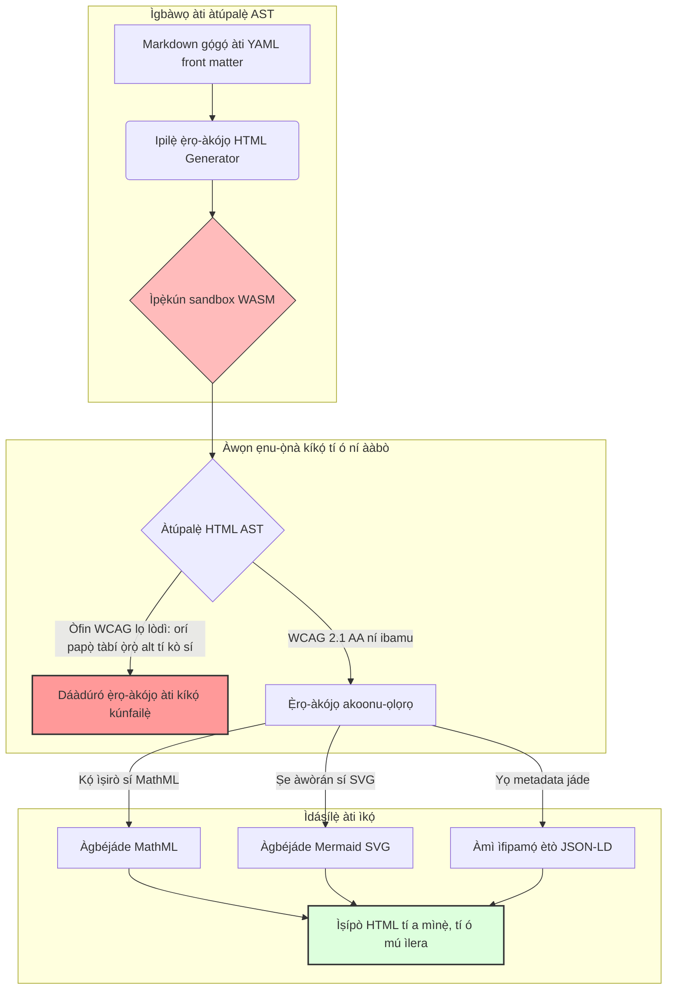

---

# Front Matter (YAML)

author: "contact@sebastienrousseau.com (Sebastien Rousseau)"
banner_alt: "Geometry ìpilẹ̀ṣẹ̀ labẹ́ ìmọ̀lẹ̀ àkójọpọ̀ — tí ó ṣàfihàn ipa HTML Generator gẹ́gẹ́ bí ẹ̀rọ compile-gated Markdown-sí-HTML fún àgbéjáde tí ó wọ́pọ̀, tí ó ní ọwọ́ SEO, àti ẹni tí wọ́n fi sínú àpótí ìfipamọ́"
banner_height: "1597"
banner_width: "2584"
banner: "https://cloudcdn.pro/api/transform?url=/stocks/images/markus-winkler-IrRbSND5EUc-unsplash.webp&w=1200&format=webp&q=80"
cdn: "https://cloudcdn.pro"
charset: "UTF-8"
cname: "sebastienrousseau.com"
copyright: "© Copyright 2025 - 2026 - Sebastien Rousseau. All rights reserved."
date: "June 20, 2026"
description: "HTML Generator jẹ́ ìwé-iṣẹ́ Rust tí ó yí Markdown padà sí HTML tí ó ní ibamu WCAG, tí ó ṣetán fún SEO, tí ó kún JSON-LD — ìráàyèsí gẹ́gẹ́ bí kóòdù, ìtìlẹ́yìn MathML àti Mermaid, àti ìṣiṣẹ́ WebAssembly-sandboxed fún àgbéjáde àjọ tí ó ní ààbò."
format-detection: "telephone=no"
hreflang: "yo"
icon: "https://cloudcdn.pro/clients/sebastienrousseau/v1/logos/sebastienrousseau.svg"
id: "https://sebastienrousseau.com/2026-06-20-html-generator-accessible-seo-structured-markdown-rust-2026"
image_alt: "Àwòrán Àkọ́-àti-Funfun ti Sebastien Rousseau"
image_height: "162"
image_width: "162"
image: "https://cloudcdn.pro/stocks/images/sebastien-rousseau.png"
keywords: "html-generator, Rust Markdown sí HTML, ìráàyèsí gẹ́gẹ́ bí kóòdù, WCAG 2.1 AA, HTML tí ó ṣetán fún SEO, JSON-LD, MathML, Mermaid, WebAssembly, EAA, DORA, ADA Title III, àgbéjáde tí ó wọ́pọ̀, ìsọ di àpótí ìfipamọ́, open source"
language: "yo-NG"
last_reviewed: "2026-06-20"
layout: "report"
locale: "yo_NG"
logo_alt: "Àmì fún Sebastien Rousseau"
logo_height: "44"
logo_width: "44"
logo: "https://cloudcdn.pro/clients/sebastienrousseau/v1/logos/sebastienrousseau.svg"
menu: ""
measurementID: "G-169G4ET5HQ"
name: "Sebastien Rousseau"
permalink: "https://sebastienrousseau.com/2026-06-20-html-generator-accessible-seo-structured-markdown-rust-2026"
rating: "general"
referrer: "no-referrer"
robots: "index, follow"
schema: "FAQPage, Article"
seo_title: "Ìráàyèsí gẹ́gẹ́ bí Kóòdù: Markdown sí HTML AAA pẹ̀lú Rust ní 2026"
short_name: "sebastienrousseau"
subtitle: "Yíyípadà àgbéjáde wẹ́ẹ̀bù àjọ, àkọsílẹ̀ ọjà, àti ẹ̀bùn onibalúwẹ̀ láti àwọn fáìlì ọ̀rọ̀ tí kò wọ́pọ̀ sí àwọn ohun-ìní oníbára tí ó ní ètò àgbáyé, tí ó ní ìmọ̀tẹ̀lẹ̀, àti tí wọ́n fi sínú àpótí ìfipamọ́."
tags: "html-generator, Rust, Markdown, ìráàyèsí, WCAG, SEO, JSON-LD, MathML, Mermaid, WebAssembly, EAA, DORA, ADA, AI-discovery, RAG, open source, ìpìlẹ̀ ìsìn-ilé àjà"
theme-color: "0, 83, 191"
title: "Yíyí Markdown padà sí HTML Tí Ó Wọ́pọ̀, Tí Ó Ṣetán fún SEO, Àti Tí Ó Ní Ètò pẹ̀lú Rust ní 2026"
url: "https://sebastienrousseau.com/2026-06-20-html-generator-accessible-seo-structured-markdown-rust-2026"
viewport: "width=device-width, initial-scale=1, shrink-to-fit=no"

# RSS - The RSS feed front matter (YAML).
atom_link: "https://sebastienrousseau.com/2026-06-20-html-generator-accessible-seo-structured-markdown-rust-2026/rss.xml"
category: "Technology"
docs: https://validator.w3.org/feed/docs/rss2.html
generator: "Static Site Generator (SSG) (version 0.0.40)"
item_description: "HTML Generator jẹ́ ìwé-iṣẹ́ Rust tí ó yí Markdown padà sí HTML tí ó ní ibamu WCAG, tí ó ṣetán fún SEO, tí ó kún JSON-LD — ìráàyèsí gẹ́gẹ́ bí kóòdù, ìtìlẹ́yìn MathML àti Mermaid, àti ìṣiṣẹ́ WebAssembly-sandboxed fún àgbéjáde àjọ tí ó ní ààbò."
item_guid: "https://sebastienrousseau.com/2026-06-20-html-generator-accessible-seo-structured-markdown-rust-2026/rss.xml"
item_link: "https://sebastienrousseau.com/2026-06-20-html-generator-accessible-seo-structured-markdown-rust-2026/rss.xml"
item_pub_date: "Sat, 20 Jun 2026 06:06:06 +0000"
item_title: "Yíyí Markdown padà sí HTML Tí Ó Wọ́pọ̀, Tí Ó Ṣetán fún SEO, Àti Tí Ó Ní Ètò pẹ̀lú Rust ní 2026"
last_build_date: "Sat, 20 Jun 2026 06:06:06 +0000"
managing_editor: "contact@sebastienrousseau.com (Sebastien Rousseau)"
pub_date: "Sat, 20 Jun 2026 06:06:06 +0000"
ttl: "60"
type: "article"
webmaster: "contact@sebastienrousseau.com"

# Apple - The Apple front matter (YAML).
apple_mobile_web_app_orientations: "portrait"
apple_touch_icon_sizes: "192x192"
apple-mobile-web-app-capable: "yes"
apple-mobile-web-app-status-bar-inset: "black"
apple-mobile-web-app-status-bar-style: "black-translucent"
apple-mobile-web-app-title: "Markdown sí HTML AAA pẹ̀lú Rust"
apple-touch-fullscreen: "yes"

# MS Application - The MS Application front matter (YAML).

msapplication-navbutton-color: "0, 83, 191"

# Twitter Card - The Twitter Card front matter (YAML).

twitter_card: "summary_large_image"
twitter_creator: "@wwdseb"
twitter_description: "HTML Generator jẹ́ ìwé-iṣẹ́ Rust tí ó yí Markdown padà sí HTML tí ó ní ibamu WCAG, tí ó ṣetán fún SEO, tí ó kún JSON-LD — ìráàyèsí gẹ́gẹ́ bí kóòdù, ìtìlẹ́yìn MathML àti Mermaid, àti ìṣiṣẹ́ WebAssembly-sandboxed fún àgbéjáde àjọ tí ó ní ààbò."
twitter_image: "https://cloudcdn.pro/clients/sebastienrousseau/v1/logos/sebastienrousseau.svg"
twitter_image_alt: "Àmì Sebastien Rousseau"
twitter_site: "@wwdseb"
twitter_title: "Ìráàyèsí gẹ́gẹ́ bí Kóòdù: Markdown sí HTML AAA pẹ̀lú Rust"
twitter_url: "https://sebastienrousseau.com/2026-06-20-html-generator-accessible-seo-structured-markdown-rust-2026"

# Humans.txt - The Humans.txt front matter (YAML).
author_website: "https://sebastienrousseau.com"
author_twitter: "@wwdseb"
author_location: "London, UK"
thanks: "Ẹ̀ṣẹ̀ pẹ̀lú kíkà!"
site_last_updated: "2026-06-20"
site_standards: "HTML5, CSS3, RSS, Atom, JSON, XML, YAML, Markdown, TOML"
site_components: "Kaishi, Kaishi Builder, Kaishi CLI, Kaishi Templates, Kaishi Themes"
site_software: "Static Site Generator, Rust"

---

# Yíyí Markdown padà sí HTML Tí Ó Wọ́pọ̀, Tí Ó Ṣetán fún SEO, Àti Tí Ó Ní Ètò pẹ̀lú Rust ní 2026

<!-- lead-start -->
<aside class="post-lead" aria-label="Àkópọ̀ àpilẹ̀kọ">

<strong>TL;DR.</strong> HTML Generator jẹ́ ẹ̀rọ-àkójọ Markdown-sí-HTML tí ó jẹ́ Rust funfun tí ó fi WCAG 2.1 AA ṣe dandan ní àkókò kíkọ́, tí ó fi schema-compliant JSON-LD sínú, tí ó ṣe MathML àti Mermaid SVG ní ìbínú, àti tí ó ṣe ìsọ̀ di àpótí ìfipamọ́ nínú WebAssembly sandbox — tí ó yí àgbéjáde àjọ padà sí ìlànà ìdarí compile-gated fún ìráàyèsí, SEO, àti ààbò ICT.

<strong>Àwọn ohun pàtàkì</strong>

<ul class="post-lead-takeaways">
  <li><strong>Ìdáhùn kíákíá.</strong> Kí ni HTML Generator ní gbólóhùn kan?</li>
  <li><strong>Àkópọ̀ ìpínlẹ̀.</strong> Ìṣiṣẹ́ Markdown dàbí ohun tí ó rọrùn; Ṣíṣe HTML tí ó yẹ fún àgbéjáde jẹ́ ìṣòro ibamu.</li>
  <li><strong>01. Idi tí ẹ̀rọ-àkójọ HTML tí ó fi ìráàyèsí ṣáájú ṣe pàtàkì ní 2026.</strong> EAA àti ADA Title III ti yí ìráàyèsí padà láti ìmọ̀ẹ̀rọ ìmọtara-ẹni-nìkan sí ojúṣe àjọ-ìdarí.</li>
  <li><strong>02. Ojú ìwò àkójọ HTML Generator 2026.</strong> Ẹ̀rọ ìtumọ̀ onírúurú-ìpele, compile-gated, láti Markdown ọrọ gọ́gọ́ sí ìṣípò HTML tí ó mú ìlera wa.</li>
</ul>

<strong>Kíkà tí ó jọmọ:</strong> <a href="https://sebastienrousseau.com/2026-06-18-noyalib-safe-yaml-rust-ai-mcp-financial-infrastructure-2026">Idi tí YAML Nílò Ọ̀nà Rust Tí Ó Ní Ààbò Jù Fún AI, MCP, àti Àkọsílẹ̀ Ìnáwó ní 2026</a>, <a href="https://sebastienrousseau.com/2026-06-17-static-site-generator-secure-default-ai-era-publishing-2026">Static Site Generator Tí Ó Ní Ààbò Gẹ́gẹ́ bí Ìpìlẹ̀ Fún Àgbéjáde Àkókò AI ní 2026</a>, <a href="https://sebastienrousseau.com/2026-06-11-cloudcdn-open-source-blueprint-ai-native-edge-2026">CloudCDN: Ètò Open-Source Fún Ẹ̀gbẹ́ AI-Native ní 2026</a>.

</aside>
<!-- lead-end -->

Ní 2026, àwọn akoonu wẹ́ẹ̀bù ni a ń lo gẹ́gẹ́ bí AI ṣe ń wákiri, àwọn ẹ̀rọ àwárí tí LLM ń ṣe àtìlẹ́yìn rẹ̀, àti àwọn ẹ̀rọ Retrieval-Augmented Generation (RAG) tí ó tó iye àwọn ẹ̀dá ènìyàn tí ó ń ka wọn. HTML tí ó papọ̀ tàbí tí ó jẹ́ aṣiṣe ń dáàbò bò ìrí àwọn ẹ̀rọ àwárí, nígbà tí kíkúnà láti ní ibamu pẹ̀lú àwọn òfin àgbáyé tí ó mú ní [European Accessibility Act (EAA)](https://www.accessibility-act.eu/) àti [US ADA Title III](https://www.ada.gov/topics/title-iii/) ti di ojúṣe òfin tí kò sí iyèméjì. [HTML Generator](https://github.com/sebastienrousseau/html-generator) jẹ́ ìwé-iṣẹ́ Rust gíga-ìṣẹ́ tí a ṣe àgbékalẹ̀ láti pa àwọn àáárò wọ̀nyẹn dúró — ní ẹ̀rọ-àkójọ, kì í ṣe nínú àwọn ìtúnṣe lẹ́yìn ìmúlò.

## Ìdáhùn kíákíá

**Kí ni HTML Generator ní gbólóhùn kan?** HTML Generator jẹ́ ẹ̀rọ-àkójọ Markdown-sí-HTML open-source, tí ó jẹ́ Rust funfun, tí ó fi [WCAG 2.1 AA](https://www.w3.org/TR/WCAG21/) ṣe dandan ní àkókò kíkọ́, tí ó ṣe àwọn ami ìlà ètò àti àwọn àfihàn ARIA ní àdásílẹ̀, tí ó fi [JSON-LD](https://json-ld.org/) metadata tí ó ní ibamu schema sínú láti YAML front matter, tí ó ṣe àwọn àwòrán Mermaid àti ìṣirò sí SVG àti MathML tí ó wọ́pọ̀, àti tí ó ṣiṣẹ́ nínú [WebAssembly](https://webassembly.org/) sandbox — tí ó yí àgbéjáde àjọ padà sí ìlànà ìdarí compile-gated, fiduciary-grade.

## Àkópọ̀ ìpínlẹ̀

Ìṣiṣẹ́ Markdown dàbí ohun tí ó rọrùn. HTML tí ó yẹ fún àgbéjáde jẹ́ ìṣòro ibamu. Ní Okudu 2026, gbogbo ojú-ọnà àjọ — àwọn ẹ̀bùn ìdókòwò, àwọn fáìlì ìtọ́sọ́nà, àkọsílẹ̀ aléṣe, àwọn ìtọ́kasí API, àwọn ohun-ìní tẹẹ — ni àwọn ẹ̀dá ènìyàn àti àwọn ẹ̀rọ ń ṣe ìtúpalẹ̀. Ìtẹ̀síwájú méjì ń pàdé ara wọn lórí gbogbo ojú-ewé: [EAA](https://www.accessibility-act.eu/) àti [ADA Title III](https://www.ada.gov/topics/title-iii/) ti mú ìráàyèsí di ewu òfin ní ìpele bọọ̀dù, nígbà tí ìgbàwọ AI àti àwọn ẹ̀rọ RAG ń san àwọn àbájáde tí ó ní ètò, tí ó ṣe kíkà ẹ̀rọ. Àwọn ìwé-iṣẹ́ Markdown àṣà ń ṣe HTML papọ̀ tí ó kúnfailẹ̀ àwọn ẹnu-ọ̀nà méjì. HTML Generator ń wo ìgbéjáde ìwé gẹ́gẹ́ bí ẹ̀rọ compile-gated: Ìfọwọ́sí WCAG jẹ́ aṣiṣe àkókò kíkọ́, JSON-LD wá láti YAML front matter láìsí àmì ọwọ́, MathML àti Mermaid ń ṣe ìfihàn tí ó wọ́pọ̀, àti gbogbo ẹ̀rọ náà ń gba gbé gẹ́gẹ́ bí fojú WebAssembly kí ìsọ̀ di àpótí ìfipamọ́ ti àwọn ìwé tí kò ní ìgbẹ̀kẹ̀lé dúró sínú.

## Àwọn ohun pàtàkì

- **Ìráàyèsí-gẹ́gẹ́-bí-kóòdù jẹ́ ìpìlẹ̀ tuntun.** EAA fi àṣẹ ìráàyèsí fún àwọn iṣẹ́ oníbára oníbára. HTML Generator ń ṣe ìyẹ̀wò igi ìwé ní àkókò kíkọ́, tí ó ṣe àwọn ami ìlà ètò àti àwọn àfihàn ARIA ní àdásílẹ̀ — ìtúnṣe díẹ̀ lẹ́yìn ìmúlò, ìsowópọ̀ ìtúnṣe díẹ̀, kò sí ọ̀rọ̀ àwòrán tí kò sí tí ó ń gbé lọ sí ìṣèdásẹ̀.
- **Àdàkọ tí ó ní ètò fún ìwárí AI.** Àwárí tuntun àti RAG gbára lé metadata tí ó ṣe kíkà ẹ̀rọ. Ẹ̀rọ-àkójọ ń ṣe ìtúpalẹ̀ YAML front matter àti tí ó fi [JSON-LD tí ó ní ibamu Schema.org](https://schema.org/) sínú orí ìwé ní tààrà, tí ó mú akoonu di ìtumọ̀ pé àwọn [Google Rich Results](https://developers.google.com/search/docs/appearance/structured-data/intro-structured-data), [Bing Webmaster](https://www.bing.com/webmasters), àti àwọn alatakun tí LLM ń ṣe àtìlẹ́yìn rẹ̀ le ní oye.
- **Ìṣeyọri akoonu ìmọ̀-ẹ̀rọ.** Àgbéjáde ìmọ̀-ẹ̀rọ kì í ṣe ọ̀rọ̀ papọ̀. HTML Generator ń ṣe àkójọ àwọn àfikún ìṣirò Markdown gọ́gọ́ sí [MathML](https://www.w3.org/Math/) tí ó wọ́pọ̀, àti tí ó ṣe àwọn àwòrán [Mermaid.js](https://mermaid.js.org/) sí SVG tí ó fèsì — àwọn méjì tí wọ́n ń pa ìgbẹ̀kẹ̀lé ètò WCAG-compliant mọ́ dípò ìdọ̀ti sí àwọn àwòrán tí kò ní ìmọ̀.
- **Ìsọ̀ di àpótí ìfipamọ́ WebAssembly.** Ìsọ̀ Markdown tí kò ní ìgbẹ̀kẹ̀lé jẹ́ ewu ààbò. Nípa fojú [WASM](https://webassembly.org/), HTML Generator ń ṣiṣẹ́ nínú sandbox tí ó ya sọ́tọ̀ tí ó ń dáàbò bò ìṣẹ̀dá kóòdù lásán àti tí ó ń dáàbò bò ẹ̀rọ gbé — tí ó ń ṣe ìrẹ́pọ̀ tóótọ́ pẹ̀lú àwọn ojúṣe ààbò ICT [DORA Article 6](https://eur-lex.europa.eu/legal-content/EN/TXT/?uri=CELEX%3A32022R2554).
- **Ìdáàbò fídúṣierì fún àwọn bọọ̀dù.** Kíkúnà ìmọ̀-ẹ̀rọ ti gba yàrá ìjókòó bọọ̀dù. Ìsọ̀di àbáwọlé lórí ẹ̀rọ-àkójọ HTML compile-gated ń dáàbò bò àwọn olùdarí àti ìjóba gíga láti ewu ara ẹni òfin àti ìtọ́sọ́nà labẹ̀ DORA, EAA, àti ADA Title III.

**Kíkà tí ó jọmọ:** [Idi tí YAML Nílò Ọ̀nà Rust Tí Ó Ní Ààbò Jù Fún AI, MCP, àti Àkọsílẹ̀ Ìnáwó ní 2026](https://sebastienrousseau.com/2026-06-18-noyalib-safe-yaml-rust-ai-mcp-financial-infrastructure-2026/), [Static Site Generator Tí Ó Ní Ààbò Gẹ́gẹ́ bí Ìpìlẹ̀ Fún Àgbéjáde Àkókò AI ní 2026](https://sebastienrousseau.com/2026-06-17-static-site-generator-secure-default-ai-era-publishing-2026/), [CloudCDN: Ètò Open-Source Fún Ẹ̀gbẹ́ AI-Native ní 2026](https://sebastienrousseau.com/2026-06-11-cloudcdn-open-source-blueprint-ai-native-edge-2026/).

## 01. Idi Tí Ẹ̀rọ-Àkójọ HTML Tí Ó Fi Ìráàyèsí Ṣáájú Ṣe Pàtàkì ní 2026

Àwọn ohun-ìní wẹ́ẹ̀bù àjọ, àwọn ìkàwé àkọsílẹ̀, àti àwọn ilé-ìwé ìrànlọ́wọ́ ọjà jẹ́ àwọn ojú-ọnà oníbára oníbára tó ṣe pàtàkì. Wọ́n wà nísinsìnyí labẹ̀ ìtẹ̀síwájú méjì tí ó lágbára, tí ó papọ̀.

Èkíní ni **ìgbàwọ àti ìrí AI**. Akoonu ń ní ìtúpalẹ̀ díẹ̀díẹ̀ nípa àwọn àwòṣe ède ńlá àti àwọn ẹ̀rọ Retrieval-Augmented Generation. HTML papọ̀ tàbí tí ó jẹ́ aṣiṣe ń dáàmu ìsọ̀ alatakun, tí ó fi akoonu àjọ àti àkọsílẹ̀ silẹ̀ tí kò ṣe àfihàn fún àwọn àpẹẹrẹ àwárí tuntun — pẹ̀lú [Google Search Generative Experience](https://blog.google/products/search/generative-ai-search/), títé àwárí [ChatGPT](https://chat.openai.com/), àti àwọn aṣòfin RAG àjọ.

Èkejì ni **òfin ìráàyèsí àgbáyé tí ó gbóná**. Labẹ̀ [European Accessibility Act](https://www.accessibility-act.eu/) (tí ó wọ́ ní pípé láti Okudu 2025) àti [US ADA Title III](https://www.ada.gov/topics/title-iii/), àwọn ẹ̀rọ àgbéjáde àjọ gbọdọ̀ ṣe ìdánilójú ìráàyèsí oníbára kíkún. Kíkúnà láti pàdé [WCAG 2.1 AA](https://www.w3.org/TR/WCAG21/) kì í ṣe àṣìṣe ìmọ̀ẹ̀rọ mọ́; o jẹ́ ojúṣe àjọ àti ìtọ́sọ́nà tí ó ti ṣe àwọn ìgbékalẹ̀ àwọn mílíọ̀nù dọ́là.

[HTML Generator](https://github.com/sebastienrousseau/html-generator) ń tọka sí àwọn ìtẹ̀síwájú méjì ní tààrà. O jẹ́ ìwé-iṣẹ́ Rust tí ó ní ìfúnniilẹ̀ tí a ṣe àgbékalẹ̀ láti yí Markdown padà sí HTML tí ó wọ́pọ̀, tí ó ṣetán fún SEO, tí ó ní ètò. Nípa wíwo ìgbéjáde ìwé gẹ́gẹ́ bí ẹ̀rọ compile-gated, ẹ̀rọ náà ń pèsè **Return on Resilience (RoR)** gíga — tí ó ń dáàbò bò àwọn balẹ̀ ìnáwó láti ìgbéjọ́ ìráàyèsí nígbà tí ó ń ṣàyọ ìrípadà àwọn ẹ̀rọ àwárí AI.

## 02. Ojú Ìwò Àkójọ HTML Generator 2026

Ìgbẹ̀kẹ̀lé ètò ti jẹ́ àgbékalẹ̀ gẹ́gẹ́ bí ẹ̀rọ ìtumọ̀ onírúurú-ìpele, tí ó ní ààbò tí ó ń yí ọ̀rọ̀ Markdown gọ́gọ́ padà sí àwọn ohun-ìní aláìdánilójú tí a ti fọwọ́sí nínú kírípítò, tí ó wọ́pọ̀ gíga.

### Tábìlì 1: Àwọn ìpele àkójọ HTML Generator àti ìdinku ewu

| Ìpele | Ìpinnu àgbékalẹ̀ | Idi tí ó ṣe pàtàkì | Ewu tí ó bá wà tí a bá ṣe àṣìṣe |
| ---- | ---- | ---- | ---- |
| **Ìpele ìgbàwọ** | Àtúpalẹ̀ Markdown àti YAML front matter | Ń pàdé àwọn òǹkọ̀wé níbi tí wọ́n wà; ń ya prose sọ́tọ̀ láti metadata ètò. | Metadata tí kò ní ìṣọ̀kan, àwọn sitemap tí ó fọ́, àwọn àáárò atọ́kùn. |
| **Ìpele ìgbékalẹ̀** | Tábìlì Àkọsílẹ̀ àdásílẹ̀ àti àwọn ami ìlà ètò pẹ̀lú àwọn àmì ARIA | Ń ṣe àwọn igi ìwé tí ó ṣe ìgbéléwọ̀n, tí ó wọ́pọ̀ nípasẹ̀ ìgbékalẹ̀. | HTML papọ̀ tí ó fọ́ àwọn olùkà àwòrán àti tí ó lọ si lòdì WCAG. |
| **Ìpele akoonu-ọlọrọ** | Ìṣiṣẹ́ MathML àti Mermaid.js SVG ti ìbínú | Ń ṣe àwọn àgbékalẹ̀ àti àwòrán sí SVG àti MathML tí ó wọ́pọ̀. | Ìṣiṣẹ́ JS ní ìpele aléṣe àti ìṣípò ìmọ̀-ẹ̀rọ ìrànlọ́wọ́ tí ó fọ́. |
| **Ìpele SEO àti àdàkọ** | Ìgbéjáde JSON-LD àti metadata tí ó ní ètò pẹ̀lú** | Ń fi JSON-LD tí ó ní ibamu [Schema.org](https://schema.org/) sínú orí ní tààrà. | Àwọn ẹ̀rọ àwárí àti àwọn alatakun AI tí ń ṣe àṣìṣe ìtumọ̀ àkọ̀wé, ọ̀rọ̀, ìgbọ̀wọ́. |
| **Ìpele àkókò ìṣiṣẹ́** | Ẹ̀rọ-àkójọ Rust ti ìbínú pẹ̀lú fojú WebAssembly | Ń gbààyè fún ìṣiṣẹ́ tí ó ní ààbò, sandbox lórí àwọn sáfá, àwọn ẹ̀gbẹ́, àti àwọn aṣàwákiri. | Ìṣẹ̀dá kóòdù lásán nígbà ìsọ̀ Markdown tí kò ní ìgbẹ̀kẹ̀lé. |

## 03. Àwọn Àmì Ààbò Wẹ́ẹ̀bù àti Ìráàyèsí Pàtàkì

Láti ṣe ìdánilójú pé àwọn ohun-ìní àgbéjáde ojú-àwùjọ-pọ̀ ń pàdé àwọn ìyẹ̀wò ìtọ́sọ́nà àti ààbò tuntun, àwọn olùdarí ìmọ̀-ẹ̀rọ gíga gbọdọ̀ ṣe àbójútó àwọn ìwọ̀n kan pàtàkì tí ó le ṣe iṣiro.

### Tábìlì 2: Àwọn àmì ààbò wẹ́ẹ̀bù àti ìráàyèsí

| Àmì | Ìwọ̀n / Àwọn ifojúsọ́nà iṣẹ́ | Ìtọ́kasí EAA / DORA / W3C | Ìmúlò ìmọ̀-ẹ̀rọ |
| ---- | ---- | ---- | ---- |
| **Ìjẹ́ṣírí ìráàyèsí** | 100% ti àwọn ojú-ewé tí a kọ́ tí a fọwọ́sí lòdì àwọn òfin WCAG 2.1 AA. | [EAA](https://www.accessibility-act.eu/) àti [ADA Title III](https://www.ada.gov/topics/title-iii/) | Àtúpalẹ̀ HTML ní àkókò kíkọ́ tí ó ń ṣe ìyẹ̀wò àwọn àmì alt àwòrán àti àwọn ami ìlà ètò. |
| **Sandbox ìṣiṣẹ́ WASM** | 100% ti àwọn ìgbàwọ Markdown tí kò ní ìgbẹ̀kẹ̀lé tí a kọ́ nínú àkókò ìṣiṣẹ́ WebAssembly tí ó ya sọ́tọ̀. | [DORA Article 6](https://eur-lex.europa.eu/legal-content/EN/TXT/?uri=CELEX%3A32022R2554) (ààbò ICT) | Ìya sọ́tọ̀ àyíká ìsọ̀ láti sáfá gbé. |
| **Ẹ̀bùn metadata tí ó ní ètò** | 100% ti àwọn àpilẹ̀kọ tí a tẹ̀jáde tí a fi àwọn àkọsọ JSON-LD tí ó fọwọ́sí, tí ó ní ibamu schema sínú. | Àwọn pípínlẹ̀ [Schema.org](https://schema.org/) | Ìsọ̀ front-matter àdásílẹ̀ àti ìyípadà sí àwọn ohun JSON-LD. |
| **Ìwọ̀n ìgbéjáde** | Fojú ojú-ewé-ní-ìṣẹ́jú lórí ohun ẹ̀rọ tí ó wọ́pọ̀ ju 10,000. | Return on Resilience (RoR) | Ẹ̀rọ-àkójọ AST Rust tí ó ní ìpàáájú gíga. |
| **Ìfọwọ́sí ojúkejì ọlọrọ** | Àṣiṣe ìsọ̀ ohunkóhun lórí [Google Rich Results](https://search.google.com/test/rich-results) àti àwọn ìgbéṣẹ̀ [Schema validator](https://validator.schema.org/). | Àwọn ìlànà Google Search | Ìfọwọ́sí ètò ti JSON-LD tí a ṣe nígbà ẹ̀rọ kíkọ́. |

## 04. Ìtàgbóná ti Ìṣiṣẹ́ Markdown Rọrùn

Ìtàgbóná tí ó wọ́pọ̀ lára àwọn olùdarí ìmọ̀-ẹ̀rọ ni pé ìyípadà Markdown sí HTML jẹ́ adawọle ìrọ̀lẹ̀ ọ̀rọ̀. Ọ̀pọ̀ àwọn ìwé-iṣẹ́ àṣà ń yí ìsẹ̀dá Markdown padà sí HTML papọ̀, tí kò ní ètò. Ìṣípò ń ṣe ìfihàn sí olùkà tí ó ń wò nínú àṣàwákiri, ṣùgbọ́n ó ṣe àfihàn àpòkúdé ibamu.

HTML papọ̀ mọ́ ìṣoro mẹ́ta ní àbọ̀.

1. **Àwọn ìpele orí tí ó tọ́.** Markdown àṣà kò fi ìpele orí ṣe dandan. Fífo láti `<h1>` sí `<h4>` lọ lòdì WCAG 2.1 AA àti ó fọ́ ìgbéléwọ̀n ìwé fún àwọn olùkà àwòrán.
2. **Ètò tábìlì tí ó ṣókùnfà.** Àwọn tábìlì Markdown àṣà ṣọwọ́ ni a ṣe ìfihàn pẹ̀lú àwọn àfihàn `<th>` scope àti `<tbody>` tí ó tọ́ tí a nílò fún ìsọ̀ tí ó wọ́pọ̀.
3. **Metadata tí ó ṣe kíkà ẹ̀rọ.** HTML àṣà kò ní àwọn ohun ìmúlò JSON-LD tí àwọn ẹ̀rọ àwárí AI tuntun àti àwọn ẹ̀rọ RAG gbára lé.

HTML Generator ń yanjú èyí nípasẹ̀ ìsọ̀ Markdown sínú **Abstract Syntax Tree (AST)**. Ẹ̀rọ náà ń ṣe ìyẹ̀wò ìgbékalẹ̀ ìwé kí ó tó gbé HTML jáde, tí ó ṣe fọwọ́sí ìpele orí, tí ó fi àwọn àfihàn ARIA tó yẹ sínú, àti tí ó jẹ́rìí pé gbogbo ohun-ìní àgbéjáde gbe ọ̀rọ̀ ìyípadà — tí ó yí ìráàyèsí padà láti ìdánwò ọwọ́ sí àbójútó àkókò-kíkọ́ tí a ṣe ìdánilójú.

## 05. Àgbékalẹ̀ Ẹ̀rọ Kíkọ́ Ìráàyèsí-gẹ́gẹ́ bí-Kóòdù

Láti dáàbò bò àwọn ohun-ìní tí kò wọ́pọ̀ tàbí tí kò ní atọ́kùn kúrò nínú ìmúlò ojú-àwùjọ, ìráàyèsí gbọdọ̀ jẹ́ ẹnu-ọ̀nà ẹ̀rọ-àkójọ tí ó mú. Ẹ̀rọ tẹ̀lé wọnú fi hàn bí HTML Generator ṣe ń ṣe ìyẹ̀wò Markdown, ń ṣiṣẹ́ fọwọ́sí WebAssembly-isolated, àti tí ó ń gbé HTML tí ó mú ìlera, tí ó ní ètò jáde.

## 06. Ètò Ìjókòó Bọọ̀dù àti Ojúṣe Fídúṣierì

Ibamu ìráàyèsí àti ààbò-wẹ́ẹ̀bù tuntun jẹ́ ìṣòro ìjókòó bọọ̀dù tí kò ní àwọn ìpàdàbọ̀. Ìjóba gíga gbọdọ̀ sún mọ́ àkọsílẹ̀ ìpìlẹ̀ àgbéjáde nípasẹ̀ ojú-ọwọ́ ewu òfin, ìdáàbò ìnáwó, àti ìfihàn ìtọ́sọ́nà.

- **European Accessibility Act (EAA).** Ń fi àṣẹ ibamu tí ó ní ìgbẹ̀kẹ̀lé òfin tààrà lórí àwọn ẹ̀bùn oníbára ojú-àwùjọ àkọ́kọ́ àti ti àdáni. Kíkúnà ìmọ̀tẹ̀lẹ̀ le ṣe àwọn ìjìyà ìnáwó tó le, ìgbéjọ́ àjọ, àti yiyọ lẹ́sẹ̀kẹ́sẹ̀ ohun-ìní láti ọjà EU. Nípa ṣíṣe ìdásọ̀pọ̀ ìráàyèsí-gẹ́gẹ́ bí-kóòdù, àwọn bọọ̀dù le ṣe ìjẹ́ṣírí pé kóòdù tí kò ní ibamu kò le gbé — tí ó yí ìtúnṣe àtayé padà sí àgádagodo òfin ìgbékalẹ̀.
- **DORA Article 6 (Àwọn Àyíká ICT Tí Ó Ní Ààbò).** Ń fi àwọn òfin tí ó gbóná ṣe dandan fún ààbò àyíká ICT. Nípa ṣíṣe ìya sọ́tọ̀ ìkọ́ Markdown sínú WebAssembly sandbox, àwọn àjọ ṣe ìdánilójú pé ìsọ̀ àkọsílẹ̀ tí oníbára gbé sókè tàbí àwọn ìfunni alájọṣepọ̀ kò le ṣafihàn àwọn sáfá gbé sí ìṣẹ̀dá kóòdù lásán, tí ó ń dáàbò bò àwọn ẹ̀bùn àjà bèkéle.
- **Ìdinku iye ìdàgbàsókè nínú àwọn ìyẹ̀wò ibamu.** Ibamu ìráàyèsí àṣà gbára lé àwọn ìyẹ̀wò lẹ́yìn-ìmúlò gbọrọ, olóore — ẹgbẹẹgbẹ̀rún dọ́là lọ́dọọdún fún aaye kọ̀ọ̀kan. Ìmúlò fọwọ́sí WCAG gẹ́gẹ́ bí ìdẹ́kùn àkókò-kíkọ́ ń pa àwọn iye àtayé wọ̀nyẹn kúrò, tí ó ń yí ìsowópọ̀ ibamu láti ìdáàbò sí ìdásílẹ̀.

## 07. Ohun Tí Èyí Túmọ̀ sí Nípasẹ̀ Àwa Àjà / Irú Àjọ

### Àwọn Àjà Tí Ó Pàtàkì Lágbára Lágbára (G-SIBs)

G-SIBs ń ṣiṣẹ́ àwọn ohun-ìní ojú-àwùjọ ọlọrọ, ọlọ́-ọ̀pọ̀-èdè tí ó ń tẹ̀jáde ẹgbẹẹgbẹ̀rún àwọn iṣẹ́ ìwádìí, àwọn ìṣípò ìtọ́sọ́nà, àti àwọn ìwé-ìfihàn ìdókòwò kọjá àwọn àgbègbè ọlọ́-ọ̀pọ̀. Ìdojúkọ wọn jẹ́ ìwọ̀n àti àbáwọlé ọlọ́-ọ̀pọ̀-èdè. Fojú WebAssembly HTML Generator àti ẹ̀rọ Rust gíga-ìgbéjáde gba àwọn ìkàwé ìwádìí àgbáyé, ṣíṣe àgbéjáde, àti ìmúlò ní àkókò bẹẹnu díẹ̀ — láìsí ìdẹ̀dẹ ìfihàn tàbí ìdàwò ìráàyèsí.

### Àwọn Àjà Ìṣòwò àti Àjọ

Fún àwọn àjà ìṣòwò, àwọn ẹ̀bùn oníbára, àwọn ilé-iṣẹ́ àkọsílẹ̀, àti àwọn ìtọ́sọ́nà API olùdàgbàsókè jẹ́ àwọn ojú-ọnà oníbára tó ṣe pàtàkì. Ìkọ́ àwọn ohun-ìní wọ̀nyẹn nípasẹ̀ HTML Generator túmọ̀ sí pé àwọn ìfunni oníbára kò ní ìfihàn XSS, kò sí àwọn àfojúsọ́nà jíjọjà àkónyínú, àti kò sí àwọn àáárò ìráàyèsí — tí ó ń pa ìgbẹ̀kẹ̀lé àjọ mọ́ àti ìdinku ojú ìgbéjọ́.

### Àwọn Àjà Àdúgbò àti Fintechs

Àwọn àjà àdúgbò àti fintechs tí ó ní ìgboyà ń dije lórí ìrírí oníbára láìsí àwọn ìsowópọ̀ ìmọ̀ẹ̀rọ G-SIB. HTML Generator pèsè àwọn àjà wọ̀nyẹn pẹ̀lú ẹ̀rọ àgbéjáde ìpele àjọ tí ó sínú àpótí, tí ó gba àwọn ohun-ìní kékeré láyè láti gbé àwọn ohun-ìní tí ó wọ́pọ̀, tí ó ṣetán fún SEO, tí ó fi sandbox sínú tí ó ṣe ìdúró ìdánwò láti ọwọ́ àwọn olùfọ̀sí àti àwọn oníbára àjọ tí ó ṣe àmúlò.

## 08. Ètò Ọ̀nà Àkọsílẹ̀ Àgbéjáde

Àwọn ohun-ìní wẹ́ẹ̀bù ojú-àwùjọ àjọ jẹ́ ẹ̀yà pàtàkì ti ìdúró ìṣiṣẹ́. Gbígbára lé àwọn ẹ̀rọ wẹ́ẹ̀bù tí ó lọ́ra, tí ó le dojú ìgbésẹ̀ ti àkónyínú, tí o ní ìfunni oríṣi-ọjà ìpíkúlẹ̀ — tàbí àwọn ohun-ìní aláìdánilójú tí kò sí àmì — jẹ́ ewu iṣẹ́ tí kò ṣe ìyọ̀.

Láti dáàbò bò àwọn ojú-ọnà oníbára oníbára àti dáàbò bò àwọn balẹ̀ ìnáwó láti ìgbéjọ́ ìráàyèsí, àwọn olùdarí ìmọ̀-ẹ̀rọ àti ààbò gíga gbọdọ̀ ṣe ètò tí ó ṣókùnfà.

1. **Yípadà sí àwọn àkójọ aláìgbékalẹ̀.** Dáwọ́ àwọn ẹ̀rọ CMS àgbékalẹ̀ àtijọ́ dúró fún ìwádìí, tẹẹ, àti àwọn ohun-ìní àkọsílẹ̀. Gbé akoonu sínú àwọn ẹ̀rọ compile-gated bí HTML Generator.
2. **Fi ìráàyèsí ṣe dandan ní àkókò kíkọ́.** Ṣe ìmúlò ìráàyèsí-gẹ́gẹ́ bí-kóòdù. Kíkọ́ kúnfailẹ̀ ẹ̀rọ àdásílẹ̀ lórí ìlòdì WCAG 2.1 AA èyíkéyìí.
3. **Ya ìsọ̀ sọ́tọ̀ nínú WebAssembly.** Pọ́n gbogbo ìwé àti ìsọ̀ akoonu sínú àkókò ìṣiṣẹ́ WASM kí ìgbàwọ tí kò ní ìgbẹ̀kẹ̀lé má pa ọwọ́ mọ́ àwọn ẹ̀rọ gbé.
4. **Fi metadata JSON-LD ọlọrọ sínú.** Ṣe ìdánilójú pé gbogbo ohun-ìní tí a tẹ̀jáde gbe àwọn àkọsọ JSON-LD tí ó ní ibamu schema láti ṣàyọ ìrí AI.

## 09. Àwọn Ìbéèrè Tí A Sábà Béèrè

**Báwo ni HTML Generator ṣe fi WCAG ṣe dandan?**

Ó ń ṣe ìsọ̀ Abstract Syntax Tree HTML tí a ṣe ní àkókò kíkọ́, tí ó ń ṣe ìyẹ̀wò ìwé lòdì àwọn òfin [WCAG 2.1 AA](https://www.w3.org/TR/WCAG21/). Tí òfin kan bá lọ lòdì — àmì alt tí kò sí, fífo orí, ìdarí fọ́ọ̀mù tí kò ní àmì — ẹ̀rọ-àkójọ dáàdúró kíkọ́, tí ó tọ́ ìráàyèsí gẹ́gẹ́ bí àbójútó àkókò-kíkọ́ dípò ìṣẹ́ ìdánwò lẹ́yìn-ìmúlò.

**Idi tí ìya sọ́tọ̀ WebAssembly ṣe pàtàkì?**

[WebAssembly](https://webassembly.org/) gba ẹ̀rọ ìsọ̀ Markdown láyè láti ṣiṣẹ́ nínú sandbox tí ó ya sọ́tọ̀, tí a yàlà láti sáfá gbé. Kódà nígbà tí olùṣe ìpalára kan gbe ìwé Markdown tí a kọ láti lo àwọn àìpé àtúpalẹ̀ sókè, ìṣiṣẹ́ ti di àpò — tí ó ń dáàbò bò àwọn ẹ̀rọ gbé àti ó ń pàdé àwọn ojúṣe ààbò ICT DORA Article 6.

**Báwo ni JSON-LD ṣe ṣàǹfàní ìrí àwárí ní 2026?**

[JSON-LD](https://json-ld.org/) pèsè metadata tí ó ní ètò, tí ó ṣe kíkà ẹ̀rọ nínú orí ìwé. [Google Rich Results](https://developers.google.com/search/docs/appearance/structured-data/intro-structured-data), àwọn alatakun Bing, àti àwọn aṣòfin àwárí tí LLM ń ṣe àtìlẹ́yìn rẹ̀ ṣe ìdámọ̀ àkọ̀wé, ìgbọ̀wọ́, ọjọ́ ìtẹ̀jáde, àti ọ̀rọ̀ ètò ní ìgbà díẹ̀ — tí ó ń fò ìàáfin àṣemáṣe HTML àṣà àti ìdàgbàsókè ojú ìrí nínú ìwárí tí AI ń ṣe.

**Tani olùgba fún HTML Generator?**

Àwọn olùkọ́ aaye aláìgbékalẹ̀, àwọn ẹgbẹ́ àkọsílẹ̀, àwọn òǹkọ̀wé ìmọ̀-ẹ̀rọ, àwọn olùdàgbàsókè Rust, àti àwọn ẹ̀rọ ìmọ̀-ẹ̀rọ àgbéjáde tí ó fi ìráàyèsí ṣáájú tàbí àwọn ohun-ìní tí olùfọ̀sí ń fojúsọ́nà. Ó tún jẹ́ ìpele ìṣiṣẹ́ akoonu tí ó ṣe ní àwọn ẹ̀rọ àgbéjáde tí ó ni ààbò tóbijù bí [Static Site Generator (SSG)](https://github.com/sebastienrousseau/static-site-generator).

## 10. Àwọn Ìtọ́kasí

- World Wide Web Consortium (W3C), 2024. [Web Content Accessibility Guidelines (WCAG) 2.1 ⧉](https://www.w3.org/TR/WCAG21/ "Web Content Accessibility Guidelines 2.1").
- Schema.org, 2026. [Àwọn pípínlẹ̀ àdàkọ tí ó ní ètò Schema.org ⧉](https://schema.org/ "Schema.org structured-data specifications").
- European Parliament and Council of the European Union, 2022. [Regulation (EU) 2022/2554 lórí ìdúró ìṣiṣẹ́ oníbára fún ẹ̀ka ìnáwó (DORA) ⧉](https://eur-lex.europa.eu/legal-content/EN/TXT/?uri=CELEX%3A32022R2554 "DORA Regulation").
- European Commission, 2025. [European Accessibility Act ⧉](https://www.accessibility-act.eu/ "European Accessibility Act").
- US Department of Justice, 2024. [ADA Title III ⧉](https://www.ada.gov/topics/title-iii/ "ADA Title III").
- WebAssembly Community Group, 2026. [Pípínlẹ̀ WebAssembly ⧉](https://webassembly.org/ "WebAssembly").
- GitHub, 2026. [Ìpamọ́ HTML Generator ⧉](https://github.com/sebastienrousseau/html-generator "HTML Generator open-source repository").

<!-- enrich-start -->
<aside class="author-card" aria-label="Nípa àkọ̀wé"><strong class="author-card-name"><a href="/about/index.html">Sebastien Rousseau</a></strong>Ẹ̀rọ-ìmọ̀ àjà gíga tí ó ń kọ lórí AI tí a lo, àkọsílẹ̀ ìsanwó, owó tí a ṣe àmì, ISO 20022, ààbò lẹ́yìn-quantum, àwọn iṣẹ́ ìnáwó cloud-native, àkọsílẹ̀ open-source, àti àwọn ọjà oníbára tí ó ní ìtọ́sọ́nà.Ọdún 20+ kọjá HSBC Commercial &amp; Investment Bank, PayPal, Barclays, Shazam, AKQA, Virgin Group. <a href="/about/index.html">Àwòkọ́ pípé</a> &middot; <a href="https://www.linkedin.com/in/sebastienrousseau/" rel="external noopener">LinkedIn</a> &middot; <a href="https://github.com/sebastienrousseau" rel="external noopener">GitHub</a></aside>

Ìyẹ̀wò ìkẹ́yìn <time datetime="2026-06-20">2026-06-20</time>.

<!-- enrich-end -->
