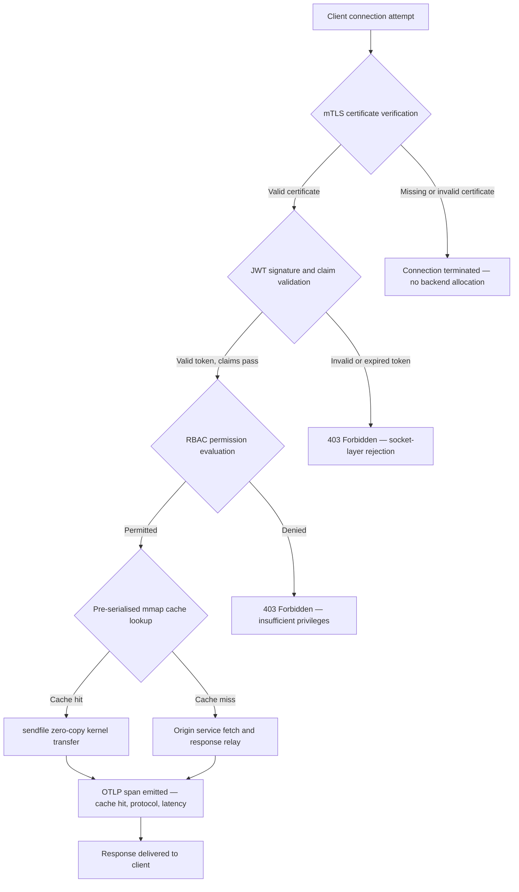

---

# Front Matter (YAML)

author: "contact@sebastienrousseau.com (Sebastien Rousseau)"
banner_alt: "Irisi ilu àkàrà-ìmọ̀ lóru lórí pẹpẹ iyika — fíhàn ìbẹ̀rẹ̀ bankì níbi tí gbigbe zero-copy nívẹ̀ kernel, awọn itẹwọ mTLS àti ìmúdájú JWT pàdé ní faili binary kan tí a so pọ̀ ni ìpépe"
banner_height: "1597"
banner_width: "2584"
banner: "https://cloudcdn.pro/stocks/images/bit-cloud-GlqbGLCPnQ4.webp"
cdn: "https://cloudcdn.pro"
charset: "UTF-8"
cname: "sebastienrousseau.com"
copyright: "© Copyright 2025 - 2026 - Sebastien Rousseau. All rights reserved."
date: "June 20, 2026"
description: "http-handle jẹ faili binary Rust tí a so pọ̀ ni ìpépe tí ó pèsè awọn ìbéèrè 180,000 fún ìṣẹ́jú kan ní ìbẹ̀rẹ̀ bankì pẹ̀lú ọfin gbára akókò ìṣiṣẹ́ ofo, ìmúdájú mTLS àti JWT tí a dapọ̀ mọ́, HTTP/2 àti HTTP/3 tí a dárò nípasẹ̀ ALPN àti akiyesi OTLP — títí àwọn àláfíà àti ailagbara tí Nginx àti Envoy fi sílẹ̀."
format-detection: "telephone=no"
hreflang: "yo"
icon: "https://cloudcdn.pro/clients/sebastienrousseau/v1/logos/sebastienrousseau.svg"
id: "https://sebastienrousseau.com/2026-06-20-http-handle-zero-dependency-edge-ingress-banking-rust-2026"
image_alt: "Àwòrán dúdú àti funfun ti Sebastien Rousseau"
image_height: "162"
image_width: "162"
image: "https://cloudcdn.pro/stocks/images/sebastien-rousseau.png"
keywords: "http-handle, Rust edge ingress, proxy laisi gbára, àkúnya bankì, mTLS JWT, sendfile zero-copy, ALPN HTTP3, ìbámu DORA, Basel III, akiyesi OTLP, binary ìpépe, ARM64 bankì, zero trust bankì, ingress ìwúwo kékeré, aabo bankì Rust"
language: "yo-NG"
last_reviewed: "2026-06-20"
layout: "report"
locale: "yo_NG"
logo_alt: "Àmì tí Sebastien Rousseau"
logo_height: "44"
logo_width: "44"
logo: "https://cloudcdn.pro/clients/sebastienrousseau/v1/logos/sebastienrousseau.svg"
menu: ""
measurementID: "G-169G4ET5HQ"
name: "Sebastien Rousseau"
permalink: "https://sebastienrousseau.com/2026-06-20-http-handle-zero-dependency-edge-ingress-banking-rust-2026"
rating: "general"
referrer: "no-referrer"
robots: "index, follow"
schema: "FAQPage, Article"
seo_title: "http-handle: Rust Ingress Laisi Gbára fún Bankì ní 180k ìbéèrè/s"
short_name: "sebastienrousseau"
subtitle: "Bí faili binary Rust kan tí a so pọ̀ ni ìpépe ṣe pèsè awọn ìbéèrè 180,000 fún ìṣẹ́jú kan pẹ̀lú mTLS, JWT àti ALPN ní ìbẹ̀rẹ̀ bankì — àti ohun tí ó túmọ̀ sí fún ìbámu pẹ̀lú DORA àti Basel III."
tags: "http-handle, Rust, banking, edge-ingress, mTLS, JWT, ALPN, HTTP3, DORA, Basel-III, zero-copy, sendfile, ARM64, zero-trust, OTLP, observability, open-source, infrastructure"
theme-color: "0, 83, 191"
title: "http-handle: Edge Ingress Ìṣẹ́ Gíga Laisi Gbára fún Bankì ní 2026"
url: "https://sebastienrousseau.com/2026-06-20-http-handle-zero-dependency-edge-ingress-banking-rust-2026"
viewport: "width=device-width, initial-scale=1, shrink-to-fit=no"

# RSS - The RSS feed front matter (YAML).
atom_link: "https://sebastienrousseau.com/2026-06-20-http-handle-zero-dependency-edge-ingress-banking-rust-2026/rss.xml"
category: "Technology"
docs: https://validator.w3.org/feed/docs/rss2.html
generator: "Static Site Generator (SSG) (version 0.0.40)"
item_description: "http-handle jẹ faili binary Rust tí a so pọ̀ ni ìpépe tí ó pèsè awọn ìbéèrè 180,000 fún ìṣẹ́jú kan ní ìbẹ̀rẹ̀ bankì pẹ̀lú ọfin gbára akókò ìṣiṣẹ́ ofo, ìmúdájú mTLS àti JWT tí a dapọ̀ mọ́, HTTP/2 àti HTTP/3 tí a dárò nípasẹ̀ ALPN àti akiyesi OTLP — títí àwọn àláfíà àti ailagbara tí Nginx àti Envoy fi sílẹ̀."
item_guid: "https://sebastienrousseau.com/2026-06-20-http-handle-zero-dependency-edge-ingress-banking-rust-2026/rss.xml"
item_link: "https://sebastienrousseau.com/2026-06-20-http-handle-zero-dependency-edge-ingress-banking-rust-2026/rss.xml"
item_pub_date: "Sat, 20 Jun 2026 07:07:07 +0000"
item_title: "http-handle: Edge Ingress Ìṣẹ́ Gíga Laisi Gbára fún Bankì ní 2026"
last_build_date: "Sat, 20 Jun 2026 07:07:07 +0000"
managing_editor: "contact@sebastienrousseau.com (Sebastien Rousseau)"
pub_date: "Sat, 20 Jun 2026 07:07:07 +0000"
ttl: "60"
type: "article"
webmaster: "contact@sebastienrousseau.com"

# Apple - The Apple front matter (YAML).
apple_mobile_web_app_orientations: "portrait"
apple_touch_icon_sizes: "192x192"
apple-mobile-web-app-capable: "yes"
apple-mobile-web-app-status-bar-inset: "black"
apple-mobile-web-app-status-bar-style: "black-translucent"
apple-mobile-web-app-title: "Ìbẹ̀rẹ̀ Bankì Laisi Gbára"
apple-touch-fullscreen: "yes"

# MS Application - The MS Application front matter (YAML).

msapplication-navbutton-color: "0, 83, 191"

# Twitter Card - The Twitter Card front matter (YAML).

twitter_card: "summary_large_image"
twitter_creator: "@wwdseb"
twitter_description: "http-handle jẹ faili binary Rust tí a so pọ̀ ni ìpépe tí ó pèsè awọn ìbéèrè 180,000 fún ìṣẹ́jú kan ní ìbẹ̀rẹ̀ bankì pẹ̀lú ọfin gbára akókò ìṣiṣẹ́ ofo, mTLS, JWT àti akiyesi OTLP."
twitter_image: "https://cloudcdn.pro/clients/sebastienrousseau/v1/logos/sebastienrousseau.svg"
twitter_image_alt: "Logo of Sebastien Rousseau"
twitter_site: "@wwdseb"
twitter_title: "http-handle: Rust Ingress Laisi Gbára fún Bankì ní 180k ìbéèrè/s"
twitter_url: "https://sebastienrousseau.com/2026-06-20-http-handle-zero-dependency-edge-ingress-banking-rust-2026"

# Humans.txt - The Humans.txt front matter (YAML).
author_website: "https://sebastienrousseau.com"
author_twitter: "@wwdseb"
author_location: "London, UK"
thanks: "Thanks for reading!"
site_last_updated: "2026-06-20"
site_standards: "HTML5, CSS3, RSS, Atom, JSON, XML, YAML, Markdown, TOML"
site_components: "Kaishi, Kaishi Builder, Kaishi CLI, Kaishi Templates, Kaishi Themes"
site_software: "Static Site Generator, Rust"

---

# http-handle: Edge Ingress Ìṣẹ́ Gíga Laisi Gbára fún Bankì ní 2026

<!-- lead-start -->
<aside class="post-lead" aria-label="Àkópọ̀ ọrọ">

<strong>TL;DR.</strong> http-handle jẹ faili binary Rust orísun ìṣí tí a so pọ̀ ni ìpépe tí ó rọ́pò Nginx àti Envoy ní ìbẹ̀rẹ̀ bankì. Ó pèsè awọn ìbéèrè 180,000 fún ìṣẹ́jú kan lórí awọn ìdènà ARM64 nípasẹ̀ gbigbe zero-copy <code>sendfile(2)</code> ti Linux, ṣe agbékalẹ̀ mTLS àti ìmúdájú JWT ní ìpele socket nẹ́tíwọọkì ṣáájú kí koodu ohun èlò kankan ṣiṣẹ́, dárò HTTP/2 àti HTTP/3 laifọwọ́yi nípasẹ̀ ALPN àti ó ṣe àgbékalẹ̀ awọn wíwọn OpenTelemetry ní ìpamọ́ — gbogbo rẹ̀ pẹ̀lú ọfin gbára akókò ìṣiṣẹ́ ofo ju <code>libc</code> lọ.

<strong>Àwọn ìpínlẹ̀ pàtàkì</strong>

<ul class="post-lead-takeaways">
  <li><strong>Ìṣòro proxy ìwúwo.</strong> Nginx àti Envoy gbé igi gbára tí ó fẹ̀ dídì ìhà CVE àti tí ó mú àwọn ìyípadà àtúnṣe ewu ICT DORA nira.</li>
  <li><strong>Ìṣẹ́ zero-copy ní ìwọ̀n ńlá.</strong> Àwọn ìṣọ̀tọ̀ kàànà mmap tí a ṣe tẹ́lẹ̀ àti gbigbe kernel <code>sendfile(2)</code> ṣe ìdárí 180,000 ìbéèrè/s lórí ARM64 pẹ̀lú ọpọ̀ proxy tí ó kéré ju ìṣẹ́jú àáàyá kan lọ.</li>
  <li><strong>Aabo ní socket, kì í ṣe ohun èlò.</strong> Ìmúdájú ìwé-ẹ̀rí àgbàlámù mTLS, ìmúdájú JWT àti ìgbẹ́jọ́ RBAC parí ṣáájú kí àkúnya backend kankan tó di ìpín fún ìbéèrè náà.</li>
  <li><strong>Ìbámu ìlànà tí a dapọ̀ mọ́.</strong> Dídì ìhà ìkọlù tí ó dinku àti ìfilọ́ binary ẹyọkan tí a lè ṣàyẹ̀wò dáa sọ̀rọ̀ taarata sí Àwọn Abala 5 àti 6 DORA, ewu àdáni Basel III àti awọn ẹwọn ojúsàájú SM&CR.</li>
</ul>

<strong>Kíkà tó jọmọ:</strong> <a href="https://sebastienrousseau.com/2026-06-18-noyalib-safe-yaml-rust-ai-mcp-financial-infrastructure-2026">Idi tí YAML Fi Nílò Ìpọ̀n Rust Aláìléwu Sii fún AI, MCP àti Àkúnya Àwọn Ìṣẹ́ Owo ní 2026</a>, <a href="https://sebastienrousseau.com/2026-06-11-cloudcdn-open-source-blueprint-ai-native-edge-2026">CloudCDN: Ìlànà Orísun Ìṣí fún AI-Native Edge ní 2026</a>, <a href="https://sebastienrousseau.com/2026-05-16-best-cloud-infrastructure-architecture-2026">Àkúnya Àwùjọ Àwọsánmà Tó Dára Jùlọ fún Àwọn Bankì àti Àwọn Ilé Iṣẹ́ Owo ní 2026</a>.

</aside>
<!-- lead-end -->

Ìbẹ̀rẹ̀ bankì ní ìṣòro gbára. Gbogbo ẹ̀dà Nginx tàbí Envoy tí ó ń darí ìrìn-àjò laarin àgbàlámò àti iṣẹ́ bankì àárọ̀ gbé igi gbára: àwọn ìkọ́ OpenSSL, awọn ìpele Lua, awọn ikawe gRPC àti awọn ìpele àpò — ọ̀kọ̀ọ̀kan jẹ CVE tó ṣeéṣe, ọ̀kọ̀ọ̀kan nílò iyipo ìtúnṣe pàtó, ọ̀kọ̀ọ̀kan ń ṣàfikún ìyípadà àìdédé tí ó mú ìwọ̀nwọ̀n SLA nira. Lábẹ̀ [Òfin Àgbára Àdáni Ìṣiṣẹ́ Orí Ẹ̀rọ (DORA)](https://eur-lex.europa.eu/eli/reg/2022/2554/oj), ìdíjú yẹn jẹ ojúsàájú ìlànà báyìí pẹ̀lú ojúsàájú àdáni.

[http-handle](https://github.com/sebastienrousseau/http-handle) gba ọ̀nà tó yàtọ̀. Ó jẹ faili binary Rust ẹyọkan tí a so pọ̀ ni ìpépe pẹ̀lú ọfin gbára akókò ìṣiṣẹ́ ju `libc` lọ. Ó pèsè awọn ìbéèrè 180,000 fún ìṣẹ́jú kan lórí awọn ìdènà ARM64, ṣe agbékalẹ̀ TLS apapọ̀ àti ìmúdájú JWT ní ìpele socket nẹ́tíwọọkì, àti dárò HTTP/2 àti HTTP/3 laifọwọ́yi — gbogbo rẹ̀ nínú irú ìfilọ́ tí ó kéré ju 20 MB RAM lọ.

## Ìdáhùn kíákíá

**Kí ni http-handle ní gbolohun kan?** http-handle jẹ faili binary Rust orísun ìṣí tí a so pọ̀ ni ìpépe tí ó rọ́pò awọn àpò proxy ìwúwo ní ìbẹ̀rẹ̀ bankì, tí ó pèsè 180,000 ìbéèrè/s lórí ARM64 nípasẹ̀ gbigbe kernel zero-copy `sendfile(2)` ti Linux, tí ó ṣe agbékalẹ̀ mTLS, JWT àti RBAC ní ìpele socket ṣáájú kí àkúnya backend kankan tó fọwọ́kàn, àti tí ó ṣe àgbékalẹ̀ awọn wíwọn [OpenTelemetry](https://opentelemetry.io/) ní ìpamọ́ — pẹ̀lú ọfin gbára ikawe akókò ìṣiṣẹ́ ju `libc` lọ.

## Àkópọ̀ fún ìjọba

Àwọn bankì ti lo Nginx àti Envoy ní ìbẹ̀rẹ̀ wọn fún ọdún mẹ́wàá. Méjèèjì ní agbára; kò sí ẹni tí a ṣe apẹrẹ fún àyíká ìlànà ti 2026. Àwọn àwòrán àpò tí ó kún fún gbára ṣe àgbékalẹ̀ awọn ìtòlẹ́sẹẹsẹ CVE tí àwọn ẹgbẹ́ ìbámu kò lè pa rẹ̀ kánkán tó, àti gbogbo ìmúdájú àtúnṣe ikawe ń gbé ewu ìpòsí. Àwọn Abala 5 àti 6 DORA béèrè pé ewu ICT ni a ṣàkóso nípasẹ̀ àpẹrẹ, kii ṣe ìtúnṣe lẹ́yìn ìwádìí. Àwọn ìlànà ewu àdáni Basel III jẹ ìjìyà fún àwọn àkúnya níbi tí àwọn ojúpọ̀ kùdàrò ń pọ̀ sí i pẹ̀lú ìdíjú ètò.

http-handle pa ìṣòro gbára run ní orísun rẹ̀. A ṣe àkójọpọ̀ binary ẹẹkan, ni ìpépe, láìsí àwọn àgbèrò ikawe òde ní akókò ìṣiṣẹ́. Dídì ìhà ìkọlù dín kù sí ikawe ìpilẹ̀ṣẹ̀ Rust àti `libc`. Ìmúṣẹ aabo — ìmúdájú ìwé-ẹ̀rí mTLS, ìmúdájú ẹtọ̀ JWT àti ìkóra-ẹni-laarin tí ó dá lórí ipa — ṣiṣẹ́ ní socket nẹ́tíwọọkì ṣáájú ipin backend kankan, tí ó ń mú ààlà Zero Trust kún sí ìdálẹ̀ tó ṣeéṣe jùlọ. Ìṣẹ́ tẹ̀lé ìkọ́: àwọn ìṣọ̀tọ̀ kàànà tí a ṣe tẹ́lẹ̀ tí a ṣàdàkọ sínú ìrántí dapọ̀ pẹ̀lú gbigbe kernel `sendfile(2)` yọ dátà kúrò ní ọ̀nà ẹ̀dà CPU-sí-ìrántí pátápátá, tí ó ń ṣe ìdárí 180,000 ìbéèrè/s lórí ohun elo ARM64. Àbájáde jẹ ìpele ingress tí ó ní ìtẹ́lọ́rùn pẹ̀lú àwọn àgbèrò àgbára DORA, ìtìlẹ́yìn àwọn ariyanjiyan idinku ewu àdáni Basel III, àti fún àwọn aṣáájú IT àgbà ní abẹ SM&CR ẹwọn ojúsàájú kan tí a lè ṣàyẹ̀wò, ọ̀kan-nínú-ẹyọkan fún àkúnya ìbẹ̀rẹ̀.

## Àwọn ìpínlẹ̀ pàtàkì

- **Binary kékeré, ìtòlẹ́sẹẹsẹ CVE kékeré.** Binary ẹyọkan tí a so pọ̀ ni ìpépe ní àkójọ kan láti ṣe ìtúnṣe, ìfilọ́ kan láti jẹrisi, àti ohun-ìní kan láti ṣàyẹ̀wò. Nginx pẹ̀lú ìpín ìpele ìpéye ìlànà gbé pẹ̀lú gbára ikawe tí a pín jù 30 lọ; ọ̀kọ̀ọ̀kan gbé ìgbésí-ayé ìfaragbà tiwọn.
- **Zero-copy kì í ṣe ìlọsíwájú — ó jẹ ìdíwọ̀n àpẹrẹ.** Ní 180,000 ìbéèrè/s, ẹ̀dà dátà kankan nínú àyè olùmúlò ń ṣe ìyípadà àìdédé tí a lè wọ̀n. `sendfile(2)` gbé àkóónú olùpínpín fáìlì sí socket nẹ́tíwọọkì pátápátá nínú àyè kernel. Pàpọ̀ pẹ̀lú àwọn ìṣọ̀tọ̀ kàànà ìdáhùn tí a fi mmap mú, CPU kò fọwọ́kàn ọ̀nà dátà fún àwọn ìdáhùn tí a tọ́jú.
- **Ààlà aabo jẹ ti socket.** Ìmúdájú JWT àti ìwé-ẹ̀rí mTLS nínú middleware ohun èlò túmọ̀ sí pé backend ti pin ìwọ̀n àti ìrántí tẹ́lẹ̀ ṣáájú kí wọ́n kọ ìbéèrè náà. Ìmúdájú ìpele socket ṣe ìdánilójú pé àwọn ìbéèrè tí a kò mọ̀ wọ̀n kò lo àkúnya backend rárá.
- **OTLP pa àlàfo akiyesi run.** Ìṣọpọ̀ OpenTelemetry ìpamọ́ túmọ̀ sí pé gbogbo ìbéèrè, gbogbo ìpinnu ìmúdájú, àti gbogbo ìdárò ìlànà ṣe àgbékalẹ̀ telemetry tí a ṣeto láìsí aṣojú sidecar. Àwọn pẹpẹ bankì tí wọ́n wà tẹ́lẹ̀ gbà awọn ìtọpathọ OTLP taarata.

**Kíkà tó jọmọ:** [Idi tí YAML Fi Nílò Ìpọ̀n Rust Aláìléwu Sii fún AI, MCP àti Àkúnya Àwọn Ìṣẹ́ Owo ní 2026](https://sebastienrousseau.com/2026-06-18-noyalib-safe-yaml-rust-ai-mcp-financial-infrastructure-2026/), [CloudCDN: Ìlànà Orísun Ìṣí fún AI-Native Edge ní 2026](https://sebastienrousseau.com/2026-06-11-cloudcdn-open-source-blueprint-ai-native-edge-2026/), [Àkúnya Àwùjọ Àwọsánmà Tó Dára Jùlọ fún Àwọn Bankì àti Àwọn Ilé Iṣẹ́ Owo ní 2026](https://sebastienrousseau.com/2026-05-16-best-cloud-infrastructure-architecture-2026/).

## 01. Ìṣòro Proxy Ìwúwo nínú Bankì

Nginx àti Envoy kọ́ ìbẹ̀rẹ̀ Íńtánẹ́ẹ̀tì ìgbàlódé. Wọ́n ṣe àmúyẹ, a ti ṣàdánwò wọn lójú ogun, àti àwọn àwùjọ ńlá ń ṣe àtìlẹ́yìn wọn. Wọ́n tún jẹ àwọn yíyàn ìkọ́ tí a ṣe ṣáájú kí DORA tó wà, ṣáájú kí àwọn ìlànà ewu àdáni Basel III tó béèrè ìdinku ìdíjú tí a lè wọ̀n, àti ṣáájú kí àwọn ìdènà àwọsánmà ARM64 tó yí ọrọ̀-ajé ti ìṣiro ìlọjẹ gíga padà.

Àbájáde tó jẹ àṣà ni àlàfo laarin ohun tí àwọn bankì nílò àti ohun tí àwọn àpò proxy ìwúwo pèsè.

**Dídì ìhà gbára.** Ìfilọ́ Envoy ìpéye fa OpenSSL, Abseil, Protobuf, gRPC, Lua àti àwọn ikawe àárọ̀ lọ̀pọ̀lọ̀pọ̀. Ọ̀kọ̀ọ̀kan gbé ìgbésí-ayé CVE ọ̀tọ̀ọ̀tọ̀. Nígbà tí National Vulnerability Database ṣe àtẹ̀jáde ìtọ́sọ́nà OpenSSL pàtàkì, gbogbo ẹ̀dà Envoy nínú ohun-ìní di àago ìbámu: ṣe àyẹ̀wò, ṣe ìtúnṣe, ṣàdánwò, tún fi ọwọ́ rọ̀ yẹ̀, àti tún ṣe ìwé-ẹ̀rí — nínú gbogbo àyíká níbi tí binary ń ṣiṣẹ́. Lábẹ̀ Abala 6 DORA, àwọn bankì gbọdọ̀ fi hàn pé àwọn ìlànà ìṣàkóso ewu ICT jẹ dọ́gba, tí a ṣàkọsílẹ̀, àti tí a lè ṣàyẹ̀wò. Igi gbára ikawe ọ̀pọ̀lọpọ̀ mú ìfihàn yẹn jẹ gbowó láti ṣe ìtọ́jú.

**Ìwọ̀n ìrántí tí ó pọ̀ jù.** Ìlànà ìṣiṣẹ́ Nginx tí a ṣe àmúyẹ ni ìkéde gbà ìrántí tí ó wà ní ìwọ̀n 40–80 MB lábẹ̀ ẹrù àárín. Ní ìwọ̀n ńlá — àwọn ìdènà ingress lọ̀pọ̀lọ̀pọ̀ ní àwọn ètò ìsòwò, àwọn API ìsanwó, àti àwọn ìbọwọ fún àwọn àgbàlámò — àfikún yẹn ń ṣe àkójọpọ̀ bí ìdiyèlé àkúnya tí a lè wọ̀n láìsí àǹfàní ìṣẹ́ tó báramu lórí yíyàn binary ẹyọkan tí a ṣe apẹrẹ dáadáa.

**Ìdóko ìtúnṣe.** Àwọn ẹ̀wọ̀n ìfọnniṣowo àwòrán àpò ṣe ìmúdásí àìdédé ọjọ́ lọ́pọ̀lọ̀pọ̀ laarin ìtẹ̀jáde CVE àti ìtúnṣe tí a fọwọ́ sí tí ó dé ìmú iṣẹ́. Àwòrán ìpìlẹ̀ gbọdọ̀ tún kọ́, ìpele ohun èlò gbọdọ̀ tún jọ, mẹ́trìkì ìdánwò kíkún gbọdọ̀ tún ṣiṣẹ́, àti ipa ìfilọ́ gbọdọ̀ tún ṣiṣẹ́. Fún àwọn ètò bankì pàtàkì tí wọ́n ń ṣiṣẹ́ lábẹ̀ àwọn fèrèsé ìjábọ̀ àṣìṣe DORA, iyipo yìí jẹ ewu ìkọ́.

http-handle sọ àwọn mẹ́tẹ̀ẹ̀ta dáradára. Binary kan. Dídì ìhà CVE kan. Ohun-ìní kan láti ṣe ìtúnṣe. Kéré ju 20 MB RAM fún ìdènà ingress ìmú iṣẹ́.

## 02. Lẹ̀nsì Ìkọ́ http-handle 2026

A ṣe àmúyẹ binary gẹ́gẹ́ bí àwọn ipele marun tí wọ́n gbára ara wọn, ọ̀kọ̀ọ̀kan jẹ apẹrẹ láti pa àkójọ ewu pàtó run tí àwọn ìkọ́ proxy ìbáṣepọ̀ ń ṣe.

### Tábìlì 1: Àwọn ipele ìkọ́ http-handle àti ìdinku ewu

| Ìpele | Ìpinnu àpẹrẹ | Idi tí ó ṣe pàtàkì | Ewu tí kò bá ṣe àkóso dáadáa |
| ---- | ---- | ---- | ---- |
| **Ìpilẹ̀ọba ẹ̀rọ** | Binary Rust ẹyọkan, tí a so pọ̀ ni ìpépe, ọfin gbára ju `libc` lọ | Ohun-ìní kan láti ṣe ìtúnṣe; pa ìtànkálẹ̀ CVE ikawe kúrò nínú ohun-ìní | Àwọn ìkọlù ìdàrúdàpọ̀ gbára; àkójọpọ̀ ìfaragbà ikawe |
| **Ẹ̀rọ ìmúlẹ̀ àsọdùn** | Àwọn ìṣọ̀tọ̀ kàànà mmap tí a ṣe tẹ́lẹ̀ àti gbigbe kernel zero-copy `sendfile(2)` | 180,000 ìbéèrè/s lórí ARM64 pẹ̀lú ọpọ̀ proxy kéréje ìṣẹ́jú àáàyá; kò sí dátà tí ó wọ àyè olùmúlò fún àwọn ìdáhùn tí a tọ́jú | Ahọn ìmápa ìrántí; àwọn àhàmọ̀ àyè kernel lábẹ̀ ìgbèlágbà kàànà |
| **Aabo ìdarí asírí** | mTLS ìpamọ́ pẹ̀lú àtìlẹ́yìn ìtẹ̀jáde ìwé-ẹ̀rí gbígbóná àti ìdárò ALPN | Ṣe ìdánilójú ìwọ̀ntúnwọ̀nsì dátà àti ìbáamu ìlànà; ìrọ́pò ìwé-ẹ̀rí láìsí sisílẹ̀ àwọn ìsopọ̀ | Pàádì ìwé-ẹ̀rí tí ó ń fà ìdáwọ̀ iṣẹ́; àwọn ìpéye akojọ cipher tí ó sàìsàn |
| **Pẹ̀pẹ̀ ìlànà ọ̀nà gbigba** | Ìmúdájú JWT ìpele socket àti ìgbẹ́jọ́ ẹtọ̀ RBAC | Àwọn ìbéèrè tí a kò mọ̀ wọ̀n kò lo àkúnya backend; Zero Trust gbékalẹ̀ ní ààlà kernel | Àwọn ìkọlù ìdàrúdàpọ̀ àlùfẹ́ JWT; àṣiṣe ìtò RBAC tí ó ń fún ọ̀nà gbigba tí ó pọ̀ jù |
| **Akiyesi** | Ìṣọpọ̀ [OpenTelemetry (OTLP)](https://opentelemetry.io/docs/specs/otlp/) ìpamọ́ | Telemetry ìgbékọ̀ láìsí aṣojú sidecar; gbigba taarata sínú àwọn ohun-ìní ìgbéjẹ́ bankì tí wọ́n wà tẹ́lẹ̀ | Àwọn ojúpọ̀ afọju nígbà àìṣiṣẹ́; àwọn ìtọpathọ ìgbádánilójú tí kò pé fún ìjábọ̀ àṣìṣe DORA |

## 03. Àwọn Àmì Ìṣẹ́ àti Aabo Pàtàkì

Àwọn bankì tí wọ́n ń ṣe http-handle ní ìbẹ̀rẹ̀ gbọdọ̀ ṣe ohun èlò fún àwọn àmì marun tí a lè wọ̀n láti ní ìtẹ́lọ́rùn pẹ̀lú àwọn àgbèrò ìjábọ̀ àdáni DORA àti ìṣàkóso SLA ìjọba.

### Tábìlì 2: Àwọn ìwọ̀n ìṣẹ́ àdáni àti àwọn ìtọ́kasí ìlànà

| Àmì | Ìwọ̀n | Ìtọ́kasí ìlànà | Ìmúṣẹ ìmọ̀-ẹ̀rọ |
| ---- | ---- | ---- | ---- |
| **Ìmúdà-ọ̀rọ̀** | ≥ 180,000 ìbéèrè/s lórí àwọn ìdènà ARM64 ní P99 ≤ 1 ms ọpọ̀ proxy | Ewu àdáni Basel III — ìdinku ìdíjú ètò | `sendfile(2)` + àwọn ìṣọ̀tọ̀ kàànà mmap tí a ṣe tẹ́lẹ̀; kò sí ẹ̀dà dátà àyè olùmúlò fún àwọn ìkọlù kàànà |
| **Dídì ìhà ìkọlù** | Ọfin gbára ikawe akókò ìṣiṣẹ́; binary ohun-ìní kan fún ìfilọ́ | [Abala 6 DORA](https://eur-lex.europa.eu/eli/reg/2022/2554/oj) — ìṣàkóso ewu ICT nípasẹ̀ àpẹrẹ | Àkójọpọ̀ ìpépe pẹ̀lú `cargo build --release --target aarch64-unknown-linux-musl` |
| **Àìdédé ìmúdájú** | Ìtẹwọ mTLS + ìmúdájú JWT parí ṣáájú bèbèrè àkọ́kọ́ ìdáhùn backend | [Abala 5 DORA](https://eur-lex.europa.eu/eli/reg/2022/2554/oj) — ìdáàbò aabo ICT | Ìgbógun ìpele socket; ìgbẹ́jọ́ ẹtọ̀ JWT nínú Rust tó jẹ àdúgbò kernel ṣáájú ìdarí backend |
| **Àwáláyé ìwé-ẹ̀rí** | Ìtẹ̀jáde gbígbóná ti àwọn ìwé-ẹ̀rí mTLS pẹ̀lú ọfin sisílẹ̀ àwọn ìsopọ̀ nígbà ìyípadà | Ojúsàájú ìṣàkóso àgbà SM&CR fún àwáláyé ìbẹ̀rẹ̀ | Olùmọ̀ ìwé-ẹ̀rí tí a ṣe nípasẹ̀ inotify; ìpaarọ̀ atomiki olùpínpín fáìlì nígbà ìtẹ̀jáde |
| **Ìbò akiyesi** | 100% àwọn ìbéèrè tí ó ṣe àgbékalẹ̀ awọn span OTLP pẹ̀lú àbájáde ìmúdájú, àtúnṣe ìlànà àti ipo kàànà | Abala 17 DORA — ìwádìí àṣìṣe àti ìjábọ̀ | Olùtẹ̀jáde OTLP ìpamọ́; kò sí sidecar tí a nílò; gRPC tàbí gbigbe HTTP/Protobuf tí a lè ṣàmúyẹ |

## 04. Ẹ̀rọ Zero-Copy: mmap àti sendfile(2)

Ìṣẹ́ nẹ́tíwọọkì nínú bankì ìgbédègbẹ́ — àwọn ìsanwó àkókò gidi, àwọn API dátà ọjà, àwọn iṣẹ́ àmì ìmúdájú — ni a díwọ̀n nípasẹ̀ àlàkòóso kan jù àwọn mìíràn lọ: ìdiyèlé gbigbe awọn bèbèrè lati ìpamọ sí socket nẹ́tíwọọkì.

Àwọn ẹ̀rọ HTTP ìbáṣepọ̀ ka àkóónú fáìlì sínú ìpamọ àyè olùmúlò, lẹ́yìn náà wọ́n kọ ìpamọ yẹn sí socket. Ìtòlẹ́sẹẹsẹ yẹn nílò ẹ̀dà ìrántí meji àti ìpàṣọ̀ ọ̀rọ̀ meji laarin àyè olùmúlò àti àyè kernel fún gbogbo ìdáhùn. Ní 180,000 ìbéèrè fún ìṣẹ́jú kan, àkójọpọ̀ ọpọ̀ ṣe pàtàkì.

http-handle pa ẹ̀dà méjèéjì run.

**Àwọn ìṣọ̀tọ̀ kàànà tí a ṣàdàkọ sínú ìrántí.** Nígbà tí iṣẹ́ bẹ̀rẹ̀, ó ṣe ìtòlẹ́sẹẹsẹ àkóónú ìdáhùn ìpépe sínú àwọn ìmọ̀ tí a ṣàdàkọ sínú ìrántí nípasẹ̀ `mmap(2)`. A ti fi àwọn ìmọ̀ wọ̀nyí pamọ́ sínú kàànà ojúewé kernel. Nígbà tí ìbéèrè dé fún àkúnya tí a tọ́jú, ìdáhùn ti ṣàdàkọ tẹ́lẹ̀ sínú ìrántí kernel — kò sí kíka disiki, kò sí ipin ìpamọ.

**Gbigbe kernel `sendfile(2)`.** Ìpèpè ètò Linux `sendfile(2)` gbé dátà taarata lati olùpínpín fáìlì kan — tàbí ìmọ̀ tí a ṣàdàkọ sínú ìrántí — sí olùpínpín fáìlì socket nẹ́tíwọọkì, pátápátá nínú kernel. Kò sí bèbèrè tí ó wọ àyè olùmúlò. Ipa CPU dín kù sí pípèsè ìpèpè ètò àti ìmúdarí ẹ̀kọ́ píparí. Lórí àwọn ìdènà ARM64 pẹ̀lú ìkọ́ yìí, http-handle ṣe ìdárí 180,000 ìbéèrè/s ní ọpọ̀ proxy tí ó kéré ju ìṣẹ́jú àáàyá lọ lábẹ̀ ẹrù tí ó tẹ̀síwájú.

Fún àwọn bankì tí ó ń ṣe ìṣọ̀kan ìpín-oṣù ìparí oṣù, ìjábọ̀ omi tí ó wà nínú ọjọ̀ kan, tàbí ìrìn-àjò API ìtọ́sọ́nà ẹ̀tàn àkókò gidi, àbájáde ẹ̀rọ jẹ taarata: àwọn ìdènà ARM64 kékeré fún ìpele ìrìn-àjò, ìdiyèlé àkúnya kékeré, àti ewu àgbára DORA kékeré lati àìní agbára.

## 05. Pẹ̀pẹ̀ Ìlànà Ọ̀nà Gbigba mTLS àti JWT

Nínú bankì, ìmúdájú ní ìbẹ̀rẹ̀ kì í ṣe ẹ̀yà — ó jẹ àgbèrò ìlànà. DORA béèrè pé àwọn ìdènà aabo ICT jẹ dọ́gba, tí a ṣàkọsílẹ̀, àti tí a lè ṣàyẹ̀wò. SM&CR fi ojúsàájú tara sí àwọn ìpinnu aabo àkúnya lé àwọn olùṣàkóso àgbà tí a dárúkọ wọn. Ìbéèrè náà kì í ṣe bóyá à ó ṣe ìmúdájú ní ìbẹ̀rẹ̀, ṣùgbọ́n ní ìpele wo.

http-handle ṣe agbékalẹ̀ ìlànà Zero Trust onísele-mẹ́ta ṣáájú kí àkúnya backend kankan tó di ìpín.

**Ìpele 1: Ìmúdájú ìwé-ẹ̀rí àgbàlámò mTLS.** Nígbà àwọn ìtẹwọ TLS, http-handle béèrè àti ṣàyẹ̀wò ìwé-ẹ̀rí àgbàlámò lé àpẹẹrẹ ìgbẹ́kẹ̀lé tí a lè ṣàmúyẹ. Àwọn ìsopọ̀ tí kò ní ìwé-ẹ̀rí tí ó wulo parí ní àwọn ìtẹwọ. Kò sí ìwọ̀n ohun èlò tí a ṣẹ̀dá, kò sí adágún ìrántí tí a pin. Backend kò rí ìbéèrè rárá.

**Ìpele 2: Ìmúdájú ẹtọ̀ JWT.** Fún àwọn ìsopọ̀ tí ó já mTLS, http-handle yọ àti ṣàyẹ̀wò JSON Web Token lati orísun `Authorization` ní ìpele socket. Ìmúdájú àbọwọ́-àmì, àwọn ìṣàyẹ̀wò pàrí, àti ìmúdájú olùgbéjáde wáyé ṣáájú kí ìbéèrè náà tó dé ìpele ìdarí. Àwọn ìkọlù ìdàrúdàpọ̀ àlùfẹ́ — níbi tí ẹ̀rọ gbà àlùfẹ́ aláṣepọ̀ nígbà tí wọ́n retí bọ́tìní aláṣeyọọ — ni a dínà nípasẹ̀ àtòkọ gbigba àlùfẹ́ tí a ṣe gbangba nínú ìtò.

**Ìpele 3: Ìgbẹ́jọ́ ẹtọ̀ RBAC.** Àwọn ẹtọ̀ JWT tí a ṣàyẹ̀wò ṣàdàkọ sínú tábìlì ipa nínú ìrántí. Àwọn ìbéèrè tí wọ́n ní àwọn ẹ̀tọ̀ tí kò tó gba ìdáhùn 403 ní pẹ̀pẹ̀ ìlànà ọ̀nà gbigba. A kò pè iṣẹ́ backend rárá fún ìrìn-àjò tí kò gba àṣẹ.

Ìtòlẹ́sẹẹsẹ yìí ṣe pàtàkì ní ọ̀nà àdáni. Lábẹ̀ àwòrán ìbáṣepọ̀ — níbi tí ìmúdájú ń ṣiṣẹ́ nínú middleware ohun èlò — olùkọlù lè pa awọn adágún ìwọ̀n backend run pẹ̀lú àwọn ìbéèrè tí a kò mọ̀ wọ̀n ṣáájú kí kíkọ́ ẹyọkan tó jáde. Ìmúdájú ìpele socket tutù ọ̀nà ìkọlù yẹn pátápátá.

## 06. Ìdarí ALPN àti Ẹ̀wọ̀n Ìpadà HTTP/3

Ìrìn-àjò bankì wá ní àwọn ipò nẹ́tíwọọkì oríṣiríṣi: okun ìmọ̀lé ilé-iṣẹ́ fún àwọn tábìlì ìsòwò, 5G fún àwọn àgbàlámò bankì alágbèéká, ìsopọ̀ satẹ́ẹ̀lì fún àwọn iṣẹ́ jíjìnnà, àti àwọn proxy ìgbógun TLS ní àwọn àyíká tí a ṣàkóso. Ingress ìlànà kan ṣẹ̀dá ìdíwọ̀n ipin ti o kere julọ.

http-handle lo [Application-Layer Protocol Negotiation (ALPN)](https://www.rfc-editor.org/rfc/rfc7301) láti yan ìlànà tó dára jùlọ fún ìsopọ̀ kọ̀ọ̀kan laifọwọ́yi.

**HTTP/2** jẹ ìpéye fún ìrìn-àjò aṣàwákiri àti API lórí TCP. Àwọn ìṣàn tí a ṣe àkójọpọ̀ lórí ìsopọ̀ ẹyọkan pa ìdínà head-of-line tí HTTP/1.1 ṣe ìmúdásí lábẹ̀ àwọn àwòrán ìbéèrè alásepọ̀ run.

**HTTP/3 (QUIC)** mú ṣiṣẹ́ nígbà tí nẹ́tíwọọkì gbà UDP àti àgbàlámò ń polongo `h3` nínú ìgbòókù ALPN rẹ̀. Ìṣọpọ̀ ìṣàn ọ̀tọ̀ọ̀tọ̀ àti ìjídìde ìsopọ̀ QUIC mú kí ó dára gan-an jù fún àwọn àgbàlámò bankì alágbèéká lórí àwọn nẹ́tíwọọkì alágbèéká tí ó kún níbi tí àwọn ìsopọ̀ TCP ń ṣubú àti tún sopọ̀ léraléra.

**Ìpadà tí kò ní ìnìlàrà.** Tí ìdárò ALPN kùnà — nítorí proxy àárín kan pa ìgbòókù run tàbí àgbàlámò àtijọ́ jẹ kí ó kọjá — http-handle padà sí HTTP/1.1 nígbà tí ó ṣe ìtọ́jú gbogbo àwọn orísun aabo, ìmúṣẹ mTLS, àti ìmúdájú JWT. Kò sí ohun-ìní aabo tí ó ti bajẹ nígbà ìpadà ìlànà.

## 07. Ìgbésí-ayé Ìbéèrè Zero-Copy

Àwòrán tí ó tẹ̀lé yìí fi àgbékalẹ̀ ọ̀nà ìbéèrè kíkún láti ìsopọ̀ àgbàlámò sí ìfẹ̀sẹ̀ ìdáhùn, pẹ̀lú àwọn ẹnu àwọn ìmúdájú àti àwọn ojúpọ̀ ìtẹ̀jáde akiyesi.

Ọ̀nà pàtàkì fún àwọn ìdáhùn ìkọlù kàànà ń gba ọ̀nà àwọn ẹnu aabo mẹ́ta àti ìpèpè ètò kan. Kò sí ìpamọ àyè olùmúlò tí a pin fún ara ìdáhùn. Span OTLP ṣe àgbékalẹ̀ àbájáde ìmúdájú, àtúnṣe ìlànà tí a dárò pẹ̀lú ALPN, ipo kàànà, àti àìdédé ìparí-sí-ìparí nínú ìgbasilẹ ìgbékọ̀ kan.

## 08. Ìbámu Ìlànà: DORA, Basel III àti SM&CR

### Àwọn Abala 5 àti 6 DORA — Ìṣàkóso ewu ICT àti ìdáàbò

[Abala 5 DORA](https://eur-lex.europa.eu/eli/reg/2022/2554/oj) béèrè pé àwọn nítì ìṣuna ṣe ìtọ́jú àwọn ìlànà ìṣàkóso ewu ICT. Abala 6 béèrè pé wọ́n ṣe àmúṣẹ àwọn ìdánwò ìdáàbò àti ìdíwọ̀n tí ó dọ́gba pẹ̀lú ojúpọ̀ ewu àwọn ètò ICT wọn.

Binary ẹyọkan tí a so pọ̀ ni ìpépe ní ìtẹ́lọ́rùn àwọn àgbèrò méjèéjì dáadáa jú ìpọ̀n àpò ikawe lọpọlọpọ. A lè wọ̀n dídì ìhà ìkọlù — ohun-ìní kan, gbára kan (`libc`), dídì ìhà CVE kan — àti àwọn ìdánwò ìdáàbò jẹ ìkọ́ dípò ìlànà: a kò lè gba ọ̀nà mTLS àti ìmúṣẹ JWT nípasẹ̀ àṣiṣe ìtò nítorí pé wọ́n ṣiṣẹ́ ní ìpele socket ṣáájú kí ọgbọ́n ohun èlò tí a lè ṣàmúyẹ kankan tó ṣiṣẹ́.

### Basel III — Àwọn àgbèrò ìdókòwò àkúnya ewu àdáni

[Ìlànà ewu àdáni Basel III](https://www.bis.org/bcbs/basel3.htm) so àwọn àgbèrò ìdókòwò ìlànà mọ́ ìdinku ewu tí a lè fihàn. Àwọn bankì tí wọ́n lè ṣe àkọsílẹ̀ ìdinku tí a lè wọ̀n nínú ìdíjú ètò àti iye ojúpọ̀ kùdàrò ICT ní ariyanjiyan tí a lè wọ̀n fún ìdinku ipin ìdókòwò àkúnya ewu àdáni. Rọpò ohun-ìní proxy àpò lọpọlọpọ pẹ̀lú àwọn ìdènà ingress binary ẹyọkan jẹ gan-an irú ìdinku ìdíjú tí ó ṣe àtìlẹ́yìn ariyanjiyan yìí — pẹ̀lú àlàyé pé ẹgbẹ́ ẹ̀rọ lè mú ìwé àṣẹ ìdánilójú.

Àwọn ohun-ìní ìfilọ́ tí a lè ṣàyẹ̀wò ti http-handle — àwọn ìkọ́ tí a lè tún ṣe, àwọn àkọsílẹ̀ gbára tí ó báramu SBOM àti àwọn wákọ̀ àdáni tí a dá lórí OTLP — ṣe àtìlẹ́yìn ẹ̀wọ̀n ìwé tí àwọn ìjíròrò ìdókòwò Basel III nílò.

### SM&CR — Ojúsàájú olùṣàkóso àgbà

[Senior Managers and Certification Regime (SM&CR)](https://www.fca.org.uk/firms/senior-managers-certification-regime) fi ojúsàájú tara lé àwọn olùṣàkóso àgbà tí a dárúkọ wọn fún ipo aabo ICT àwọn ètò tí wọ́n wà lábẹ̀ ojúsàájú wọn. Ingress binary ẹyọkan tí ó gbé ìwé-ẹ̀rí gbígbóná laisi àìyẹsẹ iṣẹ́, tí ó ṣe àgbékalẹ̀ àwọn wákọ̀ ìgbádánilójú ìgbékọ̀ nípasẹ̀ OTLP, àti tí ó ní ohun-ìní ọ̀kan tí a ṣe àmúyẹ fún gbogbo ìfilọ́ fún olùṣàkóso àgbà tí a dárúkọ ẹ̀wọ̀n aabo tí a lè ṣàyẹ̀wò, tí a lè ṣàkọsílẹ̀. Ìpọ̀n àpò ikawe lọpọlọpọ kò ṣe bẹ́ẹ̀.

## 09. Ohun Tí Èyí Túmọ̀ Sí Fún Ipa Kọ̀ọ̀kan

### Igbimọ ìjọba àti àwọn olórí agbo

Ìmúlẹ̀ ìdókòwò ìlànà lábẹ̀ àwọn ìlànà ewu àdáni Basel III gbára lórí ìdinku ìdíjú tí a lè fihàn. Rọpò Nginx tàbí Envoy pẹ̀lú binary ẹyọkan tí a so pọ̀ ni ìpépe dín iye ojúpọ̀ kùdàrò ICT ní ọ̀nà tí a lè ṣàyẹ̀wò àti fi hàn fún àwọn alákòóso ìlànà. Dídì ìhà CVE tí ó dín kù tún ṣe àtìlẹ́yìn àtúnṣe àwọn ìdáwò ìṣedúróṣinṣin kọ̀mpútà — àwọn ilé-iṣẹ́ ìṣedúróṣinṣin ń fi iye dínlẹ̀ lórí àwọn wíwọn dídì ìhà ìkọlù tí a lè fihàn, àti binary ingress ti ó ní gbára kan jẹ ojúpọ̀ dátà pàtó.

### Àwọn Olórí Aabo Ìmọ̀ àti Àwọn Olórí Ewu

Ìbámu DORA béèrè pé àwọn ìdánwò ìdáàbò ICT jẹ dọ́gba àti tí a lè ṣàyẹ̀wò. Ìmúṣẹ mTLS àti JWT ìpele socket pèsè ẹnu ìmúdájú tí a lè ṣàyẹ̀wò, tí a kò lè gba ọ̀nà ní ìbẹ̀rẹ̀. Ìyípadà ìwé-ẹ̀rí tẹ̀jáde gbígbóná pa ewu fèrèsé iṣẹ́ tí àwọn ìmúdójúiwọ̀n ìwé-ẹ̀rí ìbáṣepọ̀ gbé run. Àwòrán àkójọpọ̀ ọfin-gbára túmọ̀ sí pé nígbà tí ìtọ́sọ́nà `libc` pàtàkì tí a tẹ̀jáde, gbogbo ohun-ìní lè tún kọ́, ṣàdánwò, àti fún ìfilọ́ tuntun lati ohun-ìní orísun Rust ẹyọkan ní àwọn wakati dípò ọjọ.

### Ẹ̀rọ àti ìṣàkóso IT

180,000 ìbéèrè/s lórí ìdènà ARM64 ìpéye ń yí ìjíròrò ìwọ̀n àkúnya padà fún àwọn API ìsanwó àti àwọn iṣẹ́ ìmúdájú. Ìṣọpọ̀ OTLP ìpamọ́ yọ àgbèrò fún àwọn olùtẹ̀jáde Prometheus, aṣojú sidecar, tàbí àwọn aṣẹ-ọwọ́ wákọ̀ àdáni. Àwòrán ìfilọ́ Kubernetes jẹ pod ìpéye — kéré ju 20 MB RAM, kò sí àwọn ẹ̀tọ̀ àpò alagbara, kò sí ọ̀nà gbigba nẹ́tíwọọkì gbalẹ̀. Ìtẹ̀jáde gbígbóná ìwé-ẹ̀rí ṣiṣẹ́ láìsí ẹrù ìbẹ̀rẹ̀pade tí ó nlọ Kubernetes.

## FAQ

**Báwo ni http-handle ṣe ń mu ìyípadà ìwé-ẹ̀rí ṣiṣẹ́ lábẹ̀ ẹrù?**
Binary ń ṣe ìwádìí ọ̀nà fáìlì ìwé-ẹ̀rí nípasẹ̀ olùmọ̀ inotify. Nígbà tí wọ́n ṣàwárí àwọn fáìlì ìwé-ẹ̀rí àti àmì tuntun, ó ṣe ìpaarọ̀ atomiki ti ọ̀rọ̀ TLS tí ó ṣiṣẹ́ — àwọn ìsopọ̀ tí wọ́n wà tẹ́lẹ̀ parí nípasẹ̀ ìwé-ẹ̀rí àtijọ́ nígbà tí àwọn ìsopọ̀ tuntun lò ọ̀kan tí a yí padà ní ẹsẹ̀kan. Kò sí ìsopọ̀ tí a sọ nù. Kò sí fèrèsé iṣẹ́ tí a nílò.

**Ṣé http-handle lè ṣiṣẹ́ ní abẹ àpò Kubernetes gẹ́gẹ́ bí olùṣàkóso ingress?**
Bẹ́ẹ̀ni. Binary ń ṣiṣẹ́ gẹ́gẹ́ bí pod ọ̀tọ̀ọ̀tọ̀ pẹ̀lú àmì iṣẹ́ ingress ìpéye. Àwọn àgbèrò àkúnya wà ni isalẹ 20 MB RAM ní gbigbà kíkún, láìsí àwọn ẹ̀tọ̀ àpò ẹ̀tọ̀ àti láìsí àgbèrò ọ̀nà gbigba nẹ́tíwọọkì gbalẹ̀. Ó tún lè ṣiṣẹ́ gẹ́gẹ́ bí sidecar nínú àwọn ẹgbẹ́ iṣẹ́ níbi tí ìmúṣẹ mTLS ní ìpele sidecar jẹ àṣà jù ìmúdájú ẹnu-bode tí a ṣọkan.

**Kí ni àánú àìdédé tí a lè wọ̀n ti proxy fúnrarẹ̀?**
Fún àwọn ìdáhùn ìkọlù kàànà, ọpọ̀ proxy — lati gbígba socket sí píparí `sendfile(2)` — wà ni isalẹ ìṣẹ́jú àáàyá lórí ohun elo ARM64. Fún àwọn ìdáhùn àìkọlù kàànà tí ó nílò gbígba lati sókè, ọpọ̀ jẹ nọ́mbà kan náà ti o kere ju ìṣẹ́jú àáàyá bí akókò ìdáhùn orísun. Proxy fúnrarẹ̀ kò ṣe ìfikún àìdédé ìpàmọ nítorí ìmúdájú wáyé ní ìpele socket láìsí ipin adágún ìwọ̀n ṣáájú kí ìmúdájú àwọn ẹ̀rí tó parí.

**Báwo ni http-handle ṣe bá ìkọ́ Zero Trust ṣiṣẹ́ papọ̀ pẹ̀lú ẹnu-bode API tí ó wà tẹ́lẹ̀?**
http-handle ń ṣiṣẹ́ ní ààlà ìpele OSI 4/7: ó ṣe agbékalẹ̀ mTLS ìpele gbigbe àti ṣàyẹ̀wò àwọn JWT ìpele ohun èlò ṣáájú ìdarí sí àwọn iṣẹ́ tí ó ga sí. Ó lè joko níwájú ẹnu-bode API kíkún — tí ó ń gba ìrìn-àjò tí a kò mọ̀ wọ̀n ṣáájú kí ó tó dé ìpele àṣàlọ ìgbòwọsán ẹnu-bode tí ó gbowó jù — tàbí rọ́pò ẹnu-bode pátápátá fún àwọn iṣẹ́ tí ìlànà ọ̀nà gbigba wọn lè jẹ tí a sọ̀rọ̀ pátápátá nínú awọn ẹtọ̀ JWT.

**Ṣé àbájáde binary ṣe àtúnṣe fún ìdí ìgbádánilójú ẹ̀wọ̀n ìpèsè?**
Bẹ́ẹ̀ni. Ìkọ́ ṣe àtúnṣe pẹ̀lú àtúnṣe ìlànà irinṣẹ́ Rust tí a fi pamọ́ àti `Cargo.lock` tí a tiipa. Ìṣẹ̀dá SBOM nípasẹ̀ `cargo cyclonedx` ṣe àgbékalẹ̀ àkójọ ohun-ìní tí ó báramu CycloneDX fún gbogbo ìfilọ́. Àwọn ohun-ìní méjèéjì ṣe àgbékalẹ̀ sí ẹ̀wọ̀n irinṣẹ́ ìyẹ̀wò ìdápọ̀ sọ́fítiwẹ́ ìjọba bankì àti ní ìtẹ́lọ́rùn pẹ̀lú àwọn àgbèrò ìwé ewu ẹ̀wọ̀n ìpèsè DORA.

## Ìpari

Ìbẹ̀rẹ̀ bankì kò nílò àwọn ẹ̀yà síi — ó nílò àwọn ẹ̀ya kékeré, ọ̀kọ̀ọ̀kan ń ṣe díẹ̀ àti ṣe rẹ̀ ní ọ̀nà tí a lè ṣàyẹ̀wò. http-handle dín ìpele ingress kù sí ìkéde rẹ̀ tí a kò lè dín kù: binary Rust ẹyọkan kan tí ó ṣe ìmúṣẹ ìmúdájú ní socket, gbé dátà láìṣe ẹ̀dà, àti ṣe ìjábọ̀ gbogbo ohun tí ó ń ṣe nínú telemetry ìgbékọ̀. Fún àwọn bankì tí ó ń rìnnà nínú àwọn ìgbà ìbámu DORA, àwọn àyẹ̀wò ìmúlẹ̀ ìdókòwò Basel III àti àwọn àgbèrò ojúsàájú SM&CR, ìrọrùn yẹn kì í ṣe àṣà ẹ̀rọ — ó jẹ ariyanjiyan ìlànà.

[Kóòdù orísun http-handle](https://github.com/sebastienrousseau/http-handle) wà lábẹ̀ ìwé-aṣẹ méjì MIT àti Apache 2.0.

---

*Àwọn ìtọ́kasí*

Basel Committee on Banking Supervision (2011). *Basel III: A global regulatory framework for more resilient banks and banking systems*. Bank for International Settlements. Available at: [https://www.bis.org/publ/bcbs189.pdf](https://www.bis.org/publ/bcbs189.pdf)

European Parliament and Council (2022). Regulation (EU) 2022/2554 on digital operational resilience for the financial sector (DORA). Available at: [https://eur-lex.europa.eu/legal-content/EN/TXT/?uri=CELEX:32022R2554](https://eur-lex.europa.eu/legal-content/EN/TXT/?uri=CELEX:32022R2554)

Financial Conduct Authority (2015). *Senior Managers and Certification Regime (SM&CR)*. Available at: [https://www.fca.org.uk/firms/senior-managers-certification-regime](https://www.fca.org.uk/firms/senior-managers-certification-regime)

Internet Engineering Task Force (2014). *RFC 7301: Transport Layer Security (TLS) Application-Layer Protocol Negotiation Extension*. Available at: [https://www.rfc-editor.org/rfc/rfc7301](https://www.rfc-editor.org/rfc/rfc7301)

OpenTelemetry Authors (2024). *OpenTelemetry Protocol Specification (OTLP)*. Available at: [https://opentelemetry.io/docs/specs/otlp/](https://opentelemetry.io/docs/specs/otlp/)
