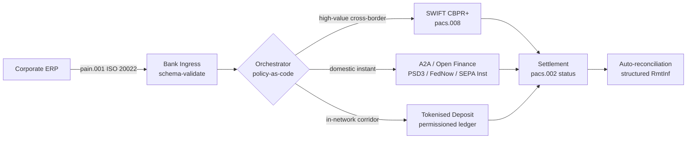

---

# Front Matter (YAML)

author: "contact@sebastienrousseau.com (Sebastien Rousseau)"
banner_alt: "Ọkọ̀ ojú-omi ẹrù ńlá ní ìbúdó omi-jíjìn ní àfẹ̀mọ́júmọ́ — àmì ìṣípopadà ọ̀nà-pípọ̀ kọjá ààlà ti iye ilé-iṣẹ́ kọjá ISO 20022, ìnáwó ṣíṣí, àti àwọn nẹ́tíwọ́ọ̀kì ìparí ìfipamọ́ tokenised ní 2026"
banner_height: "1597"
banner_width: "2584"
banner: "https://cloudcdn.pro/stocks/images/viktor-forgacs-KxVRDiFdTVo.webp"
cdn: "https://cloudcdn.pro"
charset: "UTF-8"
cname: "sebastienrousseau.com"
copyright: "© Copyright 2025 - 2026 - Sebastien Rousseau. All rights reserved."
date: "June 24, 2026"
description: "Bí ISO 20022, A2A, ìnáwó ṣíṣí lábẹ́ PSD3/FiDA, àti àwọn ìfipamọ́ tokenised ṣe ń tún ìnáwó ilé-iṣẹ́ kọjá ààlà ṣe pẹ̀lú SWIFT ní 2026."
format-detection: "telephone=no"
hreflang: "yo"
icon: "https://cloudcdn.pro/clients/sebastienrousseau/v1/logos/sebastienrousseau.svg"
id: "https://sebastienrousseau.com/2026-06-24-cross-border-iso-20022-open-finance-tokenised-deposits-treasury-2026"
image_alt: "Àwòrán Aláwọ̀ Dúdú àti Funfun ti Sebastien Rousseau"
image_height: "162"
image_width: "162"
image: "https://cloudcdn.pro/stocks/images/sebastienrousseau.webp"
keywords: "àwọn ìsanwó kọjá ààlà, ISO 20022, ìnáwó ṣíṣí, PSD3, FiDA, àwọn ìfipamọ́ tokenised, stablecoin, A2A, ìnáwó, CIB, Nexi, Mastercard, ọ̀nà-pípọ̀, pacs.008, pain.001, SWIFT, FedNow, SEPA Instant, RTP, CBPR+"
language: "yo-NG"
last_reviewed: "2026-06-24"
layout: "report"
locale: "yo_NG"
logo_alt: "Logo fún Sebastien Rousseau"
logo_height: "44"
logo_width: "44"
logo: "https://cloudcdn.pro/clients/sebastienrousseau/v1/logos/sebastienrousseau.svg"
menu: ""
measurementID: "G-169G4ET5HQ"
name: "Sebastien Rousseau"
permalink: "https://sebastienrousseau.com/2026-06-24-cross-border-iso-20022-open-finance-tokenised-deposits-treasury-2026"
rating: "general"
referrer: "no-referrer"
robots: "index, follow"
schema: "FAQPage, Article"
seo_title: "Kọjá Ààlà 2026: ISO 20022, Ìnáwó Ṣíṣí, Ọ̀nà Tokenised"
short_name: "sebastienrousseau"
subtitle: "Ìnáwó ilé-iṣẹ́ kọjá ààlà ní 2026 ń ṣiṣẹ́ lórí ìṣiṣẹ́ ọ̀nà-pípọ̀ — ISO 20022 gẹ́gẹ́ bí gírámà ọ̀tọ̀-ọ̀tọ̀, A2A àti ìnáwó ṣíṣí gẹ́gẹ́ bí ọ̀nà ojú-oníbàárà, àwọn ìfipamọ́ tokenised gẹ́gẹ́ bí ẹsẹ̀ ìparí wholesale, pẹ̀lú SWIFT tó ṣì ń dáwọ́ duro ìrù gígùn."
tags: "àwọn ìsanwó kọjá ààlà, ISO 20022, ìnáwó ṣíṣí, PSD3, FiDA, àwọn ìfipamọ́ tokenised, A2A, ìnáwó, CIB, ọ̀nà-pípọ̀, pacs.008, pain.001, SWIFT, FedNow, SEPA Instant, RTP, CBPR+"
theme-color: "0, 83, 191"
title: "Kọjá Ààlà 2026: ISO 20022, Ìnáwó Ṣíṣí àti Àwọn Ìfipamọ́ Tokenised ní Ìnáwó Ilé-iṣẹ́"
url: "https://sebastienrousseau.com/2026-06-24-cross-border-iso-20022-open-finance-tokenised-deposits-treasury-2026"
viewport: "width=device-width, initial-scale=1, shrink-to-fit=no"

# RSS - The RSS feed front matter (YAML).
atom_link: "https://sebastienrousseau.com/2026-06-24-cross-border-iso-20022-open-finance-tokenised-deposits-treasury-2026/rss.xml"
category: "Technology"
docs: https://validator.w3.org/feed/docs/rss2.html
generator: "Static Site Generator (SSG) (version 0.0.26)"
item_description: "Bí ISO 20022, A2A, ìnáwó ṣíṣí lábẹ́ PSD3/FiDA, àti àwọn ìfipamọ́ tokenised ṣe ń tún ìnáwó ilé-iṣẹ́ kọjá ààlà ṣe pẹ̀lú SWIFT ní 2026."
item_guid: "https://sebastienrousseau.com/2026-06-24-cross-border-iso-20022-open-finance-tokenised-deposits-treasury-2026/rss.xml"
item_link: "https://sebastienrousseau.com/2026-06-24-cross-border-iso-20022-open-finance-tokenised-deposits-treasury-2026/rss.xml"
item_pub_date: "Wed, 24 Jun 2026 07:07:07 +0000"
item_title: "Kọjá Ààlà 2026: ISO 20022, Ìnáwó Ṣíṣí àti Àwọn Ìfipamọ́ Tokenised ní Ìnáwó Ilé-iṣẹ́"
last_build_date: "Wed, 24 Jun 2026 06:06:06 +0000"
managing_editor: "contact@sebastienrousseau.com (Sebastien Rousseau)"
pub_date: "Wed, 24 Jun 2026 07:07:07 +0000"
ttl: "60"
type: "article"
webmaster: "contact@sebastienrousseau.com"

# Apple - The Apple front matter (YAML).
apple_mobile_web_app_orientations: "portrait"
apple_touch_icon_sizes: "192x192"
apple-mobile-web-app-capable: "yes"
apple-mobile-web-app-status-bar-inset: "black"
apple-mobile-web-app-status-bar-style: "black-translucent"
apple-mobile-web-app-title: "Kọjá Ààlà 2026: ISO 20022, Ìnáwó Ṣíṣí, Ọ̀nà Tokenised"
apple-touch-fullscreen: "yes"

# MS Application - The MS Application front matter (YAML).

msapplication-navbutton-color: "0, 83, 191"

# Twitter Card - The Twitter Card front matter (YAML).

twitter_card: "summary_large_image"
twitter_creator: "@wwdseb"
twitter_description: "Bí ISO 20022, A2A, ìnáwó ṣíṣí lábẹ́ PSD3/FiDA, àti àwọn ìfipamọ́ tokenised ṣe ń tún ìnáwó ilé-iṣẹ́ kọjá ààlà ṣe pẹ̀lú SWIFT ní 2026."
twitter_image: "https://cloudcdn.pro/clients/sebastienrousseau/v1/logos/sebastienrousseau.svg"
twitter_image_alt: "Logo ti Sebastien Rousseau"
twitter_site: "@wwdseb"
twitter_title: "Kọjá Ààlà 2026: ISO 20022, Ìnáwó Ṣíṣí, Ọ̀nà Tokenised"
twitter_url: "https://sebastienrousseau.com/2026-06-24-cross-border-iso-20022-open-finance-tokenised-deposits-treasury-2026"

excerpt: "Ìnáwó ilé-iṣẹ́ kọjá ààlà ní 2026 jẹ́ ọ̀ràn ìmọ̀-ẹ̀rọ ọ̀nà-pípọ̀. ISO 20022 ni gírámà ọ̀tọ̀-ọ̀tọ̀, A2A àti ìnáwó ṣíṣí lábẹ́ PSD3/FiDA ni ọ̀nà ojú-oníbàárà, àwọn ìfipamọ́ tokenised ń gbé ẹsẹ̀ ìparí wholesale, SWIFT sì ṣì ń dáwọ́ duro ìrù gígùn. Iṣẹ́ tó ṣe pàtàkì wà ní ìpele ìṣètò, kì í ṣe ní mọ́dẹ̀lì."

# Humans.txt - The Humans.txt front matter (YAML).
author_website: "https://sebastienrousseau.com"
author_twitter: "@wwdseb"
author_location: "London, UK"
thanks: "A dúpẹ́ pé o kà á!"
site_last_updated: "2026-06-24"
site_standards: "HTML5, CSS3, RSS, Atom, JSON, XML, YAML, Markdown, TOML"
site_components: "Kaishi, Kaishi Builder, Kaishi CLI, Kaishi Templates, Kaishi Themes"
site_software: "Static Site Generator, Rust"

---

# Kọjá Ààlà 2026: ISO 20022, Ìnáwó Ṣíṣí àti Àwọn Ìfipamọ́ Tokenised ní Ìnáwó Ilé-iṣẹ́

<!-- lead-start -->
<aside class="post-lead" aria-label="Ìsọnísókí àpilẹ̀kọ">

<strong>TL;DR.</strong> Ìnáwó ilé-iṣẹ́ kọjá ààlà ní 2026 ń ṣiṣẹ́ lórí ọ̀nà mẹ́rin pẹ̀lú ara wọn — SWIFT CBPR+, A2A kíákíá lábẹ́ PSD3/FiDA, àwọn ìfipamọ́ tokenised, àti àwọn ọ̀nà stablecoin — tí ISO 20022 ti so wọ́n papọ̀ gẹ́gẹ́ bí gírámà ọ̀tọ̀-ọ̀tọ̀. Iṣẹ́ fún CIB àti àwọn ẹgbẹ́ ìnáwó ilé-iṣẹ́ ni ìṣètò, kì í ṣe yíyàn ọ̀nà.

<strong>Àwọn àyọkà pàtàkì</strong>

<ul class="post-lead-takeaways">
  <li><strong>Ọ̀nà-pípọ̀ ni ètò àkọ́kọ́.</strong> Ko sí ọ̀nà kan ṣoṣo tó ń pa gbogbo ojú-ọ̀nà mọ́, gbogbo ìwọ̀n tikẹ́ẹ̀tì, gbogbo àkókò gígé. Ìnáwó ń yan ọ̀nà fún ìsanwó kọ̀ọ̀kan, kì í ṣe fún báńkì kọ̀ọ̀kan.</li>
  <li><strong>ISO 20022 ni èdè ọ̀tọ̀-ọ̀tọ̀.</strong> pacs.008, pacs.009 àti pain.001 ń gbé dátà remittance báyìí kọjá àwọn ọ̀nà RTGS, kíákíá, A2A àti ìfipamọ́ tokenised — tí ó ń jẹ́ kí àwọn ìpinnu ìtọ́nasọ́nà jẹ́ ohun tó dá lórí dátà dípò títì sí ọ̀nà kan.</li>
  <li><strong>Ìnáwó ṣíṣí ń fẹ̀ ààlà sí i.</strong> PSD3 àti FiDA ń ti mọ́dẹ̀lì ìfowópamọ́ ṣíṣí sínú ìfẹ̀yìntì, ìṣẹ̀dájú, àti dátà ìnáwó; Nexi àti Mastercard ń kọ́ ìpele ìṣètò tí àwọn ilé-iṣẹ́ ń lò.</li>
  <li><strong>Àwọn ìfipamọ́ tokenised ni ẹsẹ̀ wholesale.</strong> Àwọn ìfipamọ́ tokenised tí báńkì ti tú jáde àti àwọn ọ̀nà stablecoin tí a ti kópa wọn jọ wà lábẹ́ ọ̀nà kíákíá ojú-oníbàárà, wọ́n sì ń parí ẹsẹ̀ wholesale ní T+0 tí ó súnmọ́.</li>
</ul>

<strong>Àwọn ìwé tó jẹmọ́:</strong> <a href="https://sebastienrousseau.com/2026-06-07-autonomous-treasury-index-programmable-liquidity-tokenised-deposits-2026">Àpẹẹrẹ Ìnáwó Aládàṣe 2026: Liquidity Tó Ṣe Ètò àti Àwọn Ìfipamọ́ Tokenised</a>, <a href="https://sebastienrousseau.com/2026-06-15-pacs008-automation-iso-20022-interbank-payments-2026">Ìṣiṣẹ́ Aládàṣe pacs.008: Àwọn Ìsanwó Láàárín Báńkì ISO 20022 ní 2026</a>.

</aside>
<!-- lead-end -->

> **Àkótán fún olùgbéjọ́.** Ìnáwó ilé-iṣẹ́ kọjá ààlà ní 2026 jẹ́ ọ̀ràn ìmọ̀-ẹ̀rọ ọ̀nà-pípọ̀ kí ó tó di ọ̀ràn ìṣàkóso ìbáṣepọ̀. PSD3 àti òfin Ìwọlé Dátà Ìnáwó (FiDA) ń fẹ̀ ààlà ìfowópamọ́ ṣíṣí sínú dátà ìnáwó ilé-iṣẹ́; ìyípadà SWIFT MT/MX ti Òṣù Kọkànlá 2026 jẹ́ kí pacs.008 tí ó bá CBPR+ mu di àpẹẹrẹ tó ṣeé ṣe nìkan fún ìránṣẹ́ láàárín báńkì kọjá ààlà; àwọn ìfipamọ́ tokenised àti àwọn ọ̀nà stablecoin tí a ṣe ìṣàkóso ń gbé ẹsẹ̀ ìparí wholesale ní T+0 tí ó súnmọ́ nínú nẹ́tíwọ́ọ̀kì tí a fi ìyọ̀nda dá. CIB tó ń borí nínú ìṣàn yìí kì í ṣe èyí tó ń yan ọ̀nà kan ṣoṣo; ó jẹ́ èyí tó ń kọ́ ìpele ìṣètò tó so wọn papọ̀. Àpilẹ̀kọ yìí ń rìn nínú ìṣètò ọ̀nà mẹ́rin (A2A lábẹ́ PSD3, SWIFT CBPR+, àwọn ìfipamọ́ tokenised tí báńkì ti tú jáde, stablecoin tí a ṣe ìṣàkóso) — ohun tí ọ̀nà kọ̀ọ̀kan ń ṣe dáradára, ibi tí àwọn ààlà ìfihàn-kírédítì wà, àti ohun tí ìpele ìṣètò ìlànà-gẹ́gẹ́-bí-kóòdù tó wà lókè wọn gbọ́dọ̀ fipá-mu kí ilé-iṣẹ́ lè rí ìsanwó kan ṣoṣo, kí olùṣàkóso sì lè rí ìtọpa kan tó ṣeé wádìí.

Ilé-iṣẹ́ ọ̀nà-ẹ̀rọ Yúróòpù kan ń san EUR 4.2 mílíọ̀nù fún olùpèsè Brazilian kan ní àárọ̀ Ọjọ́bọ̀. Ibùdó iṣẹ́ ìnáwó kì í yan báńkì. Ó ń yan ọ̀nà — ìṣiṣẹ́ àwọn ọ̀nà. Ìtọ́nisọ́nà ojú-oníbàárà ń dé orí ìránṣẹ́ A2A pain.001 tí a ń tọ́ka sí nípasẹ̀ olùpèsè ìnáwó ṣíṣí lábẹ́ PSD3. Báńkì ń gbé e kọjá agbègbè onìbára méjì lórí àwọn ìfipamọ́ tokenised nínú nẹ́tíwọ́ọ̀kì àdáni CIB. Ìrù gígùn — ìfọ́mọ́ ìnvóìsì USD 80,000 sí olùpèsè-ìsàlẹ̀ tí kò ní ìbáṣepọ̀ ìfipamọ́ tokenised — ṣì ń gun SWIFT CBPR+ gẹ́gẹ́ bí pacs.008. Oníbàárà ń rí ìsanwó kan ṣoṣo. Ìṣètò ìmọ̀-ẹ̀rọ ń rí ọ̀nà mẹ́rin. ISO 20022 ni ìdí kan ṣoṣo tó fi ń dúró papọ̀.

Èyí ni mọ́dẹ̀lì ìṣiṣẹ́ tí Mastercard ń ṣàpèjúwe nígbà tí ó ń sọ̀rọ̀ nípa [ìyípadà láti ìfowópamọ́ ṣíṣí sí ìnáwó ṣíṣí](https://www.mastercard.com/us/en/news-and-trends/Insights/2026/open-banking-to-open-finance-the-evolution-of-financial-data.html "Mastercard: ìfowópamọ́ ṣíṣí sí ìnáwó ṣíṣí, ìyípadà dátà ìnáwó") — dátà àti àwọn ìsanwó tí a so papọ̀ sí ìpele ìṣètò kan, pẹ̀lú ọ̀nà tí ètò ń yàn, kì í ṣe oníbàárà. Ìbéèrè tó nífẹ̀ẹ́ sí àwọn olùṣàkóso ìmọ̀-ẹ̀rọ báńkì àgbà kì í ṣe èwo nínú ọ̀nà tó máa borí. Ó jẹ́ bí a ṣe ń ṣe ìṣètò ìpele ìṣètò, bí a ṣe ń ṣàkóso rẹ̀, àti bí a ṣe ń ṣe ìbámu rẹ̀.

## 01. Láti kádì sí A2A — ìyípadà ìnáwó ṣíṣí

Àwọn ọ̀nà kádì kì í lọ. A ń tún wọn ṣàpèjúwe.

Nínú 2025 àti dé 2026, [PSD3 àti òfin Ìwọlé Dátà Ìnáwó (FiDA)](https://www.consultancy.uk/news/42202/orchestrating-open-banking-for-platform-growth-2026-outlook "Consultancy.uk: ìṣètò ìfowópamọ́ ṣíṣí fún ìdàgbàsókè pẹpẹ, ìfojúsọ́nà 2026") gbé ojúṣe ìfowópamọ́ ṣíṣí kọjá àwọn àkáǹtì ìsanwó sí ìfẹ̀yìntì, ohun-ìní gbáwó, ìfipamọ́, ìṣẹ̀dájú, àti dátà ìnáwó ilé-iṣẹ́. Ìtumọ̀ rẹ̀ fún ìnáwó ilé-iṣẹ́ jẹ́ tààrà: olùṣàkóso ìbáṣepọ̀ CIB lè báyìí gba àwòrán liquidity pípé ti ilé-iṣẹ́ kọjá àwọn báńkì pupọ̀ nípasẹ̀ ìfọwọ́sí API kan ṣoṣo, lórí ìtọ́nisọ́nà ilé-iṣẹ́.

Àwọn ẹlẹ́rọ̀ méjì ń kọ́ ìpele ìṣètò tí àwọn ilé-iṣẹ́ máa lò ní ojú-fojú. Nexi ti gbé ìjókòó rẹ̀ ti ìgbà-mu kọjá sí ìpilẹ̀ A2A kọjá ojú-ọ̀nà SEPA Instant àti RTGS pan-Yúróòpù, tí ó jẹ́ ISO 20022 nípasẹ̀ ìbẹ̀rẹ̀-dé-òpin. Pẹpẹ ìnáwó ṣíṣí Mastercard — tí a fi sọ̀rọ̀ sí ìgbà rẹ̀ ti Aiia àti Finicity — ń pèsè ìpele ìkó-dátà àti ìfọwọ́sí lábẹ́ rẹ̀, pẹ̀lú ìpilẹ̀ ìsanwó tí ń farahàn nípasẹ̀ ohun-ìní API kan náà tí ó ti ṣe ìṣẹ́jú-fọwọ́sí kádì tẹ́lẹ̀.

Ìyípadà náà ṣe pàtàkì fún àwọn ìdí mẹ́ta:

1. **Ọrọ̀ ajé àkójọ.** A2A tí a bẹ̀rẹ̀ lábẹ́ PSD3 ń yọ interchange kúrò nínú ìsanwó. Fún ọ̀nà B2B tikẹ́ẹ̀tì gíga, ìpamọ́ jẹ́ ohun ńlá; fún ọ̀nà oníbàárà tikẹ́ẹ̀tì kékeré, èèkà owó-òwò oníṣòwò ń wó.
2. **Dìídí dátà.** A2A lábẹ́ ISO 20022 ń gbé dátà remittance tó ní ètò tí kádì kò lè gbé rí. Iye ìbámu aládàṣe lókè 95% báyìí jẹ́ ohun pàtàkì-tábùlù.
3. **Mọ́dẹ̀lì ewu.** A2A jẹ́ ìgbà-lóòfà kírédítì, kì í ṣe ìṣẹ́jú-fọwọ́sí kádì. Ojú jíjò, mọ́dẹ̀lì chargeback, àti mọ́dẹ̀lì ariyanjiyan yàtọ̀ pátápátá. Àwọn ẹgbẹ́ ìnáwó ilé-iṣẹ́ gbọ́dọ̀ mọ̀ pé a ń tún ìpele ààbò oníbàárà ṣe, a kì í ṣe ìjogún rẹ̀.

CIB tí ó ń ta èrò ọ̀nà-pípọ̀ ní 2026 ń ta ìṣètò — kì í ṣe ìwọlé. A ti ń ṣàkóso ìwọlé báyìí.

## 02. ISO 20022 gẹ́gẹ́ bí èdè ọ̀tọ̀-ọ̀tọ̀ kọjá ọ̀nà

Ìdí tí ọ̀nà-pípọ̀ fi ṣeé ṣe ní gbogbo jẹ́ pé ìṣẹ̀dá ìránṣẹ́ ti dóhùn báyìí kọjá àwọn ọ̀nà.

Ìgbìmọ̀ BIS lórí Àwọn Ìsanwó àti Àwọn Ìṣètò Ọjà (CPMI) ti ṣe àyọkà ìṣètò náà kedere nínú [àwọn ìbéèrè ìṣòkan ISO 20022 fún mímú àwọn ìsanwó kọjá ààlà dára sí i](https://www.bis.org/cpmi/publ/d230.pdf "BIS CPMI: àwọn ìbéèrè ìṣòkan ISO 20022 fún mímú àwọn ìsanwó kọjá ààlà dára sí i"). Ìyípadà Òṣù Kọkànlá 2025 sí CBPR+ pa àkókò MT103 / MT202 fún ìránṣẹ́ láàárín báńkì kọjá ààlà. Lẹ́yìn náà, gbogbo ọ̀nà pàtàkì — SWIFT, FedNow, SEPA Instant, RTP, àti àwọn ètò ìsanwó kíákíá pàtàkì ní Asia àti Latin America — ń sọ gírámà pacs.008 / pacs.009 / pain.001 kan náà.

Àbájáde alámọ̀dájú fún ìnáwó ilé-iṣẹ́:

- **Ìtọ́nasọ́nà dá lórí dátà.** Ibùdó iṣẹ́ ìnáwó lè kà pain.001 lẹ́ẹ̀kan, ó sì lè pinnu ọ̀nà fún ìsanwó kọ̀ọ̀kan dá lórí ojú-ọ̀nà, ìwọ̀n tikẹ́ẹ̀tì, àkókò gígé, àti ìbáṣepọ̀ àjùmọ̀ṣe — láìní tún-pa ìránṣẹ́ náà sọ.
- **Dátà remittance ń yè kọjá ìfò.** Àwọn agọ́ remittance tí ó ní ètò (`<RmtInf><Strd>`) ń gbé kọjá àwọn ẹsẹ̀ oníbára láìní ge kúkurú. Iye ìbámu aládàṣe ń dìde nítorí pé a kì í pàdánù dátà ní ààlà ọ̀nà.
- **Ṣíṣàyẹ̀wò ìṣèyà di ohun tó ṣeé wádìí.** Àwọn agọ́ `<Dbtr>` / `<Cdtr>` / `<DbtrAgt>` / `<CdtrAgt>` tí ó ní ètò pẹ̀lú àwọn ìtọ́kasí LEI ń rọ́pò ìṣẹ́jú-fọwọ́sí orúkọ ọ̀rọ̀-aláìní-ètò. Iye ìkún ń dín. Ìlà ìwádìí ń wó.

Àwòrán tó wà nísàlẹ̀ ń tọpa pain.001 kan ṣoṣo kọjá ẹ̀nu-ọ̀nà báńkì, sínú olùṣètò policy-as-code, àti jáde sí ọ̀nà yòówù tí ojú-ọ̀nà àti ìwọ̀n tikẹ́ẹ̀tì béèrè — ìránṣẹ́ kan, ọ̀nà púpọ̀, láìní tún-pa sọ.

Iye owó ìṣòkan yìí ni ìjùmọ̀ṣe ìmọ̀-ẹ̀rọ. ISO 20022 ń yọ̀nda. Báńkì méjì lè jẹ́ tó bá CBPR+ mu pátápátá, kí wọ́n sì ṣì gbé àwọn ìránṣẹ́ pacs.008 tó yàtọ̀ ní ìlò agọ́, èdè-àpẹẹrẹ, àti ìṣètò dátà remittance. CIB tí ó ń borí lórí ọ̀rọ̀ kọjá ààlà ní 2026 ń fipá-mu àpẹẹrẹ ìránṣẹ́ tó le ju ohun tí àpẹẹrẹ béèrè — tí ó sì ń kọ ní parse, kì í ṣe ní ìparí.

## 03. Àwọn ìfipamọ́ tokenised àti àwọn ọ̀nà tó dúró

Ẹsẹ̀ ìparí wholesale ni ibi tí ìtàn ọ̀nà ti ń di ohun tó nífẹ̀ẹ́ sí.

Àwòrán 2026, tí a gbé yọ dáradára nínú [ìtúpalẹ̀ Trade Treasury Payments lórí ìṣiṣẹ́ aládàṣe, àwọn ọ̀nà ìṣèlò, ISO 20022 àti stablecoin](https://tradetreasurypayments.com/articles/automation-contingency-rails-iso-20022-and-stablecoins-the-2026-trends-reshaping-corporate-finance-and-b2b-payments "Trade Treasury Payments: ìṣiṣẹ́ aládàṣe, àwọn ọ̀nà ìṣèlò, ISO 20022 àti stablecoin, àwọn ìṣàn 2026 tó ń tún ìnáwó ilé-iṣẹ́ àti àwọn ìsanwó B2B ṣe"), pin ìpele ìparí wholesale sí mọ́dẹ̀lì méjì tó yàtọ̀ ní ìṣètò.

**Àwọn ìfipamọ́ tokenised tí báńkì ti tú jáde.** Báńkì onílò ń tú àjà tokenised jáde lórí àkòsílẹ̀ tí a fi ìyọ̀nda dá — JPM Coin, àmì-ìfipamọ́ Orion-asopọ̀ ti HSBC, àwọn ohun-bámu CIB Yúróòpù pàtàkì. Àmì-ìnáwó jẹ́ ohun tó dáhùn tààrà lórí báńkì tó tú jáde. Ìparí súnmọ́ T+0 nínú nẹ́tíwọ́ọ̀kì. Ìbámu jẹ́ ojúṣe báńkì tó tú jáde. Ọ̀nà náà ti ṣe ìṣàkóso pátápátá, ó ṣeé tọ́pinpin pátápátá, ó sì ti dín kù sí àwọn olùkópa tí olùtu-jade ti gba.

**Àwọn ọ̀nà stablecoin tí a kópa.** stablecoin tí a ṣe ìṣàkóso — tí a fi ìfipamọ́ ní pípé, tí a ti wádìí, tí ó ń ṣiṣẹ́ lábẹ́ MiCA tàbí ìjọba agbègbè kannáà — ń parí ojú-ọ̀nà níbi tí àwọn ìfipamọ́ tokenised tí báńkì ti tú jáde kò tíì dé. Àmì-ìnáwó jẹ́ ohun tó dáhùn lórí ìfipamọ́, kì í ṣe lórí ìwé báńkì. Ìbámu ni a ń pín láàárín olùtu-jade, ọ̀nà-wọ inú, àti ọ̀nà-yọ jáde.

Àwọn mọ́dẹ̀lì méjì kì í dije. A ṣe wọn ní pẹpẹ. Ọjà kọjá ààlà CIB ní 2026 sábà ń lo àwọn ìfipamọ́ tokenised tí báńkì ti tú jáde fún ẹsẹ̀ inú-nẹ́tíwọ́ọ̀kì àti stablecoin tí a ṣe ìṣàkóso fún ojú-ọ̀nà níbi tí ọ̀nà inú-nẹ́tíwọ́ọ̀kì ti parí. Ilé-iṣẹ́ ń rí ìsanwó ISO 20022 kan ṣoṣo. Ìtàn ìparí lábẹ́ rẹ̀ jẹ́ ọ̀pọ̀-token.

Ìbéèrè ìpele-ìgbìmọ̀ olórí jẹ́ ohun kannáà tí àwọn ìgbìmọ̀ ewu-ìṣiṣẹ́ ti ń béèrè láti àkókò ìbẹ̀rẹ̀ ìdánwò liquidity tó ṣe ètò: ta ni ń gbé ìfihàn kírédítì lórí token, fún ìgbà mélòó? Àwọn ìfipamọ́ tokenised ń fún wa ní ìdáhùn mọ́lẹ̀ — báńkì tó tú jáde, títí dé jíjó. Àwọn ọ̀nà stablecoin tí a kópa ń fún wa ní ìdáhùn tó nípọn jù — ìfipamọ́, lábẹ́ ìpele ìwádìí àti ìṣèdájú gbà-pa-padà. Ẹgbẹ́ ìnáwó tí kò ṣàkọsílẹ̀ ìdáhùn fún ọ̀nà kọ̀ọ̀kan fún ojú-ọ̀nà kọ̀ọ̀kan ń gbé ewu kírédítì aláìwọ̀n lórí ìwé báláńsì rẹ̀.

## 04. Àkójọpọ̀ ìnáwó aládàṣe

Lókè ìpele ọ̀nà ni ìpele ìṣètò wà. Lókè ìpele ìṣètò ni ìpele aṣojú wà.

Mo ti gbé ìṣètò náà lélẹ̀ ní àlàyé nínú [Àpẹẹrẹ Ìnáwó Aládàṣe 2026: Liquidity Tó Ṣe Ètò àti Àwọn Ìfipamọ́ Tokenised](https://sebastienrousseau.com/2026-06-07-autonomous-treasury-index-programmable-liquidity-tokenised-deposits-2026 "Sebastien Rousseau: Àpẹẹrẹ Ìnáwó Aládàṣe 2026"). Àkójọ kúkurú: ìnáwó aṣojú ní 2026 ni ìpele ìṣètò, tí a fi hàn gẹ́gẹ́ bí ìlànà-gẹ́gẹ́-bí-kóòdù, pẹ̀lú àwọn aṣojú aláàlà tí ń ṣiṣẹ́ nínú rẹ̀.

Àkójọpọ̀ náà ni:

1. **Ìpele ọ̀nà.** SWIFT CBPR+, A2A kíákíá, àwọn ìfipamọ́ tokenised, stablecoin tí a ṣe ìṣàkóso. Ọ̀nà kọ̀ọ̀kan ní àkójọ tí a ti tẹ̀ jáde, tábìlì àkókò gígé, ìṣiṣẹ́ owó-òwò, àti mọ́dẹ̀lì ìparí-dájú.
2. **Ìpele ìṣètò.** ISO 20022 wọlé, ISO 20022 jáde. Ìpinnu ọ̀nà fún ìsanwó kọ̀ọ̀kan dá lórí ojú-ọ̀nà, tikẹ́ẹ̀tì, àkókò gígé, ìbáṣepọ̀ àjùmọ̀ṣe, àti ìlànà. A fi ìpele-ètò sí ìlànà, a fi ìfọwọ́sí sí i, ó sì ṣeé wádìí.
3. **Ìpele aṣojú.** Àwọn aṣojú ìnáwó aláàlà ń ṣe ìlànà ìṣètò pẹ̀lú àwọn ààlà ìpè-irinṣẹ́, àkọsílẹ̀ ìwádìí, àti àwọn switch-pa. Aṣojú kì í yan ọ̀nà. Ìlànà ní ń yan ọ̀nà. Aṣojú ń ṣiṣẹ́ ìlànà.
4. **Ìpele ìbámu.** Àwọn ìránṣẹ́ ISO 20022 pacs.008 / pacs.002 / camt.054 ń bá pẹ̀lú ìtọ́nisọ́nà pain.001 ìpilẹ̀, pẹ̀lú dátà remittance tó ní ètò tó ń ti àyíká pa láìní ìfọwọ́kàn ènìyàn.

CIB tó ń ta àkójọpọ̀ yìí ní 2026 ń ta ohun mẹ́rin pẹ̀lú ara wọn — ó sì ń san wọ́n ní iyebíye lọ́tọ̀ọ̀tọ̀. Ilé-iṣẹ́ tó ń rà á ń ra àyàn kọjá àwọn ọ̀nà, pẹ̀lú àpẹẹrẹ ìránṣẹ́ kan, ìpele ìlànà kan, ìfọ̀rọ̀-ìbámu kan. Ìyẹn ni ìyípadà ìṣètò. Ohun gbogbo míràn jẹ́ àlàyé ìmúṣẹ.

## Àwọn ìbéèrè tí a sábà máa ń béèrè

**Ǹjẹ́ "ìnáwó ṣíṣí" jẹ́ ìfowópamọ́ ṣíṣí tí a tún sọ orúkọ rẹ̀ ni?**
Bẹ́ẹ̀ kọ́. Ìfowópamọ́ ṣíṣí lábẹ́ PSD2 bo àwọn àkáǹtì ìsanwó. PSD3 àti òfin Ìwọlé Dátà Ìnáwó (FiDA) gbé ojúṣe ìpín-dátà sí ìfẹ̀yìntì, ohun-ìní gbáwó, ìfipamọ́, ìṣẹ̀dájú, àti dátà ìnáwó ilé-iṣẹ́. Ìtumọ̀ rẹ̀ fún ìnáwó ilé-iṣẹ́ jẹ́ tààrà: olùṣàkóso ìbáṣepọ̀ CIB lè báyìí gba àwòrán liquidity pípé ti ilé-iṣẹ́ kọjá àwọn báńkì pupọ̀ nípasẹ̀ ìfọwọ́sí API kan ṣoṣo, lórí ìtọ́nisọ́nà ilé-iṣẹ́, kì í ṣe ìtàn àkáǹtì ìsanwó rẹ̀ nìkan.

**Kí ni ìdí tí ìpele ìṣètò fi jẹ́ ìfojúsùn ìṣètò, kì í ṣe ọ̀nà?**
Nítorí pé àwọn ọ̀nà ti ń di ohun gbogboogbò. SWIFT CBPR+ pacs.008, A2A lábẹ́ PSD3, àwọn ìfipamọ́ tokenised, àti stablecoin tí a ṣe ìṣàkóso gbogbo wọn ń gbé gírámà ISO 20022 kan náà ní ìpele ìránṣẹ́. Ohun tó ń ya CIB 2026 kan sí ọ̀tọ̀ ni ẹ̀rọ ìlànà-gẹ́gẹ́-bí-kóòdù tó ń yan ọ̀nà fún ìsanwó kọ̀ọ̀kan dá lórí ojú-ọ̀nà, ìwọ̀n tikẹ́ẹ̀tì, ìbéèrè ìparí-dájú, àti ìbáṣepọ̀ àjùmọ̀ṣe — tí ó sì ń ṣàkọsílẹ̀ ìyàn náà nínú telemetry ìwádìí tí olùṣàkóso máa béèrè fún. Láìní ẹ̀rọ yẹn, ọ̀nà-pípọ̀ kàn jẹ́ àyàn pẹ̀lú àìní ìṣàkóso.

**Níbo ni ààlà ìfihàn-kírédítì fi ṣubú lórí ẹsẹ̀ ìfipamọ́-tokenised?**
Àwọn ìfipamọ́ tokenised tí báńkì ti tú jáde lórí àkòsílẹ̀ tí a fi ìyọ̀nda dá jẹ́ ohun tó dáhùn tààrà lórí báńkì tó tú jáde — ìfihàn kírédítì parí ní jíjó. Àwọn ọ̀nà stablecoin tí a ṣe ìṣàkóso (tí MiCA ń ṣàkóso ní EU, ìjọba ìwé-ìfọ̀rọ̀wérọ̀ Báńkì Ilẹ̀ Gẹ̀ẹ́sì ní UK, àwọn àmí-bámu níbòmíràn) jẹ́ ohun tó dáhùn lórí ìfipamọ́, pẹ̀lú fèrèsé ìfihàn lábẹ́ ìpele ìwádìí àti àwọn ìpèsè ìṣèdájú gbà-pa-padà. Ẹgbẹ́ ìnáwó tí kò ṣàkọsílẹ̀ ìdáhùn fún ọ̀nà kọ̀ọ̀kan fún ojú-ọ̀nà kọ̀ọ̀kan ń gbé ewu kírédítì aláìwọ̀n lórí ìwé báláńsì rẹ̀.

**Kí ló ń ṣẹlẹ̀ sí SWIFT nínú ìṣètò yìí?**
SWIFT kì í pòórá — ó ń dáwọ́ duro ìrù gígùn. Ojú-ọ̀nà níbi tí àwọn ìfipamọ́ tokenised tí báńkì ti tú jáde kò tíì dé (ọ̀pọ̀lọpọ̀ ìbáṣepọ̀ olùpèsè-ìsàlẹ̀ ọjà-tó-ń-jáde, ọ̀pọ̀lọpọ̀ ìṣàn kọjá ààlà ìgbà-díẹ̀ / tikẹ́ẹ̀tì kékeré), àti ojú-ọ̀nà níbi tí ilé-iṣẹ́ tàbí báńkì béèrè ìtọpa ìwádìí ìfowópamọ́-oníbára CBPR+, ń tẹ̀síwájú lórí SWIFT pacs.008. Ìṣètò 2026 jẹ́ "SWIFT + àwọn ọ̀nà tuntun", kì í ṣe "àwọn ọ̀nà tuntun ní ipò SWIFT".

**Kí ni ilé-iṣẹ́ ń rà nígbà tí ó bá ra àkójọpọ̀ yìí?**
Àyàn kọjá àwọn ọ̀nà, pẹ̀lú àpẹẹrẹ ìránṣẹ́ kan (ISO 20022), ìpele ìlànà kan (ẹ̀rọ ìṣètò), àti ìfọ̀rọ̀-ìbámu kan (ipo pacs.002 + ìfọwọ́sí camt.054 + àwọn ìfọ̀rọ̀ camt.053 tó ní ètò). Ilé-iṣẹ́ kì í san fún àjọṣe ọ̀nà mẹ́rin lọ́tọ̀ọ̀tọ̀. Ó ń san fún ìpele ìṣètò tó ń jẹ́ kí ọ̀nà mẹ́rin ṣe gẹ́gẹ́ bí ọ̀kan ní ṣiṣẹ́ — àti ìtọpa ìwádìí tó ń jẹ́ kí ó lè dáhùn "ọ̀nà wo ni ìsanwó EUR 4.2 m yẹn gun, kí sì ni ìdí?" ní àárọ̀ lẹ́yìn ìbéèrè olùṣàkóso tó kàn.

## Ìparí

Ìnáwó ilé-iṣẹ́ kọjá ààlà ní 2026 jẹ́ ọ̀ràn ìmọ̀-ẹ̀rọ ọ̀nà-pípọ̀. ISO 20022 ni gírámà tó ń jẹ́ kí ọ̀nà-pípọ̀ ṣeé ṣe. PSD3 àti FiDA ń fẹ̀ ààlà dátà sí i, wọ́n sì ń fipá-mu ìnáwó ṣíṣí sínú ìṣàn iṣẹ́ ìnáwó ilé-iṣẹ́. Àwọn ìfipamọ́ tokenised àti stablecoin tí a ṣe ìṣàkóso ń gbé ẹsẹ̀ ìparí wholesale. SWIFT ṣì ń dáwọ́ duro ìrù gígùn.

CIB tó ń borí ni èyí tó ń kọ́ ìpele ìṣètò — kì í ṣe èyí tó ń yan ọ̀nà kan ṣoṣo tó sì ń tẹ̀ ilé-iṣẹ́ rẹ̀ lé e. Ẹgbẹ́ ìnáwó ilé-iṣẹ́ tó ń borí ni èyí tó ń ṣàkọsílẹ̀ ìfihàn kírédítì fún ọ̀nà kọ̀ọ̀kan fún ojú-ọ̀nà kọ̀ọ̀kan, tó ń fipá-mu àpẹẹrẹ ISO 20022 tó le ju ohun tí olùṣàkóso béèrè, tó sì ń bá ìpinnu ọ̀nà lò gẹ́gẹ́ bí ìlànà, kì í ṣe gẹ́gẹ́ bí ìpinnu ìsanwó-kọ̀ọ̀kan.

Iṣẹ́ tó nífẹ̀ẹ́ sí wà ní ìpele ìṣètò. Kọ́ ọ pẹ̀lú ìfarabalẹ̀.

## Àwọn ìtọ́kasí

Bank for International Settlements, Committee on Payments and Market Infrastructures (2023). *Harmonised ISO 20022 data requirements for enhancing cross-border payments* (CPMI Papers No. 230). Available at: [https://www.bis.org/cpmi/publ/d230.htm](https://www.bis.org/cpmi/publ/d230.htm "BIS CPMI 230 — Harmonised ISO 20022 data requirements")

Bank for International Settlements (2024). *Project Agorá: cross-border payments with tokenised commercial bank deposits and central bank money*. BIS Innovation Hub. Available at: [https://www.bis.org/about/bisih/topics/fmis/agora.htm](https://www.bis.org/about/bisih/topics/fmis/agora.htm "BIS Project Agorá")

Bank of England (2023). *Regulatory regime for systemic payment systems using stablecoins and related service providers — Discussion Paper*. Available at: [https://www.bankofengland.co.uk/paper/2023/dp/regulatory-regime-for-systemic-payment-systems-using-stablecoins-and-related-service-providers](https://www.bankofengland.co.uk/paper/2023/dp/regulatory-regime-for-systemic-payment-systems-using-stablecoins-and-related-service-providers "Bank of England — Regulatory regime for stablecoins discussion paper")

European Commission (2023). *Proposal for a Directive on payment services and electronic money services (PSD3)*. Available at: [https://finance.ec.europa.eu/regulation-and-supervision/financial-services-legislation/implementing-and-delegated-acts/payment-services-directive_en](https://finance.ec.europa.eu/regulation-and-supervision/financial-services-legislation/implementing-and-delegated-acts/payment-services-directive_en "European Commission — Payment Services Directive proposal")

European Parliament and Council (2023). *Regulation (EU) 2023/1114 on markets in crypto-assets (MiCA)*. Available at: [https://eur-lex.europa.eu/eli/reg/2023/1114/oj](https://eur-lex.europa.eu/eli/reg/2023/1114/oj "Regulation (EU) 2023/1114 — Markets in Crypto-Assets (MiCA)")

Financial Action Task Force (2023). *International standards on combating money laundering and the financing of terrorism — Recommendation 16 on wire transfers*. Available at: [https://www.fatf-gafi.org/en/publications/Fatfrecommendations/Fatf-recommendations.html](https://www.fatf-gafi.org/en/publications/Fatfrecommendations/Fatf-recommendations.html "FATF Recommendations")

International Organization for Standardization (2020). *ISO 17442 Financial services — Legal entity identifier (LEI)*. Available at: [https://www.gleif.org/en/about-lei/iso-17442-the-lei-code-structure](https://www.gleif.org/en/about-lei/iso-17442-the-lei-code-structure "ISO 17442 — Legal Entity Identifier")

SWIFT (2024). *Cross-Border Payments and Reporting Plus (CBPR+) usage guidelines*. Available at: [https://www.swift.com/standards/iso-20022/iso-20022-programme](https://www.swift.com/standards/iso-20022/iso-20022-programme "SWIFT CBPR+ usage guidelines")

<!-- enrich-start -->
<aside class="author-card" aria-label="Nípa onkọ̀wé"><strong class="author-card-name"><a href="/about/index.html">Sebastien Rousseau</a></strong>Olùṣàkóso ìmọ̀-ẹ̀rọ báńkì àgbà tó ń kọ lórí AI tó ṣiṣẹ́, ìṣíkiri ISO 20022, cryptography post-quantum fún àwọn iṣẹ́ ìnáwó, àti ìyípadà ìṣètò àwọn ìsanwó wholesale.Ọdún 20+ kọjá HSBC Commercial &amp; Investment Bank, PayPal, Barclays, Shazam, AKQA, Virgin Group. <a href="/about/index.html">Àkójọpọ̀ pípé</a> &middot; <a href="https://www.linkedin.com/in/sebastienrousseau/" rel="external noopener">LinkedIn</a> &middot; <a href="https://github.com/sebastienrousseau" rel="external noopener">GitHub</a></aside>

A ṣàyẹ̀wò gbẹ̀yìn <time datetime="2026-06-24">2026-06-24</time>.

<!-- enrich-end -->
