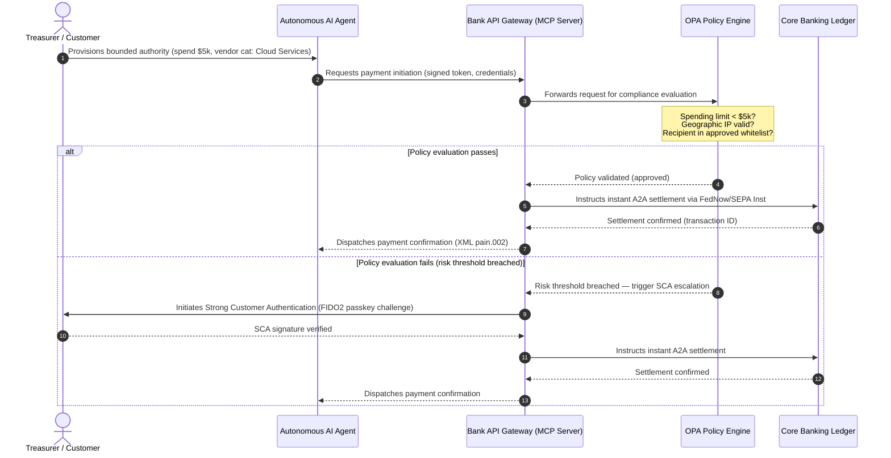

# Ìwòye Ìsanwó Àgbáyé 2026: Àpẹẹrẹ Ìṣiṣẹ́, Ewu, àti Owó-Wíwọlé nínú Ayé Agentic, Àìríhàn, Real-Time

Àyíká ìsanwó àgbáyé 2026 jẹ́ àsọtẹ́lẹ̀ nípa àwọn agbára mẹ́ta tí ó ń pàdé — agentic commerce, ìsanwó embedded àìríhàn, àti ìṣe real-time — tí ó jókòó lórí tokenised unified ledger lábẹ́ Project Agorá àti ìparí kíkí SWIFT structured-address November 2026.

<!-- lead-start -->
<aside class="post-lead" aria-label="Àkótán àkọsílẹ̀">

<strong>TL;DR.</strong> Ilẹ̀-òfin ìsanwó 2026 ti yí padà láti ìṣípòpadà ìránṣẹ́ sí àpẹẹrẹ ìṣiṣẹ́ olópò-ọ̀nà níbi tí ewu àti owó-wíwọlé ti ń jẹ́ ìdarí nípa ìṣe real-time. Àkọsílẹ̀ yìí ṣàkójọ àwọn ìwòye 2026 láti ọ̀dọ̀ J.P. Morgan, Global Payments, HSBC, àti Payments Association sínú ètò ìṣiṣẹ́ G-SIB onígẹ̀rẹ̀ mẹ́rin, tí ó bo agentic commerce tí àwòṣe bẹ̀rẹ̀, treasury APIs always-on, tokenised unified ledgers lábẹ́ BIS Project Agorá, àti àkókò ìparí SWIFT structured-address November 14, 2026.

<strong>Àwọn kókó pàtàkì</strong>

<ul class="post-lead-takeaways">
  <li><strong>Agentic commerce ṣí ààlà delegated-liability sílẹ̀.</strong> Wọ́n sọ àsọtẹ́lẹ̀ pé Autonomous AI agents yóò darí $3-$5 trillion nínú òwò ọdọọdún ní 2030. Àwọn báńkì gbọ́dọ̀ ṣe àlàyé MCP gatekeeping, SCA delegation lábẹ́ PSD3/PSR, àti ìní KYC/AML nínú àwọn ìkọ́ ìsanwó multi-agent.</li>
  <li><strong>Always-on liquidity ti di àpẹẹrẹ ìṣiṣẹ́ àti ìlànà báyìí.</strong> Treasury APIs 24/7 àti virtual accounts dín owó tí ó dí kú àti gbé ìgì ìfaradà ga. Lábẹ́ DORA, àwọn ọjà real-time liquidity gbọ́dọ̀ ní àtìlẹ́yìn ti geo-redundant, active-active infrastructure tí ó di 99.999% availability mú.</li>
  <li><strong>Tokenisation ti dé regulated unified ledgers.</strong> Project Agorá ni ìlànà public-private tí ó tóbi jùlọ fún tokenised commercial bank deposits àti central bank reserves. Àwọn báńkì nílò ìrìnàjò tokenisation tí ó ní ìgbésẹ̀ márùn-ún, pẹ̀lú ìtọ́jú prudential tí ó hàn gbangba.</li>
  <li><strong>Ìparí structured-address November 14, 2026 jẹ́ ọjọ́ kọ́pípa.</strong> Àwọn aaye unstructured postal address nínú àwọn ìránṣẹ́ CBPR+ àti SEPA yóò fa ìkọ̀sílẹ̀ kíákíá. Iṣẹ́ ìṣàkóso àkọsílẹ̀ mímọ́ kọjá àwọn ẹgbẹ́ ọjà, ìmọ̀-ẹ̀rọ, àti compliance ni a nílò.</li>
</ul>

<strong>Kíkà tó jọmọ́:</strong> <a href="https://sebastienrousseau.com/2026-06-23-iso-20022-pain001-programmable-liquidity-autonomic-treasury-2026">From Pain.001 to Programmable Liquidity: ISO 20022 as the Autonomic Nervous System of Treasury in 2026</a>, <a href="https://sebastienrousseau.com/2026-06-24-cross-border-iso-20022-open-finance-tokenised-deposits-treasury-2026">Cross-Border 2026: ISO 20022, Open Finance and Tokenised Deposits in Corporate Treasury</a>, <a href="https://sebastienrousseau.com/2026-06-25-quantum-dawn-cib-kyberlib-quantum-resilient-payments-stack-2026">Quantum Dawn for CIB: From KyberLib to a Quantum-Resilient Payments Stack</a>.

</aside>
<!-- lead-end -->

Fún àwọn global transaction banks, àyíká 2026-2028 jẹ́ fèrèsé ìṣètò. Infrastructure ìsanwó òde-òní kì í ṣe àlùmọ́ọ́nì ìṣàkóso mọ́ — ó jẹ́ ọkàn ìlànà ìmọ̀-ẹ̀rọ ipele báńkì. Nínú àwọn G-SIBs àti àwọn ilé-iṣẹ́ agbègbè pàtàkì, ìmọ̀-ẹ̀rọ, ìlànà, àti ìfẹ́ àwọn oníbàárà ti pàdé sí ọkọ̀ ìṣiṣẹ́ kan ṣoṣo.

Àwọn agbára mẹ́ta ṣàlàyé àyíká yìí, ọ̀kọ̀ọ̀kan sì darí tààrà sí ìbéèrè ipele alaṣẹ.

- **Agentic commerce** — pínpín ìkànnì, àpẹẹrẹ ọjà, fífún liability, àti Model Risk Management lábẹ́ àyẹ̀wò alábojútó.
- **Ìsanwó àìríhàn** — ìrírí oníbàárà, pẹ̀lú ewu disintermediation níbi tí àwọn báńkì kò ti bẹ́ ledger wọn sínú iwájú àwọn corporate àti àwọn olùtà.
- **Real-time execution** — yíyára olú, pẹ̀lú àyípadà sí ìṣàkóso liquidity, ewu credit, ìfaradà ìṣiṣẹ́, àti ìdábò bo fraud.

Ìgbọ̀nwọ́ ìṣúná jẹ́ pàtàkì. Fraud ń gbòòrò sí ní iyára àti ìmọ̀-ìjìnlẹ̀; àwọn àkókò ìparí ìlànà jẹ́ kíkí; àwọn báńkì tí ó ń sọ́nà mọ́ ìmọ̀-òde àwọn ètò ìpilẹ̀ wọn ń ṣí àwọn àǹfààní owó-wíwọlé pàtàkì. Iye iṣẹ́ àìṣiṣẹ́ jẹ́ òdìkejì: ìkọ̀sílẹ̀ ìṣòwò kíákíá, àdìnà ìṣiṣẹ́, ìjìyà ìlànà, àti ìparun ìpín ọjà yáyá.

## Ìpàdé àwọn alábojútó ìsanwó àgbáyé

Àkọsílẹ̀ yìí ṣàkójọ àwọn ìwòye ìsanwó àti òwò 2026 láti ọ̀dọ̀ àwọn ohùn aláṣẹ ilé-iṣẹ́ mẹ́rin — [J.P. Morgan Payments](https://www.jpmorgan.com/payments/newsroom/payments-outlook-2026-trends-report-released "J.P. Morgan Payments — Outlook 2026"), [Global Payments](https://investors.globalpayments.com/news-events/press-releases/detail/497/global-payments-releases-its-2026-commerce-and-payment "Global Payments — 2026 Commerce and Payment Trends Report"), HSBC, àti The Payments Association — ó sì fi wọ́n wé [G20 Roadmap for Enhancing Cross-Border Payments](https://www.fsb.org/2026/03/fsb-kicks-off-new-implementation-phase-to-enhance-cross-border-payments-through-public-private-partnership/ "FSB — cross-border payments implementation phase, March 2026").

Ọ̀kọ̀ọ̀kan ìṣètò sún mọ́ ètò náà láti igun ọjà tí ó yàtọ̀, ṣùgbọ́n àwárí wọn pàdé sí àwọn àìyípadà mẹ́ta.

1. **Instant, API-driven rails jẹ́ àpẹẹrẹ.** Wọ́n ti fi àwọn àpẹẹrẹ legacy batch-processing sí ẹ̀gbẹ́ fún àwọn ìṣàn cross-border àti iye gíga; iyára ìṣòwò nínú àwọn ìsọ̀rí wọ̀nyẹn ni a darí nípa always-on, real-time messaging.
2. **AI jẹ́ irokeke àti ìdábò.** Àwọn irinṣẹ́ generative àti deepfakes ń mú fraud ìṣòwò gbòòrò, tí ó fi mú àwọn ìdábò counter-defense real-time olópò-ìpele.
3. **Tokenisation jẹ́ infrastructure tí ó ti ṣetán fún production.** Àwọn ledgers ń pàdé láti gba tokenised commercial liabilities àti wholesale central bank digital currencies.

| Àkọsílẹ̀ | Àwùjọ ìpìlẹ̀ | Àfojúsùn | Gẹ̀rẹ̀ kókó | Ìtumọ̀ fún báńkì |
| --- | --- | --- | --- | --- |
| **J.P. Morgan Payments** | Àwọn olùṣàkóso treasury, G-SIBs | Real-time liquidity, fraud | APIs, AI biometrics | Tún ètò liquidity, FX, àti ewu kọ́ fún ìpín ìṣòwò 365-day tí ó ń bá a lọ. |
| **Global Payments** | Àwọn olùtà, e-commerce | Ìdàgbàsókè POS, omnichannel | Agentic commerce, checkout aláìní-ọ̀nà | Kọ́ àwọn ọ̀nà ìsanwó olùtà API-gated tí ó ní ààbò fún àwọn autonomous AI agents. |
| **HSBC Insights** | Àwọn corporates onípinlẹ̀-pupọ̀ | Ìṣíṣe ERP (SAP/Oracle), real-time cash | Treasury-as-a-Service, ìríran owó | Mú owó wọlé láti àwọn àkójọpọ̀ transactional API kí o sì bẹ́ ìjábọ̀ ledger real-time sí orísun. |
| **The Payments Association** | Àwọn fintechs, àwọn ilé-iṣẹ́ ìsanwó | Stablecoins, tokenisation, ìlànà àgbáyé | Àwọn ohun-ìní onítìlẹ́ tí a ṣàkóso, ìbámu ìlànà | Múrasílẹ̀ àwọn ìwé balance fún tokenised deposits kí o sì lọ kọjá àwọn ètò liability PSD3/PSR. |

Àwọn ìwòye mẹ́rin náà ṣàlàyé operating stack ti private-sector tí ó ń ṣiṣẹ́ lórí infrastructure ìlànà G20 ti public-sector, tí ó ń sọ ìpinnu ìlànà di àwọn ìpinnu gbangba lórí liquidity, tokenisation, àkọsílẹ̀, àti ìdarí fraud nínú àwọn báńkì.

## Gẹ̀rẹ̀ 1 — Agentic commerce àti àwọn ìsanwó àìríhàn

Agentic commerce ni ìyípadà láti checkout click-to-buy tí ènìyàn ń dáwọ́lé sí ìbẹ̀rẹ̀ ìṣòwò autonomous tí àwòṣe ń darí. Àwọn àsọtẹ́lẹ̀ ilé-iṣẹ́ pàdé sí $3-$5 trillion òwò ọdọọdún tí àwọn autonomous agents yóò darí ní 2030 — ìpín dígítì kan kéré nínú iye ìsanwó àgbáyé tí a ṣe láìsí ènìyàn tí ó ń tẹ 'buy'.

Ètò retail àti commercial ní àlàfo tí ó bá a mu. Èyí tí ó pọ̀ jùlọ nínú àwọn oníbàárà ń retí ìsanwó tí ó fẹ́rẹ̀ jẹ́ aláìní-ọ̀nà báyìí, síbẹ̀ àwọn olùtà tí kò tó ìdajì ti fi ọwọ́ kọ́kọ́ fún one-click checkout tàbí àwọn katálọ́gì ọjà API-accessible. Àwọn AI agents kò lè rin kiri àwọn ojú-ìwé checkout legacy oníọ̀pọ̀-ojú-ìwé tí a ṣe fún ojú ènìyàn; wọ́n nílò àwọn handshakes API machine-to-machine onígbékalẹ̀.

### Àwọn ohun tí ó ṣe pàtàkì fún báńkì àti ipa ìṣiṣẹ́

- **Ìní KYC àti AML.** Àwọn báńkì gbọ́dọ̀ ṣe àlàyé ẹni tí ó ní ojúṣe compliance nínú ìkọ́ ìṣòwò agentic. Bí AI agent àdáni oníbàárà bá bẹ̀rẹ̀ ìṣòwò nípasẹ̀ checkout agentic ti olùtà, báńkì gbọ́dọ̀ jẹ́rìí pé delegated authority tí ó bẹ̀rẹ̀ wà ní cryptographically bound sí olùgbé ìwé-iṣẹ́ ìpilẹ̀.
- **Tún liability àti chargeback ṣe.** A ṣe àwọn card schemes àti A2A rails ní àyíká fífúnni ní àṣẹ ènìyàn. Nígbà tí AI agent bá ra ohun tí kò tọ́ — fún àpẹẹrẹ, rírà ọjà ilé-iṣẹ́ tí kò bámu nítorí àṣìṣe data-parsing — àwọn báńkì gbọ́dọ̀ pín liability ní gbangba láàrín oníbàárà, olùpèsè agent, àti olùtà.
- **Sísọ ewu àwọn ìṣàn agentic.** Àwọn ẹ̀rọ payment routing gbọ́dọ̀ sọ ewu àwọn ìsanwó agentic ní dynamic, tí ó ń lo àwọn ìbéèrè reserve gíga tàbí àwọn ìwọ̀n interchange sí àwọn ìṣòwò tí kì í ṣe ènìyàn-bẹ̀rẹ̀ títí di àkókò tí ìpilẹ̀ ìpín dúró ṣinṣin yóò wà.

### Bounded action àti bounded authority

Láti dín "unbounded action" kù — agent procurement ilé-iṣẹ́ tí ó ń ṣiṣẹ́ ìkà ìrà recursive aláìlópin nítorí àṣìṣe software — àwọn báńkì gbọ́dọ̀ ṣe àfihàn **bounded-authority API gates**. Àwọn gates ń mú àwọn ààlà ipele-ìlànà gbé kọjá ìwọ̀n mẹ́ta.

1. **Tiered financial limits** — ìnáwó agent ní ìdíwọ̀n nípa iye ìṣòwò, iye àkójọpọ̀ ojoojúmọ́, àti ìsọ̀rí olùtà.
2. **Context-aware safeguards** — àwọn ìfihàn ẹlẹ́ẹ̀kejì (àkókò ọjọ́, geolocation IP, ìgbà ìṣòwò) tí a fi ojú wo kí ledger tó tu owó sílẹ̀.
3. **Human-in-the-loop escalation** — àṣẹ ènìyàn dandan tí Strong Customer Authentication (SCA) ń bẹ̀rẹ̀ lábẹ́ PSD3 / PSR nígbàkígbà tí ìṣòwò bá kọjá àwọn ìpalẹ̀ ewu.

Ìtẹ̀lé Mermaid ní isalẹ̀ fihàn àpẹẹrẹ tí ọ̀pọ̀ àwọn báńkì yóò mọ̀ gẹ́gẹ́ bí ìṣàn ìsanwó agentic bounded-authority.

### Model Context Protocol (MCP)

Láti so àwọn àwòṣe AI àdúgbò pọ̀ pẹ̀lú àwọn ipele ìṣiṣẹ́ tí báńkì ṣàkóso, ilé-iṣẹ́ ń ṣe ìparapọ̀ ní àyíká [Model Context Protocol (MCP)](https://modelcontextprotocol.io "Model Context Protocol — open standard for LLM tool integration") — open protocol tí ó jẹ́ kí àwọn LLMs pe àwọn irinṣẹ́ àti APIs tí a ṣàlàyé ní kíkún, tí a lè ṣe àyẹ̀wò, láìsí ìṣàmúlò òdòdó sí àwọn ètò ìpilẹ̀.

Yíyí àwọn banking APIs (bẹ̀rẹ̀ ìsanwó, ìbéèrè balance, ìfìdí ẹgbẹ́) sínú MCP server ń pa àwọn LLMs mọ́ kúrò ní àwọn tábìlì database àti àwọn ìdarí system-root. Àwòṣe náà ń bá ledger ṣiṣẹ́ nípasẹ̀ àwọn endpoints onígbékalẹ̀, tí a ṣe àyẹ̀wò, tí a fi ìwọ̀n bá nìkan — ààbò tí a fi mú lórí ààlà ìṣiṣẹ́ irinṣẹ́ agentic dípò tí a fi pamọ́ nínú àwòṣe.

## Gẹ̀rẹ̀ 2 — Ìyípadà treasury àti àtúnro liquidity

Iyára transaction banking ní 2026 ni a darí nípa ìyípadà láti batch processing tí ó parí ọjọ́ sí ìṣiṣẹ́ treasury always-on, real-time. Àwọn corporates onípinlẹ̀-pupọ̀ kò gba owó tí ó dí kú mọ́ — liquidity tí ó dúró láìṣe nínú àwọn ìwé-iṣẹ́ àdúgbò nígbà ọ̀sẹ̀-ìparí tàbí ọjọ́ ìsinmi nítorí àwọn ètò ìpín ti pa.

### Ọ̀ràn ètò-ọrọ̀ aje fún real-time liquidity

J.P. Morgan àti HSBC mejèèjì sọ pé àwọn corporates tí ó ní agbára real-time cash àti àkọsílẹ̀ tí ó tó sí jẹ́ bí ó ti yẹ tí ó tóbi láti kọjá àwọn ẹ̀gbẹ́ ní ìdàgbàsókè owó-wíwọlé àti agbára olú, lọ́pọ̀lọpọ̀ nípa dída liquidity tí ó dí kú kù àti dídárí àwọn àyíká working-capital.

Láti gba iye yẹn, àwọn báńkì ń tu **Treasury-as-a-Service (TaaS) API products** tí ó ń jẹ́ kí àwọn ERPs corporate (SAP, Oracle) so pọ̀ tààrà mọ́ ledger báńkì.

- **Real-time balance APIs** tí ó ń lo `camt.052` schema — tí ó ń yí àwọn protocols file-transfer padà pẹ̀lú ìjábọ̀ ipo-owó kíákíá, event-driven.
- **Bulk payment initiation APIs** tí ó ń lo `pain.001` — ìṣe ìsanwó olùtà tààrà, straight-through láti ledger ERP.
- **Continuous FX APIs** — àwọn ẹ̀rọ treasury ń tì àwọn ìwọ̀n foreign-exchange real-time, algorithmic mọ́ fún ìpín cross-border, tí ó ń dín ewu market-gap alẹ́ kù.
- **Virtual account APIs** — àwọn corporates ń ṣí kí o sì jáwọ́ nínú ẹgbẹẹgbẹ̀rún sub-accounts ní dynamic fún ìbámu receivables aládàáni àti ìyàsọ́tọ̀ ledger.

### Ìfaradà ìṣiṣẹ́ àti DORA

Pípèsè always-on liquidity ń yí ìwà ewu báńkì padà. Ètò gbọ́dọ̀ di **99.999% operational availability** mú lábẹ́ ìbálò ìtẹ̀síwájú, real-time.

Lábẹ́ [Digital Operational Resilience Act (DORA)](https://eur-lex.europa.eu/legal-content/EN/TXT/?uri=CELEX%3A32022R2554 "Regulation (EU) 2022/2554 — Digital Operational Resilience Act"), èyí kì í ṣe IT KPI — ó jẹ́ ìbéèrè ìlànà tí ó kíkí. Àwọn alábojútó retí kí àwọn báńkì fihàn pé real-time treasury API surface àti ledger database lè gba àwọn ìkọlù cyber líle ṣùgbọ́n tí ó ṣeé ṣe, ìdiwọ́ nẹtiwọọki, àti ìdiwọ́ hyperscaler láìsí dídìmú àwọn ìsanwó pàtàkì tàbí dídẹ̀tẹ̀ systemic liquidity. Èyí nílò geo-redundant, active-active multi-cloud database architectures, ipele ìmọ̀-irokeke real-time, àti failover aládàáni — tí ó hàn ní laini iye ìyípadà, kì í kàn ṣe nínú àkọsílẹ̀ àyẹ̀wò.

### Continuous FX àti ìmọ̀-ìjìnlẹ̀ cross-border

Real-time treasury kò lè gbé nínú ààlà oníowó kan. Àwọn G-SIBs ń ṣe àfihàn continuous FX infrastructure — ètò [Wire 365](https://www.jpmorgan.com/insights/payments/fx-cross-border/wire-365-global-clearing "J.P. Morgan — Wire 365 global clearing reinvented") ti J.P. Morgan ń ṣe àwọn ìsanwó cross-border àti àwọn ìyípadà FX ní ọjọ́ kankan nínú ọdún, kọjá àwọn wákàtí RTGS central-bank ìbílẹ̀. Ipele yẹn ń bá tokenised-deposit àti àwọn ètò unified-ledger tí a sọ̀rọ̀ nípa rẹ̀ ní Gẹ̀rẹ̀ 3 ṣiṣẹ́ tààrà.

## Gẹ̀rẹ̀ 3 — Tokenised deposits àti unified ledger

Tokenisation ti yí padà láti àwọn ìdánwò proof-of-concept tí a yà sí ọ̀tọ̀ sí infrastructure monetary ipele-báńkì tí ó tóbi. Àfojúsùn ti yí padà láti àwọn private stablecoins àti àwọn cryptoassets ìṣèrò sí **tokenised commercial bank deposits** àti **wholesale central bank digital currencies (wCBDCs)** tí ó ń ṣiṣẹ́ lórí programmable unified ledgers.

Ìlànà ìtọ́ka ni [Project Agorá](https://www.bis.org/about/bisih/topics/fmis/agora.htm "BIS Project Agorá — tokenisation of wholesale cross-border payments") — ìfọwọ́sowọ́pọ̀ public-private pàtàkì tí BIS àti IIF pe, tí ó kan àwọn central banks méje àti àwọn ilé-iṣẹ́ ìṣúná àdáni ju 40 lọ. Ètò náà ń ṣàwárí bí àwọn tokenised commercial bank deposits ṣe ń pàdé pẹ̀lú àwọn tokenised wholesale CBDCs lórí shared programmable ledger láti yọ àdìnà ìpín cross-border kúrò, ṣe ìṣètò àwọn àyẹ̀wò compliance, kí o sì jẹ́ kí 24/7 atomic finality ṣeé ṣe.

### Ìrìnàjò tokenisation oníìgbésẹ̀ márùn-ún

Fún àwọn G-SIBs àti àwọn báńkì agbègbè pàtàkì, tokenisation jẹ́ ìrìnàjò onígbésẹ̀ láti dídárí inú sí ìbáṣepọ̀ ọjà-ṣíṣí.

1. **Internal treasury liquidity** — ṣíṣe tokenisation àwọn balances cash corporate inú (fún àpẹẹrẹ JPM Coin tàbí àwọn ledger báńkì àdáni dọ́gba) láti jẹ́ kí ìfìrànṣẹ́ cross-border kíákíá, 24/7 àti netting kọjá àwọn ẹ̀ka báńkì.
2. **Bounded multi-bank corridors** — àwọn consortia tí a ti pa, tí a ṣàkóso (Project Agorá sandbox) láti ṣe ìdánwò ìpín interbank àti shared ledger state kọjá àwọn ilé-iṣẹ́ ọ̀tọ̀ọ̀tọ̀.
3. **Continuous programmable FX** — àwọn smart contracts lórí unified ledger ń ṣe instant Payment-versus-Payment (PvP) FX, tí ó ń yọ ewu ìpín kúrò kọjá àwọn agbègbè àkókò.
4. **Tokenised real-world assets (RWAs)** — ẹsẹ̀ tokenised cash ń pàdé pẹ̀lú àwọn tokenised securities, ìgbèsè, tàbí àwọn ledgers ìṣòwò fún instant Delivery-versus-Payment (DvP) finality, tí ó ń dín capital lock-up kù láti àwọn ọjọ́ sí milliseconds.
5. **Regulated public/hybrid interoperability** — àwọn secure gateway wrappers ń jẹ́ kí institutional liquidity bá àwọn nẹtiwọọki ọ̀nà-ìṣíṣí àbólóde ṣiṣẹ́ ní àìléwu.

### Ìtumọ̀ prudential àti ìwé balance

Ó gbọ́dọ̀ ṣẹ̀tọ́ tokenised cash kọjá àwọn ìlànà prudential pẹ̀lú ìṣọ́ra. Àwọn alábojútó tẹnumọ́ pé tokenised deposit gbọ́dọ̀ jẹ́ dọ́gba ní ètò-ọrọ̀ aje sí commercial bank deposit ìbílẹ̀ — tí ó ní ìtumọ̀ unsecured liability lórí ìwé balance báńkì pẹ̀lú ìbo deposit-insurance kan.

Lórí ìṣiṣẹ́, tokenised deposits ń mú àwọn ewu wá tí classical liquidity stress models kò ṣe láti ṣe àfihàn. Smart contracts ń ṣe àwọn programmable withdrawals ní iyára àti iye tí àwọn àròkàn legacy kò gbé. Lábẹ́ Basel III, àwọn báńkì gbọ́dọ̀ rí i pé risk engine lè ṣe àpẹẹrẹ programmable cash run-offs àti pé tokenised ledger ń bá àwọn ètò legacy RTGS ṣiṣẹ́ ní mímọ́ kọjá àyíká liquidity ojoojúmọ́.

### Stablecoins vs tokenised deposits — ipo onírúurú

Àwọn private fully-reserved stablecoins (USDC, àti bẹ́ẹ̀ bẹ́ẹ̀ lọ) ń bá a lọ láti gba ìpín ọjà nínú retail cross-border remittance àti decentralised commerce, ṣùgbọ́n kò ní agbára credit-creation àti settlement finality ti ètò commercial banking.

Dípò ìfigagbága lórí retail rails, àwọn transaction banks ń ṣe àfihàn custody, tí ó ń tu àwọn regulated tokenised liability instruments tiwọn, kí ó sì kọ́ àwọn secure on-/off-ramp gateways. Àwọn oníbàárà corporate ń gba ìṣòro programming nígbà tí ó pa olú mọ́ inú ààlà tí a ṣàkóso.

### Àwọn ìbéèrè tí board kan gbọ́dọ̀ béèrè nípa tokenised money

- **Ìkópa unified ledger.** Kí ni roadmap ìmọ̀ràn ṣiṣẹ́ wa fún kíkópa nínú wholesale public-private unified-ledger initiatives bí Project Agorá?
- **Ìṣàpẹẹrẹ ìwé balance àti ewu.** Ṣé àwọn risk engines wa àti àwọn ìlànà capital-adequacy wa ti tún stress-testing ṣe láti tọ́jú iyára ti smart-contract-triggered token run-offs?
- **Àwọn ìsọ̀rí oníbàárà àkọ́kọ́.** Èwo nínú àwọn ìsọ̀rí oníbàárà corporate-treasury àti commercial-banking wa yóò ní àǹfààní kíákíá láti ipin programmable, tokenised DvP/PvP?

## Gẹ̀rẹ̀ 4 — Àkọsílẹ̀ onígbékalẹ̀ àti ìdábò fraud

Compliance infrastructure ní 2026 jẹ́ ìjọba **November 14, 2026 structured-address cut-over** tí a fi mú lábẹ́ [SWIFT Standards Release (SR) 2026](https://www.swift.com/standards/iso-20022/removal-unstructured-address "SWIFT — Removal of unstructured address, November 2026"). Láti ọjọ́ yẹn, àwọn nẹtiwọọki ìsanwó CBPR+ àti SEPA dúró láti gba àwọn àwòrán postal address free-text unstructured tó kún (`<AdrLine>`) nínú àwọn ìránṣẹ́ ìsanwó. Èyíkéyìí ìránṣẹ́ cross-border tàbí àdúgbò tí ó gbé unstructured address ní ibi tí a ti retí structured elements yóò di dídi tàbí kọ̀sílẹ̀ nípa nẹtiwọọki.

Pupọ̀ àwọn ilé-iṣẹ́ mọ ọjọ́ náà. Pupọ̀ ń tọ́jú rẹ̀ gẹ́gẹ́ bí iṣẹ́ ìṣàkóso ojú-ìwé. Òtítọ́ ni ìṣòro data-quality àti data-governance jíjìn jù. Láti yẹra fún àwọn ìwọ̀n ìkọ̀sílẹ̀ ìparun, ìṣiṣẹ́ ìsanwó nílò ìlànà ìṣàkóso cross-functional tí ó kún.

- **Ọjà àti ìṣiṣẹ́.** Gbígba àkọsílẹ̀ ní orísun. Àwọn digital portals tí ó kojú oníbàárà, àwọn interfaces onboarding, àti àwọn aaye input ERP corporate gbọ́dọ̀ mú àwọn aaye structured address (`<StrtNm>`, `<PstCd>`, `<TwnNm>`, `<Ctry>`) ṣiṣẹ́ ní ààyè bẹ̀rẹ̀ ìsanwó.
- **Ìmọ̀-ẹ̀rọ.** Parsing, mapping, schema validation. Àwọn ẹ̀rọ validation ń da àwọn fáìlì legacy dúró kí wọ́n tó dé interface SWIFT. Àwọn machine-learning models tí a ti gbé kalẹ̀ ní àdúgbò ń parse àwọn àwòrán address unstructured legacy sínú àwọn XML-compliant tags lábẹ́ `<PstlAdr>`.
- **Compliance àti ewu.** Sanctions screening, transaction monitoring, àti AML logic tí a ti tún ṣe láti gba àwọn structured XML fields wọlé — tí ó ń dín ìwọ̀n false-positive àti àwọn ìwádìí ọwọ́ kù.

### Ọ̀ràn òwò fún àkọsílẹ̀ onígbékalẹ̀

Bí a bá tọ́jú rẹ̀ gẹ́gẹ́ bí iye compliance, ètò structured-data fẹ́ owó. Bí a bá tọ́jú rẹ̀ gẹ́gẹ́ bí olùṣe owó-wíwọlé, ó san fún ara rẹ̀.

1. **Advanced credit decisioning.** Structured invoice, remittance, àti ultimate-debtor data ń jẹ́ kí àwọn báńkì kọ́ àwọn ètò working-capital financing aládàáni, gbangba àti ètò supply-chain invoice-factoring fún àwọn oníbàárà corporate.
2. **Automated receivables matching.** Fífi structured party àti àwọn invoice identifiers hàn ń ṣe àtìlẹ́yìn àwọn ọjà cash-reconciliation premium àti virtual-account pooling, tí ó ń mú owó-wíwọlé ìṣòwò-iye tuntun jáde.
3. **Monetisable transaction analytics.** Àwọn báńkì ń ṣe àkójọ kí wọ́n sì ta àwọn granular real-time liquidity àti àwọn dashboards purchasing-pattern analytics fún àwọn CFOs corporate àti àwọn treasurers.

### Layered AI fraud defense

Bí àwọn iyára ìṣòwò ṣe ń gbòòrò sí real-time, àwọn ọ̀nà fraud ti gbòòrò. Ìwádìí tuntun fihàn pé deepfakes jẹ́ nǹkan bí 40% nínú àwọn ìgbìyànjú biometric fraud, pẹ̀lú synthetic media tí a ń lò sí i láti kọjá àwọn ìdarí voice àti facial-recognition nínú onboarding àti àwọn ìṣàn ìsanwó.

Ìdábò náà jẹ́ **three-layer AI fraud model**.

1. **Identity layer.** [FIDO2](https://fidoalliance.org/fido2/ "FIDO Alliance — FIDO2 specification") passkeys tí a ti jẹ́rìí biometrically, hardware device-binding tí a ti fi cryptographic signature sí, àti decentralised digital ID wallets láti dáàbò bo wíwọlé ìsanwó.
2. **Behavioural layer.** Behavioural biometrics tí ó ń bá a lọ — pacing ti session navigation, ìṣe typing, ìṣètò ẹrọ — láti rí àwọn ìṣe bot aládàáni tàbí àwọn ìgbìyànjú session-hijack.
3. **Transaction layer.** Àwọn structured fields ti ISO 20022 ń bọ́ sí àwọn real-time machine-learning risk engines, tí ó ń tọ́ka transaction metadata pẹ̀lú àwọn network-level consortium intelligence láti rí àwọn ìṣòwò ìfura nínú milliseconds ti ìbẹ̀rẹ̀.

Láti tẹ́ àwọn alábojútó lọ́rùn, àwọn àwòṣe AI ipele-transaction ní àwọn **explainability parameters** tí ó kíkí, wọ́n sì ń ṣiṣẹ́ lábẹ́ ètò Model Risk Management (MRM) tí ó yàtọ̀. Àwọn alábojútó retí kí àwọn báńkì ṣàlàyé àwọn àkọsílẹ̀ kíkún àti algorithmic logic tí ó fa àdíbó aládàáni tàbí ìkìlọ̀ fraud, ní ìbámu pẹ̀lú [US Federal Reserve SR 11-7](https://www.federalreserve.gov/frrs/guidance/supervisory-guidance-on-model-risk-management.htm "US Federal Reserve — Supervisory Guidance on Model Risk Management, SR 11-7") àti [PRA SS1/23](https://www.bankofengland.co.uk/prudential-regulation/publication/2023/may/model-risk-management-principles-for-banks-ss "Bank of England PRA SS1/23 — Model Risk Management principles for banks") ti Bank of England.

## Ètò boardroom 2026-2028

Láti ṣe kọjá àwọn gẹ̀rẹ̀ mẹ́rin, àwọn ẹgbẹ́ ìṣàkóso báńkì G-SIB àti agbègbè gbọ́dọ̀ ṣètò àwọn ìnáwó ìṣiṣẹ́ àti ìmọ̀-ẹ̀rọ ní àyíká roadmap horizon-mẹ́ta tí ó gbangba.

### Horizon 1 — Compliance kíákíá àti dídimú ìpilẹ̀ mú (0-12 oṣù)

- **Àfojúsùn.** Ṣe àpẹẹrẹ ISO 20022 data quality kí o sì pa àwọn ọ̀nà transaction real-time ìpilẹ̀ mọ́ ní ààbò.
- **Àmì àṣeyọrí (KPI).** Zero unstructured-address rejections lórí SWIFT àti SEPA lẹ́yìn ìparí November 14, 2026.
- **Olùṣàkóso alaṣẹ.** Chief Operating Officer / Olùdarí Payment Operations.
- **Irú ìpèsè.** Ìṣiṣẹ́ aláìní-bànújẹ́. Àwọn ìmúdájú core database schema àti SWIFT SR 2026 validation engine.

### Horizon 2 — Automation àti bounded agentic safeguards (12-24 oṣù)

- **Àfojúsùn.** Bounded agentic API gates àti àpẹẹrẹ ìdábò fraud tí ó ń bá a lọ.
- **Àmì àṣeyọrí (KPI).** 100% àwọn ìṣòwò API machine-to-machine àti AI-initiated tí FIDO2 hardware binding àti àwọn ẹ̀rọ ìlànà bounded-authority ti jẹ́rìí.
- **Olùṣàkóso alaṣẹ.** Chief Information Officer / Chief Risk Officer.
- **Irú ìpèsè.** Ìṣiṣẹ́ aláìní-bànújẹ́ (ìdábò fraud) pẹ̀lú àṣàyàn ìmọ̀ràn (agentic commerce). MCP rollout àti three-layer fraud AI.

### Horizon 3 — Platform tokenisation àti unified ledgers (24-36 oṣù)

- **Àfojúsùn.** Yí àwọn ohun-ìní treasury padà sí tokenised deposits kí o sì kópa nínú shared cross-border ledgers.
- **Àmì àṣeyọrí (KPI).** Ó kéré tán 15% iye corporate treasury settlement gíga tí a ṣe ní ti ara nípasẹ̀ tokenised deposit instruments tàbí unified-ledger arrangements (fún àpẹẹrẹ àwọn ọ̀nà Project Agorá).
- **Olùṣàkóso alaṣẹ.** Group Treasurer / Olùdarí Transaction Banking.
- **Irú ìpèsè.** Àṣàyàn ìmọ̀ràn. Programmable ledger infrastructure, smart-contract liquidity rules, àwọn DvP/PvP settlement adapters.

## FAQ

**Ṣé agentic commerce yóò dé $3-$5 trillion ní 2030 lóòótọ́?**
McKinsey baseline ń tọ́ka sí $5 trillion òwò agentic ní 2030, pẹ̀lú àwọn àsọtẹ́lẹ̀ ọ̀tọ̀ọ̀tọ̀ tí ó pèjọ láàrín $3 trillion àti $5 trillion. Ìyàtọ̀ náà fihàn bí àwọn olùtà ṣe ń tu àwọn checkout APIs machine-readable kíkankíkan àti bí àwọn báńkì ṣe ń jẹ́ kí àwọn agents ṣe ìṣòwò lábẹ́ SCA delegation — bottleneck wà ní ẹgbẹ́ báńkì àti olùtà, kì í ṣe ní agbára agent.

**Ṣé SWIFT cut-over November 14, 2026 lò fún àwọn ìṣàn SEPA àdúgbò pẹ̀lú?**
Bẹ́ẹ̀ ni. Ìbéèrè structured-address lò fún CBPR+ cross-border àti àwọn ìránṣẹ́ ìsanwó SEPA. Àwọn báńkì tí ó ń ṣiṣẹ́ àwọn rails méjèèjì nílò canonical address schema kan lókè ti SWIFT interface, kì í ṣe mappings méjì tí ó jọra.

**Ṣé tokenised deposit jọ stablecoin?**
Rárá. Tokenised deposit jẹ́ unsecured liability lórí ìwé balance báńkì tí a ṣàkóso, pẹ̀lú ìbo deposit-insurance kan náà bí deposit ìbílẹ̀. Stablecoin sábà jẹ́ fully-reserved instrument tí a tu láti ọ̀dọ̀ non-bank, láìsí agbára credit-creation. Àpẹẹrẹ Project Agorá ronú pé tokenised deposits sí pẹ̀lú wholesale CBDCs lórí shared programmable ledger; stablecoins kò wà nínú ẹsẹ̀ wholesale settlement.

**Bí Project Agorá ṣe bá àwọn wCBDC pilots tí ó wà ṣiṣẹ́?**
Agorá ni ìlànà ìparapọ̀. Àwọn àdánwò wCBDC orílẹ̀-èdè bo ẹsẹ̀ central-bank-money; Agorá ń mú tokenised commercial deposits wá lórí programmable ledger kan náà kí ìpín cross-border bá jẹ́ atomic kọjá àwọn ìrú owó méjèèjì. Àwọn central banks méje tí ó ń kópa àti àwọn ilé-iṣẹ́ àdáni 40+ jẹ́ kí ó tóbi jùlọ ní public-private design ground fún àpẹẹrẹ wholesale tokenised money.

**Kí ni ìpòlépò DORA compliance kéréjùlọ fún TaaS API?**
Geo-redundant active-active deployment, severe-but-plausible cyber scenarios tí a ti kọsílẹ̀ pẹ̀lú àwọn olùṣàkóso tí a dárúkọ lábẹ́ SM&CR (UK), àti failover tí a ti dán wò tí kò dìmú àwọn ìsanwó pàtàkì. Láìsí èyí, TaaS product jẹ́ ìlànà liability kí ó tó di laini owó-wíwọlé.

## Àwọn Ìtọ́ka

- Bank for International Settlements (BIS) Innovation Hub. (2026). *Project Agorá: exploring tokenisation of wholesale cross-border payments*. [BIS Project Agorá](https://www.bis.org/about/bisih/topics/fmis/agora.htm).
- Deutsche Bank. (2026). *Digital Money: a perspective on stablecoins, tokenised deposits and CBDCs*. [Deutsche Bank Flow](https://flow.db.com/publications/flow-white-papers-and-guides/digital-money-a-perspective-on-stablecoins-tokenised-deposits-and-cbdcs).
- European Parliament and Council. (2022). *Regulation (EU) 2022/2554 on Digital Operational Resilience (DORA)*. [DORA Regulation](https://eur-lex.europa.eu/legal-content/EN/TXT/?uri=CELEX%3A32022R2554).
- Financial Stability Board. (2026). *FSB kicks off new implementation phase to enhance cross-border payments*. [FSB statement](https://www.fsb.org/2026/03/fsb-kicks-off-new-implementation-phase-to-enhance-cross-border-payments-through-public-private-partnership/).
- Global Payments. (2025). *2026 Commerce and Payment Trends Report — press release*. [Global Payments press release](https://investors.globalpayments.com/news-events/press-releases/detail/497/global-payments-releases-its-2026-commerce-and-payment).
- J.P. Morgan Payments. (2026). *Payments Outlook 2026 Trends Report Released*. [J.P. Morgan Newsroom](https://www.jpmorgan.com/payments/newsroom/payments-outlook-2026-trends-report-released).
- J.P. Morgan Insights. (2026). *5 Payment Trends to Watch for in 2026*. [J.P. Morgan Trends](https://www.jpmorgan.com/insights/payments/trends-innovation/five-payment-trends-in-2026).
- J.P. Morgan FX & Cross-Border. (2026). *Wire 365: Global Clearing Reinvented*. [J.P. Morgan FX Wire 365](https://www.jpmorgan.com/insights/payments/fx-cross-border/wire-365-global-clearing).
- SWIFT. (2026). *ISO 20022 milestone for November 2026: unstructured addresses to be removed*. [SWIFT ISO 20022 Milestone](https://www.swift.com/news-events/news/iso-20022-milestone-november-2026-unstructured-addresses-be-removed).
- SWIFT Standards. (2026). *Removal of unstructured address*. [SWIFT Standards](https://www.swift.com/standards/iso-20022/removal-unstructured-address).
- Bank of England. (2023). *Supervisory Statement (SS1/23) — Model Risk Management principles for banks*. [Bank of England PRA SS1/23](https://www.bankofengland.co.uk/prudential-regulation/publication/2023/may/model-risk-management-principles-for-banks-ss).
- US Federal Reserve. (2011). *Supervisory Guidance on Model Risk Management (SR 11-7)*. [SR 11-7](https://www.federalreserve.gov/frrs/guidance/supervisory-guidance-on-model-risk-management.htm).
- McKinsey & Company. (2025). *McKinsey forecast: $5 trillion in agentic commerce sales by 2030* (via Digital Commerce 360). [McKinsey agentic forecast](https://www.digitalcommerce360.com/2025/10/20/mckinsey-forecast-5-trillion-agentic-commerce-sales-2030/).
- HSBC Business. (2026). *HSBC Business Insights*. [HSBC Insights](https://www.business.hsbc.com/en-gb/insights).
- Bright Defense. (2026). *Deepfake Statistics: A Growing Security Concern*. [Deepfake fraud statistics](https://www.brightdefense.com/resources/deepfake-statistics/).
- European Banking Authority. (2019). *Guidelines on outsourcing arrangements (EBA/GL/2019/02)*. [EBA Outsourcing Guidelines](https://www.eba.europa.eu/regulation-and-policy/internal-governance/guidelines-on-outsourcing-arrangements).

<!-- enrich-start -->
<aside class="author-card" aria-label="Nípa onkọ̀wé"><strong class="author-card-name"><a href="/about/index.html">Sebastien Rousseau</a></strong>Onímọ̀-ẹ̀rọ báńkì àgbà tí ó ń kọ̀wé lórí applied AI, ìṣípòpadà ISO 20022, post-quantum cryptography fún àwọn iṣẹ́ ìṣúná, àti ìyípadà ìṣètò ti wholesale payments.Ọdún 20+ kọjá HSBC Commercial &amp; Investment Bank, PayPal, Barclays, Shazam, AKQA, Virgin Group. <a href="/about/index.html">Profaili kíkún</a> &middot; <a href="https://www.linkedin.com/in/sebastienrousseau/" rel="external noopener">LinkedIn</a> &middot; <a href="https://github.com/sebastienrousseau" rel="external noopener">GitHub</a></aside>

Àyẹ̀wò ìkẹyìn <time datetime="2026-06-25">2026-06-25</time>.

<!-- enrich-end -->
