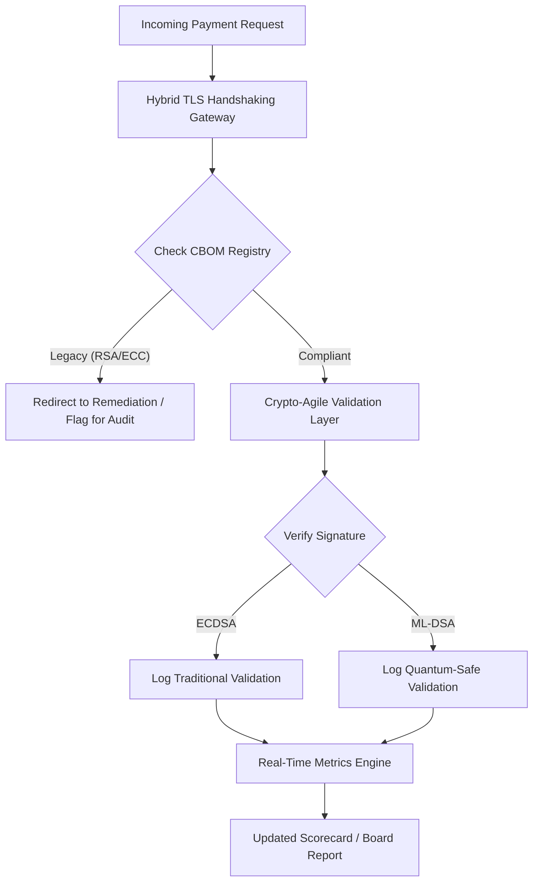

# Ìwé-Ìdíwọ̀n Ààbò Lẹ́yìn-Quantum 2026: Ìlànà Àmì Ìpele-Ìgbìmọ̀ Olórí fún Crypto-Agility Fiduciary

<aside class="post-lead" aria-label="Ìsọnísókí àkòrí">

<strong>TL;DR.</strong> Ní Òṣù Kẹfà 2026, cryptography lẹ́yìn-quantum (PQC) ti yẹsẹ̀ kúrò nínú ọ̀ràn ìmọ̀-ẹ̀rọ àdánwò sí ojúṣe fiduciary àkọ́kọ́. Àwọn ìgbìmọ̀ olórí gbọ́dọ̀ bojú tó ìṣíkiri ètò ti cryptography àtijọ́ sí àwọn ìpilẹ̀ṣẹ̀ NIST FIPS 203 àti 204 láti dín àwọn ewu ìnáwó àti ìṣiṣẹ́ àárín-ètò kù lábẹ́ DORA.

<strong>Àwọn àyọkà pàtàkì</strong>

<ul class="post-lead-takeaways">
  <li><strong>Ìbámu G20 àti àwọn ọjọ́ kẹ́yìn tó muna.</strong> Àwọn alábòójútó àgbáyé ti gbé àwọn ọdún ìpẹ̀kun-2020 kalẹ̀ gẹ́gẹ́ bí ọjọ́ kẹ́yìn tó muna fún ìyẹsẹ̀ aláìléwu-quantum, tí ó ń béèrè pé kí àwọn àjọṣe fi ìtẹ̀síwájú ìṣíkiri tí a lè wọ̀n hàn.</li>
  <li><strong>Cryptographic Bill of Materials (CBOM).</strong> Lẹ́gbẹ̀ẹ́ BOM software, CBOM jẹ́ àkójọpọ̀ ìwòye, aládàṣe, tó wà ní àkókò-gidi ti gbogbo dúkìá cryptography — tó pọn dandan láti rí àfihàn kọjá ẹ̀wọ̀n ìpèsè.</li>
  <li><strong>Ìfihàn Harvest-Now-Decrypt-Later (HNDL).</strong> Àwọn ọ̀tá ń gbá ẹrù dátà ìsanwó wholesale tó wúwo tí a fi cryptography bò mú lóòótọ́ báyìí, wọ́n sì ń pa á mọ́; dída èyí kù béèrè ìfisẹ̀ kíákíá ti àwọn ìpilẹ̀ṣẹ̀ PQC arabara.</li>
  <li><strong>Ìṣàkóso fiduciary nípasẹ̀ crypto-agility.</strong> Crypto-agility jẹ́ àmì ìṣàkóso tí a lè wọ̀n. Agbára láti yí àwọn primitive cryptography padà láìnílò ìmọ̀-ẹ̀rọ pàtó tuntun (lílo àwọn ìpilẹ̀ bíi KyberLib) báyìí jẹ́ ojúṣe ìpele-ìgbìmọ̀ olórí lábẹ́ SM&CR.</li>
</ul>

<strong>Àwọn ìwé tó jẹmọ́:</strong> <a href="https://sebastienrousseau.com/2026-06-12-kyberlib-post-quantum-banking-migration-standards-code-2026">KyberLib àti Ìṣíkiri Báńkì Lẹ́yìn-Quantum ní 2026</a>, <a href="https://sebastienrousseau.com/2023-11-19-crystals-kyber-the-safeguarding-algorithm-in-a-quantum-age/index.html">CRYSTALS-Kyber: Algorithm Olùdáàbò ní Sànmánì Quantum</a>.

</aside>
Ààbò lẹ́yìn-quantum kì í ṣe iṣẹ́ ìwádìí mọ́. "Aago alábòójútó" ń lu sí àwọn ọjọ́ kẹ́yìn ìmúdájú ìpẹ̀kun-2020. Ìparí [NIST FIPS 203 (ML-KEM)](https://csrc.nist.gov/pubs/fips/203/final) àti [NIST FIPS 204 (ML-DSA)](https://csrc.nist.gov/pubs/fips/204/final) ti gbé àwọn ìpilẹ̀ṣẹ̀ fún key encapsulation àti àmì-ìdánimọ̀ oníṣirò kalẹ̀ gẹ́gẹ́ bí òfin.

Àwọn ìgbìmọ̀ alábòójútó báyìí ń retí pé kí àwọn báńkì Ìpele-1 lọ ré jù àwọn ètò àdánwò lọ. Ní 2026, ìfojúsùn ti yí padà sí ìṣiṣẹ́-lórí-fífẹ̀ ti àwọn ìpilẹ̀ṣẹ̀ wọ̀nyí. Kíkùnà láti fi ọ̀nà ìṣíkiri tó kedere hàn ń gbé ìjìyà ìlànà tó wúwo lábẹ́ [Digital Operational Resilience Act (DORA)](https://eur-lex.europa.eu/eli/reg/2022/2554/oj) àti ojúṣe ti ara ẹni tó ṣeéṣe fún àwọn olùdarí tí wọ́n bá tan ojú àwọn ewu ti ìpalẹ̀ quantum tí a lè rí síwájú.

## 01. Ìwé-Ìdíwọ̀n Quantum Ìpele-Ìgbìmọ̀ Olórí

Àwọn àmì wọ̀nyí ń pèsè ìlànà ìdíwọ̀n fún àwọn ìgbìmọ̀ olórí láti ṣe àyẹ̀wò ìmúrasílẹ̀ quantum àti ìlera cryptography kọjá àwọn ohun-ìní Báńkì Ìṣòwò àti Báńkì Ìnáwó (CIB).

### Tábìlì 1: Àwọn àmì Ìwé-Ìdíwọ̀n PQC àti àwọn ààlà

| Àmì | Ìṣirò Mathematics | Ààlà tí Ìgbìmọ̀ Olórí Fi Aṣẹ Sí | Ewu Tí Ó Bá Kọjá Ààlà |
| ---- | ---- | ---- | ---- |
| **Inventory Completeness Percentage (ICP)** | (Dúkìá Crypto Tí A Damọ̀ / Àpapọ̀ Dúkìá Tí A Fojúrí) × 100 | > 98% | Cryptography òjìji àti àwọn ojú-aláìmọ̀ nínú àwọn ọ̀nà dátà clearing tó wúwo. |
| **HNDL Exposure Rate (HER)** | (Dátà Pípẹ́-Wà lórí Crypto Àtijọ́ / Àpapọ̀ Dátà Pípẹ́-Wà) × 100 | < 5% | Ìpalẹ̀ títí láé ti àṣírí ìṣòwò, àkójọ gbèsè ìjọba, àti àwọn ìwé ìsanwó wholesale. |
| **NIST Migration Progress Rate (MPR)** | (Àwọn Ètò tó ń lo FIPS 203/204 / Àpapọ̀ Àwọn Ètò Pàtàkì) × 100 | > 60% (kí ìparí 2026) | Àìbámu ìlànà àti yíyọ kúrò nínú ẹgbẹ́ àwọn alábàásepọ̀ tó bá G20 mu. |
| **Crypto-Agility Readiness Index (CARI)** | (Àwọn Ohun-èlò Pẹ̀lú Ìpele Crypto Abstract / Àpapọ̀ Àwọn Ohun-èlò Pàtàkì) × 100 | > 85% | Gbèsè ìmọ̀-ẹ̀rọ nínkan àti àìlágbára láti dáhùn sí àwọn ìfayọkúrò algorithm ọjọ́-ọ̀la. |

## 02. Cryptographic Bill of Materials (CBOM)

Àmì ICP ni a fi ìpilẹ̀ sí nípasẹ̀ **Ipele Àwárí CBOM** tó pé. Èyí jẹ́ ìṣe aládàṣe tó ń damọ̀ gbogbo ojú-iṣẹ́ cryptography nínú àjọṣe.

- **Àwárí Ojú-iṣẹ́:** Ṣíṣe àyẹ̀wò àwọn nẹ́tíwọ́kì àdúgbò àti cloud fún àwọn àkójọ TLS tó ń ṣiṣẹ́ láti damọ̀ lílo RSA tàbí ECC àtijọ́.
- **Àkójọpọ̀ Kọ́kọ́rọ́:** Ṣíṣe ìṣàkóso àwọn bata kọ́kọ́rọ́ àfihàn/àdáni sí àwọn olúwa wọn àti ṣíṣe ìṣàkóso àwọn ọjọ́ ìparí lójú.
- **Ìṣàkóso Ìgbáralé:** Damọ̀ àwọn ìpilẹ̀ ẹlẹ́ni-kẹta àti àwọn API tó ń gbáralé àwọn algorithm tí a ti fayọ kúrò.

Ipele àwárí yìí ń dá orísun otítọ́ kan ṣoṣo sílẹ̀, ó ń jẹ́ kí CISO lè ṣe ìròyìn lórí ìlera cryptography pẹ̀lú àfihàn tó dọ́gba pẹ̀lú ìṣẹ́gun ìnáwó.

## 03. Yíyọ Ìfihàn HNDL Kúrò Nínú Àwọn Ìsanwó Wholesale

Àwọn ọ̀tá ń fojú sún àwọn ìsanwó wholesale àti àwọn àkójọ corporate pípẹ́-wà nísinsìnyí. Àwọn ìkọlu "Harvest-Now-Decrypt-Later" (HNDL) yìí ní gbígbá àti pípa àwọn ìjò ọ̀tà encrypted tí ó ń ṣẹlẹ̀ lónìí mọ́.

Kódà bí cryptographically relevant quantum computer (CRQC) kò bá tiẹ̀ wà lónìí, dátà tí a gbá báyìí yóò di aláìní ààbò ní ọjọ́-ọ̀la. Dída èyí kù béèrè ìṣíkiri ohun pàtàkì jùlọ ti dátà pípẹ́-wà (bí àpẹẹrẹ, àwọn ìwé ìdánimọ̀, àwọn àdéhùn bond ọdún-30, àti àwọn àkójọ òfin), èyí tí ó ń dín àmì HER kù tààrà. Gígbé àwọn ọ̀nà ìsanwó sókè sí encryption PQC-ìbílẹ̀ arabara (lílo ML-KEM lẹ́gbẹ̀ẹ́ X25519) ń pèsè ààbò kíákíá lòdì sí àwọn ewu àkójọ.

## 04. Ṣíṣe Crypto-Agility Lóòótọ́ Nípasẹ̀ Àwọn Ojú-iṣẹ́ Tó Lóye

Crypto-agility ń ṣẹlẹ̀ nípasẹ̀ àwọn abstraction ìmọ̀-ẹ̀rọ. Àwọn ìpilẹ̀ tuntun bíi [KyberLib](https://sebastienrousseau.com/2026-06-12-kyberlib-post-quantum-banking-migration-standards-code-2026) ń fihàn bí àwọn olùdàgbàsókè ṣe lè fi àwọn modulu aláìléwu-quantum sí ìṣe láìfi gbogbo akọ́pọ̀ ohun-èlò kọ́ tuntun.

- **Àwọn Wrapper Abstract:** Àwọn ohun-èlò ń pe iṣẹ́ `encrypt()` tàbí `sign()` aláìpàtó dípò àwọn iṣẹ́ algorithm-pàtó.
- **Yíyípadà Runtime:** A lè yí modulu tó wà nísàlẹ̀ padà láti ECDSA sí ML-DSA nípasẹ̀ ìyípadà ìṣètò dípò ìfisẹ̀ kóòdù tó nira.

Apẹrẹ yìí ń ṣe ìdánilójú pé bí a bá fọwọ́kàn algorithm PQC pàtó kan ní ọjọ́-ọ̀la, àjọṣe lè yí padà ní wákàtí kuku ju ọdún.

## 05. Ìṣàn Iṣẹ́ Ìfọwọ́sí Ingress Aláìléwu-Quantum

Àwòrán tó wà nísàlẹ̀ ń fihàn ọmọ-ọ̀dọ̀ dátà tí ó wọnú àyíká aláàbò nínú àyíká báńkì tó ní quantum-agility.

## Ìparí

Ohun-ìní cryptography ti báńkì Ìpele-1 kì í ṣe ọ̀ràn CISO mọ́. Ó jẹ́ amọ́dàá fiduciary. NIST FIPS 203 àti 204 ń gbé àwọn algorithm kalẹ̀; DORA Article 5 ń gbé ojú-ìbo ojúṣe kalẹ̀; SM&CR ń so ó mọ́ olùṣàkóso àgbà tí orúkọ rẹ̀ wà. Ìwé-ìdíwọ̀n tó wà lókè — Inventory Completeness, HNDL Exposure, Migration Progress, Crypto-Agility — ń fún ìgbìmọ̀ olórí ní nọ́ńbà mẹ́rin tí ó nílò láti ṣe ìṣàkóso ohun-ìní yẹn láìnílò láti ka kóòdù cryptography.

Nọ́ńbà tó ṣe pàtàkì jùlọ ni HNDL Exposure. Gbogbo ìwé encrypted-àtijọ́ tó jókòó nínú àkójọ ìsanwó-wholesale lónìí yóò ṣeé kà ní ọjọ́ tí wọ́n bá kọ́kọ́ fi cryptographically relevant quantum computer ránṣẹ́. Ìka-ìka náà ń lọ lọ́nà ìdákẹ́jẹ́ tí kò sì dọ́gba: àwọn olùdáàbò lè ṣiṣẹ́ lórí dátà tí wọ́n ní nìkan, àwọn ọ̀tá sì lè ṣiṣẹ́ lórí dátà tí wọ́n ti fi gbá kúrò ní ọdún sẹ́yìn. Àdéhùn bond corporate ọdún-30 tí a fi RSA-2048 fi bò ní 2024 jẹ́ àdéhùn tó ń pàdánù ìdánilójú ìpamọ́ rẹ̀ ní ọjọ́ tí CRQC bá bẹ̀rẹ̀ sí ṣiṣẹ́.

[KyberLib](https://sebastienrousseau.com/2026-06-12-kyberlib-post-quantum-banking-migration-standards-code-2026) àti àwọn ojúgbà rẹ̀ ń yí èyí padà láti ìkọ pẹpẹ-ọdún púpọ̀ sí ìyípadà ìṣètò. Iṣẹ́ ìgbìmọ̀ olórí kì í ṣe kíkọ kóòdù náà. Iṣẹ́ ìgbìmọ̀ olórí ni láti béèrè pé Crypto-Agility Readiness Index — ìpín àwọn ohun-èlò pàtàkì lẹ́yìn ojú-iṣẹ́ cryptography abstract — kọjá 85 % nínú oṣù méjìlá, kí ó sì ka ìwé-ìdíwọ̀n oníṣẹ̀rúkẹ́rin.

<aside class="author-card" aria-label="Nípa òǹkọ̀wé"><strong class="author-card-name"><a href="/about/index.html">Sebastien Rousseau</a></strong>Olùmọ̀ràn ìmọ̀-ẹ̀rọ báńkì àgbà tó ń kọ̀wé lórí AI tó wúlò, ìṣíkiri ISO 20022, cryptography lẹ́yìn-quantum fún àwọn iṣẹ́ ìnáwó, àti ìyípadà ètò ti àwọn ìsanwó wholesale.Ó ti lo ọdún 20+ kọjá HSBC Commercial & Investment Bank, PayPal, Barclays, Shazam. <a href="https://www.linkedin.com/in/sebastienrousseau/" rel="external noopener">LinkedIn</a> &middot; <a href="https://github.com/sebastienrousseau" rel="external noopener">GitHub</a></aside>

Àyẹ̀wò ìkẹyìn <time datetime="2026-06-29">2026-06-29</time>.

