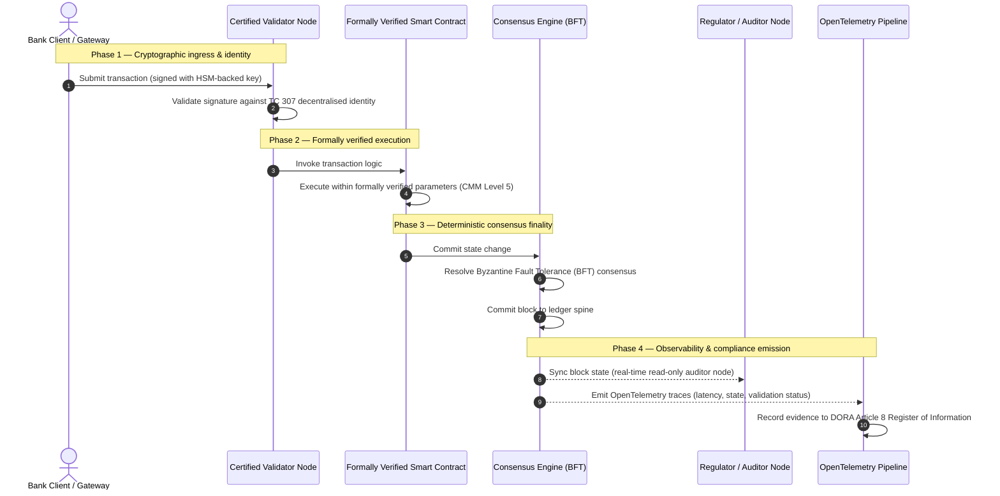

# Láti ẹ̀rí dé òtítọ́: ìdí tí àwọn blockchain tí a ti fọwọ́sí yóò fi ṣàlàyé sáà tuntun ti ìgbẹ́kẹ̀lé ìfowópamọ́

## Àkópọ̀ ọ̀gbọ́n (kókó pàtàkì)

Ìfowópamọ́ oníṣòwò-nlá àti àwọn ìdúnàdúrà kárí-ayé ní ọdún 2026 wà ní ibi ìyípadà pàtàkì nínú ìtàn. Bí àwọn iṣẹ́ ìnáwó ṣe ń yí padà sí àwọn nẹ́tíwọ́ọ̀kì ìsédédé onígbà-gidi tí ó jẹ́ oní-dígítà láti orísun, tí òye àtọwọ́dá sì ń mú àìdánilójú oníṣeéṣe wọlé, àwọn àwòṣe ìdánilójú àtọwọ́dọ́wọ́ tí ó jẹ́ ẹ̀yìn-ọ̀nà (bíi àyẹ̀wò dídúró tí ó dá lórí ilé-iṣẹ́) kò lè bójú tó àwọn ìbéèrè òde-òní fún ìṣàkóso ewu àti àwọn ojúṣe ìṣàkóso ohun-ìní mọ́.

Ìgbìmọ̀ Ìmọ̀-ẹ̀rọ ISO/IEC TC 307 ti gbé ìpìlẹ̀ tí a ṣe déédé kalẹ̀ fún àwọn ìmọ̀-ẹ̀rọ ìwé-àkọsílẹ̀ pínpín. Ṣùgbọ́n, ìtẹ́wọ́gbà ilé-iṣẹ́ tòótọ́ béèrè fún ìyípadà láti ìtọ́sọ́nà oníṣàpẹẹrẹ sí ìdánilójú blockchain oníṣèlànà tí a lè fọwọ́sí lọ́tọ̀ọ̀tọ̀. Nípa fífi ààmì sí ìṣàkóso ìwé-àkọsílẹ̀, ìdúróṣinṣin ìfohùnṣọ̀kan, ààbò àdéhùn ọlọ́gbọ́n, àti ìyára ìṣírò ní ìlòdì sí Àwòṣe Ìdàgbà Agbára (CMM) onípele-márùn-ún tí ó le, àwọn báńkì lè yí padà láti àwọn àròsọ tí ó tú ká tí ó sì jẹ́ ti oníṣòwò kan-kan sí òtítọ́ ìnáwó tí a lè fọwọ́sí tí ìgbìmọ̀ olùdarí sì lè ṣàyẹ̀wò.

## Àwọn kókó pàtàkì

* **Àlàfo ìforígbárí ìṣàkóso ohun-ìní**: lónìí a lè fọwọ́sí báńkì (Basel III), àwọsánmà (ISO 27001), àti àwọn ètò ìṣàkóso AI (ISO 42001), ṣùgbọ́n a kò tíì lè fọwọ́sí ìwé-àkọsílẹ̀ pínpín tí ó ń pinnu ohun tí ó jẹ́ òtítọ́ síwájú síi. Àìdọ́gba yìí jẹ́ àìlera iṣẹ́ pàtàkì.  
* **DORA ń fipá mú ojúṣe ìṣàkóso ohun-ìní tààrà**: lábẹ́ Abala 5 ti DORA, àwọn ìgbìmọ̀ olùdarí báńkì ń gbé ojúṣe ẹnìkọ̀ọ̀kan tààrà tí a kò lè fún ẹlòmíràn nípa ìdúróṣinṣin iṣẹ́ ti gbogbo ìṣàmúlò ẹlẹ́ẹ̀kẹta àti ìwé-àkọsílẹ̀, pẹ̀lú ìjìyà ẹnìkọ̀ọ̀kan tí ó le lábẹ́ ìlànà SM&CR fún àwọn ìkùnà.  
* **Ẹ̀yìn ìdúró àyẹ̀wò ti AI**: níbi tí ẹ̀kọ́ ẹ̀rọ ti ń mú àwọn àbájáde oníṣeéṣe tí a kò lè tún ṣe jáde, blockchain tí a fọwọ́sí ń pèsè gbígba ipò tí ó dájú. Kíkọ àwọn ẹ̀yà àwòṣe, àwọn ìwọlé, àti àwọn ìpinnu ìfọwọ́sí sórí ẹ̀wọ̀n bójú tó ISO 42001 àti àwọn ìlànà ìṣàkóso ewu àwòṣe.  
* **Àtọ́ka Blockchain tí a Fọwọ́sí**: àtọ́ka yìí ń ṣe ìṣàkóso, ìfohùnṣọ̀kan, àwọn àdéhùn ọlọ́gbọ́n, àti agbára-àkíyèsí ní déédé sí káàdì-àmì tí a lè fọwọ́sí tí ó sì ṣetán fún àyẹ̀wò lórí ìwọ̀n CMM láti 0 sí 5, ó ń tú àwọn ìwọ̀n iṣẹ́-ẹ̀rọ sí àwọn gbólóhùn ìfẹ́ ewu tí ìgbìmọ̀ fọwọ́sí.

## 01. Àlàfo ìforígbárí ìṣàkóso ohun-ìní nínú ìfowópamọ́ oní-dígítà

Nínú ìfowópamọ́ ìbílẹ̀, ìgbẹ́kẹ̀lé jẹ́ oníbáṣepọ̀, ti ilé-iṣẹ́, àti ẹ̀yìn-ọ̀nà. Ó gbáralé àwọn olùyẹ̀wò ẹlẹ́ẹ̀kẹta òmìnira tí ó ń ṣàyẹ̀wò ipò ìnáwó ní àwọn àkókò tí a gbé kalẹ̀, tí ó ń mú àwọn ìyàtọ̀ láàrin àwọn ilé-ìpamọ́ ìwé-àkọsílẹ̀ onípanapọ̀ dọ́gba. Nínú àwọn ọjà onígbà-gidi tí API ń darí ti 2026, àwòṣe yìí ń mú àwọn ìdádúró tí ó ń dí ọ̀nà àti àwọn ewu ìṣètò wọlé.

Nígbà tí àwọn ìdúnàdúrà bá ṣe ìsédédé lẹ́sẹ̀kẹsẹ̀, tí a bá ń ṣàkóso àwọn adágún omi-owó inú-ọjọ́ ní onídìde nípasẹ̀ àwọn ẹnu-ọ̀nà API, tí ẹ̀tọ́-ìní ohun-ìní sì di àmì-àpẹẹrẹ lórí àwọn ìwé-àkọsílẹ̀ ìpín, àwọn àyẹ̀wò ẹ̀yìn-ọ̀nà di àwọn iṣẹ́ ìwádìí dípò àwọn ìdarí ìdènà. Àwọn olùṣàkóso ohun-ìní kò lè gbáralé fífọwọ́sí ilé-iṣẹ́ òfin nìkan mọ́. Wọ́n gbọdọ̀ fọwọ́sí ìpìlẹ̀ oní-dígítà fúnra rẹ̀.

Ní báyìí, àwọn báńkì ń ṣiṣẹ́ lábẹ́ àìdọ́gba ìṣètò-ilé tí ó hàn gbangba:

1. **Ìpìlẹ̀-iṣẹ́ àwọsánmà tí a fọwọ́sí**: àwọn ẹ̀nu-ọ̀nà ohun-èlò, àwọn àpótí àfarawé, àti àwọn ilé-iṣẹ́ dátà tòótọ́ ni a fọwọ́sí ní ìlòdì sí àwọn ìdarí ISO/IEC 27001 àti SOC 2 Type II.  
2. **Àwọn ìlànà ìṣàkóso tí a fọwọ́sí**: àwọn ìlànà ewu iṣẹ́, àwọn ètò ìtẹ̀síwájú iṣẹ́, àti àwọn ìṣàmúlò algorithm ni a ń ṣàkóso lábẹ́ àwọn ìlànà ewu tí ó le.  
3. **Àwọn ẹ̀rọ ìwé-àkọsílẹ̀ tí a kò fọwọ́sí**: àwọn ọ̀nà ìfohùnṣọ̀kan pínpín, àwọn ẹ̀wọ̀n ìpèsè ẹ̀nu-ọ̀nà olùfọwọ́sí, àwọn ààlà àdéhùn ọlọ́gbọ́n, àti àwọn àwòṣe ìṣàkóso nẹ́tíwọ́ọ̀kì ni a fi sílẹ̀ fún àwọn àròsọ tí a kò fọwọ́sí, tí a ṣe-lọ́tọ̀ọ̀tọ̀, tàbí tí ó jẹ́ ti ẹgbẹ́.

Àìdọ́gba yìí jẹ́ ibi ìkùnà pàtàkì. Báńkì kan lè ṣiṣẹ́ ohun-èlò tí a fọwọ́sí nínú àpótí àwọsánmà tí ó ní ààbò tí a sì fọwọ́sí ní ISO 27001, ṣùgbọ́n bí àpótí náà bá kọ sí ìwé-àkọsílẹ̀ pínpín tí ó ní ìdarí olùfọwọ́sí àárín-gbùngbùn, àwọn àbùdá ìfohùnṣọ̀kan tí ó ní àìlera, tàbí àwọn àdéhùn ọlọ́gbọ́n tí a kò ṣàyẹ̀wò, ìdúróṣinṣin ìdúnàdúrà bà jẹ́. Láti dí àlàfo yìí, ẹ̀rọ ìwé-àkọsílẹ̀ fúnra rẹ̀ gbọdọ̀ di ohun ìdánilójú tí a lè fọwọ́sí.

## 02. Ìpìlẹ̀ ìṣedéédé ISO/IEC TC 307

Iṣẹ́ ìpìlẹ̀ tí a nílò láti ṣe déédé àwọn ìwé-àkọsílẹ̀ pínpín ni Ìgbìmọ̀ Ìmọ̀-ẹ̀rọ ISO/IEC TC 307 (Àwọn ìmọ̀-ẹ̀rọ blockchain àti ìwé-àkọsílẹ̀ pínpín) ń gbé kalẹ̀. Dípò kí ó ka blockchain sí ìlànà ìmọ̀-ẹ̀rọ tí a yà sọ́tọ̀, TC 307 ń tọ́jú rẹ̀ gẹ́gẹ́ bí ìpìlẹ̀-iṣẹ́ ìgbẹ́kẹ̀lé ilé-iṣẹ́, ó ń ṣètò iṣẹ́ rẹ̀ yíká àwọn ọ̀wọ̀n pàtàkì márùn-ún:

1. **Ìpínsọ́nà àti ọ̀rọ̀-ìtumọ̀ (ISO 22739)**: ó ń gbé àwọn àpèlé wọ́pọ̀ kalẹ̀, ó ń rí i dájú pé àwọn ìtumọ̀ òfin àti iṣẹ́ jẹ́ ọ̀kan-náà láàrin àwọn agbègbè-òfin, àwọn ètò ìnáwó, àti àwọn ilé-iṣẹ́.  
2. **Ìṣètò-ilé ìtọ́kasí (ISO/TR 23245)**: ó ń ṣàlàyé àwọn ààlà, ìpele, ìṣàn dátà, àti àwọn ẹ̀yà iṣẹ́ ti ètò ìwé-àkọsílẹ̀ pínpín tí ó bá òfin mu.  
3. **Ààbò, àṣírí, àti àwọn àdéhùn ọlọ́gbọ́n (ISO/TR 23244 / ISO 23613)**: ó ń gbé àwọn ìtọ́sọ́nà ààbò ìpìlẹ̀ fún àwọn ètò ohun-ìní oní-dígítà kalẹ̀, ó sì ń ṣàlàyé àwọn àṣà tí ó dára jùlọ fún ìdínkù àìlera àdéhùn ọlọ́gbọ́n àti ìṣàkóso ìgbà-ayé.  
4. **Àwọn ìlànà ìṣiṣẹ́pọ̀**: ó ń bójú tó àwọn ọ̀nà ìpààrọ̀ dátà àti ohun-ìní láàrin àwọn nẹ́tíwọ́ọ̀kì ìwé-àkọsílẹ̀ tí ó yàtọ̀, ó ń dènà dídá àwọn ilé-ìpamọ́ àmì-àpẹẹrẹ tí a yà sọ́tọ̀ sílẹ̀.  
5. **Ìdánimọ̀ tí a pín àti àwọn ìdúró ìgbẹ́kẹ̀lé**: ó ń so àwọn olùdánimọ̀ ìṣírò tí ó dá lórí ìwé-àkọsílẹ̀ pọ̀ mọ́ àwọn ìpìlẹ̀-iṣẹ́ kọ́kọ́rọ́ gbangba (PKI) tòótọ́ àti àwọn ìforúkọsílẹ̀ tí ìjọba fọwọ́sí.

Ní àpapọ̀, TC 307 ń fi hàn ìyípadà DLT láti àṣàyàn iṣẹ́-ẹ̀rọ tí a ṣe-lọ́tọ̀ọ̀tọ̀ sí ẹ̀kọ́ ìṣètò-ilé tí a ṣe déédé. Ṣùgbọ́n, TC 307 ṣì jẹ́ oníṣàpẹẹrẹ ní pàtàkì. Ó ń ṣàlàyé bí àṣeyọrí ṣe rí (ìtọ́sọ́nà), ṣùgbọ́n kò pèsè ìlànà ìdánilójú oníṣèlànà (ìdánilójú) tí àwọn òṣìṣẹ́ ewu àti àwọn alábòójútó nílò láti fọwọ́sí àwọn ìṣàmúlò iṣẹ́ ti àwọn iṣẹ́ pàtàkì tàbí kókó (CIF).

## 03. Ìtọ́sọ́nà lòdì sí ìdánilójú: ìyàtọ̀ ìṣàkóso ohun-ìní

Àwọn olùkópa ọjà ìnáwó kò ń ṣàmúlò ìmọ̀-ẹ̀rọ nítorí pé ó jẹ́ tuntun tàbí dídára; wọ́n ń ṣàmúlò rẹ̀ nígbà tí a bá lè ṣàkóso rẹ̀, ṣàyẹ̀wò rẹ̀, dáàbò bò ó, kí a sì mú un dọ́gba pẹ̀lú àwọn ìbéèrè ìfipamọ́ olú-owó. Ìdí nìyẹn tí ìṣedéédé nínú ìfowópamọ́ fi ń pín sí ìpele méjì:

* **Ìtọ́sọ́nà (ìlànà)**: ó ń fa àwọn àṣà tí ó dára jùlọ, àwọn àfojúsùn ìtọ́kasí, àti àwọn ìtọ́sọ́nà ìṣètò-ilé (fún àpẹẹrẹ ISO/IEC TC 307, àwọn ìlànà NIST).  
* **Ìdánilójú (ẹ̀rí)**: ó ń pèsè ẹ̀rí òmìnira, tí ó ń tẹ̀síwájú, tí ẹlẹ́ẹ̀kẹta sì lè fọwọ́sí pé a ti ṣàmúlò ìlànà náà tí ó sì ń ṣiṣẹ́ gẹ́gẹ́ bí a ṣe pinnu (fún àpẹẹrẹ ìwé-ẹ̀rí ISO 27001, àyẹ̀wò SOC 2, ìbẹ̀wò ìlànà).

Gbígbáralé ìfohùnṣọ̀kan ìwé-àkọsílẹ̀ tí a kò fọwọ́sí nígbà tí a ń fọwọ́sí ìpìlẹ̀-iṣẹ́ àwọsánmà jẹ́ àlàfo ìlànà pàtàkì. Blockchain tí ó jẹ́ "àìlèyípadà" kì í ṣe dandan "tí a gbẹ́kẹ̀lé ní ilé-iṣẹ́". Àìlèyípadà ń rí i dájú nìkan pé dátà tí a fi wọlé wà láìyípadà; kò fọwọ́sí bóyá àwọn ẹ̀nu-ọ̀nà olùfọwọ́sí ní ààbò, bóyá ìlànà ìfohùnṣọ̀kan lè kojú ìdìtẹ̀, bóyá ọgbọ́n àdéhùn ọlọ́gbọ́n tọ̀nà ní ìṣirò, tàbí bóyá ìṣàkóso kọ́kọ́rọ́ ìṣírò bá àwọn àṣẹ ìwọ̀n-lẹ́yìn mu.

Láti dí àlàfo yìí, Àtọ́ka Blockchain tí a Fọwọ́sí 2026 ń ṣe àwọn ìbéèrè wọ̀nyí ní déédé sí Àwòṣe Ìdàgbà Agbára (CMM) tí a lè wọ̀n, tí a so mọ́ àwọn ìlànà ìfowópamọ́ kárí-ayé.

## 04. Àtọ́ka Blockchain tí a Fọwọ́sí 2026

Láti jẹ́ kí àwọn olórí àgbà lè ṣàyẹ̀wò kí wọ́n sì fọwọ́sí àwọn pẹpẹ ìwé-àkọsílẹ̀ wọn, àtọ́ka yìí ń ṣètò ìpìlẹ̀-iṣẹ́ ìwé-àkọsílẹ̀ pínpín sí àwọn ìpele iṣẹ́ márùn-ún tí a lè ṣàyẹ̀wò, tí a fi ààmì sí lórí ìwọ̀n CMM láti 0 sí 5.

## Tábìlì 1: ìṣètò-ilé ti Àtọ́ka Blockchain tí a Fọwọ́sí

| Ìpele àtọ́ka | Ìpele ìdàgbà (CMM) | Ìwọ̀n ìmọ̀-ẹ̀rọ àti iṣẹ́ | Ìtọ́kasí ìdarí ìlànà / ìṣàkóso ohun-ìní |
| ---- | ---- | ---- | ---- |
| **Ìṣàkóso ìwé-àkọsílẹ̀** | **Ìpele 0**: ẹgbẹ́ ìgbà-díẹ̀**Ìpele 3**: àyẹ̀wò àti ìyípo olùfọwọ́sí aládàáṣiṣẹ́**Ìpele 5**: ìdúró ìdánimọ̀ ìṣírò tí a pín, oníkópa-púpọ̀ | % àwọn ẹ̀nu-ọ̀nà olùfọwọ́sí tí àwọn ilé-iṣẹ́ ìnáwó tí a ti ṣàyẹ̀wò ń ṣiṣẹ́; àpapọ̀ àkókò láti yanjú àríyànjiyàn olùfọwọ́sí; ìpín àgbègbè àwọn ẹ̀nu-ọ̀nà | **DORA Abala 5** (Ìṣàkóso àti ètò); **CPMI-IOSCO PFMI Ìlànà 2** (Ìṣàkóso) àti **Ìlànà 3** (Ìlànà fún ìṣàkóso àpapọ̀ àwọn ewu) |
| **Ìdúróṣinṣin ìfohùnṣọ̀kan** | **Ìpele 0**: ẹ̀nu-ọ̀nà kan tàbí PoW aláìlẹ́ye**Ìpele 3**: BFT tí a ṣàyẹ̀wò pẹ̀lú ìparí tí ó dájú**Ìpele 5**: ìfohùnṣọ̀kan oní-agbègbè-òfin-púpọ̀, tí a fọwọ́sí lọ́nà tòótọ́, pẹ̀lú ìṣọ́ ìdádúró tí ó ń tẹ̀síwájú | ìdádúró ìfohùnṣọ̀kan tí ó ga jùlọ tí a lè fàradà; ààlà ìkojú ìdìtẹ̀; SLA ìwàláàyè lábẹ́ ìpín ẹ̀nu-ọ̀nà àfarawé | **DORA Abala 6** (Ìlànà ìṣàkóso ewu ICT); **CPMI-IOSCO PFMI Ìlànà 8** (Ìparí ìsédédé) |
| **Ìdánimọ̀ àti ìṣírò** | **Ìpele 0**: àwọn kọ́kọ́rọ́ RSA / ECDSA aláìlera**Ìpele 3**: ìbùwọ́lù-púpọ̀ pẹ̀lú ìṣàkóso kọ́kọ́rọ́ tí HSM ń ṣètìlẹ́yìn**Ìpele 5**: àwọn kọ́kọ́rọ́ àpapọ̀ tí ó ní ààbò kúántẹ́ẹ̀mù (FIPS 203 ML-KEM) àti àwọn ẹnu-ọ̀nà àṣírí aláìní-ìmọ̀ | % àwọn ìdúnàdúrà ìwé-àkọsílẹ̀ tí a fi kọ́kọ́rọ́ tí HSM ń ṣètìlẹ́yìn bùwọ́lù; àmì ìmúrasílẹ̀ ìṣíkiri PQC; ìdádúró ẹ̀rí ZK | **NIST FIPS 203 / 204**; **ISO/IEC 27001** (Ìṣàkóso ààbò ìsọfúnni) |
| **Ìdánilójú àdéhùn ọlọ́gbọ́n** | **Ìpele 0**: àwọn àfọwọ́kọ Solidity tí a kò ṣàyẹ̀wò**Ìpele 3**: ìfọwọ́sí akópọ̀ aládàáṣiṣẹ́ àti àyẹ̀wò òde**Ìpele 5**: àwọn àdéhùn ọlọ́gbọ́n àìlèyípadà tí a fọwọ́sí lọ́nà tòótọ́, pẹ̀lú àwọn ìmúdàgbà oní-agékúrò-yíyí | % àwọn àdéhùn ọlọ́gbọ́n pẹ̀lú ìfọwọ́sí tòótọ́ ti ìṣirò; iye àwọn ìkìlọ̀ akópọ̀; ìbò ìṣàwárí àìlera | **Àwọn ìtọ́sọ́nà EBA lórí ìṣẹ́-ìta** (àwọn ìpínrọ̀ 81, 113-117); **DORA Abala 30** (Àwọn gbólóhùn àdéhùn tí ó kéré jùlọ) |
| **Àyẹ̀wò àti agbára-àkíyèsí** | **Ìpele 0**: kíkó àkọsílẹ̀ pẹ̀lú ọwọ́**Ìpele 3**: àwọn àmì OTel tí a ṣètò àti àwọn ẹ̀nu-ọ̀nà olùyẹ̀wò kíkà-nìkan**Ìpele 5**: ìmúdọ́gba aládàáṣiṣẹ́, tí ó ń tẹ̀síwájú pẹ̀lú ìforúkọsílẹ̀ Abala 8 | % àwọn ìdúnàdúrà tí àwọn àmì OpenTelemetry bò; ìdádúró láti ìdúnkọ block sí ìmúdọ́gba ẹ̀nu-ọ̀nà olùyẹ̀wò | **BCBS 239** (Àkópọ̀ dátà ewu); **DORA Abala 8** (Ìforúkọsílẹ̀ ìsọfúnni / àwọn àwòṣe ITS) |

## Tábìlì 2: àwọn àmì ìgbẹ́kẹ̀lé pàtàkì tí a so mọ́ àwọn ìlànà ìfowópamọ́ kárí-ayé

| Àmì / ìwọ̀n-ìfiwéra | Ìwọ̀n | Ipa lórí àwọn pẹpẹ ìfowópamọ́ | Orísun ìlànà |
| ---- | ---- | ---- | ---- |
| **Ìtẹ̀síwájú ISO/IEC TC 307** | Ìyípadà láti àwọn ìròyìn ìmọ̀-ẹ̀rọ ISO/TR sí àwọn ètò ìwé-ẹ̀rí tòótọ́ | Ó ń gbé ìlànà tí a ṣe déédé àkọ́kọ́ kalẹ̀ láti fọwọ́sí àwọn ẹ̀rọ ìwé-àkọsílẹ̀ pínpín | **ISO/IEC JTC 1 / SC 44** (Àwọn ìmọ̀-ẹ̀rọ ìwé-àkọsílẹ̀ pínpín) |
| **Ìpele àpẹẹrẹ Iṣẹ́ Agorá** | Àwọn báńkì oníṣòwò tí ó lé ní 40 tí ó kópa; ìdánwò ìwé-àkọsílẹ̀ ìṣọ̀kan fún àwọn ìfipamọ́ àmì-àpẹẹrẹ | Ó ń kó ìsédédé àgbélébùú-ààlà láti fífìránṣẹ́ (SWIFT) sí ìsédédé àmì-àpẹẹrẹ oníparapọ̀ | **Ibùdó Ìmúdàgbà ti Báńkì fún Ìsédédé Àgbáyé (BIS)** |
| **Àyẹ̀wò ẹlẹ́ẹ̀kẹta DORA Abala 30** | 100% àwọn olùpèsè ẹ̀nu-ọ̀nà àti àwọn olùgbàlejò ìpìlẹ̀-iṣẹ́ tí a ṣàyẹ̀wò ní ìlòdì sí àwọn àmì ààbò | Ó ń mú "àwọn ẹ̀nu-ọ̀nà olùfọwọ́sí òjìji" kúrò; ó ń fipá mú kíkedere ẹ̀wọ̀n ìpèsè ní kíkún | **Àwọn Aláṣẹ Ìbójútó Yúróòpù (ESA)** |
| **ISO/IEC 42001 (ìṣàkóso AI)** | Àwọn àkọsílẹ̀ àwòṣe àti ìdálẹ́kọ̀ọ́ AI tí a ṣe àìlèyípadà lọ́nà ìṣírò lórí ẹ̀wọ̀n | Ó ń lo blockchain gẹ́gẹ́ bí ìforúkọsílẹ̀ ẹ̀rí àìlèyípadà ("ẹ̀yìn ìdúró àyẹ̀wò") fún ẹ̀kọ́ ẹ̀rọ | **ISO/IEC 42001:2023** (Ìmọ̀-ẹ̀rọ ìsọfúnni — Òye àtọwọ́dá) |
| **Ìtó olú-owó Basel III** | Ìdínkù àwọn àpò-ìfipamọ́ olú-owó ewu iṣẹ́ tí ó dá lórí ìdínkù ìdíjú tí a kọsílẹ̀ | Àwọn ìlànà ewu iṣẹ́ tí a ṣe déédé ń gba ìdúróṣinṣin ìwé-àkọsílẹ̀ tí a fọwọ́sí sí àpọ̀ tààrà | **Ìgbìmọ̀ Basel lórí Ìbójútó Báńkì (BCBS)** |

## 05. "Ẹ̀yìn ìdúró àyẹ̀wò" ti AI: òye oníṣeéṣe lórí ìpìlẹ̀-iṣẹ́ tí ó dájú

Ọ̀kan lára àwọn ipa ọ̀gbọ́n tí ó lágbára jùlọ ti blockchain tí a fọwọ́sí ní 2026 ni láti ṣiṣẹ́ gẹ́gẹ́ bí **"ẹ̀yìn ìdúró àyẹ̀wò"** fún àwọn ìṣàmúlò òye àtọwọ́dá. Àwọn ètò ìnáwó òde-òní ń di oníṣeéṣe síwájú síi. Ìfàmì-owó gbèsè, ìwádìí ìjìbìtì onígbà-gidi, ìṣòwò algorithm, àti àwọn ìbáṣepọ̀ oníbárà aládàáṣiṣẹ́ ni àwọn àwòṣe ẹ̀kọ́ ẹ̀rọ tí ó ń dàgbà, tí ó ń yà, tí ó sì ń bára-mu lórí àkókò ń darí. Àwọn àwòṣe wọ̀nyí kì í ṣe tí ó dájú: pẹ̀lú ìwọlé kan-náà ní àkókò méjì ọ̀tọ̀ọ̀tọ̀, wọ́n lè mú àwọn àbájáde ọ̀tọ̀ọ̀tọ̀ jáde nítorí àwọn ìwọ̀n oníyíyẹ̀ àti ìdálẹ́kọ̀ọ́ tí ó ń tẹ̀síwájú.

Àìdájú yìí ń mú ìpèníjà ìṣàkóso jíjinlẹ̀ wá lábẹ́ **ISO/IEC 42001 (ìṣàkóso AI)** àti àwọn ìlànà ìṣàkóso ewu àwòṣe (MRM) (bíi **SR 11-7 ti Federal Reserve US** àti **SS1/23 ti PRA UK**): *báwo ni o ṣe lè ṣàyẹ̀wò, ṣàlàyé, kí o sì dáàbò bo àwọn ìpinnu tí a kò lè tún ṣe lọ́nà tòótọ́?*

Ìwé-àkọsílẹ̀ pínpín tí a fọwọ́sí ń pèsè ìdojúkọ tí ó dájú. Níbi tí àwọn àwòṣe AI ti ń ṣiṣẹ́ lọ́nà oníṣeéṣe, blockchain tí a fọwọ́sí ń kọ àwọn àbùdá wọn lọ́nà tí ó dájú, ó ń gbé ẹ̀yìn ìdúró ẹ̀rí àìlèyípadà kalẹ̀:

* **Ìṣàyẹ̀-ẹ̀yà àwòṣe àti ìdúró ìwọ̀n**: gbogbo ẹ̀yà àwòṣe tí a ṣàmúlò, àwọn ìwọ̀n rẹ̀ tí ó ní í ṣe, àti àwọn àpapọ̀-àyẹ̀wò dátà ìdálẹ́kọ̀ọ́ rẹ̀ ni a ṣe hash tí a sì kọ sí ìwé-àkọsílẹ̀ ní àkókò kíkọ́, ó ń bójú tó àwọn ìbéèrè ẹ̀wọ̀n ìpèsè **SLSA Level 3**.  
* **Kíkọ ìwọlé oníbáramu**: nígbà tí àwòṣe AI bá ṣe ìpinnu pàtàkì (fún àpẹẹrẹ ìfọwọ́sí àwìn tàbí fífi àmì sí ìdúnàdúrà), àwọn ìwọlé oníbáramu tòótọ́ àti àwọn hash àwòṣe ni a kọ sí ìwé-àkọsílẹ̀, ó ń dá ìtàn tí ó kojú àyídà.  
* **Agbára-àyẹ̀wò láìsí àǹfààní kóòdù**: bí olùṣàkóso bá béèrè pé "kí ló dé tí àwòṣe rẹ fi kọ ìbéèrè àwìn yìí ní ọjọ́ kẹta oṣù Òkúdu?", báńkì kò nílò láti ṣàfihàn kóòdù ohun-ìní rẹ̀ tàbí gbìyànjú láti tún ipò tòótọ́ àwòṣe ṣẹ̀dá. Ó ń ṣàfihàn àkọsílẹ̀ lórí-ẹ̀wọ̀n tí a bùwọ́lù lọ́nà ìṣírò ti àwọn ìwọlé, ìwọ̀n, àti ipò ìfọwọ́sí.

Nípa dídúró àwọn ìpinnu oníṣeéṣe ti àwọn àwòṣe ẹ̀kọ́ ẹ̀rọ sí ìfohùnṣọ̀kan tí ó dájú ti blockchain tí a fọwọ́sí, ilé-iṣẹ́ ń dá àkókò-ìlà ti àwọn ìṣe aládàáṣiṣẹ́ tí a lè dáàbò bò, tún ṣẹ̀dá, kí a sì fọwọ́sí lọ́tọ̀ọ̀tọ̀.

## 06. Ìfihàn ìlà-iṣẹ́ tí a fọwọ́sí láti ìfohùnṣọ̀kan sí àyẹ̀wò

Àwòrán ọ̀wọ́ tí ó tẹ̀le ń ṣàfihàn ìgbà-ayé ìdúnàdúrà kan tí ó ń kọjá pẹpẹ blockchain tí a fọwọ́sí, ó ń fi hàn bí àwọn ẹnu-ọ̀nà ìfọwọ́sí, ìdúróṣinṣin ìfohùnṣọ̀kan, ṣíṣe àdéhùn ọlọ́gbọ́n, àti ìtújáde telemetry ṣe ń so pọ̀ láti mú ẹ̀rí ìlànà tí ó ṣetán fún ìgbìmọ̀ jáde:

Ọ̀nà pàtàkì ti ọ̀wọ́ ìdúnàdúrà yìí béèrè pé kí gbogbo ìgbésẹ̀ ìfọwọ́sí, ṣíṣe, àti ìfohùnṣọ̀kan ni a bùwọ́lù lọ́nà ìṣírò, ó ń rí i dájú orísun láti òpin sí òpin. Ẹ̀nu-ọ̀nà olùyẹ̀wò ti olùṣàkóso ń mú ipò block dọ́gba ní onígbà-gidi, ó ń mú àìní ìmúdọ́gba ìnáwó pẹ̀lú ọwọ́, ti ẹ̀yìn-ọ̀nà kúrò.

## 07. Ìwé-eré ìgbìmọ̀ fún àwọn olórí àgbà

Láti rìn ìrìn-àjò ìyípadà láti ìgbẹ́kẹ̀lé ètò sí ìgbẹ́kẹ̀lé ìpìlẹ̀-iṣẹ́ lọ́nà àṣeyọrí, àwọn alóyè báńkì àti àwọn olórí àgbà gbọdọ̀ ṣe àwọn àṣẹ pàtàkì mẹ́rin lẹ́sẹ̀kẹsẹ̀:

1. **Fipá mú àwọn àyẹ̀wò ìwé-àkọsílẹ̀ nínú ìṣàkóso ewu ilé-iṣẹ́ (ERM)**: fipá mú ìlànà pé kò sí pẹpẹ ìwé-àkọsílẹ̀ pínpín kan — ti aládàáni, ti gbogbo-ènìyàn, tàbí ti ẹgbẹ́ — tí a lè ṣàmúlò fún àwọn iṣẹ́ pàtàkì tàbí kókó (CIF) láìsí kí a ṣàyẹ̀wò rẹ̀ ní ìlòdì sí **ìṣètò-ilé Àtọ́ka Blockchain tí a Fọwọ́sí** onípele-márùn-ún (ó kéré jùlọ CMM Ìpele 3).  
2. **So àwọn blockchain pọ̀ gẹ́gẹ́ bí ẹ̀yìn ìdúró ẹ̀rí AI ti ISO 42001**: darí Alóyè Àgbà Ewu àti Ọ̀gá Ayàwòrán AI láti so gbogbo àwọn àwòṣe ẹ̀kọ́ ẹ̀rọ oní-ipa-gíga pọ̀ mọ́ blockchain tí a fọwọ́sí, ó ń dá ìforúkọsílẹ̀ àyẹ̀wò tí ó kojú àyídà ti àwọn ẹ̀yà àwòṣe, ìwọ̀n, ìwọlé, àti ìpinnu.  
3. **Ṣàyẹ̀wò ẹ̀wọ̀n ìpèsè ẹ̀nu-ọ̀nà olùfọwọ́sí (DORA Abala 30)**: béèrè pé kí ẹ̀ka ìrà ṣàyẹ̀wò gbogbo àwọn ilé-iṣẹ́ ẹlẹ́ẹ̀kẹta tí ó ń gbàlejò àwọn ẹ̀nu-ọ̀nà olùfọwọ́sí tàbí tí ó ń ṣàkóso ìgbàlejò àwọsánmà fún àwọn nẹ́tíwọ́ọ̀kì DLT, ó ń fipá mú àwọn àmì ààbò-ayélujára àti ìdúróṣinṣin iṣẹ́ kan-náà tí a lò fún àwọn ẹ̀nu-ọ̀nà àwọsánmà inú báńkì.  
4. **Mú àwọn ìṣètò-ilé ìwé-àkọsílẹ̀ bá CPMI-IOSCO àti BCBS 239 mu**: darí ẹgbẹ́ iṣẹ́-ẹ̀rọ pẹpẹ láti mú telemetry ìtújáde ìwé-àkọsílẹ̀ bá àwọn ìbéèrè ìròyìn dátà **BCBS 239** mu tààrà, kí a sì rí i dájú pé àwọn àbùdá ìfohùnṣọ̀kan àti ìparí ìsédédé bá **Àwọn Ìlànà 8 àti 9 ti CPMI-IOSCO** mu ní kíkún.

## 08. Àwọn ìbéèrè tí a sábà máa ń bèèrè

**Ṣé ISO/IEC TC 307 jẹ́ ìlànà ìwé-ẹ̀rí?**  
Rárá. ISO/IEC TC 307 jẹ́ ìgbìmọ̀ ìmọ̀-ẹ̀rọ tí ó ń gbé ọ̀rọ̀-ìtumọ̀, àwọn ìṣètò-ilé ìtọ́kasí, àti àwọn ìtọ́sọ́nà ààbò kalẹ̀. Bí ó tilẹ̀ ń ṣàlàyé "bí àṣeyọrí ṣe rí" (ìtọ́sọ́nà), ilé-iṣẹ́ gbọdọ̀ ṣe àwọn ìwé wọ̀nyí ní iṣẹ́ sí àwọn ètò ìwé-ẹ̀rí tòótọ́ tí a lè ṣàyẹ̀wò (ìdánilójú) láti tẹ́ àwọn alábòójútó báńkì lọ́rùn.

**Báwo ni blockchain tí a fọwọ́sí ṣe ń ṣètìlẹ́yìn fún ìbámu DORA?**  
Lábẹ́ Abala 5 ti DORA, àwọn ìgbìmọ̀ báńkì ń gbé ojúṣe ẹnìkọ̀ọ̀kan tààrà nípa ìdúróṣinṣin ìmọ̀-ẹ̀rọ. Blockchain tí a fọwọ́sí ń pèsè ẹ̀rí ìṣírò tí a lè fọwọ́sí ti ìdúróṣinṣin ìfohùnṣọ̀kan, ìdarí ẹ̀wọ̀n ìpèsè olùfọwọ́sí, àti ààbò àdéhùn ọlọ́gbọ́n, ó ń fún àwọn ọmọ ẹgbẹ́ ìgbìmọ̀ ní àwọn "ìgbésẹ̀ tí ó bọ́gbọ́n mu" tí a lè kọsílẹ̀ tí a nílò láti dáàbò bo ara wọn lòdì sí àwọn ẹjọ́ ojúṣe ẹnìkọ̀ọ̀kan lábẹ́ SM&CR.

Kí ni ìyàtọ̀ láàrin àyẹ̀wò ìwé-àkọsílẹ̀ ìbílẹ̀ àti àyẹ̀wò blockchain tí a fọwọ́sí?  
Àyẹ̀wò ìbílẹ̀ jẹ́ ti ẹ̀yìn-ọ̀nà: ó ń fọwọ́sí àwọn ìtẹ̀wọlé ọwọ́ àti àwọn fáìlì dídúró lẹ́yìn tí àwọn ìdúnàdúrà bá ti ṣe ìsédédé. Àyẹ̀wò blockchain tí a fọwọ́sí jẹ́ ti ìtẹ̀síwájú àti onígbà-gidi; àwọn ẹ̀nu-ọ̀nà olùfọwọ́sí, ẹ̀rọ ìfohùnṣọ̀kan BFT, àti àwọn àdéhùn ọlọ́gbọ́n tí a fọwọ́sí lọ́nà tòótọ́ ni a fọwọ́sí láti ṣe àwọn ìdúnàdúrà lọ́nà tí ó dájú, wọ́n ń tú telemetry tí a ṣètò (OpenTelemetry) jáde tí ó ń fọwọ́sí ìlera ètò náà ní ìtẹ̀síwájú.

Ṣé a lè fọwọ́sí àwọn blockchain ti gbogbo-ènìyàn fún ìlò báńkì?  
Ní ọ̀pọ̀ àwọn agbègbè-òfin, àwọn blockchain ti gbogbo-ènìyàn aláìní-àṣẹ pátápátá kùnà láti tẹ́ àwọn ìlànà báńkì lọ́rùn nítorí àìsí ìfọwọ́sí ìdánimọ̀ olùfọwọ́sí, àwọn ìnáwó ìdúnàdúrà tí a kò lè sọ tẹ́lẹ̀, àti ìparí tí kì í ṣe tí ó dájú (fún àpẹẹrẹ àwọn ẹ̀ka oníṣeéṣe ti proof-of-work/stake). Àwọn blockchain tí a fọwọ́sí nínú báńkì sábà máa ń lo àwọn ìṣètò-ilé ilé-iṣẹ́ oníláṣẹ tàbí àwọn ìṣètò-ilé ti gbogbo-ènìyàn-àpapọ̀ tí a ń darí ní líle, níbi tí àwọn olùṣiṣẹ́ ẹ̀nu-ọ̀nà olùfọwọ́sí jẹ́ àwọn ilé-iṣẹ́ ìnáwó tí a ti dá mọ̀ tí a sì ti ṣàyẹ̀wò.

## 09. Àwọn Ìtọ́kasí

* Ìgbìmọ̀ Basel lórí Ìbójútó Báńkì (BCBS), 2013. *Principles for effective risk data aggregation and reporting (BCBS 239)*. Basel: Báńkì fún Ìsédédé Àgbáyé. Ó wà ní: [https://www.bis.org/publ/bcbs239.pdf](https://www.bis.org/publ/bcbs239.pdf).  
* Committee on Payments and Market Infrastructures àti Technical Committee of the International Organization of Securities Commissions (CPMI-IOSCO), 2012. *Principles for financial market infrastructures*. Basel: Báńkì fún Ìsédédé Àgbáyé. Ó wà ní: [https://www.bis.org/cpmi/publ/d101a.pdf](https://www.bis.org/cpmi/publ/d101a.pdf).  
* Aláṣẹ Báńkì Yúróòpù (EBA), 2019. *EBA/GL/2019/02 — Guidelines on outsourcing arrangements*. Paris: EBA. Ó wà ní: [https://www.eba.europa.eu/regulation-and-policy/internal-governance/guidelines-on-outsourcing-arrangements](https://www.eba.europa.eu/regulation-and-policy/internal-governance/guidelines-on-outsourcing-arrangements).  
* Ilé-ìgbìmọ̀ Aṣòfin Yúróòpù àti Ìgbìmọ̀ ti Ìṣọ̀kan Yúróòpù, 2022. *Ìlànà (EU) 2022/2554 lórí ìdúróṣinṣin iṣẹ́ oní-dígítà fún ẹ̀ka ìnáwó (DORA)*. Brussels: Ìwé-ìròyìn Aṣòfin ti Ìṣọ̀kan Yúróòpù. Ó wà ní: [https://eur-lex.europa.eu/legal-content/EN/TXT/?uri=CELEX%3A32022R2554](https://eur-lex.europa.eu/legal-content/EN/TXT/?uri=CELEX%3A32022R2554).  
* ISO/IEC JTC 1/SC 42, 2023. *ISO/IEC 42001:2023 — Information technology — Artificial intelligence — Management system*. Geneva: Àjọ Àgbáyé fún Ìṣedéédé. Ó wà ní: [https://www.iso.org/standard/81230.html](https://www.iso.org/standard/81230.html).  
* Ìgbìmọ̀ Ìmọ̀-ẹ̀rọ ISO/IEC 307, 2020. *ISO/IEC 22739:2020 — Blockchain and distributed ledger technologies — Vocabulary*. Geneva: Àjọ Àgbáyé fún Ìṣedéédé. Ó wà ní: [https://www.iso.org/standard/73771.html](https://www.iso.org/standard/73771.html).  
* National Institute of Standards and Technology (NIST), 2026. *First Three Finalized Post-Quantum Encryption Standards (FIPS 203, 204, and 205)*. Gaithersburg: U.S. Department of Commerce. Ó wà ní: [https://www.nist.gov/news-events/news/2024/08/nist-releases-first-3-finalized-post-quantum-encryption-standards](https://www.nist.gov/news-events/news/2024/08/nist-releases-first-3-finalized-post-quantum-encryption-standards).
