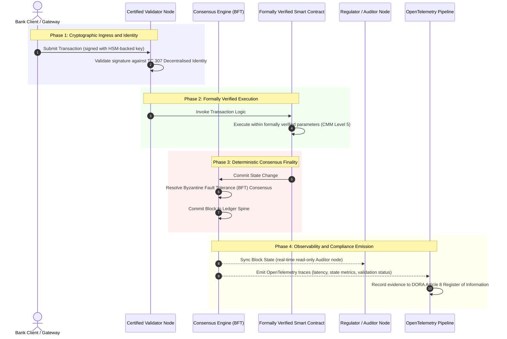

# Láti Ẹ̀rí Dé Òtítọ́: Ìdí Tí Àwọn Blockchain Tí A Fọwọ́sí Yóò Fi Ṣàkóso Ìgbà Tuntun Ìgbẹ́kẹ̀lé Báńkì

**Àìṣeéyípadà kò dọ́gba pẹ̀lú ìgbẹ́kẹ̀lé.** Bí ìṣòwò báńkì ọjà-ńlá ṣe ń lọ sí ìdálẹ́kún ojú-ẹsẹ̀ àti AI onídánwò, ìwé-àkọsílẹ̀ tí ó pinnu ohun tí ó jẹ́ òtítọ́ ti di ìpele kan ṣoṣo tí àwọn báńkì kò ì tíì lè fọwọ́sí. Wọ́n ń fọwọ́sí ilé-iṣẹ́ náà lábẹ́ Basel III, ìkùukùu lábẹ́ ISO 27001 àti AI wọn lábẹ́ ISO 42001, ṣùgbọ́n ìwé-àkọsílẹ̀ pínpín, ìṣàkóso rẹ̀, ìfohùnṣọ̀kan, ìsekóòdù àti smart contracts, ni a fi sílẹ̀ fún àbá tí ó dá lórí olùtajà. Ìròyìn yìí jiyàn pé láti dí àlàfo ìgbẹ́kẹ̀lé náà a gbọ́dọ̀ kúrò nínú ìtọ́sọ́nà ISO/IEC TC 307 sí ìdánilójú aláṣẹ: fífi ìwé-àkọsílẹ̀ wéra pẹ̀lú Àtọ́ka Blockchain Tí A Fọwọ́sí ti ìpele márùn-ún tí ó ń sọ àwọn ìwọ̀n ìmọ̀-ẹ̀rọ di òtítọ́ tí ìgbìmọ̀ lè ṣàyẹ̀wò, tí ó sì lè dúró níwájú DORA.

<!-- lead-start -->
<aside class="post-lead" aria-label="Àkópọ̀ àpilẹ̀kọ">

<strong>TL;DR.</strong> Àwọn báńkì ń fọwọ́sí ilé-iṣẹ́ náà, ìkùukùu àti AI wọn, ṣùgbọ́n kì í ṣe ìwé-àkọsílẹ̀ tí ó túbọ̀ ń pinnu ohun tí ó jẹ́ òtítọ́. ISO/IEC TC 307 ń fún ni ní ìtọ́sọ́nà, kì í ṣe ìdánilójú. Àtọ́ka Blockchain Tí A Fọwọ́sí ti ìpele márùn-ún ń fi ìṣàkóso ìwé-àkọsílẹ̀, ìdúróṣinṣin ìfohùnṣọ̀kan, ìdámọ̀ àti ìsekóòdù, ìdánilójú smart-contract àti ìṣàkíyèsí wéra pẹ̀lú Capability Maturity Model, ó ń dí àlàfo ìgbẹ́kẹ̀lé náà, ó sì ń fún AI onídánwò ní ẹ̀yìn ìṣàyẹ̀wò tí ó dájú.

<strong>Àwọn kókó pàtàkì</strong>

<ul class="post-lead-takeaways">
  <li><strong>Àlàfo ìdíwọ́ ìgbẹ́kẹ̀lé.</strong> Báńkì náà (Basel III), ìkùukùu (ISO 27001) àti ètò ìṣàkóso AI (ISO 42001) ni a lè fọwọ́sí; ìwé-àkọsílẹ̀ pínpín tí ó pinnu ohun tí ó jẹ́ òtítọ́ ni a kò ì tíì lè fọwọ́sí. Àìdọ́gba yẹn jẹ́ àìlera iṣẹ́ tí ó wà láàyè.</li>
  <li><strong>DORA sọ ọ́ di ti ara ẹni.</strong> Lábẹ́ DORA Article 5, àwọn ìgbìmọ̀ báńkì ń ru ẹrù jíjẹ́bẹ́ẹ̀ tààrà, tí a kò lè fi lé ẹlòmíràn, fún ìdúróṣinṣin ìpèsè ẹnikẹ́ta àti ìwé-àkọsílẹ̀, pẹ̀lú ìjìyà ti ara ẹni SM&amp;CR fún ìkùnà.</li>
  <li><strong>Ẹ̀yìn ìṣàyẹ̀wò AI.</strong> Machine learning kì í ṣe àtúnṣe; blockchain tí a fọwọ́sí ń gba àwọn ẹ̀yà àwòṣe, àwọn ìdásí àti àwọn ìpinnu ìfọwọ́sí ní ọ̀nà tí ó dájú lórí-ẹ̀wọ̀n, ó ń tẹ́ ISO 42001 àti àwọn ìlànà ìṣàkóso-ewu-àwòṣe lọ́rùn.</li>
  <li><strong>Àtọ́ka Blockchain Tí A Fọwọ́sí.</strong> Ìṣàkóso, ìfohùnṣọ̀kan, ìsekóòdù, smart contracts àti ìṣàkíyèsí di káàdì-àmì CMM láti 0-sí-5 tí ó ń sọ àwọn ìwọ̀n ìmọ̀-ẹ̀rọ di àwọn Ọ̀rọ̀ Ìfẹ́-Ọ̀nà-Ewu tí ìgbìmọ̀ fọwọ́sí.</li>
</ul>

<strong>Ìkàwé tí ó bá a mu:</strong> <a href="https://sebastienrousseau.com/2026-07-02-certified-blockchains-banking-trust-tc307-assurance-2026">Àwọn Blockchain Tí A Fọwọ́sí àti Ìgbẹ́kẹ̀lé Báńkì: Ìdánilójú TC 307</a>, <a href="https://sebastienrousseau.com/2026-07-24-global-payments-outlook-operating-model-risk-revenue">Ìwòye Ìsanwó Àgbáyé 2026</a>.

</aside>
<!-- lead-end -->

> **Àkópọ̀ Aṣáájú**
>
> - **Ìṣòwò báńkì ọjà-ńlá wà ní àyè ìyípadà.** Ìdálẹ́kún ojú-ẹsẹ̀ àti AI onídánwò fọ́ àwòṣe ìdánilójú aláná, olùwòyìnwo: àwọn ìṣàyẹ̀wò tí kò yí, tí ó dá lórí ilé-iṣẹ́ kò tún tẹ́ àwọn ìbéèrè ìṣàkóso-ewu tàbí ìgbẹ́kẹ̀lé òde-òní lọ́rùn mọ́.
> - **TC 307 jẹ́ ìpìlẹ̀, kì í ṣe ìwé-ẹ̀rí.** ISO/IEC TC 307 ti ṣe àkópọ̀ àwọn ọ̀rọ̀-ìsọ̀rọ̀, ètò-ìkọ́lé ìtọ́ka àti ìtọ́sọ́nà ààbò fún àwọn ìwé-àkọsílẹ̀ pínpín, ṣùgbọ́n ó jẹ́ àpèjúwe. Ó túmọ̀ ohun tí ó dára rí bí; kò pèsè ìfidímúlẹ̀ aláṣẹ tí àwọn òṣìṣẹ́ ewu àti alábòójútó nílò láti fún ìdálọ́wọ̀ọ́ ìgbéjáde ní àṣẹ.
> - **Ìdánilójú túmọ̀ sí fífi ìwé-àkọsílẹ̀ wéra.** Ìṣàkóso, ìdúróṣinṣin ìfohùnṣọ̀kan, ààbò smart-contract àti ìyẹ̀wọ̀ ìsekóòdù, tí a fi wéra pẹ̀lú Capability Maturity Model ti ìpele márùn-ún tí ó le, ń gbé àwọn báńkì kúrò nínú àbá àkànpọ̀, tí ó dá lórí olùtajà sí òtítọ́ ìnáwó tí a lè fọwọ́sí, tí ìgbìmọ̀ sì lè ṣàyẹ̀wò.
> - **Ìwé-àkọsílẹ̀ ni ẹ̀yìn ìṣàyẹ̀wò fún AI.** Fífi àwọn ẹ̀yà àwòṣe, àwọn ìdásí àti àwọn ìpinnu ìfọwọ́sí so mọ́ ìfohùnṣọ̀kan tí ó dájú ń fún machine learning tí kì í ṣe àtúnṣe ní àkọsílẹ̀ ẹ̀rí tí a lè gbèjà, tí a sì lè tún kọ́ lábẹ́ ISO 42001, SR 11-7 àti PRA SS1/23.

## Àlàfo Ìdíwọ́ Ìgbẹ́kẹ̀lé nínú Ìṣòwò Báńkì Oní-nọ́mbà

Nínú ìṣòwò báńkì àtọwọ́dọ́wọ́, ìgbẹ́kẹ̀lé jẹ́ ti àjọṣepọ̀, ti ilé-iṣẹ́, àti olùwòyìnwo. Ó dá lórí àwọn olùṣàyẹ̀wò ẹnikẹ́ta olómìnira tí wọ́n ń ṣàtúnyẹ̀wò ipò ìnáwó ní àwọn àkókò tí kò yí, tí wọ́n ń bá àwọn ìyàtọ̀ mu ní àwọn ìpamọ́ ìwé-àkọsílẹ̀ olóníméjì. Nínú àwọn ọjà ojú-ẹsẹ̀, tí API ń darí ti 2026, àwòṣe yìí ń fa àìdálẹ́kún tí ó lẹ́wọ̀ àti àwọn ewu ìṣètò.

Nígbà tí àwọn ìṣòwò bá dálẹ́kún ojú-ẹsẹ̀, tí àwọn adágún owó-ojú-ọjọ́ ń wà lábẹ́ ìṣàkóso alágbára láti ọ̀dọ̀ àwọn ẹnu-ọ̀nà API, tí ìní ẹ̀tọ́ dúkìá sì di tokenised ní àwọn ìwé-àkọsílẹ̀ pínpín, àwọn ìṣàyẹ̀wò olùwòyìnwo di iṣẹ́ ìwádìí kúkú ju ìṣàkóso ìdènà lọ. Àwọn onígbẹ́kẹ̀lé kò lè gbẹ́kẹ̀ lé fífi ilé-iṣẹ́ ilé-ìṣòwò nìkan fọwọ́sí mọ́. Wọ́n gbọ́dọ̀ fọwọ́sí ìpìlẹ̀ oní-nọ́mbà fúnra rẹ̀.

Lọ́wọ́lọ́wọ́, àwọn báńkì ń ṣiṣẹ́ lábẹ́ àìdọ́gba ìkọ́lé tí ó hàn kedere:

1. **Ìpìlẹ̀ Ìkùukùu Tí A Fọwọ́sí**: Àwọn ẹ̀rọ hardware, àwọn àpótí virtualised, àti àwọn ilé-ìtọ́jú-dátà ti ara ni a fi wéra pẹ̀lú ISO/IEC 27001 àti àwọn ìṣàkóso SOC 2 Type II.  
2. **Àwọn Ìlànà Ìṣàkóso Tí A Fọwọ́sí**: Àwọn ìlànà ewu iṣẹ́, àwọn ètò ìtẹ̀síwájú ìṣòwò, àti àwọn ìdálọ́wọ̀ọ́ algoríìmù ni a ń ṣàkóso lábẹ́ àwọn ìlànà ewu tí ó le.  
3. **Àwọn Ẹ̀rọ Ìwé-àkọsílẹ̀ Tí A Kò Fọwọ́sí**: Àwọn ọ̀nà ìfohùnṣọ̀kan pínpín pàtàkì, àwọn ẹ̀wọ̀n ìpèsè validator node, àwọn ààlà smart contract, àti àwọn àwòṣe ìṣàkóso nẹtiwọ́kì ni a fi sílẹ̀ fún àwọn àbá tí a kò fọwọ́sí, tí ó jẹ́ àdáni, tàbí tí ó dá lórí consortium.

Àìdọ́gba yìí jẹ́ ojú-ìkùnà pàtàkì. Báńkì kan lè ṣiṣẹ́ ẹ̀rọ-ìṣẹ́ tí a fọwọ́sí nínú àpótí ìkùukùu tí ó ní ààbò, tí a fọwọ́sí ní ISO 27001, ṣùgbọ́n tí àpótí náà bá kọ sí ìwé-àkọsílẹ̀ pínpín tí ó ní ìṣàkóso validator alátòótun, àwọn àléébù ìfohùnṣọ̀kan tí ó ní àìlera, tàbí àwọn smart contracts tí a kò ṣàyẹ̀wò, ìdúróṣinṣin ìṣòwò náà ti bà jẹ́. Láti dí àlàfo yìí, ẹ̀rọ ìwé-àkọsílẹ̀ fúnra rẹ̀ gbọ́dọ̀ di ohun ìdánilójú tí a lè fọwọ́sí.

## Ìpìlẹ̀ Àkópọ̀ ISO/IEC TC 307

Iṣẹ́ ìpìlẹ̀ tí ó ṣe pàtàkì láti ṣe àkópọ̀ àwọn ìwé-àkọsílẹ̀ pínpín ni ISO/IEC Technical Committee 307 (TC 307\) (Blockchain and distributed ledger technologies) ń fìdí rẹ̀ múlẹ̀. Dípò kí ó tọ́jú blockchain gẹ́gẹ́ bí ìlànà ìmọ̀-ẹ̀rọ tí ó dá dúró, TC 307 ń tọ́jú rẹ̀ gẹ́gẹ́ bí ìpìlẹ̀ ìgbẹ́kẹ̀lé ilé-iṣẹ́, ó ń ṣètò iṣẹ́ rẹ̀ ní àwọn òpó pàtàkì márùn-ún:

1. **Ìsọ̀rí àti Ọ̀rọ̀-ìsọ̀rọ̀ (ISO 22739\)**: Ó fìdí orúkọ-ìsọ̀rọ̀ tí ó wọ́pọ̀ múlẹ̀, ó ń rí i dájú pé àwọn ìtumọ̀ òfin àti iṣẹ́ dúró ṣinṣin ní àwọn agbègbè-òfin, àwọn ètò ìnáwó, àti àwọn ilé-iṣẹ́ ọ̀tọ̀ọ̀tọ̀.  
2. **Ètò-ìkọ́lé Ìtọ́ka (ISO/TR 23245\)**: Ó túmọ̀ àwọn ààlà, àwọn ìpele, ìṣàn dátà, àti àwọn ẹ̀yà iṣẹ́ ti ètò ìwé-àkọsílẹ̀ pínpín tí ó bá òfin mu.  
3. **Ààbò, Ìkọ̀kọ̀, àti Smart Contracts (ISO/TR 23244 / ISO 23613\)**: Ó fìdí àwọn ìtọ́sọ́nà ààbò ìpìlẹ̀ múlẹ̀ fún àwọn ètò dúkìá oní-nọ́mbà ó sì ṣàlàyé àwọn ìlànà tí ó dára jù fún ìdínkù àléébù smart contract àti ìṣàkóso àyíká-ìgbésí-ayé.  
4. **Àwọn Ìlànà Ìbáṣepọ̀**: Ó tọ́jú àwọn ọ̀nà ìpààrọ̀ dátà àti dúkìá láàrin àwọn nẹtiwọ́kì ìwé-àkọsílẹ̀ oríṣiríṣi, ó ń dènà dídá àwọn ìpamọ́ tokenised tí ó dá dúró.  
5. **Ìdámọ̀ Pípínká àti Àwọn Ìdúró Ìgbẹ́kẹ̀lé**: Ó so àwọn ìdámọ̀ ìsekóòdù tí ó dá lórí ìwé-àkọsílẹ̀ pọ̀ mọ́ àwọn public-key infrastructures (PKI) tí ó péye àti àwọn ìforúkọsílẹ̀ tí ìjọba fún ní àṣẹ.

Ní àpapọ̀, TC 307 ń tọ́ka sí ìyípadà DLT láti yíyàn ìmọ̀-ẹ̀rọ àdáni sí ìdálẹ́kọ̀ọ́ ìkọ́lé tí a ti ṣe àkópọ̀. Bí ó ti wù kí ó rí, TC 307 ṣì jẹ́ àpèjúwe ní pàtàkì. Ó túmọ̀ ohun tí ó dára rí bí (ìtọ́sọ́nà), ṣùgbọ́n kò pèsè ìlànà ìfidímúlẹ̀ aláṣẹ (ìdánilójú) tí àwọn òṣìṣẹ́ ewu àti alábòójútó nílò láti fún àwọn ìdálọ́wọ̀ọ́ ìgbéjáde ti critical or important functions (CIFs) ní àṣẹ.

## Ìtọ́sọ́nà vs. Ìdánilójú: Ìyàtọ̀ Ìgbẹ́kẹ̀lé

Àwọn olùkópa ọjà ìnáwó kì í dálọ́wọ̀ọ́ ìmọ̀-ẹ̀rọ nítorí pé ó jẹ́ ọ̀tun tàbí tí ó lẹ́wà; wọ́n ń dálọ́wọ̀ọ́ rẹ̀ nígbà tí a bá lè ṣàkóso rẹ̀, ṣàyẹ̀wò rẹ̀, gbèjà rẹ̀, tí a sì lè bá àwọn ohun tí a nílò fún ìpamọ́ olú-owó mu. Ìdí nìyí tí àkópọ̀ nínú ìṣòwò báńkì fi ń pín sí ìpele méjì lọ́nà àdámọ́:

* **Ìtọ́sọ́nà (Ìlànà náà)**: Ó ṣàlàyé àwọn ìlànà tí ó dára jù, àwọn àfojúsùn ìtọ́ka, àti àwọn ìtọ́sọ́nà ìkọ́lé (fún àpẹẹrẹ, ISO/IEC TC 307, àwọn ìlànà NIST).  
* **Ìdánilójú (Ẹ̀rí náà)**: Ó pèsè ẹ̀rí olómìnira, tí ó ń bá a lọ, tí ẹnikẹ́ta sì lè fidímúlẹ̀ pé a ti ṣe ìlànà náà tí ó sì ń ṣiṣẹ́ gẹ́gẹ́ bí a ṣe ṣètò rẹ̀ (fún àpẹẹrẹ, ìwé-ẹ̀rí ISO 27001, àwọn ìṣàyẹ̀wò SOC 2, àwọn ìdánwò aṣòfin).

Gbígbẹ́kẹ̀lé ìfohùnṣọ̀kan ìwé-àkọsílẹ̀ tí a kò fọwọ́sí nígbà tí a ń fọwọ́sí ìpìlẹ̀ ìkùukùu jẹ́ àlàfo aṣòfin pàtàkì. Blockchain tí ó jẹ́ "àìṣeéyípadà" kì í ṣe dandan pé ó jẹ́ "ẹni-ìgbẹ́kẹ̀lé ilé-iṣẹ́." Àìṣeéyípadà ń rí i dájú nìkan pé dátà tí a tẹ̀ sí i kò yí padà; kò fidímúlẹ̀ pé àwọn validator nodes ní ààbò, pé ìlànà ìfohùnṣọ̀kan lè dúró níwájú ìdìtẹ̀, pé lọ́jíìkì smart contract péye ní ìṣirò, tàbí pé ìṣàkóso kọ́kọ́rọ́ ìsekóòdù bá àwọn àṣẹ post-quantum mu.

Láti dí àlàfo yìí, Àtọ́ka Blockchain Tí A Fọwọ́sí ti 2026 ń sọ àwọn ohun tí a nílò wọ̀nyí di Capability Maturity Model (CMM) tí a lè díwọ̀n tí a sì so mọ́ àwọn òfin ìṣòwò báńkì àgbáyé.

## Àtọ́ka Blockchain Tí A Fọwọ́sí ti 2026

Láti jẹ́ kí ìṣàkóso àgbà lè ṣàyẹ̀wò tí ó sì lè fọwọ́sí àwọn pátíforọ́mù ìwé-àkọsílẹ̀ wọn, àtọ́ka yìí ń ṣètò ìpìlẹ̀ ìwé-àkọsílẹ̀ pínpín sí àwọn ìpele iṣẹ́ márùn-ún tí a lè ṣàyẹ̀wò, tí a fún ní àmì lórí ìdíwọ̀n CMM láti 0-sí-5.

### Tábìlì 1: Ètò-ìkọ́lé Àtọ́ka Blockchain Tí A Fọwọ́sí

| Ìpele Àtọ́ka | Capability Maturity Level (CMM) | Ìwọ̀n Ìmọ̀-ẹ̀rọ àti Iṣẹ́ | Ìtọ́ka Ìṣàkóso Aṣòfin / Ìgbẹ́kẹ̀lé |
| ---- | ---- | ---- | ---- |
| **Ìṣàkóso Ìwé-àkọsílẹ̀** | **Level 0**: Consortium ad-hoc**Level 3**: Ìyẹ̀wò & ìyípo validator alátòfúnrararẹ̀**Level 5**: Ìsopọ̀ ìdámọ̀ ìsekóòdù pínpín, olónípọ̀ | % validator nodes tí àwọn ilé-iṣẹ́ ìnáwó tí a ti yẹ̀wò ń ṣiṣẹ́; àkókò àárín láti yanjú àríyànjiyàn validator; ìpínká agbègbè àwọn nodes | **DORA Article 5** (Ìṣàkóso àti Ìṣètò); **CPMI-IOSCO PFMI Principle 2** (Ìṣàkóso) & **Principle 3** (Ìlànà fún ìṣàkóso àwọn ewu ní kíkún) |
| **Ìdúróṣinṣin Ìfohùnṣọ̀kan** | **Level 0**: Node-kan tàbí POW aláìṣàfihàn**Level 3**: BFT tí a ṣàyẹ̀wò pẹ̀lú ìparí tí ó dájú**Level 5**: Ìfohùnṣọ̀kan olóní-agbègbè-òfin-púpọ̀, tí a fidímúlẹ̀ ní pípé pẹ̀lú ìṣàkíyèsí àìdálẹ́kún tí ó ń bá a lọ | Àìdálẹ́kún ìfohùnṣọ̀kan tí ó ga jù tí a lè fara dà; àlá ìdenà-ìdìtẹ̀; SLA àkókò-iṣẹ́ lábẹ́ ìpín node àfarawé | **DORA Article 6** (Ìlànà Ìṣàkóso Ewu ICT); **CPMI-IOSCO PFMI Principle 8** (Ìparí Ìdálẹ́kún) |
| **Ìdámọ̀ & Ìsekóòdù** | **Level 0**: Àwọn kọ́kọ́rọ́ RSA / ECDSA aláìlera**Level 3**: Multi-sig pẹ̀lú ìṣàkóso kọ́kọ́rọ́ tí HSM ṣe àtìlẹ́yìn**Level 5**: Àwọn kọ́kọ́rọ́ àkópọ̀ tí ó dáàbò-bò-quantum (FIPS 203 ML-KEM) àti àwọn ẹnu-ọ̀nà ìkọ̀kọ̀ zero-knowledge | % àwọn ìṣòwò ìwé-àkọsílẹ̀ tí a fọwọ́sí pẹ̀lú àwọn kọ́kọ́rọ́ tí HSM ṣe àtìlẹ́yìn; àmì ìmúrasílẹ̀ ìṣílọ PQC; àìdálẹ́kún ẹ̀rí-ZK | **NIST FIPS 203 / 204**; **ISO/IEC 27001** (Ìṣàkóso Ààbò Ìsọfúnni) |
| **Ìdánilójú Smart Contract** | **Level 0**: Àwọn àkọsílẹ̀ solidity tí a kò ṣàyẹ̀wò**Level 3**: Ìfọwọ́sí compiler alátòfúnrararẹ̀ & ìṣàyẹ̀wò ìta**Level 5**: Àwọn smart contracts tí a fidímúlẹ̀ ní pípé, tí kì í yí padà pẹ̀lú àwọn ìlọsíwájú circuit-breaker | % smart contracts tí ó ní ìfidímúlẹ̀ pípé ìṣirò; iye àwọn ìkìlọ̀ compiler; àyíká ìwádìí àléébù | **EBA Guidelines on Outsourcing Arrangements** (Àwọn Ìpínrọ̀ 81, 113-117); **DORA Article 30** (Àwọn Gbólóhùn Àdéhùn Kékeré-jù) |
| **Ìṣàyẹ̀wò & Ìṣàkíyèsí** | **Level 0**: Ìkó-àkọsílẹ̀ pẹ̀lú ọwọ́**Level 3**: Àwọn àmì OTel tí a ṣètò & àwọn auditor node kíkà-nìkan**Level 5**: Ìbámu tí ó ń bá a lọ, alátòfúnrararẹ̀ sí ìforúkọsílẹ̀ Article 8 | % àwọn ìṣòwò tí àwọn àmì OpenTelemetry bò; àìdálẹ́kún láti ìdálẹ́kún-àkọsílẹ̀ ìwé-àkọsílẹ̀ dé ìmúdọ́gba auditor-node | **BCBS 239** (Ìkójọ Dátà Ewu); **DORA Article 8** (Ìforúkọsílẹ̀ Ìsọfúnni / Àwọn Àkànṣe ITS) |

### Tábìlì 2: Àwọn Àmì Ìgbẹ́kẹ̀lé Pàtàkì Tí A So Mọ́ Àwọn Ìlànà Ìṣòwò Báńkì Àgbáyé

| Àmì / Àfojúsùn | Ìwọ̀n | Ipa lórí Àwọn Pátíforọ́mù Báńkì | Orísun Aṣòfin |
| ---- | ---- | ---- | ---- |
| **Ìtẹ̀síwájú ISO/IEC TC 307** | Ìyípadà láti àwọn ìròyìn ìmọ̀-ẹ̀rọ ISO/TR sí àwọn ètò ìwé-ẹ̀rí tí ó péye | Ó fìdí ìlànà àkópọ̀ àkọ́kọ́ múlẹ̀ fún fífi àwọn ẹ̀rọ ìwé-àkọsílẹ̀ pínpín fọwọ́sí | **ISO/IEC JTC 1 / SC 44** (Distributed Ledger Technologies) |
| **Ìpele Àpẹẹrẹ Project Agorá** | 40+ àwọn báńkì ìṣòwò tí ó ń kópa; ìdánwò ìwé-àkọsílẹ̀ ìṣọ̀kan ti àwọn ìfipamọ́ tokenised | Ó ń yí ìdálẹ́kún alálùkọjá-àlà padà láti fífiránṣẹ́ (SWIFT) sí ìdálẹ́kún tokenised atomic | **Bank for International Settlements (BIS) Innovation Hub** |
| **Ìṣàyẹ̀wò Ẹnikẹ́ta DORA Article 30** | 100% àwọn olùpèsè node àti àwọn olùgba ìpìlẹ̀ tí a ṣàyẹ̀wò pẹ̀lú àwọn àpẹẹrẹ ààbò | Ó pa "àwọn validator nodes òjìji" rẹ́; ó pàṣẹ ìtọ́jú-fífihàn ẹ̀wọ̀n-ìpèsè lápapọ̀ | **European Supervisory Authorities (ESA)** |
| **ISO/IEC 42001 (Ìṣàkóso AI)** | Àwòṣe AI àti àwọn àkọsílẹ̀ ìdánilẹ́kọ̀ọ́ tí a sọ di àìṣeéyípadà ní ìsekóòdù lórí-ẹ̀wọ̀n | Ó ń lo blockchain gẹ́gẹ́ bí ìwé-àkọsílẹ̀ ẹ̀rí àìṣeéyípadà ("ẹ̀yìn ìṣàyẹ̀wò") fún machine learning | **ISO/IEC 42001:2023** (Information technology, Artificial intelligence) |
| **Ìtó Olú-owó Basel III** | Ìdínkù nínú àwọn ìpamọ́ olú-owó ewu iṣẹ́ tí ó dá lórí ìdínkù ìdíjú tí a kọ sílẹ̀ | Àwọn ìlànà ewu iṣẹ́ tí a ṣe àkópọ̀ ń gba ìdúróṣinṣin ìwé-àkọsílẹ̀ tí a fidímúlẹ̀ lóye tààrà | **Basel Committee on Banking Supervision (BCBS)** |

## AI "Ẹ̀yìn Ìṣàyẹ̀wò": Ọgbọ́n Onídánwò lórí Ìpìlẹ̀ Tí Ó Dájú

Ọ̀kan lára àwọn ipa ìlànà tí ó lágbára jù fún blockchain tí a fọwọ́sí ní 2026 ni ṣíṣe gẹ́gẹ́ bí **"Ẹ̀yìn Ìṣàyẹ̀wò"** fún àwọn ìdálọ́wọ̀ọ́ ọgbọ́n oníṣẹ́-ọ̀nà. Àwọn ètò ìnáwó òde-òní túbọ̀ ń di onídánwò. Ìdíwọ̀n gbèsè, ìwádìí ẹ̀tàn ojú-ẹsẹ̀, ìṣòwò algoríìmù, àti àwọn ìbáṣepọ̀ oníbàárà aládàáṣe ni àwọn àwòṣe machine learning tí ó ń dàgbà, tí ó ń yà, tí ó sì ń bára-mu bí àkókò ti ń lọ ń darí. Àwọn àwòṣe wọ̀nyí kì í ṣe tí ó dájú: bí a bá fún wọn ní ìdásí kan náà ní àkókò méjì ọ̀tọ̀ọ̀tọ̀, wọ́n lè mú àwọn ìjáde ọ̀tọ̀ọ̀tọ̀ wá nítorí ìwọ̀n alágbára àti ìdánilẹ́kọ̀ọ́ tí ó ń bá a lọ.

Àìdájú yìí ń fa ìpèníjà ìṣàkóso ńlá lábẹ́ àwọn ìlànà **ISO/IEC 42001 (Ìṣàkóso AI)** àti **Model Risk Management (MRM)** (bíi **US Federal Reserve SR 11-7** àti **UK PRA SS1/23**): *Báwo ni o ṣe lè ṣàyẹ̀wò, ṣàlàyé, àti gbèjà àwọn ìpinnu tí kì í ṣe àtúnṣe ní kíkún?*

Ìwé-àkọsílẹ̀ pínpín tí a fọwọ́sí ń pèsè ìdojúkọ tí ó dájú. Bí àwọn àwòṣe AI ṣe ń ṣiṣẹ́ lọ́nà onídánwò, blockchain tí a fọwọ́sí ń kọ àwọn àléébù wọn sílẹ̀ lọ́nà tí ó dájú, ó ń fìdí ẹ̀yìn ẹ̀rí tí a kò lè yí padà múlẹ̀:

* **Ìṣẹ̀dá Ẹ̀yà Àwòṣe àti Ìsopọ̀ Ìwọ̀n**: Gbogbo ẹ̀yà àwòṣe tí a dálọ́wọ̀ọ́, àwọn ìwọ̀n rẹ̀, àti àwọn checksum dátà ìdánilẹ́kọ̀ọ́ rẹ̀ ni a fi hash sí, tí a sì kọ sí ìwé-àkọsílẹ̀ ní àkókò-ìkọ́, tí ó ń tẹ́ àwọn ohun tí a nílò ẹ̀wọ̀n-ìpèsè **SLSA Level 3** lọ́rùn.  
* **Ìkọsílẹ̀ Ìdásí Àyíká**: Nígbà tí àwòṣe AI bá ṣe ìpinnu pàtàkì (fún àpẹẹrẹ, ìfọwọ́sí gbèsè tàbí ìsàmì ìṣòwò), a kọ àwọn ìdásí àyíká gangan àti àwọn hash àwòṣe sí ìwé-àkọsílẹ̀, ó ń dá ìtàn tí ó fi ìdàrúdàpọ̀ hàn.  
* **Ìṣeéṣàyẹ̀wò láìsí Ìwọlé Kóòdù**: Bí aṣòfin bá béèrè pé, "Kí ni ìdí tí àwòṣe rẹ fi kọ ìbéèrè gbèsè yìí ní June 3?" báńkì náà kò nílò láti fi kóòdù ohun-ìní hàn tàbí gbìyànjú láti tún ipò àwòṣe gangan dá. Ó ń fi àkọsílẹ̀ ìwé-àkọsílẹ̀ lórí-ẹ̀wọ̀n tí a fọwọ́sí ní ìsekóòdù ti àwọn ìdásí, àwọn ìwọ̀n, àti ipò ìfọwọ́sí hàn.

Nípa fífi àwọn ìpinnu onídánwò ti àwọn àwòṣe machine learning so mọ́ ìfohùnṣọ̀kan tí ó dájú ti blockchain tí a fọwọ́sí, ilé-iṣẹ́ náà ń dá àkókò-àkọsílẹ̀ àwọn iṣẹ́ aládàáṣe tí a lè gbèjà, tí a lè tún kọ́, tí ó sì lè ṣe àyẹ̀wò lọ́nà olómìnira.

## Fífi Ọ̀nà Ìfohùnṣọ̀kan-sí-Ìṣàyẹ̀wò Tí A Fọwọ́sí Hàn

Àwòrán ọ̀wọ́ tí ó tẹ̀lé yìí ń fi àyíká-ìgbésí-ayé ìṣòwò kan tí ó ń gba pátíforọ́mù blockchain tí a fọwọ́sí kọjá hàn, ó ń ṣàfihàn bí àwọn ẹnu-ọ̀nà ìfọwọ́sí, ìdúróṣinṣin ìfohùnṣọ̀kan, ṣíṣe smart contract, àti ìtújáde telemetry ṣe ń sopọ̀ láti mú ẹ̀rí aṣòfin tí ó ṣetán fún ìgbìmọ̀ jáde:

Ọ̀nà pàtàkì fún ọ̀wọ́ ìṣòwò yìí béèrè pé kí a fọwọ́sí gbogbo ìgbésẹ̀ ìfọwọ́sí, ṣíṣe, àti ìfohùnṣọ̀kan ní ìsekóòdù, tí ó ń rí i dájú orísun láti-ìbẹ̀rẹ̀-dé-òpin. Auditor node ti aṣòfin ń mú ipò àkọsílẹ̀ dọ́gba ní ojú-ẹsẹ̀, ó ń mú àìní fún ìbámu ìnáwó olùwòyìnwo, tí a fi ọwọ́ ṣe kúrò.

## Ìwé-àṣesọ Ìgbìmọ̀ fún Àwọn Aṣáájú Àgbà

Láti ṣàkóso ìyípadà láti ìgbẹ́kẹ̀lé ilé-iṣẹ́ sí ìgbẹ́kẹ̀lé ìpìlẹ̀ lọ́nà àṣeyọrí, àwọn aṣáájú báńkì àti àwọn aṣáájú àgbà gbọ́dọ̀ ṣe àwọn àṣẹ pàtàkì mẹ́rin lẹ́sẹ̀kẹsẹ̀:

1. **Pàṣẹ Àwọn Ìṣàyẹ̀wò Ìwé-àkọsílẹ̀ nínú Enterprise Risk Management (ERM)**: Fi ìlànà kan lélẹ̀ pé kò sí pátíforọ́mù ìwé-àkọsílẹ̀ pínpín kankan, yálà àdáni, ti gbogbo ènìyàn, tàbí tí ó dá lórí consortium, tí a lè dálọ́wọ̀ọ́ fún critical or important functions (CIFs) àyàfi tí a bá ti ṣàyẹ̀wò rẹ̀ pẹ̀lú **Ètò-ìkọ́lé Àtọ́ka Blockchain Tí A Fọwọ́sí** ti ìpele-márùn-ún (CMM Level 3 kékeré-jù).  
2. **So Àwọn Blockchain Pọ̀ gẹ́gẹ́ bí Ẹ̀yìn Ẹ̀rí AI ti ISO 42001**: Tọ́ Chief Risk Officer àti Lead AI Architect sọ́nà láti so gbogbo àwọn àwòṣe machine learning tí ó ní ipa gíga pọ̀ mọ́ blockchain tí a fọwọ́sí, tí ó ń dá ìwé-àkọsílẹ̀ ìṣàyẹ̀wò tí ó fi ìdàrúdàpọ̀ hàn ti àwọn ẹ̀yà àwòṣe, ìwọ̀n, ìdásí, àti ìpinnu.  
3. **Ṣàyẹ̀wò Ẹ̀wọ̀n Ìpèsè Validator Node (DORA Article 30\)**: Béèrè lọ́wọ́ ẹ̀ka ìrajà láti ṣàyẹ̀wò gbogbo àwọn ilé-iṣẹ́ ẹnikẹ́ta tí ń gbá validator nodes tàbí tí ń ṣàkóso ìkùukùu fún àwọn nẹtiwọ́kì DLT, ó ń pàṣẹ ìbámu pẹ̀lú àwọn ìlànà ààbò-alátagbà àti ìdúróṣinṣin iṣẹ́ kan náà tí a lò fún àwọn ìkùukùu inú báńkì.  
4. **Ṣe Ìbámu Àwọn Ètò-ìkọ́lé Ìwé-àkọsílẹ̀ pẹ̀lú CPMI-IOSCO àti BCBS 239**: Tọ́ ẹgbẹ́ ìmọ̀-ẹ̀rọ pátíforọ́mù sọ́nà láti ṣe ìbámu telemetry ìjáde ìwé-àkọsílẹ̀ tààrà pẹ̀lú àwọn ohun tí a nílò ìjábọ̀ dátà **BCBS 239**, kí o sì rí i dájú pé àwọn àléébù ìfohùnṣọ̀kan àti ìparí ìdálẹ́kún bá **CPMI-IOSCO Principles 8 àti 9** mu ní kíkún.

## Àwọn Ìbéèrè Tí A Ń Béèrè Nígbà Gbogbo

**Ṣé ISO/IEC TC 307 jẹ́ ìlànà ìwé-ẹ̀rí?**  
Rárá. ISO/IEC TC 307 jẹ́ ìgbìmọ̀ ìmọ̀-ẹ̀rọ tí ó fìdí ọ̀rọ̀-ìsọ̀rọ̀, àwọn ètò-ìkọ́lé ìtọ́ka, àti àwọn ìtọ́sọ́nà ààbò múlẹ̀. Bí ó ti ń túmọ̀ "ohun tí ó dára rí bí" (ìtọ́sọ́nà), ilé-iṣẹ́ náà gbọ́dọ̀ sọ àwọn ìwé-àkọsílẹ̀ wọ̀nyí di àwọn ètò ìwé-ẹ̀rí tí ó péye, tí a lè ṣàyẹ̀wò (ìdánilójú) láti tẹ́ àwọn alábòójútó ìṣòwò báńkì lọ́rùn.

**Báwo ni blockchain tí a fọwọ́sí ṣe ń ṣàtìlẹ́yìn ìbámu DORA?**  
Lábẹ́ DORA Article 5, àwọn ìgbìmọ̀ báńkì ń ru ẹrù jíjẹ́bẹ́ẹ̀ tààrà, ti ara ẹni fún ìdúróṣinṣin ìmọ̀-ẹ̀rọ. Blockchain tí a fọwọ́sí ń pèsè ẹ̀rí ìsekóòdù tí a lè fidímúlẹ̀ ti ìdúróṣinṣin ìfohùnṣọ̀kan, ìṣàkóso ẹ̀wọ̀n-ìpèsè validator, àti ààbò smart contract, ó ń fún àwọn ọmọ ìgbìmọ̀ ní "àwọn ìgbésẹ̀ tí ó bọ́gbọ́n mu" tí a lè kọ sílẹ̀ tí wọ́n nílò láti gbèjà ara wọn níwájú àwọn ẹ̀sùn jíjẹ́bẹ́ẹ̀ ti ara ẹni SM\&CR.

**Kí ni ìyàtọ̀ láàrin ìṣàyẹ̀wò ìwé-àkọsílẹ̀ àtọwọ́dọ́wọ́ àti ìṣàyẹ̀wò blockchain tí a fọwọ́sí?**  
Ìṣàyẹ̀wò àtọwọ́dọ́wọ́ jẹ́ olùwòyìnwo, ó ń fidímúlẹ̀ àwọn ìtẹ̀wọlé tí a fi ọwọ́ ṣe àti àwọn fáìlì tí kò yí lẹ́yìn tí àwọn ìṣòwò ti kúrò. Ìṣàyẹ̀wò blockchain tí a fọwọ́sí ń bá a lọ, ó sì jẹ́ ojú-ẹsẹ̀; a fọwọ́sí àwọn validator nodes, ẹ̀rọ ìfohùnṣọ̀kan BFT, àti àwọn smart contracts tí a fidímúlẹ̀ ní pípé láti ṣe àwọn ìṣòwò lọ́nà tí ó dájú, tí ó ń tú telemetry tí a ṣètò (OpenTelemetry) jáde tí ó ń fidímúlẹ̀ ìlera ètò náà nígbà gbogbo.

**Ṣé a lè fọwọ́sí àwọn blockchain ti gbogbo ènìyàn fún lílò ìṣòwò báńkì?**  
Ní ọ̀pọ̀lọpọ̀ agbègbè-òfin, àwọn blockchain ti gbogbo ènìyàn tí kò ní àṣẹ ní kíkún kùnà láti tẹ́ àwọn òfin ìṣòwò báńkì lọ́rùn nítorí àìsí ìfidímúlẹ̀ ìdámọ̀ validator, àwọn ìnáwó gas/ìṣòwò tí a kò lè sọtẹ́lẹ̀, àti ìparí tí kì í ṣe tí ó dájú (fún àpẹẹrẹ, àwọn fọ́ọ̀kì proof-of-work/stake onídánwò). Àwọn blockchain tí a fọwọ́sí nínú ìṣòwò báńkì máa ń lo àwọn ètò-ìkọ́lé oní-àṣẹ ilé-iṣẹ́ tàbí public-hybrid tí a ṣàkóso gan-an níbi tí àwọn olùṣiṣẹ́ validator node jẹ́ àwọn ilé-iṣẹ́ ìnáwó tí a mọ̀, tí a sì ṣàyẹ̀wò.

## Àwọn Ìtọ́ka

* Basel Committee on Banking Supervision (BCBS), 2013\. *Principles for effective risk data aggregation and reporting (BCBS 239\)*. Basel: Bank for International Settlements. Wà ní: [Basel Committee on Banking Supervision (BCBS), 2013\.](https://www.bis.org/publ/bcbs239.pdf "Basel Committee on Banking Supervision (BCBS), 2013\.").  
* Committee on Payments and Market Infrastructures and Technical Committee of the International Organisation of Securities Commissions (CPMI-IOSCO), 2012\. *Principles for financial market infrastructures*. Basel: Bank for International Settlements. Wà ní: [Committee on Payments and Market Infrastructures and Technical Committee of the International Organisation of Securities Commissions (CPMI-IOSCO), 2012\.](https://www.bis.org/cpmi/publ/d101a.pdf "Committee on Payments and Market Infrastructures and Technical Committee of the International Organisation of Securities Commissions (CPMI-IOSCO), 2012\.").  
* European Banking Authority (EBA), 2019\. *EBA/GL/2019/02, Guidelines on outsourcing arrangements*. Paris: EBA. Wà ní: [European Banking Authority (EBA), 2019\.](https://www.eba.europa.eu/regulation-and-policy/internal-governance/guidelines-on-outsourcing-arrangements "European Banking Authority (EBA), 2019\.").  
* European Parliament and Council of the European Union, 2022\. *Regulation (EU) 2022/2554 on digital operational resilience for the financial sector (DORA)*. Brussels: Official Journal of the European Union. Wà ní: [European Parliament and Council of the European Union, 2022\.](https://eur-lex.europa.eu/legal-content/EN/TXT/?uri=CELEX%3A32022R2554 "European Parliament and Council of the European Union, 2022\.").  
* ISO/IEC JTC 1/SC 42, 2023\. *ISO/IEC 42001:2023, Information technology, Artificial intelligence, Management system*. Geneva: International Organisation for Standardisation. Wà ní: [ISO/IEC JTC 1/SC 42, 2023\.](https://www.iso.org/standard/81230.html "ISO/IEC JTC 1/SC 42, 2023\.").  
* ISO/IEC Technical Committee 307, 2020\. *ISO/IEC 22739:2020, Blockchain and distributed ledger technologies, Vocabulary*. Geneva: International Organisation for Standardisation. Wà ní: [ISO/IEC Technical Committee 307, 2020\.](https://www.iso.org/standard/73771.html "ISO/IEC Technical Committee 307, 2020\.").  
* National Institute of Standards and Technology (NIST), 2026\. *First Three Finalised Post-Quantum Encryption Standards (FIPS 203, 204, and 205\)*. Gaithersburg: U.S. Department of Commerce. Wà ní: [National Institute of Standards and Technology (NIST), 2026\.](https://www.nist.gov/news-events/news/2024/08/nist-releases-first-3-finalised-post-quantum-encryption-standards "National Institute of Standards and Technology (NIST), 2026\.").

