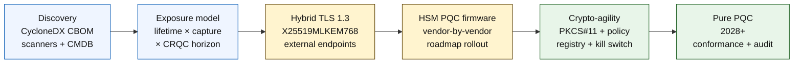

# 2026 年量子安全银行业指数:后量子密码学、QKD、密码敏捷性与先收集后解密风险

<!-- lead-start: manual -->
<aside class="post-lead" aria-label="文章摘要">

<strong>速览。</strong>2026 年的量子安全银行业是一项交付型项目,截止日期由两条曲线的交点决定——机构当下持有数据的机密性生命周期,以及具备密码相关能力的量子计算机(CRQC)到来的时间地平线。NIST FIPS 203 / 204 / 205 自 2024 年 8 月起已经定稿;CNSA 2.0 把美国联邦终态设在 2033 年;"先收集后解密"已经在长期保留数据上发生。董事会级量子记分卡跟踪四个精确百分比:清单完整度、HNDL 暴露面、NIST 迁移进度、密码敏捷性就绪度。

<strong>核心要点</strong>

<ul class="post-lead-takeaways">
  <li><strong>算法之争在 2024 年 8 月 13 日已经落幕。</strong>ML-KEM(FIPS 203)、ML-DSA(FIPS 204)、SLH-DSA(FIPS 205)就是答案。还在内部跑评估"挑出赢家"的银行,落后了 18 个月。</li>
  <li><strong>先收集后解密已经成立。</strong>任何机密性生命周期超过 CRQC 合理到来时间的资产——30 年期按揭、寿险核保、MiFID II / GDPR 交易录音、并购留存档案——必须立刻迁移到混合量子安全密钥封装,而不是等到 CRQC 公布之后。</li>
  <li><strong>清单是限速性的成熟度门槛。</strong>密码学物料清单(CBOM)——协议、库、证书、HSM 分区、供应商依赖、应用所有者、数据分类生命周期——是其他一切的前提条件。要跟踪的是新鲜度,不是覆盖率。</li>
  <li><strong>混合 TLS 1.3 是 2026 年的部署形态。</strong>X25519MLKEM768 混合密钥共享,是 Chrome / Firefox / Cloudflare / Akamai 今天实际协商的方案。纯 ML-KEM TLS 要等 HSM 固件与 CA 就绪。</li>
  <li><strong>密码敏捷性才是持久交付物。</strong>PKCS#11 抽象层、带标签的密钥、把业务服务映射到许可算法集的策略注册中心。没有它,下一次算法切换又是一个跨越数年的项目。</li>
</ul>
</aside>
<!-- lead-end -->

2026 年的量子安全银行业,关乎落地迁移,而非推演。NIST 已经定稿头三项后量子密码学标准,银行现在必须搞清楚:哪些系统依赖 RSA、ECC、TLS、签名、HSM、证书、支付通道、归档,以及长期保留的机密数据。指数的问题很简单:这家机构能否在威胁转为现实之前完成密码替换?

---

> **执行摘要 / 核心要点**
>
> - **NIST 标准已经具体落地。**FIPS 203 定义 ML-KEM 用于密钥封装,FIPS 204 定义 ML-DSA 用于签名,FIPS 205 把 SLH-DSA 定为无状态哈希签名标准。
> - **清单是第一道成熟度门槛。**找不到的东西,银行就无法迁移:证书、密钥、协议、应用、供应商、HSM、API、归档、嵌入式系统都得纳入图谱。
> - **密码敏捷性是持久目标。**目标不是一次性把算法换掉;是在不重新设计整套应用的前提下,能够更换密码原语。
> - **长期保留数据改变紧迫性。**"先收集后解密"风险意味着今天采集到的数据,只要保值时间足够长,日后就可能被读出来。
> - **QKD 是一种专门用途的补充。**量子密钥分发可能适用于价值最高的少数通道,但它不能替代全机构范围的 PQC 迁移。
>
---

## 为何 2026 是这份指数登场的年份

2024–2025 年的三项转变,把量子安全从研究观察点变成了可量化的银行项目。第一,NIST 于 2024 年 8 月 13 日定稿头部后量子标准:[FIPS 203(ML-KEM)⧉](https://nvlpubs.nist.gov/nistpubs/FIPS/NIST.FIPS.203.pdf "FIPS 203 —— 基于模格的密钥封装机制")、[FIPS 204(ML-DSA)⧉](https://nvlpubs.nist.gov/nistpubs/FIPS/NIST.FIPS.204.pdf "FIPS 204 —— 基于模格的数字签名标准")、[FIPS 205(SLH-DSA)⧉](https://nvlpubs.nist.gov/nistpubs/FIPS/NIST.FIPS.205.pdf "FIPS 205 —— 无状态哈希数字签名标准")。算法选型之争在那一天就结束了;到 2026 年还在跑"哪种方案胜出"的内部工作流的银行,落后了 18 个月。

第二,[NSA 的 CNSA 2.0 ⧉](https://media.defense.gov/2022/Sep/07/2003071834/-1/-1/0/CSA_CNSA_2.0_ALGORITHMS_.PDF "Commercial National Security Algorithm Suite 2.0")把美国联邦终态设在 2033 年,期间设置中间截止线:2027 年起针对软件和固件签名,2030 年起针对浏览器和操作系统。任何与美国联邦交易对手存在敞口的银行——FedNow、财政部业务、联邦客户账户——在涉及联邦数据的系统上都已置身这道边界之内。时钟不再抽象。

第三,[先收集后解密(HNDL)⧉](https://csrc.nist.gov/Projects/post-quantum-cryptography "NIST 后量子密码学项目")是支撑紧迫性的承重式风险论点。成熟对手已经在主要金融中心截获 TLS 保护下的支付报文、SWIFT 信封、KYC 文档,以及长期保留的归档密文。2026 年被截获的数据,只需要在解密时刻仍属机密敏感即可——对 30 年期按揭、寿险核保、MiFID II / GDPR 交易录音和并购留存档案而言,这个窗口远远超过任何对具备密码相关能力的量子计算机(CRQC)到来时间的可信估算。对手今天不需要一台量子计算机,他们只需要在数据失去价值之前拥有一台。

量子安全银行业指数度量的就是:你的机构能否在这两条曲线交汇之前,把迁移交付出去。问题已经不是要不要迁,而是能否在站得住脚的时间表内完成。

## 2026 年指数架构

| 指数层 | 2026 方向 | 就绪度指标 | 处置不当的风险 |
|---|---|---|---|
| **清单** | 把密码资产、协议、证书、供应商、数据类别绘成图谱 | 已纳入清单的资产比例 | 存在未知的量子脆弱依赖 |
| **暴露面** | 按机密性生命周期与交易关键性分级 | 高风险资产按价值与生命周期分布 | 迁移优先级误判 |
| **迁移** | 采用契合 NIST 标准的混合与 PQC 就绪模式 | ML-KEM 与 ML-DSA 就绪度 | 在最后期限前被迫紧急再平台化 |
| **密码敏捷性** | 把应用逻辑与密码原语解耦 | 受策略管控的密码覆盖率 | 算法在整个估盘内被硬编码 |
| **保障** | 测试互操作性、性能、HSM 支持、证书与供应商就绪 | 测试通过率与例外积压量 | 通道断裂或回退控制薄弱 |

### 董事会级量子记分卡

一份可信的量子就绪度记分卡,必须跟踪精确百分比,而不是只看项目状态:

1. **清单完整度:**一级关键应用中已完成密码学物料清单(CBOM)全图谱化的比例。
2. **HNDL 暴露面:**在未采用混合量子安全密钥封装的网络上传输的长期保留机密数据量(例如个人身份信息、商业机密)。
3. **NIST 迁移进度:**已迁移至 FIPS 203(ML-KEM)与 FIPS 204(ML-DSA)标准的非对称加密密钥与数字签名所占比例。
4. **密码敏捷性就绪度:**关键系统中,能通过集中策略轮换密码算法、无需重新编译代码的系统所占比例。

## 当前应跟踪的信号

| 信号 | 对银行意味着什么 | 信息源 |
|---|---|---|
| **FIPS 203 ML-KEM** | NIST 在通用加密密钥建立方面的主标准 | [NIST ⧉](https://www.nist.gov/news-events/news/2024/08/nist-releases-first-3-finalized-post-quantum-encryption-standards "首批三项已定稿的后量子加密标准") |
| **FIPS 204 ML-DSA** | NIST 在数字签名方面的主标准 | [NIST ⧉](https://www.nist.gov/news-events/news/2024/08/nist-releases-first-3-finalized-post-quantum-encryption-standards "首批三项已定稿的后量子加密标准") |
| **FIPS 205 SLH-DSA** | 基于哈希的签名替代与备份设计 | [NIST ⧉](https://www.nist.gov/news-events/news/2024/08/nist-releases-first-3-finalized-post-quantum-encryption-standards "首批三项已定稿的后量子加密标准") |
| **鼓励立即开始集成** | NIST 明确告诉管理员现在就开始集成标准,因为全面整合需要时间 | [NIST ⧉](https://www.nist.gov/news-events/news/2024/08/nist-releases-first-3-finalized-post-quantum-encryption-standards "首批三项已定稿的后量子加密标准") |
| **银行量子项目在扩张** | 主要银行在准备 PQC 切换的同时,也在探索量子技术 | [Quantum Insider ⧉](https://thequantuminsider.com/2026/03/27/15-plus-global-banks-probing-the-wonderful-world-of-quantum-technologies/ "全球银行探索量子技术概览") |

## 迁移从密码学总账开始

迁移顺序到现在已经很清楚。每道关卡都产出推动下一道关卡的证据;跳过或压缩任何一道关卡,都会触发指数架构故障栏里那种紧急再平台化的风险。

第一项交付物不是新算法,而是密码学物料清单(CBOM)。银行需要一份活的清单,把业务服务连接到算法、库、证书、密钥长度、HSM、数据生命周期、供应商,以及运营所有者。没有这份总账,量子安全迁移就只能靠猜。

CBOM 记录集对每一项密码原语都应当抓取:协议或接口(TLS 1.3、IPsec、SSH、自定义支付报文格式)、算法及参数集(RSA-2048、ECDH P-256、ML-KEM-768、ML-DSA-65)、库及其版本(OpenSSL 3.4、BoringSSL commit 哈希、供应商 SDK 构建)、硬件边界(HSM 分区、TPM、安全飞地,或无)、适用情况下的证书身份、应用所有者,以及数据分类生命周期。2025–2026 年陆续进入生产的工具——IBM Quantum Safe Inventory、开源的 [CycloneDX CBOM 规范 ⧉](https://cyclonedx.org/capabilities/cbom/ "CycloneDX 密码学物料清单")、CryptoNext / Sandbox / PQShield 的企业级扫描器——都能接入现有 CMDB 管线。它们没有一个能独立把事做完;即便配齐了厂商工具和专职人手,CBOM 建设周期也要 12–18 个月。

要跟踪的指标是新鲜度,不是覆盖率。一份过期两个月的 CBOM 比根本没有 CBOM 还糟,因为它会让安全团队对"已经迁了什么"产生虚假的信心。

## 先混合,始终敏捷

大多数银行不会一夜之间把所有东西都切换掉。现实路径是混合部署:传统机制与后量子机制并行运行,等供应商、协议、证书与运营工具逐步成熟。长期目标是密码敏捷性——由策略管控的密码选择,可在不重建业务应用的前提下更换。

[插入交互组件:先收集后解密(HNDL)风险计算器——一个基于滑块的工具,管理者输入数据保质期与预估量子时间线,查看自身暴露窗口。]

> **关键洞察:**如果你的数据需要保密 10 年,而具备密码相关能力的量子计算机(CRQC)还有 7 年到来,你的迁移截止日期不是 7 年后——是 3 年前。

落到实操上,这意味着:对外网端点采用 TLS 1.3 + 混合 `X25519MLKEM768` 密钥共享(Chrome / Firefox / Cloudflare / Akamai 今天都已支持),在 HSM 与 CA 基础设施跟上之前保留传统签名链,并部署一层 PKCS#11 抽象,让策略注册中心可以在不重新编译业务应用的前提下轮换算法。密码敏捷性决定下一次算法切换(只是何时,不是是否)是六周完成的轮换,还是又一个七年的项目。

## QKD 的定位

量子密钥分发(QKD)在本指数里的定位是面向高敏通道的可选项,尤其适用于金融市场基础设施、央行连接,以及对极敏感的机构间资金流。它应当被当作 PQC 的补充对待,而不是拖延全企业迁移的借口。

## 按银行类型解读

### 全球系统重要性银行

难点在规模:数以万计的 TLS 端点、数以百计的 HSM 分区、数十家内部证书颁发机构、几百套嵌入了密码原语的业务应用,以及银行无法改动的供应商 SDK。该投的不是又一个试点;而是 CBOM 工具链、嵌入每一项新建的 PKCS#11 抽象层、挑选一家牵头供应商主攻 PQC 固件且接受其余厂商多年长尾的 HSM 整合方案,以及在 FIPS 203 / 204 / 205 迁移完成很久之后仍将继续承担密码敏捷性的持久承载面——策略注册中心。

### 交易银行与对公银行

迁移范围比 G-SIB 层级要窄,但 HNDL 暴露面更尖锐:SWIFT 跨境报文、承载对公交易对手个人身份信息的结构化支付数据、保管贸易融资文档的单据交换平台,以及长期保留的报送归档。优先在每一个面向客户的端点上启用混合 TLS,并对留存归档启用静态 PQC。压住 HSM 供应商问责——对公银行平台团队握有的采购杠杆,通常比批发技术团队大得多。

### 区域性银行

直接采购已经具备密码敏捷性基础设施的供应商技术栈。选一个核心银行平台,其供应商发布 CBOM,并对 ML-KEM / ML-DSA 的支持时间表作出承诺。验证供应商的 HSM 路线图与本行迁移截止日期对得上。从零开始自建密码敏捷性所需的工程人力是跨年度量级;供应商在众多客户身上摊薄了这笔成本,银行直接享有结果。合理的内部范围,是核验工作——确认供应商的承诺能通过本机构的模型风险管理流程。

### 金融科技、PSP 与基础设施提供方

2026 年向银行销售时,供应商面对的竞争问题已不是"你支不支持 PQC",而是"你能否拿出一份自家平台的 CycloneDX CBOM、一张 HSM 供应商支持矩阵,以及一份成文的算法轮换 SLA。"答得出"能"的供应商,会在 2026–2027 年的一级采购关卡里被放行;答不出的,会在续约周期里把生意输给能答得出的对手。

## 结论

2026 年的量子安全银行业不是研究观察点;它是一项交付型项目,截止日期由两条曲线的交点决定——机构当下持有数据的机密性生命周期,以及具备密码相关能力的量子计算机到来的时间地平线。到 2030 年仍能让监管机构和交易对手认可的机构,是那些 2024 年就启动 CBOM 建设、2026 年年底前在每一个外部端点完成混合 TLS 部署、并把密码敏捷性从第一天起嵌入到每一项新建中的机构。没做这些的机构,会发现自己的迁移窗口,对于今天正在被对手收集的数据而言,可能早已关上。

像衡量任何运营项目那样衡量这次迁移:范围明确、排序到位、截止日期承诺、例外登记诚实。你把自己估盘看得越仔细,迁移窗口就显得越小。

## 常见问题

**银行应该先盘点什么?**

从对外暴露的 TLS、支付通道、客户身份认证、跨行连接、HSM 承载的服务、长期归档,以及处理长期有用机密数据的系统入手。

**PQC 只是一个网络安全议题吗?**

不是。它影响支付、身份、法律证据、交易签名、客户信任、数据留存、供应商管理与运营韧性。

**密码敏捷性是什么意思?**

密码敏捷性指的是通过策略和平台控制更换密码原语的能力,而不是靠硬编码的应用改动。

**银行该不该等更多标准出台?**

不该。NIST 已经鼓励管理员开始集成头几项最终标准,因为完成全面整合需要时间。

## 参考文献

- NIST,(2026)。[首批三项已定稿的后量子加密标准 ⧉](https://www.nist.gov/news-events/news/2024/08/nist-releases-first-3-finalized-post-quantum-encryption-standards "首批三项已定稿的后量子加密标准")。

<!-- enrich-start -->
<aside class="author-card" aria-label="关于作者"><strong class="author-card-name"><a href="/about/index.html">Sebastien Rousseau</a></strong>资深银行技术专家,撰写关于应用型人工智能、支付基础设施、代币化货币、ISO 20022、后量子安全、云原生金融服务,以及受监管数字市场的文章。在 HSBC 商业与投资银行、PayPal、Barclays、Shazam、AKQA、Virgin 集团积累二十余年经验。<a href="/about/index.html">完整简介</a> &middot; <a href="https://www.linkedin.com/in/sebastienrousseau/" rel="external noopener">LinkedIn</a> &middot; <a href="https://github.com/sebastienrousseau" rel="external noopener">GitHub</a></aside>

最近审阅 <time datetime="2026-06-04">2026-06-04</time>。

<!-- enrich-end -->
