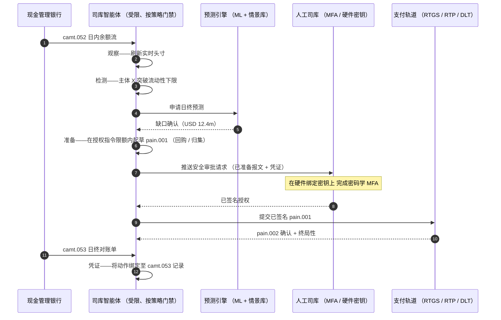

# 2026 自主财务指数：智能体司库、可编程流动性、代币化存款与实时现金管控

<!-- lead-start -->
<aside class="post-lead" aria-label="文章摘要">

<strong>要点速读。</strong>2026 年自主财务指数——把智能体司库工作流、可编程流动性覆盖、代币化存款集成、实时支付编排与自动化现金管控作为同一运营模式底盘衡量。

<strong>核心结论</strong>

<ul class="post-lead-takeaways">
  <li><strong>司库正在成为一套实时操作系统。</strong>静态现金预测与批量归集已不再是计量单位；以实时数据驱动的智能体工作流才是。</li>
  <li><strong>可编程流动性已经可行。</strong>代币化存款叠加实时轨道，使按事件计提流动性成为工作流原语，而非季度计划。</li>
  <li><strong>代币化存款是司库首选的数字货币。</strong>具备银行货币的经济性、可编程性与日内确定性——同时回避稳定币的发行方风险与储备问题。</li>
  <li><strong>控制平面就是新的审计面。</strong>授权指令、限额、人工覆盖路径与冲正凭证必须作为平台原语运行，而不是逐笔人工审批。</li>
  <li><strong>CFO 记分卡按决策计，不按季度计。</strong>资金成本、日内流动性缓冲削减、FX 效率与预测准确度应以工作流速度衡量。</li>
</ul>

<strong>延伸阅读：</strong><a href="https://sebastienrousseau.com/zh-hans/2026-05-25-programmable-liquidity-ai-tokenised-deposits-real-time-treasury-2026/index.html">2026 可编程流动性：AI、代币化存款与实时司库编排</a>、<a href="https://sebastienrousseau.com/zh-hans/2026-05-21-tokenised-deposits-banking-services-status-2026/index.html">2026 代币化存款：银行业务、稳定币竞争与可编程商业银行货币的现状</a>。

</aside>
<!-- lead-end -->

自主财务是智能体 AI、批发支付、代币化存款与实时流动性的天然交汇点。2026 年，最佳的司库架构不会仅停留在预测现金；它们会跨账户、币种、轨道与清算资产，对受限范围内的流动性动作进行建议、解释，并最终执行。

---

> **董事会摘要 / 核心结论**
>
> - **司库正从报告走向控制。**实时余额、预测、支付状态与流动性调拨正在汇入同一条工作流。
> - **智能体 AI 创造了新的司库交互界面。**智能体可以监控头寸、暴露异常、准备调拨动作，并在既定授权指令内升级决策。
> - **可编程货币改变了资金腿。**代币化存款与批发 CBDC 试验为原子清算、条件支付与永续流动性创造了新的可能。
> - **指数必须衡量权限。**问题不是智能体能否建议某项动作，而是权限、限额、审批与凭证是否清晰。
> - **司库价值可被衡量。**节省的流动性、减少的人工调查、避免的清算失败与释放的营运资本，应共同定义成功。
>
---

## 为什么 2026 年是这一指数升格为战略的拐点

Stanford AI Index 之所以有价值，是因为它把一个快速演进的技术领域当作可衡量对象：研究产出、技术性能、负责任部署、经济性、行业采纳、政策与公众情绪被纳入同一框架（[Stanford HAI ⧉](https://hai.stanford.edu/ai-index/2026-ai-index-report "The 2026 AI Index Report")）。银行与金融机构如今也需要同样的纪律来衡量基础设施。智能体 AI、抗量子安全、云原生韧性与批发支付不再是各自独立的创新赛道；它们正汇聚为同一套运营模式。

对一家银行而言，务实的问题不在于每个领域是否重要，而在于该机构能否同时衡量各领域的就绪度。一家银行可以部署智能体 AI，但若其密码学不具备迁移能力，仍可能脆弱；可以现代化云平台，但若支付数据仍未结构化，仍可能失败；可以推进代币化试点，但若清算、流动性、身份与审计层未一体化设计，仍可能制造系统性风险。

## 2026 指数架构

| 指数层 | 2026 方向 | 就绪度指标 | 处置不当的风险 |
|---|---|---|---|
| **可视化** | 统一账户、支付、流动性与敞口数据 | 实时现金头寸的覆盖度 | 现金可视化碎片化 |
| **预测** | 借助 AI 预测余额、流量与融资需求 | 预测准确度与异常率 | 在弱数据上建立虚假信心 |
| **自治** | 在建议与执行环节赋予智能体受限权限 | 授权指令覆盖度与审批质量 | 越权或缺乏解释的动作 |
| **可编程性** | 在能创造价值之处使用代币化存款与智能条件 | 条件支付与原子清算用例 | 技术驱动型司库试点 |
| **控制** | 嵌入限额、制裁、FX、流动性与审计控制 | 每项司库动作的控制凭证 | 执行之后的人工治理 |

## 当前需要跟踪的信号

| 信号 | 对银行的含义 | 来源 |
|---|---|---|
| **金融服务业 52% 的智能体 AI 采纳率** | 司库已可通过受治理平台承接智能体工作流 | [Cambridge CCAF ⧉](https://www.jbs.cam.ac.uk/faculty-research/centres/alternative-finance/publications/2026-global-ai-in-financial-services-report/ "2026 全球金融服务业 AI 报告") |
| **Project Agorá 条件支付** | 代币化可启用条件型与永续支付能力 | [BIS ⧉](https://www.bis.org/about/bisih/topics/fmis/agora.htm "Project Agorá 项目") |
| **英格兰银行数字证券沙盒（Digital Securities Sandbox）** | 基于 DLT 发行的债券与股票按券款对付（DvP）方式清算——资产腿与资金腿（批发 CBDC 或代币化商业银行存款）在同一笔原子交易中完成清算，消除本金对手方风险 | [英格兰银行 ⧉](https://www.bankofengland.co.uk/financial-stability/digital-securities-sandbox "Digital Securities Sandbox") |
| **SWIFT 结构化地址截止节点** | 司库数据必须在源端就被准确捕获 | [SWIFT ⧉](https://www.swift.com/news-events/news/iso-20022-milestone-november-2026-unstructured-addresses-be-removed "ISO 20022 2026 年 11 月结构化地址里程碑") |
| **大型金融机构难以衡量 AI 价值** | 司库自动化需要硬性的经济指标 | [Cambridge CCAF ⧉](https://www.jbs.cam.ac.uk/faculty-research/centres/alternative-finance/publications/2026-global-ai-in-financial-services-report/ "2026 全球金融服务业 AI 报告") |

## 司库智能体的授权指令

司库智能体不应被设计成通用型助手。它需要一份授权指令：观察账户、识别异常、预测资金缺口、准备动作、申请审批、在限额内执行并产出凭证。每一步都应对应不同的权限模型。

控制回路按观察 → 检测 → 预测 → 准备 → 申请审批的顺序运行——并停在此处。智能体绝不自行越过密码学授权边界。下图描绘了一个完整周期：一笔数百万美元级的日内流动性缺口在 `camt.052` 遥测中浮现，智能体预测当日终了头寸，准备一笔形态完整的 `pain.001`（回购或集团内归集），并交由人工司库在硬件绑定密钥上完成多因素密码学签名。智能体随后提交已签名报文；终局性以 `pain.002` 确认到达，并落入下一份 `camt.053` 记录。

边界本身就是要点——每一项调拨真实资金的动作，都坐落在智能体无法独自满足的密码学门禁之后。

## 可编程流动性

可编程流动性是按条件调拨资金的能力：当阈值被突破、当抵押品合格、当对手方通过筛查、当清算具备终局性、或当日内流动性缓冲过低时。代币化存款与批发清算平台让这些模式更具可行性。

可编程并不等于偏离标准。执行路径仍是 `pain.001`——ISO 20022 客户付款发起报文。智能体准备好的动作是一笔形态完整的 `pain.001` 报文，通过企业 ERP 同样使用的通道路由至银行，按同一套模式校验，由同一套反欺诈与制裁引擎评分，并通过同一份 `pain.002` 状态报文获得确认。条件性层（阈值、抵押品合格性、终局性可用性、缓冲下限）位于报文之上——它门禁的是*是否*发送一笔 `pain.001`，而不是其*报文形态*。那些自创非标准报文来表达条件的司库平台，将脱离银行可消费路径，回退至双边集成模式。

## 司库控制室

运营模式应当像一间控制室：头寸、预测、支付状态、限额使用、异常、审批与凭证集中于同一界面。指数应对那些需要团队把邮件、电子表格、银行门户与彼此割裂的看板拼凑起来的司库技术栈予以扣分。

支撑该界面的数据平面是 ISO 20022 现金管理。日内头寸为 `camt.052`——银行对客户账户报告——由每一家现金管理银行按其发布频率（一线 GTB 服务商以分钟计，长尾机构以批次结束计）流式注入智能体的观察层。日终对账为 `camt.053`——银行对客户对账单——是次日清晨用以评分智能体预测的可审计记录。那些读取 PDF 对账单或屏幕抓取银行门户的司库平台无法达到本指数的「4 级」；日内遥测必须以结构化 `camt.052` 形式到达，预测回路才能及时闭合以付诸行动。

## 不同银行类型的含义

### 全球系统重要性银行

全球性银行应将本指数视为企业架构记分卡。当前优先事项不是再做一个概念验证；而是要证明自主工作流、密码学迁移、云依赖与支付现代化能够作为同一套风险与价值体系被治理。

### 交易银行与企业银行

交易银行应聚焦于批发支付、结构化数据、流动性、代币化存款与智能体司库服务。最具价值的客户主张不仅是更快的资金调拨；而是更少调查、更清晰营运资本可视化的可解释、可审计、可编程资金调拨。

### 区域性银行

区域性银行应借助本指数避免项目蔓延。它们不必在每一条前沿赛道上领跑，但确实需要在 AI 治理、后量子清单、云退出凭证与支付数据就绪度上拿出可信的立场。

### 金融科技、PSP 与基础设施提供方

金融科技与基础设施提供方应将产品路线图对齐到可衡量的银行就绪度。最优主张将降低集成风险、强化凭证，并让复杂基础设施更易被银行治理。

## 结论

指数型报告的价值在于把分散的技术议程转换为可衡量的运营模式。2026 年，金融基础设施的赢家不会是试点最多的机构。它们将是能够在自治、安全、韧性、清算、经济性与治理各维度同时证明就绪度的机构。

## 常见问题

**什么是自主财务？**

自主财务是借助 AI 智能体、实时数据与可编程支付，在既定控制范围内对司库动作进行监控、建议并可能执行。

**司库智能体是否应被允许执行支付？**

仅可在狭窄的授权指令、强限额、明确审批与完整可审计性之下。执行权应通过成熟度逐步获得。

**代币化存款如何帮助司库？**

它们可以支撑可编程清算、原子执行，并有望在保留商业银行货币关系的同时实现更优的日内流动性管控。

**第一步实施应是什么？**

在赋予自治之前，先建立实时可视化与数据质量。智能体无法安全优化它看不清楚的现金。

## 参考文献

- Cambridge Centre for Alternative Finance, (2026). [2026 全球金融服务业 AI 报告 ⧉](https://www.jbs.cam.ac.uk/faculty-research/centres/alternative-finance/publications/2026-global-ai-in-financial-services-report/ "2026 全球金融服务业 AI 报告").
- SWIFT, (2026). [ISO 20022 2026 年 11 月结构化地址里程碑 ⧉](https://www.swift.com/news-events/news/iso-20022-milestone-november-2026-unstructured-addresses-be-removed "ISO 20022 2026 年 11 月结构化地址里程碑").
- BIS Innovation Hub, (2026). [Project Agorá 项目 ⧉](https://www.bis.org/about/bisih/topics/fmis/agora.htm "Project Agorá 项目").
- Bank of England, (2026). [塑造英国的数字金融未来 ⧉](https://www.bankofengland.co.uk/speech/2025/january/sasha-mills-speech-at-the-tokenisation-summit "塑造英国的数字金融未来").

<!-- enrich-start -->
<aside class="author-card" aria-label="关于作者"><strong class="author-card-name"><a href="/about/index.html">Sebastien Rousseau</a></strong>资深银行技术专家，撰写关于应用型人工智能、支付基础设施、令牌化货币、ISO 20022、后量子安全、云原生金融服务与受监管数字市场的文章。在 HSBC 商业与投资银行、PayPal、Barclays、Shazam、AKQA、Virgin 集团积累二十余年经验。<a href="/about/index.html">完整简介</a> &middot; <a href="https://www.linkedin.com/in/sebastienrousseau/" rel="external noopener">LinkedIn</a> &middot; <a href="https://github.com/sebastienrousseau" rel="external noopener">GitHub</a></aside>

最近审阅 <time datetime="2026-06-07">2026-06-07</time>。

<!-- enrich-end -->
