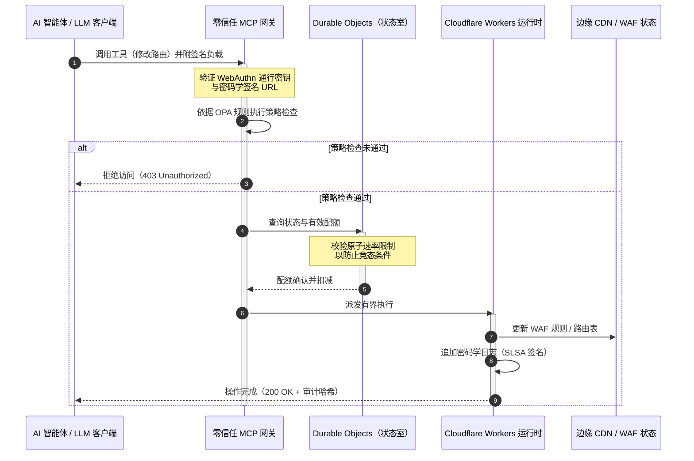

# CloudCDN：2026 年 AI 原生边缘的开源蓝图

<!-- lead-start: manual -->
<aside class="post-lead" aria-label="文章摘要">

<strong>要点速览。</strong>2026 年的企业技术由全球分布式无服务器执行与智能体 AI 的融合所定义。为静态文件缓存与基础流量路由而设计的标准 CDN，在主动、实时数据编排的时代已在结构上过时。CloudCDN 是一份开源蓝图，把边缘改造为主动控制平面：无服务器运行时、基于 Cloudflare Durable Objects 的有状态协调，以及一个零信任的模型上下文协议（MCP）网关，让自主 AI 智能体在有界、密码学加固的操作边界内运维 Web 基础设施。

<strong>核心要点</strong>

<ul class="post-lead-takeaways">
  <li><strong>从静态缓存到有界控制平面。</strong>CloudCDN 将运营边界移至边缘，把 CDN 节点转化为主动策略闸口，在亚毫秒级执行安全、路由与访问控制决策。</li>
  <li><strong>有状态的边缘协调。</strong>Cloudflare Durable Objects 在全球范围强制执行原子化、实时的速率限制与状态协调——没有分布式竞态条件，也不存在跨边缘区域的系统性配额滥用。</li>
  <li><strong>通过 MCP 实现安全的智能体基础设施管理。</strong>零信任网关暴露 42 个专用 MCP 工具，让 AI 智能体在密码学签名的边界内检查、配置并运维基础设施。</li>
  <li><strong>供应链安全是流水线交付物。</strong>经由 Sigstore/Cosign 的 SLSA Level 3 构建溯源，加上每次发布 3,185 项单元测试与 100% 覆盖率。</li>
  <li><strong>面向董事会的证据，而非仪表盘。</strong>边缘遥测直接映射到 DORA 第 5 条董事会问责、BCBS 239 风险报告与 Basel III 操作风险资本规则。</li>
</ul>

<strong>延伸阅读：</strong><a href="/2026-05-16-best-cloud-infrastructure-architecture-2026/">2026 年最佳云基础设施架构：面向金融服务的 AI 原生、多云、量子感知蓝图</a> · <a href="/2026-06-05-cloud-native-banking-index-dora-resilience-platform-engineering-2026/">2026 年云原生银行指数：DORA、平台工程、主权云与运营韧性</a> · <a href="/2026-06-03-agentic-ai-index-banks-autonomy-governance-auditability-2026/">2026 年银行智能体 AI 指数：衡量自主性、治理、可审计性与业务影响</a>

</aside>
<!-- lead-end -->

CDN 之争已经结束。边缘不再是缓存，而是 AI 原生软件的控制平面。当智能体开始调用工具、移动数据、清除缓存、申请签名 URL 并协调工作流时，依赖不透明仪表盘与专有控制平面的旧模式不再只是不便，而成为一项监管负债。CloudCDN 主张另一种模式：一个开放、可检查、智能体可控的边缘平台，把安全、无障碍、性能与可审计性作为可强制执行的默认项，而非厂商承诺。

本文的开源参考实现是 [cloudcdn.pro ⧉](https://github.com/sebastienrousseau/cloudcdn.pro "cloudcdn.pro")。该仓库是一个多租户、AI 原生的 CDN，可端到端阅读并独立部署：在 Cloudflare PoP 网络上 TTFB 低于 100ms、MCP 控制、Durable Objects 速率限制、WCAG-AA 无障碍、签名 URL、通行密钥、SLSA Level 3，以及 3,185 项测试 100% 覆盖。

---

> **董事会摘要 / 核心要点**
>
> - **边缘成为运营边界。** CloudCDN 将标准 CDN 节点转化为主动策略闸口，在亚毫秒级执行安全、路由与访问控制。
> - **Durable Objects 让速率限制具备原子性。** 实时、全球一致的配额执行，关闭了最终一致性限流器留给攻击者与失控智能体的竞态窗口。
> - **智能体通过 42 个有界 MCP 工具运维基础设施。** 每次调用在任何执行发生之前，都要通过 WebAuthn 通行密钥、签名负载与 OPA 策略校验。
> - **供应链是产品的一部分。** 经由 Sigstore/Cosign 的 SLSA Level 3 溯源，把每次发布与其经审计的源码以密码学方式绑定。
> - **遥测即合规证据。** 边缘操作直接映射到 DORA 第 5 条、BCBS 239 与 Basel III 操作风险资本——是直接映射，而非事后报告。
>
---

## 这一开源项目为何在 2026 年重要

2026 年的企业 IT 已从静态基础设施供给转向实时、事件驱动的数据编排。两股市场力量推动了这一转变。

其一是智能体 AI 的扩散。自主模型与软件智能体如今承担复杂的运营任务——自动化威胁缓解、路由决策、实时账务平衡。它们不用仪表盘。它们调用工具。

其二是[《数字运营韧性法案》（DORA） ⧉](https://eur-lex.europa.eu/legal-content/EN/TXT/?uri=CELEX%3A32022R2554 "欧盟 (EU) 2022/2554 号金融部门数字运营韧性条例")的正式执行。银行机构不能再依赖不透明的专有第三方 CDN。监管机构要求对软件供应链的完全可见性、可验证的退出能力，以及不可篡改的密码学审计轨迹。

集中式服务器架构带来的时延损耗，是实时编排无法吸收的。专有 CDN 是黑箱，使机构暴露于其既看不见、更无法举证的供应链入侵之中。CloudCDN 用一份透明、零信任的开源蓝图补上这一缺口，把边缘变成主动控制平面。对技术高管而言，它把对话从合规成本转向韧性回报（Return on Resilience）：由自动化、随时可审计的运营流水线所保全的资本。

## 架构视角

CloudCDN 架构分为五层，用本地化、有状态的边缘原语取代集中式中间件：

| 层级 | 设计决策 | 重要性 | 处理不当的风险 |
|---|---|---|---|
| **边缘运行时** | Cloudflare Workers 与 Pages | 消除集中式虚拟机时延；在全球范围以亚毫秒级执行策略 | 只有性能收益而无策略纪律，将造成混乱的边缘漂移 |
| **状态协调** | Durable Objects | 为跨区域速率限制与共享状态提供原子化、实时一致性保证 | 分布式竞态条件、API 资源滥用、边界配额被绕过 |
| **智能体接口** | 零信任 MCP 网关 | 暴露 42 个专用 MCP 工具，让 AI 智能体在受治理的边界内运维基础设施 | 无边界的工具调用与未经授权的配置变更 |
| **访问控制** | WebAuthn 通行密钥与签名 URL | 以密码学签名取代静态口令，使操作可审计 | 归属薄弱的变更；凭证窃取导致边界失守 |
| **质量关口** | SLSA Level 3 与 100% 测试覆盖 | 以数学方式验证构建来源；阻断恶意依赖注入 | 恶意代码经软件供应链植入 |

## 需要追踪的运营信号

边缘就绪程度是可度量的。以下量化指标体现的是执行能力，而非意愿：

| 信号 | 指标 / 基准 | 监管参照 | 平台实现 |
|---|---|---|---|
| **42 个 MCP 工具** | 面向自动化管理的有界工具注册表数量 | COBIT 2019 (BAI06) | MCP 网关依据 OPA 策略校验智能体签名 |
| **Durable Objects** | 零泄漏、亚毫秒级的原子配额执行 | DORA 第 6 条 | Durable Objects 跟踪全球 API 配额状态 |
| **通行密钥与签名 URL** | 100% 管理员会话经 FIDO2 WebAuthn 验证 | DORA 第 30 条 | 边缘路由器内嵌密码学签名校验 |
| **SLSA Level 3** | 密码学签名的构建清单（Sigstore） | DORA 第 30 条 | GitHub Actions 流水线生成签名构建元数据 |
| **3,185 项单元测试** | 100% 覆盖；每次发布设回归关口 | NIST CSF 2.0 (PR.DS-01) | CI 流水线在任何测试失败时中止部署 |

## CDN 成为主动控制平面

传统 CDN 围绕被动、静态的内容加速而设计。CloudCDN 重新定义了这一模型。集成 Cloudflare Workers 与 Durable Objects 之后，边缘成为主动、有状态的策略闸口。

当 AI 智能体或自动化流程请求变更基础设施配置或调整路由时，它面对的不是一个脆弱的集中式数据库。请求在最近的边缘节点被截获，并在任何执行发生之前依次通过身份、策略与配额检查：

该序列中的每一步都会产生一条可归属、已签名的记录。这正是"加速内容的 CDN"与"可被治理的控制平面"之间的差别。

## 开源为何改变信任模型

对首席信息安全官而言，不透明的专有 CDN 是一种不断累积的风险。闭源边缘网络是黑箱：一旦厂商内部失守，银行在事件被公开披露之前毫无可见性。

CloudCDN 用一个完全可审计的开源信任模型取代这种不对称，依托三项机制：

1. **数学化的构建溯源。** 在 SLSA Level 3 之下，每次发布都以密码学方式绑定到其开源 GitHub 仓库。CISO 可以验证——以数学方式，而非合同条款——运行在 Cloudflare 全球边缘节点上的二进制文件与经审计的源码完全一致。
2. **持续、公开的安全审计。** 代码库持续接受自动化扫描、公开漏洞披露与同行评审的代码审计。隐匿不是控制手段；评审才是。
3. **无厂商锁定（DORA 第 28 条）。** DORA 要求银行证明对关键第三方供应商具备清晰、经测试的退出策略。由于 CloudCDN 是开源的，且构建在标准无服务器原语之上，机构可以把边缘配置从 Cloudflare 迁移到其他无服务器运行时或私有 Kubernetes 集群——并向监管机构举证这一能力。

## 银行级边缘范式

CloudCDN 按全球金融行业的合规标准设计，把技术性边缘操作直接映射到监管机构实际检查的框架：

- **模型风险管理（[美联储 SR 11-7 ⧉](https://web.archive.org/web/20260414150921/https://www.federalreserve.gov/supervisionreg/srletters/sr1107.htm "模型风险管理监管指引") / 英国 PRA SS1/23）。** 执行运营任务的自主模型纳入模型风险治理。CloudCDN 的 MCP 网关把智能体工具当作量化模型对待：严格的策略边界、实时日志，以及对高影响操作强制的人工介入复核。
- **BCBS 239（风险数据汇总）。** 通过在边缘捕获、打标并结构化交易数据，运营指标得以实时生成——符合 BCBS 239 对数据完整性、及时性与监管可追溯性的要求。
- **DORA 第 5 条（董事会问责）。** 董事会对运营韧性承担最终个人责任。CloudCDN 把边缘遥测转化为量化、可验证的证据，非技术背景的董事也能将其带入个人责任审计。
- **Basel III 操作风险资本。** 银行须为操作风险持有监管资本。自动化灾备切换与 SLSA Level 3 溯源降低机构的操作风险水平——在资产负债表上保全资本，而不只是应付一次审计。

## 对不同类型银行的含义

### 全球系统重要性银行（G-SIB）

G-SIB 在多个司法辖区处理巨量交易。优先事项是用单一、统一的边缘平面取代碎片化的传统边界控制。部署 CloudCDN 范式后，G-SIB 可以在全球统一安全策略、API 网关与智能体治理——并把符合 DORA 的证据流水线作为运营的副产品生成，而不是每季度临时赶工。

### 交易银行与公司银行

对交易银行而言，面向客户的产品是执行速度、安全性与数据透明度的组合。CloudCDN 范式让这些银行能够向企业司库开放安全的 API 仪表盘与实时现金追踪服务——以更具韧性的边缘态势守住企业存款。

### 区域性及中小银行

区域性银行面对与 G-SIB 相同的威胁主体，却没有同等的工程预算。一份开源的银行级边缘蓝图开箱即提供这些控制：无需专有许可成本即可实现监管对齐，并以源代码自证。

## 董事会行动手册

运营韧性不再是后台 IT 的隐形指标，而是附带个人责任的董事会优先事项。2026 年能够守住监管机构、客户与股东信任的机构，把技术当作可验证、可观测的资产来经营。

留给高级技术负责人的路线图很短：

1. **把证据当作产品来要求。** 为边缘的自动化、自我留痕的流水线编列预算——证据由运营产生，而非为审计师临时拼装。
2. **转向有状态的边缘控制。** 把速率限制、WAF 与身份验证从集中式服务器移到原子化的边缘原语之上。
3. **建立密码学化的智能体边界。** 对每一次自动化工具调用强制执行零信任 MCP 网关，辅以通行密钥与 OPA 校验。
4. **要求开源构建审计。** 把 SLSA Level 3 构建溯源作为部署条件，而非愿景。

## 常见问题

**CloudCDN 是否已为 DORA 审计做好准备？**

是。CloudCDN 的设计目标是产出自动化合规证据，可直接映射到信息登记册的 ITS 模板（RT.01 至 RT.15）与 DORA 第 30 条合同条款。

**用 Durable Objects 做速率限制的优势是什么？**

传统分布式限流器依赖最终一致性，留下一个攻击者或失控智能体可以利用的时延窗口。Durable Objects 在全球范围保证即时、原子的一致性，把竞态窗口彻底关闭。

**是什么让 CloudCDN 称得上 AI 原生？**

它的 MCP 控制操作与智能体感知的控制模型。基础设施通过 42 个受治理的工具运维，附带密码学身份与策略边界——为自主工作流而设计，而不只是面向人工仪表盘。

**开源代码会增加零日漏洞风险吗？**

不会。专有闭源 CDN 依赖"以隐匿求安全"。CloudCDN 的代码库持续接受自动化测试、公开同行评审与 SLSA Level 3 验证——这是一个可验证的更高信任门槛。

## 参考资料

- 欧洲议会与欧盟理事会, (2022). [关于金融部门数字运营韧性的 (EU) 2022/2554 号条例（DORA） ⧉](https://eur-lex.europa.eu/legal-content/EN/TXT/?uri=CELEX%3A32022R2554 "关于金融部门数字运营韧性的 (EU) 2022/2554 号条例（DORA）"). 布鲁塞尔: 欧盟官方公报.
- 巴塞尔银行监管委员会 (BCBS), (2013). [有效风险数据汇总与风险报告原则（BCBS 239） ⧉](https://www.bis.org/publ/bcbs239.htm "有效风险数据汇总与风险报告原则（BCBS 239）"). 巴塞尔: 国际清算银行.
- 美联储理事会, (2011). [模型风险管理监管指引（SR Letter 11-7） ⧉](https://web.archive.org/web/20260414150921/https://www.federalreserve.gov/supervisionreg/srletters/sr1107.htm "模型风险管理监管指引（SR Letter 11-7）"). 华盛顿特区: 美联储.
- Cloudflare, (2026). [Durable Objects 文档：有状态边缘协调 ⧉](https://developers.cloudflare.com/durable-objects/ "Durable Objects 文档"). 旧金山: Cloudflare.
- Cloudflare, (2026). [使用 MCP、认证与 Durable Objects 构建 AI 智能体 ⧉](https://blog.cloudflare.com/building-ai-agents-with-mcp-authn-authz-and-durable-objects/ "使用 MCP、认证与 Durable Objects 构建 AI 智能体").
- GitHub, (2026). [cloudcdn.pro 仓库 ⧉](https://github.com/sebastienrousseau/cloudcdn.pro "cloudcdn.pro 仓库").

<!-- enrich-start -->
<aside class="author-card" aria-label="关于作者"><strong class="author-card-name"><a href="/about/index.html">Sebastien Rousseau</a></strong>资深银行技术专家，撰写关于应用型人工智能、支付基础设施、令牌化货币、ISO 20022、后量子安全、云原生金融服务与受监管数字市场的文章。在 HSBC 商业与投资银行、PayPal、Barclays、Shazam、AKQA、Virgin 集团积累二十余年经验。<a href="/about/index.html">完整简介</a> &middot; <a href="https://www.linkedin.com/in/sebastienrousseau/" rel="external noopener">LinkedIn</a> &middot; <a href="https://github.com/sebastienrousseau" rel="external noopener">GitHub</a></aside>

最近审阅 <time datetime="2026-06-11">2026-06-11</time>。

<!-- enrich-end -->
