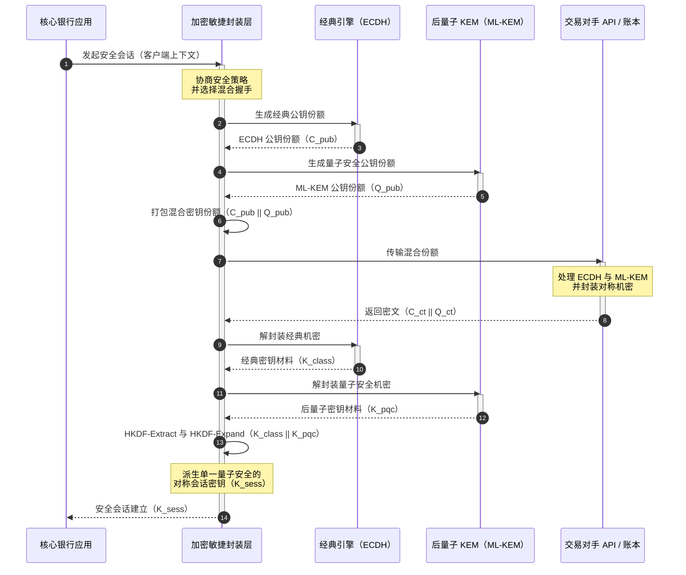

# KyberLib 与 2026 后量子银行迁移：从标准到代码

<!-- lead-start: manual -->
<aside class="post-lead" aria-label="文章摘要">

<strong>要点速览。</strong>2026 年的银行基础设施面临一项终点已知的系统性威胁：量子级算力将破解保护当前传输流量的 RSA 与 ECC 密钥交换。联邦标准与监管政策文件提升了认知，技术执行却依然各自为政。<a href="https://github.com/sebastienrousseau/kyberlib">KyberLib</a> 是一份开源工程蓝图，把后量子叙事落到具体、内存安全的 Rust 代码上——在加密敏捷的抽象边界之后实现 NIST 标准化的 ML-KEM（FIPS 203），让机构能够在"现在收集、稍后解密"攻击触及其档案之前，完成传输安全与密钥封装的升级。

<strong>核心要点</strong>

<ul class="post-lead-takeaways">
  <li><strong>从政策到可检查的代码。</strong>KyberLib 把后量子密码学从抽象的战略路线图带入具体、高性能、可审计的 Rust 实现。</li>
  <li><strong>标准化的 FIPS 203 ML-KEM 执行。</strong>该库实现了在 NIST FIPS 203 下定稿的密钥建立算法 ML-KEM，让合规一致性与全球监管预期保持对齐。</li>
  <li><strong>设计即加密敏捷。</strong>稳定的抽象边界让银行应用在不进行昂贵且易错的应用重写的前提下替换密码原语。</li>
  <li><strong>Rust 驱动的内存安全。</strong>编译期所有权规则根除困扰传统 C 系密码库的缓冲区溢出与内存泄漏，并保持零成本抽象的速度。</li>
  <li><strong>缓释信义责任风险。</strong>可观测、可测试的迁移证据，为董事提供 DORA 第 5 条个人问责审计所要求的"合理措施"记录。</li>
</ul>

<strong>延伸阅读：</strong><a href="/2026-05-18-quantum-cryptography-standards-developments-2026/">2026 年量子密码学重置：PQC 标准、QKD 保证与银行不能再拖延的迁移工作</a> · <a href="/2026-05-28-dora-ai-act-data-sovereignty-banking-compliance-stack-2026/">DORA 与 AI 法案合规栈</a> · <a href="/2026-05-20-cloud-native-banking-financial-institutions-2026/">云原生银行</a>

</aside>
<!-- lead-end -->

后量子迁移已不再是一项规划演练。2026 年它是一项进行中的运营要求，而监管意图与工程执行之间的缺口正是风险所在。[KyberLib ⧉](https://github.com/sebastienrousseau/kyberlib "kyberlib") 弥合了其中一部分缺口：这是一份面向生产环境、内存安全的 Rust 库，按定稿的 FIPS 203 参数实现 ML-KEM，并将其包裹在银行交易资产真正需要的加密敏捷边界之内。

---

> **董事会摘要 / 核心要点**
>
> - **威胁已经在运行。**对手今天就在执行"现在收集、稍后解密"式的截存；当具备密码学相关性的量子计算机问世之日，数据机密性将被追溯击穿。
> - **标准已经定稿。**NIST FIPS 203（ML-KEM）与 FIPS 204（ML-DSA）给审计委员会提供了清晰、可测试的基准——"等待标准"不再是抗辩理由。
> - **KyberLib 是工程蓝图。**内存安全的 Rust、面向 HSM 与智能卡的 `no_std` 编译，以及保留经典互操作性的混合握手模式。
> - **加密敏捷性才是持久目标。**稳定的抽象边界让原语更换无需重写应用——这是比任何单一算法都长寿的经验。
> - **责任落在董事会。**DORA 第 5 条把个人责任压在董事身上；可检查、可观测的迁移代码就是满足这一要求的证据。
>
---

## 为什么这个开源项目在 2026 年重要

随着非对称密码逼近失效，威胁并不会等到一台具备密码学相关性的量子计算机建成才出现。对手正在执行**"现在收集、稍后解密"（SNDL）**攻击——截存企业银行交易、商业机密与机构通讯的加密传输流，意图在量子能力成熟后解密。对一家银行而言，今天线路上的每一次经典握手，都是一起延迟引爆的机密性泄露。

监管机构已以具体义务作出回应：

1. **DORA 第 6 条（ICT 风险管理）**要求机构对其密码学资产中的漏洞进行测绘、识别与缓释——包括埋在无人清点的中间件里的非对称密钥交换。
2. **NIST FIPS 203 与 204**确立了密钥封装（ML-KEM）与数字签名（ML-DSA）的官方后量子标准，为审计委员会提供了衡量迁移进度的标准化基准。

要在不扰动在线业务的前提下执行这场迁移，就必须超越政策文件，转向**可检查的开源密码基础设施**。[KyberLib ⧉](https://github.com/sebastienrousseau/kyberlib "kyberlib") 提供的正是这一点：一份符合 FIPS 203 的内存安全 Rust 库，把后量子转型变成可度量、可验证的工程流水线——并把技术投资的讨论引向切实可见的韧性回报（Return on Resilience）。

## 架构视角

KyberLib 位于稳定的 API 边界之后，把银行核心交易应用与底层密码原语的变化隔离开来。

| 层级 | 设计决策 | 为什么重要 | 处理不当的风险 |
|---|---|---|---|
| **原语** | FIPS 203 ML-KEM 密钥封装 | 以基于格的结构替换经典 Diffie-Hellman 与 RSA 密钥交换 | 与定稿的 FIPS 203 参数不一致，导致合规审计失败 |
| **语言** | 内存安全的 Rust 实现 | 根除 C/C++ 固有的内存破坏漏洞（缓冲区溢出、释放后使用） | 依赖蔓延侵蚀构建链完整性 |
| **抽象** | 稳定的加密敏捷边界 | 应用在统一接口背后随标准演进切换算法 | 硬编码原语迫使未来每次迁移都手工重写 |
| **部署** | 混合加密握手 | 在双重封装信封中把后量子 KEM 与经典算法结合 | 丧失既有互操作性或出现无声的配置漂移 |
| **保证** | SLSA Level 3 溯源与可检查的测试 | 保证代码来源与出处；示例可逐行审计 | 安全表演——实现错误在生产环境暴露的黑盒库 |

## 应跟踪的运营信号

向监管董事会与监管机构证明后量子合规，意味着追踪具体、可量化的指标：

| 信号 | 指标 | 监管参考 | 平台实现 |
|---|---|---|---|
| **FIPS 203 ML-KEM 符合性** | 100% 符合定稿参数（ML-KEM-512/768/1024） | NIST FIPS 203 | 在 KyberLib 模块内编译的、经参数验证的格密码 |
| **密码学清点** | 覆盖全部系统的非对称密钥交换使用清单 | NIST SP 1800-38 | 自动扫描代理把在用密码套件记入中央登记簿 |
| **混合密钥交换** | 以混合信封执行的传输层握手占比 | DORA 第 6 条 | 网络代理把经典 TLS 1.3 握手包裹在后量子封装之内 |
| **`no_std` 编译** | 面向受限目标、脱离 Rust 标准库的编译能力 | DORA 第 30 条 | KyberLib 中面向硬件安全模块（HSM）的条件式 `no_std` 编译 |
| **加密敏捷指数** | 在 API 网关上替换一个密码原语所需的分钟数 | 英国 PRA SS1/23 | 通过运行时变量管理算法分配的抽象路由登记簿 |

## 为什么 Rust 对后量子密码学重要

实现 ML-KEM 这类后量子算法，需要在多项式环上进行复杂的底层数学运算。历史上，要以生产级速度运行这些运算，意味着手写 C/C++ 或汇编——这恰恰在银行最输不起的代码里，留下了巨大的内存破坏攻击面。

Rust 以三种具体方式改变了密码工程的安全态势：

1. **编译期内存安全。**Rust 的所有权模型保证缓冲区溢出、双重释放与释放后使用错误在编译期即被阻止。这对后量子库尤为关键，因为其密钥与密文尺寸显著大于经典对应物。
2. **确定性的零成本抽象。**Rust 编译为原生机器码且没有垃圾回收器，执行速度与内存占用与 C 系库持平或更优，同时保有安全性。
3. **`no_std` 兼容性。**KyberLib 可脱离 Rust 标准库编译，因此能运行在受限的裸机环境中——包括硬件安全模块（HSM）与智能卡——让银行级密码学留在物理安全边界之内。

## 设计加密敏捷架构

密码迁移的经典失败模式是硬编码：算法特定的假设直接嵌入应用逻辑，每一次转型都要痛苦地重新发现一遍。2026 年的持久目标是**加密敏捷性**——一个把算法视为稳定接口背后可替换模块的抽象层，让下一次迁移成为一次配置变更，而非全资产范围的重写。

下面的时序展示了 KyberLib 的加密敏捷封装层如何协调一次混合（经典加后量子）密钥交换握手：

混合信封是运营上的关键细节。在后量子原语积累足够多年的生产检验之前，会话密钥同时派生自经典与后量子两份机密：攻击者必须同时攻破 ECDH **和** ML-KEM 才能还原信道。尚未迁移的交易对手照常运转；已迁移的交易对手立即获得基于格的保护。

## 董事会行动手册

后量子安全不是后台的加密琐事，而是一项关乎个人利害的董事会治理议题。高级管理层应从信义责任的角度框定这场迁移：

- **DORA 第 5 条（治理与组织）**把 ICT 安全的个人责任压在董事会身上。开源、可观测的测试正是个人责任审计所要求的直接证据——"我们选择了一份可检查的 FIPS 203 实现，这是它的符合性测试记录"是站得住的回答；"我们的供应商向我们作了保证"不是。
- **模型风险管理（美联储 SR 11-7 / 英国 PRA SS1/23）**适用于密码封装架构，正如适用于定价模型。抽象层应通过 MRM 验证，包括极端中断情景下的性能表现。
- **Basel III 操作风险资本**奖励经过验证的控制成熟度。经过测试的混合握手会降低机构的长期操作风险画像，削减资本溢价，为财资的主动配置释放资产负债表空间。

## 对不同类型银行的含义

### 全球系统重要性银行（G-SIB）

G-SIB 运营着以遗留系统为主的交易资产，其约束瓶颈在于发现：搞清楚非对称密钥交换究竟发生在哪里。第一步是依照 NIST SP 1800-38 指引建立持续的密码学清单；随后 KyberLib 提供标准化、内存安全的库，在清单暴露出的每一个现代节点上执行后量子密钥封装。

### 交易银行与对公银行

支付通道上的机密性就是其特许经营本身。由于 KyberLib 可编译至裸机 `no_std` 目标，交易银行能把后量子握手直接部署进边缘支付路由与流动性管理硬件——而不仅仅停留在应用层。

### 区域性与中小银行

区域性机构面对同样的国家级截存威胁，却没有 G-SIB 的研究预算。一份可检查的开源 Rust 实现给了它们一条即刻达到 NIST FIPS 203 符合性的现成路径，无需与黑盒供应商的路线图讨价还价。

## 从路线图到可编译的代码

后量子转型是一项进行中的工程任务；能在 2026 年持续赢得监管者、交易对手与企业财资信任的机构，是那些从抽象路线图走向可观测、可编译代码的机构。高管的任务由此直接得出：审计遗留密钥交换点，在价值最高的通道上部署混合握手，并构建让未来每一次原语更换都成为例行操作的稳定抽象边界。KyberLib 把上述每一步都变成可度量的运营能力，而非幻灯片上的承诺。

## 常见问题

**KyberLib 符合已定稿的 NIST 标准吗？**

符合。KyberLib 围绕 FIPS 203 定稿的 ML-KEM 参数设计，使编译后的库与联邦及全球监管预期保持一致。

**后量子库需要专用硬件吗？**

不需要。KyberLib 的 Rust 实现可编译至标准系统架构。其 `no_std` 能力还使其能运行在需要物理密钥托管的专用硬件安全模块（HSM）与智能卡上。

**"现在收集、稍后解密"如何影响当下的合规？**

如果传输层依赖经典 RSA 或 ECC，对手今天就能截存流量，并在量子能力成熟后解密。现在部署混合密钥交换，能让被截获的数据始终处于基于格的保护之下。

**为什么用混合握手，而不是直接切换到后量子原语？**

混合信封同时从经典与后量子两份机密派生会话密钥，除非两者同时被攻破，安全性始终成立。这既保留了与未迁移交易对手的互操作性，也给新原语留出积累生产检验的时间。

## 参考资料

- National Institute of Standards and Technology, (2024). [FIPS 203：基于模格的密钥封装机制标准 ⧉](https://www.nist.gov/news-events/news/2024/08/nist-releases-first-3-finalized-post-quantum-encryption-standards "NIST FIPS 203 发布公告").
- Board of Governors of the Federal Reserve System, (2011). [模型风险管理监管指引（SR Letter 11-7）⧉](https://web.archive.org/web/20260414150921/https://www.federalreserve.gov/supervisionreg/srletters/sr1107.htm "美联储 SR 11-7").
- European Parliament and Council of the European Union, (2022). [关于金融部门数字运营韧性的（EU）2022/2554 号条例（DORA）⧉](https://eur-lex.europa.eu/legal-content/EN/TXT/?uri=CELEX%3A32022R2554 "DORA 条例").
- NIST National Cybersecurity Center of Excellence, (2025). [向后量子密码学迁移（NIST SP 1800-38）⧉](https://www.nccoe.nist.gov/projects/migration-post-quantum-cryptography "NIST SP 1800-38").
- GitHub, (2026). [kyberlib 开源仓库 ⧉](https://github.com/sebastienrousseau/kyberlib "kyberlib 仓库").

<!-- enrich-start -->
<aside class="author-card" aria-label="关于作者"><strong class="author-card-name"><a href="/about/index.html">Sebastien Rousseau</a></strong>资深银行技术专家，撰写关于应用型人工智能、支付基础设施、令牌化货币、ISO 20022、后量子安全、云原生金融服务、开源基础设施与受监管数字市场的文章。在 HSBC 商业与投资银行、PayPal、Barclays、Shazam、AKQA、Virgin 集团积累二十余年经验。<a href="/about/index.html">完整简介</a> &middot; <a href="https://www.linkedin.com/in/sebastienrousseau/" rel="external noopener">LinkedIn</a> &middot; <a href="https://github.com/sebastienrousseau" rel="external noopener">GitHub</a></aside>

最近审阅 <time datetime="2026-06-12">2026-06-12</time>。

<!-- enrich-end -->
