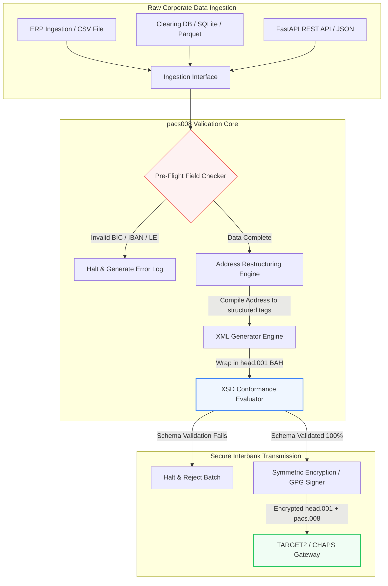

---

# Front Matter (YAML)

author: "contact@sebastienrousseau.com (Sebastien Rousseau)"
banner_alt: "办公人员使用语音助手与笔记本电脑——象征 pacs.008 自动化让结构化、可机器读取的银行间支付报文得以编程化"
banner_height: "1597"
banner_width: "2584"
banner: "https://cloudcdn.pro/stocks/images/tyler-prahm-lmV3gJSAgbo.webp"
cdn: "https://cloudcdn.pro"
charset: "UTF-8"
cname: "sebastienrousseau.com"
copyright: "© Copyright 2025 - 2026 - Sebastien Rousseau. All rights reserved."
date: "June 15, 2026"
description: "pacs008 是一套开源 Python 库，用于自动生成并校验 ISO 20022 pacs.008 FI-to-FI 客户信用转账报文——结构化地址、BAH head.001 封装、BIC/LEI/IBAN 校验、基于 OpenTelemetry 的 UETR 追踪——为 2026 年 11 月 SWIFT 切换日打造。"
format-detection: "telephone=no"
hreflang: "zh-hans"
icon: "https://cloudcdn.pro/clients/sebastienrousseau/v1/logos/sebastienrousseau.svg"
id: "https://sebastienrousseau.com/2026-06-15-pacs008-automation-iso-20022-interbank-payments-2026"
image_alt: "Black and White Portrait of Sebastien Rousseau"
image_height: "162"
image_width: "162"
image: "https://cloudcdn.pro/stocks/images/sebastien-rousseau.png"
keywords: "pacs008, ISO 20022 pacs.008, FI-to-FI 客户信用转账, 结构化地址, SWIFT CBPR+, BAH head.001, TARGET2, CHAPS, Fedwire, DORA, BCBS 239, Basel III, UETR, LEI 校验, SEPA VoP"
language: "zh-Hans"
last_reviewed: "2026-06-15"
layout: "report"
locale: "zh_CN"
logo_alt: "Logo for Sebastien Rousseau"
logo_height: "44"
logo_width: "44"
logo: "https://cloudcdn.pro/clients/sebastienrousseau/v1/logos/sebastienrousseau.svg"
menu: ""
measurementID: "G-169G4ET5HQ"
name: "Sebastien Rousseau"
permalink: "https://sebastienrousseau.com/2026-06-15-pacs008-automation-iso-20022-interbank-payments-2026"
rating: "general"
referrer: "no-referrer"
robots: "index, follow"
schema: "FAQPage, Article"
seo_title: "面向 ISO 20022 时代的 pacs.008 自动化"
short_name: "sebastienrousseau"
subtitle: "pacs.008 报文是银行间支付数据、结构化地址、合规、路由与结算运营的交汇点。"
tags: "pacs008, ISO 20022, 银行间支付, 大额支付, Python"
theme-color: "0, 83, 191"
title: "2026 年构建面向 ISO 20022 银行间时代的 pacs.008 自动化"
url: "https://sebastienrousseau.com/2026-06-15-pacs008-automation-iso-20022-interbank-payments-2026"
viewport: "width=device-width, initial-scale=1, shrink-to-fit=no"

# RSS - The RSS feed front matter (YAML).
atom_link: "https://sebastienrousseau.com/2026-06-15-pacs008-automation-iso-20022-interbank-payments-2026/rss.xml"
category: "Finance"
docs: https://validator.w3.org/feed/docs/rss2.html
generator: "Static Site Generator (SSG) (version 0.0.26)"
item_description: "pacs008 提供开源 Python 基础库，在 ISO 20022 银行间支付时代自动化 FI-to-FI 客户信用转账报文。"
item_guid: "https://sebastienrousseau.com/2026-06-15-pacs008-automation-iso-20022-interbank-payments-2026/rss.xml"
item_link: "https://sebastienrousseau.com/2026-06-15-pacs008-automation-iso-20022-interbank-payments-2026/rss.xml"
item_pub_date: "Mon, 15 Jun 2026 06:06:06 +0000"
item_title: "2026 年构建面向 ISO 20022 银行间时代的 pacs.008 自动化"
last_build_date: "Mon, 15 Jun 2026 06:06:06 +0000"
managing_editor: "contact@sebastienrousseau.com (Sebastien Rousseau)"
pub_date: "Mon, 15 Jun 2026 06:06:06 +0000"
ttl: "60"
type: "article"
webmaster: "contact@sebastienrousseau.com"

# Apple - The Apple front matter (YAML).
apple_mobile_web_app_orientations: "portrait"
apple_touch_icon_sizes: "192x192"
apple-mobile-web-app-capable: "yes"
apple-mobile-web-app-status-bar-inset: "black"
apple-mobile-web-app-status-bar-style: "black-translucent"
apple-mobile-web-app-title: "面向 ISO 20022 时代的 pacs.008 自动化"
apple-touch-fullscreen: "yes"

# MS Application - The MS Application front matter (YAML).

msapplication-navbutton-color: "0, 83, 191"

# Twitter Card - The Twitter Card front matter (YAML).

twitter_card: "summary_large_image"
twitter_creator: "@wwdseb"
twitter_description: "pacs008 提供开源 Python 基础库，在 ISO 20022 银行间支付时代自动化 FI-to-FI 客户信用转账报文。"
twitter_image: "https://cloudcdn.pro/clients/sebastienrousseau/v1/logos/sebastienrousseau.svg"
twitter_image_alt: "Logo of Sebastien Rousseau"
twitter_site: "@wwdseb"
twitter_title: "面向 ISO 20022 时代的 pacs.008 自动化"
twitter_url: "https://sebastienrousseau.com/2026-06-15-pacs008-automation-iso-20022-interbank-payments-2026"

excerpt: "pacs008 是一套开源 Python 工具包，让 ISO 20022 FI-to-FI 客户信用转账报文可编程——结构化地址、校验、路由、合规挂钩，以及 SWIFT 2026 年 11 月截止日期均作为默认内置。"

# Humans.txt - The Humans.txt front matter (YAML).
author_website: "https://sebastienrousseau.com"
author_twitter: "@wwdseb"
author_location: "London, UK"
thanks: "感谢阅读！"
site_last_updated: "2026-06-15"
site_standards: "HTML5, CSS3, RSS, Atom, JSON, XML, YAML, Markdown, TOML"
site_components: "Kaishi, Kaishi Builder, Kaishi CLI, Kaishi Templates, Kaishi Themes"
site_software: "Static Site Generator, Rust"

---

# 2026 年用开源 Python 自动化 ISO 20022 pacs.008 银行间支付

<!-- lead-start -->
<aside class="post-lead" aria-label="文章摘要">

<strong>要点速览。</strong>按照 SWIFT CBPR+ 指引，2026 年 11 月 14 日的结构化地址临界点将在 TARGET2、CHAPS、Fedwire、Lynx 与 SEPA 全面下线非结构化邮政地址。pacs008 是一套开源 Python 库，自动化生成并校验 ISO 20022 FI-to-FI 客户信用转账（pacs.008）报文，将支付封装在业务应用报头（BAH head.001）之中，并在报文进入清算网络之前，把结构化地址合规嵌入数据路径。

<strong>核心要点</strong>

<ul class="post-lead-takeaways">
  <li><strong>结构化地址截止日期是硬约束。</strong>2026 年 11 月 14 日之后，非结构化地址块将被退役。pacs008 在数据编译阶段强制结构化邮政地址元素（<code>&lt;TwnNm&gt;</code>、<code>&lt;Ctry&gt;</code>、<code>&lt;PstCd&gt;</code>），避免边界拒收。</li>
  <li><strong>统一的报文编排。</strong>将核心 pacs.008 支付负载封装在合规的业务应用报头（head.001）信封之中，提供标准的往返处理模型。</li>
  <li><strong>算法层面的完整性。</strong>内置 BIC 与法人识别码（LEI）校验器，采用 ISO 7064 Modulo 97-10 校验位运算。</li>
  <li><strong>DORA 级可追溯性。</strong>完整的 OpenTelemetry 仪表化以唯一端到端交易参考号（UETR）为主键，提供实时审计日志与加密审计签名。</li>
  <li><strong>董事会级别的受托责任守护。</strong>把银行间报文准确性与 DORA 第 5 条、BCBS 239 报告及 Basel III 操作风险资本节省对齐。</li>
</ul>

<strong>延伸阅读：</strong><a href="https://sebastienrousseau.com/2026-05-19-global-wholesale-payments-economics-2026">2026 全球大额支付：ISO 20022、RTGS 更新与互联互通经济学</a>、<a href="https://sebastienrousseau.com/2026-05-27-ai-operating-system-payments-fraud-routing-resilience-compliance-2026">2026 年 AI 作为支付操作系统：欺诈、路由、韧性与合规</a>、<a href="https://sebastienrousseau.com/2026-05-12-iso-20022-pacs008-structured-address-deadline">2026 年 11 月 pacs.008 结构化地址截止日期：六个月前的判断</a>。

</aside>
<!-- lead-end -->

通过一条可审计、模式校验的 Python 流水线，弥合遗留金融数据与结构化银行间报文之间的鸿沟。

本文的开源参考实现是 [pacs008 ⧉](https://github.com/sebastienrousseau/pacs008 "pacs008 — 开源 Python 库")。该仓库的定位是：用于自动化 ISO 20022 pacs.008 FI-to-FI 客户信用转账 XML 报文的 Python 库。

## 为什么这个开源项目在 2026 年具有意义

全球银行间支付清算基础设施正在经历近半个世纪以来最深刻的现代化。

2026 年 6 月，金融服务业正快速逼近 **2026 年 11 月 14 日 SWIFT 结构化地址临界点**。从这一天起，SWIFT CBPR+ 指引连同 TARGET2、CHAPS、Fedwire 与加拿大 Lynx 将正式下线非结构化邮政地址行（即在 `<PstlAdr>` 块内只使用 `<AdrLine>` 的写法）。所有参与的金融机构必须以混合格式（结构化的 `<TwnNm>` 与 `<Ctry>`，其余细节最多保留两个 `<AdrLine>` 元素）或完全结构化格式（街道名、楼宇号、邮编各占独立元素）传输地址。任何不满足这一标准的报文，都会在网络边界被拒收。

对金融机构而言，这一切换造成了重大运营约束：

1. **边界拒收惩罚。**未达到结构化地址标准的支付将被网络当场拒收，触发交易延迟、流动性占用与运营积压。
2. **SEPA 收款人核验（VoP）。**要求 SEPA 区内所有支付服务提供商（PSP）在执行信用转账之前核验受益人姓名与 IBAN 的匹配，又在报文起点增加一道校验闸门。

[pacs008](https://github.com/sebastienrousseau/pacs008) 解决的正是这个问题。它是一套开源、轻量的 Python 库，自动将原始金融数据转换为完全经过校验、符合模式的 ISO 20022 pacs.008 银行间客户信用转账报文。通过弥合遗留数据与结构化数据之间的鸿沟，pacs008 提供高韧性回报（RoR），保住运营资金，确保跨全球清算轨道的实时执行。

## 2026 年 pacs008 架构视角

pacs008 库被设计为一套隔离的校验与生成引擎，确保原始输入被系统化地解析、补全，并封装于标准信封：

| 层级 | 设计决策 | 重要性 | 处理不当的风险 |
|---|---|---|---|
| **输入层** | 摄取 CSV、JSON、SQLite 与 Parquet | 在银行集成团队数据已有的位置与之对接，避免平台迁移。 | 原始、未经校验或损坏的数据负载被摄取。 |
| **校验层** | 依据官方 XSD 模式与自定义业务规则做预飞校验 | 在支付文件传输到清算网络之前中止执行并标记错误。 | 无效 XML 文件触发即时网络拒收与清算延迟。 |
| **BAH 信封层** | 自动业务应用报头（head.001）封装 | 基于 `<MsgDefIdr>` 标签标准化报文分发与路由。 | 未带必需外层信封的原始 pacs.008 负载传输，导致系统拒收。 |
| **序列化层** | 支持标准 XML 与符合 ISO 的 JSON（TS 23029） | 在 XML 与 JSON 负载之间直接互译，支撑现代 REST API 与 Kafka 流。 | 碎片化的数据表示违反官方 ISO 指引。 |
| **可观测层** | 以 UETR 为主键的 OpenTelemetry 追踪 | 捕获详尽的执行路径与日志，提供实时可审计性。 | 追踪缺口阻碍运营可视性与审计。 |

## 银行间关键信号与监管里程碑

为证明交易级运营韧性，资深技术与风险管理者必须跟踪具体可量化的合规指标：

| 信号 | 指标 / 运营基准 | G20 / SWIFT / DORA 参考 | 技术平台实现 |
|---|---|---|---|
| **结构化地址合规率** | 使用完全结构化 `<PstlAdr>` 字段并具备指定 `<TwnNm>` 与 `<Ctry>` 的 pacs.008 报文占比。 | SWIFT SR 2026 截止日期 | pacs008 内置预飞模式校验，拒收非结构化地址行。 |
| **SEPA 收款人核验** | 报文执行前对受益人姓名与 IBAN 进行匹配校验。 | SEPA VoP 监管 | 内建 VoP 辅助类，对 IBAN/BIC 执行预校验查询。 |
| **BAH head.001 集成** | 成功封装于业务应用报头中的出站支付负载占比。 | TARGET2 / CBPR+ 指引 | BAH 封装子系统自动编译外层 XML 信封。 |
| **LEI 模数校验位** | 对债务人与受益人 `<LEI>` 块的 ISO 7064 Modulo 97-10 校验位校验。 | 英格兰银行强制要求 | 算法校验器核验 20 位标识符的完整性。 |
| **UETR 追踪准确性** | 100% 生成支付均注入有效的唯一端到端交易参考号。 | SWIFT UETR 规范 | 自动生成并追踪 36 位 UUIDv4 参考代码。 |

## 为什么 Python 是银行间自动化的理想入口

2026 年，现代支付中枢与司库运营团队大量依赖 Python 进行数据转换、金融建模与 ERP 数据库集成。

借助一个开源 Python 库，机构可获得显著优势：

1. **认知负担低、互操作性高。**Python 充当贯通的桥梁。它让开发者用简单脚本从遗留数据库拉取原始支付指令，依据复杂的国际银行规则进行校验，并在单一统一的工作流中输出合规 XML。
2. **消除“黑盒”不透明转换器。**专有银行门户往往对自定义支付文件转换器收取高额许可费。这些转换器是不透明的专有黑盒，安全团队无法审计数据如何处理、密钥存放何处。像 pacs008 这样的开源、可审视库则确保代码完全透明。
3. **CI/CD 无缝集成。**pacs008 可直接集成进持续集成与持续部署流水线，让开发者把支付文件测试纳入标准的软件交付生命周期自动化。

## 设计有边界的银行间流水线

银行间清算的一大隐患是“无控批量生成”——在缺乏清晰、有边界的校验回路时大量生成文件。pacs008 被设计为严格受控、多阶段交易流水线中的核心校验引擎。

下面的运营流程展示了原始交易数据如何穿过 pacs008 流水线，生成经过加密保护、符合模式、并封装于 BAH 信封的 pacs.008 文件：

## 董事会行动手册与受托责任

银行间支付自动化是一项董事会级风险管理与公司治理议题。资深管理者必须从受托责任与运营风险削减的视角审视交易数据质量：

- **DORA 第 5 条（董事会问责）。**对董事会成员就机构 ICT 运营的韧性与安全施加直接、个人化的责任。由于银行间清算属于关键企业职能，董事会必须证明其已实施稳健、经过校验且自动化的交易控制，以防止运营中断或支付延迟。
- **BCBS 239（风险数据汇总与报告）。**要求金融交易报告在源头实时生成、准确完整。pacs008 通过在源头确保支付数据结构化与校验，帮助机构达成 BCBS 239 合规，消除困扰遗留电子表格的数据缺口与人工对账错误。
- **缓释操作风险资本扣减（Basel III）。**在 Basel III 之下，高支付错误率与人工干预开销会推高银行的操作风险资本要求，将本可用于放贷或投资的资金占用其中。把支付流水线自动化能直接降低这些资本溢价，守住资产负债表价值。

## 对不同类型银行的含义

### 全球系统重要性银行（G-SIBs）

G-SIBs 处理大量跨境企业交易。其首要挑战是在数据进入清算网络之前对非结构化遗留数据的整治。通过将 pacs008 集成进其企业银行网关，G-SIBs 能向企业客户提供自动校验工具，降低人工支付修复的开销，确保在 SWIFT 网络上的实时执行。

### 交易银行与企业银行

对交易银行而言，支付数据质量是竞争差异化的关键。通过向企业司库客户提供 pacs008 这样可审视的开源校验工具，这些银行能加速客户上手、减少支付文件被拒，并凭借更高的直通处理率赢得客户信任。

### 区域性与中小银行

区域性银行必须在不具备 G-SIBs 那种庞大技术预算的情况下，保持对国际支付标准的合规。pacs008 提供轻量、低成本且完全合规的 Python 解决方案，让中小机构在不购买昂贵专有中间件许可证的前提下，也能提供现代化、结构化的支付发起能力。

## 结论：银行间清算路线图

即将到来的 SWIFT 2026 年 11 月结构化地址截止日期，是企业司库运营的硬边界。继续依赖遗留电子表格、人工录入与非结构化支付文件，本身就是一种业务风险。

为保住交易连续性、降低运营开销，资深技术与财务管理者应在今天就执行清晰的清算路线图：

1. **在源头强制校验。**要求所有支付指令在离开企业 ERP 边界之前，依据官方 ISO 20022 XSD 模式完成校验与格式化。
2. **审视数据流水线。**摆脱人工电子表格处理，使用 pacs008 实施自动化、可审视的基于 Python 的工作流。
3. **落实混合安全。**确保生成的支付文件在传输前完成加密签名与加密，满足零信任网络预期。
4. **与受托优先级对齐。**正式向董事会汇报支付自动化与数据质量指标，将该投资定位为 DORA 框架下的关键运营风险缓释项目。

## 常见问题

**pacs008 是否兼容即将生效的 SWIFT SR 2026 地址规则？**

是。pacs008 的设计目标即是支撑 SWIFT 2026 年 11 月结构化地址里程碑，强制将邮政地址元素（城市、国家、邮编）拆分到指定的 ISO 20022 XML 字段。

**pacs008 能否将支付负载封装在业务应用报头中？**

可以。由于 pacs008 原生支持业务应用报头（BAH head.001）封装，它会自动编译 TARGET2、CHAPS 与 CBPR+ 网络所要求的外层信封。

**为什么开源库优于专有文件转换器？**

专有转换器是不透明黑盒，难以做安全审计。像 pacs008 这样的开源、经过同行评审的库提供完整的代码透明度，让安全团队能够核验在处理过程中没有敏感支付数据被泄露。

**pacs008 校验哪些标识符？**

pacs008 自带 BIC（银行标识码）与 LEI（法人识别码）的内置校验器，采用 ISO 7064 Modulo 97-10 校验位算法，并配备 IBAN 校验位校验与 UETR 唯一性检查。

## 参考资料

- SWIFT, (2024). *ISO 20022 November 2026 Structured Address Milestone*. La Hulpe: SWIFT. 可访问：[SWIFT ISO 20022 里程碑 ⧉](https://www.swift.com/standards/iso-20022/iso-20022-bytes/call-action-november-2026 "SWIFT ISO 20022 里程碑")。
- Basel Committee on Banking Supervision (BCBS), (2013). *Principles for effective risk data aggregation and risk reporting (BCBS 239)*. Basel: Bank for International Settlements. 可访问：[BCBS 239 原则 ⧉](https://www.bis.org/publ/bcbs239.htm "BCBS 239 原则")。
- European Parliament and Council of the European Union, (2022). *Regulation (EU) 2022/2554 on digital operational resilience for the financial sector (DORA)*. Brussels: Official Journal of the European Union. 可访问：[DORA 法规 ⧉](https://eur-lex.europa.eu/legal-content/EN/TXT/?uri=CELEX%3A32022R2554 "DORA 法规")。
- GitHub, (2026). *pacs008 开源仓库*. 可访问：[pacs008 仓库 ⧉](https://github.com/sebastienrousseau/pacs008 "pacs008 仓库")。

<!-- enrich-start -->
<aside class="author-card" aria-label="作者简介"><strong class="author-card-name"><a href="/about/index.html">Sebastien Rousseau</a></strong>资深银行技术专家，撰写关于应用型人工智能、ISO 20022 迁移、面向金融服务的后量子密码学，以及大额支付结构性变革的文章。在 HSBC 商业与投资银行、PayPal、Barclays、Shazam、AKQA、Virgin 集团积累二十余年经验。<a href="/about/index.html">完整简介</a> &middot; <a href="https://www.linkedin.com/in/sebastienrousseau/" rel="external noopener">LinkedIn</a> &middot; <a href="https://github.com/sebastienrousseau" rel="external noopener">GitHub</a></aside>

最近审阅 <time datetime="2026-06-15">2026-06-15</time>。

<aside class="related-posts" aria-labelledby="related-heading">
<h2 id="related-heading" class="related-heading">延伸阅读</h2>

<article class="related-card"><footer class="related-body"><h3><a href="https://sebastienrousseau.com/2026-05-19-global-wholesale-payments-economics-2026">2026 全球大额支付：ISO 20022、RTGS 更新与互联互通经济学</a></h3>
<time datetime="2026-05-19">2026-05-19</time>
</footer></article>
<article class="related-card"><footer class="related-body"><h3><a href="https://sebastienrousseau.com/2026-05-27-ai-operating-system-payments-fraud-routing-resilience-compliance-2026">2026 年 AI 作为支付操作系统：欺诈、路由、韧性与合规</a></h3>
<time datetime="2026-05-27">2026-05-27</time>
</footer></article>
<article class="related-card"><footer class="related-body"><h3><a href="https://sebastienrousseau.com/2026-05-12-iso-20022-pacs008-structured-address-deadline">2026 年 11 月 pacs.008 结构化地址截止日期：六个月前的判断</a></h3>
<time datetime="2026-05-12">2026-05-12</time>
</footer></article>

</aside>
<!-- enrich-end -->
