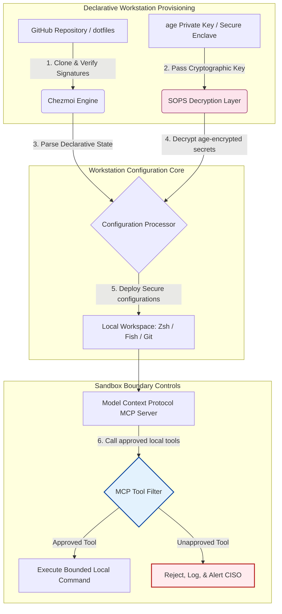

---

# Front Matter (YAML)

author: "contact@sebastienrousseau.com (Sebastien Rousseau)"
banner_alt: "低光环境下的开发者工作站——象征面向 MCP 服务器、SLSA 签名、age/SOPS 密钥与多 shell 一致性的 AI 感知、可复现、安全 dotfiles"
banner_height: "1597"
banner_width: "2584"
banner: "https://cloudcdn.pro/stocks/images/almas-salakhov-Vq2ap8aFFEs.webp"
cdn: "https://cloudcdn.pro"
charset: "UTF-8"
cname: "sebastienrousseau.com"
copyright: "© Copyright 2025 - 2026 - Sebastien Rousseau. All rights reserved."
date: "June 16, 2026"
description: "AI 感知 dotfiles 是 MCP 时代下安全、可复现的工作站范式——以 Chezmoi 实现声明式配置、以 SOPS/age 管理密钥、采用 SLSA Level 3 来源证明、保持多 shell 一致性，并为本地 AI 智能体设定受限沙箱边界。"
format-detection: "telephone=no"
hreflang: "zh-hans"
icon: "https://cloudcdn.pro/clients/sebastienrousseau/v1/logos/sebastienrousseau.svg"
id: "https://sebastienrousseau.com/2026-06-16-ai-aware-dotfiles-secure-reproducible-workstation-2026"
image_alt: "Sebastien Rousseau 黑白肖像"
image_height: "162"
image_width: "162"
image: "https://cloudcdn.pro/stocks/images/sebastien-rousseau.png"
keywords: "dotfiles, Chezmoi, MCP, Model Context Protocol, SLSA, SOPS, age 加密, 声明式配置, 开发者工作站, DORA 第 5 条, NIST CSF 2.0, 供应链安全, 智能体 AI, 多 shell 一致性, Zsh, Fish, Nushell"
language: "zh-Hans"
last_reviewed: "2026-06-16"
layout: "report"
locale: "zh_CN"
logo_alt: "Sebastien Rousseau 标志"
logo_height: "44"
logo_width: "44"
logo: "https://cloudcdn.pro/clients/sebastienrousseau/v1/logos/sebastienrousseau.svg"
menu: ""
measurementID: "G-169G4ET5HQ"
name: "Sebastien Rousseau"
permalink: "https://sebastienrousseau.com/2026-06-16-ai-aware-dotfiles-secure-reproducible-workstation-2026"
rating: "general"
referrer: "no-referrer"
robots: "index, follow"
schema: "FAQPage, Article"
seo_title: "AI 感知 dotfiles：安全的开发者工作站"
short_name: "sebastienrousseau"
subtitle: "开发者工作站已是 AI 供应链的一环；dotfiles 必须落实安全、可复现性、密钥卫生与 MCP 感知的工作流。"
tags: "dotfiles, 开发者工具, MCP, SLSA, 安全工作站, chezmoi, macOS, Linux, WSL"
theme-color: "0, 83, 191"
title: "2026 年 AI 感知 dotfiles：面向 MCP、SLSA 与多 shell 一致性的安全可复现开发者工作站"
url: "https://sebastienrousseau.com/2026-06-16-ai-aware-dotfiles-secure-reproducible-workstation-2026"
viewport: "width=device-width, initial-scale=1, shrink-to-fit=no"

# RSS - The RSS feed front matter (YAML).
atom_link: "https://sebastienrousseau.com/2026-06-16-ai-aware-dotfiles-secure-reproducible-workstation-2026/rss.xml"
category: "Technology"
docs: https://validator.w3.org/feed/docs/rss2.html
generator: "Static Site Generator (SSG) (version 0.0.26)"
item_description: "审视面向 macOS、Linux 与 WSL 的声明式 dotfiles，构建安全、可复现的开发者工作站，覆盖 MCP 感知、SLSA、age、SOPS 与多 shell 一致性。"
item_guid: "https://sebastienrousseau.com/2026-06-16-ai-aware-dotfiles-secure-reproducible-workstation-2026/rss.xml"
item_link: "https://sebastienrousseau.com/2026-06-16-ai-aware-dotfiles-secure-reproducible-workstation-2026/rss.xml"
item_pub_date: "Tue, 16 Jun 2026 06:06:06 +0000"
item_title: "2026 年 AI 感知 dotfiles：面向 MCP、SLSA 与多 shell 一致性的安全可复现开发者工作站"
last_build_date: "Tue, 16 Jun 2026 06:06:06 +0000"
managing_editor: "contact@sebastienrousseau.com (Sebastien Rousseau)"
pub_date: "Tue, 16 Jun 2026 06:06:06 +0000"
ttl: "60"
type: "article"
webmaster: "contact@sebastienrousseau.com"

# Apple - The Apple front matter (YAML).
apple_mobile_web_app_orientations: "portrait"
apple_touch_icon_sizes: "192x192"
apple-mobile-web-app-capable: "yes"
apple-mobile-web-app-status-bar-inset: "black"
apple-mobile-web-app-status-bar-style: "black-translucent"
apple-mobile-web-app-title: "AI 感知 dotfiles：安全的开发者工作站"
apple-touch-fullscreen: "yes"

# MS Application - The MS Application front matter (YAML).

msapplication-navbutton-color: "0, 83, 191"

# Twitter Card - The Twitter Card front matter (YAML).

twitter_card: "summary_large_image"
twitter_creator: "@wwdseb"
twitter_description: "审视面向 macOS、Linux 与 WSL 的声明式 dotfiles，构建安全、可复现的开发者工作站，覆盖 MCP 感知、SLSA、age、SOPS 与多 shell 一致性。"
twitter_image: "https://cloudcdn.pro/clients/sebastienrousseau/v1/logos/sebastienrousseau.svg"
twitter_image_alt: "Sebastien Rousseau 标志"
twitter_site: "@wwdseb"
twitter_title: "AI 感知 dotfiles：安全的开发者工作站"
twitter_url: "https://sebastienrousseau.com/2026-06-16-ai-aware-dotfiles-secure-reproducible-workstation-2026"

excerpt: "2026 年的 AI 感知 dotfiles 把开发者工作站视为供应链基础设施——以 chezmoi 管理的声明式配置，搭配 MCP 感知、SLSA 签名发布、age/SOPS 密钥管理、亚秒启动以及 macOS/Linux/WSL 一致性。"

# Humans.txt - The Humans.txt front matter (YAML).
author_website: "https://sebastienrousseau.com"
author_twitter: "@wwdseb"
author_location: "London, UK"
thanks: "感谢阅读！"
site_last_updated: "2026-06-16"
site_standards: "HTML5, CSS3, RSS, Atom, JSON, XML, YAML, Markdown, TOML"
site_components: "Kaishi, Kaishi Builder, Kaishi CLI, Kaishi Templates, Kaishi Themes"
site_software: "Static Site Generator, Rust"

---

# 2026 年 AI 感知 dotfiles：面向 MCP、SLSA 与多 shell 一致性的安全可复现开发者工作站

<!-- lead-start -->
<aside class="post-lead" aria-label="文章摘要">

<strong>要点速览。</strong>开发者工作站不再只是一个端点；它已成为软件供应链中的主动参与者，也是本地 AI 控制平面的直接接口。基于终端的 AI 助手与 <a href="https://modelcontextprotocol.io">Model Context Protocol（MCP）</a>服务器会执行本地 shell 命令、审视代码仓库并直接读取敏感配置文件。<a href="https://github.com/sebastienrousseau/dotfiles">Sebastien Rousseau 的 Dotfiles</a> 是一套声明式的开源框架，可在 macOS、Linux 与 Windows Subsystem for Linux（WSL）上构建安全、可复现的工作站——整合 <a href="https://www.chezmoi.io/">Chezmoi</a>、<a href="https://github.com/getsops/sops">SOPS、age</a> 以及 SLSA Level 3 构建来源证明，实现内存安全的密钥隔离，并为调用 MCP 工具的本地 AI 模型提供受限的执行路径。

<strong>核心要点</strong>

<ul class="post-lead-takeaways">
  <li><strong>工作站即供应链基础设施。</strong>开发环境配置必须以等同于生产服务器部署的声明式严谨性来对待，杜绝手工配置漂移。</li>
  <li><strong>AI 控制平面的挑战。</strong>基于终端的 AI 模型与 MCP 工具可访问本地目录。dotfiles 必须落实受限的沙箱边界、严格的工具权限清单与不可篡改的本地日志，以防止数据外泄。</li>
  <li><strong>跨平台绝对一致。</strong>在 macOS、Linux（Zsh、Fish、Nushell）与 WSL 上保持同一的亚秒级 shell 性能与安全画像，将开发者入职时间从数周压缩到数分钟。</li>
  <li><strong>具有密码学保证的密钥隔离。</strong>SOPS 与 age 文件加密阻止硬编码凭据（GitHub 令牌、云访问密钥）被提交到 Git 或被本地 LLM 读取。</li>
  <li><strong>董事会层面的受托价值。</strong>把工作站配置合规度转化为清晰的董事会优先事项，支撑 DORA 第 5 条、NIST CSF 2.0 端点标准与 Basel III 操作风险削减。</li>
</ul>

<strong>延伸阅读：</strong> <a href="https://sebastienrousseau.com/2026-05-23-agentic-payments-banking-consent-liability-new-payment-ux-2026">银行业的智能体支付：2026 年的同意机制、责任划分与全新支付体验</a>、<a href="https://sebastienrousseau.com/2024-03-12-revolutionising-real-time-speech-recognition-on-macos-with-openai-whisper/index.html">macOS 上的快速实时语音识别：OpenAI Whisper</a>、<a href="https://sebastienrousseau.com/2024-02-26-google-gemma-ai-transforming-open-source-ai-development/index.html">Google Gemma AI：重塑开源 AI 开发</a>。

</aside>
<!-- lead-end -->

在本地 AI 模型与智能体型开发者工具的时代，把声明式工作站配置与安全的软件供应链对齐。

本文的开源参照是 [dotfiles ⧉](https://github.com/sebastienrousseau/dotfiles "dotfiles —— 声明式工作站配置")。该仓库的定位是：面向 macOS、Linux 与 WSL 的声明式 dotfiles，提供多 shell 一致性、亚秒启动、SLSA 签名发布以及 AI/MCP 感知配置。

## 为什么这一开源项目在 2026 年值得关注

2026 年 6 月，开发者工作站是软件供应链中最薄弱的环节，也是有组织的国家级与犯罪型网络团伙的高价值目标。

随着基于终端的 AI 编码助手（如 Claude Code）以及 Model Context Protocol（MCP）的普及，开发环境的安全态势已发生根本变化。本地开发者终端如今承载着主动、自治的 AI 智能体，它们具备以下能力：

- 读取并编辑本地源文件。
- 调用本地 CLI 工具（`git`、`npm`、`aws`、`kubectl`）。
- 审视 shell 环境变量、本地数据库与配置项。

如果开发者的本地环境缺乏严格边界，这些自治的 AI 工具就可能无意中读取敏感个人数据、把云凭据泄露给公共 LLM API，或在自动化构建期间执行恶意软件包。

在《数字运营韧性法案》（DORA）与 NIST 网络安全框架（CSF）2.0 之下，金融机构在法律上必须核验每一台接入软件供应链的设备的来源与安全完整性。"雪花式笔记本"——手工配置、未经审计、配置不断漂移——已不再符合全球银行业标准。

[Sebastien Rousseau 的 Dotfiles](https://github.com/sebastienrousseau/dotfiles) 正是为此而生。它是一套开源、声明式的工作站管理框架，用于建立安全、可复现的开发者工作站。通过强制执行标准化、可审计的配置基线，该项目带来高韧性回报（Return on Resilience, RoR），将开发者入职时间从数周缩短到数小时，并保护敏感的金融供应链免受端点漏洞侵害。

## 2026 年 AI 感知工作站的架构视角

dotfiles 框架运作为一个安全、声明式的环境管理器——所有本地 shell、工具与密钥都被系统化地管理、审计与隔离：

| 层次 | 设计选择 | 重要性 | 处置失当的风险 |
|---|---|---|---|
| **置备层** | 通过 Chezmoi 进行声明式配置管理 | 在 macOS、Linux 与 WSL 上构建完全可复现的工作站，消除漂移。 | 各异其趣的"雪花"配置，本地状态未经审计且存在漏洞。 |
| **Shell 层** | 多 shell 一致性（Zsh、Fish、Nushell） | 在不同环境下保持一致的亚秒启动与别名行为。 | shell 命令不一致，导致脚本结果不可预期。 |
| **密钥层** | 采用 SOPS 与 age 的文件加密 | 防止硬编码凭据与原始密钥被提交到 Git 或暴露给本地 LLM。 | 凭据被提交进入公共仓库历史，或被本地智能体窃取。 |
| **AI/MCP 层** | Model Context Protocol 边界控制 | 将本地 AI 智能体限定在一份特定的已批准工具清单内，并记录所有本地执行。 | 不受边界约束的 AI 智能体在本地执行失控或破坏性命令。 |
| **供应链层** | SLSA 签名发布与 Sigstore 校验 | 以密码学手段证明引导脚本与配置文件的真实性。 | 被篡改的安装脚本向开发者环境植入恶意后门。 |

## 工作站安全与自动化的关键信号

要在整片开发环境中保持绝对的安全水位，首席信息安全官（CISO）与技术负责人必须跟踪具体、可量化的运营指标：

| 信号 | 度量 / 运营基准 | NIST CSF / DORA 引用 | 技术平台落地方式 |
|---|---|---|---|
| **工作站可复现性** | 通过声明式 dotfile 仓库完全管理、无配置漂移的开发者笔记本占比。 | NIST CSF 2.0（PR.DS-01） | Chezmoi 漂移检测审计在终端启动时自动执行。 |
| **凭据卫生** | 本地配置文件中以明文存放的密钥或密钥材料数量为零。 | DORA 第 6 条（ICT 安全） | Git 预提交钩子与本地扫描拒绝未加密文件。 |
| **构建来源证明** | 100% 的工作站引导工具均通过密码学签名清单核验。 | DORA 第 30 条（供应链） | Sigstore 与 SLSA Level 3 校验嵌入安装流水线。 |
| **开发者入职时间** | 从拿到裸机到形成完全配置、合规开发工作区的耗时。 | 韧性回报（RoR） | 自动化、声明式的安装脚本在 15 分钟内编排好环境。 |
| **AI 智能体受限访问** | 验证本地 AI 工具在定义好的目录范围内运行，默认只读。 | 模型风险管理 | MCP 配置文件将智能体的工具目录限定为已批准操作。 |

## 为什么声明式配置是工作站安全的核心

传统的开发者工作站搭建方式高度依赖手工，最终形成"雪花式笔记本"——开发者安装定制工具、调整变量、修改本地脚本，配置随时间不断漂移。这种漂移会带来若干关键风险：

1. **未受跟踪的影子配置。**漂移的笔记本经常运行过时、含漏洞的软件包或可绕过企业安全工具的本地脚本。
2. **密钥外泄。**开发者经常把 API 密钥、GitHub 令牌或 AWS 凭据直接硬编码进明文脚本或 shell 配置，极易被窃。
3. **入职效率低下。**手工搭建一台新的开发者工作站可能耗费多达两周的工程时间，拖累团队产出。

转向以 Chezmoi 为基础的声明式、模型驱动配置后，整个开发者工作区就变成了一套受版本控制、可复现的记录系统。每一次更改、每一个别名、每一项软件包依赖与安全默认值都在 Git 中留痕，并在应用到物理笔记本之前完成对组织合规策略的校验与密码学核验。

## 设计受限的 AI 开发者环境

为防止本地 AI 智能体与 MCP 工具对本地资产形成无边界访问，工作站必须作为受限的执行平面运作。

下方流程展示了 dotfiles 框架如何协调 Chezmoi、SOPS 与 age，在为本地 AI 智能体调用 MCP 工具维持隔离、沙箱化执行边界的同时，完成安全 dotfiles 的解密与部署：

## 董事会指南与受托责任

开发者工作站安全与供应链完整性是关键的董事会议题。高管必须从受托责任、监管合规与商业价值维护三个维度审视开发者环境风险：

- **DORA 第 5 条（董事会问责）。**该条规定，管理机构（即董事会）对机构 ICT 风险管理负有最终责任。由于开发者工作站是通往软件供应链的入口，董事必须核实端点处于安全、完全可审计的状态，并由严格、可复现的配置框架管理，方能满足监管审计要求。
- **NIST CSF 2.0 合规（端点安全）。**该框架要求只有经授权、经核验、运行标准化安全配置的设备才能访问企业网络与代码仓库。声明式 dotfiles 使安全团队能够以数学方式证明所有开发者环境均符合组织安全基线，杜绝未经审计的"雪花式"配置风险。
- **资产负债表价值的守护。**单一被攻陷的开发者凭据或一次供应链失陷，就可能令机构承担数百万美元的补救、监管罚款与声誉损失。转向安全、声明式的开发者环境可直接压降这一风险，守护资产负债表价值并保护客户信任。

## 对不同类型银行的含义

### 全球系统重要性银行（G-SIBs）

G-SIBs 在多个大陆与监管辖区管理着数以千计的开发者工作站。其首要挑战是在庞大的工程团队中维持配置一致性、防止凭据外泄。通过采用基于 Chezmoi 的声明式开源 dotfiles 模型，G-SIBs 能够将端点安全标准化、把合规审计自动化，并在整个全球组织内把开发者入职时间从数周压缩到数分钟。

### 交易银行与公司银行

交易银行运营着敏感的支付网关与批发清算基础设施。证明部署到这些生产环境的代码具有绝对完整性，是不可妥协的监管要求。在安全的、符合 SLSA 的 dotfiles 框架下统一开发者工作站，可确保软件供应链得到完整审计，并免受本地开发者端点漏洞的侵害。

### 区域性与中小型银行

区域性银行必须在没有 G-SIBs 巨额安全预算的前提下维持高水位的网络安全。该开源 dotfiles 框架提供一套轻量、低成本、且对 Python 与 Rust 友好的高安全解决方案，使中小型机构无需购置昂贵的专有软件许可，即可落地企业级端点安全与供应链防护。

## 结语：开发者工作站路线图

开发者工作站已不再是边缘设备；它是软件供应链中的关键控制平面。允许手工配置、未经审计的"雪花式笔记本"访问企业资产，是一项重大的运营与监管风险。

要保障软件供应链安全、并保护端点免受本地 AI 智能体漏洞侵害，技术与安全高管应当立即推进一条清晰的开发路线图：

1. **强制实行声明式置备。**逐步淘汰依赖文档的手工搭建流程，强制所有开发者环境通过 Chezmoi 进行声明式置备。
2. **落实密钥卫生。**严格执行预提交钩子与扫描工具，确保本地工作站配置中不存在任何明文形式的原始凭据、密钥或 API 令牌。
3. **建立 AI 沙箱边界。**部署安全、受限的 MCP 配置档，将本地 AI 编码助手与智能体限定在已批准的、只读的工具与目录范围内。
4. **守护供应链。**在部署之前，确保所有引导脚本与环境配置均经过 SLSA Level 3 来源证明的密码学核验。

## 常见问题

**Chezmoi 是什么？为什么用它管理 dotfiles？**

Chezmoi 是一款开源、安全、声明式的 dotfile 管理工具。它使开发者得以将本地配置作为受版本控制的仓库来管理，从而在不同操作系统（macOS、Linux、WSL）上确保绝对一致与可复现。

**该框架如何保护密钥？**

该框架使用 SOPS（Secrets Operations）与 age 文件加密，直接在 dotfile 仓库内对敏感凭据（如 GitHub 令牌或云访问密钥）进行加密。这阻止密钥以明文形式被提交，或被未授权的本地 AI 智能体读取。

**Model Context Protocol（MCP）是什么？它对安全有何影响？**

MCP 是一项允许 AI 模型安全执行本地工具并访问文件的开放标准。该 dotfiles 框架通过严格的 MCP 配置文件，将本地 AI 工具与智能体限定在已批准的目录与命令范围内。

**该框架支持哪些 shell？**

Bash、Zsh、Fish、Nushell 与 PowerShell——并在 macOS、Linux 与 WSL 上保持一致性，无论开发者打开哪个终端，命令行为都保持相同。

## 参考资料

- Open Source Security Foundation (OpenSSF), (2024). *Supply-chain Levels for Software Artifacts (SLSA)*. Available at: [SLSA 框架 ⧉](https://slsa.dev/ "SLSA 框架").
- NIST, (2024). *NIST Cybersecurity Framework 2.0*. Gaithersburg: National Institute of Standards and Technology. Available at: [NIST CSF 2.0 ⧉](https://www.nist.gov/cyberframework "NIST 网络安全框架 2.0").
- European Parliament and Council of the European Union, (2022). *Regulation (EU) 2022/2554 on digital operational resilience for the financial sector (DORA)*. Brussels: Official Journal of the European Union. Available at: [DORA 法规 ⧉](https://eur-lex.europa.eu/legal-content/EN/TXT/?uri=CELEX%3A32022R2554 "DORA 法规").
- GitHub, (2026). *dotfiles 开源仓库*. Available at: [dotfiles 仓库 ⧉](https://github.com/sebastienrousseau/dotfiles "dotfiles 仓库").

<!-- enrich-start -->
<aside class="author-card" aria-label="作者简介"><strong class="author-card-name"><a href="/about/index.html">Sebastien Rousseau</a></strong>资深银行技术专家，长期撰写关于应用型 AI、ISO 20022 迁移、面向金融服务的后量子密码学以及批发支付结构性变革的文章。在 HSBC 商业与投资银行、PayPal、Barclays、Shazam、AKQA、Virgin 集团累计 20 余年经验。<a href="/about/index.html">完整简介</a> &middot; <a href="https://www.linkedin.com/in/sebastienrousseau/" rel="external noopener">LinkedIn</a> &middot; <a href="https://github.com/sebastienrousseau" rel="external noopener">GitHub</a></aside>

最近审阅 <time datetime="2026-06-16">2026-06-16</time>。

<aside class="related-posts" aria-labelledby="related-heading">
<h2 id="related-heading" class="related-heading">延伸阅读</h2>

<article class="related-card"><footer class="related-body"><h3><a href="https://sebastienrousseau.com/2026-05-23-agentic-payments-banking-consent-liability-new-payment-ux-2026">银行业的智能体支付：2026 年的同意机制、责任划分与全新支付体验</a></h3>
<time datetime="2026-05-23">2026-05-23</time>
</footer></article>
<article class="related-card"><footer class="related-body"><h3><a href="https://sebastienrousseau.com/2024-03-12-revolutionising-real-time-speech-recognition-on-macos-with-openai-whisper/index.html">macOS 上的快速实时语音识别：OpenAI Whisper</a></h3>
<time datetime="2024-03-12">2024-03-12</time>
</footer></article>
<article class="related-card"><footer class="related-body"><h3><a href="https://sebastienrousseau.com/2024-02-26-google-gemma-ai-transforming-open-source-ai-development/index.html">Google Gemma AI：重塑开源 AI 开发</a></h3>
<time datetime="2024-02-26">2024-02-26</time>
</footer></article>

</aside>
<!-- enrich-end -->
