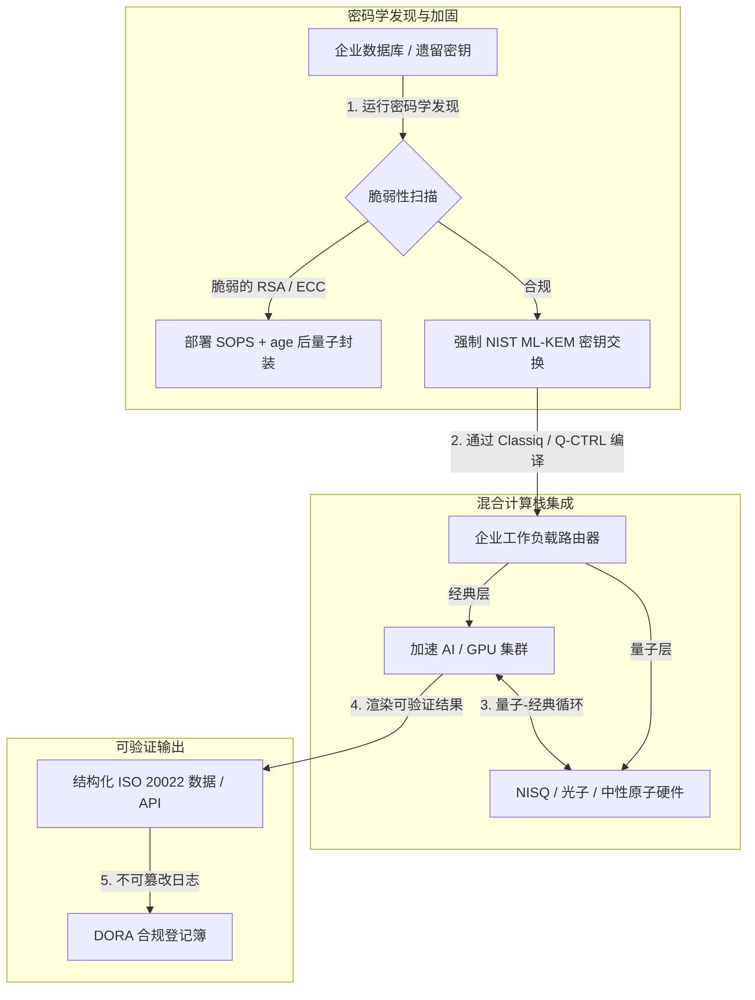

---

# Front Matter (YAML)

author: "contact@sebastienrousseau.com (Sebastien Rousseau)"
banner_alt: "伦敦举行的 Economist Impact 第五届 Commercialising Quantum Global 2026 峰会舞台视角——象征量子技术从物理研究迈向企业级生产工作流"
banner_height: "1597"
banner_width: "2584"
banner: "https://cloudcdn.pro/stocks/images/sebastien-rousseau-20260617-5th-commercialising-quantum-2.webp"
cdn: "https://cloudcdn.pro"
charset: "UTF-8"
cname: "sebastienrousseau.com"
copyright: "© Copyright 2025 - 2026 - Sebastien Rousseau. All rights reserved."
date: "June 17, 2026"
description: "Economist Impact 第五届 Commercialising Quantum Global 2026 峰会的董事会要点——13 亿美元资金潮、no-regrets 混合栈、后量子密码迁移的紧迫性、量子传感商业化，以及 HSBC 关于"等待即失分"的明确指令。"
format-detection: "telephone=no"
hreflang: "zh-hans"
icon: "https://cloudcdn.pro/clients/sebastienrousseau/v1/logos/sebastienrousseau.svg"
id: "https://sebastienrousseau.com/2026-06-17-economist-commercialising-quantum-summit-2026"
image_alt: "Sebastien Rousseau 黑白肖像"
image_height: "162"
image_width: "162"
image: "https://cloudcdn.pro/stocks/images/sebastien-rousseau.png"
keywords: "Commercialising Quantum Global 2026, Economist Impact 峰会, 后量子密码, NIST ML-KEM, harvest-now decrypt-later, SNDL, HSBC 量子, Philip Intallura, 量子传感, GPS 独立导航, NQCC, EU Quantum Act, Quantcore, qBIG 大奖, Lord Vallance, 混合量子-经典, DORA 第 6 条"
language: "zh-Hans"
last_reviewed: "2026-06-17"
layout: "report"
locale: "zh_CN"
logo_alt: "Sebastien Rousseau 标志"
logo_height: "44"
logo_width: "44"
logo: "https://cloudcdn.pro/clients/sebastienrousseau/v1/logos/sebastienrousseau.svg"
menu: ""
measurementID: "G-169G4ET5HQ"
name: "Sebastien Rousseau"
permalink: "https://sebastienrousseau.com/2026-06-17-economist-commercialising-quantum-summit-2026"
rating: "general"
referrer: "no-referrer"
robots: "index, follow"
schema: "FAQPage, Article"
seo_title: "Commercialising Quantum 2026：董事会要点"
short_name: "sebastienrousseau"
subtitle: "量子已从推测性的实验室科学跨入混合企业工作流；面对 2026 年 13 亿美元资金潮、刻不容缓的后量子迁移以及 HSBC "停止观望"的明确指令，董事会必须作出回应。"
tags: "量子, 后量子密码, NIST ML-KEM, harvest-now decrypt-later, 量子传感, HSBC, Economist Impact, 混合计算, DORA, EU Quantum Act, NQCC, 峰会要点"
theme-color: "0, 83, 191"
title: "从量子比特到利润：Economist 第五届 Commercialising Quantum Global 2026 峰会的战略要点"
url: "https://sebastienrousseau.com/2026-06-17-economist-commercialising-quantum-summit-2026"
viewport: "width=device-width, initial-scale=1, shrink-to-fit=no"

# RSS - The RSS feed front matter (YAML).
atom_link: "https://sebastienrousseau.com/2026-06-17-economist-commercialising-quantum-summit-2026/rss.xml"
category: "Technology"
docs: https://validator.w3.org/feed/docs/rss2.html
generator: "Static Site Generator (SSG) (version 0.0.26)"
item_description: "Economist Impact 第五届 Commercialising Quantum Global 2026 峰会的董事会要点——13 亿美元资金潮、no-regrets 混合栈、后量子密码迁移的紧迫性、量子传感商业化，以及 HSBC 关于"等待即失分"的明确指令。"
item_guid: "https://sebastienrousseau.com/2026-06-17-economist-commercialising-quantum-summit-2026/rss.xml"
item_link: "https://sebastienrousseau.com/2026-06-17-economist-commercialising-quantum-summit-2026/rss.xml"
item_pub_date: "Wed, 17 Jun 2026 06:06:06 +0000"
item_title: "从量子比特到利润：Economist 第五届 Commercialising Quantum Global 2026 峰会的战略要点"
last_build_date: "Wed, 17 Jun 2026 06:06:06 +0000"
managing_editor: "contact@sebastienrousseau.com (Sebastien Rousseau)"
pub_date: "Wed, 17 Jun 2026 06:06:06 +0000"
ttl: "60"
type: "article"
webmaster: "contact@sebastienrousseau.com"

# Apple - The Apple front matter (YAML).
apple_mobile_web_app_orientations: "portrait"
apple_touch_icon_sizes: "192x192"
apple-mobile-web-app-capable: "yes"
apple-mobile-web-app-status-bar-inset: "black"
apple-mobile-web-app-status-bar-style: "black-translucent"
apple-mobile-web-app-title: "Commercialising Quantum 2026：董事会要点"
apple-touch-fullscreen: "yes"

# MS Application - The MS Application front matter (YAML).

msapplication-navbutton-color: "0, 83, 191"

# Twitter Card - The Twitter Card front matter (YAML).

twitter_card: "summary_large_image"
twitter_creator: "@wwdseb"
twitter_description: "Economist Impact 第五届 Commercialising Quantum Global 2026 峰会的董事会要点——13 亿美元资金潮、no-regrets 混合栈、后量子密码迁移的紧迫性、量子传感商业化，以及 HSBC 关于"等待即失分"的明确指令。"
twitter_image: "https://cloudcdn.pro/clients/sebastienrousseau/v1/logos/sebastienrousseau.svg"
twitter_image_alt: "Sebastien Rousseau 标志"
twitter_site: "@wwdseb"
twitter_title: "Commercialising Quantum 2026：董事会要点"
twitter_url: "https://sebastienrousseau.com/2026-06-17-economist-commercialising-quantum-summit-2026"

excerpt: "Economist Impact 第五届 Commercialising Quantum Global 2026 峰会确认了量子向企业工作流的转向：五个月内募资 13 亿美元；在 SNDL 收割之下，后量子密码已成为董事会层面的受托议题；量子传感已用于 GPS 独立导航并形成实际出货；HSBC 的 Philip Intallura 明确指出，等待容错硬件就是自摆乌龙。"

# Humans.txt - The Humans.txt front matter (YAML).
author_website: "https://sebastienrousseau.com"
author_twitter: "@wwdseb"
author_location: "London, UK"
thanks: "感谢阅读！"
site_last_updated: "2026-06-17"
site_standards: "HTML5, CSS3, RSS, Atom, JSON, XML, YAML, Markdown, TOML"
site_components: "Kaishi, Kaishi Builder, Kaishi CLI, Kaishi Templates, Kaishi Themes"
site_software: "Static Site Generator, Rust"

---

# 从量子比特到利润：Economist 第五届 Commercialising Quantum Global 2026 峰会的战略要点

企业级就绪度、后量子密码迁移、混合计算栈，以及量子传感与量子网络新兴的商业化路径。

**要点速览。**由 Economist Impact 主办的第五届 Commercialising Quantum Global 2026 大会于 2026 年 6 月 16 日至 17 日在伦敦 Business Design Centre 召开，汇聚了来自企业、金融、政策与研究领域的 1,100 余位全球领导者。会议主线清晰地传递出一项结构性转向：量子技术已从推测性的实验室科学跨入实用的混合企业工作流。仅 2026 年前五个月便有 13 亿美元风险资本入场，董事会的讨论焦点已不再是物理量子比特的数量，而是如何建立 "no-regrets" 混合计算栈，如何抵御 "harvest-now, decrypt-later"（SNDL）密码学威胁以保护数字资产，以及如何部署近期可用的量子传感系统以支撑 GPS 独立导航。

## 核心要点

- **企业转向实用工作流。**HorizonX 的 [Steve Suarez](https://www.linkedin.com/in/stevesuarez) 与 HSBC 的 [Phil Intallura](https://www.linkedin.com/in/intallura) 等行业领袖强调，量子集成不再是物理问题，而是运营问题。银行与企业正在部署混合量子-经典试点，以储备人才、优化现网工作负载。
- **后量子密码（PQC）已是董事会议题。**安全与法务专家（CMS UK、Microsoft 的 [Joanne Miller](https://www.linkedin.com/in/joanne-miller-nso)、EY 的 [Craig Farrell](https://www.linkedin.com/in/craig-farrell)）警示，企业不能等到容错硬件就绪再部署 PQC。"Harvest-now, decrypt-later" 收割正在发生，向 NIST ML-KEM 标准的迁移已是当下的受托责任。
- **量子传感率先实现近期盈利。**容错计算仍需多年，但量子传感（Infleqtion 的 [Matthew Kinsella](https://www.linkedin.com/in/matthewkinsella)）正在快速扩张。量子时钟与惯性传感器已被部署于 GPS 独立导航、国家安全与超稳定电网。
- **主权、集群与政策紧迫性。**英国科学大臣 [Lord Vallance](https://www.linkedin.com/in/patrick-vallance) 与 [Lord William Hague](https://www.linkedin.com/in/williamhague) 阐述了将科研转化为产业级 "超级集群" 的国家任务，并与 National Quantum Computing Centre（NQCC）协同推进。即将出台的 EU Quantum Act 进一步凸显了主权算力的地缘政治竞逐。
- **Quantcore 摘得 qBIG 大奖。**University of Glasgow 衍生公司 Quantcore 凭借基于铌的超导组件突破获得 IOP qBIG 大奖；该组件可在比传统材料更高的温度下运行，显著降低低温基础设施开销。

**延伸阅读：** [KyberLib 与 2026 年后量子银行业迁移：从标准走向代码](https://sebastienrousseau.com/2026-06-12-kyberlib-post-quantum-banking-migration-standards-code-2026/)、[2026 年银行业韧性指数：AI、云、量子、支付与第三方集中度风险](https://sebastienrousseau.com/2026-06-08-banking-resilience-index-ai-cloud-quantum-payments-third-party-risk-2026/)、[2026 年云原生银行业指数：DORA、平台工程、主权云与运营韧性](https://sebastienrousseau.com/2026-06-05-cloud-native-banking-index-dora-resilience-platform-engineering-2026/)。

## 01. 为何 2026 峰会对董事会至关重要

Economist 2026 年 Commercialising Quantum Global 峰会标志着企业评估深科技方式的一次永久性转向。

历史上，量子计算一直被归入研发部门，被视为跨越数十年的科学事业。到了 2026 年 6 月，这一视角已经过时。企业必须从 "物理中心" 的好奇心转向 "业务中心" 的落地实施。原因有二：

1. **量子-AI 融合。**HPC 栈正在把经典计算、加速 AI 与 NISQ（Noisy Intermediate-Scale Quantum）节点融合为单一统一的计算层。延后构建量子就绪应用的机构会发现，捕获战略优势的窗口正以超出预期的速度关闭。
2. **地缘政治与受托紧迫性。**英国以任务为导向的量子计划与即将出台的 EU Quantum Act，使量子算力成为国家主权与企业可持续经营的议题。

更进一步，后量子网络安全已不是未来才需关注的合规要求。"store now, decrypt later"（SNDL）攻击意味着，今天被截获的企业数据将在商用量子系统规模化时被解密，从而在 Digital Operational Resilience Act（DORA）等全球运营韧性法规下立刻产生责任敞口。

## 02. Commercialising Quantum 2026 战略视角

企业技术负责人必须在五个不同的运营层上绘制量子成熟度图谱，并据此评估时间线视野与资产负债表风险。

### 表 1：Commercialising Quantum 2026 战略视角

| 层次 | 企业关注点 | 时间线 / 视野 | 关键企业风险 |
| ---- | ---- | ---- | ---- |
| **硬件与编译器** | 在多条竞争路线（超导、离子阱、中性原子、光子）之间作出选择 | 3 – 5 年（容错阶段） | 锁定在死胡同架构，或过早押注单一平台。 |
| **密码学加固** | 盘点密码学依赖；迁移到 NIST ML-KEM | 即时（迁移已在进行） | 在 DORA 与 NIST CSF 2.0 下出现系统性数据泄露与合规失效。 |
| **量子传感** | 部署 GPS 独立导航、超稳定时钟与重力仪 | 1 – 2 年（即时商业化） | 因 GPS 干扰导致物流、航运与电网运营中断。 |
| **系统集成** | 把量子硬件接入既有经典 HPC 与超算数据中心 | 1 – 3 年（混合阶段） | 高延迟、数据传输瓶颈与计算孤岛。 |
| **企业软件** | 通过高层抽象与 API（Classiq、Q-CTRL）暴露量子算法 | 即时（人才建设） | 人才与工作流与真正的工程执行脱节。 |

## 03. 关键量子信号与董事会触发条件

技术负责人必须跟踪具体、可量化的市场与监管指标，以引导量子投资决策。

### 表 2：关键量子信号与董事会触发条件

| 信号 | 量化指标 | 监管 / 政策参照 | 可执行的平台优先级 |
| ---- | ---- | ---- | ---- |
| **量子融资潮** | 2026 年前五个月全球募资 13 亿美元 | 韧性回报（RoR） | 把预算从推测性试点转向 "no-regrets" 混合量子-经典工作负载。 |
| **数据解密敞口** | 通过公网传输的加密数据 100% 暴露于 SNDL 收割 | DORA 第 6 条（ICT 安全） | 部署密码学发现工具，识别整个资产范围内脆弱的 RSA / ECC 密钥。 |
| **主权基础设施** | UK National Quantum Strategy 拨款 25 亿英镑 | UK Quantum Missions / Lord Vallance | 与 NQCC 等国家级超级集群建立本地合作。 |
| **合规截止** | 2026 年 11 月 14 日 SWIFT 结构化地址切换 | SWIFT SR 2026 指令 | 清洗并格式化跨行数据库，以满足结构化 XML 规范。 |

## 04. 峰会核心议题深度解析

### 量子达到投资临界点

风险资本融资显著加速，仅 2026 年前五个月便募集 **13 亿美元**。与以往的投机性炒作周期不同，本轮资本浪潮以现实的近期工作负载为支撑。Classiq 与 IBM Quantum Platform 的演讲者展示了软件抽象层与自动化编译器如何让非专精的开发团队，能够在今天的经典基础设施之上执行混合量子-经典算法。这一 "no-regrets" 策略让企业得以立即构建量子就绪的人才与工作流。

### 关于 "harvest now, decrypt later" 的法律与监管警示

法务合伙人与网络安全高管就数据风险的即时性引发了高度共鸣。赞助律所 CMS UK 的代表与 Microsoft 首席安全官 [Joanne Miller](https://www.linkedin.com/in/joanne-miller-nso) 向高管层发出了严正警告：*在容错硬件就绪之前不部署后量子密码，是一项严重的受托责任失职。*

在 "store now, decrypt later"（SNDL）范式下，敌对方今天就在积极收割加密的企业数据，意图在密码学相关量子计算机出现后解密。企业必须立即部署后量子保护（例如 NIST ML-KEM），以保护长生命周期的敏感数据集、知识产权与历史客户记录。

### "量子传感" 的炒作回归现实

虽然容错量子计算仍需多年，但峰会指出量子传感是首个真正具有盈利能力的现实部署浪潮。Infleqtion 首席执行官 [Matthew Kinsella](https://www.linkedin.com/in/matthewkinsella) 详细阐述了量子时钟、惯性传感器与射频系统如何在多个行业快速扩张。

由于这些技术以亚原子级精度测量物理常量，它们使 **GPS 独立导航**、超稳定电网与深空通信成为可能。在面临日益严峻 GPS 干扰威胁的航空、海运与国防系统中，这些应用具有高度相关性。

### 生态与集群协同

英国量子生态利用此次伦敦峰会展示了本土创新超级集群。National Quantum Computing Centre（NQCC）与 Digital Catapult 的现场更新展示了早期深科技衍生公司如何将量子硬件直接集成进经典超算数据中心，弥合 "技术鸿沟"。

苏格兰量子初创公司 Quantcore 的联合创始人 [Wridhdhisom Karar](https://www.linkedin.com/in/wridhdhisomkarar)，凭借公司基于铌的超导组件，接过了享有声望的 Institute of Physics（IOP）Quantum Business Innovation and Growth（qBIG）大奖。这些组件可在比传统材料更高的温度下运行，显著降低扩展量子处理器所需的低温基础设施开销。

### HSBC 案例：为何等待量子是 "自摆乌龙"

[**Philip Intallura, Ph.D.**](https://www.linkedin.com/in/intallura)（HSBC 全球量子技术主管、英国政府顾问、董事会顾问）在 Economist 第五届 Commercialising Quantum 活动（2026）上的洞见，向董事会发出了一项强有力的指令：*"在容错量子出现之前等待再开始，就是自摆乌龙。"*

Intallura 博士指出，金融机构常见的 "观望" 心态实为乌龙球，建立在三项错误假设之上：

- **近期 ROI 是真实存在的。**在实测中，HSBC 的表现已优于当前运行于生产环境的模型，将量子工作与业务其他部分相连接，借助量子深化与部分最大客户的关系，并为 **HSBC Innovation Banking** 带来了可观的新业务。
- **量子是一条陡峭的采纳曲线。**在高度受监管的机构内构建能力、制定战略、争取预算、执行实验循环，绝非短期工程。流程必须为该技术进行系统性测试与调适。
- **量子是一种生态。**没有任何单一玩家可以独自抵达终点。HSBC 完成的每一篇研究论文、每一次 POC、每一项试点，都与某家量子供应商紧密协作完成——在部分情形下，合作还延伸至学术界、监管机构与政府部门。

**结语指令：** *"容错到来第一天你需要的能力，就是你现在要建的能力。"*

## 05. 企业量子集成与密码学流水线

为在建设量子就绪度的同时保护数字资产，企业必须建立一条清晰的集成流水线。

## 06. 董事会行动手册：可执行的指令

要把 Commercialising Quantum Global 2026 峰会的洞见转化为即时业务价值，高管层应执行以下四步董事会行动手册：

1. **强制开展密码学发现。**指示首席信息安全官（CISO）盘点全部密码学资产，绘制整个企业范围内每一把遗留 RSA 与 ECC 密钥，为后量子迁移做准备。
2. **部署 "no-regrets" 混合策略。**不要等待完美硬件。投资量子启发软件与混合经典-量子试点，培育内部人才，并在当下优化复杂的物流或风险组合。
3. **评估物流场景下的量子传感。**如果机构依赖全球供应链、航运或关键基础设施，应主动评估量子传感系统（如 GPS 独立导航），以减缓地缘政治扰动风险。
4. **注册 6 月 30 日 Insight Hour。**确保技术负责人注册参加 2026 年 6 月 30 日 BST 下午 3:00 举行的虚拟 **Commercialising Quantum Global Insight Hour**（IonQ 支持），持续跟踪企业风险管理与人才配置策略。

## 07. 常见问题

**什么是 "harvest now, decrypt later"（SNDL）？为何今天就重要？**
SNDL 是指今日截获并存储加密数据，待密码学相关量子计算机出现后再行解密的做法。长生命周期的敏感数据集——知识产权、客户记录、政府通信——已经成为攻击目标。迁移到 NIST ML-KEM 是董事会无法推迟的受托决策。

**为何量子传感是首个商业浪潮，而非量子计算？**
量子传感器以亚原子级精度测量物理常量，并不需要量子计算所依赖的容错硬件。量子时钟、重力仪与惯性传感器已在 GPS 独立导航、超稳定电网与深空通信等场景进入试点部署。

**HSBC 的量子工作仅是研发，还是已带来可衡量的回报？**
据 Philip Intallura 在峰会上介绍，HSBC 已在现网生产模型基础上实现性能超越，借助量子深化与最大客户的关系，并为 HSBC Innovation Banking 带来了可观的新业务。该项工作已从研究阶段进入运营集成阶段。

## 08. 参考资料

- **Economist Impact, (2026).** *5th Annual Commercialising Quantum Global 2026.* Live conference proceedings, June 16–17, 2026. London: Business Design Centre. Available at: [Economist Impact](https://events.economist.com/commercialising-quantum/).
- **National Institute of Standards and Technology (NIST), (2024).** *First Three Finalized Post-Quantum Encryption Standards (FIPS 203, 204, and 205).* Gaithersburg: U.S. Department of Commerce. Available at: [NIST Standards](https://www.nist.gov/news-events/news/2024/08/nist-releases-first-3-finalized-post-quantum-encryption-standards).
- **European Parliament and Council of the European Union, (2022).** *Regulation (EU) 2022/2554 on digital operational resilience for the financial sector (DORA).* Brussels: Official Journal of the European Union. Available at: [DORA Regulation](https://eur-lex.europa.eu/legal-content/EN/TXT/?uri=CELEX%3A32022R2554).
- **SWIFT, (2024).** *ISO 20022 November 2026 Structured Address Milestone.* La Hulpe: SWIFT. Available at: [SWIFT ISO 20022 milestone](https://www.swift.com/standards/iso-20022/iso-20022-bytes/call-action-november-2026).
