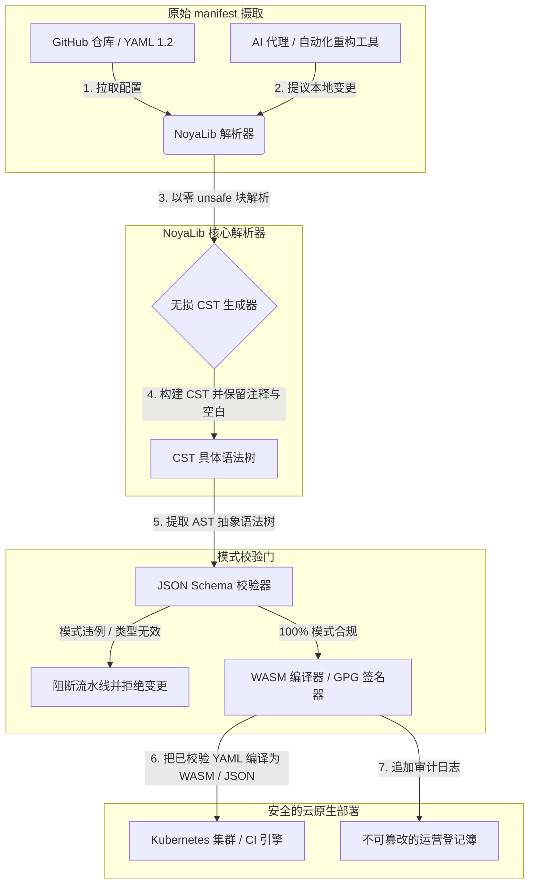

---

# Front Matter (YAML)

author: "contact@sebastienrousseau.com (Sebastien Rousseau)"
banner_alt: "戏剧光影下的建筑几何——象征 NoyaLib 作为 CI、Kubernetes、MCP 与金融服务配置之下承重的安全 Rust YAML 解析器"
banner_height: "1597"
banner_width: "2584"
banner: "https://cloudcdn.pro/stocks/images/ken-cheung-KonWFWUaAuk.webp"
cdn: "https://cloudcdn.pro"
charset: "UTF-8"
cname: "sebastienrousseau.com"
copyright: "© Copyright 2025 - 2026 - Sebastien Rousseau. All rights reserved."
date: "June 18, 2026"
description: "NoyaLib：零 unsafe 的 Rust YAML 1.2 解析器，实现 406/406 规范合规、JSON Schema 校验、无损 CST 与 MCP/WASM 绑定，服务金融基础设施。"
format-detection: "telephone=no"
hreflang: "zh-hans"
icon: "https://cloudcdn.pro/clients/sebastienrousseau/v1/logos/sebastienrousseau.svg"
id: "https://sebastienrousseau.com/2026-06-18-noyalib-safe-yaml-rust-ai-mcp-financial-infrastructure-2026"
image_alt: "Sebastien Rousseau 黑白肖像"
image_height: "162"
image_width: "162"
image: "https://cloudcdn.pro/stocks/images/sebastien-rousseau.png"
keywords: "更安全的 Rust YAML 解析器, NoyaLib, YAML 1.2 规范合规, 零 unsafe Rust, JSON Schema 校验, 无损 CST 具体语法树, CST, MCP, Model Context Protocol, WebAssembly, Kubernetes manifest, CI/CD 配置, DORA 第 5 条, BCBS 239, Basel III 操作风险, 金融基础设施, 配置安全, 软件供应链"
language: "zh-Hans"
last_reviewed: "2026-06-18"
layout: "report"
locale: "zh_CN"
logo_alt: "Sebastien Rousseau 标志"
logo_height: "44"
logo_width: "44"
logo: "https://cloudcdn.pro/clients/sebastienrousseau/v1/logos/sebastienrousseau.svg"
menu: ""
measurementID: "G-169G4ET5HQ"
name: "Sebastien Rousseau"
permalink: "https://sebastienrousseau.com/2026-06-18-noyalib-safe-yaml-rust-ai-mcp-financial-infrastructure-2026"
rating: "general"
referrer: "no-referrer"
robots: "index, follow"
schema: "FAQPage, Article"
seo_title: "面向 AI、MCP 与金融的更安全 Rust YAML 解析器"
short_name: "sebastienrousseau"
subtitle: "更安全的 Rust YAML 栈——NoyaLib——把 YAML 1.2 从便利标记升级为面向 AI 代理、MCP、Kubernetes 与金融服务基础设施的、密码学可验证且规范合规的配置控制平面。"
tags: "更安全的 Rust YAML 解析器, NoyaLib, YAML 1.2, 零 unsafe Rust, JSON Schema, MCP, WebAssembly, Kubernetes, DORA, BCBS 239, Basel III, 金融基础设施, 供应链安全"
theme-color: "0, 83, 191"
title: "为何 2026 年的 AI、MCP 与金融基础设施需要更安全的 Rust YAML 栈"
url: "https://sebastienrousseau.com/2026-06-18-noyalib-safe-yaml-rust-ai-mcp-financial-infrastructure-2026"
viewport: "width=device-width, initial-scale=1, shrink-to-fit=no"

# RSS - The RSS feed front matter (YAML).
atom_link: "https://sebastienrousseau.com/2026-06-18-noyalib-safe-yaml-rust-ai-mcp-financial-infrastructure-2026/rss.xml"
category: "Technology"
docs: https://validator.w3.org/feed/docs/rss2.html
generator: "Static Site Generator (SSG) (version 0.0.26)"
item_description: "NoyaLib：零 unsafe 的 Rust YAML 1.2 解析器，实现 406/406 规范合规、JSON Schema 校验、无损 CST 与 MCP/WASM 绑定，服务金融基础设施。"
item_guid: "https://sebastienrousseau.com/2026-06-18-noyalib-safe-yaml-rust-ai-mcp-financial-infrastructure-2026/rss.xml"
item_link: "https://sebastienrousseau.com/2026-06-18-noyalib-safe-yaml-rust-ai-mcp-financial-infrastructure-2026/rss.xml"
item_pub_date: "Thu, 18 Jun 2026 06:06:06 +0000"
item_title: "为何 2026 年的 AI、MCP 与金融基础设施需要更安全的 Rust YAML 栈"
last_build_date: "Thu, 18 Jun 2026 06:06:06 +0000"
managing_editor: "contact@sebastienrousseau.com (Sebastien Rousseau)"
pub_date: "Thu, 18 Jun 2026 06:06:06 +0000"
ttl: "60"
type: "article"
webmaster: "contact@sebastienrousseau.com"

# Apple - The Apple front matter (YAML).
apple_mobile_web_app_orientations: "portrait"
apple_touch_icon_sizes: "192x192"
apple-mobile-web-app-capable: "yes"
apple-mobile-web-app-status-bar-inset: "black"
apple-mobile-web-app-status-bar-style: "black-translucent"
apple-mobile-web-app-title: "面向 AI、MCP 与金融的更安全 Rust YAML 解析器"
apple-touch-fullscreen: "yes"

# MS Application - The MS Application front matter (YAML).

msapplication-navbutton-color: "0, 83, 191"

# Twitter Card - The Twitter Card front matter (YAML).

twitter_card: "summary_large_image"
twitter_creator: "@wwdseb"
twitter_description: "NoyaLib：零 unsafe 的 Rust YAML 1.2 解析器，实现 406/406 规范合规、JSON Schema 校验、无损 CST 与 MCP/WASM 绑定，服务金融基础设施。"
twitter_image: "https://cloudcdn.pro/clients/sebastienrousseau/v1/logos/sebastienrousseau.svg"
twitter_image_alt: "Sebastien Rousseau 标志"
twitter_site: "@wwdseb"
twitter_title: "面向 AI、MCP 与金融的更安全 Rust YAML 解析器"
twitter_url: "https://sebastienrousseau.com/2026-06-18-noyalib-safe-yaml-rust-ai-mcp-financial-infrastructure-2026"

excerpt: "NoyaLib 是一套更安全的 Rust YAML 栈——零 unsafe 块、YAML 1.2 规范 406/406 全通过、无损 CST 具体语法树、JSON Schema（Draft 2020-12）校验，并提供 MCP/WASM 绑定——为 AI 代理、Kubernetes、CI/CD 以及金融基础设施背后的配置控制平面而设计。"

# Humans.txt - The Humans.txt front matter (YAML).
author_website: "https://sebastienrousseau.com"
author_twitter: "@wwdseb"
author_location: "London, UK"
thanks: "感谢阅读！"
site_last_updated: "2026-06-18"
site_standards: "HTML5, CSS3, RSS, Atom, JSON, XML, YAML, Markdown, TOML"
site_components: "Kaishi, Kaishi Builder, Kaishi CLI, Kaishi Templates, Kaishi Themes"
site_software: "Static Site Generator, Rust"

---

# 为何 2026 年的 AI、MCP 与金融基础设施需要更安全的 Rust YAML 栈

更安全的 Rust YAML 栈之所以重要，是因为 YAML 如今承载着 CI/CD 流水线、Kubernetes manifest、[Open Policy Agent](https://www.openpolicyagent.org/) 规则与 Model Context Protocol（MCP）工具注册表——任何一次语义模糊的解析都可能让清算系统失灵、安全组配置错误，或把错误的权限交到本地 AI 代理手中。[NoyaLib](https://github.com/sebastienrousseau/noyalib) 是一套纯 Rust、零 unsafe 的 [YAML 1.2](https://yaml.org/spec/1.2.2/) 解析与校验生态，旨在让这层基础设施默认安全。

## 一句话回答

**NoyaLib 一句话是什么？** NoyaLib 是一套开源、纯 Rust 的 YAML 1.2 解析与校验生态：零 `unsafe` 代码、覆盖官方 406 项 YAML 规范测试的 100% 合规、无损 CST 具体语法树，以及实时 [JSON Schema](https://json-schema.org/) 校验——让 AI 代理、MCP、Kubernetes 与金融基础设施的配置默认安全。

## 行政摘要

YAML 看似不起眼，直到一次语义模糊的解析或一次规范违例击穿了一套数十亿美元规模的生产清算系统。在 2026 年，YAML 已是 [CI/CD](https://docs.github.com/en/actions/learn-github-actions/workflow-syntax-for-github-actions) 流水线、[Kubernetes](https://kubernetes.io/docs/concepts/configuration/overview/) manifest、[Open Policy Agent](https://www.openpolicyagent.org/) 规则与 Model Context Protocol（MCP）工具注册表的事实标准。带有内存漏洞与破坏性解析行为的不透明遗留解析器，是不可接受的安全风险。NoyaLib 是一套纯 Rust、零 unsafe 的 YAML 1.2 生态：在全部 406 项官方测试中实现 100% 规范合规、保留注释与空白的无损 CST 具体语法树，以及内建的 JSON Schema 校验。其结果是把 YAML 重塑为一条可审计、安全且可被代理访问的配置控制平面。

## 核心要点

- **配置即生产代码。**一份畸形的 YAML 即可让云原生安全组或 AI 代理权限配置错误。NoyaLib 把 YAML 当作关键基础设施对待。
- **零 unsafe 设计。**NoyaLib 完全由安全 Rust 构建，零 `unsafe` 块，在核心解析层根除内存安全漏洞——缓冲区溢出与远程代码执行。
- **406/406 绝对规范合规。**以数学方式校验配置结构，消除预生产与生产环境间的解析差异与结构漂移。
- **无损 CST 具体语法树。**与丢弃注释与格式的遗留解析器不同，NoyaLib 保留空白与注解，让 AI 代理可以执行安全的来回自动重构。
- **董事会层面的受托价值。**把配置完整性与 [DORA 第 5 条](https://eur-lex.europa.eu/legal-content/EN/TXT/?uri=CELEX%3A32022R2554) 和 [Basel III](https://www.bis.org/bcbs/publ/d424.htm) 操作风险资本指标挂钩，直接保护高级管理层免于个人责任敞口。

**延伸阅读：** [KyberLib 与 2026 年后量子银行业迁移：从标准走向代码](https://sebastienrousseau.com/2026-06-12-kyberlib-post-quantum-banking-migration-standards-code-2026/)、[2026 年云原生银行业指数：DORA、平台工程、主权云与运营韧性](https://sebastienrousseau.com/2026-06-05-cloud-native-banking-index-dora-resilience-platform-engineering-2026/)、[2026 年 AI 感知 Dotfiles：为 MCP、SLSA 与多 Shell 一致性打造安全可复现的开发者工作站](https://sebastienrousseau.com/2026-06-16-ai-aware-dotfiles-secure-reproducible-workstation-2026/)。

## 01. 为何 2026 年需要更安全的 Rust YAML 栈

2026 年 6 月，企业 IT 基础设施高度分布化、自动化程度持续提升。

YAML 已悄然成为整个软件工程栈的承重配置语言。它承载着编译生产构建产物的持续集成（CI）流水线、编排全球云原生集群的 [Kubernetes](https://kubernetes.io/docs/concepts/overview/) manifest，以及授予本地 AI 代理执行本地操作权限的 [Model Context Protocol](https://modelcontextprotocol.io/)（MCP）服务器模式。

[PyYAML](https://pyyaml.org/)、[yaml-cpp](https://github.com/jbeder/yaml-cpp)、[libyaml](https://github.com/yaml/libyaml) 等遗留 YAML 解析器存在两类结构性风险：

1. **类型强制转换漏洞（"挪威问题"）。**遗留解析器常把未加引号的字符串强制转换（如把国家代码 `NO` 转换为布尔值 `false`，`yes`/`no` 亦同）——见 [YAML 1.1 与 1.2 布尔标签](https://yaml.org/type/bool.html)——从而导致关键系统故障或静默的安全配置错误。
2. **内存安全攻击。**以 C/C++ 编写的不透明解析器存在内存泄漏与缓冲区溢出，可在核心构建服务器上导致远程代码执行（RCE）。

[NoyaLib](https://github.com/sebastienrousseau/noyalib) 解决了上述挑战。它是一套纯 Rust、零 unsafe 的 YAML 1.2 解析与校验生态。通过实现 406/406 的绝对规范合规，并在解析期直接强制 JSON Schema 校验，NoyaLib 带来了高 **韧性回报（RoR）**——防范配置导致的宕机，并保护金融级软件供应链。

## 02. 2026 年 NoyaLib 架构视角

NoyaLib 生态作为一套安全、无损的配置解析器运行。每一份本地与云上的 manifest 都在最底层执行环境中获得结构性校验与保护。

### 表 1：NoyaLib 架构层与风险缓释

| 层次 | 设计决策 | 关键意义 | 处置不当的风险 |
| ---- | ---- | ---- | ---- |
| **解析层** | YAML 1.2 合规、纯 Rust 解析器、零 `unsafe` 块 | 在最底层执行层根除内存安全漏洞与缓冲区溢出。 | 核心构建服务器遭受远程代码执行（RCE）。 |
| **一致性层** | 在 406/406 项官方 YAML 1.2 套件测试中 100% 合规 | 消除预生产与生产之间的解析差异与类型强制漂移。 | "挪威问题" 类型强制错误导致安全组被禁用。 |
| **语法树层** | 无损 CST 具体语法树 | 在来回解析与程序化重构中保留注释、空白与顺序。 | 自动化 AI 重构破坏开发者注解。 |
| **校验层** | 解析期 [JSON Schema（Draft 2020-12）](https://json-schema.org/draft/2020-12/release-notes) 校验 | 在配置文件抵达生产集群之前强制执行严格的数据模型。 | 畸形配置文件触发云原生集群崩溃。 |
| **接口层** | WebAssembly（WASM）与 MCP 绑定 | 让配置校验可直接在浏览器、边缘节点与本地代理工具链内运行。 | 边缘设备无法执行校验造成工具链孤岛。 |

## 03. 工作站与配置安全的关键信号

要在开发与运维资产范围内保持绝对安全，首席信息安全官（CISO）必须监控具体、可量化的指标。

### 表 2：工作站与配置安全信号

| 信号 | 指标 / 运营基准 | NIST CSF / DORA 参照 | 技术平台实现 |
| ---- | ---- | ---- | ---- |
| **解析器一致性** | 在官方 YAML 1.2 测试套件中达成 100% 通过率（406/406）。 | [DORA 第 6 条](https://eur-lex.europa.eu/legal-content/EN/TXT/?uri=CELEX%3A32022R2554)（ICT 安全） | NoyaLib 解析器核心在 CI 执行前校验所有 manifest。 |
| **内存安全画像** | 解析器与序列化依赖中零 `unsafe` Rust 块。 | DORA 第 30 条（供应链） | cargo 构建中的自动化编译器检查（[`forbid(unsafe_code)`](https://doc.rust-lang.org/reference/attributes/diagnostics.html#the-forbid-attribute)）。 |
| **模式校验** | 100% 已解析的配置文件均针对有效 [JSON Schema](https://json-schema.org/) 模型完成校验。 | [NIST CSF 2.0](https://www.nist.gov/cyberframework)（PR.DS-01） | 实时校验门，在模式违例时中断构建流水线。 |
| **配置漂移** | 实时检测并恢复本地配置文件至 git 版本化状态。 | 韧性回报（RoR） | 持续遥测记录所有本地文件修改。 |
| **代理访问控制** | 通过 MCP 配置运行的本地 AI 工具仅获受限的只读权限。 | 模型风险管理（[SR 11-7](https://www.federalreserve.gov/supervisionreg/srletters/sr1107.htm)） | MCP 服务器边界把代理操作限制在经批准的目录范围内。 |

## 04. 不透明配置解析的谬误

云原生运维中的一项重大漏洞是 *不透明解析*——使用在编译过程中丢弃结构性元数据（注释、空白、文档顺序）或静默执行类型强制转换的解析器。这一行为带来两类严峻安全风险：

1. **破坏性重构。**当 AI 编码助手或自动化重构工具更新部署 manifest 时，传统解析器会丢弃开发者注释与格式，进而破坏人工评审与事后取证所需的上下文。
2. **解析差异。**若预生产环境使用基于 Python 的解析器，而生产环境使用基于 C 的解析器，则 YAML 1.2 规范合规上的细微差异，可能让一份在预生产中有效的 manifest 在生产环境中失败或行为不一，制造出隐藏的安全漏洞。

NoyaLib 的 **无损 CST 具体语法树** 解决了这一问题。它在解析—序列化的回路中保留每一处空格、注释与文档行。自动化 AI 助手可以在保留 100% 人工注解的前提下编辑、重构并提交配置文件——形成一条绝对的审计轨迹。

## 05. 设计有边界的 AI 配置流水线

为防止恶意配置变更抵达生产环境，机构必须实施一条严格受限、由模式校验的配置流水线。

下述运营流程展示了 NoyaLib 如何解析原始 YAML、构建无损 CST、对 AST 进行 JSON Schema 校验，并为浏览器或边缘环境编译 WebAssembly 绑定。

## 06. 董事会行动手册与受托责任

配置安全与软件供应链完整性是关键的董事会优先议题。高级管理者必须从受托责任与运营韧性的视角看待配置管理。

- **DORA 第 5 条（董事会问责）。**规定董事会承担机构 ICT 风险管理的最终且不可委托的责任。由于配置文件控制着关键的云原生安全组与支付路由路径，董事会必须确认解析这些 manifest 的系统具备内存安全与完整规范合规，方能满足监管审计。（[Regulation (EU) 2022/2554](https://eur-lex.europa.eu/legal-content/EN/TXT/?uri=CELEX%3A32022R2554)）
- **BCBS 239（风险数据聚合与报告）。**要求风险报告与基础设施指标在严格的数据质量控制下生成、保持准确与完整。NoyaLib 通过在源头按严格模式解析并校验配置文件，防止静默的数据外泄或由配置错误引发的中断，从而支持 BCBS 239。（[BCBS 239 标准](https://www.bis.org/publ/bcbs239.htm)）
- **降低操作风险资本占用（Basel III）。**由配置引发的中断会直接抬升 Basel III 下的操作风险资本占用，占用资产负债表上的资本。把企业配置栈标准化在 NoyaLib 这类安全、纯 Rust 的解析器之上，可最小化该风险，节省资本并保护客户信任。（[Basel III 标准](https://www.bis.org/bcbs/publ/d424.htm)）

## 07. 按银行类型解读

### 全球系统重要性银行（G-SIB）

G-SIB 在多个司法辖区运营数以千计的微服务与部署流水线。其首要挑战是在庞大的云原生资产范围内维持配置一致性、防止安全漂移。把企业栈标准化在 NoyaLib 这类更安全的 Rust YAML 栈上，可确保所有 Kubernetes manifest、CI/CD 流水线与安全策略在统一的内存安全框架下完成解析与校验——杜绝未经审计的 "雪花式" 配置风险。

### 交易型与对公银行

交易型银行运营敏感的支付网关与批发清算基础设施。证明部署到这些生产环境的代码与配置具备绝对安全，是不可妥协的监管要求。集成 NoyaLib 可确保软件供应链获得完整审计、无损保留并免受解析漏洞侵害——这项控制与 DORA 第 6 条以及 [PCI DSS v4.0](https://www.pcisecuritystandards.org/document_library/) 第 6 节高度契合。

### 区域性与中小型银行

区域性银行必须在没有 G-SIB 规模技术预算的前提下维持高水准网络安全。开源的 NoyaLib 框架提供了一套轻量、低成本、高度安全且对 Rust 友好的方案，让中小型机构无需专有许可费即可落地企业级配置安全与供应链保护。

## 08. 结论：配置安全路线图

开发者工作站与云原生基础设施配置是软件供应链中的关键控制平面。允许未经审计、语义模糊或不安全的配置文件抵达企业资产，是不可接受的运营与监管风险。

为保护软件供应链并防止配置漏洞侵蚀终端，高级技术与安全管理者今天应执行清晰的开发路线图：

1. **强制声明式配置。**淘汰人工、未经审计的配置调整，要求所有 manifest 以版本受控、声明式的记录系统进行管理。
2. **强制模式校验。**强制启用预提交钩子与扫描工具，确保所有配置文件在部署前完成针对有效 JSON Schema 模型的校验。
3. **落实无损往返。**确保所有自动化 AI 编码助手与重构工具采用无损解析，保留注释、空白与开发者上下文。
4. **守护供应链。**确保所有配置脚手架与解析工具在执行前由 NoyaLib 这类纯 Rust、零 unsafe 的库以密码学方式验证。（[SLSA 框架](https://slsa.dev/)）

## 09. 常见问题

**什么是 NoyaLib？为何用于 YAML 解析？**
NoyaLib 是一套开源、纯 Rust、零 unsafe 的 YAML 1.2 解析器。它在官方 406 项测试套件中实现 100% 规范合规，在解析期强制执行严格的 [JSON Schema](https://json-schema.org/) 校验，并暴露 WASM 与 [MCP](https://modelcontextprotocol.io/) 绑定——使其成为面向 AI 代理、Kubernetes 与金融基础设施的更安全 Rust YAML 栈。

**为何零 unsafe 设计对配置解析如此重要？**
以 C/C++ 编写的遗留解析器中的内存安全漏洞——缓冲区溢出、释放后使用——可在核心构建服务器上引发远程代码执行。NoyaLib 的纯 Rust 设计配合 [`#![forbid(unsafe_code)]`](https://doc.rust-lang.org/reference/attributes/diagnostics.html#the-forbid-attribute)，在编译期以数学方式根除这些漏洞。

**什么是无损 CST 具体语法树？为何重要？**
传统解析器丢弃注释与格式，让 AI 代理的自动化编辑变得破坏性。NoyaLib 的无损 CST 保留每一处注释、空格与文档行——AI 助手得以在保留开发者上下文、事后取证与审计轨迹完整的前提下，安全地编辑与重构配置文件。

**NoyaLib 如何映射到 DORA、BCBS 239 与 Basel III？**
DORA 第 5 条把 ICT 风险问责落到董事会；BCBS 239 要求对风险报告执行数据质量控制；Basel III 对操作风险资本计提征 "税"。NoyaLib 提供这些法规要求的、由模式校验且内存安全的解析层——把法规映射做得直截了当，并把操作风险资本占用压到更小。

## 10. 参考资料

- **YAML, (2026).** *YAML 1.2 specification*. Available at: [YAML 1.2 spec](https://yaml.org/spec/1.2.2/).
- **JSON Schema, (2026).** *JSON Schema Draft 2020-12 release notes*. Available at: [JSON Schema Draft 2020-12](https://json-schema.org/draft/2020-12/release-notes).
- **European Parliament and Council of the European Union, (2022).** *Regulation (EU) 2022/2554 on digital operational resilience for the financial sector (DORA)*. Brussels: Official Journal of the European Union. Available at: [DORA regulation](https://eur-lex.europa.eu/legal-content/EN/TXT/?uri=CELEX%3A32022R2554).
- **Basel Committee on Banking Supervision, (2013).** *Principles for effective risk data aggregation and risk reporting (BCBS 239)*. Basel: Bank for International Settlements. Available at: [BCBS 239 standard](https://www.bis.org/publ/bcbs239.htm).
- **Basel Committee on Banking Supervision, (2017).** *Basel III: finalising post-crisis reforms*. Basel: Bank for International Settlements. Available at: [Basel III standards](https://www.bis.org/bcbs/publ/d424.htm).
- **Anthropic, (2025).** *Model Context Protocol (MCP) specification*. Available at: [Model Context Protocol](https://modelcontextprotocol.io/).
- **GitHub, (2026).** *noyalib open-source repository*. Available at: [NoyaLib repository](https://github.com/sebastienrousseau/noyalib).
