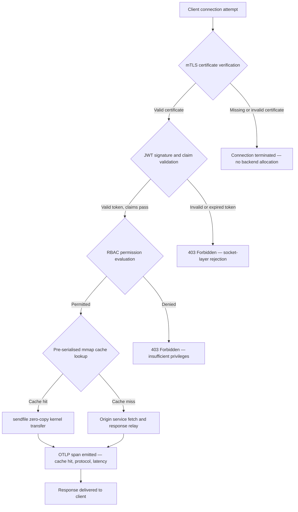

---

# Front Matter (YAML)

author: "contact@sebastienrousseau.com (Sebastien Rousseau)"
banner_alt: "夜间抽象电路板城市景观——呈现银行业边缘网络中内核级零拷贝传输、mTLS握手与JWT验证在单一静态链接二进制文件中汇聚的场景"
banner_height: "1597"
banner_width: "2584"
banner: "https://cloudcdn.pro/stocks/images/bit-cloud-GlqbGLCPnQ4.webp"
cdn: "https://cloudcdn.pro"
charset: "UTF-8"
cname: "sebastienrousseau.com"
copyright: "© Copyright 2025 - 2026 - Sebastien Rousseau. All rights reserved."
date: "June 20, 2026"
description: "http-handle 是一个静态链接的 Rust 二进制文件，在银行业边缘以零运行时依赖实现每秒 180,000 次请求，集成 mTLS 与 JWT 验证、ALPN 协商的 HTTP/2 和 HTTP/3，以及 OTLP 可观测性——填补了 Nginx 和 Envoy 留下的安全与弹性缺口。"
format-detection: "telephone=no"
hreflang: "zh-Hans"
icon: "https://cloudcdn.pro/clients/sebastienrousseau/v1/logos/sebastienrousseau.svg"
id: "https://sebastienrousseau.com/2026-06-20-http-handle-zero-dependency-edge-ingress-banking-rust-2026"
image_alt: "Sebastien Rousseau 黑白肖像"
image_height: "162"
image_width: "162"
image: "https://cloudcdn.pro/stocks/images/sebastien-rousseau.png"
keywords: "http-handle, Rust 边缘入口, 零依赖代理, 银行基础设施, mTLS JWT, sendfile 零拷贝, ALPN HTTP3, DORA 合规, 巴塞尔III, OTLP 可观测性, 静态二进制, ARM64 银行, 零信任银行, 轻量级入口, Rust 银行安全"
language: "zh-Hans-CN"
last_reviewed: "2026-06-20"
layout: "report"
locale: "zh_Hans_CN"
logo_alt: "Sebastien Rousseau 的标志"
logo_height: "44"
logo_width: "44"
logo: "https://cloudcdn.pro/clients/sebastienrousseau/v1/logos/sebastienrousseau.svg"
menu: ""
measurementID: "G-169G4ET5HQ"
name: "Sebastien Rousseau"
permalink: "https://sebastienrousseau.com/2026-06-20-http-handle-zero-dependency-edge-ingress-banking-rust-2026"
rating: "general"
referrer: "no-referrer"
robots: "index, follow"
schema: "FAQPage, Article"
seo_title: "http-handle：银行业零依赖 Rust 入口，每秒 18 万次请求"
short_name: "sebastienrousseau"
subtitle: "单一静态链接 Rust 二进制文件如何在银行业边缘以每秒 180,000 次请求实现 mTLS、JWT 和 ALPN——以及这对 DORA 和巴塞尔III 合规意味着什么。"
tags: "http-handle, Rust, banking, edge-ingress, mTLS, JWT, ALPN, HTTP3, DORA, Basel-III, zero-copy, sendfile, ARM64, zero-trust, OTLP, observability, open-source, infrastructure"
theme-color: "0, 83, 191"
title: "http-handle：2026 年银行业高性能零依赖边缘入口"
url: "https://sebastienrousseau.com/2026-06-20-http-handle-zero-dependency-edge-ingress-banking-rust-2026"
viewport: "width=device-width, initial-scale=1, shrink-to-fit=no"

# RSS - The RSS feed front matter (YAML).
atom_link: "https://sebastienrousseau.com/2026-06-20-http-handle-zero-dependency-edge-ingress-banking-rust-2026/rss.xml"
category: "Technology"
docs: https://validator.w3.org/feed/docs/rss2.html
generator: "Static Site Generator (SSG) (version 0.0.40)"
item_description: "http-handle 是一个静态链接的 Rust 二进制文件，在银行业边缘以零运行时依赖实现每秒 180,000 次请求，集成 mTLS 与 JWT 验证、ALPN 协商的 HTTP/2 和 HTTP/3，以及 OTLP 可观测性——填补了 Nginx 和 Envoy 留下的安全与弹性缺口。"
item_guid: "https://sebastienrousseau.com/2026-06-20-http-handle-zero-dependency-edge-ingress-banking-rust-2026/rss.xml"
item_link: "https://sebastienrousseau.com/2026-06-20-http-handle-zero-dependency-edge-ingress-banking-rust-2026/rss.xml"
item_pub_date: "Sat, 20 Jun 2026 07:07:07 +0000"
item_title: "http-handle：2026 年银行业高性能零依赖边缘入口"
last_build_date: "Sat, 20 Jun 2026 07:07:07 +0000"
managing_editor: "contact@sebastienrousseau.com (Sebastien Rousseau)"
pub_date: "Sat, 20 Jun 2026 07:07:07 +0000"
ttl: "60"
type: "article"
webmaster: "contact@sebastienrousseau.com"

# Apple - The Apple front matter (YAML).
apple_mobile_web_app_orientations: "portrait"
apple_touch_icon_sizes: "192x192"
apple-mobile-web-app-capable: "yes"
apple-mobile-web-app-status-bar-inset: "black"
apple-mobile-web-app-status-bar-style: "black-translucent"
apple-mobile-web-app-title: "零依赖银行边缘"
apple-touch-fullscreen: "yes"

# MS Application - The MS Application front matter (YAML).

msapplication-navbutton-color: "0, 83, 191"

# Twitter Card - The Twitter Card front matter (YAML).

twitter_card: "summary_large_image"
twitter_creator: "@wwdseb"
twitter_description: "http-handle 是一个静态链接的 Rust 二进制文件，在银行业边缘以零运行时依赖实现每秒 180,000 次请求，集成 mTLS、JWT 和 OTLP 可观测性。"
twitter_image: "https://cloudcdn.pro/clients/sebastienrousseau/v1/logos/sebastienrousseau.svg"
twitter_image_alt: "Logo of Sebastien Rousseau"
twitter_site: "@wwdseb"
twitter_title: "http-handle：银行业零依赖 Rust 入口，每秒 18 万次请求"
twitter_url: "https://sebastienrousseau.com/2026-06-20-http-handle-zero-dependency-edge-ingress-banking-rust-2026"

# Humans.txt - The Humans.txt front matter (YAML).
author_website: "https://sebastienrousseau.com"
author_twitter: "@wwdseb"
author_location: "London, UK"
thanks: "Thanks for reading!"
site_last_updated: "2026-06-20"
site_standards: "HTML5, CSS3, RSS, Atom, JSON, XML, YAML, Markdown, TOML"
site_components: "Kaishi, Kaishi Builder, Kaishi CLI, Kaishi Templates, Kaishi Themes"
site_software: "Static Site Generator, Rust"

excerpt: "银行业边缘存在依赖问题。每个在客户端和核心银行服务之间路由流量的 Nginx 或 Envoy 实例都携带着一棵依赖树：OpenSSL 构建、Lua 模块……"
---

# http-handle：2026 年银行业高性能零依赖边缘入口

<!-- lead-start -->
<aside class="post-lead" aria-label="文章摘要">

<strong>TL;DR。</strong> http-handle 是一个静态链接的 Rust 二进制文件，在银行业边缘以零运行时依赖实现每秒 180,000 次请求，集成 mTLS 与 JWT 验证、ALPN 协商的 HTTP/2 和 HTTP/3，以及 OTLP 可观测性——填补了 Nginx 和 Envoy 留下的安全与弹性缺口。

<strong>核心要点</strong>

<ul class="post-lead-takeaways">
  <li><strong>简明答案。</strong> http-handle 一句话是什么？</li>
  <li><strong>执行摘要。</strong> 银行业在其边缘运行 Nginx 和 Envoy 已有十年。</li>
  <li><strong>01. 银行业的重型代理问题。</strong> Nginx 和 Envoy 构建了现代互联网的边缘。</li>
  <li><strong>02. http-handle 2026 架构视角。</strong> 该二进制文件由五个相互依存的层构成，每层旨在消除传统代理架构积累的特定风险类别。</li>
</ul>

<strong>相关阅读：</strong> <a href="https://sebastienrousseau.com/2023-11-19-crystals-kyber-the-safeguarding-algorithm-in-a-quantum-age/index.html">CRYSTALS-Kyber：量子时代的保护算法</a>，<a href="https://sebastienrousseau.com/2026-06-20-html-generator-accessible-seo-structured-markdown-rust-2026">2026 年用 Rust 将 Markdown 转化为无障碍、SEO 就绪的结构化 HTML</a>，<a href="https://sebastienrousseau.com/2026-06-12-kyberlib-post-quantum-banking-migration-standards-code-2026">KyberLib 与 2026 年银行业后量子迁移：从标准到代码</a>。

</aside>
<!-- lead-end -->

银行业边缘存在依赖问题。每个在客户端和核心银行服务之间路由流量的 Nginx 或 Envoy 实例都携带着一棵依赖树：OpenSSL 构建、Lua 模块、gRPC 库和容器层——每一个都是潜在的 CVE，每一个都需要专门的修补周期，每一个都增加了使 SLA 测量复杂化的延迟方差。根据[《数字运营弹性法案》（DORA）](https://eur-lex.europa.eu/eli/reg/2022/2554/oj)，这种复杂性现在与运营风险同样是监管责任。

[http-handle](https://github.com/sebastienrousseau/http-handle) 采取了不同的方法。它是一个单一的静态链接 Rust 二进制文件，除 `libc` 外无任何运行时依赖。它在 ARM64 节点上每秒处理 180,000 次请求，在网络套接字层强制执行双向 TLS 和 JWT 身份验证，并自动协商 HTTP/2 和 HTTP/3——所有这些都在 20 MB RAM 以内的部署占用中完成。

## 简明答案

**http-handle 一句话是什么？** http-handle 是一个开源的静态链接 Rust 二进制文件，它取代了银行业边缘的重型代理容器，通过 Linux `sendfile(2)` 零拷贝内核传输在 ARM64 上实现每秒 180,000 次请求，在套接字层强制执行 mTLS、JWT 和 RBAC，在任何后端资源被触及之前完成验证，并发出原生 [OpenTelemetry](https://opentelemetry.io/) 指标——除 `libc` 外零运行时库依赖。

## 执行摘要

银行业在其边缘运行 Nginx 和 Envoy 已有十年。两者都有能力，但都不是为 2026 年的监管环境设计的。依赖繁多的容器镜像产生了合规团队无法及时清除的 CVE 队列，每次库版本升级都带来回归风险。DORA 第 5 条和第 6 条要求通过设计来管理 ICT 风险，而不是在发现后打补丁。巴塞尔III 运营风险框架对系统复杂性随失败点增加的架构进行惩罚。

http-handle 从源头消除了依赖问题。该二进制文件一次性静态编译，运行时无需外部库。攻击面缩小到 Rust 标准库加 `libc`。安全执行——mTLS 证书验证、JWT 声明验证和基于角色的访问控制——在任何后端分配之前在网络套接字执行，将零信任边界压缩到最小可能的表达。性能源于架构：预序列化的内存映射缓存块与 `sendfile(2)` 内核传输相结合，完全将数据从 CPU 到内存的复制路径中移除，在 ARM64 硬件上维持每秒 180,000 次请求。结果是一个满足 DORA 弹性要求、支持巴塞尔III 运营风险降低论据，并为 SM&CR 下的高级 IT 领导者提供可验证、单组件问责链的入口层。

## 核心要点

- **更小的二进制文件，更小的 CVE 队列。** 静态链接的单一二进制文件只有一个包需要修补、一个版本需要验证、一个构件需要审计。带有标准模块集的 Nginx 附带超过 30 个共享库依赖；每个都有其自己的漏洞生命周期。
- **零拷贝不是优化——而是设计约束。** 在每秒 180,000 次请求时，任何用户空间数据复制都会引入可测量的延迟方差。`sendfile(2)` 完全在内核空间将文件描述符内容传输到网络套接字。与 mmap 固定的响应缓存块结合，CPU 从不接触缓存响应的数据路径。
- **安全边界属于套接字层。** 在应用程序中间件中验证 JWT 和 mTLS 证书意味着后端在请求被拒绝之前已经分配了线程和内存。套接字层验证确保未经身份验证的请求不消耗任何后端资源。
- **OTLP 消除了可观测性缺口。** 原生 OpenTelemetry 集成意味着每个请求、每个身份验证决定和每个协议协商都会产生结构化遥测数据，无需 sidecar 代理。现有银行仪表板直接摄取 OTLP 追踪。

**相关阅读：** [2026 年为什么 YAML 需要更安全的 Rust 栈用于 AI、MCP 和金融基础设施](https://sebastienrousseau.com/2026-06-18-noyalib-safe-yaml-rust-ai-mcp-financial-infrastructure-2026/)，[CloudCDN：2026 年 AI 原生边缘的开源蓝图](https://sebastienrousseau.com/2026-06-11-cloudcdn-open-source-blueprint-ai-native-edge-2026/)，[2026 年银行和金融机构的最佳云基础设施架构](https://sebastienrousseau.com/2026-05-16-best-cloud-infrastructure-architecture-2026/)。

## 01. 银行业的重型代理问题

Nginx 和 Envoy 构建了现代互联网的边缘。它们可配置、经过实战检验，并得到大型社区的支持。它们也是在 DORA 出现之前、在巴塞尔III 运营风险框架要求可量化的复杂性降低之前、在 ARM64 云节点改变高吞吐量计算经济学之前做出的架构选择。

实际后果是银行业需求与重型代理容器所提供之间的差距。

**依赖面。** 标准 Envoy 部署引入 OpenSSL、Abseil、Protobuf、gRPC、Lua 和数十个次要库。每个都有独立的 CVE 生命周期。当国家漏洞数据库发布关键 OpenSSL 公告时，整个环境中的每个 Envoy 实例都成为合规时钟：评估、修补、测试、重新部署，并在二进制文件运行的每个环境中重新认证。根据 DORA 第 6 条，银行必须证明 ICT 风险管理流程是成比例的、有记录的和可验证的。多库依赖树使这种证明维护起来代价高昂。

**内存开销。** 在适度负载下，最低配置的 Nginx 工作进程消耗 40–80 MB 的常驻内存。在规模化环境中——交易系统、支付 API 和面向客户的门户网站中的数百个入口节点——这种开销积累成可测量的基础设施成本，而相比于精心设计的单二进制替代方案没有对应的性能优势。

**修补速度。** 容器镜像供应链在 CVE 发布和经验证的补丁到达生产之间引入多天延迟。必须重建基础镜像、重新分层应用程序层、重新运行完整测试矩阵，并重新执行部署管道。对于在 DORA 事件报告窗口内运营的关键银行系统，这个周期是结构性风险。

http-handle 解决了所有三个问题。一个二进制文件。一个 CVE 面。一个需要修补的构件。生产入口节点不超过 20 MB RAM。

## 02. http-handle 2026 架构视角

该二进制文件由五个相互依存的层构成，每层旨在消除传统代理架构积累的特定风险类别。

### 表 1：http-handle 架构层与风险缓解

| 层 | 设计决策 | 为何重要 | 处理不当的风险 |
| ---- | ---- | ---- | ---- |
| **服务器核心** | 单一 Rust 二进制文件，静态链接，除 `libc` 外零依赖 | 一个需要修补的构件；消除整个环境中的库 CVE 传播 | 依赖混淆攻击；库漏洞积累 |
| **加速引擎** | 预序列化 mmap 缓存块和 `sendfile(2)` 零拷贝内核传输 | ARM64 上每秒 180,000 次请求，子毫秒代理开销；缓存响应不进入用户空间 | 内存映射泄漏；缓存失效下的内核空间瓶颈 |
| **加密安全** | 支持热重载证书的原生 mTLS 和 ALPN 协商 | 保证数据完整性和协议兼容性；证书轮换不中断连接 | 证书过期导致服务中断；弱密码套件默认值 |
| **访问策略平面** | 套接字层 JWT 验证和 RBAC 声明评估 | 未经身份验证的请求不消耗后端资源；在内核边界强制执行零信任 | JWT 算法混淆攻击；RBAC 配置错误授予过度特权访问 |
| **可观测性** | 原生 [OpenTelemetry (OTLP)](https://opentelemetry.io/docs/specs/otlp/) 集成 | 无需 sidecar 代理的结构化遥测；直接摄取到现有银行监控环境 | 中断期间的盲点；DORA 事件报告的不完整审计追踪 |

## 03. 关键性能和安全信号

在边缘运行 http-handle 的银行必须对五个可量化信号进行检测，以满足 DORA 运营报告要求和内部 SLA 治理。

### 表 2：运营基准与监管参考

| 信号 | 基准 | 监管参考 | 技术实现 |
| ---- | ---- | ---- | ---- |
| **吞吐量** | ARM64 节点上 P99 ≤ 1 ms 代理开销，≥ 180,000 次请求/秒 | 巴塞尔III 运营风险——系统复杂性降低 | `sendfile(2)` + mmap 预序列化缓存块；缓存命中无用户空间数据复制 |
| **攻击面** | 零运行时库依赖；每次发布一个二进制构件 | [DORA 第 6 条](https://eur-lex.europa.eu/eli/reg/2022/2554/oj)——通过设计管理 ICT 风险 | 使用 `cargo build --release --target aarch64-unknown-linux-musl` 静态编译 |
| **身份验证延迟** | mTLS 握手 + JWT 验证在后端响应第一字节之前完成 | [DORA 第 5 条](https://eur-lex.europa.eu/eli/reg/2022/2554/oj)——ICT 安全保护 | 套接字层拦截；后端路由之前在内核相邻 Rust 中进行 JWT 声明评估 |
| **证书可用性** | mTLS 证书热重载，轮换期间零连接丢失 | SM&CR 高级管理层对边缘可用性的问责 | inotify 驱动的证书监视器；重载期间原子文件描述符交换 |
| **可观测性覆盖** | 100% 的请求产生包含身份验证结果、协议版本和缓存状态的 OTLP 跨度 | DORA 第 17 条——事件检测和报告 | 原生 OTLP 导出器；无需 sidecar；可配置 gRPC 或 HTTP/Protobuf 传输 |

## 04. 零拷贝引擎：mmap 与 sendfile(2)

高频银行业——实时支付、市场数据 API、身份验证令牌服务——的网络性能受一个约束的限制超过其他任何因素：将字节从存储移动到网络套接字的成本。

传统 HTTP 服务器将文件内容读入用户空间缓冲区，然后将该缓冲区写入套接字。该序列对每个响应需要两次内存复制和用户空间与内核空间之间的两次上下文切换。在每秒 180,000 次请求时，累积的开销是巨大的。

http-handle 消除了两次复制。

**内存映射缓存块。** 服务启动时，它使用 `mmap(2)` 将静态响应内容序列化到内存映射区域。这些区域固定在内核的页面缓存中。当缓存资源的请求到达时，响应已经映射到内核内存中——无需磁盘读取，无需缓冲区分配。

**`sendfile(2)` 内核传输。** Linux `sendfile(2)` 系统调用完全在内核内将数据从文件描述符——或内存映射区域——直接传输到网络套接字文件描述符。没有字节进入用户空间。CPU 的作用减少到发出系统调用和处理完成事件。在使用此架构的 ARM64 节点上，http-handle 在持续负载下以子毫秒代理开销维持每秒 180,000 次请求。

对于运行月末批量对账、日内流动性报告或实时欺诈评分 API 流量的银行，工程后果是直接的：每个流量层所需的 ARM64 节点更少，基础设施成本更低，以及来自容量短缺的 DORA 弹性风险更小。

## 05. mTLS 与 JWT 访问策略平面

在银行业，边缘身份验证不是一项功能——而是监管要求。DORA 要求 ICT 安全控制是成比例的、有记录的和可验证的。SM&CR 将基础设施安全决策的个人问责置于指定的高级管理者身上。问题不是是否在边缘进行身份验证，而是在哪个层进行。

http-handle 在分配任何后端资源之前强制执行三阶段零信任策略。

**阶段 1：mTLS 客户端证书验证。** 在 TLS 握手期间，http-handle 针对可配置的信任存储请求并验证客户端证书。没有有效证书的连接在握手时终止。不产生应用程序线程，不分配内存池。后端从不看到该请求。

**阶段 2：JWT 声明验证。** 对于通过 mTLS 的连接，http-handle 在套接字层从 `Authorization` 标头中提取并验证 JSON Web Token。签名验证、过期检查和颁发者验证在请求到达路由层之前发生。算法混淆攻击——服务器在预期非对称密钥时接受对称算法——通过配置中的显式算法允许列表来阻止。

**阶段 3：RBAC 声明评估。** 经验证的 JWT 声明映射到内存中的角色表。在访问策略平面携带权限不足的请求收到 403 响应。对于未授权流量，从不调用后端服务。

这种排序在运营上很重要。在传统模型下——身份验证在应用程序中间件中运行——攻击者可以在发出单个拒绝之前用未经身份验证的请求耗尽后端线程池。套接字层身份验证完全消除了该攻击向量。

## 06. ALPN 路由与 HTTP/3 回退链

银行流量在不同网络条件下到达：交易台的企业光纤、移动银行客户的 5G、远程操作的卫星连接，以及监管环境中的 TLS 检查代理。单协议入口创建了最低公分母约束。

http-handle 使用[应用层协议协商（ALPN）](https://www.rfc-editor.org/rfc/rfc7301)自动为每个连接选择最优协议。

**HTTP/2** 是通过 TCP 的浏览器和 API 流量的默认协议。单个连接上的多路复用流消除了 HTTP/1.1 在并发请求模式下引入的队头阻塞。

**HTTP/3 (QUIC)** 在网络支持 UDP 且客户端在其 ALPN 扩展中通告 `h3` 时激活。QUIC 的独立流多路复用和连接迁移使其对 TCP 连接频繁断开和重新连接的拥塞蜂窝网络上的移动银行客户实质上更好。

**优雅回退。** 如果 ALPN 协商失败——因为中间代理剥离了扩展或旧版客户端省略了它——http-handle 回退到 HTTP/1.1，同时保持所有安全标头、mTLS 强制执行和 JWT 验证。协议回退期间没有安全属性降级。

## 07. 零拷贝请求生命周期

以下图表显示了从客户端连接到响应交付的完整请求路径，包括身份验证门控和可观测性发射点。

缓存命中响应的关键路径经过三个安全门控和一个系统调用。响应体不分配用户空间缓冲区。OTLP 跨度在单个结构化记录中捕获身份验证结果、ALPN 协商的协议版本、缓存状态和端到端延迟。

## 08. 监管对齐：DORA、巴塞尔III 与 SM&CR

### DORA 第 5 条和第 6 条——ICT 风险管理与保护

[DORA 第 5 条](https://eur-lex.europa.eu/eli/reg/2022/2554/oj)要求金融实体维护 ICT 风险管理框架。第 6 条要求它们实施与其 ICT 系统风险状况成比例的保护和预防措施。

静态链接的单一二进制文件比多库容器堆栈更有效地满足这两个要求。攻击面是可量化的——一个构件，一个依赖项（`libc`），一个 CVE 面——保护措施是结构性的而不是程序性的：mTLS 和 JWT 强制执行无法通过配置错误绕过，因为它们在任何可配置的应用程序逻辑运行之前在套接字层执行。

### 巴塞尔III——运营风险资本要求

[巴塞尔III 运营风险框架](https://www.bis.org/bcbs/basel3.htm)将监管资本要求与可证明的风险降低联系起来。能够记录系统复杂性和 ICT 故障点数量可测量减少的银行有一个可量化的论据来减少运营风险资本分配。用单二进制入口节点替换多容器代理环境正是支持这一论据的复杂性降低——前提是工程团队能够提供证明文件。

http-handle 的可审计发布构件——可重现的构建、SBOM 兼容的依赖清单和基于 OTLP 的运营日志——支持巴塞尔III 资本讨论所需的文件链。

### SM&CR——高级管理者问责制

[高级管理者和认证制度（SM&CR）](https://www.fca.org.uk/firms/senior-managers-certification-regime)将指定高级管理者对其问责范围内系统的 ICT 安全态势的个人责任置于其身上。一个在不中断服务的情况下热重载证书、通过 OTLP 产生结构化审计日志、每次部署有一个版本固定构件的单二进制入口，为指定高级管理者提供了可验证、可记录的安全链。多库容器堆栈则不然。

## 09. 按角色意义

### 董事会和首席执行官

巴塞尔III 运营风险框架下的监管资本优化取决于可证明的复杂性降低。用单一静态链接二进制文件替换 Nginx 或 Envoy 以可审计且可向审慎监管机构呈现的方式减少了 ICT 故障点数量。减少的 CVE 面也支持网络保险费重新谈判——保险公司按可证明的攻击面指标定价，单依赖入口二进制文件是一个具体的数据点。

### 首席信息安全官和首席风险官

DORA 合规要求 ICT 保护措施是成比例的和可验证的。套接字层 mTLS 和 JWT 强制执行在边缘提供了可验证的、不可绕过的身份验证门控。热重载证书轮换消除了传统证书更新所携带的服务窗口风险。零依赖编译模型意味着，当发布关键 `libc` 公告时，整个环境可以在数小时而不是数天内从单个 Rust 源构件重建、测试和重新部署。

### 工程和 IT 管理

标准 ARM64 节点上每秒 180,000 次请求改变了支付 API 和身份验证服务的基础设施规模讨论。原生 OTLP 集成消除了对 Prometheus 导出器、sidecar 代理或自定义日志传送器的需求。Kubernetes 部署模型是标准 pod——不超过 20 MB RAM，无特权容器权限，无主机网络访问。证书热重载在没有 Kubernetes 滚动重启开销的情况下运行。

## 常见问题

**http-handle 如何在负载下处理证书轮换？**
二进制文件使用 inotify 监视器监视证书文件路径。当检测到新的证书和密钥文件时，它执行活动 TLS 上下文的原子交换——现有连接使用之前的证书完成，而新连接立即使用轮换后的证书。没有连接被丢弃。不需要服务窗口。

**http-handle 可以在 Kubernetes 集群内作为入口控制器运行吗？**
可以。该二进制文件作为独立 pod 运行，带有标准入口服务注释。资源需求在满吞吐量时不超过 20 MB RAM，没有特权容器权限，也没有主机网络访问要求。它也可以在服务网格中作为 sidecar 运行，在那里首选在 sidecar 层而不是集中式网关身份验证处强制执行 mTLS。

**代理本身的可测量延迟贡献是多少？**
对于缓存命中响应，代理开销——从套接字接受到 `sendfile(2)` 完成——在 ARM64 硬件上是子毫秒级。对于需要上游获取的缓存未命中响应，开销是相同的子毫秒数字加上来源响应时间。代理本身不增加排队延迟，因为身份验证在凭证验证完成之前没有线程池分配的情况下在套接字层同步发生。

**http-handle 如何与现有 API 网关一起融入零信任架构？**
http-handle 在 OSI 第 4/7 层边界运行：它在路由到上游服务之前强制执行传输层 mTLS 并验证应用层 JWT。它可以放在完整 API 网关前面——在未经身份验证的流量到达网关更昂贵的处理层之前吸收它——或者完全替换网关，用于访问策略完全可以用 JWT 声明表达的服务。

**二进制输出对供应链审计是否可重现？**
可以。使用固定的 Rust 工具链版本和锁定的 `Cargo.lock` 构建是可重现的。通过 `cargo cyclonedx` 生成 SBOM 为每次发布产生符合 CycloneDX 的物料清单。两个构件都可以发布到银行的内部软件成分分析工具链，并满足 DORA 供应链风险文件要求。

## 结论

银行业边缘不需要更多功能——它需要更少的组件，每个组件做的更少，做的可验证。http-handle 将入口层减少到其不可简化的最小值：一个在套接字处强制执行身份验证、无需复制即可传输数据，并在结构化遥测中报告其所做一切的单一 Rust 二进制文件。对于在 DORA 合规时间表、巴塞尔III 资本优化审查和 SM&CR 问责要求之间导航的银行，这种简单性不是工程偏好——而是监管论据。

[http-handle 源代码](https://github.com/sebastienrousseau/http-handle) 在 MIT 和 Apache 2.0 双重许可下提供。

---

*参考文献*

Basel Committee on Banking Supervision (2011). *Basel III: A global regulatory framework for more resilient banks and banking systems*. Bank for International Settlements. Available at: [https://www.bis.org/publ/bcbs189.pdf](https://www.bis.org/publ/bcbs189.pdf)

European Parliament and Council (2022). Regulation (EU) 2022/2554 on digital operational resilience for the financial sector (DORA). Available at: [https://eur-lex.europa.eu/legal-content/EN/TXT/?uri=CELEX:32022R2554](https://eur-lex.europa.eu/legal-content/EN/TXT/?uri=CELEX:32022R2554)

Financial Conduct Authority (2015). *Senior Managers and Certification Regime (SM&CR)*. Available at: [https://www.fca.org.uk/firms/senior-managers-certification-regime](https://www.fca.org.uk/firms/senior-managers-certification-regime)

Internet Engineering Task Force (2014). *RFC 7301: Transport Layer Security (TLS) Application-Layer Protocol Negotiation Extension*. Available at: [https://www.rfc-editor.org/rfc/rfc7301](https://www.rfc-editor.org/rfc/rfc7301)

OpenTelemetry Authors (2024). *OpenTelemetry Protocol Specification (OTLP)*. Available at: [https://opentelemetry.io/docs/specs/otlp/](https://opentelemetry.io/docs/specs/otlp/)

<!-- enrich-start -->
<aside class="author-card" aria-label="关于作者"><strong class="author-card-name"><a href="/about/index.html">Sebastien Rousseau</a></strong>高级银行业技术专家，专注于应用 AI、ISO 20022 迁移、金融服务的后量子密码学以及批发支付的结构性变革。20 余年经验，跨越汇丰商业与投资银行、PayPal、巴克莱、Shazam、AKQA、维珍集团。 <a href="/about/index.html">完整简介</a> &middot; <a href="https://www.linkedin.com/in/sebastienrousseau/" rel="external noopener">LinkedIn</a> &middot; <a href="https://github.com/sebastienrousseau" rel="external noopener">GitHub</a></aside>

最后审阅 <time datetime="2026-06-20">2026-06-20</time>。

<aside class="related-posts" aria-labelledby="related-heading">
<h2 id="related-heading" class="related-heading">相关阅读</h2>

<article class="related-card"><footer class="related-body"><h3><a href="https://sebastienrousseau.com/2023-11-19-crystals-kyber-the-safeguarding-algorithm-in-a-quantum-age/index.html">CRYSTALS-Kyber：量子时代的保护算法</a></h3>
<time datetime="2023-11-19">2023-11-19</time>
</footer></article>
<article class="related-card"><footer class="related-body"><h3><a href="https://sebastienrousseau.com/2026-06-20-html-generator-accessible-seo-structured-markdown-rust-2026">2026 年用 Rust 将 Markdown 转化为无障碍、SEO 就绪的结构化 HTML</a></h3>
<time datetime="2026-06-20">2026-06-20</time>
</footer></article>
<article class="related-card"><footer class="related-body"><h3><a href="https://sebastienrousseau.com/2026-06-12-kyberlib-post-quantum-banking-migration-standards-code-2026">KyberLib 与 2026 年银行业后量子迁移：从标准到代码</a></h3>
<time datetime="2026-06-12">2026-06-12</time>
</footer></article>

</aside>
<!-- enrich-end -->
