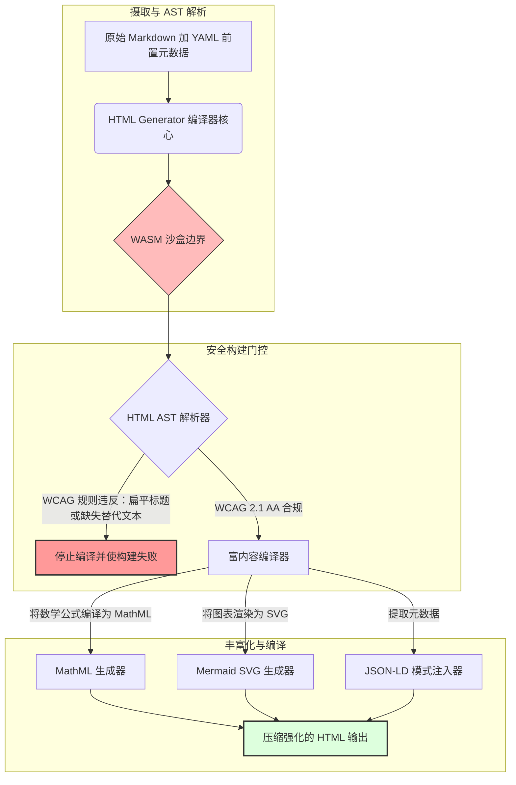

---

# Front Matter (YAML)

author: "contact@sebastienrousseau.com (Sebastien Rousseau)"
banner_alt: "结构化光线下的建筑几何造型——象征 HTML Generator 作为可访问、SEO 就绪、沙盒化发布基础设施的编译门控 Markdown 转 HTML 管道所扮演的角色"
banner_height: "1597"
banner_width: "2584"
banner: "https://cloudcdn.pro/stocks/images/markus-winkler-IrRbSND5EUc-unsplash-1200.webp"
cdn: "https://cloudcdn.pro"
charset: "UTF-8"
cname: "sebastienrousseau.com"
copyright: "© Copyright 2025 - 2026 - Sebastien Rousseau. All rights reserved."
date: "June 20, 2026"
description: "HTML Generator 是一个纯 Rust Markdown 转 HTML 编译器，在构建时强制执行 WCAG 合规性，注入符合 Schema.org 的 JSON-LD，原生渲染 MathML 和 Mermaid SVG，并在 WebAssembly 沙盒中隔离解析——将企业发布转变为可访问性、SEO 与 ICT 安全的编译门控管理平面。"
format-detection: "telephone=no"
hreflang: "zh-hans"
icon: "https://cloudcdn.pro/clients/sebastienrousseau/v1/logos/sebastienrousseau.svg"
id: "https://sebastienrousseau.com/2026-06-20-html-generator-accessible-seo-structured-markdown-rust-2026"
image_alt: "Sebastien Rousseau 的黑白肖像"
image_height: "162"
image_width: "162"
image: "https://cloudcdn.pro/stocks/images/sebastienrousseau.webp"
keywords: "html-generator, Rust Markdown 转 HTML, 可访问性即代码, WCAG 2.1 AA, SEO 就绪 HTML, JSON-LD, MathML, Mermaid, WebAssembly, EAA, DORA, ADA Title III, 无障碍发布, 沙盒解析, 开源"
language: "zh-Hans"
last_reviewed: "2026-06-20"
layout: "report"
locale: "zh_CN"
logo_alt: "Sebastien Rousseau 的标志"
logo_height: "44"
logo_width: "44"
logo: "https://cloudcdn.pro/clients/sebastienrousseau/v1/logos/sebastienrousseau.svg"
menu: ""
measurementID: "G-169G4ET5HQ"
name: "Sebastien Rousseau"
permalink: "https://sebastienrousseau.com/2026-06-20-html-generator-accessible-seo-structured-markdown-rust-2026"
rating: "general"
referrer: "no-referrer"
robots: "index, follow"
schema: "FAQPage, Article"
seo_title: "可访问性即代码：2026 年用 Rust 将 Markdown 转为 AAA 级 HTML"
short_name: "sebastienrousseau"
subtitle: "将企业网络发布、产品文档与客户门户从不可访问的文本文件，转变为高度结构化、合规且沙盒化的数字资产。"
tags: "html-generator, Rust, Markdown, 可访问性, WCAG, SEO, JSON-LD, MathML, Mermaid, WebAssembly, EAA, DORA, ADA, AI 发现, RAG, 开源, 银行基础设施"
theme-color: "0, 83, 191"
title: "2026 年：用 Rust 将 Markdown 转为可访问、SEO 就绪的结构化 HTML"
url: "https://sebastienrousseau.com/2026-06-20-html-generator-accessible-seo-structured-markdown-rust-2026"
viewport: "width=device-width, initial-scale=1, shrink-to-fit=no"

# RSS - The RSS feed front matter (YAML).
atom_link: "https://sebastienrousseau.com/2026-06-20-html-generator-accessible-seo-structured-markdown-rust-2026/rss.xml"
category: "Technology"
docs: https://validator.w3.org/feed/docs/rss2.html
generator: "Static Site Generator (SSG) (version 0.0.40)"
item_description: "HTML Generator 是一个纯 Rust Markdown 转 HTML 编译器，在构建时强制执行 WCAG 合规性，注入符合 Schema.org 的 JSON-LD，原生渲染 MathML 和 Mermaid SVG，并在 WebAssembly 沙盒中隔离解析——将企业发布转变为可访问性、SEO 与 ICT 安全的编译门控管理平面。"
item_guid: "https://sebastienrousseau.com/2026-06-20-html-generator-accessible-seo-structured-markdown-rust-2026/rss.xml"
item_link: "https://sebastienrousseau.com/2026-06-20-html-generator-accessible-seo-structured-markdown-rust-2026/rss.xml"
item_pub_date: "Sat, 20 Jun 2026 06:06:06 +0000"
item_title: "2026 年：用 Rust 将 Markdown 转为可访问、SEO 就绪的结构化 HTML"
last_build_date: "Sat, 20 Jun 2026 06:06:06 +0000"
managing_editor: "contact@sebastienrousseau.com (Sebastien Rousseau)"
pub_date: "Sat, 20 Jun 2026 06:06:06 +0000"
ttl: "60"
type: "article"
webmaster: "contact@sebastienrousseau.com"

# Apple - The Apple front matter (YAML).
apple_mobile_web_app_orientations: "portrait"
apple_touch_icon_sizes: "192x192"
apple-mobile-web-app-capable: "yes"
apple-mobile-web-app-status-bar-inset: "black"
apple-mobile-web-app-status-bar-style: "black-translucent"
apple-mobile-web-app-title: "用 Rust 将 Markdown 转为 AAA 级 HTML"
apple-touch-fullscreen: "yes"

# MS Application - The MS Application front matter (YAML).

msapplication-navbutton-color: "0, 83, 191"

# Twitter Card - The Twitter Card front matter (YAML).

twitter_card: "summary_large_image"
twitter_creator: "@wwdseb"
twitter_description: "HTML Generator 是一个纯 Rust Markdown 转 HTML 编译器，在构建时强制执行 WCAG 合规性，注入 JSON-LD，原生渲染 MathML 和 Mermaid SVG，并在 WebAssembly 沙盒中隔离解析——企业级安全发布基础设施。"
twitter_image: "https://cloudcdn.pro/clients/sebastienrousseau/v1/logos/sebastienrousseau.svg"
twitter_image_alt: "Sebastien Rousseau 的标志"
twitter_site: "@wwdseb"
twitter_title: "可访问性即代码：用 Rust 将 Markdown 转为 AAA 级 HTML"
twitter_url: "https://sebastienrousseau.com/2026-06-20-html-generator-accessible-seo-structured-markdown-rust-2026"

# Humans.txt - The Humans.txt front matter (YAML).
author_website: "https://sebastienrousseau.com"
author_twitter: "@wwdseb"
author_location: "London, UK"
thanks: "感谢阅读！"
site_last_updated: "2026-06-20"
site_standards: "HTML5, CSS3, RSS, Atom, JSON, XML, YAML, Markdown, TOML"
site_components: "Kaishi, Kaishi Builder, Kaishi CLI, Kaishi Templates, Kaishi Themes"
site_software: "Static Site Generator, Rust"

---

# 2026 年：用 Rust 将 Markdown 转为可访问、SEO 就绪的结构化 HTML

<!-- lead-start -->
<aside class="post-lead" aria-label="文章摘要">

<strong>TL;DR。</strong> HTML Generator 是一个纯 Rust Markdown 转 HTML 编译器，在构建时强制执行 WCAG 2.1 AA 合规性，注入符合 Schema.org 规范的 JSON-LD，原生渲染 MathML 和 Mermaid SVG，并在 WebAssembly 沙盒内隔离解析——将发布工作转变为可访问性、SEO 与 ICT 安全的编译门控管理平面。

<strong>核心要点</strong>

<ul class="post-lead-takeaways">
  <li><strong>一句话解答。</strong> HTML Generator 是什么？</li>
  <li><strong>执行摘要。</strong> Markdown 渲染看似简单；生产级 HTML 本质上是一个合规问题。</li>
  <li><strong>01. 2026 年可访问性优先 HTML 编译器为何至关重要。</strong> EAA 和 ADA Title III 已将可访问性从工程卫生要求升级为受托责任。</li>
  <li><strong>02. HTML Generator 2026 年架构视角。</strong> 从原始 Markdown 到强化 HTML 输出的多阶段编译门控管道。</li>
</ul>

<strong>相关阅读：</strong> <a href="https://sebastienrousseau.com/2026-06-18-noyalib-safe-yaml-rust-ai-mcp-financial-infrastructure-2026">2026 年 AI、MCP 与金融基础设施为何需要更安全的 Rust YAML 栈</a>，2026 年 AI 时代发布的安全默认 Static Site Generator，<a href="https://sebastienrousseau.com/2026-06-11-cloudcdn-open-source-blueprint-ai-native-edge-2026">CloudCDN：2026 年云原生边缘的开源蓝图</a>。

</aside>
<!-- lead-end -->

2026 年，网络内容被 AI 搜索爬虫、LLM 驱动的搜索引擎和检索增强生成（RAG）管道消费的频率与人类读者不相上下。扁平或格式错误的 HTML 会干扰机器解析，使企业研究和文档在现代搜索范式中不可见——包括 [Google Search Generative Experience](https://blog.google/products/search/generative-ai-search/)、[ChatGPT](https://chat.openai.com/) 浏览以及企业 RAG 智能体。与此同时，未能遵守 [《欧洲无障碍法案》（EAA）](https://www.accessibility-act.eu/) 和 [美国 ADA Title III](https://www.ada.gov/topics/title-iii/) 等严格全球法规，现已构成明确的民事责任。[HTML Generator](https://github.com/sebastienrousseau/html-generator) 是一个高性能 Rust 库，专为在编译器层面弥合这两类差距而设计——而非依赖部署后补丁。

## 一句话解答

**HTML Generator 是什么？** HTML Generator 是一个开源纯 Rust Markdown 转 HTML 编译器，在构建时强制执行 [WCAG 2.1 AA](https://www.w3.org/TR/WCAG21/)，自动生成语义地标和 ARIA 属性，从 YAML 前置元数据注入符合 Schema.org 规范的 [JSON-LD](https://json-ld.org/) 元数据，将 Mermaid 图表和数学公式渲染为可访问的 SVG 和 MathML，并在 [WebAssembly](https://webassembly.org/) 沙盒内运行——将企业发布转变为编译门控、受托级管理平面。

## 执行摘要

Markdown 渲染看似简单。生产级 HTML 是一个合规问题。2026 年 6 月，每个企业触点——投资者关系门户、监管文件、客户文档、API 参考、营销资产——都由人类和机器共同解析。每个页面都面临两重压力：[EAA](https://www.accessibility-act.eu/) 和 [ADA Title III](https://www.ada.gov/topics/title-iii/) 使可访问性成为董事会级法律风险，而 AI 摄取和 RAG 管道则青睐结构化、机器可读的输出。标准 Markdown 库生成扁平 HTML，两项标准均无法通过。HTML Generator 将文档生成视为编译门控管道：WCAG 验证是构建错误，JSON-LD 从 YAML 前置元数据自动注入无需手动标注，MathML 和 Mermaid 以可访问方式渲染，整个引擎支持 WebAssembly 目标，使不可信文档的解析与宿主环境完全隔离。

## 核心要点

- **可访问性即代码是新基线。** EAA 对消费者数字服务强制规定可访问性。HTML Generator 在编译时评估文档树，自动生成语义地标和 ARIA 属性——减少部署后修复，降低修复预算，防止缺失替代文本流入生产环境。
- **结构化数据助力 AI 发现。** 现代搜索和 RAG 依赖机器可读元数据。编译器解析 YAML 前置元数据，将 [符合 Schema.org 规范的 JSON-LD](https://schema.org/) 直接注入文档头部，使内容完全可被 [Google Rich Results](https://developers.google.com/search/docs/appearance/structured-data/intro-structured-data)、[Bing Webmaster](https://www.bing.com/webmasters) 和 LLM 驱动爬虫解读。
- **技术内容卓越输出。** 技术发布不是纯文本。HTML Generator 将原始 Markdown 数学扩展编译为可访问的 [MathML](https://www.w3.org/Math/)，并将 [Mermaid.js](https://mermaid.js.org/) 图表渲染为响应式 SVG——两者均保留符合 WCAG 的结构，而非降级为不透明图片。
- **WebAssembly 沙盒隔离。** 解析不可信 Markdown 是安全风险。通过支持 [WASM](https://webassembly.org/) 目标，HTML Generator 在与宿主服务器隔离的沙盒内执行，防止任意代码执行并保护宿主系统——直接满足 [DORA Article 6](https://eur-lex.europa.eu/legal-content/EN/TXT/?uri=CELEX%3A32022R2554) ICT 安全义务。
- **为董事会提供受托保护。** 技术违规已进入董事会议程。采用编译门控 HTML 引擎作为标准，使董事和高级管理层免于承担 DORA、EAA 和 ADA Title III 下的个人民事及监管责任。

**相关阅读：** [2026 年 AI、MCP 与金融基础设施为何需要更安全的 Rust YAML 栈](https://sebastienrousseau.com/2026-06-18-noyalib-safe-yaml-rust-ai-mcp-financial-infrastructure-2026/)，2026 年 AI 时代发布的安全默认 Static Site Generator，[CloudCDN：2026 年云原生边缘的开源蓝图](https://sebastienrousseau.com/2026-06-11-cloudcdn-open-source-blueprint-ai-native-edge-2026/)。

## 01. 2026 年可访问性优先 HTML 编译器为何至关重要

企业网络资产、文档库和产品帮助中心是关键数字触点，当前正承受两股强烈且相互交织的压力。

第一是 **AI 摄取与可发现性**。内容正越来越多地由大语言模型和检索增强生成管道处理。扁平或格式错误的 HTML 会干扰爬虫解析，使企业研究和文档在现代搜索范式中不可见——包括 [Google Search Generative Experience](https://blog.google/products/search/generative-ai-search/)、[ChatGPT](https://chat.openai.com/) 浏览以及企业 RAG 智能体。

第二是 **严格的全球可访问性法规**。根据 [《欧洲无障碍法案》](https://www.accessibility-act.eu/)（自 2025 年 6 月起全面适用）和 [美国 ADA Title III](https://www.ada.gov/topics/title-iii/)，企业发布平台必须保证完整的数字可访问性。未能满足 [WCAG 2.1 AA](https://www.w3.org/TR/WCAG21/) 不再是工程疏失，而是已产生数百万美元和解赔偿的民事和监管责任。

[HTML Generator](https://github.com/sebastienrousseau/html-generator) 直接应对这两重压力。它是一个线程安全的 Rust 库，专为将 Markdown 转换为可访问、SEO 就绪的结构化 HTML 而设计。通过将文档生成视为编译门控管道，该引擎提供高 **韧性回报（RoR）**——保护资产负债表免受可访问性诉讼冲击，同时最大化 AI 发现的机器可读性。

## 02. HTML Generator 2026 年架构视角

该框架被设计为安全的多阶段编译管道，将原始 Markdown 文本转换为经过验证、高度可访问的静态资产。

### 表 1：HTML Generator 架构层次与风险缓解

| 层次 | 设计决策 | 重要性 | 处理不当的风险 |
| ---- | ---- | ---- | ---- |
| **输入层** | Markdown 加 YAML 前置元数据解析器 | 在作者熟悉的环境中工作；将正文与结构元数据分离。 | 元数据不一致、站点地图损坏、索引缺失。 |
| **结构层** | 自动生成目录及带 ARIA 标签的语义地标 | 通过构建产生可导航、可访问的文档树。 | 扁平 HTML 破坏屏幕阅读器并违反 WCAG。 |
| **富内容层** | 原生 MathML 和 Mermaid.js SVG 渲染 | 将公式和图表编译为可访问的 SVG 和 MathML。 | 客户端 JS 渲染延迟及辅助技术输出损坏。 |
| **SEO 与数据层** | 集成 JSON-LD 和结构化元数据生成 | 将符合 [Schema.org](https://schema.org/) 规范的 JSON-LD 直接注入文档头部。 | 搜索引擎和 AI 爬虫误读作者、上下文、许可信息。 |
| **运行时层** | 原生 Rust 编译器加 WebAssembly 目标 | 在服务器、边缘节点和浏览器上实现安全沙盒执行。 | 解析不可信 Markdown 时发生任意代码执行。 |

## 03. 关键网络安全与可访问性信号

为验证面向公众的发布资产满足现代监管和安全审计要求，高级技术管理人员必须监控特定、可量化的指标。

### 表 2：网络安全与可访问性信号

| 信号 | 指标/运营基准 | EAA / DORA / W3C 参考 | 技术实现 |
| ---- | ---- | ---- | ---- |
| **可访问性合规** | 100% 已编译页面经 WCAG 2.1 AA 规则验证。 | [EAA](https://www.accessibility-act.eu/) 和 [ADA Title III](https://www.ada.gov/topics/title-iii/) | 构建时 HTML 解析器评估图片替代文本和语义地标。 |
| **WASM 执行沙盒** | 100% 不可信 Markdown 输入在隔离 WebAssembly 运行时中编译。 | [DORA Article 6](https://eur-lex.europa.eu/legal-content/EN/TXT/?uri=CELEX%3A32022R2554)（ICT 安全） | 解析环境与宿主服务器的隔离。 |
| **结构化元数据覆盖** | 100% 已发布文章注入有效、符合 Schema.org 规范的 JSON-LD 头部。 | [Schema.org](https://schema.org/) 规范 | 自动解析前置元数据并转换为 JSON-LD 对象。 |
| **编译吞吐量** | 在商用硬件上每秒页面数目标超过 10,000。 | 韧性回报（RoR） | 高度并行化的 Rust AST 编译器。 |
| **富文本摘要验证** | [Google Rich Results](https://search.google.com/test/rich-results) 和 [Schema validator](https://validator.schema.org/) 运行零解析错误。 | Google 搜索指南 | 构建管道中生成的 JSON-LD 结构验证。 |

## 04. 简单 Markdown 渲染的误区

技术管理者中存在一种常见误解，认为 Markdown 转 HTML 只是简单的文本替换操作。许多标准库将 Markdown 格式转换为扁平、无结构的 HTML。输出在浏览器中对有视力的读者显示正常，但这实际上是一个合规陷阱。

扁平 HTML 通常缺少三项内容。

1. **正确的标题层次结构。** 标准 Markdown 不强制规定标题顺序。从 `<h1>` 跳转到 `<h4>` 违反 WCAG 2.1 AA，并破坏屏幕阅读器的文档导航。
2. **明确的表格语义。** 标准 Markdown 表格很少以可访问解析所需的正确 `<th>` 范围和 `<tbody>` 属性渲染。
3. **机器可读元数据。** 标准 HTML 缺少现代 AI 搜索平台和 RAG 摄取系统所依赖的 JSON-LD 钩子。

HTML Generator 通过将 Markdown 解析为**抽象语法树（AST）** 解决这一问题。引擎在输出 HTML 之前评估文档结构，验证标题嵌套，注入适当的 ARIA 属性，并断言每个媒体资产都携带替代文本——将可访问性从手动审计转变为编译时保证的不变量。

## 05. 设计可访问性即代码的构建管道

为防止不可访问或未被索引的资产进入公开部署，可访问性必须是严格的编译器门控。以下管道展示 HTML Generator 如何评估 Markdown、运行 WebAssembly 隔离验证并输出强化的结构化 HTML。

## 06. 董事会应对手册与受托责任

现代可访问性和网络安全合规是不可回避的董事会议题。高级管理层必须从法律风险、财务保护和监管暴露的视角审视发布基础设施。

- **《欧洲无障碍法案》（EAA）。** 对公共和私有数字门户施加直接的法律约束合规义务。违规可导致严重财务罚款、民事诉讼，以及立即将相关资产撤出欧盟市场。通过集成可访问性即代码，董事会可以证明不合规代码无法进入生产环境——将被动补救转变为结构性法律防线。
- **DORA Article 6（安全 ICT 环境）。** 为 ICT 环境安全建立严格规则。通过在 WebAssembly 沙盒内隔离 Markdown 编译，机构确保解析客户上传文档或合作伙伴数据源时不会将宿主服务器暴露于任意代码执行风险，保护关键银行门户。
- **降低合规审计成本。** 传统可访问性合规依赖昂贵的事后部署审计——每个站点每年数万美元。将 WCAG 验证实施为编译时阻断，消除这些追溯成本，将合规预算从防御转向创新。

## 07. 不同银行/企业类型的影响

### 全球系统重要性银行（G-SIBs）

G-SIBs 运营着庞大的多语言公共资产，在多个司法管辖区发布数千份研究报告、监管披露和投资者关系文件。其挑战在于规模和多语言一致性。HTML Generator 的 WebAssembly 目标和高吞吐量 Rust 引擎，使大规模本地化研究库能够在数秒内完成全球更新、编译和部署——无渲染延迟，无可访问性回归。

### 交易银行与企业银行

对交易银行而言，客户门户、文档中心和开发者 API 指南是关键数字触点。通过 HTML Generator 编译这些资产，面向客户的渠道不携带 XSS 暴露、无依赖劫持向量、无可访问性缺陷——维护机构信任并缩减诉讼敞口。

### 区域银行与金融科技公司

区域银行和敏捷金融科技公司在没有 G-SIB 工程预算的情况下竞争数字体验。HTML Generator 为这些团队提供开箱即用的企业级发布管道，使规模较小的资产能够交付可访问、SEO 就绪、沙盒化的内容，经得起监管机构和潜在企业客户的双重审视。

## 08. 发布基础设施路线图

企业面向公众的网络资产是运营韧性的核心组成部分。依赖缓慢、动态漏洞驱动、数据库支撑的网络引擎——或未签名的静态资产——是不可接受的业务风险。

为保护公共数字触点并保护资产负债表免受可访问性诉讼，高级技术和安全管理人员应执行清晰的路线图。

1. **向静态架构迁移。** 逐步淘汰研究、营销和文档资产的遗留动态 CMS 平台。将内容迁移到 HTML Generator 等编译门控管道。
2. **在构建时强制可访问性。** 实施可访问性即代码。在任何 WCAG 2.1 AA 违规上自动使编译管道失败。
3. **在 WebAssembly 中隔离解析。** 在 WASM 运行时内沙盒化所有文档和内容解析，确保不可信输入永不接触宿主系统。
4. **注入丰富的 JSON-LD 元数据。** 确保每个已发布资产携带符合 Schema.org 规范的 JSON-LD 头部，以最大化 AI 可发现性。

## 09. 常见问题解答

**HTML Generator 如何强制执行可访问性？**

它在构建时解析生成的 HTML 抽象语法树（AST），根据 [WCAG 2.1 AA](https://www.w3.org/TR/WCAG21/) 规则评估文档。如果规则被违反——缺失替代属性、标题跳级、未标记表单控件——编译器停止构建，将可访问性视为编译时不变量而非部署后审计任务。

**WebAssembly 隔离为何重要？**

[WebAssembly](https://webassembly.org/) 允许 Markdown 解析引擎在与宿主服务器隔离的沙盒内执行。即便恶意行为者上传专为利用解析器漏洞设计的 Markdown 文档，执行也被限制在沙盒内——保护宿主系统并满足 DORA Article 6 ICT 安全义务。

**JSON-LD 如何提升 2026 年的搜索可发现性？**

[JSON-LD](https://json-ld.org/) 在文档头部提供结构化、机器可读的元数据。[Google Rich Results](https://developers.google.com/search/docs/appearance/structured-data/intro-structured-data)、Bing 爬虫和 LLM 驱动搜索智能体立即识别作者、许可、发布日期和语义上下文——绕过标准 HTML 的歧义，扩大 AI 驱动发现的曝光面。

**HTML Generator 的目标用户是谁？**

静态站点构建者、文档团队、技术写作人员、Rust 开发者，以及交付可访问性关键或面向监管机构资产的平台工程师。它也是大型安全发布管道（如 [Static Site Generator (SSG)](https://github.com/sebastienrousseau/static-site-generator)）内可行的内容处理层。

## 10. 参考资料

- World Wide Web Consortium (W3C), 2024. [Web Content Accessibility Guidelines (WCAG) 2.1 ⧉](https://www.w3.org/TR/WCAG21/ "网页内容无障碍指南 2.1").
- Schema.org, 2026. [Schema.org 结构化数据规范 ⧉](https://schema.org/ "Schema.org 结构化数据规范").
- European Parliament and Council of the European Union, 2022. [Regulation (EU) 2022/2554 on digital operational resilience for the financial sector (DORA) ⧉](https://eur-lex.europa.eu/legal-content/EN/TXT/?uri=CELEX%3A32022R2554 "DORA 法规").
- European Commission, 2025. [European Accessibility Act ⧉](https://www.accessibility-act.eu/ "欧洲无障碍法案").
- US Department of Justice, 2024. [ADA Title III ⧉](https://www.ada.gov/topics/title-iii/ "ADA Title III").
- WebAssembly Community Group, 2026. [WebAssembly specification ⧉](https://webassembly.org/ "WebAssembly").
- GitHub, 2026. [HTML Generator repository ⧉](https://github.com/sebastienrousseau/html-generator "HTML Generator 开源仓库").

<!-- enrich-start -->
<aside class="author-card" aria-label="关于作者"><strong class="author-card-name"><a href="/about/index.html">Sebastien Rousseau</a></strong>资深银行技术专家，专注于应用 AI、支付基础设施、代币化货币、ISO 20022、后量子安全、云原生金融服务、开源基础设施与受监管数字市场的研究与写作。逾 20 年跨 HSBC 商业与投资银行、PayPal、Barclays、Shazam、AKQA、Virgin Group 从业经验。<a href="/about/index.html">完整简介</a> &middot; <a href="https://www.linkedin.com/in/sebastienrousseau/" rel="external noopener">LinkedIn</a> &middot; <a href="https://github.com/sebastienrousseau" rel="external noopener">GitHub</a></aside>

最后审阅时间 <time datetime="2026-06-20">2026-06-20</time>。

<!-- enrich-end -->
