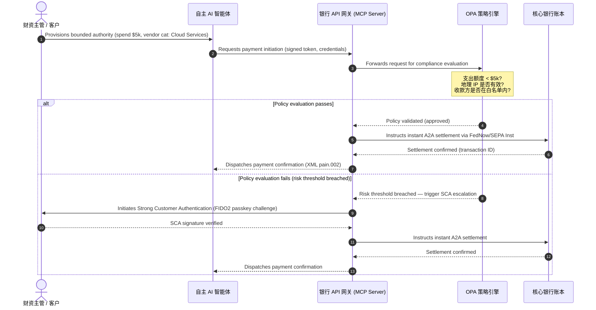

# 2026 全球支付展望:智能体化、隐形化、实时化世界中的运营模型、风险与收入

2026 年全球支付周期由三股汇聚的力量定义——智能体商务、隐形嵌入式支付与实时执行——其底层是 Project Agorá 下的通证化统一账本,以及 2026 年 11 月硬性截止的 SWIFT 结构化地址切换。

<!-- lead-start -->
<aside class="post-lead" aria-label="文章摘要">

<strong>摘要。</strong>2026 年支付格局已从报文迁移走向多维度运营模型,风险与收入由实时执行决定。本文将 J.P. Morgan、Global Payments、HSBC 与 Payments Association 的 2026 年展望整合为四支柱 G-SIB 运营方案,涵盖模型发起的智能体商务、全时财资 API、BIS Project Agorá 下的通证化统一账本,以及 2026 年 11 月 14/15 日 SWIFT 结构化地址截止期。Swift CBPR+ 自 2026 年 11 月 14 日起移除非结构化 `<AdrLine>` 块;EPC SEPA 规则手册仅允许非结构化地址至 2026 年 11 月 15 日。

<strong>核心结论</strong>

<ul class="post-lead-takeaways">
  <li><strong>智能体商务开启受限授权下的责任新前沿。</strong>预计到 2030 年,自主 AI 智能体将中介每年 3 万亿至 5 万亿美元的商务交易。银行必须明确 MCP 的守门机制、PSD3/PSR 下的 SCA 授权委托,以及多智能体支付链中 KYC/AML 的归属。</li>
  <li><strong>全时流动性已成为运营与监管基线。</strong>24/7 财资 API 与虚拟账户最大限度减少滞留资金并抬高韧性门槛。对于系统性重要的实时财资 API,五个九(99.999 %)可用性正成为银行为向监管机构展示 DORA 级韧性而设定的内部工程目标。DORA 本身并未规定统一的五个九门槛;它涵盖 ICT 风险管理、事件报告、韧性测试、第三方风险以及关键 ICT 提供商的监督。</li>
  <li><strong>通证化已晋升为受监管的统一账本。</strong>Project Agorá 是面向通证化商业银行存款与央行储备的最大公私协作框架。银行需要一条清晰的五步通证化路径,并具备明确的审慎处置安排。</li>
  <li><strong>2026 年 11 月 14/15 日的结构化地址切换是硬性截止日期。</strong>Swift CBPR+ 自 2026 年 11 月 14 日起移除非结构化 `<AdrLine>` 块;EPC SEPA 规则手册仅允许非结构化地址至 2026 年 11 月 15 日。CBPR+ 与 SEPA 报文中的非结构化邮政地址字段将触发即时拒付。需要在产品、技术与合规团队之间建立清洁的数据治理。</li>
</ul>

<strong>延伸阅读:</strong><a href="https://sebastienrousseau.com/2026-06-23-iso-20022-pain001-programmable-liquidity-autonomic-treasury-2026">From Pain.001 to Programmable Liquidity: ISO 20022 as the Autonomic Nervous System of Treasury in 2026</a>、<a href="https://sebastienrousseau.com/2026-06-24-cross-border-iso-20022-open-finance-tokenised-deposits-treasury-2026">Cross-Border 2026: ISO 20022, Open Finance and Tokenised Deposits in Corporate Treasury</a>、<a href="https://sebastienrousseau.com/2026-06-25-quantum-dawn-cib-kyberlib-quantum-resilient-payments-stack-2026">Quantum Dawn for CIB: From KyberLib to a Quantum-Resilient Payments Stack</a>。

</aside>
<!-- lead-end -->

对全球交易银行而言,2026–2028 周期是一个结构性窗口。现代支付基础设施不再是行政性公用工具,而是银行级技术战略的核心。在 G-SIB 与主要区域性机构内部,技术、监管与客户预期已汇聚到同一运营平面。

定义本周期的三股力量,每一股都直接对应一项高管议题。

- **智能体商务**——在监管审视下的渠道分发、产品设计、责任划分与模型风险管理。
- **隐形支付**——客户体验层面,若银行未能将自身账本嵌入企业与商户前端,将面临中介脱媒风险。
- **实时执行**——资本周转速度,并由此带动流动性管理、信用风险、运营韧性与欺诈防御的相应变化。

财务影响是实质性的。欺诈在速度与精细度上同步扩张;监管截止日期是硬性的;主动现代化核心系统的银行可释放可观的手续费收入机会。不作为的代价相反:即时交易被拒、运营瓶颈、监管处罚以及市场份额的快速侵蚀。

## 确定性阶梯 — 哪些已定档、哪些已监管、哪些仍是预测

本报告各条目并非具备同等确定性。董事会层面的关键问题是:哪些差距属于截止日期、哪些属于监管期望、哪些仍只是市场预测——因为答案直接决定预算对话的走向。

| 类别 | 示例 |
| --- | --- |
| **硬性截止日期** | Swift CBPR+ 结构化地址切换(2026 年 11 月 14 日);EPC SEPA 规则手册(2026 年 11 月 15 日) |
| **监管义务** | DORA 的 ICT 风险 + 韧性测试 + 第三方监督(欧盟);PSD3/PSR 下的 SCA 授权委托;SR 11-7 与 PRA SS1/23 下的 MRM |
| **高概率市场变化** | 实时财资 API、AI 主导的欺诈防御、基于 API 的流动性、深度伪造驱动的生物识别欺诈 |
| **战略期权** | 通证化存款、Project Agorá 下的统一账本、智能体商务通路、持续 FX(Wire 365) |
| **预测** | 到 2030 年智能体商务年度交易流约 `$3-$5 trillion`(McKinsey 基线) |

将前两行视为合规事实,无论银行是否捕捉到任何上行空间,都会驱动一条预算线。后两行视为战略期权——方向上具备高确信度,但执行时点由董事会选择,而非监管机构的日历安排。

## 全球支付权威机构的观点汇聚

本报告综合四家权威行业声音的 2026 年支付与商务展望——[J.P. Morgan Payments](https://www.jpmorgan.com/payments/newsroom/payments-outlook-2026-trends-report-released "J.P. Morgan Payments — Outlook 2026")、[Global Payments](https://investors.globalpayments.com/news-events/press-releases/detail/497/global-payments-releases-its-2026-commerce-and-payment "Global Payments — 2026 Commerce and Payment Trends Report")、HSBC 与 The Payments Association——并将其与 [G20 跨境支付增强路线图](https://www.fsb.org/2026/03/fsb-kicks-off-new-implementation-phase-to-enhance-cross-border-payments-through-public-private-partnership/ "FSB — cross-border payments implementation phase, March 2026") 进行三角校验。

各机构从不同的市场视角观察生态,但其结论在三项不变量上保持一致。

1. **即时、API 驱动的通道已是基线。**遗留批处理模式在跨境与高额流量中被边缘化;这些细分的交易速度由全时、实时报文决定。
2. **AI 既是威胁也是防御。**生成式工具与深度伪造使交易欺诈规模化,必须以实时、多层次的机器学习反制措施加以应对。
3. **通证化已是可投产基础设施。**账本正在统一,以承载通证化的商业负债与批发型央行数字货币。

| 报告 | 主要受众 | 关注重点 | 关键支柱 | 银行启示 |
| --- | --- | --- | --- | --- |
| **J.P. Morgan Payments** | Corporate treasurers, G-SIBs | Real-time liquidity, fraud | APIs, AI biometrics | Rebuild liquidity, FX, and risk systems for continuous 365-day settlement. |
| **Global Payments** | Merchants, e-commerce | POS evolution, omnichannel | Agentic commerce, frictionless checkout | Build secure, API-gated merchant payment corridors for autonomous AI agents. |
| **HSBC Insights** | Multinational corporates | ERP integrations (SAP/Oracle), real-time cash | Treasury-as-a-Service, cash visibility | Monetise transactional API suites and embed real-time cash ledger reporting at source. |
| **The Payments Association** | Fintechs, payment institutions | Stablecoins, tokenisation, global regulation | Regulated digital assets, policy compliance | Prepare balance sheets for tokenised deposits and navigate PSD3/PSR liability structures. |

这四份展望共同界定了运行在公共部门 G20 政策基础设施之上的私营部门运营栈,把政策意图转译为银行内部关于流动性、通证化、数据与欺诈控制的具体决策。

## 支柱一——智能体商务与隐形支付

智能体商务是从人驱动的点击购买结账过渡到自主、模型驱动的交易发起。行业预测一致指向到 2030 年,自主智能体中介每年 3 万亿至 5 万亿美元的商务交易——相当于全球支付额中由无需人工点击"购买"完成的低个位数百分比。

零售与商业生态存在对应的缺口。明显多数的消费者如今期望近乎无摩擦的支付,但仅不到半数商户优先建设了一键结账或可通过 API 访问的商品目录。AI 智能体无法浏览面向人眼设计的传统多页结账界面;它们需要结构化的机器对机器 API 握手。

### 银行优先级与运营影响

- **KYC 与 AML 归属。**银行必须界定智能体交易链中合规义务的承担方。如果消费者的个人 AI 智能体通过商户的智能体结账发起交易,银行必须验证发起方的委托授权与主账户持有人之间存在加密绑定。
- **责任与拒付重构。**卡组织方案与 A2A 通道原本围绕人工授权设计。当 AI 智能体因数据解析错误等原因发起错误采购——例如错配工业库存——银行必须在消费者、智能体提供方与商户之间清晰分配责任。
- **智能体流的风险评级。**支付路由引擎必须对智能体支付进行动态风险评级,在形成稳定结算记录之前,对非人工发起的交易适用更高的准备金要求或交换费率。

### 受限行为与受限授权

为缓释"无界行为"——例如企业采购智能体因软件故障陷入无限递归采购循环——银行必须部署 **受限授权 API 关口**。关口在三个维度上落实策略级限额。

1. **分层财务限额**——按交易金额、每日累计额及商户类别限制智能体支出。
2. **情境感知保护**——在账本释放资金前评估二级信号(时段、IP 地理位置、交易频率)。
3. **人介入升级**——当交易超过风险阈值时,通过 PSD3 / PSR 下的强客户认证(SCA)强制触发人工授权。

下方的 mermaid 序列图展示了多数银行将熟悉的受限授权智能体支付目标架构。

### Model Context Protocol (MCP)

为将本地化 AI 模型连接到银行治理下的执行层,行业正在围绕 [Model Context Protocol (MCP)](https://modelcontextprotocol.io "Model Context Protocol — open standard for LLM tool integration") 形成标准——一种开放协议,允许 LLM 调用边界清晰、可审计的工具与 API,而无需对核心系统的原始访问。

将银行 API(付款发起、余额查询、当事方核验)封装在 MCP 服务器之内,可使 LLM 远离数据库表与系统级控制。模型只能通过结构化、受审计、限流的端点与账本交互——安全在智能体工具执行的边界实施,而非隐藏在模型内部。

## 支柱二——财资转型与流动性再思考

2026 年交易银行的速度由从日终批处理向全时实时财资运营的转变决定。跨国企业不再容忍滞留资金——因结算系统关闭而周末或假日闲置在本地账户中的流动性。

### 实时流动性的经济性论证

J.P. Morgan 与 HSBC 均报告,具备先进实时现金与数据能力的企业在收入增长与资本效率方面显著优于同业,主要来自于减少滞留流动性与优化营运资本周期。

为捕捉这一价值,银行推出 **Treasury-as-a-Service(TaaS)API 产品**,让企业 ERP(SAP、Oracle)直接接入银行账本。

- **实时余额 API**——采用 `camt.052` 模式——以即时、事件驱动的现金头寸报送取代文件传输协议。
- **批量付款发起 API**——采用 `pain.001`——直接从 ERP 账本贯通执行供应商付款批次。
- **持续 FX API**——财资引擎为跨境结算锁定实时、算法化的外汇汇率,消除隔夜市场缺口风险。
- **虚拟账户 API**——企业可动态开通与撤销成千上万的子账户,用于自动化应收对账与账本隔离。

### 运营韧性与 DORA

提供全时流动性会改变银行的风险画像。对于系统性重要的实时财资 API,五个九(99.999 %)可用性正成为银行为向监管机构展示 DORA 级韧性而设定的内部工程目标。DORA 本身并未规定统一的五个九门槛;它涵盖 ICT 风险管理、事件报告、韧性测试、第三方风险以及关键 ICT 提供商的监督。

在 [Digital Operational Resilience Act (DORA)](https://eur-lex.europa.eu/legal-content/EN/TXT/?uri=CELEX%3A32022R2554 "Regulation (EU) 2022/2554 — Digital Operational Resilience Act") 下,这并非 IT KPI,而是严格的监管要求。监管期望银行证明实时财资 API 接口与账本数据库能够吸纳"严重但可置信"的网络攻击、网络中断与超大规模云服务商扰动,同时不中断关键支付或损害系统性流动性。这需要地理冗余的双活多云数据库架构、实时威胁检测层与自动化故障切换——这些反映在变更成本科目上,而不仅仅是审计档案里。

### 持续 FX 与跨境创新

实时财资无法生存于单一货币边界之内。G-SIB 正在部署持续 FX 基础设施——J.P. Morgan 的 [Wire 365](https://www.jpmorgan.com/insights/payments/fx-cross-border/wire-365-global-clearing "J.P. Morgan — Wire 365 global clearing reinvented") 平台在一年中的任意一天处理跨境付款与 FX 转换,超出传统央行 RTGS 时段。该层与支柱三讨论的通证化存款与统一账本系统直接互锁。

## 支柱三——通证化存款与统一账本

通证化已从孤立的概念验证试点跃升为规模化的银行级货币基础设施。重心已从私营稳定币与投机性加密资产转向运行在可编程统一账本上的 **通证化商业银行存款** 与 **批发型央行数字货币(wCBDC)**。

参考框架是 [Project Agorá](https://www.bis.org/about/bisih/topics/fmis/agora.htm "BIS Project Agorá — tokenisation of wholesale cross-border payments")——由 BIS 与 IIF 召集的重大公私合作项目,涵盖**八家中央银行**与 40 余家私营金融机构(依据 BIS Agorá 页面,2026 年 5 月 27 日更新)。该项目探索通证化商业银行存款如何在共享的可编程账本上与通证化批发 CBDC 集成,以消除跨境结算摩擦、协调合规检查并实现 24/7 原子最终性。

### 五步通证化路径

对 G-SIB 与主要区域性银行而言,通证化是从内部优化迈向开放市场互操作的阶梯式路径。

1. **内部财资流动性**——通证化内部企业现金余额(例如 JPM Coin 或等同的私有银行账本),实现在本行各分支间即时、24/7 的跨境划转与净额结算。
2. **受限的多银行通路**——封闭、受监管的联盟(Project Agorá 沙盒),在不同机构间测试银行间结算与共享账本状态。
3. **持续可编程 FX**——统一账本上的智能合约即时执行付款对付款(PvP)FX,消除跨时区的结算风险。
4. **通证化真实世界资产(RWA)**——通证化现金腿与通证化证券、债务或贸易账本集成,实现即时券款对付(DvP)最终性,把资本锁定从天级压缩到毫秒级。
5. **受监管的公链/混合互操作**——通过安全网关封装,使机构流动性能够安全地与开放公共网络交互。

### 审慎与资产负债表含义

通证化现金必须谨慎纳入审慎框架。监管强调,通证化存款在经济意义上必须等同于传统商业银行存款——即银行资产负债表上的无担保负债,具备同等的存款保险覆盖。

在运营层面,通证化存款引入了经典流动性压力模型未曾模拟的风险。智能合约以遗留假设无法捕捉的速度与规模执行可编程提款。在 Basel III 下,银行必须确保风险引擎能够建模可编程现金挤兑,且通证化账本与遗留 RTGS 系统在每日流动性周期中保持清洁互操作。

### 稳定币与通证化存款——一个有层次的立场

私营全额准备稳定币(USDC 等)继续在零售跨境汇款与去中心化商务中获取市场份额,但缺乏商业银行体系的信用创造能力与结算最终性。

交易银行并非在零售通道上与之竞争,而是建立托管、发行自身的受监管通证化负债工具,并构建安全的入金/出金网关。企业客户在保持资本于受监管边界之内的同时获得编程灵活性。

### 董事会就通证化货币应当提出的问题

- **统一账本参与。**我们参与如 Project Agorá 等批发型公私统一账本计划的活跃战略路线图是什么?
- **资产负债表与风险建模。**我们的风险引擎与资本充足性框架是否已更新压力测试,以反映智能合约触发的代币挤兑速度?
- **首批客户细分。**我们的企业财资与商业银行客户细分中,哪些将立即受益于可编程的通证化 DvP/PvP 结算?

## 支柱四——结构化数据与欺诈防御

2026 年的基础设施合规由 [SWIFT Standards Release (SR) 2026](https://www.swift.com/standards/iso-20022/removal-unstructured-address "SWIFT — Removal of unstructured address, November 2026") 下确立的 **2026 年 11 月 14/15 日结构化地址切换** 主导。Swift CBPR+ 自 2026 年 11 月 14 日起移除非结构化 `<AdrLine>` 块;EPC SEPA 规则手册仅允许非结构化地址至 2026 年 11 月 15 日。自该日起,CBPR+ 与 SEPA 支付网络将停止接受支付报文中完全非结构化、自由文本的邮政地址区块(`<AdrLine>`)。任何在预期为结构化要素之处携带非结构化地址的跨境或本地报文,都将被网络延迟或拒收。

多数机构知道该日期。许多机构将其视为接口层的表层映射工作。现实是一项更深层次的数据质量与数据治理挑战。为避免灾难性的拒收率,支付运营需要清晰的跨职能治理框架。

- **产品与运营。**源头数据采集。面向客户的数字门户、开户界面与企业 ERP 输入字段必须在付款发起点强制结构化地址字段(`<StrtNm>`、`<PstCd>`、`<TwnNm>`、`<Ctry>`)。
- **技术。**解析、映射、模式校验。校验引擎在遗留文件抵达 SWIFT 接口前进行拦截。本地部署的机器学习模型将遗留的非结构化地址区块解析为 `<PstlAdr>` 下的 XML 合规标签。
- **合规与风险。**制裁筛查、交易监控与 AML 逻辑更新以摄取结构化 XML 字段——降低误报率与人工调查量。

### 结构化数据的业务论证

若仅视为合规成本,结构化数据计划是昂贵的。若视为收入推动力,它会自我回收。

1. **先进信用决策。**结构化的发票、汇款与最终债务人数据使银行能够为企业客户构建自动化、精准的营运资本融资与供应链发票保理项目。
2. **自动化应收对账。**暴露结构化的当事方与发票标识,可支撑高端现金对账与虚拟账户归集产品,带来新的交易手续费收入。
3. **可商业化的交易分析。**银行将颗粒化的实时流动性与采购模式分析仪表板打包销售给企业 CFO 与财资主管。

### 分层 AI 欺诈防御

随着交易速度提升至实时,欺诈手段也随之扩展。[Entrust 2026 身份欺诈报告](https://www.entrust.com/resources/reports/identity-fraud-report "Entrust 2026 Identity Fraud Report")将深度伪造列为**生物识别欺诈尝试的五分之一**;此前 Entrust 的分析则将深度伪造具体定位于**视频生物识别欺诈尝试的 40 %**。合成媒体被越来越多用于击破开户与支付流程中的语音与人脸识别控制。

防御是一套 **三层 AI 欺诈模型**。

1. **身份层。**经生物识别核验的 [FIDO2](https://fidoalliance.org/fido2/ "FIDO Alliance — FIDO2 specification") 通行密钥、加密签名的硬件设备绑定,以及去中心化数字身份钱包,确保支付访问安全。
2. **行为层。**持续行为生物识别——会话浏览节奏、键入韵律、设备朝向——用以检测自动化机器人执行或会话劫持尝试。
3. **交易层。**ISO 20022 的结构化字段为实时机器学习风险引擎提供输入,将交易元数据与共享网络级联盟情报交叉参照,在发起后的毫秒级内识别可疑交易。

为满足监管要求,交易层 AI 模型纳入严格的 **可解释性参数**,并在专门的模型风险管理(MRM)计划下运行。监管期望银行解释触发自动化拦截或欺诈告警的具体数据点与算法逻辑,与 [US Federal Reserve SR 11-7](https://www.federalreserve.gov/frrs/guidance/supervisory-guidance-on-model-risk-management.htm "US Federal Reserve — Supervisory Guidance on Model Risk Management, SR 11-7") 和 Bank of England 的 [PRA SS1/23](https://www.bankofengland.co.uk/prudential-regulation/publication/2023/may/model-risk-management-principles-for-banks-ss "Bank of England PRA SS1/23 — Model Risk Management principles for banks") 一致。

## 2026–2028 董事会议程

要在四支柱上落地执行,G-SIB 与区域性银行管理层应沿清晰的三视野路线图组织运营与技术投资。

### 视野一——即时合规与核心加固(0–12 个月)

- **重点。**标准化 ISO 20022 数据质量,并确保基础实时交易路径的安全。
- **成功指标(KPI)。**在 2026 年 11 月 14/15 日切换后,SWIFT 与 SEPA 上非结构化地址拒收量为零。Swift CBPR+ 自 2026 年 11 月 14 日起移除非结构化 `<AdrLine>` 块;EPC SEPA 规则手册仅允许非结构化地址至 2026 年 11 月 15 日。
- **执行负责人。**首席运营官 / 支付运营主管。
- **可交付物类型。**无悔之举。核心数据库模式更新与 SWIFT SR 2026 校验引擎。

### 视野二——自动化与智能体保障(12–24 个月)

- **重点。**受限智能体 API 关口与持续欺诈防御架构。
- **成功指标(KPI)。**100 % 的机器对机器与 AI 发起的 API 交易通过 FIDO2 硬件绑定与受限授权策略引擎得到验证。
- **执行负责人。**首席信息官 / 首席风险官。
- **可交付物类型。**无悔之举(欺诈防御)叠加战略期权(智能体商务)。MCP 上线与三层欺诈 AI。

### 视野三——平台通证化与统一账本(24–36 个月)

- **重点。**将财资资产过渡至通证化存款,并参与共享跨境账本。
- **成功指标(KPI)。**至少 15 % 的高额企业财资结算量通过通证化存款工具或统一账本安排(例如 Project Agorá 通路)原生处理。
- **执行负责人。**集团财务长 / 交易银行主管。
- **可交付物类型。**战略期权。可编程账本基础设施、智能合约流动性规则、DvP/PvP 结算适配器。

## 周一早上要做什么 — 银行六项清单

三视野路线图是周期计划。下方清单是 CIO、COO 或交易银行主管在下一个工作周结束前可以摆上桌面的内容,无论项目其余部分成熟度如何。

1. **按渠道与报文类型盘点非结构化地址敞口。**每一条遗留文件通路、每一个遗留 API 端点、每一个仍在发出自由文本 `<AdrLine>` 的企业 ERP。产出:每个源头一个数量、一位负责人、一个整改日期。
2. **建立智能体支付风险分类法。**按发起方式(消费者智能体、商户智能体、企业采购智能体)、对手方类型与通道对非人工发起流进行分类。产出:一页分类表与一张路由引擎工单。
3. **为 AI 发起的支付定义授权委托策略限额。**按交易金额、商户类别、地理位置分层设限。产出:一份草案策略即代码规范,可被 OPA 引擎执行。
4. **梳理 DORA 关键财资 API 与第三方依赖。**哪些 API 进入严重但可置信的场景清单;它们依赖哪些第三方;哪些合同已满足 DORA Article 28。产出:每个 API 一行的关键 ICT 第三方登记。
5. **识别两项具备可衡量财资价值的通证化存款用例。**内部跨分支净额结算与一条 Project Agorá 邻接通路是现实的前两项。产出:每项已规模化的业务论证、附负责人与 90 天决策日期。
6. **为欺诈与智能体决策建立模型风险控制框架。**将欺诈与智能体支付路径中的每一个 ML 模型映射到 SR 11-7 / PRA SS1/23 的期望:已记录的目的、数据血缘、可解释性、监控、覆盖通路。产出:每个模型一页的 MRM 控制矩阵。

清单的意义不在于其中任何一项是新颖的。意义在于:它小到足以在本周启动、可被下一次执行委员会观察追踪,并在结构上与四支柱对齐,使早期工作哺育主体项目,而非与之竞争。

## 常见问题

**智能体商务到 2030 年真会达到 3 万亿至 5 万亿美元吗?**
McKinsey 的基线指向到 2030 年智能体商务销售达 5 万亿美元,独立预测区间集中在 3 万亿至 5 万亿美元之间。差异反映商户多大力度地推出可被机器读取的结账 API,以及银行多快地允许智能体在 SCA 授权委托下交易——瓶颈在银行与商户侧,而非智能体能力侧。

**2026 年 11 月 14/15 日的 SWIFT 切换是否也适用于本地 SEPA 流?**
是。Swift CBPR+ 自 2026 年 11 月 14 日起移除非结构化 `<AdrLine>` 块;EPC SEPA 规则手册仅允许非结构化地址至 2026 年 11 月 15 日。结构化地址要求同时适用于 CBPR+ 跨境与 SEPA 支付报文。同时运行两条通道的银行需要在 SWIFT 接口上游建立单一规范化地址模式,而非并行两套映射。

**通证化存款与稳定币相同吗?**
不同。通证化存款是受监管银行资产负债表上的无担保负债,与传统存款享有同等的存款保险覆盖。稳定币通常是非银行机构发行的全额准备工具,不具备信用创造能力。Project Agorá 的设计假设通证化存款与批发 CBDC 在共享的可编程账本上并存;稳定币不出现在批发结算腿中。

**Project Agorá 与现有的 wCBDC 试点是什么关系?**
Agorá 是整合框架。各国 wCBDC 试验覆盖央行货币腿;Agorá 将通证化的商业存款带入同一可编程账本,从而使跨境结算在两类货币之间均为原子的。7 家参与央行与 40 余家私营机构,使其成为批发通证化货币架构的最大公私设计现场。

**TaaS API 的 DORA 合规最低姿态是什么?**
地理冗余的双活部署、有据可查且在 SM&CR(UK)下指定负责人的"严重但可置信"网络场景,以及经过测试且不中断关键支付的故障切换。否则,TaaS 产品在成为收入科目之前,就是一个监管负债。

## 参考文献

- Bank for International Settlements (BIS) Innovation Hub. (2026). *Project Agorá: exploring tokenisation of wholesale cross-border payments*. [BIS Project Agorá](https://www.bis.org/about/bisih/topics/fmis/agora.htm).
- Deutsche Bank. (2026). *Digital Money: a perspective on stablecoins, tokenised deposits and CBDCs*. [Deutsche Bank Flow](https://flow.db.com/publications/flow-white-papers-and-guides/digital-money-a-perspective-on-stablecoins-tokenised-deposits-and-cbdcs).
- European Parliament and Council. (2022). *Regulation (EU) 2022/2554 on Digital Operational Resilience (DORA)*. [DORA Regulation](https://eur-lex.europa.eu/legal-content/EN/TXT/?uri=CELEX%3A32022R2554).
- Financial Stability Board. (2026). *FSB kicks off new implementation phase to enhance cross-border payments*. [FSB statement](https://www.fsb.org/2026/03/fsb-kicks-off-new-implementation-phase-to-enhance-cross-border-payments-through-public-private-partnership/).
- Global Payments. (2025). *2026 Commerce and Payment Trends Report — press release*. [Global Payments press release](https://investors.globalpayments.com/news-events/press-releases/detail/497/global-payments-releases-its-2026-commerce-and-payment).
- J.P. Morgan Payments. (2026). *Payments Outlook 2026 Trends Report Released*. [J.P. Morgan Newsroom](https://www.jpmorgan.com/payments/newsroom/payments-outlook-2026-trends-report-released).
- J.P. Morgan Insights. (2026). *5 Payment Trends to Watch for in 2026*. [J.P. Morgan Trends](https://www.jpmorgan.com/insights/payments/trends-innovation/five-payment-trends-in-2026).
- J.P. Morgan FX & Cross-Border. (2026). *Wire 365: Global Clearing Reinvented*. [J.P. Morgan FX Wire 365](https://www.jpmorgan.com/insights/payments/fx-cross-border/wire-365-global-clearing).
- SWIFT. (2026). *ISO 20022 milestone for November 2026: unstructured addresses to be removed*. [SWIFT ISO 20022 Milestone](https://www.swift.com/news-events/news/iso-20022-milestone-november-2026-unstructured-addresses-be-removed).
- SWIFT Standards. (2026). *Removal of unstructured address*. [SWIFT Standards](https://www.swift.com/standards/iso-20022/removal-unstructured-address).
- Bank of England. (2023). *Supervisory Statement (SS1/23) — Model Risk Management principles for banks*. [Bank of England PRA SS1/23](https://www.bankofengland.co.uk/prudential-regulation/publication/2023/may/model-risk-management-principles-for-banks-ss).
- US Federal Reserve. (2011). *Supervisory Guidance on Model Risk Management (SR 11-7)*. [SR 11-7](https://www.federalreserve.gov/frrs/guidance/supervisory-guidance-on-model-risk-management.htm).
- McKinsey & Company. (2025). *McKinsey forecast: $5 trillion in agentic commerce sales by 2030* (via Digital Commerce 360). [McKinsey agentic forecast](https://www.digitalcommerce360.com/2025/10/20/mckinsey-forecast-5-trillion-agentic-commerce-sales-2030/).
- HSBC Business. (2026). *HSBC Business Insights*. [HSBC Insights](https://www.business.hsbc.com/en-gb/insights).
- Bright Defense. (2026). *Deepfake Statistics: A Growing Security Concern*. [Deepfake fraud statistics](https://www.brightdefense.com/resources/deepfake-statistics/).
- European Banking Authority. (2019). *Guidelines on outsourcing arrangements (EBA/GL/2019/02)*. [EBA Outsourcing Guidelines](https://www.eba.europa.eu/regulation-and-policy/internal-governance/guidelines-on-outsourcing-arrangements).

<!-- enrich-start -->
<aside class="author-card" aria-label="关于作者"><strong class="author-card-name"><a href="/about/index.html">Sebastien Rousseau</a></strong>资深银行技术专家,撰写应用 AI、ISO 20022 迁移、金融服务后量子密码学,以及批发支付的结构性转型。20 余年跨越 HSBC 商业与投资银行、PayPal、Barclays、Shazam、AKQA、Virgin Group 的从业经历。<a href="/about/index.html">完整档案</a> &middot; <a href="https://www.linkedin.com/in/sebastienrousseau/" rel="external noopener">LinkedIn</a> &middot; <a href="https://github.com/sebastienrousseau" rel="external noopener">GitHub</a></aside>

最近复核:<time datetime="2026-06-25">2026-06-25</time>。

<!-- enrich-end -->
