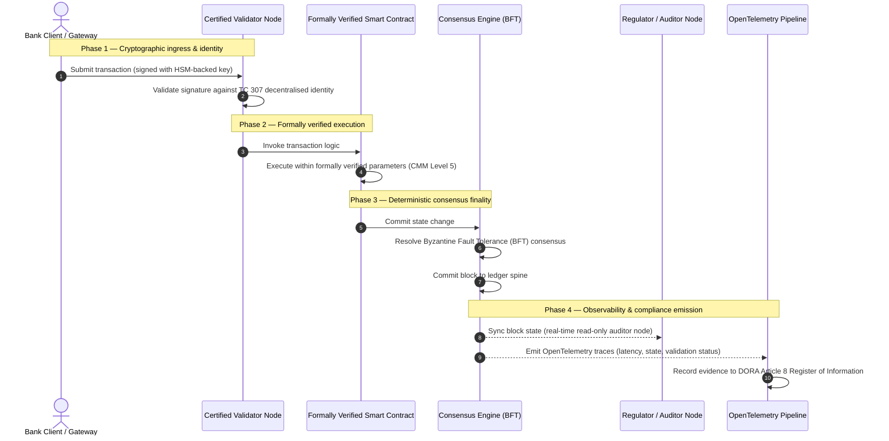

# 从证据到真相：为何认证区块链将定义银行信任的下一个时代

## 战略摘要（要点）

批发银行业务与全球交易在2026年正处于历史性转折点。随着金融服务向原生数字化、实时清算网络迁移，且人工智能引入概率性非确定性，传统的模拟式、追溯式保证模型（如静态的、基于实体的审计）已无法满足现代风险管理与受托责任的要求。

ISO/IEC技术委员会TC 307已为分布式账本技术确立了标准化基础。然而，真正的机构采用需要从描述性指引转向规范性的、可独立认证的区块链保证。通过依据严格的五级能力成熟度模型（CMM）对账本治理、共识完整性、智能合约安全性和加密敏捷性进行评分，银行可以从零散的、特定于供应商的假设，迈向可认证、董事会可审计的金融真相。

## 关键要点

* **受托摩擦缺口**：如今我们能够认证银行（Basel III）、云（ISO 27001）和AI治理系统（ISO 42001），但尚无法认证那个日益决定何为真相的分布式账本。这种不对称是一项重大的运营脆弱性。  
* **DORA强制施加直接受托责任**：根据DORA第5条，银行董事会对所有第三方和账本部署的运营韧性承担直接的、不可委托的个人责任，若失职则在SM&CR制度下面临严厉的个人处罚。  
* **AI的审计脊柱**：在机器学习产生不可复现的概率性结果之处，认证区块链提供确定性的状态捕获。将模型版本、输入和验证决策记录在链上，可满足ISO 42001和模型风险管理标准。  
* **认证区块链指数**：该指数将治理、共识、智能合约和可观测性形式化为一张可验证、审计就绪的评分卡，采用0至5的CMM刻度，将工程指标转化为董事会批准的风险偏好声明。

## 01. 数字银行业务中的受托摩擦缺口

在传统银行业中，信任是关系性的、机构性的和追溯性的。它依赖独立的第三方审计师在固定时点审查财务状态，并调和双边账本孤岛之间的差异。在2026年实时、API驱动的市场中，这一模型引入了令人望而却步的延迟和结构性风险。

当交易即时结算、日内流动性池由API网关动态管理、资产所有权在共享账本上被代币化时，追溯性审计便沦为取证式操练而非预防性控制。受托人不再能仅依赖对法人实体的认证。他们必须认证数字基质本身。

目前，银行运营于一种显而易见的架构不对称之下：

1. **经认证的云基础设施**：硬件节点、虚拟化容器和物理数据中心依据ISO/IEC 27001和SOC 2 Type II控制进行验证。  
2. **经认证的管理流程**：运营风险政策、业务连续性计划和算法部署受严格的风险框架管辖。  
3. **未经认证的账本引擎**：分布式共识机制、验证节点供应链、智能合约边界和网络治理模型被交给未经认证的、定制的或特定于联盟的假设。

这种不对称是一个关键的失效点。银行可以在安全的、经ISO 27001认证的云容器内运行一个经验证的应用，但如果该容器写入一个具有集中式验证者控制、脆弱共识参数或未审计智能合约的分布式账本，交易完整性便遭到损害。要弥合这一缺口，账本引擎本身必须成为可认证的保证对象。

## 02. ISO/IEC TC 307标准化基础

标准化分布式账本所需的基础性工作，正由ISO/IEC技术委员会TC 307（区块链和分布式账本技术）确立。TC 307并未将区块链视为孤立的技术协议，而是将其视为机构性信任基础设施，并围绕五大核心支柱组织其工作：

1. **分类法与词汇（ISO 22739）**：确立通用命名法，确保在不同司法管辖区、金融方案和机构之间保持一致的法律和运营定义。  
2. **参考架构（ISO/TR 23245）**：定义合规分布式账本系统的边界、层次、数据流和功能组件。  
3. **安全、隐私与智能合约（ISO/TR 23244 / ISO 23613）**：为数字资产系统确立基线安全指引，并详述智能合约漏洞缓解和生命周期治理的最佳实践。  
4. **互操作性框架**：处理异构账本网络之间的数据和资产交换机制，防止形成孤立的代币化孤岛。  
5. **去中心化身份与信任锚**：将基于账本的加密标识符与正式的公钥基础设施（PKI）和国家授权的注册机构相集成。

总体而言，TC 307标志着DLT从定制的工程选择向标准化架构学科的过渡。然而，TC 307仍主要是描述性的。它定义了卓越的样貌（指引），但并未提供风险官员和监管者授权关键或重要职能（CIF）生产部署所需的规范性验证协议（保证）。

## 03. 指引与保证：受托区分

金融市场参与者部署一项技术，并非因为它创新或优雅；而是当它能够被治理、审计、辩护并与资本储备要求相调和时。这正是为何银行业的标准化自然分解为两个层次：

* **指引（框架）**：概述最佳实践、参考目标和架构准则（如ISO/IEC TC 307、NIST框架）。  
* **保证（证明）**：提供独立、持续且第三方可验证的证据，证明框架已实施并按设计运行（如ISO 27001认证、SOC 2审计、监管检查）。

在认证云基础设施的同时依赖未经认证的账本共识，是一个关键的监管缺口。一个"不可变"的区块链未必"在机构层面可信"。不可变性仅保证录入的数据不被更改；它并不验证验证节点是否安全、共识协议是否能抵御合谋、智能合约逻辑是否数学上健全，或加密密钥管理是否符合后量子要求。

为弥合这一缺口，2026年认证区块链指数将这些要求形式化为一个可量化的能力成熟度模型（CMM），并映射到全球银行法规。

## 04. 2026年认证区块链指数

为使高级管理层能够评估和认证其账本平台，该指数将分布式账本基础设施构建为五个可审计的运营层，采用0至5的CMM刻度评分。

## 表1：认证区块链指数架构

| 指数层 | 成熟度级别（CMM） | 技术与运营指标 | 监管/受托控制参照 |
| ---- | ---- | ---- | ---- |
| **账本治理** | **0级**：临时联盟**3级**：自动化验证者审查与轮换**5级**：去中心化的多方加密身份锚定 | 由经审查金融实体运营的验证节点百分比；验证者纠纷解决平均时长；节点地理分布 | **DORA第5条**（治理与组织）；**CPMI-IOSCO PFMI原则2**（治理）与**原则3**（全面风险管理框架） |
| **共识完整性** | **0级**：单节点或不透明PoW**3级**：具确定性终结性的经审计BFT**5级**：具持续延迟监控的多司法管辖、形式化验证共识 | 最大可容忍共识延迟；抗合谋阈值；模拟节点分区下的可用性SLA | **DORA第6条**（ICT风险管理框架）；**CPMI-IOSCO PFMI原则8**（结算终结性） |
| **身份与加密** | **0级**：弱RSA/ECDSA密钥**3级**：具HSM支持密钥管理的多重签名**5级**：量子安全混合密钥（FIPS 203 ML-KEM）与零知识隐私门 | 以HSM支持密钥签名的账本交易百分比；PQC迁移就绪度评分；ZK证明延迟 | **NIST FIPS 203 / 204**；**ISO/IEC 27001**（信息安全管理） |
| **智能合约保证** | **0级**：未审计的Solidity脚本**3级**：自动化编译器验证与外部审计**5级**：具断路器升级的形式化验证、不可变智能合约 | 具数学形式化验证的智能合约百分比；编译器警告数；漏洞扫描覆盖率 | **EBA外包指引**（第81、113-117段）；**DORA第30条**（最低合同条款） |
| **审计与可观测性** | **0级**：手动日志抓取**3级**：结构化OTel追踪与只读审计者节点**5级**：与第8条登记册的自动化持续对账 | 由OpenTelemetry追踪覆盖的交易百分比；从区块提交到审计者节点同步的延迟 | **BCBS 239**（风险数据聚合）；**DORA第8条**（信息登记册 / ITS模式） |

## 表2：映射至全球银行标准的关键信任信号

| 信号 / 基准 | 指标 | 对银行平台的影响 | 监管来源 |
| ---- | ---- | ---- | ---- |
| **ISO/IEC TC 307进展** | 从ISO/TR技术报告转向正式认证方案 | 确立首个用于认证分布式账本引擎的标准化框架 | **ISO/IEC JTC 1 / SC 44**（分布式账本技术） |
| **Agorá项目原型阶段** | 40余家参与商业银行；代币化存款的统一账本测试 | 将跨境清算从消息传递（SWIFT）转向原子化代币化结算 | **国际清算银行（BIS）创新中心** |
| **DORA第30条第三方审计** | 100%的节点提供商和基础设施主机依据安全标准接受审计 | 消除"影子验证节点"；强制要求供应链完全透明 | **欧洲监管当局（ESA）** |
| **ISO/IEC 42001（AI治理）** | 将AI模型和训练日志在链上加密固化为不可变 | 将区块链用作机器学习的不可变证据登记册（"审计脊柱"） | **ISO/IEC 42001:2023**（信息技术 — 人工智能） |
| **Basel III资本充足率** | 基于已记录的复杂性降低而削减运营风险资本缓冲 | 标准化的运营风险框架直接认可经验证的账本韧性 | **巴塞尔银行监管委员会（BCBS）** |

## 05. AI的"审计脊柱"：确定性基础设施上的概率性智能

认证区块链在2026年最强大的战略角色之一，是充当人工智能部署的**"审计脊柱"**。现代金融系统日益概率化。信用评分、实时欺诈检测、算法交易和自主客户交互，皆由随时间演进、漂移和适应的机器学习模型驱动。这些模型是非确定性的：同一输入在两个不同时点，可能因动态权重和持续训练而产生不同输出。

这种非确定性在**ISO/IEC 42001（AI治理）**和模型风险管理（MRM）标准（如**美联储SR 11-7**和**英国PRA SS1/23**）下提出了深刻的治理挑战：*如何审计、解释和辩护那些并非严格可复现的决策？*

认证分布式账本提供了确定性的制衡。在AI模型概率性运作之处，认证区块链确定性地记录其参数，确立一条不可更改的证据脊柱：

* **模型版本管理与权重锚定**：每个已部署的模型版本、其关联权重及其训练数据的校验和，在构建时被哈希并写入账本，满足**SLSA Level 3**供应链要求。  
* **上下文输入日志记录**：当AI模型执行关键决策（如批准贷款或标记交易）时，精确的上下文输入和模型哈希被写入账本，形成防篡改的历史。  
* **无需代码访问的可审计性**：若监管者问"你的模型为何在6月3日拒绝这笔信贷申请？"，银行既无需暴露其专有代码，也无需尝试重建精确的模型状态。它出示经加密签名的、关于输入、权重和验证状态的链上记录。

通过将机器学习模型的概率性决策锚定于认证区块链的确定性共识，机构创造出一条可辩护、可重建且可独立验证的自动化行动时间线。

## 06. 认证的共识至审计流水线的可视化

以下时序图展示了一笔交易通过认证区块链平台的生命周期，说明验证门、共识完整性、智能合约执行和遥测发射如何相互咬合，以产生董事会就绪的监管证据：

该交易序列的关键路径要求每一个验证、执行和共识步骤都经过加密签名，确保端到端的溯源。监管者的审计者节点实时同步区块状态，消除了追溯性、手动财务对账的需要。

## 07. 面向高级管理者的董事会手册

为成功驾驭从组织信任向基础设施信任的过渡，银行高管和高级管理者应立即执行四项关键指令：

1. **在企业风险管理（ERM）中强制账本审计**：执行一项政策，规定任何分布式账本平台——无论私有、公有或联盟——未依据五层**认证区块链指数架构**（最低CMM 3级）接受审计，均不得部署于关键或重要职能（CIF）。  
2. **将区块链集成为ISO 42001的AI证据脊柱**：指示首席风险官和首席AI架构师，将所有高影响机器学习模型与认证区块链集成，创建一个关于模型版本、权重、输入和决策的防篡改审计登记册。  
3. **审计验证节点供应链（DORA第30条）**：要求采购部门审计所有托管验证节点或为DLT网络管理云托管的第三方实体，并强制施行与银行内部云节点相同的网络安全和运营韧性标准。  
4. **使账本架构与CPMI-IOSCO和BCBS 239保持一致**：指示平台工程团队使账本输出遥测直接与**BCBS 239**数据报告要求保持一致，并确保共识和结算终结性参数严格符合**CPMI-IOSCO原则8和9**。

## 08. 常见问题

**ISO/IEC TC 307是认证标准吗？**  
不是。ISO/IEC TC 307是一个确立词汇、参考架构和安全指引的技术委员会。尽管它定义了"卓越的样貌"（指引），但业界必须将这些文件付诸运营，形成正式的、可审计的认证方案（保证），以满足银行监管者。

**认证区块链如何支持DORA合规？**  
根据DORA第5条，银行董事会对技术韧性承担直接的个人责任。认证区块链提供关于共识完整性、验证者供应链控制和智能合约安全性的可验证加密证据，为董事会成员提供在SM&CR下抗辩个人责任主张所需的、可记录的"合理措施"。

传统账本审计与认证区块链审计有何区别？  
传统审计是追溯性的：它在交易结算后验证手动记项和静态文件。认证区块链审计是持续且实时的；验证节点、BFT共识引擎和形式化验证的智能合约被认证以确定性地执行交易，并发射结构化遥测（OpenTelemetry），持续验证系统的健康状况。

公有区块链能否被认证用于银行用途？  
在大多数司法管辖区，纯粹无许可的公有区块链因缺乏验证者身份验证、交易成本不可预测以及非确定性终结性（如概率性proof-of-work/stake分叉），无法满足银行法规。银行中的认证区块链通常采用企业许可架构或受严格监管的公有-混合架构，其中验证节点运营者是经识别和审计的金融实体。

## 09. 参考文献

* 巴塞尔银行监管委员会（BCBS），2013. *Principles for effective risk data aggregation and reporting (BCBS 239)*. 巴塞尔：国际清算银行。可访问：[https://www.bis.org/publ/bcbs239.pdf](https://www.bis.org/publ/bcbs239.pdf)。  
* Committee on Payments and Market Infrastructures 与 Technical Committee of the International Organization of Securities Commissions (CPMI-IOSCO)，2012. *Principles for financial market infrastructures*. 巴塞尔：国际清算银行。可访问：[https://www.bis.org/cpmi/publ/d101.htm](https://www.bis.org/cpmi/publ/d101.htm)。  
* 欧洲银行管理局（EBA），2019. *EBA/GL/2019/02 — Guidelines on outsourcing arrangements*. 巴黎：EBA。可访问：[https://www.eba.europa.eu/regulation-and-policy/internal-governance/guidelines-on-outsourcing-arrangements](https://www.eba.europa.eu/regulation-and-policy/internal-governance/guidelines-on-outsourcing-arrangements)。  
* 欧洲议会与欧盟理事会，2022. *关于金融部门数字运营韧性的条例（EU）2022/2554（DORA）*. 布鲁塞尔：欧盟官方公报。可访问：[https://eur-lex.europa.eu/legal-content/EN/TXT/?uri=CELEX%3A32022R2554](https://eur-lex.europa.eu/legal-content/EN/TXT/?uri=CELEX%3A32022R2554)。  
* ISO/IEC JTC 1/SC 42，2023. *ISO/IEC 42001:2023 — Information technology — Artificial intelligence — Management system*. 日内瓦：国际标准化组织。可访问：[https://www.iso.org/standard/81230.html](https://www.iso.org/standard/81230.html)。  
* 技术委员会 ISO/IEC 307，2020. *ISO/IEC 22739:2020 — Blockchain and distributed ledger technologies — Vocabulary*. 日内瓦：国际标准化组织。可访问：[https://www.iso.org/standard/73771.html](https://www.iso.org/standard/73771.html)。  
* National Institute of Standards and Technology (NIST)，2026. *First Three Finalized Post-Quantum Encryption Standards (FIPS 203, 204, and 205)*. 盖瑟斯堡：U.S. Department of Commerce。可访问：[https://www.nist.gov/news-events/news/2024/08/nist-releases-first-3-finalized-post-quantum-encryption-standards](https://www.nist.gov/news-events/news/2024/08/nist-releases-first-3-finalized-post-quantum-encryption-standards)。
