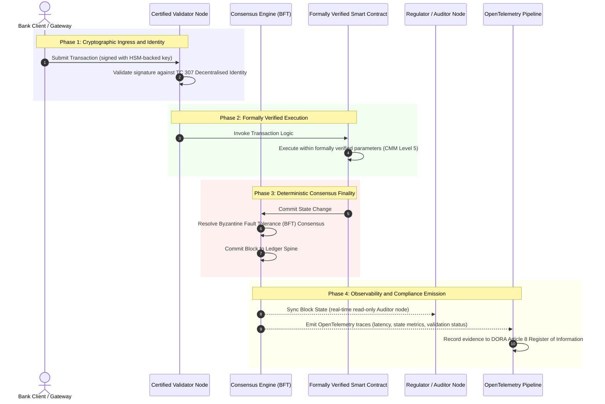

# 从证据到真相：为何认证区块链将定义银行信任的下一个时代

**不可篡改不等于可信。** 随着批发银行转向实时结算与概率性人工智能，决定何为真相的账本已成为银行至今仍无法认证的唯一一层。他们依据 Basel III 认证法人实体，依据 ISO 27001 认证云，依据 ISO 42001 认证其人工智能，但分布式账本及其治理、共识、密码学与智能合约，却被交给了供应商各自的假设。本报告主张，弥合这一受托责任缺口，需要从 ISO/IEC TC 307 指南转向规定性的保障：依据一套五级认证区块链指数对账本进行评分，把工程指标转化为董事会可审计、经得起 DORA 检验的真相。

<!-- lead-start -->
<aside class="post-lead" aria-label="文章摘要">

<strong>摘要。</strong> 银行为法人实体、云及其人工智能做认证，却不为那个日益决定何为真相的账本做认证。ISO/IEC TC 307 提供的是指南，而非保障。一套五级认证区块链指数依据能力成熟度模型对账本治理、共识完整性、身份与密码学、智能合约保障及可观测性进行评分，弥合受托责任缺口，并为概率性人工智能提供一根确定性的审计脊柱。

<strong>关键要点</strong>

<ul class="post-lead-takeaways">
  <li><strong>受托责任的摩擦缺口。</strong> 银行（Basel III）、云（ISO 27001）与人工智能治理体系（ISO 42001）都可以被认证；而决定何为真相的分布式账本尚不能被认证。这种不对称是一个现实存在的运营脆弱点。</li>
  <li><strong>DORA 让责任落到个人。</strong> 依据 DORA Article 5，银行董事会对第三方及账本部署的韧性承担直接的、不可转授的责任，失职将面临 SM&amp;CR 项下的个人处罚。</li>
  <li><strong>人工智能的审计脊柱。</strong> 机器学习不可复现；认证区块链以确定性方式在链上捕获模型版本、输入与验证决策，满足 ISO 42001 与模型风险管理标准。</li>
  <li><strong>认证区块链指数。</strong> 治理、共识、密码学、智能合约与可观测性构成一张 0 至 5 分的 CMM 记分卡，把工程指标转化为董事会批准的风险偏好声明。</li>
</ul>

<strong>延伸阅读：</strong> <a href="https://sebastienrousseau.com/2026-07-02-certified-blockchains-banking-trust-tc307-assurance-2026">认证区块链与银行信任：TC 307 保障</a>、<a href="https://sebastienrousseau.com/2026-07-24-global-payments-outlook-operating-model-risk-revenue">2026 全球支付展望</a>。

</aside>
<!-- lead-end -->

> **执行摘要**
>
> - **批发银行正处于拐点。** 实时清算与概率性人工智能打破了模拟式、回溯性的保障模型：静态的、以法人实体为对象的审计已无法满足现代风险管理或受托责任的要求。
> - **TC 307 是一条基线，而非一纸证书。** ISO/IEC TC 307 已为分布式账本标准化了术语、参考架构与安全指南，但它是描述性的。它定义了何为良好；却并未提供风险官与监管方授权生产部署所需的规定性验证。
> - **保障意味着为账本评分。** 治理、共识完整性、智能合约安全性与密码学敏捷性，依据一套严格的五级能力成熟度模型评分，可使银行从零散的、供应商各异的假设，走向可认证、董事会可审计的金融真相。
> - **账本是人工智能的审计脊柱。** 把模型版本、输入与验证决策锚定到确定性共识之上，为不可复现的机器学习提供了一份经得起辩护、可重建的证据记录，满足 ISO 42001、SR 11-7 与 PRA SS1/23。

## 数字银行中的受托责任摩擦缺口

在传统银行中，信任是关系性的、机构性的、回溯性的。它依赖独立的第三方审计师在静态的时间点上审阅财务状态，并在双边账本孤岛之间调节差异。在 2026 年实时、以 API 驱动的市场中，这一模型带来了难以承受的时延与结构性风险。

当交易即时结算、日间流动性池由 API 网关动态管理、资产所有权在共享账本上被代币化时，回溯性审计便沦为取证操作，而非预防性控制。受托方不能再仅仅依靠认证公司法人实体。他们必须认证数字底层基础本身。

目前，银行运行在一种刺眼的架构不对称之下：

1. **已认证的云基础设施**：硬件节点、虚拟化容器与实体数据中心依据 ISO/IEC 27001 与 SOC 2 Type II 控制进行验证。  
2. **已认证的管理流程**：运营风险政策、业务连续性计划与算法部署受严格的风险框架治理。  
3. **未认证的账本引擎**：核心分布式共识机制、验证者节点供应链、智能合约边界与网络治理模型，却被交给未经认证的、定制的或联盟专属的假设。

这种不对称是一个重大的失效点。银行可以在一个安全的、经 ISO 27001 认证的云容器内运行一个已验证的应用，但如果该容器写入的是一个具有中心化验证者控制、脆弱共识参数或未经审计智能合约的分布式账本，交易完整性便已受损。要弥合这一缺口，账本引擎本身必须成为一个可认证的保障对象。

## ISO/IEC TC 307 标准化基线

标准化分布式账本所需的奠基性工作，正由 ISO/IEC 第 307 技术委员会（TC 307）（区块链与分布式账本技术）建立。TC 307 并未把区块链当作一个孤立的技术协议，而是将其作为一种机构性信任基础设施来处理，其工作围绕五大核心支柱展开：

1. **分类法与术语（ISO 22739）**：确立通用命名法，确保在不同司法辖区、金融方案与机构之间保持一致的法律与运营定义。  
2. **参考架构（ISO/TR 23245）**：定义合规分布式账本系统的边界、层级、数据流与功能组件。  
3. **安全、隐私与智能合约（ISO/TR 23244 / ISO 23613）**：为数字资产系统确立基线安全指引，并详述智能合约漏洞缓解与生命周期治理的最佳实践。  
4. **互操作性框架**：处理异构账本网络之间的数据与资产交换机制，防止形成孤立的代币化孤岛。  
5. **去中心化身份与信任锚**：将基于账本的密码学标识符与正式的公钥基础设施（PKI）及国家授权的登记机构相整合。

总体而言，TC 307 标志着 DLT 从一种定制工程选择转向一门标准化的架构学科。然而，TC 307 仍主要是描述性的。它定义了何为良好（指南），却并未提供风险官与监管方在授权关键或重要职能（CIFs）的生产部署时所要求的规定性验证协议（保障）。

## 指南与保障：受托责任的分野

金融市场参与者不会因为一项技术新颖或优雅而部署它；他们只在其可被治理、审计、辩护并与资本储备要求相调节时才部署它。这正是为何银行业的标准化会自然收敛为两个层次：

* **指南（框架）**：概述最佳实践、参考目标与架构指引（例如 ISO/IEC TC 307、NIST 框架）。  
* **保障（证明）**：提供独立、持续、可由第三方验证的证据，证明框架已按设计实施并运行（例如 ISO 27001 认证、SOC 2 审计、监管检查）。

在认证云基础设施的同时依赖未经认证的账本共识，是一个关键的监管缺口。一条"不可篡改"的区块链，未必"受机构信任"。不可篡改性仅保证已录入的数据未被更改；它并不验证验证者节点是否安全、共识协议是否能抵御串谋、智能合约逻辑是否在数学上严密，或密码学密钥管理是否符合后量子要求。

为弥合这一缺口，2026 认证区块链指数将这些要求形式化为一套可量化的、映射至全球银行监管的能力成熟度模型（CMM）。

## 2026 认证区块链指数

为使高级管理层能够评估并认证其账本平台，本指数将分布式账本基础设施划分为五个可审计的运营层，并按 0 至 5 分的 CMM 尺度评分。

### 表 1：认证区块链指数架构

| 指数层 | 能力成熟度等级 (CMM) | 技术与运营指标 | 监管 / 受托责任控制参照 |
| ---- | ---- | ---- | ---- |
| **账本治理** | **Level 0**：临时性联盟**Level 3**：自动化验证者审查与轮换**Level 5**：去中心化的多方密码学身份锚定 | 由经审查金融实体运营的验证者节点占比；解决验证者争议的平均时间；节点的地理分布 | **DORA Article 5**（治理与组织）；**CPMI-IOSCO PFMI Principle 2**（治理）与 **Principle 3**（风险综合管理框架） |
| **共识完整性** | **Level 0**：单节点或不透明的 POW**Level 3**：经审计、具确定性最终性的 BFT**Level 5**：多司法辖区、经形式化验证、具持续时延监控的共识 | 最大可容忍共识时延；抗串谋阈值；模拟节点分区下的正常运行时间 SLA | **DORA Article 6**（ICT 风险管理框架）；**CPMI-IOSCO PFMI Principle 8**（结算最终性） |
| **身份与密码学** | **Level 0**：脆弱的 RSA / ECDSA 密钥**Level 3**：由 HSM 支撑密钥管理的多重签名**Level 5**：抗量子混合密钥（FIPS 203 ML-KEM）与零知识隐私门 | 由 HSM 支撑密钥签名的账本交易占比；PQC 迁移就绪度评分；ZK 证明时延 | **NIST FIPS 203 / 204**；**ISO/IEC 27001**（信息安全管理） |
| **智能合约保障** | **Level 0**：未经审计的 solidity 脚本**Level 3**：自动化编译器校验与外部审计**Level 5**：经形式化验证、不可变、具熔断器升级的智能合约 | 经数学形式化验证的智能合约占比；编译器警告数量；漏洞扫描覆盖率 | **EBA Guidelines on Outsourcing Arrangements**（第 81、113-117 段）；**DORA Article 30**（最低合同条款） |
| **审计与可观测性** | **Level 0**：手动日志抓取**Level 3**：结构化 OTel 追踪与只读审计者节点**Level 5**：向 Article 8 登记册自动、持续对账 | 由 OpenTelemetry 追踪覆盖的交易占比；从账本区块提交到审计者节点同步的时延 | **BCBS 239**（风险数据聚合）；**DORA Article 8**（信息登记册 / ITS 模式） |

### 表 2：映射至全球银行标准的关键信任信号

| 信号 / 基准 | 指标 | 对银行平台的影响 | 监管来源 |
| ---- | ---- | ---- | ---- |
| **ISO/IEC TC 307 进展** | 从 ISO/TR 技术报告过渡到正式认证方案 | 确立首个用于认证分布式账本引擎的标准化框架 | **ISO/IEC JTC 1 / SC 44**（分布式账本技术） |
| **Project Agorá 原型阶段** | 40 家以上参与商业银行；对代币化存款进行统一账本测试 | 将跨境清算从报文（SWIFT）转向原子化的代币化结算 | **国际清算银行 (BIS) 创新中心** |
| **DORA Article 30 第三方审计** | 100% 的节点提供方与基础设施托管方依据安全标准接受审计 | 消除"影子验证者节点"；强制要求整条供应链透明 | **欧洲监管机构 (ESA)** |
| **ISO/IEC 42001（人工智能治理）** | 将人工智能模型与训练日志以密码学方式在链上不可变化 | 以区块链作为机器学习不可变的证据账本（"审计脊柱"） | **ISO/IEC 42001:2023**（信息技术，人工智能） |
| **Basel III 资本充足** | 基于有据可查的复杂度降低，缩减运营风险资本缓冲 | 标准化的运营风险框架直接为已验证的账本韧性给予信用 | **巴塞尔银行监管委员会 (BCBS)** |

## 人工智能"审计脊柱"：确定性基础设施之上的概率性智能

2026 年，认证区块链最有力的战略角色之一，是充当人工智能部署的 **"审计脊柱"**。现代金融系统日益概率化。信用评分、实时欺诈检测、算法交易与自主客户互动，都由随时间演化、漂移与自适应的机器学习模型驱动。这些模型是非确定性的：在两个不同时刻给予相同输入，它们可能因动态权重与持续训练而产生不同输出。

这种非确定性在 **ISO/IEC 42001（人工智能治理）** 与 **模型风险管理 (MRM)** 标准（如 **美联储 SR 11-7** 与 **英国 PRA SS1/23**）之下带来了一个深刻的治理难题：*你如何审计、解释并辩护那些并非严格可复现的决策？*

认证分布式账本提供了确定性的对冲力量。当人工智能模型以概率方式运行时，认证区块链以确定性方式记录其参数，确立一根不可更改的证据脊柱：

* **模型版本化与权重锚定**：每个已部署的模型版本、其关联权重及其训练数据校验和，都在构建时被哈希并写入账本，满足 **SLSA Level 3** 供应链要求。  
* **上下文输入记录**：当人工智能模型执行一项关键决策（例如批准贷款或标记交易）时，确切的上下文输入与模型哈希被写入账本，形成一份可察觉篡改的历史。  
* **无需访问代码的可审计性**：若监管方问："你的模型为何在 6 月 3 日拒绝了这份信贷申请？"银行无需暴露专有代码，也无需尝试重建确切的模型状态。它只需出示经密码学签名、在链上记录的输入、权重与验证状态。

通过把机器学习模型的概率性决策锚定到认证区块链的确定性共识之上，机构便为自动化行为建立了一条经得起辩护、可重建、可独立验证的时间线。

## 可视化认证的"共识到审计"流水线

以下时序图展示了一笔交易穿过认证区块链平台的生命周期，说明验证门、共识完整性、智能合约执行与遥测发送如何相互咬合，产出董事会可用的监管证据：

这一交易时序的关键路径要求，每一个验证、执行与共识步骤都经过密码学签名，从而确保端到端的溯源。监管方的审计者节点实时同步区块状态，消除了对回溯性、手动财务对账的需要。

## 面向高级管理者的董事会行动手册

要成功管理从组织信任向基础设施信任的转变，银行高管与高级管理者应立即执行四项关键指令：

1. **在企业风险管理 (ERM) 中强制账本审计**：执行一项政策——任何分布式账本平台，无论私有、公有还是联盟型，未依据五层 **认证区块链指数架构**（CMM Level 3 起）接受审计，均不得用于关键或重要职能（CIFs）的部署。  
2. **将区块链整合为 ISO 42001 人工智能证据脊柱**：指示首席风险官与首席人工智能架构师，将所有高影响力机器学习模型与认证区块链整合，形成一份可察觉篡改的模型版本、权重、输入与决策审计账本。  
3. **审计验证者节点供应链（DORA Article 30）**：要求采购部门审计所有托管验证者节点或为 DLT 网络管理云托管的第三方实体，强制要求其遵循与银行内部云节点相同的网络安全与运营韧性标准。  
4. **使账本架构与 CPMI-IOSCO 及 BCBS 239 对齐**：指示平台工程团队将账本输出遥测直接对齐至 **BCBS 239** 数据报告要求，并确保共识与结算最终性参数严格遵循 **CPMI-IOSCO Principles 8 与 9**。

## 常见问题

**ISO/IEC TC 307 是一项认证标准吗?**  
不是。ISO/IEC TC 307 是一个技术委员会，确立术语、参考架构与安全指引。虽然它定义了"何为良好"（指南），但业界必须将这些文件落地为正式、可审计的认证方案（保障），才能满足银行监管方。

**认证区块链如何支持 DORA 合规?**  
依据 DORA Article 5，银行董事会对技术韧性承担直接的、个人的责任。认证区块链提供关于共识完整性、验证者供应链控制与智能合约安全性的可验证密码学证据，为董事会成员提供有据可查的"合理步骤"，以抵御 SM&CR 项下的个人责任索赔。

**传统账本审计与认证区块链审计有何区别?**  
传统审计是回溯性的，在交易清算后核验手动录入与静态文件。认证区块链审计是持续、实时的；验证者节点、BFT 共识引擎与经形式化验证的智能合约，被认证为以确定性方式执行交易，并发送结构化遥测（OpenTelemetry），持续验证系统健康状态。

**公有区块链能否被认证用于银行用途?**  
在大多数司法辖区，纯粹的无许可公有区块链因缺乏验证者身份核验、gas/交易成本不可预测以及最终性非确定性（例如概率性的工作量证明/权益证明分叉）而无法满足银行监管。银行中的认证区块链通常采用企业级许可制或受高度监管的公私混合架构，其中验证者节点运营方是经识别与审计的金融实体。

## 参考文献

* Basel Committee on Banking Supervision (BCBS), 2013\. *Principles for effective risk data aggregation and reporting (BCBS 239\)*. Basel: Bank for International Settlements. Available at: [Basel Committee on Banking Supervision (BCBS), 2013\.](https://www.bis.org/publ/bcbs239.pdf "Basel Committee on Banking Supervision (BCBS), 2013\.").  
* Committee on Payments and Market Infrastructures and Technical Committee of the International Organisation of Securities Commissions (CPMI-IOSCO), 2012\. *Principles for financial market infrastructures*. Basel: Bank for International Settlements. Available at: [Committee on Payments and Market Infrastructures and Technical Committee of the International Organisation of Securities Commissions (CPMI-IOSCO), 2012\.](https://www.bis.org/cpmi/publ/d101.htm "Committee on Payments and Market Infrastructures and Technical Committee of the International Organisation of Securities Commissions (CPMI-IOSCO), 2012\.").  
* European Banking Authority (EBA), 2019\. *EBA/GL/2019/02, Guidelines on outsourcing arrangements*. Paris: EBA. Available at: [European Banking Authority (EBA), 2019\.](https://www.eba.europa.eu/regulation-and-policy/internal-governance/guidelines-on-outsourcing-arrangements "European Banking Authority (EBA), 2019\.").  
* European Parliament and Council of the European Union, 2022\. *Regulation (EU) 2022/2554 on digital operational resilience for the financial sector (DORA)*. Brussels: Official Journal of the European Union. Available at: [European Parliament and Council of the European Union, 2022\.](https://eur-lex.europa.eu/legal-content/EN/TXT/?uri=CELEX%3A32022R2554 "European Parliament and Council of the European Union, 2022\.").  
* ISO/IEC JTC 1/SC 42, 2023\. *ISO/IEC 42001:2023, Information technology, Artificial intelligence, Management system*. Geneva: International Organisation for Standardisation. Available at: [ISO/IEC JTC 1/SC 42, 2023\.](https://www.iso.org/standard/81230.html "ISO/IEC JTC 1/SC 42, 2023\.").  
* ISO/IEC Technical Committee 307, 2020\. *ISO/IEC 22739:2020, Blockchain and distributed ledger technologies, Vocabulary*. Geneva: International Organisation for Standardisation. Available at: [ISO/IEC Technical Committee 307, 2020\.](https://www.iso.org/standard/73771.html "ISO/IEC Technical Committee 307, 2020\.").  
* National Institute of Standards and Technology (NIST), 2026\. *First Three Finalised Post-Quantum Encryption Standards (FIPS 203, 204, and 205\)*. Gaithersburg: U.S. Department of Commerce. Available at: [National Institute of Standards and Technology (NIST), 2026\.](https://www.nist.gov/news-events/news/2024/08/nist-releases-first-3-finalized-post-quantum-encryption-standards "National Institute of Standards and Technology (NIST), 2026\.").
