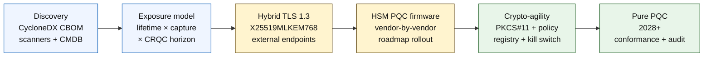

# 2026 年量子安全銀行業指標:後量子密碼、QKD、密碼敏捷性與「先擷取、後解密」風險

<!-- lead-start: manual -->
<aside class="post-lead" aria-label="文章摘要">

<strong>重點速覽。</strong>2026 年的量子安全銀行業是一項交付計畫,其期限由兩條曲線的交點決定 —— 機構手上資料的機密生命週期,以及具密碼相關性量子電腦(CRQC)的抵達視界。NIST FIPS 203 / 204 / 205 自 2024 年 8 月起即為最終版;CNSA 2.0 把美國聯邦終局訂在 2033 年;「先擷取、後解密」已經對長壽資料動手。董事會級量子計分卡追蹤四項百分比:盤點完整度、HNDL 曝險、NIST 遷移進度、密碼敏捷性就緒度。

<strong>關鍵要點</strong>

<ul class="post-lead-takeaways">
  <li><strong>演算法之爭已於 2024 年 8 月 13 日落幕。</strong>答案就是 ML-KEM(FIPS 203)、ML-DSA(FIPS 204)、SLH-DSA(FIPS 205)。在 2026 年仍在跑內部評估、想「挑出贏家」的銀行,已經落後 18 個月。</li>
  <li><strong>「先擷取、後解密」此刻已適用。</strong>任何機密生命週期超過可信 CRQC 抵達時程的資產 —— 30 年期房貸、壽險核保、MiFID II / GDPR 交易錄音、併購留存檔案 —— 都必須立即轉到混合式量子安全金鑰封裝,而不是等到 CRQC 公開宣告才動。</li>
  <li><strong>盤點是進入後續關卡的成熟度門檻。</strong>密碼物料清單(CBOM)—— 含協定、函式庫、憑證、HSM 分區、供應商相依性、應用負責人、資料分類生命週期 —— 是其他一切的前提。要追蹤鮮度,而不是覆蓋率。</li>
  <li><strong>混合式 TLS 1.3 是 2026 年的部署版型。</strong>X25519MLKEM768 混合金鑰共享,就是 Chrome / Firefox / Cloudflare / Akamai 今日實際協商的方案。純 ML-KEM TLS 還在等 HSM 韌體與 CA 就緒。</li>
  <li><strong>密碼敏捷性才是可長可久的交付物。</strong>PKCS#11 抽象層、帶標籤的金鑰、把業務服務對應到允許演算法集合的策略註冊表。少了這一層,下一輪演算法切換又是一個橫跨多年的計畫。</li>
</ul>
</aside>
<!-- lead-end -->

2026 年的量子安全銀行業講的是作業面遷移,不是猜測。NIST 已把首批三項後量子密碼標準定稿,銀行必須清點哪些系統相依於 RSA、ECC、TLS、簽章、HSM、憑證、支付通道、檔案庫,以及長壽機密資料。指標的問題很簡單:這家機構能不能在威脅進入作業階段之前換掉密碼?

---

> **執行摘要 / 關鍵要點**
>
> - **NIST 標準已具體。**FIPS 203 為金鑰封裝定義 ML-KEM,FIPS 204 為簽章定義 ML-DSA,FIPS 205 把 SLH-DSA 訂為無狀態雜湊式簽章標準。
> - **盤點是第一道成熟度關卡。**找不到就遷不了:憑證、金鑰、協定、應用、供應商、HSM、API、檔案庫與嵌入式系統,都必須上圖。
> - **密碼敏捷性才是可長可久的目標。**目標不是一次性換演算法;而是不必重新設計整套應用就能更換密碼基元。
> - **長壽資料改變急迫性。**「先擷取、後解密」風險意味著今天攔下的資料,只要保值夠久,日後就可能被讀通。
> - **QKD 是專門性的補強。**量子金鑰分發在價值最高的通道上或許用得到,但取代不了全行範圍的 PQC 遷移。
>
---

## 為什麼 2026 年是這項指標重要的一年

2024–2025 年的三項轉折,讓量子安全從研究觀察項升級為可量測的銀行計畫。第一,NIST 在 2024 年 8 月 13 日把主要後量子標準定稿:[FIPS 203(ML-KEM)⧉](https://nvlpubs.nist.gov/nistpubs/FIPS/NIST.FIPS.203.pdf "FIPS 203 — Module-Lattice-Based Key-Encapsulation Mechanism")、[FIPS 204(ML-DSA)⧉](https://nvlpubs.nist.gov/nistpubs/FIPS/NIST.FIPS.204.pdf "FIPS 204 — Module-Lattice-Based Digital Signature Standard")、[FIPS 205(SLH-DSA)⧉](https://nvlpubs.nist.gov/nistpubs/FIPS/NIST.FIPS.205.pdf "FIPS 205 — Stateless Hash-Based Digital Signature Standard")。演算法選擇之爭就在那一天結束;2026 年還在跑「哪個方案會贏」內部工作流程的銀行,已經落後 18 個月。

第二,[NSA 的 CNSA 2.0 ⧉](https://media.defense.gov/2022/Sep/07/2003071834/-1/-1/0/CSA_CNSA_2.0_ALGORITHMS_.PDF "Commercial National Security Algorithm Suite 2.0")把美國聯邦終局設在 2033 年,並從 2027 年起對軟體與韌體簽章設下中間期限,2030 年則輪到瀏覽器與作業系統。任何對美國聯邦交易對手有曝險的銀行 —— FedNow、財政部營運、聯邦客戶帳戶 —— 凡是觸及聯邦資料的系統都坐在這個圍籬之內。時鐘不再抽象。

第三,[「先擷取、後解密」(HNDL)⧉](https://csrc.nist.gov/Projects/post-quantum-cryptography "NIST 後量子密碼計畫")承載了急迫性的核心論證。手段成熟的對手已在主要金融中心擷取 TLS 加密的支付訊息、SWIFT 信封、KYC 文件,以及長壽檔案的密文。2026 年攔下的資料,只需在解密當下仍具機密敏感性即可 —— 對於 30 年期房貸、壽險核保、MiFID II / GDPR 交易錄音與併購留存檔案來說,那個窗口遠超任何對具密碼相關性量子電腦(CRQC)的可信估算。對手今天不需要量子電腦,他們只需要在資料失去價值之前擁有一台。

量子安全銀行業指標衡量的,是這家機構能否在那個交點到來之前把遷移交付出去。問題已不是要不要遷,而是這場遷移能否在可辯護的時程上完成。

## 2026 年指標架構

| 指標層 | 2026 年方向 | 就緒度衡量 | 處理不當的風險 |
|---|---|---|---|
| **盤點** | 對密碼資產、協定、憑證、供應商與資料類別上圖 | 已盤點之資產百分比 | 未知的量子可破相依性 |
| **曝險** | 依機密生命週期與交易關鍵性分類系統 | 依價值與生命週期排序的高風險資產 | 遷移優先順序錯置 |
| **遷移** | 採用對齊 NIST 標準的混合與 PQC 就緒型樣 | ML-KEM 與 ML-DSA 就緒度 | 在期限壓力下的緊急重新平台化 |
| **密碼敏捷性** | 把應用邏輯與密碼基元分離 | 受策略控管的密碼覆蓋率 | 全行內遍佈硬寫的演算法 |
| **保證** | 測試互通性、效能、HSM 支援、憑證與供應商就緒度 | 測試通過率與例外待辦量 | 通道斷裂或回退控制脆弱 |

### 董事會級量子計分卡

一份可信的量子就緒度計分卡,必須追蹤明確的百分比,而不是只有專案狀態:

1. **盤點完整度:**已完整建立密碼物料清單(CBOM)的一線應用百分比。
2. **HNDL 曝險:**在未採用混合式量子安全金鑰封裝的網路上,所傳輸的長壽機密資料量(例如 PII、商業機密)。
3. **NIST 遷移進度:**已遷移至 FIPS 203(ML-KEM)與 FIPS 204(ML-DSA)的非對稱加密金鑰與數位簽章百分比。
4. **密碼敏捷性就緒度:**可透過集中策略輪換密碼演算法、無需重新編譯程式碼的關鍵系統百分比。

## 目前該追蹤的訊號

| 訊號 | 對銀行的意義 | 來源 |
|---|---|---|
| **FIPS 203 ML-KEM** | NIST 在一般加密金鑰建立上的主標準 | [NIST ⧉](https://www.nist.gov/news-events/news/2024/08/nist-releases-first-3-finalized-post-quantum-encryption-standards "首批三項定稿後量子加密標準") |
| **FIPS 204 ML-DSA** | NIST 在數位簽章上的主標準 | [NIST ⧉](https://www.nist.gov/news-events/news/2024/08/nist-releases-first-3-finalized-post-quantum-encryption-standards "首批三項定稿後量子加密標準") |
| **FIPS 205 SLH-DSA** | 雜湊式簽章備援設計 | [NIST ⧉](https://www.nist.gov/news-events/news/2024/08/nist-releases-first-3-finalized-post-quantum-encryption-standards "首批三項定稿後量子加密標準") |
| **鼓勵立即整合** | NIST 明確要求管理者開始整合標準,因為全面整合需要時間 | [NIST ⧉](https://www.nist.gov/news-events/news/2024/08/nist-releases-first-3-finalized-post-quantum-encryption-standards "首批三項定稿後量子加密標準") |
| **銀行量子計畫持續擴張** | 主要銀行一面探索量子技術,一面備妥 PQC 轉軌 | [Quantum Insider ⧉](https://thequantuminsider.com/2026/03/27/15-plus-global-banks-probing-the-wonderful-world-of-quantum-technologies/ "全球銀行探索量子技術概覽") |

## 遷移從密碼資產的總帳開始

遷移的順序到這個階段已不難理解。每一道關卡都產出證據去推動下一道;略過或壓縮任一關卡,就會孕育出指標架構失敗欄裡列出的緊急重新平台化風險。

首份交付物不是新演算法,而是一份密碼物料清單(CBOM)。銀行需要一份活的盤點,把業務服務串接到演算法、函式庫、憑證、金鑰長度、HSM、資料生命週期、供應商與作業負責人。少了這本總帳,量子安全遷移就只能靠猜。

CBOM 的紀錄欄位應對每一個密碼基元,記下:協定或介面(TLS 1.3、IPsec、SSH、自訂支付訊息格式)、演算法與參數集(RSA-2048、ECDH P-256、ML-KEM-768、ML-DSA-65)、函式庫與版本(OpenSSL 3.4、BoringSSL 提交雜湊值、供應商 SDK 建置)、硬體邊界(HSM 分區、TPM、安全飛地或無)、適用情況下的憑證身分、應用負責人,以及資料分類生命週期。2025–2026 年陸續進入生產的工具 —— IBM Quantum Safe Inventory、開源的 [CycloneDX CBOM 規範 ⧉](https://cyclonedx.org/capabilities/cbom/ "CycloneDX 密碼物料清單") 以及 CryptoNext / Sandbox / PQShield 等企業級掃描器 —— 都能接進既有的 CMDB 流水線。沒有一套單獨即可成事;就算備齊供應商工具與專責人力,CBOM 建置週期仍應預估 12 至 18 個月。

該追蹤的衡量是鮮度,不是覆蓋率。一份過時兩個月的 CBOM 比沒有 CBOM 更糟,因為它會給資安團隊製造一種「已經遷好了」的錯覺。

## 混合先行,敏捷永續

絕大多數銀行不會一次切換到底。實務上的版型是混合部署 —— 古典與後量子機制並存,等供應商、協定、憑證與作業工具陸續就緒。長期目標是密碼敏捷性:由策略掌控的密碼選擇,無須重建業務應用就能改動。

[插入互動元件:「先擷取、後解密」(HNDL)風險試算器 —— 一款滑桿式工具,讓主管輸入資料保鮮期與量子時程估算,就能看到自家的曝險窗口。]

> **關鍵洞察:**若你的資料需保密 10 年,而具密碼相關性量子電腦(CRQC)距離還有 7 年,那麼遷移期限不是 7 年後 —— 而是 3 年前。

實務上,這意味著對外端點採用帶有混合式 `X25519MLKEM768` 金鑰共享的 TLS 1.3(Chrome / Firefox / Cloudflare / Akamai 今日皆已支援),在 HSM 與 CA 基礎建設跟上之前繼續沿用古典簽章鏈,並架一層 PKCS#11 抽象層,讓策略註冊表能夠輪換演算法而毋須重新編譯業務應用。下一次演算法切換是六週的輪替,還是另一個七年計畫(這是「何時」而非「會不會」的問題),取決於密碼敏捷性。

## QKD 該擺在哪裡

量子金鑰分發在指標中的位置是高敏感度通道選項,尤其適用於金融市場基礎建設、央行連線,以及極為敏感的機構間資金流。應視為對 PQC 的補強,而不是延遲全行遷移的藉口。

## 對不同類型銀行的意義

### 全球系統重要性銀行

難題在於規模:數以萬計的 TLS 端點、數百個 HSM 分區、幾十個內部憑證頒發機構、上百個內含密碼基元的業務應用,以及銀行無法修改的供應商 SDK。投資不是再來一輪試點;而是 CBOM 工具、嵌入每項新建置的 PKCS#11 抽象層、挑一家供應商領銜 PQC 韌體並接受其他家有多年尾巴的 HSM 整併計畫,以及一座策略註冊表 —— 那將是 FIPS 203 / 204 / 205 遷移完成之後,還能長期承載密碼敏捷性的介面。

### 交易與企金銀行

遷移範圍比 G-SIB 級窄,但 HNDL 曝險來得急迫:SWIFT 跨境訊息、夾帶企業交易對手 PII 的結構化支付資料、承載貿易融資文件的文件交換平台,以及長期留存的監管申報檔案庫。請對每個面向客戶的端點優先導入混合式 TLS,並對留存檔案庫啟用 PQC 靜態加密。對 HSM 供應商施壓問責 —— 企金平台團隊握有直接的採購槓桿,這是大批發科技團隊往往欠缺的。

### 區域型銀行

買下已具備密碼敏捷性基元的供應商堆疊。挑一個會公開 CBOM、並承諾 ML-KEM / ML-DSA 支援時程的核心銀行平台。檢核供應商的 HSM 藍圖是否對齊銀行的遷移期限。從零打造密碼敏捷性所需的工程量能要花上多年;供應商把這筆成本攤到許多客戶身上,銀行則承接到效益。內部該做的合理範疇是驗證 —— 確認供應商說法經得起機構 MRM 流程的拷問。

### 金融科技、PSP 與基礎建設業者

2026 年向銀行銷售的供應商,競爭題已不是「你支不支援 PQC」,而是「你能不能交出平台的 CycloneDX CBOM、HSM 供應商支援矩陣與書面的演算法輪換 SLA」。答得出來的供應商,將在 2026–2027 年通過一線採購關卡。答不出來的,將在續約週期被答得出來的對手拿走。

## 結語

2026 年的量子安全銀行業不是研究觀察項;而是一項交付計畫,期限由兩條曲線的交點決定 —— 機構手上資料的機密生命週期,以及具密碼相關性量子電腦的抵達視界。2030 年在監理單位與交易對手眼中仍可信的機構,是那些從 2024 年就動工 CBOM、在 2026 年底前對每個對外端點完成混合式 TLS 部署、並從第一天就把密碼敏捷性工程進每項新建置的機構。沒做的那批,將親自驗證:對手今日所擷取的資料,自家的遷移窗口是否早已闔上。

像衡量任何作業計畫一樣衡量這場遷移:範疇明確、順序排定、期限承諾、例外名冊誠實。對自家資產看得愈嚴,愈會感到遷移窗口正在縮小。

## 常見問題

**銀行應該先盤點哪裡?**

從對外曝光的 TLS、支付通道、客戶身分驗證、行際連線、HSM 支援的服務、長期檔案庫,以及承載長效機密資料的系統著手。

**PQC 只是資安議題嗎?**

不是。它牽動支付、身分、法律證據、交易簽章、客戶信任、資料留存、供應商管理與作業韌性。

**密碼敏捷性是什麼意思?**

密碼敏捷性指的是透過策略與平台控制更換密碼基元的能力,而不是仰賴硬寫進應用程式的變更。

**銀行該不該等更多標準?**

不該。NIST 已要求管理者開始整合首批定稿標準,因為全面整合需要時間。

## 參考資料

- NIST,(2026 年)。[首批三項定稿後量子加密標準 ⧉](https://www.nist.gov/news-events/news/2024/08/nist-releases-first-3-finalized-post-quantum-encryption-standards "首批三項定稿後量子加密標準")。

<!-- enrich-start -->
<aside class="author-card" aria-label="關於作者"><strong class="author-card-name"><a href="/about/index.html">Sebastien Rousseau</a></strong>資深銀行科技人,長期撰寫應用 AI、支付基礎建設、代幣化貨幣、ISO 20022、後量子安全、雲端原生金融服務與受監理數位市場等主題。在 HSBC 商業與投資銀行、PayPal、Barclays、Shazam、AKQA、Virgin Group 等機構累積 20 年以上經驗。<a href="/about/index.html">完整檔案</a> &middot; <a href="https://www.linkedin.com/in/sebastienrousseau/" rel="external noopener">LinkedIn</a> &middot; <a href="https://github.com/sebastienrousseau" rel="external noopener">GitHub</a></aside>

最後審閱 <time datetime="2026-06-04">2026-06-04</time>。

<!-- enrich-end -->
