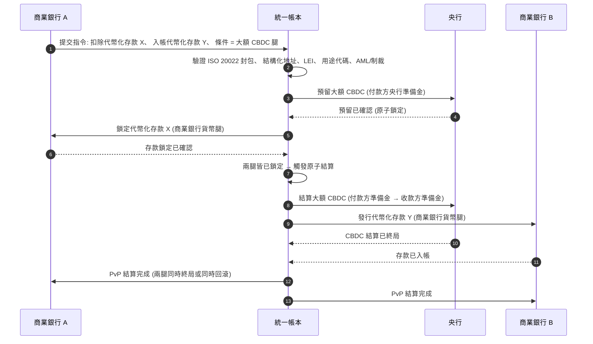

<!-- lead-start: manual -->
<aside class="post-lead" aria-label="文章摘要">

<strong>重點摘要。</strong>2026 年的大額支付處於兩股結構性轉變的交會點:ISO 20022 把結構化支付資料推進營運模式,代幣化存款加上 BIS Project Agorá 則把跨境結算推向原子化、可程式化、全天候運作的軌道。對銀行而言,2026 年的問題已經不是「訊息遷移做完了沒」,而是「支付營運是否可衡量、可路由、可受監督」——本指標把它拆成四項精確百分比:結構化資料完整度、軌道路由最適度、結算終局延遲與 Agorá 走廊覆蓋率。

<strong>關鍵要點</strong>

<ul class="post-lead-takeaways">
  <li><strong>2026 年 11 月是硬性截止日,不是建議。</strong>SWIFT 將於 SR 2026 移除非結構化地址支援;指定欄位中缺少城市與國家的支付會無法清算。修補成本、退件率與營運產能,全都從「指標」升級為「監理可見的姿態」。</li>
  <li><strong>在受監理的大額領域,代幣化存款勝過穩定幣。</strong>它們保留銀行與存款人關係、保留央行結算資產,同時開放可程式化能力。穩定幣仍可在邊緣場景發揮作用;代幣化存款則錨定核心。</li>
  <li><strong>BIS Project Agorá 是跨境走廊的參考標準。</strong>若銀行的跨境產品到 2027 年仍無法在 Agorá 走廊內運作,等於是在市場其他玩家已經撤離的軌道上競爭。</li>
  <li><strong>即時軌道編排就是營運模式。</strong>2026 年的多軌道決策(FedNow / RTP / TIPS / SEPA Inst / 鏈上)並不是「選哪一條」——而是由政策登錄、流動性畫像與路由引擎,逐筆挑選最適合的軌道。</li>
  <li><strong>不衡量自己,就被別人衡量。</strong>四項百分比——結構化資料完整度、軌道路由最適度、結算終局延遲、Agorá 走廊覆蓋率——能在 2026/27 稽核窗口前,把支付姿態轉成監理可採信的證據。</li>
</ul>
</aside>
<!-- lead-end -->

# 2026 大額支付指標:ISO 20022、代幣化存款、即時軌道與跨境結算

2026 年的大額支付正被兩股同時進行的轉變重塑:結構化支付資料與可程式化結算。SWIFT 在 2026 年 11 月的結構化地址里程碑,把資料品質硬性推進營運模式;BIS Project Agorá 與代幣化存款則正在測試跨境結算能否變得更原子化、更透明、且全天候運作。

---

> **執行摘要 / 關鍵要點**
>
> - **2026 年 11 月是硬性資料里程碑。**SWIFT 明確表示,SR 2026 變更後將不再支援含有非結構化地址的支付。
> - **結構化資料成為產品基礎建設。**城市與國家至少必須落在指定欄位,把支付資料品質變成客戶、營運與合規共同的議題。
> - **代幣化存款是大額設計選項。**Project Agorá 探索的是,在統一帳本模型中結合代幣化商業銀行存款與代幣化央行準備金。
> - **指標應衡量結算品質,而不只是速度。**終局性、透明度、修補率、流動性使用、合規資料與客戶可見度,與即時執行同等重要。
> - **跨境支付仍是公私部門共同議題。**FSB 持續透過實施階段推動 G20 路線圖,並協調公私部門的合作。
>
---

## 為什麼 2026 是本指標的關鍵年份

史丹佛 AI Index 之所以有用,是因為它把一個快速演變的技術領域視為可被衡量的對象:研究產出、技術績效、負責任部署、經濟、產業採用、政策與公眾觀感被收進同一個框架([Stanford HAI ⧉](https://hai.stanford.edu/ai-index/2026-ai-index-report "The 2026 AI Index Report"))。銀行與金融機構,如今同樣需要把這套紀律施加在基礎建設上。智能體 AI、量子安全、雲端原生韌性與大額支付,已經不再是各自獨立的創新軌道;它們正在收斂成單一營運模式。

對銀行而言,實務問題不是每個領域是否重要。而是機構能否在同一時間衡量所有領域的準備度。一家銀行可以部署智能體 AI,卻因密碼學尚未具備遷移能力而仍然脆弱;可以現代化雲端平台,卻因支付資料仍未結構化而失敗;可以推動代幣化試點,卻因結算、流動性、身分與稽核日誌層未被一起設計,而製造系統性風險。

## 2026 指標架構

| 指標層 | 2026 方向 | 準備度指標 | 處置不當的風險 |
|---|---|---|---|
| **ISO 20022 資料** | 從非結構化文字走向受治理的結構化欄位 | 結構化地址準備度與退件率 | 支付退件與人工修補 |
| **軌道編排** | 在 RTGS、即時、代理行、穩定幣與代幣化軌道之間路由 | 成本、速度、終局性與依司法管轄區的路由 | 軌道分裂、控管重複 |
| **代幣化結算** | 在能降低摩擦的場景使用代幣化存款與央行貨幣 | DvP、PvP、原子結算覆蓋率 | 試點資產缺乏業務流程價值 |
| **流動性** | 優化日間流動性、卡住的現金與結算時段 | 流動性節省與結算失敗下降 | 流動性更快被抽乾 |
| **合規** | 將 AML、制裁、FATF 與稽核要求嵌入支付資料 | 直通式合規與可解釋性 | 資料更豐富但護欄機制未強化 |

## 對應全球優先事項的關鍵大額支付訊號

2026 年的訊號集不是研究議程,而是銀行支付長已經被衡量的交付清單。整補工作會出現在三個位置:訊息封包、軌道編排層,以及結算帳本。

| 訊號 | G20 / SWIFT / BIS 對應依據 | 技術平台落地方式 |
|---|---|---|
| **65% 的支付訊息仍含非結構化地址** | [SWIFT SR 2026——2026 年 11 月結構化地址里程碑 ⧉](https://www.swift.com/news-events/news/iso-20022-milestone-november-2026-unstructured-addresses-be-removed "ISO 20022 November 2026 structured address milestone") | 在訊息抵達 SWIFTNet 介接器之前,於支付中介層做結構驗證;於企業通路與代理行入口做自動化地址解析。 |
| **FSB G20 目標:2027 年前 75% 的跨境支付在 1 小時內完成** | [FSB 跨境支付路線圖——2026 年實施階段 ⧉](https://www.fsb.org/2026/03/fsb-kicks-off-new-implementation-phase-to-enhance-cross-border-payments-through-public-private-partnership/ "FSB cross-border payments implementation phase") | 具備預先約定流動性時段的即時 FX 換匯閘道;將 T+0 確認鉤入客戶入口;軌道路由引擎排除任何無法滿足 1 小時包絡線的走廊。 |
| **FSB G20 目標:跨境交易平均成本低於 1%,零售低於 3%** | [FSB G20 量化目標 ⧉](https://www.fsb.org/2026/03/fsb-kicks-off-new-implementation-phase-to-enhance-cross-border-payments-through-public-private-partnership/ "FSB cross-border payments implementation phase") | 對每條走廊做成本歸因遙測(FX 價差、代理行費、抬升成本);利潤政策登錄在報價前就揭露不合規定價。 |
| **BIS Project Agorá 進入原型階段,涵蓋七家央行與 41 家商業銀行** | [BIS Project Agorá ⧉](https://www.bis.org/about/bisih/topics/fmis/agora.htm "Project Agorá") | 統一帳本整合規格:代幣化存款帳本節點 + 大額 CBDC 結算平面 + KYC/AML 鉤子;鏈上流動性池依銀行走廊佔比配置規模。 |
| **德意志銀行「數位貨幣」框架在客戶架構中具體落地** | [Deutsche Bank——數位貨幣:穩定幣、代幣化存款與 CBDC ⧉](https://flow.db.com/publications/flow-white-papers-and-guides/digital-money-a-perspective-on-stablecoins-tokenised-deposits-and-cbdcs "Digital Money: stablecoins, tokenised deposits and CBDCs") | 不綁定錢包的結算 API,逐筆抽象化穩定幣 / 代幣化存款 / CBDC 的選擇;可程式化條件依銀行的政策登錄(而非客戶端)驗證。 |

## 支付資料的拐點

ISO 20022 已經從訊息格式專案,演進成資料品質的營運模式。若受款人、付款人、收款人、智能體、城市、國家、用途與當事方資料疲弱,銀行將出現退件、修補、制裁摩擦、客戶不滿與分析能力疲弱。

**SR 2026 把這件事變成硬性契約,不再只是指引。**SWIFT Standards Release 2026(2026 年 11 月)會在網路層強制執行結構化地址規則——`<PstlAdr>` 元素若未攜帶 `<TwnNm>` 與 `<Ctry>` 的訊息,會在 SWIFTNet 驗證堆疊端被收件方退件,而不是被標記為待修補。修補佇列不再是後台成本項,而是一筆客戶可見延遲的結算失敗事件。把 SR 2026 當作「指引收緊」在處理的營運團隊,用的是錯的操作手冊。

### ISO 20022 下的結構化支付資料合規

整補面積很窄、定義明確。下列 XML 元素,就是 2026 年 11 月 SWIFTNet 驗證堆疊真正會退件的位置;其餘都只是下游後果。

| 資料元素 | ISO 20022 XML 標籤 | 2026 年 11 月 SWIFT 要求 | 技術整補策略 |
|---|---|---|---|
| **結構化地址** | `<PstlAdr>` 內含 `<TwnNm>` + `<Ctry>` | 強制。非結構化的 `<AdrLine>` 文字會在收件方 SWIFTNet 介接器觸發網路退件。 | 在支付發起當下做自動化地址解析;改寫企業通路表單;於下一筆扣款前對每個交易對手做存量資料清洗。 |
| **法人識別碼 (LEI)** | `<OrgId>` 之下的 `<Id>` | 高度建議用於非自然人金融交易對手驗證;在多條 CBPR+ 走廊中強制。 | 在企業上線時做 LEI 查詢 + GLEIF 交叉比對;透過參考資料服務自動補全存量交易對手。 |
| **支付用途代碼** | `<Purp>` 內含 `<Cd>` | 在多條區域即時走廊(CBPR+、SEPA Inst、TIPS)中強制,用於自動化 AML / 制裁篩查。 | 把銀行內部既有交易代碼對應到標準 ISO 20022 ExternalPurposeCode 清單;在企業通路 UI 露出用途選擇;未知代碼預設拒絕。 |
| **最終當事方** | `<UltmtDbtr>` / `<UltmtCdtr>` | 揭露最終受益人脈絡以滿足 G20 FATF 旅行規則 + 制裁參數;在多種支付類型代碼下強制。 | 從帳本子科目擷取端對端當事方姓名;與 KYC 圖譜對帳;在每一筆確認上露出最終當事方。 |
| **匯款資訊(結構化)** | `<RmtInf><Strd>` 含 `<RfrdDocInf>` | 在 CBPR+ Phase 2 下,可對帳的發票連結式企業支付為必填。 | 在企業入口報價當下擷取結構化匯款資訊;高金額流量拒絕自由文字回退。 |

## 代幣化存款與大額 CBDC

代幣化存款保留商業銀行貨幣模型,同時加入可程式化能力。大額央行貨幣則保留結算終局性。有趣的設計模式是兩者的組合:商業銀行貨幣承擔客戶關係與信用中介,央行貨幣承擔最終結算與系統性信心。

Project Agorá 把這個組合具體化。下方架構是 BIS 的參考模式,描繪一筆原子化、付款對付款(PvP)的跨境結算:同時動用一條商業銀行存款帳本與一條大額 CBDC 結算平面,並透過統一帳本協調。

結算依結構即是原子化:兩腿同時提交,或同時回滾。大額 CBDC 腿的結算最終性,讓商業銀行的代幣化存款轉移在沒有代理行風險的情況下生效。統一帳本是協調平面,而非一個自成體系的支付系統——央行仍然發行結算資產,商業銀行仍然入帳存款負債。

## 新的大額支付產品

如今的產品已不只是「一筆支付」。它是執行、資料、流動性、合規、可追溯性與例外管理的綜合包。能透過 API 與客戶儀表板把這些能力對外開放的銀行,就能把基礎建設合規變成客戶價值。

## 對不同類型銀行的意義

### 全球系統重要性銀行

全球銀行應把本指標視為企業架構記分卡。重點不是再做一個概念驗證,而是要拿得出證據:自主性工作流、密碼學遷移、雲端依賴與支付現代化,可被當作單一風險與價值體系一起治理。

### 交易銀行與企業銀行

交易銀行應聚焦於大額支付、結構化資料、流動性、代幣化存款與智能體財務管理服務。最有價值的客戶主張不是更快的資金移動,而是可解釋、可被稽核日誌追蹤、可程式化的資金移動——減少查詢往返,並提供更佳的營運資金可見度。

### 區域銀行

區域銀行應藉本指標避免專案無限擴張。它們不需要在每個前沿都領先,但需要在 AI 治理、後量子盤點、雲端退出證據與支付資料準備度上,具備可信的定位。

### 金融科技、PSP 與基礎建設供應商

金融科技與基礎建設供應商應將產品藍圖,對齊銀行可被衡量的準備度。最好的主張會降低整合風險、強化證據,並讓銀行更容易治理複雜的基礎建設。

## 結論

指標型報告的價值,在於把一個碎裂的技術議程,轉成一個可被衡量的營運模式。2026 年,金融基礎建設的贏家不會是試點最多的機構,而是能同時就自主性、安全、韌性、結算、經濟與治理證明準備度的機構。

## 常見問題

**為什麼到 2026 年 ISO 20022 仍是議題?**

因為唯有支付資料被結構化、被治理、在源頭被擷取,並能在通路、客戶與市場基礎建設之間使用,遷移才算真正完成。

**什麼是代幣化存款?**

代幣化存款是商業銀行貨幣的數位表徵,設計上保留銀行與存款人關係,同時讓結算可程式化。

**代幣化存款會取代穩定幣嗎?**

並非到處取代。穩定幣在部分數位資產與跨境情境仍可能有用;但在受監理的大額銀行業務中,代幣化存款在結構上更具吸引力。

**銀行應該衡量什麼?**

衡量結構化資料準備度、支付退件、修補成本、結算時間、流動性使用、軌道路由結果與客戶可見度。

## 參考資料

- SWIFT, (2026). [ISO 20022 November 2026 structured address milestone ⧉](https://www.swift.com/news-events/news/iso-20022-milestone-november-2026-unstructured-addresses-be-removed "ISO 20022 November 2026 structured address milestone").
- BIS Innovation Hub, (2026). [Project Agorá ⧉](https://www.bis.org/about/bisih/topics/fmis/agora.htm "Project Agorá").
- FSB, (2026). [Cross-border payments implementation phase ⧉](https://www.fsb.org/2026/03/fsb-kicks-off-new-implementation-phase-to-enhance-cross-border-payments-through-public-private-partnership/ "Cross-border payments implementation phase").
- Deutsche Bank, (2026). [Digital Money: stablecoins, tokenised deposits and CBDCs ⧉](https://flow.db.com/publications/flow-white-papers-and-guides/digital-money-a-perspective-on-stablecoins-tokenised-deposits-and-cbdcs "Digital Money: stablecoins, tokenised deposits and CBDCs").

<!-- enrich-start -->
<aside class="author-card" aria-label="關於作者"><strong class="author-card-name"><a href="/about/index.html">Sebastien Rousseau</a></strong>資深銀行科技人,長期撰寫應用 AI、支付基礎建設、代幣化貨幣、ISO 20022、後量子安全、雲端原生金融服務與受監理數位市場等主題。在 HSBC 商業與投資銀行、PayPal、Barclays、Shazam、AKQA、Virgin Group 等機構累積 20 年以上經驗。<a href="/about/index.html">完整檔案</a> &middot; <a href="https://www.linkedin.com/in/sebastienrousseau/" rel="external noopener">LinkedIn</a> &middot; <a href="https://github.com/sebastienrousseau" rel="external noopener">GitHub</a></aside>

最後審閱 <time datetime="2026-06-06">2026-06-06</time>。

<!-- enrich-end -->
