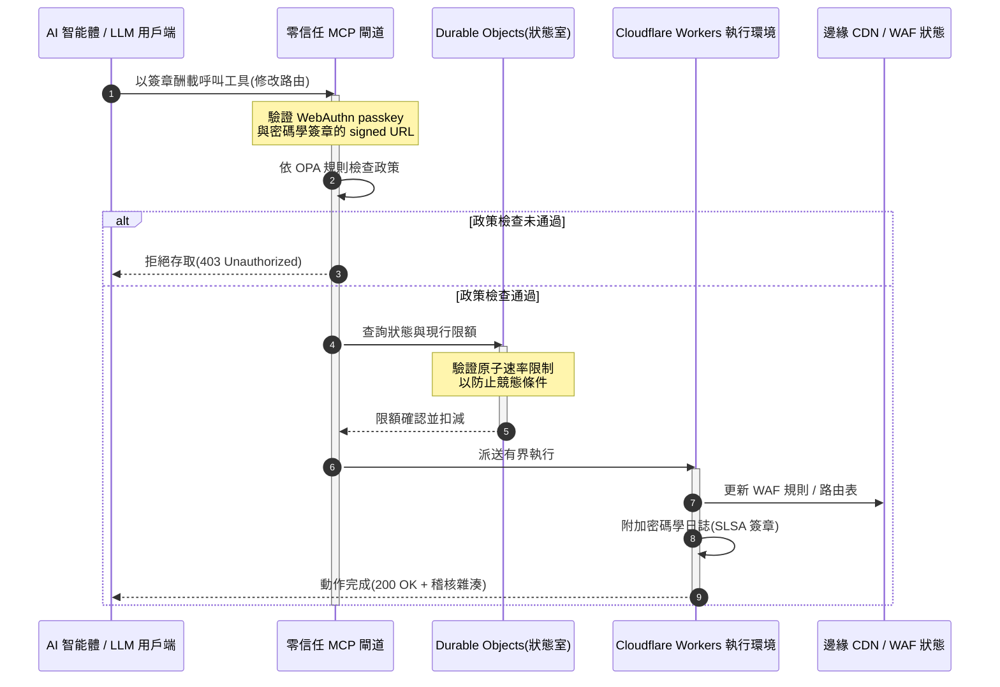

# CloudCDN:2026 年 AI原生邊緣的開源藍圖

<!-- lead-start: manual -->
<aside class="post-lead" aria-label="文章摘要">

<strong>重點速覽。</strong>2026 年的企業技術,由全球分散式無伺服器執行與智能體 AI 的匯流所定義。為靜態檔案快取與基本流量路由而生的標準 CDN,在主動、即時資料協調的時代已屬結構性過時。CloudCDN 是一份開源藍圖,將邊緣重新定位為主動控制平面:無伺服器執行環境、透過 Cloudflare Durable Objects 的有狀態協調,以及零信任的模型上下文協定(Model Context Protocol,MCP)閘道,讓自主 AI 智能體在有界、以密碼學保障的操作範圍內運行 Web 基礎設施。

<strong>關鍵要點</strong>

<ul class="post-lead-takeaways">
  <li><strong>從靜態快取到有界控制平面。</strong>CloudCDN 把操作邊界移至邊緣,將 CDN 節點轉為主動政策閘,於次毫秒內執行安全、路由與存取控制決策。</li>
  <li><strong>有狀態的邊緣協調。</strong>Cloudflare Durable Objects 在全球強制執行原子、即時的速率限制與狀態協調——沒有分散式競態條件,也沒有跨邊緣區域的系統性限額濫用。</li>
  <li><strong>經 MCP 的安全智能體基礎設施管理。</strong>零信任閘道暴露 42 項專用 MCP 工具,讓 AI 智能體在密碼學簽章的邊界內檢查、設定並運行基礎設施。</li>
  <li><strong>供應鏈安全是管線交付物。</strong>每次發布皆透過 Sigstore/Cosign 產生 SLSA Level 3 建置來源證明,並有 3,185 項單元測試與 100% 覆蓋率。</li>
  <li><strong>董事會層級的證據,而非儀表板。</strong>邊緣遙測直接對應 DORA 第 5 條董事會問責、BCBS 239 風險報告與 Basel III 作業風險資本規則。</li>
</ul>

<strong>延伸閱讀:</strong><a href="/2026-05-16-best-cloud-infrastructure-architecture-2026/">2026 年最佳雲端基礎架構:金融服務的 AI原生藍圖</a> · <a href="/2026-06-05-cloud-native-banking-index-dora-resilience-platform-engineering-2026/">2026 年雲端原生銀行指數:DORA、平台工程與營運韌性</a> · <a href="/2026-06-03-agentic-ai-index-banks-autonomy-governance-auditability-2026/">2026 年銀行智能體 AI 指數:自主性、治理與可稽核性</a>

</aside>
<!-- lead-end -->

CDN 的辯論已經結束。邊緣不再是快取;它是 AI原生軟體的控制平面。當智能體呼叫工具、搬動資料、清除快取、請求 signed URLs 並協調工作流時,以不透明儀表板與專屬控制平面為核心的舊模式,不再只是不便,而成為監理責任。CloudCDN 主張一種不同的模式:一個開放、可檢查、可由智能體控制的邊緣平台,把安全、無障礙、效能與可稽核性視為可強制執行的預設,而非廠商承諾。

本文的開源參考點為 [cloudcdn.pro ⧉](https://github.com/sebastienrousseau/cloudcdn.pro "cloudcdn.pro")。該儲存庫是一個可端到端閱讀並獨立部署的多租戶、AI原生 CDN:在 Cloudflare PoP 上低於 100 毫秒的 TTFB、MCP 控制、Durable Objects 速率限制、WCAG-AA 無障礙、signed URLs、passkeys、SLSA Level 3,以及 3,185 項測試與 100% 覆蓋率。

---

> **董事會摘要 / 關鍵要點**
>
> - **邊緣成為操作邊界。**CloudCDN 把標準 CDN 節點轉為主動政策閘,於次毫秒內執行安全、路由與存取控制。
> - **Durable Objects 讓速率限制具原子性。**即時、全球一致的限額執行,關閉了最終一致性限制器留給攻擊者與失常智能體的競態條件窗口。
> - **智能體透過 42 項有界 MCP 工具運行基礎設施。**每次呼叫在任何執行發生之前,皆經 WebAuthn passkeys、簽章酬載與 OPA 政策驗證。
> - **供應鏈是產品的一部分。**透過 Sigstore/Cosign 的 SLSA Level 3 來源證明,以密碼學方式把每次發布連結至其經稽核的原始碼。
> - **遙測即法遵證據。**邊緣操作直接對應 DORA 第 5 條、BCBS 239 與 Basel III 作業風險資本——是直接對應,而非事後報告。
>
---

## 為何此開源專案在 2026 年重要

2026 年的企業 IT 已從靜態基礎設施佈建,轉向即時、事件驅動的資料協調。兩股市場力量推動這項轉變。

其一是智能體 AI 的擴散。自主模型與軟體智能體如今執行複雜的操作任務——自動化威脅緩解、路由決策、即時帳本平衡。它們不用儀表板。它們呼叫工具。

其二是[數位營運韌性法案(DORA)⧉](https://eur-lex.europa.eu/legal-content/EN/TXT/?uri=CELEX%3A32022R2554 "歐盟金融部門數位營運韌性法規 (EU) 2022/2554")的正式執法。銀行機構不能再仰賴不透明的專屬第三方 CDN。監理機關要求對軟體供應鏈的完整可見性、可驗證的退出能力,以及不可竄改的密碼學稽核軌跡。

集中式伺服器架構帶來即時協調無法吸收的延遲代價。專屬 CDN 是黑盒子,讓機構暴露於自己看不見、更無從舉證的供應鏈入侵。CloudCDN 以透明、零信任的開源藍圖補上這個缺口,把邊緣變成主動控制平面。對技術高層而言,它把對話從法遵成本轉向韌性回報(Return on Resilience):由自動化、隨時可稽核的營運管線所保全的資本。

## 架構視角

CloudCDN 架構分為五個層級,以局域化、有狀態的邊緣原語取代集中式中介軟體:

| 層級 | 設計決策 | 為何重要 | 處理不當的風險 |
|---|---|---|---|
| **邊緣執行環境** | Cloudflare Workers 與 Pages | 消除集中式 VM 延遲;在全球以次毫秒執行政策 | 只有效能改善而無政策紀律,將產生混亂的邊緣漂移 |
| **狀態協調** | Durable Objects | 保證跨區域速率限制與共享狀態的原子、即時一致性 | 分散式競態條件、API 資源濫用、被繞過的邊界限額 |
| **智能體介面** | 零信任 MCP 閘道 | 暴露 42 項專用 MCP 工具,讓 AI 智能體在受治理邊界內運行基礎設施 | 無界的工具呼叫與未經授權的組態變更 |
| **存取控制** | WebAuthn passkeys 與 signed URLs | 以密碼學簽章取代靜態密碼,使操作可稽核 | 歸屬薄弱的變更;憑證遭竊導致邊界失守 |
| **品質閘** | SLSA Level 3 與 100% 測試覆蓋率 | 以數學方式驗證建置來源;阻擋惡意依賴注入 | 惡意程式碼經由軟體供應鏈植入 |

## 值得追蹤的營運訊號

邊緣就緒度是可量測的。以下量化指標展示的是執行能力,而非意圖:

| 訊號 | 指標/基準 | 監理參照 | 平台實作 |
|---|---|---|---|
| **42 項 MCP 工具** | 用於自動化管理的有界工具註冊表數量 | COBIT 2019 (BAI06) | MCP 閘道依 OPA 政策驗證智能體簽章 |
| **Durable Objects** | 零洩漏、次毫秒的原子限額執行 | DORA 第 6 條 | Durable Objects 追蹤全球 API 限額狀態 |
| **Passkeys 與 signed URLs** | 100% 管理工作階段經 FIDO2 WebAuthn 驗證 | DORA 第 30 條 | 內嵌於邊緣路由器的密碼學簽章檢查 |
| **SLSA Level 3** | 密碼學簽章的建置清單(Sigstore) | DORA 第 30 條 | GitHub Actions 管線產生簽章建置中繼資料 |
| **3,185 項單元測試** | 100% 覆蓋率;每次發布皆有回歸閘 | NIST CSF 2.0 (PR.DS-01) | CI 管線在任何測試失敗時中止部署 |

## CDN 成為主動控制平面

傳統 CDN 圍繞被動、靜態的內容加速而設計。CloudCDN 重新定義這個模式。整合 Cloudflare Workers 與 Durable Objects 之後,邊緣即是主動、有狀態的政策閘。

當 AI 智能體或自動化流程請求基礎設施組態變更或路由調整時,它不會與脆弱的集中式資料庫對話。請求在最近的邊緣節點被攔截,並在任何執行發生之前,依序通過身份、政策與限額檢查:

該序列中的每一步都產生可歸屬、有簽章的紀錄。這就是「加速內容的 CDN」與「可被治理的控制平面」之間的差別。

## 開源如何改變信任模式

對資訊安全長而言,不透明的專屬 CDN 是不斷複利的風險。閉源邊緣網路是黑盒子:若廠商內部遭入侵,在事件公開揭露之前,銀行毫無可見性。

CloudCDN 以建立在三項機制上、可完整稽核的開源信任模式,取代這種不對稱:

1. **數學化的建置來源證明。**在 SLSA Level 3 之下,每次發布都以密碼學方式連結至其開源 GitHub 儲存庫。CISO 可以用數學、而非契約,驗證在 Cloudflare 全球邊緣節點上執行的二進位檔,內容正是經稽核的原始碼。
2. **持續、公開的安全稽核。**程式碼庫持續接受自動化掃描、公開漏洞揭露與同儕審查的程式碼稽核。隱匿不是控制;審查才是。
3. **無廠商鎖定(DORA 第 28 條)。**DORA 要求銀行證明對關鍵第三方供應商有明確、經測試的退出策略。由於 CloudCDN 是開源且建構在標準無伺服器原語之上,機構可將邊緣組態從 Cloudflare 遷移至其他無伺服器執行環境或私有 Kubernetes 叢集——並向監理機關舉證這項能力。

## 銀行級邊緣模式

CloudCDN 以符合全球金融部門法遵標準為工程目標,把技術性邊緣操作直接對應到監理機關實際檢查的框架:

- **模型風險管理([美國聯準會 SR 11-7 ⧉](https://www.federalreserve.gov/supervisionreg/srletters/sr1107.htm "模型風險管理監理指引")/英國 PRA SS1/23)。**執行操作任務的自主模型落入模型風險治理範圍。CloudCDN 的 MCP 閘道把智能體工具當作量化模型對待:嚴格的政策邊界、即時日誌,以及高影響動作的強制人工覆核。
- **BCBS 239(風險資料彙總)。**透過在邊緣擷取、標記並結構化交易資料,營運指標得以即時產生——符合 BCBS 239 對資料完整性、即時性與監理可追溯性的要求。
- **DORA 第 5 條(董事會問責)。**董事會對營運韌性負最終個人責任。CloudCDN 把邊緣遙測轉為量化、可驗證的證據,讓非技術背景的董事也能帶進個人責任稽核。
- **Basel III 作業風險資本。**銀行需就作業風險持有監理資本。自動化災難復原切換與 SLSA Level 3 來源證明降低機構的作業風險輪廓——在資產負債表上保全資本,而不只是通過稽核。

## 對各類銀行的意義

### 全球系統重要性銀行(G-SIB)

G-SIB 在多個司法管轄區運行龐大的交易量。優先事項是以單一、統一的邊緣平面取代碎片化的舊式邊界控制。部署 CloudCDN 模式,讓 G-SIB 得以在全球標準化安全政策、API 閘道與智能體治理——並讓 DORA 合規證據管線成為日常營運的副產品,而非每季的倉促趕工。

### 交易銀行與企業金融銀行

對交易銀行而言,面向客戶的產品是執行速度、安全與資料透明度的組合。CloudCDN 模式讓這些銀行能向企業財資長提供安全的 API 儀表板與即時資金追蹤服務——以具韌性的邊緣態勢守住企業存款。

### 區域與中小型銀行

區域銀行面對與 G-SIB 相同的威脅行為者,卻沒有同等的工程預算。一份開源、銀行級的邊緣藍圖直接內建這些控制:無需專屬授權費用即可立即對齊監理要求,並有原始碼可資證明。

## 董事會行動手冊

營運韌性不再是隱形的後台 IT 指標,而是附帶個人責任的董事會優先事項。2026 年能持續贏得監理機關、客戶與股東信任的機構,把技術當作可驗證、可觀測的資產。

給資深技術主管的路線圖很短:

1. **把證據當產品來要求。**為邊緣的自動化、自我記錄管線編列預算——證據由營運產生,而非為稽核員拼湊。
2. **轉向有狀態的邊緣控制。**把速率限制、WAF 與身份驗證從集中式伺服器移至原子級邊緣原語。
3. **建立密碼學的智能體邊界。**對每一次自動化工具呼叫,強制執行具 passkey 與 OPA 驗證的零信任 MCP 閘道。
4. **要求開源建置稽核。**把 SLSA Level 3 建置來源證明列為部署條件,而非願景。

## 常見問題

**CloudCDN 是否已準備好接受 DORA 稽核?**

是。CloudCDN 的設計可自動產出法遵證據,直接對應資訊登錄冊(Register of Information)的 ITS 範本(RT.01 至 RT.15)與 DORA 第 30 條契約條款。

**以 Durable Objects 進行速率限制的優勢是什麼?**

傳統分散式速率限制器仰賴最終一致性,留下攻擊者或失常智能體可利用的延遲窗口。Durable Objects 在全球保證即時、原子的一致性,徹底關閉競態條件窗口。

**CloudCDN 何以稱為 AI原生?**

它的 MCP 控制操作與感知智能體的控制模型。基礎設施透過 42 項受治理的工具運行,並具備密碼學身份與政策邊界——為自主工作流而設計,而非僅限人用的儀表板。

**開源程式碼會增加零時差漏洞的風險嗎?**

不會。專屬、閉源的 CDN 仰賴隱匿式安全。CloudCDN 的程式碼庫持續接受自動化測試、公開同儕審查與 SLSA Level 3 驗證——這是可驗證的更高信任門檻。

## 參考資料

- European Parliament and Council of the European Union, (2022). [歐盟金融部門數位營運韌性法規 (EU) 2022/2554(DORA)⧉](https://eur-lex.europa.eu/legal-content/EN/TXT/?uri=CELEX%3A32022R2554 "歐盟金融部門數位營運韌性法規 (EU) 2022/2554(DORA)"). 布魯塞爾:歐盟官方公報。
- Basel Committee on Banking Supervision (BCBS), (2013). [有效風險資料彙總與風險報告原則(BCBS 239)⧉](https://www.bis.org/publ/bcbs239.htm "有效風險資料彙總與風險報告原則(BCBS 239)"). 巴塞爾:國際清算銀行。
- Board of Governors of the Federal Reserve System, (2011). [模型風險管理監理指引(SR Letter 11-7)⧉](https://www.federalreserve.gov/supervisionreg/srletters/sr1107.htm "模型風險管理監理指引(SR Letter 11-7)"). 華盛頓特區:聯邦準備理事會。
- Cloudflare, (2026). [Durable Objects 文件:有狀態邊緣協調 ⧉](https://developers.cloudflare.com/durable-objects/ "Durable Objects 文件"). 舊金山:Cloudflare。
- Cloudflare, (2026). [以 MCP、驗證授權與 Durable Objects 建構 AI 智能體 ⧉](https://blog.cloudflare.com/building-ai-agents-with-mcp-authn-authz-and-durable-objects/ "以 MCP、驗證授權與 Durable Objects 建構 AI 智能體").
- GitHub, (2026). [cloudcdn.pro 儲存庫 ⧉](https://github.com/sebastienrousseau/cloudcdn.pro "cloudcdn.pro 儲存庫").

<!-- enrich-start -->
<aside class="author-card" aria-label="關於作者"><strong class="author-card-name"><a href="/about/index.html">Sebastien Rousseau</a></strong>資深銀行技術專家,撰寫主題涵蓋應用 AI、支付基礎建設、代幣化貨幣、ISO 20022、後量子安全、雲端原生金融服務、開源基礎設施,以及受監管的數位市場。在 HSBC Commercial &amp; Investment Bank、PayPal、Barclays、Shazam、AKQA、Virgin Group 擁有 20 多年經驗。<a href="/about/index.html">完整簡介</a> &middot; <a href="https://www.linkedin.com/in/sebastienrousseau/" rel="external noopener">LinkedIn</a> &middot; <a href="https://github.com/sebastienrousseau" rel="external noopener">GitHub</a></aside>

最近審閱 <time datetime="2026-06-11">2026-06-11</time>。

<!-- enrich-end -->
