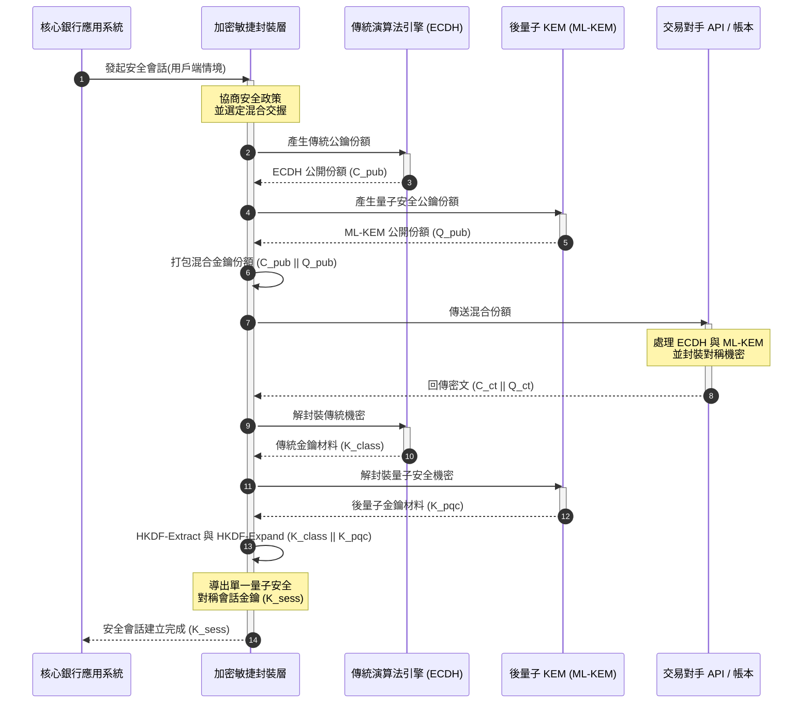

# KyberLib 與後量子銀行遷移 2026:從標準到程式碼

<!-- lead-start: manual -->
<aside class="post-lead" aria-label="文章摘要">

<strong>重點速覽。</strong> 2026 年的銀行基礎建設面臨一項終點明確的系統性威脅:量子級運算將破解目前保護傳輸流量的 RSA 與 ECC 金鑰交換。聯邦標準與監理政策文件已喚起警覺,技術執行卻仍各自為政。<a href="https://github.com/sebastienrousseau/kyberlib">KyberLib</a> 是一份開源工程藍圖,把後量子敘事落實為具體、記憶體安全的 Rust 程式碼——在具加密敏捷性的抽象邊界之後實作 NIST 標準化的 ML-KEM(FIPS 203),讓機構能在「Store Now, Decrypt Later」攻擊觸及其資料檔案庫之前,完成傳輸安全與金鑰封裝的升級。

<strong>關鍵要點:</strong>

<ul class="post-lead-takeaways">
  <li><strong>從政策到可檢查的程式碼。</strong> KyberLib 將後量子密碼學從抽象的策略路線圖,推進為具體、高效能、可稽核的 Rust 實作。</li>
  <li><strong>標準化的 FIPS 203 ML-KEM 執行。</strong> 該函式庫實作 ML-KEM——NIST FIPS 203 定稿的金鑰建立演算法——使合規性與全球監理期待保持一致。</li>
  <li><strong>以設計內建加密敏捷性。</strong> 穩定的抽象邊界讓銀行應用系統能更換加密原語,免去昂貴且易出錯的應用改寫。</li>
  <li><strong>Rust 帶來的記憶體安全。</strong> 編譯期所有權規則根除困擾傳統 C 系加密函式庫的緩衝區溢位與記憶體洩漏,且維持零成本抽象的速度。</li>
  <li><strong>降低受託責任風險。</strong> 可觀測、可測試的遷移證據,給予董事 DORA 第 5 條個人課責稽核所要求的「合理措施」紀錄。</li>
</ul>

<strong>延伸閱讀:</strong> <a href="/2026-05-18-quantum-cryptography-standards-developments-2026/">量子加密標準 2026</a>、<a href="/2026-05-28-dora-ai-act-data-sovereignty-banking-compliance-stack-2026/">DORA + AI Act 法遵堆疊</a>、<a href="/2026-05-20-cloud-native-banking-financial-institutions-2026/">雲端原生銀行</a>。

</aside>
<!-- lead-end -->

後量子遷移已不再是規劃演練。2026 年它是進行中的營運要求,而監理意圖與工程執行之間的落差,正是風險所在。[KyberLib ⧉](https://github.com/sebastienrousseau/kyberlib "kyberlib") 補上其中一段落差:一個面向正式環境、記憶體安全的 Rust 函式庫,依 FIPS 203 定稿參數實作 ML-KEM,並以銀行交易系統真正需要的加密敏捷邊界加以封裝。

---

> **董事會摘要 / 關鍵要點**
>
> - **威脅已在運作中。** 攻擊者今日就在執行「Store Now, Decrypt Later」竊存;一旦具密碼破解能力的量子電腦問世,資料機密性將回溯性地失守。
> - **標準已經定稿。** NIST FIPS 203(ML-KEM)與 FIPS 204(ML-DSA)給予稽核委員會明確、可測試的基準——「等標準出爐」的辯解已不存在。
> - **KyberLib 是工程藍圖。** 記憶體安全的 Rust、為 HSM 與智慧卡準備的 `no_std` 編譯,以及維持傳統互通性的混合交握模式。
> - **加密敏捷性才是持久目標。** 穩定的抽象邊界讓原語更換不必改寫應用——這是比任何單一演算法更長壽的教訓。
> - **責任落在董事會。** DORA 第 5 條將個人責任課予董事;可檢查、可觀測的遷移程式碼,正是足以交代的證據。
>
---

## 為何這個開源專案在 2026 年重要

隨著非對稱密碼學步向淘汰,威脅並不會等到具密碼破解能力的量子電腦建成才出現。攻擊者現在就在執行 **「Store Now, Decrypt Later」(SNDL)** 攻擊——竊存企業銀行交易、營業祕密與機構通訊的加密傳輸串流,意圖在量子能力成熟後解密。對銀行而言,今日線路上的每一次傳統交握,都是一筆引爆日期延後的機密外洩。

監理機關已端出具體義務:

1. **DORA 第 6 條(ICT 風險管理)** 要求機構對其密碼資產全面測繪、辨識並緩解弱點——包括埋在中介軟體裡、從未被盤點過的非對稱金鑰交換。
2. **NIST FIPS 203 與 204** 確立金鑰封裝(ML-KEM)與數位簽章(ML-DSA)的官方後量子標準,給予稽核委員會衡量遷移進度的標準化基準。

要在不中斷營運的前提下執行這場遷移,必須超越政策文件,走向**可檢查的開源密碼基礎建設**。[KyberLib ⧉](https://github.com/sebastienrousseau/kyberlib "kyberlib") 提供的正是這個:一個符合 FIPS 203、記憶體安全的 Rust 函式庫,把後量子轉型化為可量測、可驗證的工程管線——並將技術投資的討論導向具體的韌性報酬。

## 架構觀點

KyberLib 位於穩定的 API 邊界之後,使銀行核心交易應用系統免受低階加密原語變動的影響。

| 層級 | 設計決策 | 重要原因 | 處理不當的風險 |
|---|---|---|---|
| **原語** | FIPS 203 ML-KEM 金鑰封裝 | 以晶格結構取代傳統 Diffie-Hellman 與 RSA 金鑰交換 | 不符 FIPS 203 定稿參數,導致法遵稽核不通過 |
| **語言** | 記憶體安全的 Rust 實作 | 消除 C/C++ 常見的記憶體毀損漏洞(緩衝區溢位、use-after-free) | 依賴項蔓延危及建置鏈完整性 |
| **抽象** | 穩定的加密敏捷邊界 | 應用系統可在統一介面後隨標準演進更換演算法 | 寫死的原語迫使每一次未來遷移都得人工改寫 |
| **部署** | 混合加密交握 | 以雙重封裝信封結合後量子 KEM 與傳統演算法 | 喪失既有互通性,或出現無聲的組態漂移 |
| **保證** | SLSA Level 3 來源證明與可檢查的測試 | 保證程式碼來源與出處;範例可逐行稽核 | 安全劇場——黑箱函式庫的實作錯誤在正式環境才浮現 |

## 應追蹤的營運訊號

要向監理董事會與主管機關證明後量子合規,必須追蹤具體、可量化的指標:

| 訊號 | 指標 | 監理參照 | 平台實作 |
|---|---|---|---|
| **FIPS 203 ML-KEM 合規** | 100% 符合定稿參數(ML-KEM-512/768/1024) | NIST FIPS 203 | 於 KyberLib 模組內編譯、經參數驗證的晶格密碼學 |
| **密碼資產清冊** | 完整盤點所有系統的非對稱金鑰交換使用情形 | NIST SP 1800-38 | 自動化掃描代理程式將使用中的加密套件記錄至中央註冊庫 |
| **混合金鑰交換** | 傳輸層交握以混合信封執行的百分比 | DORA 第 6 條 | 網路代理以 PQC 封裝包覆傳統 TLS 1.3 交握 |
| **`no_std` 編譯** | 可在不依賴 Rust 標準函式庫下為受限目標編譯 | DORA 第 30 條 | KyberLib 針對硬體安全模組(HSM)的條件式 `no_std` 編譯 |
| **加密敏捷性指數** | 跨 API 閘道更換一個加密原語所需的分鐘數 | UK PRA SS1/23 | 以執行期變數管理演算法配置的抽象路由註冊庫 |

## 為何 Rust 對後量子密碼學重要

實作 ML-KEM 這類後量子演算法,需要在多項式環上進行複雜的低階數學運算。以往要讓這些運算達到正式環境的速度,只能靠手寫 C/C++ 或組合語言——在銀行最承受不起出錯的程式碼裡,留下巨大的記憶體毀損攻擊面。

Rust 從三個具體面向改變密碼工程的資安態勢:

1. **編譯期記憶體安全。** Rust 的所有權模型保證緩衝區溢位、重複釋放與 use-after-free 錯誤在編譯期即被阻斷。這對後量子函式庫格外關鍵,因為其金鑰與密文尺寸遠大於傳統演算法。
2. **確定性的零成本抽象。** Rust 編譯為原生機器碼且不依賴垃圾回收機制,執行速度與記憶體足跡可比肩甚至超越 C 系函式庫,同時保有安全性。
3. **`no_std` 相容性。** KyberLib 可在不依賴 Rust 標準函式庫下編譯,因此能在受限的裸機環境運行——包括硬體安全模組與智慧卡——讓銀行等級的密碼運算留在實體安全邊界之內。

## 設計具加密敏捷性的架構

加密遷移的經典失敗模式是寫死:演算法相關的假設直接嵌進應用邏輯,每逢轉型才被痛苦地重新挖出。2026 年的持久目標是**加密敏捷性**——一層把演算法視為可更換模組、藏在穩定介面後的抽象,讓下一次遷移成為組態變更,而非全資產規模的改寫。

下方序列圖展示 KyberLib 的加密敏捷封裝層,如何協調一次混合(傳統加後量子)金鑰交換交握:

混合信封是營運上最關鍵的細節。在後量子原語累積多年正式環境檢驗之前,會話金鑰同時取自傳統與後量子兩份機密:攻擊者必須同時破解 ECDH **與** ML-KEM 才能還原通道。尚未遷移的交易對手照常運作;已遷移的交易對手則立即獲得晶格級保護。

## 董事會行動手冊

後量子安全不是後台的加密議題,而是攸關個人責任的董事會治理課題。高階主管應以受託責任框架看待這場遷移:

- **DORA 第 5 條(治理與組織)** 將 ICT 安全的個人責任課予董事會。開源、可觀測的測試,正是個人責任稽核索取的直接證據——「我們選用了可檢查的 FIPS 203 實作,這是它的合規測試紀錄」站得住腳;「供應商向我們保證過」站不住。
- **模型風險管理(美國 Fed SR 11-7 / 英國 PRA SS1/23)** 適用於加密封裝架構,程度不亞於定價模型。抽象層應通過模型風險管理驗證,包括極端中斷情境下的效能表現。
- **Basel III 作業風險資本** 獎勵已被驗證的控制成熟度。經過測試的混合交握可降低機構的長期作業風險輪廓,削減資本溢價,釋出資產負債表空間供資金部門主動運用。

## 對各類銀行的意義

### 全球系統重要性銀行(G-SIB)

G-SIB 背負大量傳統交易系統,其關鍵瓶頸在於發現:確切知道非對稱金鑰交換實際發生在哪裡。依 NIST SP 1800-38 指引建立持續性的密碼資產清冊是第一步;KyberLib 隨後提供標準化、記憶體安全的函式庫,在清冊揭露的每一個現代節點上執行後量子金鑰封裝。

### 交易銀行與企業金融銀行

支付軌道上的機密性就是業務命脈。由於 KyberLib 可編譯至裸機 `no_std` 目標,交易銀行能將後量子交握直接部署到邊緣的支付路由與流動性管理硬體之中——而不僅止於應用層。

### 區域型與中小型銀行

區域型機構面對同樣的國家級竊存威脅,卻沒有 G-SIB 的研究預算。一份可檢查的開源 Rust 實作,讓它們無須與黑箱供應商談判路線圖,即可立即取得通往 NIST FIPS 203 合規的現成路徑。

## 從路線圖到可編譯的程式碼

後量子轉型是進行中的工程任務;能在 2026 年持續贏得監理機關、交易對手與企業財務長信任的機構,是那些從抽象路線圖走向可觀測、可編譯程式碼的機構。高層的行動指令隨之而來:稽核既有的金鑰交換節點、在最高價值的通道部署混合交握,並建立讓未來每一次原語更換都成為例行作業的穩定抽象邊界。KyberLib 把上述每一步都化為可量測的營運能力,而非簡報上的承諾。

## 常見問題

**KyberLib 是否符合 NIST 定稿標準?**

是。KyberLib 圍繞 FIPS 203 定稿的 ML-KEM 參數設計,使編譯後的函式庫與聯邦及全球監理期待保持一致。

**後量子函式庫需要特殊硬體嗎?**

不需要。KyberLib 的 Rust 實作可編譯至標準系統架構。其 `no_std` 能力更讓它能在需要實體金鑰保管的專用硬體安全模組與智慧卡上運行。

**「Store Now, Decrypt Later」如何影響當前的法遵?**

若傳輸層仍仰賴傳統 RSA 或 ECC,攻擊者今日即可竊存流量,待量子能力成熟後解密。現在部署混合金鑰交換,可讓被攔截的資料持續受晶格級保護。

**為何採用混合交握,而非直接全面改用後量子原語?**

混合信封同時以傳統與後量子兩份機密導出會話金鑰,除非兩者同時被破解,安全性依然成立。這在新原語累積正式環境檢驗的同時,保留與未遷移交易對手的互通性。

## 參考資料

- National Institute of Standards and Technology, (2024). [FIPS 203:模組晶格金鑰封裝機制標準 ⧉](https://www.nist.gov/news-events/news/2024/08/nist-releases-first-3-finalized-post-quantum-encryption-standards "NIST FIPS 203 公告").
- Board of Governors of the Federal Reserve System, (2011). [模型風險管理監理指引(SR Letter 11-7) ⧉](https://www.federalreserve.gov/supervisionreg/srletters/sr1107.htm "Federal Reserve SR 11-7").
- European Parliament and Council of the European Union, (2022). [歐盟金融部門數位營運韌性規則(EU)2022/2554(DORA) ⧉](https://eur-lex.europa.eu/legal-content/EN/TXT/?uri=CELEX%3A32022R2554 "DORA 規則").
- NIST National Cybersecurity Center of Excellence, (2025). [後量子密碼學遷移(NIST SP 1800-38) ⧉](https://www.nccoe.nist.gov/projects/migration-post-quantum-cryptography "NIST SP 1800-38").
- GitHub, (2026). [kyberlib 開源程式庫 ⧉](https://github.com/sebastienrousseau/kyberlib "kyberlib 程式庫").

<!-- enrich-start -->
<aside class="author-card" aria-label="關於作者"><strong class="author-card-name"><a href="/about/index.html">Sebastien Rousseau</a></strong>資深銀行技術專家,撰寫主題涵蓋應用 AI、支付基礎建設、代幣化貨幣、ISO 20022、後量子安全、雲端原生金融服務、開源基礎建設,以及受監管的數位市場。在 HSBC Commercial &amp; Investment Bank、PayPal、Barclays、Shazam、AKQA、Virgin Group 擁有 20 多年經驗。<a href="/about/index.html">完整簡介</a> &middot; <a href="https://www.linkedin.com/in/sebastienrousseau/" rel="external noopener">LinkedIn</a> &middot; <a href="https://github.com/sebastienrousseau" rel="external noopener">GitHub</a></aside>

最近審閱 <time datetime="2026-06-12">2026-06-12</time>。

<!-- enrich-end -->
