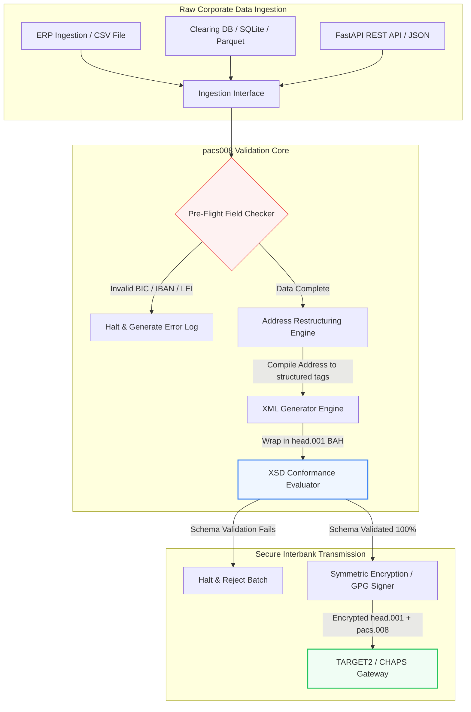

---

# Front Matter (YAML)

author: "contact@sebastienrousseau.com (Sebastien Rousseau)"
banner_alt: "辦公室人員搭配語音助理與筆電——象徵 pacs.008 自動化所實現的結構化、可被機器解讀的銀行間支付訊息"
banner_height: "1597"
banner_width: "2584"
banner: "https://cloudcdn.pro/stocks/images/tyler-prahm-lmV3gJSAgbo.webp"
cdn: "https://cloudcdn.pro"
charset: "UTF-8"
cname: "sebastienrousseau.com"
copyright: "© Copyright 2025 - 2026 - Sebastien Rousseau. All rights reserved."
date: "June 15, 2026"
description: "Pacs008 是開源 Python 函式庫,自動化 ISO 20022 pacs.008 FI-to-FI 客戶信用轉帳的產生與驗證——結構化地址、BAH head.001 封裝、BIC/LEI/IBAN 校驗碼、OpenTelemetry UETR 追蹤——為 2026 年 11 月 SWIFT 截止日打造。"
format-detection: "telephone=no"
hreflang: "zh-hant"
icon: "https://cloudcdn.pro/clients/sebastienrousseau/v1/logos/sebastienrousseau.svg"
id: "https://sebastienrousseau.com/2026-06-15-pacs008-automation-iso-20022-interbank-payments-2026"
image_alt: "Sebastien Rousseau 黑白肖像"
image_height: "162"
image_width: "162"
image: "https://cloudcdn.pro/stocks/images/sebastienrousseau.webp"
keywords: "pacs008, ISO 20022 pacs.008, FI-to-FI 客戶信用轉帳, 結構化地址, SWIFT CBPR+, BAH head.001, TARGET2, CHAPS, Fedwire, DORA, BCBS 239, Basel III, UETR, LEI 驗證, SEPA VoP"
language: "zh-Hant"
last_reviewed: "2026-06-15"
layout: "report"
locale: "zh_TW"
logo_alt: "Sebastien Rousseau 標誌"
logo_height: "44"
logo_width: "44"
logo: "https://cloudcdn.pro/clients/sebastienrousseau/v1/logos/sebastienrousseau.svg"
menu: ""
measurementID: "G-169G4ET5HQ"
name: "Sebastien Rousseau"
permalink: "https://sebastienrousseau.com/2026-06-15-pacs008-automation-iso-20022-interbank-payments-2026"
rating: "general"
referrer: "no-referrer"
robots: "index, follow"
schema: "FAQPage, Article"
seo_title: "ISO 20022 時代的 pacs.008 自動化"
short_name: "sebastienrousseau"
subtitle: "pacs.008 訊息正是銀行間支付資料、結構化地址、合規、路由與結算營運的交會點。"
tags: "pacs008, ISO 20022, 銀行間支付, 大額支付, Python"
theme-color: "0, 83, 191"
title: "在 2026 年打造 ISO 20022 銀行間時代的 pacs.008 自動化"
url: "https://sebastienrousseau.com/2026-06-15-pacs008-automation-iso-20022-interbank-payments-2026"
viewport: "width=device-width, initial-scale=1, shrink-to-fit=no"

# RSS - The RSS feed front matter (YAML).
atom_link: "https://sebastienrousseau.com/2026-06-15-pacs008-automation-iso-20022-interbank-payments-2026/rss.xml"
category: "Finance"
docs: https://validator.w3.org/feed/docs/rss2.html
generator: "Static Site Generator (SSG) (version 0.0.26)"
item_description: "Pacs008 以開源 Python 為基礎,在銀行間支付時代自動化 ISO 20022 FI-to-FI 客戶信用轉帳訊息。"
item_guid: "https://sebastienrousseau.com/2026-06-15-pacs008-automation-iso-20022-interbank-payments-2026/rss.xml"
item_link: "https://sebastienrousseau.com/2026-06-15-pacs008-automation-iso-20022-interbank-payments-2026/rss.xml"
item_pub_date: "Mon, 15 Jun 2026 06:06:06 +0000"
item_title: "在 2026 年打造 ISO 20022 銀行間時代的 pacs.008 自動化"
last_build_date: "Mon, 15 Jun 2026 06:06:06 +0000"
managing_editor: "contact@sebastienrousseau.com (Sebastien Rousseau)"
pub_date: "Mon, 15 Jun 2026 06:06:06 +0000"
ttl: "60"
type: "article"
webmaster: "contact@sebastienrousseau.com"

# Apple - The Apple front matter (YAML).
apple_mobile_web_app_orientations: "portrait"
apple_touch_icon_sizes: "192x192"
apple-mobile-web-app-capable: "yes"
apple-mobile-web-app-status-bar-inset: "black"
apple-mobile-web-app-status-bar-style: "black-translucent"
apple-mobile-web-app-title: "ISO 20022 時代的 pacs.008 自動化"
apple-touch-fullscreen: "yes"

# MS Application - The MS Application front matter (YAML).

msapplication-navbutton-color: "0, 83, 191"

# Twitter Card - The Twitter Card front matter (YAML).

twitter_card: "summary_large_image"
twitter_creator: "@wwdseb"
twitter_description: "Pacs008 以開源 Python 為基礎,在銀行間支付時代自動化 ISO 20022 FI-to-FI 客戶信用轉帳訊息。"
twitter_image: "https://cloudcdn.pro/clients/sebastienrousseau/v1/logos/sebastienrousseau.svg"
twitter_image_alt: "Sebastien Rousseau 標誌"
twitter_site: "@wwdseb"
twitter_title: "ISO 20022 時代的 pacs.008 自動化"
twitter_url: "https://sebastienrousseau.com/2026-06-15-pacs008-automation-iso-20022-interbank-payments-2026"

excerpt: "pacs008 是一套開源 Python 工具包,讓 ISO 20022 FI-to-FI 客戶信用轉帳訊息可被程式化操作——結構化地址、驗證、路由、合規勾點,以及 SWIFT 2026 年 11 月截止日皆內建為預設值。"

# Humans.txt - The Humans.txt front matter (YAML).
author_website: "https://sebastienrousseau.com"
author_twitter: "@wwdseb"
author_location: "London, UK"
thanks: "感謝您的閱讀!"
site_last_updated: "2026-06-15"
site_standards: "HTML5, CSS3, RSS, Atom, JSON, XML, YAML, Markdown, TOML"
site_components: "Kaishi, Kaishi Builder, Kaishi CLI, Kaishi Templates, Kaishi Themes"
site_software: "Static Site Generator, Rust"

---

# 在 2026 年以開源 Python 自動化 ISO 20022 pacs.008 銀行間支付

<!-- lead-start -->
<aside class="post-lead" aria-label="文章摘要">

<strong>重點速覽。</strong>在 SWIFT CBPR+ 指引下,2026 年 11 月 14 日的結構化地址截止點將在 TARGET2、CHAPS、Fedwire、Lynx 與 SEPA 全面退役非結構化郵政地址。Pacs008 是一套開源 Python 函式庫,自動化 ISO 20022 FI-to-FI 客戶信用轉帳(pacs.008)訊息的產生與驗證,將支付封裝於 Business Application Header(BAH head.001)信封中,並在訊息抵達清算網路前,將結構化地址合規性內建於資料路徑之中。

<strong>關鍵要點</strong>

<ul class="post-lead-takeaways">
  <li><strong>結構化地址截止日是不可妥協的硬邊界。</strong>2026 年 11 月 14 日之後,非結構化地址區塊將退場。Pacs008 在資料組裝階段就強制要求結構化郵政地址元素(<code>&lt;TwnNm&gt;</code>、<code>&lt;Ctry&gt;</code>、<code>&lt;PstCd&gt;</code>),以避免邊界退件。</li>
  <li><strong>統一的訊息編排。</strong>將核心 pacs.008 支付資料封裝在符合規範的 Business Application Header(head.001)信封中,提供標準化的雙向處理模型。</li>
  <li><strong>演算法完整性。</strong>內建以 ISO 7064 Modulo 97-10 校驗碼計算為基礎的 BIC 與 Legal Entity Identifier(LEI)驗證器。</li>
  <li><strong>DORA 等級的可追溯性。</strong>完整的 OpenTelemetry 儀控以 Unique End-to-End Transaction Reference(UETR)為主鍵,支援即時稽核日誌與密碼學稽核簽章。</li>
  <li><strong>守住董事會層級的受託責任。</strong>將銀行間訊息正確性對齊 DORA 第 5 條、BCBS 239 報告要求,並換取 Basel III 營運風險資本節省。</li>
</ul>

<strong>延伸閱讀:</strong><a href="https://sebastienrousseau.com/2026-05-19-global-wholesale-payments-economics-2026">2026 年全球大額支付:ISO 20022、RTGS 更新與互通性的經濟學</a>、<a href="https://sebastienrousseau.com/2026-05-27-ai-operating-system-payments-fraud-routing-resilience-compliance-2026">支付的作業系統 AI:2026 年的詐欺、路由、韌性與合規</a>、<a href="https://sebastienrousseau.com/2026-05-12-iso-20022-pacs008-structured-address-deadline">2026 年 11 月 pacs.008 結構化地址截止日:六個月視角</a>。

</aside>
<!-- lead-end -->

透過可稽核、依綱要驗證的 Python 管線,銜接傳統金融資料與結構化的銀行間訊息。

本文的開源參考點是 [pacs008 ⧉](https://github.com/sebastienrousseau/pacs008 "pacs008 — 開源 Python 函式庫")。該專案的定位為自動化 ISO 20022 pacs.008 FI-to-FI 客戶信用轉帳 XML 訊息的 Python 函式庫。

## 此開源專案為何在 2026 年具備戰略意義

全球銀行間支付清算基礎建設正歷經近半世紀以來最深刻的現代化轉型。

2026 年 6 月,金融服務業正快速逼近 **2026 年 11 月 14 日的 SWIFT 結構化地址截止點**。自該日起,SWIFT CBPR+ 指引以及 TARGET2、CHAPS、Fedwire 與加拿大 Lynx 將正式退役非結構化郵政地址行(亦即僅使用 `<PstlAdr>` 區塊內的 `<AdrLine>`)。所有參與的金融機構必須以混合格式(結構化的 `<TwnNm>` 與 `<Ctry>`,並至多保留兩個 `<AdrLine>` 用於補充細節)或完全結構化格式(街道名稱、門牌號碼與郵遞區號分屬獨立元素)傳輸地址。未符合此標準的訊息將在網路邊界遭到退件。

對金融機構而言,此次轉換帶來幾項主要的營運壓力:

1. **邊界退件代價。** 未符合結構化地址標準的支付,將立即遭網路退件,引發交易延誤、流動性卡關與營運積壓。
2. **SEPA 受款人驗證(VoP)。** 規定 SEPA 區域內所有支付服務提供者(PSP)在執行信用轉帳前,須驗證受款人姓名與 IBAN 是否相符,在訊息發起階段又增加一道驗證關卡。

[Pacs008](https://github.com/sebastienrousseau/pacs008) 直指此一問題。它是一套開源、輕量化的 Python 函式庫,將原始金融資料自動轉換為完整驗證、符合綱要的 ISO 20022 pacs.008 銀行間客戶信用轉帳訊息。藉由銜接傳統至結構化資料的落差,pacs008 帶來高 Return on Resilience(RoR),保全營運資金,並確保跨全球軌道的即時執行。

## 我為什麼這樣建構 pacs008

`pacs008` 及其上游的姊妹函式庫 `pain001` 都是我寫的，而我的職業生涯投注在批發
支付與 API 產品管理上。這個組合正是這套函式庫呈現今日樣貌的原因，因此把這些取捨
明白說出來，比讓它們隱含在程式碼裡更妥當。

**驗證發生在產生之前，而不是之後。** 多數支付既有系統的本能是先產生報文再檢查，
因為審查流程就是這樣成形的：產出一個檔案，有人查看，例外進入佇列。這個順序注定
缺陷會在槓桿最小的位置被發現——在組裝報文的工作已經完成之後，而且往往是在報文已
經離開機構之後。先驗證意味著不合規的地址或格式錯誤的 IBAN 會成為建置失敗，而不
是網路拒付。

**採用 MIT 授權，是因為銀行必須能讀驗證邏輯，而不是只能信任它。** 封閉的驗證器
要求機構憑信任接受別人對使用指引的解讀。對一個承擔監理義務的團隊提出這種要求並
不合理。這套函式庫裡的每一條規則都可以被檢視、被反駁、被分叉。

**驗證以官方 XSD 綱要為準，而非重新實作一遍。** 手寫的 ISO 20022 規則近似版，
只要任何一方發生變化就會與網路的真實契約產生偏離。綱要本身就是契約；其餘一切都
是等著與之矛盾的第二套真相來源。

**它面向 CI，而不是面向審查環節。** 需要靠人記得去執行的驗證器，正是會在交付壓
力下停止執行的驗證器——而那恰恰是它最重要的時刻。

這套函式庫刻意不做的事同樣出於刻意。它是報文層的工具集。它不取代支付引擎、制裁
篩查系統，也不取代機構必須在源頭完成的客戶主資料治理。它讓這項治理變得可強制執
行，但不替你完成。

## pacs008 的 2026 架構視角

pacs008 函式庫的結構為一座具隔離性的驗證與產生引擎,確保原始輸入能被系統性地解析、補強並封裝於標準信封中:

| 層級 | 設計取捨 | 為何重要 | 處理不當的風險 |
|---|---|---|---|
| **輸入層** | 攝取 CSV、JSON、SQLite 與 Parquet | 直接在銀行整合團隊現有的資料所在處對接,避免平台遷移。 | 攝取未經驗證或已損毀的原始資料負載。 |
| **驗證層** | 對官方 XSD 綱要與自訂業務規則執行起飛前驗證 | 在支付檔案傳送至清算網路前,即停下並標記錯誤。 | 無效的 XML 檔案觸發即時網路退件與清算延誤。 |
| **BAH 信封層** | 自動以 Business Application Header(head.001)封裝 | 根據 `<MsgDefIdr>` 標籤,標準化訊息派送與路由。 | 在未具備外層信封的情況下傳送原始 pacs.008 資料,導致系統退件。 |
| **序列化層** | 支援標準 XML 與符合 ISO 規範的 JSON(TS 23029) | 讓 XML 與 JSON 負載可直接互轉,支援現代 REST API 與 Kafka 串流。 | 出現違反官方 ISO 指引的破碎資料表徵。 |
| **可觀測層** | 以 UETR 為主鍵的 OpenTelemetry 追蹤 | 擷取詳細的執行路徑與日誌,提供即時可稽核性。 | 追蹤缺口阻礙營運可視性與稽核作業。 |

## 關鍵銀行間訊號與監理里程碑

要呈現交易層級的營運韌性,資深科技與風險主管必須追蹤具體、可量化的合規指標:

| 訊號 | 指標 / 營運基準 | G20 / SWIFT / DORA 參照 | 技術平台落地方式 |
|---|---|---|---|
| **結構化地址合規** | 使用完整結構化 `<PstlAdr>` 欄位(含指定 `<TwnNm>` 與 `<Ctry>`)的 pacs.008 訊息佔比。 | SWIFT SR 2026 截止日 | pacs008 在起飛前綱要檢查中退回非結構化地址行。 |
| **SEPA 受款人驗證** | 在訊息執行前驗證受款人姓名與 IBAN 是否相符。 | SEPA VoP Regulation | 內建 VoP 輔助類別,對 IBAN/BIC 執行預先驗證查詢。 |
| **BAH head.001 整合** | 成功封裝於 Business Application Header 的對外支付負載比例。 | TARGET2 / CBPR+ 指引 | BAH 封裝子系統自動組裝外層 XML 信封。 |
| **LEI Modulo 校驗** | 對債務人與債權人 `<LEI>` 區塊執行 ISO 7064 Modulo 97-10 校驗碼驗證。 | Bank of England 指令 | 演算法檢查器驗證 20 字元識別碼的完整性。 |
| **UETR 追蹤準確性** | 所有產生支付皆注入有效 Unique End-to-End Transaction Reference 的比例為 100%。 | SWIFT UETR 規範 | 自動產生並追蹤 36 字元 UUIDv4 參照碼。 |

## Python 為何是銀行間自動化的理想入口

2026 年的現代支付樞紐與資金部營運團隊,在資料轉換、財務建模與 ERP 資料庫整合上高度仰賴 Python。

採用開源 Python 函式庫,可讓金融機構獲得幾項顯著優勢:

1. **低認知負擔且具高互通性。** Python 扮演一座連貫的橋樑。開發者得以撰寫簡潔指令,從傳統資料庫取出原始支付指令,對複雜的國際銀行規則進行驗證,並在單一統一工作流中輸出符合規範的 XML。
2. **擺脫「黑盒」式不透明翻譯器。** 專有銀行門戶往往以高昂授權費提供客製化支付檔案翻譯器。這些翻譯器屬於專有黑盒,讓資安團隊無從稽核資料如何被處理、金鑰存放於何處。像 pacs008 這樣可審視的開源函式庫,則確保程式碼完全透明。
3. **無縫融入 CI/CD。** Pacs008 可直接整合至持續整合與部署管線,讓開發者把支付檔案測試納入標準軟體交付生命週期,完成自動化。

## 設計一條有邊界的銀行間管線

銀行間清算的一項主要弱點,是「未受控的批次產生」——在沒有明確、有邊界的驗證迴圈下產出檔案。pacs008 的設計,正是要做為嚴格控管的多階段交易管線中的核心驗證引擎。

下方營運流程展示原始交易資料如何穿越 pacs008 管線,產生密碼學安全、符合綱要、並封裝於 BAH 信封中的 pacs.008 檔案:

## 董事會劇本與受託責任

銀行間支付自動化是董事會層級的風險管理與公司治理議題。資深主管必須從受託責任與營運風險縮減的視角,處理交易資料品質:

- **DORA 第 5 條(董事會課責)。** 將機構 ICT 營運的韌性與安全直接連動至董事個人責任。由於銀行間清算屬於關鍵企業職能,董事會必須能證明已部署穩固、經過驗證且自動化的交易控制,以避免營運中斷或延遲支付。
- **BCBS 239(風險資料聚合與報告)。** 要求金融交易報告必須準確、完整,並能即時產生。pacs008 透過在源頭以乾淨結構化方式驗證支付資料,協助機構符合 BCBS 239,消除拖累傳統試算表的資料缺口與人工對帳錯誤。
- **減輕營運風險資本附加(Basel III)。** 依 Basel III 規範,高支付錯誤率與人工干預成本會推升銀行的營運風險資本要求,使原本可用於放款或投資的資本被綁住。將支付管線自動化,可直接壓低這些資本溢價,守住資產負債表的價值。

## 對不同類型銀行的意義

### 全球系統性重要銀行(G-SIB)

G-SIB 處理龐大的跨境企業交易量。其首要挑戰,是在資料抵達清算網路之前,對非結構化的傳統資料進行修復。將 pacs008 整合至企業銀行閘道,G-SIB 即可為其企業客戶提供自動化驗證工具,降低人工修復支付的負擔,並在 SWIFT 網路上守住即時執行。

### 交易銀行與企業銀行

對交易銀行而言,支付資料品質就是競爭差異化。透過向企業資金部客戶提供 pacs008 這類開源、可審視的驗證工具,銀行可加速客戶上線、降低支付檔案退件率,並以更高的直通處理率建立信任。

### 區域與中小型銀行

區域銀行必須在缺乏 G-SIB 等級科技預算的條件下,維持對國際支付標準的合規。pacs008 提供一套輕量、低成本且完全合規的 Python 解決方案,讓較小機構也能在不購買昂貴專有中介軟體授權的前提下,提供現代化、結構化的支付發起能力。

## 結論:銀行間清算路線圖

即將到來的 SWIFT 2026 年 11 月結構化地址截止日,代表企業資金部營運的一道硬邊界。仰賴傳統試算表、人工輸入與非結構化支付檔案,本身就是一項實質的業務風險。

要守住交易連續性、壓低營運成本,資深科技與財務主管應在今天就啟動明確的清算路線圖:

1. **在源頭強制驗證。** 規定所有支付指令在離開企業 ERP 邊界前,皆須依據官方 ISO 20022 XSD 綱要完成驗證與格式化。
2. **稽核資料管線。** 擺脫人工試算表處理,改採基於 pacs008 的自動化、可審視 Python 工作流。
3. **落實混合式安全。** 確保產生的支付檔案在傳輸前已完成密碼學簽章與加密,以符合零信任網路的要求。
4. **對齊受託優先順序。** 將支付自動化與資料品質指標正式呈報至董事會,把該項投資定位為 DORA 框架下的關鍵營運風險縮減計畫。

## 常見問題

**pacs008 是否符合即將上路的 SWIFT SR 2026 地址規範?**

是。pacs008 在設計上即支援嚴格的 SWIFT 2026 年 11 月結構化地址里程碑,強制將郵政地址元素(城市、國家、郵遞區號)分離至指定的 ISO 20022 XML 欄位。

**pacs008 能否將支付負載封裝於 Business Application Header?**

可以。pacs008 原生支援 Business Application Header(BAH head.001)封裝,會自動組裝 TARGET2、CHAPS 與 CBPR+ 網路所要求的外層信封。

**為何開源函式庫優於專有檔案翻譯器?**

專有翻譯器是不透明的黑盒,無從進行安全稽核。像 pacs008 這樣經同儕審查的開源函式庫,則提供完整程式碼透明度,讓資安團隊能夠驗證敏感支付資料在處理過程中未遭暴露。

**pacs008 驗證哪些識別碼?**

pacs008 內建 Bank Identifier Code(BIC)與 Legal Entity Identifier(LEI)的驗證器,採用 ISO 7064 Modulo 97-10 校驗碼計算,另外提供 IBAN 校驗碼驗證與 UETR 唯一性檢查。

## 參考資料

- SWIFT, (2024). *ISO 20022 November 2026 Structured Address Milestone*. La Hulpe: SWIFT. 可參閱:[SWIFT ISO 20022 里程碑 ⧉](https://www.swift.com/standards/iso-20022/iso-20022-bytes/call-action-november-2026 "SWIFT ISO 20022 里程碑").
- Basel Committee on Banking Supervision (BCBS), (2013). *Principles for effective risk data aggregation and risk reporting (BCBS 239)*. Basel: Bank for International Settlements. 可參閱:[BCBS 239 原則 ⧉](https://www.bis.org/publ/bcbs239.htm "BCBS 239 原則").
- European Parliament and Council of the European Union, (2022). *Regulation (EU) 2022/2554 on digital operational resilience for the financial sector (DORA)*. Brussels: Official Journal of the European Union. 可參閱:[DORA 規則 ⧉](https://eur-lex.europa.eu/legal-content/EN/TXT/?uri=CELEX%3A32022R2554 "DORA 規則").
- GitHub, (2026). *pacs008 開源程式碼倉庫*. 可參閱:[pacs008 程式碼倉庫 ⧉](https://github.com/sebastienrousseau/pacs008 "pacs008 程式碼倉庫").

<!-- enrich-start -->
<aside class="author-card" aria-label="關於作者"><strong class="author-card-name"><a href="/about/index.html">Sebastien Rousseau</a></strong>資深銀行技術專家,撰寫主題涵蓋應用 AI、ISO 20022 遷移、金融服務的後量子密碼學,以及大額支付的結構性轉型。於 HSBC Commercial &amp; Investment Bank、PayPal、Barclays、Shazam、AKQA、Virgin Group 累積 20 多年經驗。<a href="/about/index.html">完整簡介</a> &middot; <a href="https://www.linkedin.com/in/sebastienrousseau/" rel="external noopener">LinkedIn</a> &middot; <a href="https://github.com/sebastienrousseau" rel="external noopener">GitHub</a></aside>

最近審閱 <time datetime="2026-06-15">2026-06-15</time>。

<aside class="related-posts" aria-labelledby="related-heading">
<h2 id="related-heading" class="related-heading">延伸閱讀</h2>

<article class="related-card"><footer class="related-body"><h3><a href="https://sebastienrousseau.com/2026-05-19-global-wholesale-payments-economics-2026">2026 年全球大額支付:ISO 20022、RTGS 更新與互通性的經濟學</a></h3>
<time datetime="2026-05-19">2026-05-19</time>
</footer></article>
<article class="related-card"><footer class="related-body"><h3><a href="https://sebastienrousseau.com/2026-05-27-ai-operating-system-payments-fraud-routing-resilience-compliance-2026">支付的作業系統 AI:2026 年的詐欺、路由、韌性與合規</a></h3>
<time datetime="2026-05-27">2026-05-27</time>
</footer></article>
<article class="related-card"><footer class="related-body"><h3><a href="https://sebastienrousseau.com/2026-05-12-iso-20022-pacs008-structured-address-deadline">2026 年 11 月 pacs.008 結構化地址截止日:六個月視角</a></h3>
<time datetime="2026-05-12">2026-05-12</time>
</footer></article>

</aside>
<!-- enrich-end -->
