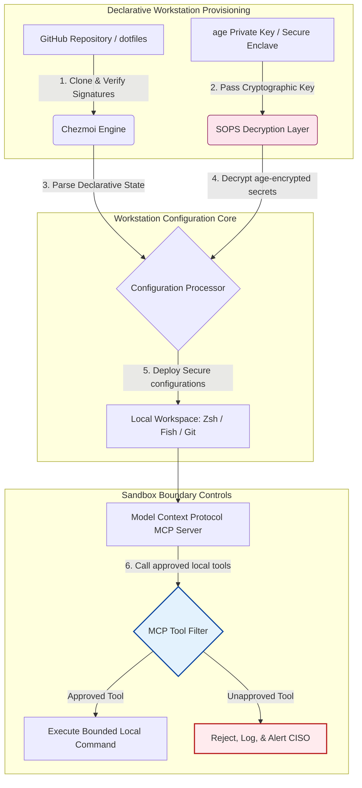

---

# Front Matter (YAML)

author: "contact@sebastienrousseau.com (Sebastien Rousseau)"
banner_alt: "低光環境下的開發者工作站——象徵具 AI 意識、可重現、安全的 dotfiles,涵蓋 MCP 伺服器、SLSA 簽章、age/SOPS 密鑰與多 shell 一致性"
banner_height: "1597"
banner_width: "2584"
banner: "https://cloudcdn.pro/stocks/images/almas-salakhov-Vq2ap8aFFEs.webp"
cdn: "https://cloudcdn.pro"
charset: "UTF-8"
cname: "sebastienrousseau.com"
copyright: "© Copyright 2025 - 2026 - Sebastien Rousseau. All rights reserved."
date: "June 16, 2026"
description: "AI 意識 dotfiles 是 MCP 時代的安全、可重現工作站模式——以 Chezmoi 進行宣告式組態、SOPS/age 密鑰、SLSA Level 3 來源證明、多 shell 一致性,並為本機 AI 代理設下沙箱邊界。"
format-detection: "telephone=no"
hreflang: "zh-hant"
icon: "https://cloudcdn.pro/clients/sebastienrousseau/v1/logos/sebastienrousseau.svg"
id: "https://sebastienrousseau.com/2026-06-16-ai-aware-dotfiles-secure-reproducible-workstation-2026"
image_alt: "Sebastien Rousseau 的黑白肖像"
image_height: "162"
image_width: "162"
image: "https://cloudcdn.pro/stocks/images/sebastienrousseau.webp"
keywords: "dotfiles, Chezmoi, MCP, Model Context Protocol, SLSA, SOPS, age 加密, 宣告式組態, 開發者工作站, DORA 第 5 條, NIST CSF 2.0, 供應鏈安全, 代理式 AI, 多 shell 一致性, Zsh, Fish, Nushell"
language: "zh-Hant"
last_reviewed: "2026-06-16"
layout: "report"
locale: "zh_TW"
logo_alt: "Sebastien Rousseau 的識別標誌"
logo_height: "44"
logo_width: "44"
logo: "https://cloudcdn.pro/clients/sebastienrousseau/v1/logos/sebastienrousseau.svg"
menu: ""
measurementID: "G-169G4ET5HQ"
name: "Sebastien Rousseau"
permalink: "https://sebastienrousseau.com/2026-06-16-ai-aware-dotfiles-secure-reproducible-workstation-2026"
rating: "general"
referrer: "no-referrer"
robots: "index, follow"
schema: "FAQPage, Article"
seo_title: "2026 AI 意識 dotfiles:安全的開發者工作站"
short_name: "sebastienrousseau"
subtitle: "開發者工作站已成為 AI 供應鏈的一環;dotfiles 需要具備安全、可重現性、密鑰紀律與 MCP 意識的工作流。"
tags: "dotfiles, 開發者工具, MCP, SLSA, 安全工作站, chezmoi, macOS, Linux, WSL"
theme-color: "0, 83, 191"
title: "2026 年的 AI 意識 dotfiles:為 MCP、SLSA 與多 shell 一致性打造安全、可重現的開發者工作站"
url: "https://sebastienrousseau.com/2026-06-16-ai-aware-dotfiles-secure-reproducible-workstation-2026"
viewport: "width=device-width, initial-scale=1, shrink-to-fit=no"

# RSS - The RSS feed front matter (YAML).
atom_link: "https://sebastienrousseau.com/2026-06-16-ai-aware-dotfiles-secure-reproducible-workstation-2026/rss.xml"
category: "Technology"
docs: https://validator.w3.org/feed/docs/rss2.html
generator: "Static Site Generator (SSG) (version 0.0.26)"
item_description: "深入剖析宣告式 dotfiles 如何在 macOS、Linux 與 WSL 上打造安全、可重現的開發者工作站,結合 MCP 意識、SLSA、age、SOPS 與多 shell 一致性。"
item_guid: "https://sebastienrousseau.com/2026-06-16-ai-aware-dotfiles-secure-reproducible-workstation-2026/rss.xml"
item_link: "https://sebastienrousseau.com/2026-06-16-ai-aware-dotfiles-secure-reproducible-workstation-2026/rss.xml"
item_pub_date: "Tue, 16 Jun 2026 06:06:06 +0000"
item_title: "2026 年的 AI 意識 dotfiles:為 MCP、SLSA 與多 shell 一致性打造安全、可重現的開發者工作站"
last_build_date: "Tue, 16 Jun 2026 06:06:06 +0000"
managing_editor: "contact@sebastienrousseau.com (Sebastien Rousseau)"
pub_date: "Tue, 16 Jun 2026 06:06:06 +0000"
ttl: "60"
type: "article"
webmaster: "contact@sebastienrousseau.com"

# Apple - The Apple front matter (YAML).
apple_mobile_web_app_orientations: "portrait"
apple_touch_icon_sizes: "192x192"
apple-mobile-web-app-capable: "yes"
apple-mobile-web-app-status-bar-inset: "black"
apple-mobile-web-app-status-bar-style: "black-translucent"
apple-mobile-web-app-title: "AI 意識 dotfiles:安全工作站"
apple-touch-fullscreen: "yes"

# MS Application - The MS Application front matter (YAML).

msapplication-navbutton-color: "0, 83, 191"

# Twitter Card - The Twitter Card front matter (YAML).

twitter_card: "summary_large_image"
twitter_creator: "@wwdseb"
twitter_description: "深入剖析宣告式 dotfiles 如何在 macOS、Linux 與 WSL 上打造安全、可重現的開發者工作站,結合 MCP 意識、SLSA、age、SOPS 與多 shell 一致性。"
twitter_image: "https://cloudcdn.pro/clients/sebastienrousseau/v1/logos/sebastienrousseau.svg"
twitter_image_alt: "Sebastien Rousseau 的識別標誌"
twitter_site: "@wwdseb"
twitter_title: "2026 AI 意識 dotfiles:安全的開發者工作站"
twitter_url: "https://sebastienrousseau.com/2026-06-16-ai-aware-dotfiles-secure-reproducible-workstation-2026"

excerpt: "2026 年的 AI 意識 dotfiles 將開發者工作站視為供應鏈基礎建設——以 chezmoi 管理的宣告式組態,結合 MCP 意識、SLSA 簽章發行、age/SOPS 密鑰、亞秒啟動,以及 macOS/Linux/WSL 一致性。"

# Humans.txt - The Humans.txt front matter (YAML).
author_website: "https://sebastienrousseau.com"
author_twitter: "@wwdseb"
author_location: "London, UK"
thanks: "感謝您的閱讀!"
site_last_updated: "2026-06-16"
site_standards: "HTML5, CSS3, RSS, Atom, JSON, XML, YAML, Markdown, TOML"
site_components: "Kaishi, Kaishi Builder, Kaishi CLI, Kaishi Templates, Kaishi Themes"
site_software: "Static Site Generator, Rust"

---

# 2026 年的 AI 意識 dotfiles:為 MCP、SLSA 與多 shell 一致性打造安全、可重現的開發者工作站

<!-- lead-start -->
<aside class="post-lead" aria-label="文章摘要">

<strong>重點速覽。</strong>開發者工作站不再只是端點;它已是軟體供應鏈中的活躍參與者,也是本機 AI 控制平面的直接介面。終端機型 AI 助手與 <a href="https://modelcontextprotocol.io">Model Context Protocol(MCP)</a> 伺服器會直接執行本機 shell 指令、檢視倉庫,並讀取敏感組態檔。<a href="https://github.com/sebastienrousseau/dotfiles">Sebastien Rousseau 的 Dotfiles</a> 是一套宣告式、開源框架,可在 macOS、Linux 與 Windows Subsystem for Linux(WSL)上建立安全、可重現的工作站——整合 <a href="https://www.chezmoi.io/">Chezmoi</a>、<a href="https://github.com/getsops/sops">SOPS、age</a> 與 SLSA Level 3 建置來源證明,實現記憶體安全的密鑰隔離,並為呼叫 MCP 工具的本機 AI 模型設下有界執行路徑。

<strong>關鍵要點</strong>

<ul class="post-lead-takeaways">
  <li><strong>工作站即供應鏈基礎建設。</strong>開發者環境組態須以與正式環境部署相同的宣告式紀律處理,杜絕人工組態漂移。</li>
  <li><strong>AI 控制平面挑戰。</strong>終端機型 AI 模型與 MCP 工具可存取本機目錄。dotfiles 必須強制執行沙箱邊界、嚴格的工具許可清單,以及不可竄改的本機日誌,以阻止資料外洩。</li>
  <li><strong>絕對的跨平台一致性。</strong>macOS、Linux(Zsh、Fish、Nushell)與 WSL 之間皆採相同、亞秒級的 shell 效能與安全設定檔,將開發者入職時間從數週壓縮至數分鐘。</li>
  <li><strong>密碼學等級的密鑰隔離。</strong>SOPS 與 age 檔案加密防止寫死的憑證(GitHub token、雲端存取金鑰)被提交至 Git 或被本機 LLM 讀取。</li>
  <li><strong>董事會層級的受託價值。</strong>將工作站組態合規轉化為清晰的董事會優先事項,支援 DORA 第 5 條、NIST CSF 2.0 端點標準與 Basel III 作業風險的降低。</li>
</ul>

<strong>延伸閱讀:</strong><a href="https://sebastienrousseau.com/2026-05-23-agentic-payments-banking-consent-liability-new-payment-ux-2026">2026 年銀行業的代理式支付:同意、責任與新支付 UX</a>、<a href="https://sebastienrousseau.com/2024-03-12-revolutionising-real-time-speech-recognition-on-macos-with-openai-whisper/index.html">macOS 上的快速即時語音辨識:OpenAI Whisper</a>、<a href="https://sebastienrousseau.com/2024-02-26-google-gemma-ai-transforming-open-source-ai-development/index.html">Google Gemma AI:重塑開源 AI 開發</a>。

</aside>
<!-- lead-end -->

在本機 AI 模型與代理式開發者工具的時代,銜接宣告式工作站組態與安全軟體供應鏈之間的落差。

本文的開源參照點為 [dotfiles ⧉](https://github.com/sebastienrousseau/dotfiles "dotfiles——宣告式工作站組態")。該倉庫定位為:面向 macOS、Linux 與 WSL 的宣告式 dotfiles,提供多 shell 一致性、亞秒啟動、SLSA 簽章發行,以及具備 AI/MCP 意識的組態。

## 為何此開源專案在 2026 年具備戰略意義

到了 2026 年 6 月,開發者工作站已是軟體供應鏈中最脆弱的一環,也是高度成熟的國家級與犯罪型網路集團眼中的高價值目標。

隨著終端機型 AI 程式設計助手(如 Claude Code)的崛起與 Model Context Protocol(MCP)的採用,開發環境的安全形勢已徹底改變。本機開發者終端如今承載著主動、自主的 AI 代理,具備下列能力:

- 讀取與編輯本機原始碼檔案。
- 呼叫本機 CLI 工具(`git`、`npm`、`aws`、`kubectl`)。
- 檢視 shell 環境變數、本機資料庫與組態設定。

若開發者本機環境缺乏嚴格邊界,這些自主 AI 工具可能無意間讀取敏感個人資料、將雲端憑證外洩至公開 LLM API,或在自動化建置中執行惡意套件。

依據《數位營運韌性法》(DORA)與 NIST 網路安全框架(CSF)2.0,金融機構在法律上必須驗證每一台存取軟體供應鏈裝置的來源與安全完整性。「雪花型筆電」——人工設定、未經稽核、組態不斷漂移——已不再符合全球銀行業標準。

[Sebastien Rousseau 的 Dotfiles](https://github.com/sebastienrousseau/dotfiles) 解決了這個問題。它是一套開源、宣告式的工作站管理框架,可建立安全、可重現的開發者工作站。透過強制執行一致且可稽核的組態基準,本專案提供高韌性回報(Return on Resilience,RoR),將開發者入職時間從數週縮短至數小時,並保護敏感的金融供應鏈免於端點漏洞侵害。

## 2026 年 AI 意識工作站的架構視角

dotfiles 框架以一個安全、宣告式的環境管理器運作——所有本機 shell、工具與密鑰皆受系統化管理、稽核與隔離:

| 層次 | 設計決策 | 為何重要 | 處理不當的風險 |
|---|---|---|---|
| **配置層** | 透過 Chezmoi 進行宣告式組態管理 | 在 macOS、Linux 與 WSL 上建立完全可重現的工作站,杜絕漂移。 | 未經稽核、存在漏洞本機狀態的雪花型組態。 |
| **shell 層** | 多 shell 一致性(Zsh、Fish、Nushell) | 確保不同環境下相同、亞秒級的啟動表現與一致的別名行為。 | shell 指令行為不一致,造成腳本結果出乎預期。 |
| **密鑰層** | 以 SOPS 與 age 進行檔案加密 | 防止寫死的憑證與原始金鑰被提交至 Git 或暴露給本機 LLM。 | 憑證流入公開倉庫歷史,或遭本機代理破解。 |
| **AI/MCP 層** | Model Context Protocol 邊界控制 | 將本機 AI 代理限縮於核可工具清單,並記錄所有本機執行。 | 無界的 AI 代理在本機執行失控或破壞性指令。 |
| **供應鏈層** | SLSA 簽章發行與 Sigstore 驗證 | 以密碼學方式證明引導腳本與組態檔的真實性。 | 遭竄改的安裝腳本將惡意後門注入開發者環境。 |

## 關鍵工作站安全與自動化訊號

要在開發者環境中維持絕對安全,資訊安全長(CISO)與技術主管必須追蹤特定、可量化的營運指標:

| 訊號 | 指標 / 營運基準 | NIST CSF / DORA 參照 | 技術平台實作 |
|---|---|---|---|
| **工作站可重現性** | 完全由宣告式 dotfile 倉庫管理、無組態漂移的開發者筆電比例。 | NIST CSF 2.0(PR.DS-01) | Chezmoi 漂移偵測稽核於終端啟動時自動執行。 |
| **憑證紀律** | 本機組態檔中零明文密鑰或金鑰。 | DORA 第 6 條(ICT 安全) | Git pre-commit hook 與本機掃描器拒絕未加密檔案。 |
| **建置來源證明** | 100% 工作站引導工具皆以密碼學簽章的清單驗證。 | DORA 第 30 條(供應鏈) | Sigstore 與 SLSA Level 3 驗證內嵌於安裝管線。 |
| **開發者入職時間** | 自硬體配發至完全設定、合規之開發環境的耗時。 | 韌性回報(RoR) | 自動化、宣告式安裝腳本可於 15 分鐘內完成環境組裝。 |
| **AI 代理受限存取** | 驗證本機 AI 工具於既定目錄範圍內運作,並預設為唯讀。 | 模型風險管理 | MCP 組態設定檔將代理可用工具目錄限縮於核可作業。 |

## 為何宣告式組態是工作站安全的核心

傳統開發者工作站建置高度仰賴人工,導致「雪花型筆電」——組態隨開發者安裝自訂工具、調整變數與修改本機腳本而逐漸漂移的環境。此種漂移製造數項關鍵漏洞:

1. **未追蹤的影子組態。**漂移中的筆電常執行過時、有漏洞的軟體套件或繞過企業安全工具的本機腳本。
2. **密鑰外洩。**開發者經常將 API 金鑰、GitHub token 或 AWS 憑證直接寫死於明文腳本或 shell 設定檔,使其極易遭竊。
3. **入職效率低落。**以人工方式建置一台新的開發者工作站,可能耗費長達兩週的工程時間,影響團隊速度。

透過 Chezmoi 改採宣告式、模型驅動的組態,整個開發者工作區即成為版本控管、可重現的系統紀錄。每一項變更、別名、套件相依與安全預設皆於 Git 中留下文件、依組織法遵政策驗證,並在套用至實體筆電前完成密碼學驗證。

## 設計有界的 AI 開發者環境

要防止本機 AI 代理與 MCP 工具對本機資產取得無界存取權,工作站必須作為有界執行平面運作。

下方營運流程顯示 dotfiles 框架如何協調 Chezmoi、SOPS 與 age 解密與部署安全 dotfiles,同時為呼叫 MCP 工具的本機 AI 代理維持隔離、沙箱化的執行邊界:

## 董事會手冊與受託責任

開發者工作站的安全與供應鏈完整性已是關鍵的董事會議題。資深主管須從受託責任、法規合規與商業價值保全的角度處理開發者環境風險:

- **DORA 第 5 條(董事會問責)。**規定管理機構(董事會)對該機構的 ICT 風險管理負終極責任。由於開發者工作站是軟體供應鏈的入口,董事須確認端點安全、可完整稽核,並以嚴謹、可重現的組態框架管理,以通過監理稽核。
- **NIST CSF 2.0 合規(端點安全)。**要求僅核可且通過驗證的裝置、執行一致且安全的組態,才能存取企業網路與倉庫。宣告式 dotfiles 讓資安團隊得以從數學上證明所有開發者環境皆符合組織安全基準,杜絕未經稽核的「雪花型」設定風險。
- **資產負債表價值的保全。**單一遭竄改的開發者憑證或一次供應鏈入侵,便可能讓機構付出數百萬美元的修復成本、監理罰款與商譽損害。轉向安全的宣告式開發者環境可直接將此風險降至最低,保全資產負債表價值與客戶信任。

## 對各類銀行的意義

### 全球系統重要性銀行(G-SIB)

G-SIB 在多個大陸與監理轄區管理數以千計的開發者工作站。其首要挑戰在於跨大型工程團隊維持組態一致性並防止憑證外洩。透過採用以 Chezmoi 為基礎的宣告式、開源 dotfiles 模式,G-SIB 可標準化端點安全、自動化合規稽核,並將全球組織內的開發者入職時間從數週壓縮至數分鐘。

### 交易與企業銀行

交易銀行營運敏感的支付閘道與躉售清算基礎建設。證明部署至這些正式環境程式碼的絕對完整性,是不可妥協的監理要求。將開發者工作站標準化於符合 SLSA 的安全 dotfiles 框架,即可確保軟體供應鏈獲得完整稽核,並免於本機開發者端點漏洞侵害。

### 區域與中小型銀行

區域銀行必須在不具備 G-SIB 龐大資安預算的條件下維持高標準的網路安全。本開源 dotfiles 框架提供輕量、低成本且高度安全、對 Python 與 Rust 友善的方案,讓中小型機構無須支付昂貴的專屬軟體授權費用,即可實作企業級端點安全與供應鏈防護。

## 結語:開發者工作站路線圖

開發者工作站不再是周邊裝置;它是軟體供應鏈中關鍵的控制平面。允許未經稽核、人工設定的「雪花型筆電」存取企業資產,是嚴重的營運與監理風險。

要保全軟體供應鏈、並保護端點免於本機 AI 代理漏洞侵害,資深技術與資安主管應即刻執行一份明確的開發路線圖:

1. **強制宣告式配置。**淘汰人工、文件導向的安裝流程,並要求所有開發者環境皆透過 Chezmoi 以宣告式方式建置。
2. **落實密鑰紀律。**強制執行嚴格的 pre-commit hook 與掃描工具,確保本機工作站組態中零明文憑證、金鑰或 API token。
3. **設立 AI 沙箱邊界。**部署安全、有界的 MCP 組態設定檔,將本機 AI 程式設計助手與代理限縮於核可的唯讀工具與目錄。
4. **保全供應鏈。**確保所有引導腳本與環境組態於部署前皆以 SLSA Level 3 來源證明完成密碼學驗證。

## 常見問答

**Chezmoi 是什麼?為何用於 dotfiles?**

Chezmoi 是一套開源、安全且宣告式的 dotfile 管理器。它讓開發者得以將本機組態作為版本控管的倉庫管理,確保跨作業系統(macOS、Linux、WSL)的絕對一致性與可重現性。

**此框架如何保護密鑰?**

此框架使用 SOPS(Secrets Operations)與 age 檔案加密,直接於 dotfile 倉庫內加密敏感憑證(如 GitHub token 或雲端存取金鑰)。如此可防止金鑰被以明文提交,或被未授權的本機 AI 代理讀取。

**什麼是 Model Context Protocol(MCP)?它對安全有何影響?**

MCP 是一項開放標準,允許 AI 模型安全地執行本機工具並存取檔案。dotfiles 框架實作嚴格的 MCP 組態檔,以限縮本機 AI 工具與代理可存取的目錄與指令。

**此框架支援哪些 shell?**

Bash、Zsh、Fish、Nushell 與 PowerShell——並於 macOS、Linux 與 WSL 之間保持一致,確保開發者無論開啟哪一種終端,指令行為皆相同。

## 參考資料

- Open Source Security Foundation (OpenSSF), (2024). *Supply-chain Levels for Software Artifacts (SLSA)*。線上版本:[SLSA 框架 ⧉](https://slsa.dev/ "SLSA 框架")。
- NIST, (2024). *NIST 網路安全框架 2.0*。Gaithersburg:美國國家標準暨技術研究院。線上版本:[NIST CSF 2.0 ⧉](https://www.nist.gov/cyberframework "NIST 網路安全框架 2.0")。
- European Parliament and Council of the European Union, (2022). *關於金融業數位營運韌性的歐盟法規(EU) 2022/2554(DORA)*。布魯塞爾:歐盟官方公報。線上版本:[DORA 法規 ⧉](https://eur-lex.europa.eu/legal-content/EN/TXT/?uri=CELEX%3A32022R2554 "DORA 法規")。
- GitHub, (2026). *dotfiles 開源倉庫*。線上版本:[dotfiles 倉庫 ⧉](https://github.com/sebastienrousseau/dotfiles "dotfiles 倉庫")。

<!-- enrich-start -->
<aside class="author-card" aria-label="關於作者"><strong class="author-card-name"><a href="/about/index.html">Sebastien Rousseau</a></strong>資深銀行技術專家,撰寫主題涵蓋應用 AI、ISO 20022 遷移、金融服務後量子密碼,以及躉售支付的結構性轉變。在 HSBC Commercial &amp; Investment Bank、PayPal、Barclays、Shazam、AKQA、Virgin Group 擁有 20 多年經驗。<a href="/about/index.html">完整簡介</a> &middot; <a href="https://www.linkedin.com/in/sebastienrousseau/" rel="external noopener">LinkedIn</a> &middot; <a href="https://github.com/sebastienrousseau" rel="external noopener">GitHub</a></aside>

最近審閱 <time datetime="2026-06-16">2026-06-16</time>。

<aside class="related-posts" aria-labelledby="related-heading">
<h2 id="related-heading" class="related-heading">延伸閱讀</h2>

<article class="related-card"><footer class="related-body"><h3><a href="https://sebastienrousseau.com/2026-05-23-agentic-payments-banking-consent-liability-new-payment-ux-2026">2026 年銀行業的代理式支付:同意、責任與新支付 UX</a></h3>
<time datetime="2026-05-23">2026-05-23</time>
</footer></article>
<article class="related-card"><footer class="related-body"><h3><a href="https://sebastienrousseau.com/2024-03-12-revolutionising-real-time-speech-recognition-on-macos-with-openai-whisper/index.html">macOS 上的快速即時語音辨識:OpenAI Whisper</a></h3>
<time datetime="2024-03-12">2024-03-12</time>
</footer></article>
<article class="related-card"><footer class="related-body"><h3><a href="https://sebastienrousseau.com/2024-02-26-google-gemma-ai-transforming-open-source-ai-development/index.html">Google Gemma AI:重塑開源 AI 開發</a></h3>
<time datetime="2024-02-26">2024-02-26</time>
</footer></article>

</aside>
<!-- enrich-end -->
